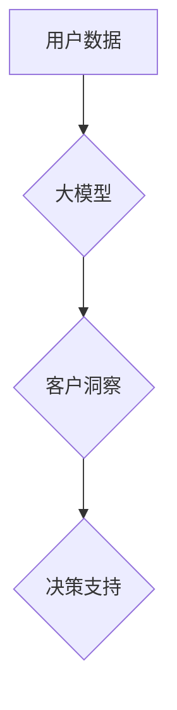

                 

## 大模型驱动的电商平台智能客户洞察

> 关键词：大模型、电商平台、客户洞察、自然语言处理、推荐系统、个性化营销、数据分析

## 1. 背景介绍

在当今数据爆炸的时代，电商平台拥有海量用户数据，这些数据蕴藏着丰富的客户洞察信息。传统的客户洞察方法往往依赖于人工分析和规则引擎，效率低下，难以捕捉到复杂的用户行为模式。近年来，大模型技术蓬勃发展，为电商平台智能客户洞察提供了强大的工具。大模型，指的是参数规模庞大、训练数据海量的人工智能模型，具备强大的泛化能力和学习能力，能够从海量数据中提取隐藏的模式和关系，为电商平台提供更精准、更全面的客户洞察。

## 2. 核心概念与联系

### 2.1 大模型

大模型是指参数数量在数十亿甚至千亿级别的人工智能模型。它们通过学习海量文本数据，掌握了语言的语法、语义和上下文理解能力。常见的代表性大模型包括GPT-3、BERT、LaMDA等。

### 2.2 电商平台客户洞察

电商平台客户洞察是指通过分析用户行为、偏好、需求等数据，深入了解用户的画像、购买习惯、消费心理等，从而为电商平台提供决策支持。

### 2.3 核心概念联系

大模型能够通过自然语言处理（NLP）技术，对电商平台的海量用户数据进行分析和理解，例如：

* **用户评论分析:**  大模型可以分析用户对商品的评论，识别出用户对商品的正面、负面评价，以及用户对商品功能、质量、价格等方面的具体反馈。
* **浏览记录分析:** 大模型可以分析用户浏览商品的历史记录，识别出用户的兴趣爱好、购买偏好，以及潜在的需求。
* **购买行为分析:** 大模型可以分析用户的购买历史记录，识别出用户的购买频率、购买金额、购买商品类别等特征，构建用户的购买画像。

通过对这些数据的分析，大模型可以为电商平台提供更精准、更全面的客户洞察，帮助电商平台进行精准营销、个性化推荐、产品优化等。

**Mermaid 流程图**



## 3. 核心算法原理 & 具体操作步骤

### 3.1 算法原理概述

大模型驱动的客户洞察主要基于以下核心算法：

* **自然语言处理（NLP）:**  用于对用户文本数据进行分析和理解，例如分词、词性标注、句法分析、语义分析等。
* **机器学习（ML）:**  用于从用户数据中学习模式和关系，例如分类、聚类、回归等。
* **深度学习（DL）:**  用于构建更复杂的模型，例如循环神经网络（RNN）、卷积神经网络（CNN）等，能够更好地捕捉用户行为的复杂性。

### 3.2 算法步骤详解

1. **数据收集:** 收集电商平台的用户数据，包括用户评论、浏览记录、购买记录、用户画像等。
2. **数据预处理:** 对收集到的数据进行清洗、格式化、标注等预处理工作，以便于模型训练。
3. **模型选择:** 根据客户洞察的需求，选择合适的 NLP、ML 或 DL 模型。
4. **模型训练:** 使用预处理后的数据训练模型，调整模型参数，使其能够准确地识别用户行为模式和关系。
5. **模型评估:** 使用测试数据评估模型的性能，例如准确率、召回率、F1-score等。
6. **模型部署:** 将训练好的模型部署到电商平台，用于实时分析用户数据并提供洞察信息。

### 3.3 算法优缺点

**优点:**

* **精准度高:** 大模型能够从海量数据中提取隐藏的模式和关系，提供更精准的客户洞察。
* **自动化程度高:** 大模型能够自动分析用户数据，无需人工干预，提高效率。
* **可扩展性强:** 大模型能够处理海量数据，随着数据量的增加，模型的性能不会明显下降。

**缺点:**

* **训练成本高:** 大模型的训练需要大量的计算资源和时间，成本较高。
* **数据依赖性强:** 大模型的性能取决于训练数据的质量和数量，如果训练数据不足或质量低，模型的性能会受到影响。
* **解释性弱:** 大模型的决策过程较为复杂，难以解释模型的决策依据。

### 3.4 算法应用领域

大模型驱动的客户洞察技术在电商平台的应用领域非常广泛，例如：

* **精准营销:** 根据用户的兴趣爱好、购买偏好等信息，进行精准的广告投放和营销活动。
* **个性化推荐:** 根据用户的浏览记录、购买历史等信息，推荐个性化的商品和服务。
* **产品优化:** 分析用户对商品的评价和反馈，改进商品的设计和功能。
* **客户服务:** 利用大模型构建智能客服系统，自动回答用户常见问题，提高客户服务效率。

## 4. 数学模型和公式 & 详细讲解 & 举例说明

### 4.1 数学模型构建

大模型驱动的客户洞察通常使用以下数学模型：

* **词嵌入模型:** 将单词映射到低维向量空间，捕捉单词之间的语义关系。常见的词嵌入模型包括Word2Vec、GloVe、FastText等。
* **用户画像模型:** 使用机器学习算法，构建用户的画像模型，例如基于用户的购买历史、浏览记录、评论等信息，构建用户的兴趣爱好、消费偏好等特征。
* **推荐模型:** 使用机器学习算法，预测用户对商品的兴趣和购买意愿，例如基于用户的历史购买记录、浏览记录、商品特征等信息，预测用户对商品的评分、点击率、购买率等。

### 4.2 公式推导过程

由于篇幅限制，这里只列举一个简单的词嵌入模型的公式：

**Word2Vec Skip-gram模型的目标函数:**

$$
J(\theta) = \frac{1}{T} \sum_{t=1}^{T} \sum_{-c \leq j \leq c, j \neq 0} \log p(w_j | w_t; \theta)
$$

其中：

* $J(\theta)$ 是目标函数，用于衡量模型的训练效果。
* $T$ 是训练语料库中词语的总数。
* $w_t$ 是上下文词语。
* $w_j$ 是目标词语。
* $c$ 是上下文窗口大小。
* $\theta$ 是模型参数。

### 4.3 案例分析与讲解

假设我们有一个电商平台，用户评论数据如下：

* “这款手机拍照效果很好。”
* “这款手机性价比高。”
* “这款手机屏幕很清晰。”

我们可以使用Word2Vec模型训练一个词嵌入模型，将这些词语映射到低维向量空间。训练完成后，我们可以观察到“拍照”、“效果”、“好”等词语的向量表示会比较接近，因为它们在语义上相关。

## 5. 项目实践：代码实例和详细解释说明

### 5.1 开发环境搭建

* Python 3.7+
* TensorFlow/PyTorch
* NLTK/SpaCy

### 5.2 源代码详细实现

```python
# 使用 TensorFlow 训练 Word2Vec 模型
from tensorflow.keras.layers import Embedding, Dense
from tensorflow.keras.models import Model

# 定义词嵌入层
embedding_layer = Embedding(input_dim=vocab_size, output_dim=embedding_dim)

# 定义模型
model = Model(inputs=input_layer, outputs=output_layer)

# 编译模型
model.compile(optimizer='adam', loss='categorical_crossentropy', metrics=['accuracy'])

# 训练模型
model.fit(train_data, train_labels, epochs=10)

# 使用训练好的模型获取词向量
word_vectors = embedding_layer.get_weights()[0]
```

### 5.3 代码解读与分析

* 首先，我们使用 TensorFlow 的 Embedding 层来构建词嵌入模型。
* 然后，我们定义一个简单的模型，将输入词语映射到输出词语。
* 接着，我们使用 Adam 优化器和交叉熵损失函数对模型进行训练。
* 最后，我们使用训练好的模型获取词向量，并可以根据词向量的相似度进行词语关系分析。

### 5.4 运行结果展示

训练完成后，我们可以使用训练好的词向量进行词语相似度分析，例如：

```python
# 计算两个词语的余弦相似度
from sklearn.metrics.pairwise import cosine_similarity

similarity = cosine_similarity(word_vector_1, word_vector_2)
print(similarity)
```

## 6. 实际应用场景

### 6.1 精准营销

大模型可以分析用户的兴趣爱好、购买偏好等信息，为电商平台提供精准营销的决策支持。例如，可以根据用户的浏览记录，推荐相关的商品广告，提高广告点击率和转化率。

### 6.2 个性化推荐

大模型可以根据用户的历史购买记录、浏览记录、商品特征等信息，预测用户对商品的兴趣和购买意愿，为用户提供个性化的商品推荐。例如，可以推荐用户可能感兴趣的新品、热销商品、搭配商品等。

### 6.3 产品优化

大模型可以分析用户对商品的评价和反馈，帮助电商平台改进商品的设计和功能。例如，可以分析用户对商品外观、性能、价格等方面的评价，并根据用户的反馈进行改进。

### 6.4 未来应用展望

随着大模型技术的不断发展，大模型驱动的客户洞察将在电商平台的应用场景中发挥更重要的作用。例如：

* **更精准的客户画像:** 大模型可以结合用户的多维数据，构建更精准的客户画像，包括用户的兴趣爱好、消费习惯、心理特征等。
* **更个性化的服务:** 大模型可以为用户提供更个性化的服务，例如个性化的商品推荐、个性化的客服服务、个性化的营销活动等。
* **更智能的运营决策:** 大模型可以帮助电商平台进行更智能的运营决策，例如商品定价、库存管理、促销策略等。

## 7. 工具和资源推荐

### 7.1 学习资源推荐

* **书籍:**
    * 《深度学习》
    * 《自然语言处理》
    * 《大模型时代》
* **在线课程:**
    * Coursera: 深度学习
    * edX: 自然语言处理
    * fast.ai: 深度学习

### 7.2 开发工具推荐

* **TensorFlow:** 开源深度学习框架
* **PyTorch:** 开源深度学习框架
* **NLTK:** 自然语言处理工具包
* **SpaCy:** 自然语言处理工具包

### 7.3 相关论文推荐

* **BERT: Pre-training of Deep Bidirectional Transformers for Language Understanding**
* **GPT-3: Language Models are Few-Shot Learners**
* **Attention Is All You Need**

## 8. 总结：未来发展趋势与挑战

### 8.1 研究成果总结

大模型驱动的客户洞察技术取得了显著的成果，能够帮助电商平台更精准地了解用户需求，提供更个性化的服务，提高运营效率。

### 8.2 未来发展趋势

* **模型规模更大:** 未来大模型的规模将会进一步扩大，参数数量将会达到数千亿甚至万亿级别。
* **模型能力更强:** 未来大模型将会具备更强的语言理解能力、推理能力和生成能力。
* **应用场景更广泛:** 大模型将会应用于电商平台的更多场景，例如智能客服、个性化推荐、产品优化等。

### 8.3 面临的挑战

* **训练成本高:** 大模型的训练需要大量的计算资源和时间，成本较高。
* **数据安全问题:** 大模型的训练需要大量的用户数据，如何保证数据的安全和隐私是一个重要的挑战。
* **模型解释性问题:** 大模型的决策过程较为复杂，难以解释模型的决策依据。

### 8.4 研究展望

未来，大模型驱动的客户洞察技术将会继续发展，并取得更大的突破。研究者们将致力于解决大模型的训练成本高、数据安全问题、模型解释性问题等挑战，并探索大模型在电商平台的更多应用场景。

## 9. 附录：常见问题与解答

**Q1: 大模型的训练需要多少数据？**

A1: 大模型的训练需要海量数据，通常需要数十亿甚至千亿级别的文本数据。

**Q2: 如何保证大模型的训练数据安全？**

A2: 为了保证大模型的训练数据安全，需要采取以下措施：

* 数据脱敏：对用户数据进行脱敏处理，去除敏感信息。
* 数据加密：对用户数据进行加密存储和传输。
* 数据访问控制：对用户数据的访问进行严格控制，只有授权人员才能访问。

**Q3: 如何解释大模型的决策结果？**

A3: 解释大模型的决策结果是一个复杂的问题，目前还没有完美的解决方案。一些研究者提出了以下方法：

* **注意力机制:** 通过分析大模型的注意力机制，可以了解模型在哪些部分关注用户数据。
* **特征重要性分析:** 通过分析大模型的特征重要性，可以了解哪些特征对模型的决策结果有重要影响。
* **可解释性模型:** 使用可解释性模型，例如决策树、规则模型等，来替代大模型，并解释模型的决策过程。


作者：禅与计算机程序设计艺术 / Zen and the Art of Computer Programming 
<end_of_turn>

