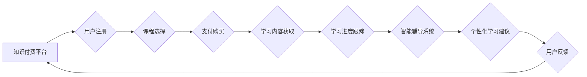

                 

## 如何利用知识付费实现在线学习与在线学习指导？

> 关键词：知识付费、在线学习、学习指导、人工智能、个性化学习、数据分析、学习平台

## 1. 背景介绍

在线教育的蓬勃发展为人们提供了便捷、灵活的学习方式。然而，传统的在线学习模式往往缺乏个性化指导和互动性，难以满足不同学习者的需求。知识付费模式的兴起为在线学习注入新的活力，它通过付费获取优质课程和学习资源，并提供更深入的学习指导和互动交流，有效提升了在线学习的效率和效果。

近年来，人工智能技术的发展为知识付费在线学习提供了强大的技术支撑。人工智能可以根据用户的学习情况，提供个性化的学习路径和内容推荐，并通过智能辅导系统，及时解答用户的疑问，提供更精准的学习指导。

## 2. 核心概念与联系

**2.1 知识付费**

知识付费是指通过付费获取知识、技能和服务的商业模式。它打破了传统知识传播的壁垒，让知识生产者和消费者能够直接连接，实现知识的价值交换。

**2.2 在线学习**

在线学习是指利用互联网技术，通过网络平台进行学习的模式。它不受时间和空间的限制，可以随时随地学习，并提供丰富的学习资源和互动功能。

**2.3 在线学习指导**

在线学习指导是指在在线学习过程中，为学习者提供个性化的学习建议、答疑解惑、学习进度跟踪等服务，帮助学习者更高效地完成学习目标。

**2.4 人工智能**

人工智能是指模拟人类智能的计算机系统。它可以学习、推理、解决问题，并根据学习到的知识，提供个性化的服务。

**2.5 个性化学习**

个性化学习是指根据用户的学习风格、兴趣、目标等特点，定制化的学习内容和学习路径。

**2.6 数据分析**

数据分析是指通过对数据进行收集、整理、分析和挖掘，以发现其中的规律和趋势，并为决策提供支持。

**2.7 学习平台**

学习平台是指提供在线学习资源、学习工具和学习服务的网络平台。

**Mermaid 流程图**



## 3. 核心算法原理 & 具体操作步骤

**3.1 算法原理概述**

知识付费在线学习平台的核心算法主要包括：

* **推荐算法:** 根据用户的学习历史、兴趣偏好、学习目标等信息，推荐个性化的课程和学习资源。
* **智能辅导算法:** 利用自然语言处理、机器学习等技术，理解用户的学习问题，并提供精准的解答和指导。
* **学习进度跟踪算法:** 跟踪用户的学习进度，分析学习情况，并提供学习建议和提醒。

**3.2 算法步骤详解**

**推荐算法:**

1. **数据收集:** 收集用户的学习历史、课程浏览记录、评价反馈等数据。
2. **数据预处理:** 对收集到的数据进行清洗、转换、特征提取等处理。
3. **模型训练:** 利用机器学习算法，训练推荐模型，例如协同过滤、内容过滤、深度学习等。
4. **推荐结果生成:** 根据用户的特征和模型预测，生成个性化的课程推荐列表。

**智能辅导算法:**

1. **问题理解:** 利用自然语言处理技术，解析用户的学习问题，识别关键词和语义。
2. **知识库检索:** 根据问题内容，从知识库中检索相关知识和答案。
3. **答案生成:** 根据检索到的知识，生成符合语境的答案，并进行逻辑推理和结构化输出。
4. **用户交互:** 与用户进行交互，解答疑问、提供补充解释、引导用户深入理解。

**学习进度跟踪算法:**

1. **学习行为记录:** 记录用户的学习时间、学习内容、学习进度等行为数据。
2. **学习状态分析:** 分析用户的学习行为数据，识别学习状态、学习效率、学习偏好等信息。
3. **学习建议生成:** 根据用户的学习状态和学习目标，生成个性化的学习建议，例如学习计划、学习资源推荐、学习技巧指导等。

**3.3 算法优缺点**

**推荐算法:**

* **优点:** 可以根据用户的个性化需求，推荐更合适的学习资源，提高学习效率。
* **缺点:** 需要大量的用户数据进行训练，算法模型的准确性依赖于数据质量。

**智能辅导算法:**

* **优点:** 可以提供及时、精准的学习指导，帮助用户解决学习难题。
* **缺点:** 算法模型的理解能力和知识库的覆盖范围有限，无法解决所有类型的学习问题。

**学习进度跟踪算法:**

* **优点:** 可以及时了解用户的学习情况，提供个性化的学习建议，帮助用户更好地掌握学习内容。
* **缺点:** 需要持续收集和分析用户的学习行为数据，算法模型需要不断优化和更新。

**3.4 算法应用领域**

* 在线教育平台
* 在线学习指导系统
* 个性化学习软件
* 智能考试系统

## 4. 数学模型和公式 & 详细讲解 & 举例说明

**4.1 数学模型构建**

推荐算法通常采用协同过滤或内容过滤模型。

* **协同过滤模型:** 基于用户的历史行为数据，预测用户对特定课程的兴趣。

$$
P(u, i) = \frac{\sum_{j \in N(u)} r_{u, j} \cdot r_{j, i}}{\sum_{j \in N(u)} r_{u, j}}
$$

其中：

* $P(u, i)$ 表示用户 $u$ 对课程 $i$ 的评分预测值。
* $r_{u, j}$ 表示用户 $u$ 对课程 $j$ 的评分。
* $N(u)$ 表示与用户 $u$ 具有相似兴趣的用户集合。

* **内容过滤模型:** 基于课程内容特征和用户的兴趣偏好，预测用户对特定课程的兴趣。

$$
P(u, i) = \sum_{f \in F} w_{u, f} \cdot v_{i, f}
$$

其中：

* $P(u, i)$ 表示用户 $u$ 对课程 $i$ 的评分预测值。
* $w_{u, f}$ 表示用户 $u$ 对特征 $f$ 的权重。
* $v_{i, f}$ 表示课程 $i$ 的特征 $f$ 的值。
* $F$ 表示所有课程特征的集合。

**4.2 公式推导过程**

上述公式的推导过程涉及到线性代数、概率统计等数学知识。

**4.3 案例分析与讲解**

假设有一个在线学习平台，包含多个课程和用户。通过收集用户的学习历史数据，可以训练协同过滤模型，预测用户对特定课程的兴趣。例如，如果用户 $A$ 和用户 $B$ 都学习了课程 $X$ 和课程 $Y$，并且对课程 $X$ 的评分都较高，那么模型可以预测用户 $A$ 也可能对课程 $Y$ 感兴趣。

## 5. 项目实践：代码实例和详细解释说明

**5.1 开发环境搭建**

* Python 3.x
* TensorFlow 或 PyTorch
* Jupyter Notebook

**5.2 源代码详细实现**

```python
# 协同过滤推荐算法示例代码

import numpy as np

# 用户-课程评分矩阵
ratings = np.array([
    [5, 4, 3, 2, 1],
    [4, 5, 2, 1, 3],
    [3, 2, 5, 4, 1],
    [2, 1, 4, 5, 3],
    [1, 3, 1, 3, 5]
])

# 计算用户相似度
def calculate_similarity(user1, user2):
    # 使用余弦相似度计算用户相似度
    return np.dot(ratings[user1], ratings[user2]) / (np.linalg.norm(ratings[user1]) * np.linalg.norm(ratings[user2]))

# 获取用户相似用户列表
def get_similar_users(user, top_k=3):
    # 计算用户与所有其他用户的相似度
    similarities = [calculate_similarity(user, i) for i in range(ratings.shape[0]) if i != user]
    # 返回相似度最高的 k 个用户
    return np.argsort(similarities)[::-1][:top_k]

# 获取推荐课程列表
def get_recommendations(user, top_k=5):
    # 获取用户相似用户列表
    similar_users = get_similar_users(user)
    # 计算用户对每个课程的评分预测值
    predictions = np.zeros(ratings.shape[1])
    for similar_user in similar_users:
        predictions += ratings[similar_user] * calculate_similarity(user, similar_user)
    # 返回评分预测值最高的 k 个课程
    return np.argsort(predictions)[::-1][:top_k]

# 获取用户 0 的推荐课程列表
recommendations = get_recommendations(0, top_k=5)
print(f"用户 0 的推荐课程列表: {recommendations}")
```

**5.3 代码解读与分析**

该代码示例实现了基于协同过滤的推荐算法。

* `calculate_similarity()` 函数计算用户之间的相似度。
* `get_similar_users()` 函数获取用户相似用户列表。
* `get_recommendations()` 函数获取用户推荐课程列表。

**5.4 运行结果展示**

运行该代码，可以得到用户 0 的推荐课程列表。

## 6. 实际应用场景

**6.1 在线教育平台**

知识付费在线学习平台可以利用推荐算法，根据用户的学习历史和兴趣偏好，推荐个性化的课程和学习资源。

**6.2 在线学习指导系统**

在线学习指导系统可以利用智能辅导算法，为用户提供及时、精准的学习指导，帮助用户解决学习难题。

**6.3 个性化学习软件**

个性化学习软件可以利用学习进度跟踪算法，跟踪用户的学习情况，提供个性化的学习建议和提醒。

**6.4 未来应用展望**

随着人工智能技术的不断发展，知识付费在线学习将更加智能化、个性化和互动化。未来，我们可以期待以下应用场景：

* **虚拟导师:** 利用人工智能技术，打造虚拟导师，为用户提供一对一学习指导。
* **沉浸式学习体验:** 利用虚拟现实和增强现实技术，打造沉浸式学习体验，提高学习兴趣和效率。
* **跨学科学习:** 利用人工智能技术，打破学科壁垒，提供跨学科的学习资源和学习路径。

## 7. 工具和资源推荐

**7.1 学习资源推荐**

* **Coursera:** https://www.coursera.org/
* **edX:** https://www.edx.org/
* **Udacity:** https://www.udacity.com/
* **Khan Academy:** https://www.khanacademy.org/

**7.2 开发工具推荐**

* **TensorFlow:** https://www.tensorflow.org/
* **PyTorch:** https://pytorch.org/
* **Jupyter Notebook:** https://jupyter.org/

**7.3 相关论文推荐**

* **Collaborative Filtering for Implicit Feedback Datasets**
* **Deep Learning for Recommender Systems**
* **Personalized Learning with Artificial Intelligence**

## 8. 总结：未来发展趋势与挑战

**8.1 研究成果总结**

知识付费在线学习结合人工智能技术，为用户提供个性化、智能化的学习体验，取得了显著成果。推荐算法、智能辅导算法、学习进度跟踪算法等技术不断发展，为在线学习提供了强大的技术支撑。

**8.2 未来发展趋势**

未来，知识付费在线学习将朝着以下方向发展：

* **更加智能化:** 利用深度学习、自然语言处理等先进技术，打造更加智能的学习助手，提供更精准、更个性化的学习指导。
* **更加个性化:** 基于用户的学习风格、兴趣偏好、学习目标等信息，定制化的学习内容和学习路径，满足不同用户的个性化需求。
* **更加互动化:** 利用虚拟现实、增强现实等技术，打造更加沉浸式、互动式的学习体验，提高学习兴趣和效率。

**8.3 面临的挑战**

知识付费在线学习也面临一些挑战：

* **数据质量:** 推荐算法和智能辅导算法的准确性依赖于数据质量，需要不断收集和清洗用户数据，保证数据准确性和完整性。
* **算法模型的复杂性:** 深度学习等算法模型的训练和部署需要强大的计算资源和技术支持。
* **用户隐私保护:** 在线学习平台需要妥善处理用户数据，保障用户隐私安全。

**8.4 研究展望**

未来，我们需要继续研究以下问题：

* 如何提高算法模型的准确性和泛化能力？
* 如何更好地利用多模态数据，例如文本、图像、音频等，为用户提供更丰富的学习体验？
* 如何保障用户数据安全和隐私？


## 9. 附录：常见问题与解答

**9.1 如何选择合适的知识付费课程？**

选择知识付费课程时，需要考虑以下因素：

* **课程内容:** 课程内容是否符合您的学习目标和兴趣？
* **课程质量:** 课程的授课老师、教学内容、学习资源等是否优质？
* **课程价格:** 课程价格是否合理？
* **学习平台:** 学习平台的口碑、服务质量、用户评价等如何？

**9.2 如何利用知识付费平台获得更好的学习效果？**

* **制定学习计划:** 制定合理的学习计划，并坚持执行。
* **积极参与互动:** 积极参与课程讨论、问答等互动环节，与老师和同学交流学习心得。
* **复习巩固:** 定期复习巩固学习内容，并进行实践应用。
* **寻求帮助:** 当遇到学习难题时，及时寻求老师或平台客服的帮助。


作者：禅与计算机程序设计艺术 / Zen and the Art of Computer Programming<end_of_turn>

