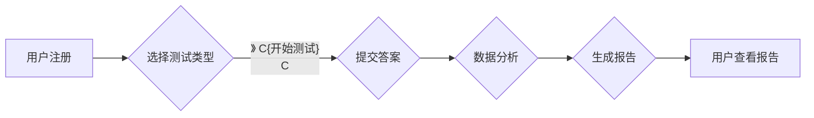

                 

## 如何利用知识付费实现在线心理测试与性格分析？

> 关键词：心理测试、性格分析、知识付费、在线平台、机器学习、数据分析、算法模型、用户体验

## 1. 背景介绍

近年来，随着互联网技术的快速发展和移动互联网的普及，人们对心理健康和自我认知的需求日益增长。在线心理测试和性格分析平台应运而生，为用户提供便捷、高效、个性化的服务。知识付费模式的兴起为在线心理测试和性格分析提供了新的商业模式，也促进了该领域的创新发展。

传统的心理测试和性格分析通常需要专业的咨询师进行线下评估，成本较高，时间也相对较长。而在线平台则打破了地域限制，降低了门槛，让更多人能够轻松获取心理测试和性格分析服务。

## 2. 核心概念与联系

**2.1 心理测试与性格分析**

心理测试是一种通过问卷、游戏、观察等方式，量化和评估个体的心理特征、认知能力、情绪状态等指标的科学方法。性格分析则是根据心理测试结果，对个体的性格特点、行为模式、价值观等进行解读和分析。

**2.2 知识付费模式**

知识付费是指以知识、技能、经验等为核心内容，通过线上平台向用户提供付费学习和获取服务的商业模式。

**2.3 在线平台架构**

在线心理测试和性格分析平台通常由以下几个模块组成：

* **用户管理模块:** 用户注册、登录、资料管理等功能。
* **测试题库模块:** 存储各种类型的测试题，并进行分类管理。
* **测试引擎模块:** 根据用户选择，自动生成测试题目，并记录用户答案。
* **数据分析模块:** 对用户测试结果进行分析，生成个性化报告。
* **支付模块:** 处理用户付费和订单管理。

**2.4 流程图**



## 3. 核心算法原理 & 具体操作步骤

**3.1 算法原理概述**

在线心理测试和性格分析的核心算法通常基于统计学、心理学和机器学习等领域。

* **统计学:** 用于分析测试数据的分布、相关性、差异等，并构建心理特征的量化指标。
* **心理学:** 提供了心理测试的设计原则、题目的选择和解读的理论基础。
* **机器学习:** 可以根据大量用户测试数据，训练模型，自动识别和预测用户的性格特征。

**3.2 算法步骤详解**

1. **数据采集:** 收集用户测试数据，包括用户回答的测试题目、个人信息、行为数据等。
2. **数据预处理:** 对数据进行清洗、转换、编码等操作，使其符合算法模型的输入要求。
3. **特征提取:** 从原始数据中提取出具有代表性的特征，例如用户对不同题目的回答倾向、时间分配、情绪表达等。
4. **模型训练:** 使用机器学习算法，例如逻辑回归、支持向量机、神经网络等，训练模型，将特征与性格特征进行映射。
5. **模型评估:** 使用测试数据评估模型的准确率、召回率、F1-score等指标，并进行调优。
6. **个性化报告生成:** 根据用户测试结果，利用训练好的模型，生成个性化的性格分析报告。

**3.3 算法优缺点**

* **优点:**

    * 自动化程度高，可以快速处理大量用户数据。
    * 能够识别出隐藏的模式和趋势，提供更深入的分析。
    * 可以根据用户数据进行个性化定制，提高用户体验。

* **缺点:**

    * 算法模型的准确性依赖于训练数据的质量和数量。
    * 算法模型可能存在偏差，需要不断进行改进和优化。
    * 缺乏对用户个体情况的全面了解，可能无法提供精准的建议。

**3.4 算法应用领域**

在线心理测试和性格分析算法广泛应用于以下领域:

* **教育:** 帮助学生了解自己的学习风格、兴趣爱好、职业倾向等。
* **招聘:** 辅助企业筛选人才，评估候选人的性格特点和职业匹配度。
* **营销:** 帮助企业了解目标用户的需求和心理特征，进行精准营销。
* **健康:** 帮助用户了解自己的情绪状态、压力水平、心理健康状况等。

## 4. 数学模型和公式 & 详细讲解 & 举例说明

**4.1 数学模型构建**

在线心理测试和性格分析的数学模型通常基于统计学和机器学习的理论。

* **统计学模型:** 可以使用多元回归、因子分析、聚类分析等方法，对用户测试数据进行分析，构建心理特征的量化指标。
* **机器学习模型:** 可以使用逻辑回归、支持向量机、神经网络等方法，训练模型，将用户特征与性格特征进行映射。

**4.2 公式推导过程**

例如，使用逻辑回归模型进行性格分析，其目标是预测用户属于某个性格类型（例如内向型或外向型）的概率。逻辑回归模型的输出是一个概率值，其计算公式如下：

$$
P(Y=1|X) = \frac{1}{1 + e^{-(w^T X + b)}}
$$

其中：

* $P(Y=1|X)$ 是用户属于性格类型 1 的概率。
* $X$ 是用户的特征向量。
* $w$ 是模型参数向量。
* $b$ 是模型偏置项。
* $e$ 是自然对数的底数。

**4.3 案例分析与讲解**

假设我们有一个包含 100 个用户的测试数据集，每个用户都有 5 个特征，例如对社交活动的兴趣、对独处时间的偏好、对冒险的渴望等。我们使用逻辑回归模型训练一个性格分析模型，预测用户是否属于内向型。

训练完成后，我们可以使用模型预测新用户的性格类型。例如，如果一个用户的特征向量为 $X = [0.2, 0.5, 0.8, 0.1, 0.3]$, 则模型预测其属于内向型的概率为：

$$
P(Y=1|X) = \frac{1}{1 + e^{-(w^T X + b)}}
$$

其中 $w$ 和 $b$ 是模型训练得到的参数。

## 5. 项目实践：代码实例和详细解释说明

**5.1 开发环境搭建**

* **操作系统:** Windows, macOS, Linux
* **编程语言:** Python
* **开发工具:** Jupyter Notebook, VS Code
* **库依赖:** pandas, scikit-learn, matplotlib, seaborn

**5.2 源代码详细实现**

```python
import pandas as pd
from sklearn.model_selection import train_test_split
from sklearn.linear_model import LogisticRegression
from sklearn.metrics import accuracy_score

# 1. 数据加载
data = pd.read_csv('personality_data.csv')

# 2. 数据预处理
X = data.drop('personality', axis=1)
y = data['personality']

# 3. 数据分割
X_train, X_test, y_train, y_test = train_test_split(X, y, test_size=0.2, random_state=42)

# 4. 模型训练
model = LogisticRegression()
model.fit(X_train, y_train)

# 5. 模型评估
y_pred = model.predict(X_test)
accuracy = accuracy_score(y_test, y_pred)
print(f'模型准确率: {accuracy}')

# 6. 新用户预测
new_user_data = pd.DataFrame([[0.2, 0.5, 0.8, 0.1, 0.3]])
predicted_personality = model.predict(new_user_data)
print(f'新用户性格预测: {predicted_personality}')
```

**5.3 代码解读与分析**

* 代码首先加载测试数据，并进行数据预处理，将特征和标签分离。
* 然后使用 `train_test_split` 函数将数据分割成训练集和测试集。
* 使用 `LogisticRegression` 模型训练模型，并使用 `accuracy_score` 函数评估模型的准确率。
* 最后，使用训练好的模型预测新用户的性格类型。

**5.4 运行结果展示**

运行代码后，会输出模型的准确率和新用户的性格预测结果。

## 6. 实际应用场景

**6.1 教育领域**

在线心理测试可以帮助学生了解自己的学习风格、兴趣爱好、职业倾向等，从而选择适合自己的学习方法和职业方向。

**6.2 招聘领域**

在线性格分析可以辅助企业筛选人才，评估候选人的性格特点和职业匹配度，提高招聘效率和准确率。

**6.3 营销领域**

在线性格分析可以帮助企业了解目标用户的需求和心理特征，进行精准营销，提高营销效果。

**6.4 未来应用展望**

随着人工智能技术的不断发展，在线心理测试和性格分析将更加智能化、个性化、精准化。未来，它可能应用于更广泛的领域，例如医疗、心理咨询、人际关系等。

## 7. 工具和资源推荐

**7.1 学习资源推荐**

* **书籍:**

    * 《Python机器学习实战》
    * 《深入理解机器学习》
    * 《统计学习方法》

* **在线课程:**

    * Coursera: 机器学习
    * edX: 数据科学
    * Udemy: Python编程

**7.2 开发工具推荐**

* **Python:** 强大的编程语言，广泛应用于数据科学和机器学习领域。
* **Jupyter Notebook:** 交互式编程环境，方便进行数据分析和模型开发。
* **VS Code:** 功能强大的代码编辑器，支持多种编程语言和插件。

**7.3 相关论文推荐**

* 《Personality Prediction Using Machine Learning》
* 《A Survey of Personality Assessment Using Machine Learning》
* 《Deep Learning for Personality Prediction》

## 8. 总结：未来发展趋势与挑战

**8.1 研究成果总结**

在线心理测试和性格分析已经取得了显著的成果，为用户提供了便捷、高效、个性化的服务。

**8.2 未来发展趋势**

* **更加智能化:** 利用深度学习等先进算法，提高模型的准确性和预测能力。
* **更加个性化:** 根据用户的个人特征和需求，提供更加精准的分析和建议。
* **更加多元化:** 扩展测试内容和分析维度，涵盖更广泛的心理特征和行为模式。

**8.3 面临的挑战**

* **数据质量:** 算法模型的准确性依赖于训练数据的质量和数量，需要不断收集和完善数据。
* **算法偏差:** 算法模型可能存在偏差，需要不断进行改进和优化，确保公平性和准确性。
* **用户隐私:** 需要保护用户的隐私信息，确保数据安全和合规性。

**8.4 研究展望**

未来，在线心理测试和性格分析将继续朝着更加智能化、个性化、多元化的方向发展，为用户提供更加全面、深入、有价值的服务。


## 9. 附录：常见问题与解答

**9.1  测试结果的准确性如何保证？**

测试结果的准确性取决于多个因素，包括测试题库的质量、算法模型的训练效果、用户的真实回答等。我们不断完善测试题库，优化算法模型，并对用户数据进行严格的清洗和处理，以提高测试结果的准确性。

**9.2  我的个人信息是否安全？**

我们非常重视用户的隐私安全，会采取严格的措施保护用户的个人信息。用户数据将加密存储，并不会被用于任何其他目的。

**9.3  如何使用测试结果？**

测试结果可以帮助用户了解自己的性格特点、行为模式、兴趣爱好等，从而更好地了解自己，做出更明智的决策。

**9.4  测试结果是否可以作为诊断依据？**

我们的测试结果仅供参考，不能作为诊断依据。如果您有任何心理健康问题，请咨询专业的医生或心理咨询师。


作者：禅与计算机程序设计艺术 / Zen and the Art of Computer Programming 
<end_of_turn>

