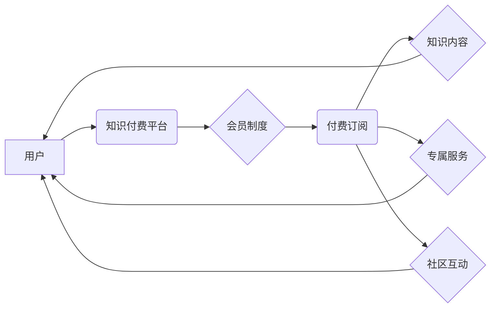

                 

## 如何设计有吸引力的知识付费会员制度

> 关键词：知识付费、会员制度、用户运营、内容策略、商业模式、数据分析、社区建设

### 1. 背景介绍

知识付费作为一种新型的商业模式，近年来发展迅速，成为互联网经济的重要组成部分。随着人们对知识的需求不断增长，以及互联网平台的普及，知识付费市场呈现出巨大的发展潜力。

知识付费会员制度是知识付费模式中的一种重要形式，它通过提供持续更新的内容和服务，吸引用户付费订阅，从而实现可持续的收入增长。然而，如何设计一个有吸引力的知识付费会员制度，是众多知识付费平台面临的共同挑战。

### 2. 核心概念与联系

**2.1 核心概念**

* **知识付费:** 指的是用户通过付费的方式获取知识、技能或其他有价值的信息。
* **会员制度:** 指的是一种基于订阅的商业模式，用户通过付费成为会员，可以享受一系列专属的权益和服务。
* **知识付费会员制度:** 将知识付费和会员制度相结合，用户通过付费订阅，可以获得持续更新的知识内容、专属服务和社区互动等权益。

**2.2 架构关系**



**2.3 核心联系**

知识付费会员制度的核心在于提供持续价值，吸引用户长期付费。平台需要根据用户的需求，提供高质量的知识内容、个性化的服务和活跃的社区互动，才能构建一个可持续的商业生态。

### 3. 核心算法原理 & 具体操作步骤

**3.1 算法原理概述**

知识付费会员制度的设计需要考虑用户行为分析、内容推荐算法、个性化服务策略等多个方面。

* **用户行为分析:** 通过分析用户的学习习惯、兴趣偏好、付费意愿等数据，了解用户的需求和痛点，为用户提供更精准的内容和服务。
* **内容推荐算法:** 基于用户的历史行为和兴趣标签，推荐用户可能感兴趣的知识内容，提高用户粘性和付费转化率。
* **个性化服务策略:** 根据用户的不同需求和付费等级，提供不同的服务和权益，例如不同等级的课程、专属答疑、线下活动等。

**3.2 算法步骤详解**

1. **数据收集:** 收集用户的注册信息、学习记录、付费行为、评价反馈等数据。
2. **数据清洗:** 对收集到的数据进行清洗和处理，去除无效数据和重复数据。
3. **特征提取:** 从用户数据中提取特征，例如学习时长、学习进度、兴趣标签、付费等级等。
4. **模型训练:** 使用机器学习算法，训练用户行为预测模型、内容推荐模型、个性化服务模型等。
5. **模型评估:** 对训练好的模型进行评估，调整模型参数，提高模型精度。
6. **模型部署:** 将训练好的模型部署到线上环境，实时进行用户行为分析、内容推荐和个性化服务。

**3.3 算法优缺点**

* **优点:** 能够精准分析用户需求，提供个性化服务，提高用户粘性和付费转化率。
* **缺点:** 需要大量的用户数据进行训练，模型训练和部署成本较高，算法需要不断优化和更新。

**3.4 算法应用领域**

* **在线教育:** 推荐课程、个性化学习路径、智能答疑等。
* **内容平台:** 推荐文章、视频、音频等内容，提高用户粘性和付费转化率。
* **电商平台:** 推荐商品、个性化促销活动、会员权益等。

### 4. 数学模型和公式 & 详细讲解 & 举例说明

**4.1 数学模型构建**

知识付费会员制度的商业模式可以抽象为一个用户价值模型，该模型可以表示为：

$$
User Value = Content Value + Service Value + Community Value
$$

其中：

* **User Value:** 用户感知到的价值，即用户愿意为该会员制度付费的程度。
* **Content Value:** 知识内容的价值，包括内容质量、更新频率、知识深度等因素。
* **Service Value:** 专属服务的价值，包括个性化答疑、线下活动、会员折扣等因素。
* **Community Value:** 社区互动带来的价值，包括知识分享、交流学习、建立人脉等因素。

**4.2 公式推导过程**

用户价值模型的推导过程基于以下假设：

* 用户会根据感知到的价值来决定是否付费订阅。
* 不同类型的价值对不同用户具有不同的吸引力。
* 平台可以通过优化内容、服务和社区互动，提升用户感知到的价值。

**4.3 案例分析与讲解**

假设一个在线教育平台，其会员制度分为三个等级：基础、标准、高级。

* **基础会员:** 提供免费的课程和基础服务。
* **标准会员:** 提供付费课程、个性化答疑和线上社区互动。
* **高级会员:** 提供VIP课程、线下活动和专属导师指导。

根据用户价值模型，我们可以分析不同会员等级的用户价值：

* **基础会员:** 用户感知到的价值主要来自免费课程，付费意愿较低。
* **标准会员:** 用户感知到的价值来自付费课程、个性化答疑和社区互动，付费意愿较高。
* **高级会员:** 用户感知到的价值来自VIP课程、线下活动和专属导师指导，付费意愿最高。

平台可以通过优化不同会员等级的价值，吸引不同类型的用户付费订阅。例如，可以增加高级会员的专属福利，提高其付费意愿。

### 5. 项目实践：代码实例和详细解释说明

**5.1 开发环境搭建**

* 操作系统: Ubuntu 20.04 LTS
* 编程语言: Python 3.8
* 开发框架: Django 3.2
* 数据库: PostgreSQL 13

**5.2 源代码详细实现**

```python
# models.py
from django.db import models

class User(models.Model):
    username = models.CharField(max_length=255)
    email = models.EmailField()
    # ... 其他用户属性

class Course(models.Model):
    title = models.CharField(max_length=255)
    description = models.TextField()
    # ... 其他课程属性

class Membership(models.Model):
    user = models.ForeignKey(User, on_delete=models.CASCADE)
    level = models.CharField(max_length=255, choices=[('basic', '基础'), ('standard', '标准'), ('premium', '高级')])
    start_date = models.DateTimeField()
    end_date = models.DateTimeField()

# views.py
from django.shortcuts import render
from .models import User, Course, Membership

def course_list(request):
    courses = Course.objects.all()
    return render(request, 'course_list.html', {'courses': courses})

def membership_create(request):
    # ... 处理会员创建逻辑
    return redirect('course_list')
```

**5.3 代码解读与分析**

* **models.py:** 定义了用户、课程和会员模型，用于存储用户数据、课程信息和会员订阅信息。
* **views.py:** 定义了课程列表页面和会员创建页面，用于处理用户请求和渲染页面。

**5.4 运行结果展示**

运行上述代码，可以搭建一个简单的知识付费平台，用户可以浏览课程列表，并选择创建会员订阅。

### 6. 实际应用场景

知识付费会员制度广泛应用于各个领域，例如：

* **在线教育:** 课程订阅、专业技能培训、学历提升等。
* **内容平台:** 文章订阅、视频会员、音频付费等。
* **游戏行业:** 游戏道具、虚拟货币、会员权益等。
* **科技领域:** 软件订阅、技术文档、在线社区等。

**6.4 未来应用展望**

随着人工智能、大数据和云计算技术的不断发展，知识付费会员制度将更加智能化、个性化和多元化。

* **人工智能驱动的个性化推荐:** 基于用户的学习行为和兴趣偏好，提供更精准的知识内容推荐。
* **虚拟现实和增强现实技术的应用:** 打造沉浸式的学习体验，提升用户参与度和学习效果。
* **区块链技术的应用:** 实现知识产权保护和数据安全，构建更加透明和可信赖的知识付费生态。

### 7. 工具和资源推荐

**7.1 学习资源推荐**

* **书籍:** 《会员制商业模式》、《知识付费的商业模式》
* **在线课程:** Coursera、Udemy、edX等平台上的知识付费课程
* **博客和论坛:** 知乎、CSDN等平台上的知识付费相关文章和讨论

**7.2 开发工具推荐**

* **开发框架:** Django、Flask、Ruby on Rails等
* **数据库:** MySQL、PostgreSQL、MongoDB等
* **云平台:** AWS、Azure、GCP等

**7.3 相关论文推荐**

* **知识付费商业模式研究**
* **会员制度的优化设计**
* **人工智能在知识付费中的应用**

### 8. 总结：未来发展趋势与挑战

**8.1 研究成果总结**

知识付费会员制度是一种有效的商业模式，能够为用户提供持续的价值，并为平台实现可持续发展。通过优化内容、服务和社区互动，平台可以吸引更多用户付费订阅，构建一个更加健康的知识付费生态。

**8.2 未来发展趋势**

未来，知识付费会员制度将更加智能化、个性化和多元化，人工智能、大数据和云计算技术将推动知识付费的创新发展。

**8.3 面临的挑战**

知识付费会员制度也面临着一些挑战，例如：

* **内容质量控制:** 确保知识内容的质量和权威性。
* **用户粘性提升:** 提高用户付费意愿和持续订阅率。
* **商业模式创新:** 探索新的商业模式，实现可持续发展。

**8.4 研究展望**

未来研究方向包括：

* **人工智能驱动的个性化学习路径推荐**
* **虚拟现实和增强现实技术的应用**
* **区块链技术的应用**
* **知识付费生态系统建设**

### 9. 附录：常见问题与解答

* **如何选择合适的会员制度等级？**

根据用户的需求和付费意愿，选择合适的会员制度等级。

* **如何提高用户付费转化率？**

提供高质量的知识内容、个性化的服务和活跃的社区互动，提升用户感知到的价值。

* **如何应对知识付费市场竞争？**

不断创新内容和服务，打造差异化竞争优势。

作者：禅与计算机程序设计艺术 / Zen and the Art of Computer Programming


<end_of_turn>

