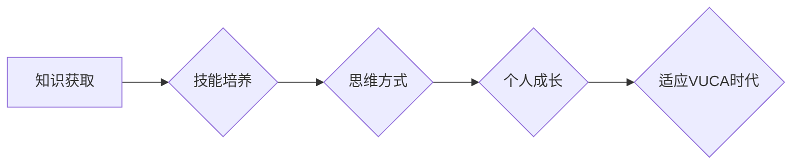

                 

## 学习体系：VUCA时代的重要技能

> 关键词：VUCA时代、学习体系、人工智能、编程、软件架构、数据分析、机器学习、深度学习

### 1. 背景介绍

当今世界正处于一个充满变革和不确定性的时代，被广泛称为VUCA时代。VUCA是一个首字母缩略词，代表着**复杂性（Volatility）、不确定性（Uncertainty）、模糊性（Ambiguity）和变化率（Complexity）**。在这个时代，传统学习模式和技能体系已经难以适应快速变化的科技发展和市场需求。

为了在VUCA时代取得成功，我们需要建立一个全新的学习体系，培养适应变化、解决问题、持续创新的能力。这个学习体系需要具备以下特点：

* **敏捷性:** 能够快速学习新知识和技能，并将其应用于实际工作中。
* **跨学科性:** 能够将不同领域的知识和技能进行整合，解决复杂问题。
* **实践性:** 强调将理论知识转化为实际应用，注重动手实践能力。
* **终身学习:** 认识到学习是一个持续的过程，需要终身保持学习的热情和动力。

### 2. 核心概念与联系

**2.1 VUCA时代特点**

* **复杂性:**  全球化、信息化、网络化等因素导致世界变得更加复杂，问题更加难以预测和解决。
* **不确定性:**  科技发展、经济波动、社会变革等因素带来不确定性，未来充满了未知。
* **模糊性:**  信息爆炸、价值观多元化等因素导致信息界限模糊，难以清晰判断是非对错。
* **变化率:**  科技进步、市场竞争、社会需求等因素导致变化速度加快，需要不断适应新的环境和挑战。

**2.2 学习体系与VUCA时代的关系**

VUCA时代对学习提出了更高的要求，传统的学习模式已经无法满足需求。我们需要建立一个新的学习体系，帮助人们适应变化、解决问题、持续创新。

**2.3  学习体系核心要素**

* **知识获取:**  通过阅读、学习、实践等方式获取知识，并将其转化为技能。
* **技能培养:**  掌握解决问题、分析数据、编程等关键技能，并不断提升技能水平。
* **思维方式:**  培养批判性思维、创造性思维、系统思维等，能够独立思考、解决问题。
* **个人成长:**  不断提升自我认知、学习能力、适应能力等，实现个人价值。

**2.4  学习体系架构**



### 3. 核心算法原理 & 具体操作步骤

**3.1 算法原理概述**

在VUCA时代，数据分析和机器学习算法成为解决复杂问题和做出智能决策的关键工具。 

**3.2 算法步骤详解**

1. **数据收集:**  从各种来源收集相关数据，例如传感器数据、社交媒体数据、财务数据等。
2. **数据预处理:**  对收集到的数据进行清洗、转换、整合等操作，使其符合算法的输入要求。
3. **特征工程:**  从原始数据中提取有价值的特征，这些特征能够帮助算法更好地理解数据。
4. **模型选择:**  根据具体问题和数据特点选择合适的机器学习算法，例如线性回归、逻辑回归、决策树、支持向量机、神经网络等。
5. **模型训练:**  使用训练数据训练选择的算法模型，使其能够学习数据中的规律和模式。
6. **模型评估:**  使用测试数据评估模型的性能，例如准确率、召回率、F1-score等。
7. **模型优化:**  根据评估结果对模型进行调整和优化，提高模型的性能。
8. **模型部署:**  将训练好的模型部署到实际应用场景中，用于预测、分类、聚类等任务。

**3.3 算法优缺点**

* **优点:**  能够自动学习数据中的规律，提高决策效率和准确性。
* **缺点:**  需要大量的数据进行训练，对数据质量要求高，算法解释性较差。

**3.4 算法应用领域**

* **金融:**  欺诈检测、风险评估、投资预测
* **医疗:**  疾病诊断、药物研发、患者个性化治疗
* **电商:**  商品推荐、用户画像、精准营销
* **交通:**  交通流量预测、智能驾驶、物流优化

### 4. 数学模型和公式 & 详细讲解 & 举例说明

**4.1 数学模型构建**

机器学习算法通常基于数学模型进行构建，这些模型能够描述数据之间的关系和规律。例如，线性回归模型假设数据之间存在线性关系，可以使用以下公式进行描述：

$$y = mx + c$$

其中：

* $y$ 是预测值
* $x$ 是输入特征
* $m$ 是斜率
* $c$ 是截距

**4.2 公式推导过程**

线性回归模型的系数 $m$ 和 $c$ 可以通过最小二乘法进行求解，其目标是找到使得预测值与实际值误差最小的参数值。

**4.3 案例分析与讲解**

假设我们想要预测房屋价格，输入特征包括房屋面积、房间数量、地理位置等。我们可以使用线性回归模型构建一个数学模型，将这些特征与房屋价格进行关联。通过训练模型，我们可以得到一个预测房屋价格的公式，例如：

$$价格 = 5000 * 面积 + 100000 * 房间数量 + 地理位置系数$$

其中，地理位置系数可以根据不同区域的房价差异进行调整。

### 5. 项目实践：代码实例和详细解释说明

**5.1 开发环境搭建**

* Python 3.x
* Jupyter Notebook 或 VS Code
* 机器学习库：Scikit-learn

**5.2 源代码详细实现**

```python
from sklearn.linear_model import LinearRegression
import pandas as pd

# 加载数据
data = pd.read_csv('house_price_data.csv')

# 选择特征和目标变量
X = data[['面积', '房间数量']]
y = data['价格']

# 创建线性回归模型
model = LinearRegression()

# 训练模型
model.fit(X, y)

# 预测新房子的价格
new_house = pd.DataFrame({'面积': [100], '房间数量': [3]})
predicted_price = model.predict(new_house)

# 打印预测结果
print(predicted_price)
```

**5.3 代码解读与分析**

* 首先，我们加载数据并选择特征和目标变量。
* 然后，我们创建线性回归模型并使用训练数据进行训练。
* 训练完成后，我们可以使用模型预测新房子的价格。

**5.4 运行结果展示**

运行代码后，会输出预测的新房子的价格。

### 6. 实际应用场景

**6.1 房屋价格预测**

使用机器学习算法可以预测房屋价格，帮助房地产经纪人、买家和卖家做出更明智的决策。

**6.2 股票价格预测**

使用机器学习算法可以分析股票市场数据，预测股票价格走势，帮助投资者进行投资决策。

**6.3 欺诈检测**

使用机器学习算法可以分析交易数据，识别异常交易行为，帮助金融机构预防欺诈。

**6.4 未来应用展望**

随着人工智能技术的不断发展，机器学习算法将在更多领域得到应用，例如医疗诊断、个性化教育、自动驾驶等。

### 7. 工具和资源推荐

**7.1 学习资源推荐**

* **书籍:**
    * 《Python机器学习》
    * 《机器学习实战》
    * 《深度学习》
* **在线课程:**
    * Coursera
    * edX
    * Udacity

**7.2 开发工具推荐**

* **Python:**  Python是一种流行的编程语言，广泛用于机器学习开发。
* **Scikit-learn:**  Scikit-learn是一个开源的机器学习库，提供各种算法和工具。
* **TensorFlow:**  TensorFlow是一个开源的深度学习框架，用于构建和训练深度神经网络。

**7.3 相关论文推荐**

* 《ImageNet Classification with Deep Convolutional Neural Networks》
* 《Attention Is All You Need》
* 《BERT: Pre-training of Deep Bidirectional Transformers for Language Understanding》

### 8. 总结：未来发展趋势与挑战

**8.1 研究成果总结**

近年来，人工智能领域取得了显著进展，机器学习算法在各个领域得到了广泛应用。

**8.2 未来发展趋势**

* **模型更加复杂:**  深度学习模型将变得更加复杂，能够处理更复杂的数据和任务。
* **算法更加高效:**  算法训练速度和效率将得到提升，能够处理更大规模的数据集。
* **应用更加广泛:**  机器学习算法将应用于更多领域，例如医疗、教育、金融等。

**8.3 面临的挑战**

* **数据隐私和安全:**  机器学习算法需要大量数据进行训练，如何保护数据隐私和安全是一个重要的挑战。
* **算法解释性:**  许多机器学习算法的决策过程难以解释，如何提高算法的解释性是一个重要的研究方向。
* **伦理问题:**  人工智能技术的快速发展引发了一些伦理问题，例如算法偏见、工作岗位替代等，需要认真思考和解决。

**8.4 研究展望**

未来，人工智能研究将继续朝着更加智能、更加安全、更加可解释的方向发展。


### 9. 附录：常见问题与解答

**9.1 如何选择合适的机器学习算法？**

选择合适的机器学习算法取决于具体问题和数据特点。例如，对于分类问题，可以考虑使用逻辑回归、支持向量机、决策树等算法；对于回归问题，可以考虑使用线性回归、支持向量回归等算法。

**9.2 如何评估机器学习模型的性能？**

可以使用准确率、召回率、F1-score等指标评估机器学习模型的性能。

**9.3 如何解决机器学习算法的过拟合问题？**

过拟合是指模型对训练数据过拟合，导致在测试数据上表现不佳。可以使用正则化、交叉验证等方法来解决过拟合问题。


作者：禅与计算机程序设计艺术 / Zen and the Art of Computer Programming 
<end_of_turn>

