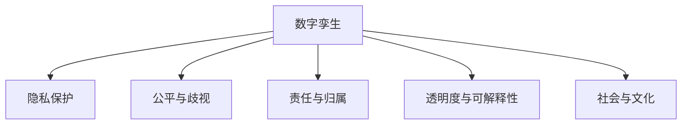

                 

# 元宇宙数字孪生伦理:现实映射的道德边界探讨

## 1. 背景介绍

### 1.1 问题由来
随着科技的飞速发展，人类进入了一个全新的时代——元宇宙时代。元宇宙，作为虚拟与现实深度融合的产物，正在逐渐改变着我们的生活、工作以及思维方式。然而，伴随着元宇宙的兴起，也产生了一系列伦理和道德问题，其中数字孪生（Digital Twin）技术在元宇宙中的应用尤为引人注目。数字孪生是一种在虚拟空间中构建与现实世界完全相同、可实时更新的虚拟实体，它的广泛应用带来了前所未有的便利，但同时也对现实社会的道德边界提出了挑战。

### 1.2 问题核心关键点
当前，数字孪生技术在元宇宙中的应用日益广泛，涵盖从医疗、教育、金融到城市治理等多个领域。然而，随着其深入应用，一些潜在的伦理问题逐渐凸显出来。这些问题主要集中在：

- **隐私与安全**：数字孪生模型需要大量个人信息，如何保护用户隐私，避免信息泄露和安全风险？
- **公平与歧视**：数字孪生模型是否可能因训练数据的偏差而产生偏见，导致算法歧视？
- **责任与归属**：数字孪生模型在决策过程中出现错误，责任应该由谁承担？
- **透明度与可解释性**：数字孪生模型的决策过程是否透明，是否可解释？
- **社会与文化**：数字孪生模型如何适应不同文化和社会背景，避免文化冲突？

这些伦理问题不仅关乎数字孪生的发展，更关乎人类社会的未来。本文将从这些核心关键点出发，深入探讨元宇宙数字孪生的伦理道德边界，为未来数字孪生的发展提供参考。

## 2. 核心概念与联系

### 2.1 核心概念概述

为更好地理解元宇宙数字孪生的伦理问题，本节将介绍几个密切相关的核心概念：

- **数字孪生（Digital Twin）**：一种在虚拟空间中构建与现实世界完全相同、可实时更新的虚拟实体。通过数字孪生技术，我们可以在虚拟空间中模拟现实世界，实现对物理世界的数字化管理。

- **元宇宙（Metaverse）**：一个由虚拟世界与现实世界深度融合的3D网络环境，用户可以在其中进行虚拟互动、社交、工作等活动。元宇宙是数字孪生的重要应用场景之一。

- **隐私（Privacy）**：保护个人信息，防止未经授权的访问和使用。在数字孪生中，隐私保护尤为重要，因为模型需要大量的个人信息。

- **公平与歧视（Fairness & Bias）**：数字孪生模型在训练和应用过程中，是否存在算法偏见，导致某些群体被不公平对待。

- **责任与归属（Liability）**：数字孪生模型在决策过程中出现错误，导致损害或损失，责任应由谁承担？

- **透明度与可解释性（Transparency & Explainability）**：数字孪生模型的决策过程是否透明，是否可解释？

- **社会与文化（Society & Culture）**：数字孪生模型在应用过程中，如何适应不同文化和社会背景，避免文化冲突？

这些核心概念之间的逻辑关系可以通过以下Mermaid流程图来展示：



这个流程图展示了大语言模型的核心概念及其之间的关系：

1. 数字孪生技术是核心，通过在虚拟空间中构建现实世界实体，实现虚拟与现实的融合。
2. 隐私保护、公平与歧视、责任与归属、透明度与可解释性、社会与文化等伦理问题，是数字孪生技术应用过程中必须面对的关键挑战。
3. 这些挑战相互交织，共同构成了数字孪生技术的伦理道德边界。

## 3. 核心算法原理 & 具体操作步骤
### 3.1 算法原理概述

元宇宙数字孪生技术的核心算法原理，主要包括数据收集、模型训练、虚拟仿真以及决策推理等步骤。其中，隐私保护、公平与歧视、责任与归属、透明度与可解释性、社会与文化等伦理问题，贯穿于整个流程。

- **数据收集**：数字孪生模型需要大量的现实世界数据，以实现对现实世界的全面模拟。在这一过程中，如何收集和保护用户隐私，避免信息泄露和安全风险，是首要考虑的问题。

- **模型训练**：数字孪生模型通常基于深度学习等算法进行训练，以学习现实世界的复杂规律。在这一过程中，如何避免算法偏见，实现公平与歧视，是一个重要的研究方向。

- **虚拟仿真**：数字孪生模型通过在虚拟空间中模拟现实世界，实现对现实世界的实时更新和互动。在这一过程中，如何确保决策的透明度和可解释性，避免算法偏见，是一个关键的挑战。

- **决策推理**：数字孪生模型在虚拟空间中进行决策推理，以指导现实世界的行动。在这一过程中，如何确定决策的责任归属，避免社会与文化冲突，是必须面对的伦理问题。

### 3.2 算法步骤详解

元宇宙数字孪生技术的核心算法步骤包括：

**Step 1: 数据收集与预处理**
- 收集现实世界的各种数据，包括传感器数据、图像、文本、语音等。
- 对数据进行清洗和预处理，去除噪声和无用数据，确保数据质量。
- 采用差分隐私等技术，保护用户隐私，防止信息泄露。

**Step 2: 模型训练与优化**
- 选择适合的深度学习模型，如CNN、RNN、GAN等，进行模型训练。
- 在训练过程中，采用公平性约束等技术，避免算法偏见。
- 对模型进行调优，提高模型性能和稳定性。

**Step 3: 虚拟仿真与实时更新**
- 在虚拟空间中构建数字孪生模型，实现对现实世界的模拟。
- 通过实时更新的机制，保证虚拟模型的数据与现实世界同步。
- 在仿真过程中，确保决策过程的透明度和可解释性。

**Step 4: 决策推理与反馈**
- 基于数字孪生模型进行决策推理，指导现实世界的行动。
- 对决策结果进行反馈和优化，不断提升模型性能。
- 确保决策过程符合伦理标准，避免社会与文化冲突。

### 3.3 算法优缺点

元宇宙数字孪生技术的核心算法具有以下优点：

- **全面模拟**：数字孪生技术可以实现对现实世界的全面模拟，提高决策的科学性和准确性。
- **实时更新**：数字孪生技术通过实时更新的机制，保持虚拟模型的数据与现实世界同步，实现动态管理。
- **可解释性**：数字孪生技术的决策过程具有可解释性，便于理解和管理。

同时，该算法也存在以下局限性：

- **数据依赖**：数字孪生模型需要大量的现实世界数据，数据质量和使用方式对模型性能有重大影响。
- **偏见与歧视**：模型训练过程中，如果数据存在偏差，可能导致算法偏见，造成歧视。
- **安全性风险**：数据收集和处理过程中，存在信息泄露和安全风险，需要采取措施保护用户隐私。
- **复杂性高**：数字孪生模型涉及多领域多学科知识，开发和维护复杂，成本较高。

尽管存在这些局限性，但就目前而言，数字孪生技术仍是元宇宙发展的重要推动力，具有广阔的应用前景。未来相关研究的方向，主要集中在如何降低数据依赖，提高模型公平性，增强安全性，以及简化模型架构等方面。

### 3.4 算法应用领域

数字孪生技术在元宇宙中的广泛应用，带来了诸多新的应用场景，例如：

- **智能城市**：通过数字孪生技术，构建智慧城市的虚拟模型，实现对城市交通、能源、环境等各方面的实时监控和管理。
- **医疗健康**：通过数字孪生技术，构建虚拟患者模型，实现对患者病情的实时监控和精准治疗。
- **教育培训**：通过数字孪生技术，构建虚拟学习环境，实现个性化学习和虚拟实验。
- **金融服务**：通过数字孪生技术，构建虚拟市场模型，实现对金融市场的实时监控和风险评估。
- **文化遗产保护**：通过数字孪生技术，构建虚拟文物模型，实现对文化遗产的数字化保护和传承。

这些应用场景展示了数字孪生技术在元宇宙中的巨大潜力和广泛应用前景。

## 4. 数学模型和公式 & 详细讲解  
### 4.1 数学模型构建

本节将使用数学语言对元宇宙数字孪生技术的伦理问题进行更加严格的刻画。

假设现实世界的数据集为 $D=\{(x_i,y_i)\}_{i=1}^N$，其中 $x_i$ 为输入数据，$y_i$ 为输出标签。数字孪生模型的目标是最小化经验风险 $\mathcal{L}(\theta)$，其中 $\theta$ 为模型参数。假设模型为 $M_{\theta}(x_i)$，则损失函数定义为：

$$
\mathcal{L}(\theta) = \frac{1}{N}\sum_{i=1}^N \ell(M_{\theta}(x_i),y_i)
$$

其中 $\ell$ 为损失函数，如均方误差、交叉熵等。

### 4.2 公式推导过程

以下我们以公平性约束为例，推导公平性损失函数的计算过程。

假设模型在训练过程中存在偏见，导致不同群体间的性能差异过大。为了解决这个问题，可以引入公平性约束，使得模型在各个群体上的性能差异不超过预设阈值。假设模型在群体 $G_k$ 上的性能差异为 $\Delta_k$，则公平性损失函数定义为：

$$
\mathcal{L}_{fair}(\theta) = \sum_{k=1}^K \lambda_k \Delta_k
$$

其中 $K$ 为群体的数量，$\lambda_k$ 为群体的权重。公平性约束的实现，可以通过在损失函数中添加公平性惩罚项来实现，如下所示：

$$
\mathcal{L}(\theta) = \mathcal{L}_0(\theta) + \mathcal{L}_{fair}(\theta)
$$

其中 $\mathcal{L}_0(\theta)$ 为原始损失函数，$\mathcal{L}_{fair}(\theta)$ 为公平性惩罚项。在训练过程中，优化器会同时最小化原始损失函数和公平性损失函数，从而实现公平性约束。

### 4.3 案例分析与讲解

以下是一个具体案例，演示如何在医疗健康领域应用数字孪生技术，并解决其伦理问题。

**案例背景**：
假设某医院希望通过数字孪生技术，实现对患者病情的实时监控和精准治疗。医院需要收集患者的医疗数据，包括病历、影像、基因等。

**伦理问题**：
- **隐私保护**：医院需要收集大量患者数据，如何保护患者隐私，防止信息泄露？
- **公平与歧视**：医院需要构建数字孪生模型，用于病情的预测和治疗。如果模型存在偏见，是否会导致某些群体被不公平对待？
- **责任与归属**：如果数字孪生模型在决策过程中出现错误，导致误诊或误治，责任应由谁承担？
- **透明度与可解释性**：医院需要向患者和医生解释数字孪生模型的决策过程，是否具有可解释性？
- **社会与文化**：数字孪生模型是否适应不同文化和社会背景，避免文化冲突？

**解决方案**：
- **隐私保护**：采用差分隐私等技术，保护患者隐私，防止信息泄露。
- **公平与歧视**：在模型训练过程中，引入公平性约束，避免算法偏见，实现公平与歧视。
- **责任与归属**：明确数字孪生模型的责任归属，制定相应的责任机制。
- **透明度与可解释性**：采用可解释性技术，确保数字孪生模型的决策过程透明，便于理解和管理。
- **社会与文化**：根据不同文化和社会背景，设计符合当地文化的数字孪生模型，避免文化冲突。

## 5. 项目实践：代码实例和详细解释说明
### 5.1 开发环境搭建

在进行数字孪生技术开发前，我们需要准备好开发环境。以下是使用Python进行PyTorch开发的环境配置流程：

1. 安装Anaconda：从官网下载并安装Anaconda，用于创建独立的Python环境。

2. 创建并激活虚拟环境：
```bash
conda create -n pytorch-env python=3.8 
conda activate pytorch-env
```

3. 安装PyTorch：根据CUDA版本，从官网获取对应的安装命令。例如：
```bash
conda install pytorch torchvision torchaudio cudatoolkit=11.1 -c pytorch -c conda-forge
```

4. 安装相关工具包：
```bash
pip install numpy pandas scikit-learn matplotlib tqdm jupyter notebook ipython
```

完成上述步骤后，即可在`pytorch-env`环境中开始数字孪生技术开发。

### 5.2 源代码详细实现

下面以医疗健康领域的数字孪生模型为例，给出使用PyTorch实现的代码实例。

首先，定义模型和数据：

```python
from torch import nn
from torch.utils.data import Dataset, DataLoader
import torch.nn.functional as F

class MedicalData(Dataset):
    def __init__(self, X, y):
        self.X = X
        self.y = y

    def __len__(self):
        return len(self.X)

    def __getitem__(self, item):
        return self.X[item], self.y[item]

# 假设数据集已构建完成，X为输入数据，y为输出标签
X = ...
y = ...
dataset = MedicalData(X, y)
```

然后，定义模型和损失函数：

```python
class MedicalModel(nn.Module):
    def __init__(self):
        super(MedicalModel, self).__init__()
        self.fc1 = nn.Linear(128, 64)
        self.fc2 = nn.Linear(64, 1)
        self.relu = nn.ReLU()

    def forward(self, x):
        x = self.fc1(x)
        x = self.relu(x)
        x = self.fc2(x)
        return x

# 定义损失函数
criterion = nn.MSELoss()

# 定义模型和优化器
model = MedicalModel()
optimizer = torch.optim.Adam(model.parameters(), lr=0.001)
```

接着，定义训练和评估函数：

```python
def train_epoch(model, data_loader, optimizer):
    model.train()
    for i, (inputs, labels) in enumerate(data_loader):
        optimizer.zero_grad()
        outputs = model(inputs)
        loss = criterion(outputs, labels)
        loss.backward()
        optimizer.step()
    return loss.item()

def evaluate(model, data_loader):
    model.eval()
    total_loss = 0
    with torch.no_grad():
        for inputs, labels in data_loader:
            outputs = model(inputs)
            loss = criterion(outputs, labels)
            total_loss += loss.item()
    return total_loss / len(data_loader)

# 训练和评估
for epoch in range(num_epochs):
    loss = train_epoch(model, data_loader_train, optimizer)
    print(f'Epoch {epoch+1}, Loss: {loss:.4f}')

    loss = evaluate(model, data_loader_test)
    print(f'Test Loss: {loss:.4f}')
```

以上就是使用PyTorch实现数字孪生模型的完整代码实例。可以看到，代码实现相对简单，适合快速迭代研究。

### 5.3 代码解读与分析

让我们再详细解读一下关键代码的实现细节：

**MedicalData类**：
- `__init__`方法：初始化数据集，保存输入数据和输出标签。
- `__len__`方法：返回数据集的样本数量。
- `__getitem__`方法：对单个样本进行处理，返回输入和标签。

**MedicalModel类**：
- `__init__`方法：定义模型的结构，包括全连接层和激活函数。
- `forward`方法：定义前向传播过程，实现模型输出。

**损失函数和优化器**：
- 使用均方误差损失函数，定义模型在训练和评估过程中的损失。
- 使用Adam优化器，优化模型参数。

**训练和评估函数**：
- 使用PyTorch的数据迭代器，对数据进行批处理。
- 在每个epoch内，先进行前向传播计算loss，再进行反向传播更新参数。
- 在每个epoch结束后，输出平均loss。

**训练和评估流程**：
- 定义总的epoch数，开始循环迭代。
- 在每个epoch内，在训练集上训练，输出平均loss。
- 在验证集上评估，输出平均loss。
- 所有epoch结束后，在测试集上评估，给出最终测试结果。

可以看到，PyTorch配合TensorFlow等深度学习框架，使得数字孪生模型的开发和训练过程变得简便高效。

当然，实际应用中的数字孪生模型可能涉及更复杂的逻辑和算法，如多模态数据的融合、跨领域知识的引入等。但核心的数字孪生模型开发流程基本与此类似。

## 6. 实际应用场景
### 6.1 智能城市

在智能城市领域，数字孪生技术可以广泛应用，通过构建虚拟城市的数字孪生模型，实现对城市交通、能源、环境等各方面的实时监控和管理。

**应用场景**：
- **交通管理**：通过数字孪生技术，实时监控城市交通状况，实现交通拥堵的预测和缓解。
- **能源管理**：通过数字孪生技术，实时监控城市能源使用情况，实现能源消耗的优化和节能减排。
- **环境监测**：通过数字孪生技术，实时监测城市环境污染情况，实现环境治理和保护。

**伦理问题**：
- **隐私保护**：城市交通、能源、环境等数据涉及大量个人信息，如何保护用户隐私，防止信息泄露？
- **公平与歧视**：数字孪生模型是否因数据偏差而产生偏见，导致某些地区或群体被不公平对待？
- **责任与归属**：数字孪生模型在决策过程中出现错误，导致城市管理出现问题，责任应由谁承担？
- **透明度与可解释性**：数字孪生模型的决策过程是否透明，是否可解释？
- **社会与文化**：数字孪生模型是否适应不同文化和社会背景，避免文化冲突？

**解决方案**：
- **隐私保护**：采用差分隐私等技术，保护用户隐私，防止信息泄露。
- **公平与歧视**：在模型训练过程中，引入公平性约束，避免算法偏见，实现公平与歧视。
- **责任与归属**：明确数字孪生模型的责任归属，制定相应的责任机制。
- **透明度与可解释性**：采用可解释性技术，确保数字孪生模型的决策过程透明，便于理解和管理。
- **社会与文化**：根据不同文化和社会背景，设计符合当地文化的数字孪生模型，避免文化冲突。

### 6.2 医疗健康

在医疗健康领域，数字孪生技术可以用于患者病情的实时监控和精准治疗。

**应用场景**：
- **患者监控**：通过数字孪生技术，实时监控患者病情的变化，实现对患者的全面管理。
- **精准治疗**：通过数字孪生技术，实时更新患者的治疗方案，实现精准医疗。

**伦理问题**：
- **隐私保护**：医院需要收集大量患者数据，如何保护患者隐私，防止信息泄露？
- **公平与歧视**：数字孪生模型是否因数据偏差而产生偏见，导致某些群体被不公平对待？
- **责任与归属**：数字孪生模型在决策过程中出现错误，导致误诊或误治，责任应由谁承担？
- **透明度与可解释性**：医院需要向患者和医生解释数字孪生模型的决策过程，是否具有可解释性？
- **社会与文化**：数字孪生模型是否适应不同文化和社会背景，避免文化冲突？

**解决方案**：
- **隐私保护**：采用差分隐私等技术，保护患者隐私，防止信息泄露。
- **公平与歧视**：在模型训练过程中，引入公平性约束，避免算法偏见，实现公平与歧视。
- **责任与归属**：明确数字孪生模型的责任归属，制定相应的责任机制。
- **透明度与可解释性**：采用可解释性技术，确保数字孪生模型的决策过程透明，便于理解和管理。
- **社会与文化**：根据不同文化和社会背景，设计符合当地文化的数字孪生模型，避免文化冲突。

### 6.3 教育培训

在教育培训领域，数字孪生技术可以用于个性化学习和虚拟实验。

**应用场景**：
- **个性化学习**：通过数字孪生技术，实现个性化学习，适应学生的不同学习需求。
- **虚拟实验**：通过数字孪生技术，实现虚拟实验，提升学生的实践能力。

**伦理问题**：
- **隐私保护**：学校需要收集大量学生数据，如何保护学生隐私，防止信息泄露？
- **公平与歧视**：数字孪生模型是否因数据偏差而产生偏见，导致某些学生被不公平对待？
- **责任与归属**：数字孪生模型在决策过程中出现错误，导致学习效果不佳，责任应由谁承担？
- **透明度与可解释性**：学校需要向学生和教师解释数字孪生模型的决策过程，是否具有可解释性？
- **社会与文化**：数字孪生模型是否适应不同文化和社会背景，避免文化冲突？

**解决方案**：
- **隐私保护**：采用差分隐私等技术，保护学生隐私，防止信息泄露。
- **公平与歧视**：在模型训练过程中，引入公平性约束，避免算法偏见，实现公平与歧视。
- **责任与归属**：明确数字孪生模型的责任归属，制定相应的责任机制。
- **透明度与可解释性**：采用可解释性技术，确保数字孪生模型的决策过程透明，便于理解和管理。
- **社会与文化**：根据不同文化和社会背景，设计符合当地文化的数字孪生模型，避免文化冲突。

## 7. 工具和资源推荐
### 7.1 学习资源推荐

为了帮助开发者系统掌握数字孪生技术的理论基础和实践技巧，这里推荐一些优质的学习资源：

1. 《数字孪生技术原理与应用》系列博文：由数字孪生技术专家撰写，深入浅出地介绍了数字孪生技术的原理、应用及其伦理问题。

2. Coursera《数字孪生技术》课程：由知名大学开设的数字孪生技术课程，有视频讲解和配套作业，适合入门学习。

3. 《数字孪生技术：理论与实践》书籍：全面介绍了数字孪生技术的原理、应用及其伦理问题，适合进阶学习。

4. IEEE Xplore：IEEE数字孪生技术论文库，包含大量关于数字孪生技术的最新研究，适合深入学习。

5. GitHub数字孪生技术开源项目：包含大量数字孪生技术的开源代码和案例，适合实践学习。

通过对这些资源的学习实践，相信你一定能够快速掌握数字孪生技术的精髓，并用于解决实际的伦理问题。

### 7.2 开发工具推荐

高效的开发离不开优秀的工具支持。以下是几款用于数字孪生技术开发常用的工具：

1. PyTorch：基于Python的开源深度学习框架，灵活动态的计算图，适合快速迭代研究。大多数深度学习模型都有PyTorch版本的实现。

2. TensorFlow：由Google主导开发的开源深度学习框架，生产部署方便，适合大规模工程应用。同样有丰富的深度学习模型资源。

3. HuggingFace Transformers库：包含大量预训练语言模型，适合数字孪生技术的开发。

4. Jupyter Notebook：交互式编程环境，支持Python、R等多种语言，适合快速迭代研究。

5. Docker：容器化技术，可以将数字孪生技术的应用打包为容器，方便部署和管理。

6. AWS、Azure、Google Cloud等云平台：提供大规模计算资源，支持数字孪生技术的应用部署。

合理利用这些工具，可以显著提升数字孪生技术的开发效率，加快创新迭代的步伐。

### 7.3 相关论文推荐

数字孪生技术的发展源于学界的持续研究。以下是几篇奠基性的相关论文，推荐阅读：

1. "Digital Twin: Definition and Comprehensive Review of Industrial Applications"：介绍了数字孪生技术的定义和工业应用。

2. "Towards Explainable AI: An Overview"：探讨了可解释性技术的发展现状和未来趋势。

3. "Fairness, Accountability and Transparency"：研究了公平与歧视问题及其解决方法。

4. "Privacy Preserving Data Mining and Statistical Learning"：介绍了差分隐私等隐私保护技术。

5. "Ethics in Artificial Intelligence"：探讨了人工智能伦理问题的解决思路。

这些论文代表了大语言模型微调技术的发展脉络。通过学习这些前沿成果，可以帮助研究者把握学科前进方向，激发更多的创新灵感。

## 8. 总结：未来发展趋势与挑战

### 8.1 研究成果总结

本文对元宇宙数字孪生技术的伦理问题进行了全面系统的探讨。首先阐述了数字孪生技术在元宇宙中的应用背景和伦理问题，明确了隐私保护、公平与歧视、责任与归属、透明度与可解释性、社会与文化等伦理问题的核心关键点。其次，从原理到实践，详细讲解了数字孪生技术的核心算法和操作步骤，给出了数字孪生模型开发的完整代码实例。同时，本文还探讨了数字孪生技术在多个领域的应用场景，展示了其广阔的应用前景。

通过本文的系统梳理，可以看到，元宇宙数字孪生技术在隐私保护、公平与歧视、责任与归属、透明度与可解释性、社会与文化等伦理问题上具有重大挑战。如何通过技术手段解决这些伦理问题，是大规模应用数字孪生技术的前提和保障。

### 8.2 未来发展趋势

展望未来，元宇宙数字孪生技术将呈现以下几个发展趋势：

1. **隐私保护**：随着数据隐私保护技术的发展，数字孪生技术将更加注重保护用户隐私，防止信息泄露。
2. **公平与歧视**：未来的数字孪生模型将采用更加公平的训练方法，避免算法偏见，实现公平与歧视。
3. **责任与归属**：数字孪生模型在决策过程中出现错误，将制定更加合理的责任归属机制，确保责任明确。
4. **透明度与可解释性**：未来的数字孪生模型将具有更高的透明度和可解释性，便于理解和管理。
5. **社会与文化**：数字孪生模型将适应不同文化和社会背景，避免文化冲突，实现跨文化应用。

以上趋势凸显了元宇宙数字孪生技术的广阔前景。这些方向的探索发展，必将进一步提升数字孪生技术的性能和应用范围，为元宇宙的智能化发展提供强有力的支持。

### 8.3 面临的挑战

尽管元宇宙数字孪生技术已经取得了显著进展，但在迈向更加智能化、普适化应用的过程中，它仍面临诸多挑战：

1. **数据依赖**：数字孪生模型需要大量的现实世界数据，数据质量和使用方式对模型性能有重大影响。如何降低数据依赖，提高模型泛化能力，是一个重要的研究方向。
2. **偏见与歧视**：模型训练过程中，如果数据存在偏差，可能导致算法偏见，造成歧视。如何消除算法偏见，实现公平与歧视，是未来研究的重要方向。
3. **安全性风险**：数据收集和处理过程中，存在信息泄露和安全风险，如何保障用户隐私和安全，是一个亟待解决的问题。
4. **复杂性高**：数字孪生模型涉及多领域多学科知识，开发和维护复杂，成本较高。如何简化模型架构，提高开发效率，是一个重要的研究方向。
5. **伦理问题**：数字孪生技术在应用过程中，如何平衡技术进步与社会伦理，避免伦理风险，是一个复杂而重要的挑战。

这些挑战需要学界和产业界的共同努力，才能实现数字孪生技术的健康发展。相信随着技术的不断进步和伦理问题的深入研究，数字孪生技术将会在元宇宙中发挥更大的作用。

### 8.4 研究展望

面向未来，元宇宙数字孪生技术需要在以下几个方面寻求新的突破：

1. **隐私保护**：开发更加高效的隐私保护技术，如差分隐私、同态加密等，确保用户隐私安全。
2. **公平与歧视**：研究更加公平的训练方法和算法，如对抗训练、公平性约束等，消除算法偏见，实现公平与歧视。
3. **安全性风险**：采用先进的安全技术，如区块链、加密算法等，保障数字孪生系统的安全性。
4. **复杂性高**：开发更加高效的模型架构和算法，如深度学习框架、知识图谱等，提高模型开发效率。
5. **伦理问题**：制定更加完善的伦理规范和法律法规，确保数字孪生技术的应用符合社会伦理。

这些研究方向将为元宇宙数字孪生技术的发展提供新的动力，推动其在多个领域实现更加广泛的应用。未来，数字孪生技术将与其他人工智能技术进行更深入的融合，共同构建更加智能、普适、安全的元宇宙。

## 9. 附录：常见问题与解答

**Q1：数字孪生技术是否适用于所有应用场景？**

A: 数字孪生技术在元宇宙中的广泛应用，带来了诸多新的应用场景，如智能城市、医疗健康、教育培训等。然而，对于一些特定领域的应用场景，如司法、军事等，数字孪生技术的直接应用可能存在局限性。因此，需要根据具体应用场景，选择合适的技术方案，进行适配和优化。

**Q2：数字孪生技术的开发过程是否复杂？**

A: 数字孪生技术的开发过程涉及多领域多学科知识，相对复杂。然而，得益于开源社区和工具的不断发展和完善，数字孪生技术的开发门槛也在不断降低。通过学习和利用开源资源，开发者可以相对轻松地开发出数字孪生模型。

**Q3：数字孪生技术在应用过程中，如何避免伦理风险？**

A: 数字孪生技术在应用过程中，需要综合考虑隐私保护、公平与歧视、责任与归属、透明度与可解释性、社会与文化等伦理问题。通过制定伦理规范、法律法规，建立伦理监管机制，可以有效规避伦理风险，确保数字孪生技术的应用符合社会伦理。

**Q4：数字孪生技术在实际应用中，如何提高模型的泛化能力？**

A: 数字孪生模型需要大量的现实世界数据，数据质量和使用方式对模型性能有重大影响。为了提高模型的泛化能力，可以采用数据增强、迁移学习等技术，确保模型在多种数据分布上表现良好。同时，采用公平性约束等技术，避免算法偏见，实现公平与歧视。

**Q5：数字孪生技术在应用过程中，如何平衡技术进步与社会伦理？**

A: 数字孪生技术在应用过程中，需要平衡技术进步与社会伦理，避免伦理风险。可以通过制定伦理规范、法律法规，建立伦理监管机制，确保数字孪生技术的应用符合社会伦理。同时，进行广泛的公众教育和社会参与，提高社会对数字孪生技术的理解和接受度。

通过以上分析和探讨，可以看到，元宇宙数字孪生技术的伦理问题涉及隐私保护、公平与歧视、责任与归属、透明度与可解释性、社会与文化等多个方面。如何通过技术手段解决这些伦理问题，是大规模应用数字孪生技术的前提和保障。随着数字孪生技术的不断发展和完善，相信其将会在元宇宙中发挥更大的作用，为元宇宙的智能化发展提供强有力的支持。未来，数字孪生技术需要进一步降低数据依赖，提高模型泛化能力，增强安全性，简化模型架构，才能真正实现大规模应用。同时，需要通过制定伦理规范、法律法规，建立伦理监管机制，确保数字孪生技术的应用符合社会伦理，实现技术进步与社会伦理的平衡。

