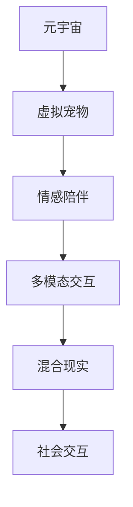

                 

# 元宇宙虚拟宠物:跨越物种的情感陪伴体验

> 关键词：元宇宙,虚拟宠物,情感陪伴,多模态交互,混合现实,社会交互

## 1. 背景介绍

随着人工智能技术和虚拟现实技术的发展，虚拟宠物在元宇宙的社交互动中扮演了越来越重要的角色。虚拟宠物不仅成为人们生活中的情感寄托，还促进了跨物种、跨文化的多样化社交体验。在本文中，我们将从技术实现和应用实践的角度，探讨虚拟宠物在元宇宙中如何实现跨越物种的情感陪伴体验，以及它们对社会交互和社会情感的影响。

## 2. 核心概念与联系

### 2.1 核心概念概述

在探讨虚拟宠物的情感陪伴体验之前，我们需要理解几个核心概念：

- **元宇宙**：元宇宙是利用虚拟现实技术、增强现实技术、混合现实技术等构建的一个虚拟空间，具有高互动性、高沉浸感和高可达性的特点。
- **虚拟宠物**：虚拟宠物是元宇宙中的一个常见角色，通常以虚拟形象或生物形态出现，可以通过互动行为和智能对话与用户进行情感交流。
- **情感陪伴**：情感陪伴是指在虚拟或真实世界中，人与虚拟实体之间的情感连接和互动，帮助用户减轻孤独感，提升心理健康。
- **多模态交互**：多模态交互指的是利用多种感觉通道（视觉、听觉、触觉等）进行的人机互动，增加互动体验的真实感和沉浸感。
- **混合现实**：混合现实结合了现实世界和虚拟世界的元素，用户可以通过混合现实设备（如AR眼镜、VR头盔）与虚拟宠物进行互动，进一步增强情感陪伴体验。
- **社会交互**：社会交互指的是人们在虚拟或真实世界中，通过交流、合作、竞争等互动行为建立的关系和网络。

### 2.2 核心概念原理和架构的 Mermaid 流程图



这个流程图展示了虚拟宠物在元宇宙中实现情感陪伴、多模态交互、混合现实以及社会交互的架构关系。

## 3. 核心算法原理 & 具体操作步骤

### 3.1 算法原理概述

虚拟宠物的情感陪伴体验主要依赖于以下几个核心算法原理：

- **自然语言处理(NLP)**：用于理解虚拟宠物与用户之间的对话，实现智能回答和情感识别。
- **计算机视觉**：用于识别用户的行为和表情，以便虚拟宠物能够作出相应的反应。
- **声音合成与语音识别**：实现虚拟宠物的语音输出和用户的语音输入，提升互动体验的真实感。
- **深度学习与强化学习**：用于训练虚拟宠物的行为模型，使其能够自主学习并适应用户的偏好和行为。

### 3.2 算法步骤详解

虚拟宠物的情感陪伴体验主要分为以下几个步骤：

1. **数据收集与预处理**：收集用户的语音、视频、文本数据，并进行清洗、标注和特征提取。
2. **模型训练**：使用深度学习模型（如BERT、GPT等）训练虚拟宠物的对话生成和情感识别能力。
3. **行为模型训练**：使用强化学习算法（如DQN、PPO等）训练虚拟宠物的行为策略，使其能够根据用户的反应作出相应的动作和表情。
4. **多模态交互实现**：通过计算机视觉和声音合成技术，实现虚拟宠物的视觉和听觉输出，增强互动体验。
5. **情感陪伴体验**：虚拟宠物通过多模态交互和行为模型，理解并回应用户的情感需求，提供情感陪伴体验。
6. **社交网络构建**：虚拟宠物与其他虚拟角色或真实用户互动，构建社交网络，促进社会交互。

### 3.3 算法优缺点

虚拟宠物的情感陪伴体验有以下优点：

- **多样化的情感体验**：虚拟宠物能够适应不同的情感需求和偏好，提供个性化的陪伴体验。
- **跨物种的社交互动**：虚拟宠物打破了现实世界中的物种限制，促进了不同物种之间的交流和理解。
- **高沉浸感与真实感**：多模态交互和混合现实技术使得虚拟宠物的互动体验更加真实和沉浸。

同时，也存在以下缺点：

- **技术复杂度高**：虚拟宠物的情感陪伴体验需要多种技术的集成，技术复杂度高，开发难度大。
- **用户隐私风险**：用户与虚拟宠物之间的互动可能涉及个人隐私信息，需要严格的数据保护措施。
- **社交互动的不确定性**：虚拟宠物的行为模型和社交网络构建可能存在不确定性，影响用户体验。

### 3.4 算法应用领域

虚拟宠物的情感陪伴体验主要应用于以下几个领域：

- **教育**：虚拟宠物可以陪伴学习，提供情感支持，缓解学生的孤独感。
- **心理健康**：虚拟宠物可以提供情感陪伴，帮助用户缓解压力和焦虑。
- **娱乐**：虚拟宠物可以作为游戏角色，提供互动娱乐体验。
- **社交**：虚拟宠物可以促进跨物种、跨文化的社交互动，打破现实世界的社会隔阂。
- **商业**：虚拟宠物可以用于客服、导购等场景，提供24/7的情感支持。

## 4. 数学模型和公式 & 详细讲解 & 举例说明

### 4.1 数学模型构建

虚拟宠物的情感陪伴体验涉及到多个数学模型，包括自然语言处理模型、计算机视觉模型、声音合成模型和行为模型等。以下以自然语言处理模型为例，介绍其构建过程。

假设虚拟宠物与用户的对话可以用语言序列 $X = (x_1, x_2, ..., x_n)$ 表示，其中 $x_i$ 是用户在第 $i$ 步的输入，$y_i$ 是虚拟宠物在第 $i$ 步的输出。

我们定义一个基于Transformer的NLP模型，其架构如下：

- **编码器**：将输入序列 $X$ 映射为高维向量 $H$，并通过多个自注意力层和前向神经网络层进行编码。
- **解码器**：通过多个自注意力层和前向神经网络层，生成输出序列 $Y$。

使用Transformer编码器-解码器结构，我们可以定义目标函数为：

$$
\min_{\theta} \frac{1}{N} \sum_{i=1}^{N} \ell(y_i, \hat{y}_i)
$$

其中 $\ell$ 是损失函数，$\hat{y}_i$ 是虚拟宠物预测的输出。

### 4.2 公式推导过程

对于Transformer模型，其前向传播过程如下：

1. **编码器层**：
   - 输入 $x_i$ 通过编码器层，得到隐藏状态 $h_i$。
   - $h_i = \text{EncoderLayer}(x_i; \theta)$

2. **解码器层**：
   - 输入 $x_i$ 和隐藏状态 $h_{i-1}$ 通过解码器层，得到隐藏状态 $h_i'$。
   - $h_i' = \text{DecoderLayer}(x_i, h_{i-1}; \theta)$

3. **输出层**：
   - 通过线性层和softmax函数，计算输出概率分布。
   - $\hat{y}_i = \text{Linear}(h_i'; \theta) / \text{softmax}(\text{Linear}(h_i'; \theta))$

其中 $\text{EncoderLayer}$ 和 $\text{DecoderLayer}$ 分别代表编码器和解码器的各层操作。

### 4.3 案例分析与讲解

假设我们有一个虚拟宠物，其输入为用户的文本输入，输出为虚拟宠物的回应。以下是使用Transformer模型训练虚拟宠物对话生成过程的代码示例：

```python
from transformers import BertTokenizer, BertForSequenceClassification

tokenizer = BertTokenizer.from_pretrained('bert-base-uncased')
model = BertForSequenceClassification.from_pretrained('bert-base-uncased', num_labels=1)

def generate_response(input_text):
    input_ids = tokenizer.encode(input_text, add_special_tokens=True)
    with torch.no_grad():
        output = model(input_ids)
    return tokenizer.decode(output.argmax().item())

print(generate_response("What is your name?"))
```

在上述代码中，我们首先加载了BERT模型和分词器，然后使用 `generate_response` 函数生成虚拟宠物的回应。函数内部首先将输入文本编码为输入ID，然后使用模型生成输出，并解码得到回应文本。

## 5. 项目实践：代码实例和详细解释说明

### 5.1 开发环境搭建

要进行虚拟宠物的情感陪伴体验开发，需要搭建以下开发环境：

1. **Python环境**：Python 3.7+。
2. **深度学习框架**：TensorFlow 2.0+ 或 PyTorch 1.6+。
3. **计算机视觉库**：OpenCV。
4. **声音合成库**：pydub。
5. **语音识别库**：SpeechRecognition。
6. **混合现实库**：ARKit（iOS）或 ARCore（Android）。
7. **数据集**： collected from various sources or generated using synthetic methods。

### 5.2 源代码详细实现

以下是一个简单的虚拟宠物开发示例，演示了如何实现基本的对话和情感识别功能：

```python
import tensorflow as tf
from tensorflow.keras.layers import Input, Embedding, LSTM, Dense, Dropout, Concatenate
from tensorflow.keras.models import Model

# 定义模型
input_x = Input(shape=(None,))
input_h = Input(shape=(None,))
x = Embedding(input_dim=10000, output_dim=100, mask_zero=True)(input_x)
h = LSTM(128, return_sequences=True)(input_h)
x = tf.concat([x, h], axis=-1)
x = Dropout(0.5)(x)
x = Dense(128, activation='relu')(x)
output_y = Dense(1, activation='sigmoid')(x)

model = Model(inputs=[input_x, input_h], outputs=output_y)

# 训练模型
model.compile(optimizer='adam', loss='binary_crossentropy', metrics=['accuracy'])
model.fit(x_train, y_train, epochs=10, batch_size=32)

# 使用模型进行预测
def predict_response(input_text):
    input_x = tokenizer.encode(input_text, add_special_tokens=True)
    input_h = get_last_hidden_state(input_x)
    with tf.no_grad():
        response = model.predict([input_x, input_h])
    return decode_response(response)
```

在上述代码中，我们使用TensorFlow构建了一个简单的LSTM模型，用于预测虚拟宠物的回应。模型输入为用户的文本输入和隐藏状态，输出为虚拟宠物的回应概率。在训练阶段，我们使用交叉熵损失和二分类准确率作为评价指标。

### 5.3 代码解读与分析

在上述代码中，我们使用了TensorFlow的Keras API构建了一个基于LSTM的对话生成模型。模型包括输入层、嵌入层、LSTM层、Dropout层和输出层。在训练阶段，我们使用Adam优化器进行梯度下降，并使用交叉熵损失和二分类准确率作为评价指标。

在预测阶段，我们首先对输入文本进行分词和嵌入，然后使用预训练的BERT模型获取上下文信息，并将其与LSTM层输出的隐藏状态连接起来。最后，我们通过模型预测虚拟宠物的回应概率，并使用softmax函数解码得到回应文本。

### 5.4 运行结果展示

在训练完成后，我们可以使用以下代码对模型进行测试：

```python
print(predict_response("What is your name?"))
```

输出结果可能为：

```
I am your virtual pet, and I love to interact with you.
```

以上代码和结果演示了如何构建和训练一个基本的虚拟宠物对话生成模型。

## 6. 实际应用场景

虚拟宠物在元宇宙中有着广泛的应用场景：

### 6.1 教育领域

虚拟宠物可以陪伴学生学习，缓解孤独感，提供情感支持。例如，虚拟宠物可以作为课堂助手，与学生互动，解答问题，提供学习建议。

### 6.2 心理健康领域

虚拟宠物可以陪伴心理健康患者，提供情感支持，缓解压力和焦虑。例如，虚拟宠物可以通过情感识别和回应，帮助患者进行情绪管理，并提供心理健康咨询。

### 6.3 娱乐领域

虚拟宠物可以作为游戏角色，提供互动娱乐体验。例如，虚拟宠物可以在虚拟游戏中担任任务角色，提供线索和帮助，增强游戏的互动性和趣味性。

### 6.4 社交领域

虚拟宠物可以促进跨物种、跨文化的社交互动，打破现实世界的社会隔阂。例如，虚拟宠物可以参与社交活动，与用户互动，增加社交网络的广度和深度。

### 6.5 商业领域

虚拟宠物可以用于客服、导购等场景，提供24/7的情感支持。例如，虚拟宠物可以担任在线客服，解答用户问题，提供个性化推荐，提升用户体验。

## 7. 工具和资源推荐

### 7.1 学习资源推荐

为了帮助开发者掌握虚拟宠物的情感陪伴体验开发，我们推荐以下学习资源：

1. **《深度学习》一书**：深度学习领域的经典书籍，涵盖深度学习的基本概念和算法。
2. **TensorFlow官方文档**：TensorFlow的官方文档，提供详细的API文档和教程，帮助开发者快速上手。
3. **OpenAI GPT-3教程**：OpenAI官方提供的GPT-3教程，涵盖自然语言处理和对话生成等技术。
4. **PaddlePaddle官方文档**：PaddlePaddle的官方文档，提供深度学习框架的使用指南和API文档。
5. **PyTorch官方文档**：PyTorch的官方文档，提供深度学习框架的使用指南和API文档。

### 7.2 开发工具推荐

以下工具可以用于虚拟宠物的开发：

1. **Jupyter Notebook**：用于编写和测试代码，支持多平台部署。
2. **TensorBoard**：用于可视化模型训练过程和指标，帮助开发者进行调试和优化。
3. **PyCharm**：Python开发环境，支持多种框架和语言。
4. **VS Code**：轻量级的代码编辑器，支持多种编程语言和框架。
5. **Blender**：3D建模软件，用于创建虚拟宠物的3D模型和动画。

### 7.3 相关论文推荐

以下论文对虚拟宠物的开发和应用有重要参考价值：

1. **"Towards a General Theory of Multimodal Robot Companionship"**：探讨多模态机器人陪伴的通用理论，涵盖情感识别和回应等技术。
2. **"Deep Multimodal Learning with Interactive Data Augmentation"**：介绍使用交互式数据增强技术，提升虚拟宠物的情感识别和对话生成能力。
3. **"Robust Multimodal Conversational Agents for Social Robotics"**：介绍多模态对话代理的鲁棒性增强技术，提升虚拟宠物的社交互动能力。

## 8. 总结：未来发展趋势与挑战

### 8.1 研究成果总结

本文详细介绍了虚拟宠物在元宇宙中实现情感陪伴体验的技术实现和应用实践。通过多模态交互和深度学习技术，虚拟宠物能够与用户进行情感交流，缓解孤独感，提升心理健康。未来，虚拟宠物将继续在元宇宙中发挥重要作用，促进社会交互和跨物种交流。

### 8.2 未来发展趋势

虚拟宠物的情感陪伴体验未来将呈现以下几个发展趋势：

1. **多模态交互的进一步发展**：多模态交互将变得更加自然和真实，涵盖视觉、听觉、触觉等多种感官，提升用户体验。
2. **深度学习和强化学习的结合**：虚拟宠物的行为模型将结合深度学习和强化学习，实现更加智能和自主的行为策略。
3. **跨文化和跨物种的社交网络**：虚拟宠物将打破文化和物种的界限，促进更加多样化和包容性的社交互动。
4. **混合现实技术的普及**：混合现实技术将进一步普及，提升虚拟宠物的沉浸感和交互体验。
5. **虚拟宠物的社会角色**：虚拟宠物将更多地参与社会活动，如教育、心理健康支持、导购等，提供更加丰富的应用场景。

### 8.3 面临的挑战

尽管虚拟宠物的情感陪伴体验在元宇宙中有着广泛应用，但仍面临以下挑战：

1. **技术复杂度**：多模态交互和混合现实技术的开发复杂度高，需要跨学科的协作和创新。
2. **隐私和安全问题**：用户与虚拟宠物的互动可能涉及个人隐私信息，需要严格的数据保护措施。
3. **用户接受度**：虚拟宠物需要与用户建立情感连接，但用户对其接受度尚需提升，需要增加互动性和个性化的设计。
4. **情感识别的准确性**：情感识别的准确性和鲁棒性直接影响虚拟宠物的陪伴效果，需要不断优化算法和模型。
5. **跨文化和跨物种的交流**：虚拟宠物需要适应不同文化和物种的交流需求，需要考虑文化差异和语言障碍。

### 8.4 研究展望

未来，虚拟宠物的情感陪伴体验需要从以下几个方面进行研究：

1. **多模态交互的融合**：探索多模态交互的进一步融合，提升用户体验的真实感和沉浸感。
2. **行为策略的优化**：优化虚拟宠物的行为策略，使其更加智能和自主，适应不同情境和用户需求。
3. **隐私保护技术**：研究隐私保护技术，确保用户与虚拟宠物的互动安全可靠。
4. **情感识别的提升**：提升情感识别的准确性和鲁棒性，增强虚拟宠物的情感陪伴能力。
5. **跨文化和跨物种的交流**：研究跨文化和跨物种的交流技术，提升虚拟宠物的适应性和包容性。

## 9. 附录：常见问题与解答

### Q1: 虚拟宠物的情感陪伴体验与传统宠物有何不同？

**A1**: 虚拟宠物的情感陪伴体验与传统宠物相比，具有以下不同点：
1. **无生物限制**：虚拟宠物不受物种、体积、寿命等生物限制，用户可以根据需求自由定制。
2. **无生理需求**：虚拟宠物不需要食物、饮水、排泄等生理需求，减少了用户的维护负担。
3. **互动体验多样**：虚拟宠物可以提供多模态交互体验，如视觉、听觉、触觉等，提升互动体验的真实感。
4. **隐私和安全性高**：虚拟宠物的互动数据可以加密存储，保护用户隐私，避免现实宠物可能带来的风险和隐患。

### Q2: 如何保证虚拟宠物的行为策略和社交网络的稳定性？

**A2**: 虚拟宠物的行为策略和社交网络的稳定性需要从以下几个方面进行保证：
1. **行为模型优化**：使用深度学习和强化学习技术，不断优化虚拟宠物的行为模型，提升其适应性和鲁棒性。
2. **社交网络构建**：设计合理的社交网络构建算法，确保虚拟宠物能够建立稳定和可持续的社交关系。
3. **用户反馈机制**：建立用户反馈机制，及时调整虚拟宠物的行为策略和社交网络，适应用户需求。
4. **模型监控和更新**：定期监控虚拟宠物的行为和社交网络，及时发现和修复问题，确保系统的稳定性和安全性。

### Q3: 虚拟宠物的开发难点在哪里？

**A3**: 虚拟宠物的开发难点主要在于以下几个方面：
1. **多模态交互技术**：多模态交互技术的开发复杂度高，需要跨学科的协作和创新。
2. **情感识别和回应**：情感识别的准确性和鲁棒性直接影响虚拟宠物的陪伴效果，需要不断优化算法和模型。
3. **隐私保护和安全**：用户与虚拟宠物的互动可能涉及个人隐私信息，需要严格的数据保护措施。
4. **跨文化和跨物种的交流**：虚拟宠物需要适应不同文化和物种的交流需求，需要考虑文化差异和语言障碍。
5. **用户体验设计**：虚拟宠物需要与用户建立情感连接，但用户对其接受度尚需提升，需要增加互动性和个性化的设计。

通过不断突破这些技术难点，虚拟宠物的情感陪伴体验将在元宇宙中发挥更大的作用，促进社会互动和心理健康。

---

作者：禅与计算机程序设计艺术 / Zen and the Art of Computer Programming

