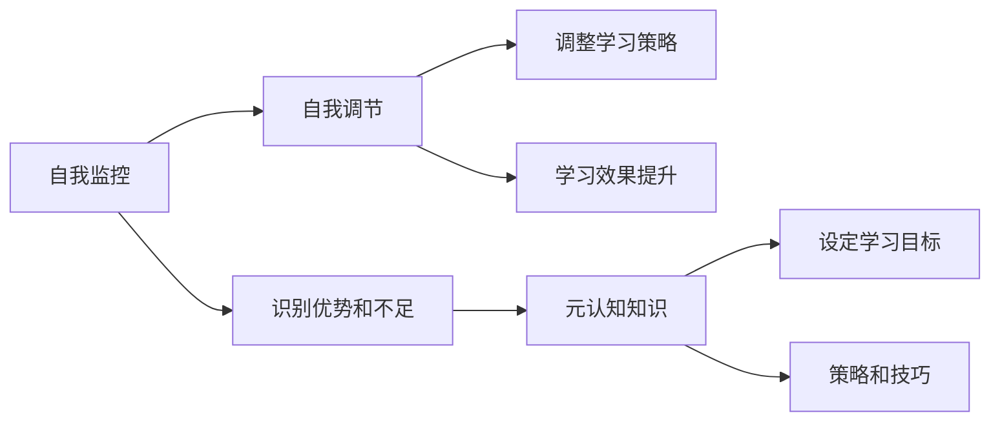

                 

## 1. 背景介绍

在当前快速变化的技术和知识更新迭代速度中，我们面临的不仅是信息过载，更有技能的快速老旧。在这样的背景下，如何在有限的时间里迅速掌握新技能，成为各个行业从业者所追求的目标。元认知策略（Metacognitive Strategies）在心理学领域有着广泛的应用，其核心思想是通过对自身学习过程的认知和反思，来提升学习效率，达到更好的学习效果。

在信息技术领域，元认知策略的应用逐渐增多，尤其是在编程、软件工程、数据科学等技术密集型职业中。这些技术职业具有高度的专业性和不断变化的特性，要求从业者不断学习新的工具、框架和算法，以保持其竞争力和行业领先性。本文将深入探讨元认知策略在提高学习效率方面的作用，并通过具体的实践案例和研究回顾，帮助读者提升自身的技术学习效率。

## 2. 核心概念与联系

### 2.1 核心概念概述

元认知策略是一种通过反思和规划，来指导学习过程的高级技能。其核心包括：
1. **自我监控**：对自身学习过程的观察和评估，识别学习中的优势和不足。
2. **自我调节**：根据监控结果，调整学习策略和方法，以达到最佳学习效果。
3. **元认知知识**：对自己学习过程的知识和理解，包括学习目标、策略和技巧等。

这些核心概念紧密相关，共同构成了元认知策略的框架。

### 2.2 核心概念原理和架构的 Mermaid 流程图



## 3. 核心算法原理 & 具体操作步骤

### 3.1 算法原理概述

元认知策略的原理基于心理学研究，其核心在于对学习过程的反思和调整，以实现更高效的学习。具体来说，元认知策略通过以下几个步骤来实现：

1. **自我监控**：在学习过程中，不断观察和记录自己的学习进度、理解程度和情感状态。
2. **自我评估**：根据自我监控的结果，评估学习效果，识别学习中遇到的问题和难点。
3. **目标设定**：根据评估结果，设定明确的学习目标，并制定相应的学习计划。
4. **策略调整**：根据目标和评估结果，调整学习策略，如增加难度、变换学习方法等。
5. **反馈循环**：通过持续的自我监控和调整，实现对学习过程的优化和改进。

### 3.2 算法步骤详解

下面将详细讲解元认知策略的操作步骤，并结合具体实例进行说明。

#### 3.2.1 自我监控

自我监控是元认知策略的第一步，通过对自己的学习过程进行持续的观察和记录，以便更好地理解自己的学习状态。

**步骤**：
1. **设置监控指标**：根据学习目标，设定具体的监控指标，如学习时间、理解度、问题解决数等。
2. **记录学习过程**：在学习过程中，使用日志或工具（如Notion、Trello等）记录学习时间、遇到的问题、解决方法和进展。
3. **定期回顾**：每周或每月进行一次全面的回顾，总结学习进展，识别存在的问题和挑战。

**示例**：某开发者学习新框架，设定每天学习2小时，记录遇到的困难和解决方法。每周回顾时，发现时间管理问题，决定增加专注时间，并采用番茄工作法。

#### 3.2.2 自我评估

自我评估是基于自我监控的结果，对学习效果进行评估，识别学习中的问题和难点。

**步骤**：
1. **对照指标评估**：根据设定的监控指标，对学习效果进行评估，如是否达到了预期的理解度或问题解决数。
2. **反思和总结**：反思学习过程中的感受和体验，总结成功经验和失败教训。
3. **调整目标和计划**：根据评估结果，调整学习目标和计划，如增加学习时间、调整学习策略等。

**示例**：开发者学习新框架后，发现理解度未达到预期，评估后意识到学习方法不当，决定改变学习方法，并调整目标。

#### 3.2.3 目标设定

目标设定是元认知策略的重要组成部分，明确的学习目标有助于提高学习效率。

**步骤**：
1. **设定短期目标**：如每天学习1小时，解决特定问题。
2. **设定中期目标**：如一个月内完成特定模块，掌握特定技能。
3. **设定长期目标**：如半年内掌握某一框架，实现某一项目。

**示例**：开发者设定短期目标为每天学习1小时，中期目标为一个月内掌握Spring Boot框架，长期目标为半年内实现一个中小型项目。

#### 3.2.4 策略调整

策略调整是通过自我监控和评估的结果，对学习方法进行优化和改进。

**步骤**：
1. **识别问题**：根据自我监控和评估结果，识别学习中的问题。
2. **查找资源**：寻找解决这些问题的资源，如教程、论坛、书籍等。
3. **应用新策略**：根据资源，应用新的学习策略，如改变学习环境、尝试新工具等。

**示例**：开发者在学习过程中，发现理解度不足，识别问题为知识体系不完整，决定补充学习补充材料，并采用思维导图工具整理知识。

#### 3.2.5 反馈循环

反馈循环是通过持续的自我监控和评估，实现对学习过程的优化和改进。

**步骤**：
1. **持续监控**：持续进行自我监控，记录学习进度和效果。
2. **定期评估**：每周或每月进行一次评估，识别问题和改进空间。
3. **调整策略**：根据评估结果，调整学习策略和计划，以达到更好的学习效果。

**示例**：开发者在持续学习过程中，不断监控学习进度，每周评估一次学习效果，并根据评估结果调整学习策略。

### 3.3 算法优缺点

#### 3.3.1 优点

1. **个性化学习**：通过自我监控和评估，可以制定适合自己的学习计划和策略。
2. **提高学习效率**：通过持续的反思和调整，可以及时发现并解决学习中的问题。
3. **促进持续学习**：通过设定明确的目标和计划，保持学习的动力和方向。

#### 3.3.2 缺点

1. **需要持续投入**：元认知策略需要持续的自我监控和反思，需要一定的投入。
2. **可能需要时间适应**：对于习惯了传统学习方法的人来说，可能需要一些时间来适应新的策略。
3. **可能增加心理负担**：持续的反思和评估，可能会增加心理负担，特别是面对挑战时。

### 3.4 算法应用领域

元认知策略不仅适用于学术和学术研究，在技术领域也有广泛的应用。

#### 3.4.1 编程

在编程中，元认知策略可以应用于代码学习、工具使用和项目开发等环节。例如，开发者可以通过记录编码过程中的错误和解决方案，不断优化自己的编程习惯和技能。

#### 3.4.2 软件工程

在软件工程中，元认知策略可以帮助工程师理解和掌握新的技术栈和框架，提升项目管理和团队协作的效率。

#### 3.4.3 数据科学

在数据科学中，元认知策略可以帮助数据分析师和机器学习工程师更好地理解和应用新算法，优化数据处理和模型训练过程。

## 4. 数学模型和公式 & 详细讲解 & 举例说明

### 4.1 数学模型构建

元认知策略的数学模型可以通过以下框架来构建：

- **输入**：学习者对学习过程的监控和评估数据。
- **处理**：自我监控和评估的结果，目标设定和策略调整。
- **输出**：学习者的学习效果和自我调整后的策略。

### 4.2 公式推导过程

以下公式描述了元认知策略的基本框架：

$$
\text{Effective Learning} = \text{Self-Monitoring} + \text{Self-Assessment} + \text{Goal Setting} + \text{Strategy Adjustment} + \text{Feedback Loop}
$$

其中，每个部分都对最终的学习效果产生影响。

### 4.3 案例分析与讲解

**案例**：某数据科学家学习新的机器学习算法。

1. **自我监控**：记录每天的学习时间、遇到的困难和解决方法。
2. **自我评估**：每周回顾一次学习效果，评估理解度和应用能力。
3. **目标设定**：设定短期目标为一周内理解新算法，中期目标为一个月内应用新算法，长期目标为三个月内掌握新算法并应用于实际项目。
4. **策略调整**：发现理解度不足，查找相关教程和论坛，决定增加学习时间并采用Kaggle竞赛来加深理解。
5. **反馈循环**：持续记录学习进度，每月评估一次学习效果，并根据评估结果调整学习策略。

通过这个过程，该数据科学家能够高效地掌握新算法，并应用于实际项目中。

## 5. 项目实践：代码实例和详细解释说明

### 5.1 开发环境搭建

为实现元认知策略，需要搭建合适的开发环境。以下是一个简单的示例：

1. **安装Notion**：用于记录和回顾学习过程。
2. **安装Trello**：用于管理学习任务和进度。
3. **安装Python编程环境**：如Anaconda或Miniconda。
4. **安装相关库**：如Pandas、Matplotlib等，用于数据分析和可视化。

### 5.2 源代码详细实现

以下是一个简单的Python代码示例，用于记录和分析学习过程：

```python
import pandas as pd

# 创建学习日志表
df = pd.DataFrame(columns=['Date', 'Learning Time', 'Understanding', 'Problems'])

# 记录学习日志
def log_learning(date, learning_time, understanding, problems):
    entry = pd.Series([date, learning_time, understanding, problems], index=df.columns)
    df = df.append(entry, ignore_index=True)
    df.to_csv('learning_log.csv', index=False)

# 分析学习数据
def analyze_learning(log_file):
    df = pd.read_csv(log_file)
    mean_learning_time = df['Learning Time'].mean()
    mean_understanding = df['Understanding'].mean()
    mean_problems = df['Problems'].mean()
    print(f"Mean Learning Time: {mean_learning_time}")
    print(f"Mean Understanding: {mean_understanding}")
    print(f"Mean Problems: {mean_problems}")

# 示例
log_learning('2023-10-01', 2, 3, 2)
analyze_learning('learning_log.csv')
```

### 5.3 代码解读与分析

这个示例代码主要用于记录和分析学习数据。代码分为两个主要部分：

- **记录学习日志**：通过函数`log_learning`，记录每天的学习时间、理解度和遇到的问题。
- **分析学习数据**：通过函数`analyze_learning`，读取学习日志并计算平均值，帮助分析学习效果。

这个示例展示了如何使用简单的Python代码实现元认知策略，通过持续的记录和分析，优化学习过程。

### 5.4 运行结果展示

通过上述代码，可以输出每天的学习时间、理解度和遇到的问题，以及这些数据的平均值，帮助评估学习效果和发现问题。

## 6. 实际应用场景

### 6.1 编程培训

在编程培训中，元认知策略可以帮助学员记录和反思学习过程，发现并解决学习中的问题。例如，学习新编程语言时，学员可以通过记录学习时间、理解度、遇到的错误等，不断优化学习策略，提高学习效率。

### 6.2 软件开发

在软件开发中，元认知策略可以帮助开发者理解和掌握新的技术栈和框架，提升项目管理和团队协作的效率。例如，通过自我监控和评估，开发者可以识别学习中的瓶颈和问题，并采取相应的策略进行优化。

### 6.3 数据科学竞赛

在数据科学竞赛中，元认知策略可以帮助参赛者规划学习路径和策略，提升数据处理和模型训练的效率。例如，参赛者可以通过记录学习时间、理解度和遇到的困难，不断调整学习策略，优化竞赛成绩。

### 6.4 未来应用展望

未来，元认知策略在技术领域的应用将更加广泛，包括以下几个方向：

1. **自动化学习工具**：开发基于人工智能的自动化学习工具，帮助用户规划学习路径和策略，提供个性化的学习建议。
2. **学习平台集成**：将元认知策略集成到学习平台中，提供更全面、更高效的学习体验。
3. **跨学科应用**：将元认知策略应用于更多学科，帮助学生和从业者提高学习效率和效果。

## 7. 工具和资源推荐

### 7.1 学习资源推荐

1. **《深度学习实践指南》**：详细介绍了元认知策略在技术学习中的应用，并提供了具体的实践方法和案例。
2. **Coursera《学习心理学》课程**：介绍了心理学中的元认知理论，并提供了实际应用的方法和工具。
3. **Udemy《元认知学习策略》课程**：针对学习者，提供了具体的元认知策略和技巧，帮助提升学习效果。

### 7.2 开发工具推荐

1. **Notion**：用于记录和回顾学习过程，支持多维度数据的记录和分析。
2. **Trello**：用于管理学习任务和进度，支持任务和时间的可视化管理。
3. **Jupyter Notebook**：用于记录和分享学习笔记，支持代码和数据的记录和分析。

### 7.3 相关论文推荐

1. **《元认知策略在技术学习中的应用》**：详细探讨了元认知策略在技术学习中的作用和应用方法。
2. **《基于元认知的学习策略》**：研究了元认知策略在学术和学术研究中的应用，并提出了改进方法。
3. **《自我监控和元认知在技术学习中的作用》**：研究了自我监控和元认知在技术学习中的作用，并提出了具体的应用方法。

## 8. 总结：未来发展趋势与挑战

### 8.1 研究成果总结

元认知策略在提高技术学习效率方面具有重要价值，其核心思想是通过自我监控和反思，不断优化学习过程，提升学习效果。通过实践和研究，元认知策略已被广泛应用于编程、软件工程和数据科学等技术密集型职业中，取得了显著的成效。

### 8.2 未来发展趋势

未来，元认知策略在技术领域的应用将更加广泛，其发展趋势包括：

1. **自动化和智能化**：开发基于人工智能的自动化学习工具，帮助用户规划学习路径和策略。
2. **跨学科应用**：将元认知策略应用于更多学科，帮助学生和从业者提高学习效率和效果。
3. **跨平台集成**：将元认知策略集成到各种学习平台中，提供更全面、更高效的学习体验。

### 8.3 面临的挑战

尽管元认知策略在技术学习中具有显著优势，但在推广和应用过程中也面临一些挑战：

1. **技术门槛**：元认知策略需要一定的技术基础和工具支持，对于初学者来说可能存在一定的门槛。
2. **数据隐私**：在记录和分析学习数据时，需要考虑数据隐私和安全性问题。
3. **文化差异**：不同文化背景下的学习者可能对元认知策略的接受度和使用方式存在差异。

### 8.4 研究展望

未来，元认知策略的研究将主要集中在以下几个方向：

1. **适应性学习**：开发自适应学习系统，根据学习者的特点和需求，动态调整学习策略。
2. **混合学习模式**：结合在线学习和线下学习，提供更灵活、更全面的学习体验。
3. **跨学科协作**：推动不同学科之间的合作，共同开发和应用元认知策略。

总之，元认知策略在提高技术学习效率方面具有重要的应用价值，未来将在更多领域得到广泛应用，推动技术学习方法的不断进步。

## 9. 附录：常见问题与解答

**Q1: 如何有效地应用元认知策略？**

A: 有效应用元认知策略的关键在于持续的自我监控和反思，不断优化学习过程。具体步骤包括：
1. **设定明确的学习目标**。
2. **记录学习过程和数据**。
3. **定期回顾和评估**。
4. **调整学习策略和方法**。
5. **持续反馈和优化**。

**Q2: 元认知策略是否适用于所有学习者？**

A: 元认知策略适用于大多数学习者，尤其是技术密集型职业的学习者。但对于一些特殊学习者（如儿童、老年人等），可能需要根据其特点进行适当调整。

**Q3: 如何克服元认知策略应用中的技术门槛？**

A: 可以通过提供详细的教程和工具支持，帮助初学者快速上手。同时，逐步引导学习者应用元认知策略，使其逐渐适应和熟练掌握。

**Q4: 在应用元认知策略时，如何保护数据隐私？**

A: 在记录和分析学习数据时，应遵循数据隐私保护的原则，确保数据的匿名性和安全性。同时，可以采用加密技术和管理措施，保护学习者的隐私权益。

**Q5: 元认知策略在技术学习中的具体应用案例有哪些？**

A: 具体应用案例包括：
1. 编程培训中的代码学习记录和问题解决。
2. 软件开发中的新技能掌握和项目管理。
3. 数据科学竞赛中的学习路径规划和数据处理。

---

作者：禅与计算机程序设计艺术 / Zen and the Art of Computer Programming

