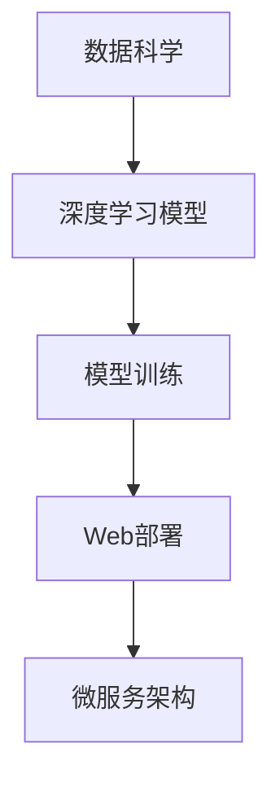

                 

# 全栈AI开发：从模型训练到Web部署

> 关键词：全栈AI开发,模型训练,Web部署,数据科学,深度学习,机器学习,Web应用程序,Web框架,API,微服务

## 1. 背景介绍

随着人工智能技术的不断进步，AI正在成为各行各业的核心竞争力。然而，AI技术不仅仅局限于模型训练和调优，从数据收集、模型训练、评估、部署到上线维护，每一步都需要精心设计和优化，才能真正实现商业价值。全栈AI开发正是这样一种面向全生命周期的AI解决方案，旨在提供从模型训练到Web部署的端到端支持，帮助企业快速、高效地构建AI应用。

本文将全面介绍全栈AI开发的关键技术，包括数据科学、深度学习模型训练、Web部署和微服务等环节。通过系统化的介绍，希望能为读者提供一个全面的AI开发指南，帮助他们从零开始，构建高效、可靠、可扩展的AI应用。

## 2. 核心概念与联系

### 2.1 核心概念概述

为更好地理解全栈AI开发，首先需要了解几个核心概念及其相互关系：

- **数据科学**：包括数据收集、清洗、特征工程、数据可视化等步骤，是构建AI模型的基础。
- **深度学习模型**：利用神经网络模型，通过大量数据进行训练，自动学习数据特征并进行预测或生成。
- **模型训练**：通过反向传播算法，利用标注数据优化模型参数，使模型在特定任务上表现最佳。
- **Web部署**：将训练好的模型部署到Web服务器上，使其能够接收用户请求，并提供推理服务。
- **微服务架构**：将大型系统拆分成多个独立运行的微服务，每个服务负责特定的功能模块，提升系统的可扩展性和维护性。

这些概念之间的联系通过以下Mermaid流程图展示：



这个流程图展示了从数据科学到Web部署的全栈AI开发流程：

1. 数据科学收集和处理数据，为模型训练提供素材。
2. 深度学习模型构建和训练，自动学习数据特征并进行预测或生成。
3. Web部署将训练好的模型部署到Web服务器上，接收用户请求并提供推理服务。
4. 微服务架构将系统拆分成多个独立服务，提升系统的可扩展性和维护性。

这些核心概念共同构成了全栈AI开发的底层技术框架，指导着从数据到模型的整个流程。

## 3. 核心算法原理 & 具体操作步骤

### 3.1 算法原理概述

全栈AI开发涉及多个技术环节，每个环节都有其独特的算法原理。本节将简要介绍各环节的算法原理：

- **数据科学**：采用统计学方法，如均值、中位数、标准差、协方差等，描述数据分布特性。
- **深度学习模型**：利用神经网络模型，如卷积神经网络(CNN)、循环神经网络(RNN)、变分自编码器(VAE)、生成对抗网络(GAN)等，通过反向传播算法优化模型参数。
- **模型训练**：采用梯度下降等优化算法，如Adam、SGD等，最小化损失函数，提升模型预测准确率。
- **Web部署**：利用WSGI、FastAPI、Django等框架，构建RESTful API，接收用户请求并返回推理结果。
- **微服务架构**：采用微服务模式，如Docker、Kubernetes、Kubernetees、Rancher等容器化解决方案，提升系统的可扩展性和维护性。

### 3.2 算法步骤详解

接下来，我们将详细讲解各环节的算法步骤：

#### 数据科学

1. **数据收集**：通过网络爬虫、数据库、API等手段，收集目标领域的数据集。
2. **数据清洗**：剔除重复、缺失、异常值，处理缺失值和异常值，确保数据质量。
3. **特征工程**：选择、提取、转换、组合特征，提升模型效果。
4. **数据可视化**：利用Matplotlib、Seaborn、Tableau等工具，绘制数据分布图、散点图、热力图等，帮助理解数据。

#### 深度学习模型

1. **模型选择**：根据任务类型，选择合适的网络结构，如卷积神经网络(CNN)、循环神经网络(RNN)、长短期记忆网络(LSTM)、生成对抗网络(GAN)等。
2. **模型构建**：定义网络结构，包括输入层、隐藏层、输出层、激活函数等。
3. **模型训练**：利用反向传播算法，最小化损失函数，优化模型参数。
4. **模型评估**：通过交叉验证、AUC、F1-score等指标，评估模型效果。

#### 模型训练

1. **损失函数选择**：根据任务类型，选择适当的损失函数，如交叉熵、均方误差、平均绝对误差等。
2. **优化算法选择**：根据模型类型，选择适当的优化算法，如Adam、SGD等。
3. **学习率选择**：根据数据分布和模型复杂度，选择适当的学习率，防止过拟合和欠拟合。
4. **正则化技术**：采用L2正则、Dropout、Early Stopping等技术，防止过拟合。

#### Web部署

1. **Web框架选择**：选择Python中的Flask、Django、FastAPI等Web框架。
2. **API设计**：定义RESTful API接口，包括路径、请求方法、参数、返回值等。
3. **API实现**：实现API接口，通过Python代码调用模型进行推理。
4. **Web服务器部署**：将Web应用程序部署到Nginx、Apache等Web服务器上，提供稳定的服务。

#### 微服务架构

1. **服务划分**：根据功能模块，将系统拆分成多个独立服务，每个服务负责特定功能。
2. **服务注册与发现**：采用Eureka、Consul等解决方案，实现服务的自动注册和发现。
3. **服务通信**：采用RestTemplate、Feign等工具，实现服务间的通信。
4. **服务部署**：将服务打包为Docker镜像，部署到Kubernetes、Kubernetees、Rancher等容器化平台。

### 3.3 算法优缺点

全栈AI开发涉及多个环节，每个环节都有其优缺点：

**数据科学**：
- **优点**：数据科学是模型训练的基础，数据质量直接影响模型效果。
- **缺点**：数据收集和清洗成本高，数据质量难以保证。

**深度学习模型**：
- **优点**：深度学习模型具备强大的特征提取能力，适用于多种任务。
- **缺点**：模型训练复杂，需要大量标注数据。

**模型训练**：
- **优点**：模型训练能够优化参数，提升模型效果。
- **缺点**：训练时间较长，需要高性能计算资源。

**Web部署**：
- **优点**：Web部署使得模型能够在线提供服务，便于用户使用。
- **缺点**：Web服务器需要维护，存在单点故障风险。

**微服务架构**：
- **优点**：微服务架构提升系统可扩展性和维护性。
- **缺点**：微服务架构复杂，开发和维护成本高。

### 3.4 算法应用领域

全栈AI开发涉及多个领域，以下是一些典型的应用场景：

- **医疗健康**：利用AI进行疾病预测、影像分析、药物研发等，提升医疗服务的智能化水平。
- **金融服务**：利用AI进行风险评估、信用评分、智能投顾等，提升金融服务的精准性和效率。
- **智能制造**：利用AI进行设备维护、质量检测、供应链优化等，提升制造业的自动化水平。
- **智慧城市**：利用AI进行交通管理、环境监测、公共安全等，提升城市管理的智能化水平。
- **智能客服**：利用AI进行客户咨询、问题解决、情感分析等，提升客服系统的响应速度和用户满意度。

## 4. 数学模型和公式 & 详细讲解 & 举例说明

### 4.1 数学模型构建

本节将使用数学语言对全栈AI开发的关键环节进行更加严格的刻画。

#### 数据科学

数据科学涉及多个统计学概念，如均值、中位数、标准差、协方差等。假设我们有一组数据集 $X=\{x_1,x_2,\dots,x_n\}$，其均值、中位数、标准差、协方差等统计量计算公式如下：

- **均值**：$\mu = \frac{1}{n} \sum_{i=1}^n x_i$
- **中位数**：$\text{median}(X) = \frac{1}{2}(x_{(k)} + x_{(k+1)})$
- **标准差**：$\sigma = \sqrt{\frac{1}{n} \sum_{i=1}^n (x_i - \mu)^2}$
- **协方差**：$\Sigma_{xy} = \frac{1}{n} \sum_{i=1}^n (x_i - \mu_x)(y_i - \mu_y)$

其中 $x_{(k)}$ 表示按升序排序后第 $k$ 个数据。

#### 深度学习模型

深度学习模型涉及多个神经网络概念，如卷积层、池化层、全连接层、激活函数等。以简单的全连接神经网络为例，其结构如图1所示：

```
输入层
      |
      v
隐藏层1
      |
      v
输出层
```

其中隐藏层1包括多个神经元，每个神经元的输出为：

$$
h_j = \sum_{i=1}^n w_{ij} x_i + b_j
$$

其中 $w_{ij}$ 表示第 $j$ 个神经元与第 $i$ 个输入之间的权重，$b_j$ 表示第 $j$ 个神经元的偏置。

#### 模型训练

模型训练涉及梯度下降等优化算法，假设损失函数为 $L(\theta)$，其中 $\theta$ 为模型参数。梯度下降的更新公式为：

$$
\theta_{t+1} = \theta_t - \eta \nabla L(\theta_t)
$$

其中 $\eta$ 为学习率，$\nabla L(\theta_t)$ 表示损失函数对参数的梯度。

#### Web部署

Web部署涉及RESTful API的设计和实现，假设我们的API接口如下：

- **路径**：`/predict`
- **请求方法**：POST
- **请求参数**：`data`：输入数据，`model`：模型名称
- **返回值**：模型推理结果

示例代码如下：

```python
from flask import Flask, request

app = Flask(__name__)

@app.route('/predict', methods=['POST'])
def predict():
    data = request.json['data']
    model = request.json['model']
    result = model.predict(data)
    return result
```

#### 微服务架构

微服务架构涉及多个概念，如Docker、Kubernetes、Eureka等。以Docker为例，其基本流程如下：

1. **创建Docker镜像**：将应用打包为Docker镜像，编写Dockerfile文件，定义应用环境和依赖。
2. **运行Docker容器**：使用Docker命令启动容器，提供服务的运行环境。
3. **容器编排**：使用Kubernetes等容器编排工具，管理多个容器，保证服务的稳定性。

示例Dockerfile代码如下：

```Dockerfile
# 使用官方Python运行环境
FROM python:3.7

# 安装依赖
RUN pip install flask

# 复制应用代码
COPY app.py .

# 启动应用
CMD ["python", "app.py"]
```

### 4.2 公式推导过程

以下我们以全连接神经网络为例，推导其训练过程的数学公式。

假设我们的全连接神经网络如图1所示，其中隐藏层1包括 $m$ 个神经元，输出层包括 $n$ 个神经元。

- **前向传播**：

$$
h_j = \sum_{i=1}^n w_{ij} x_i + b_j, \quad j=1,\dots,m
$$

$$
y_k = \sum_{j=1}^m w_{kj} h_j + b_k, \quad k=1,\dots,n
$$

其中 $w_{kj}$ 表示第 $k$ 个输出神经元与第 $j$ 个隐藏神经元之间的权重，$b_k$ 表示第 $k$ 个输出神经元的偏置。

- **损失函数**：

假设我们的目标为分类任务，采用交叉熵损失函数，计算公式如下：

$$
L(\theta) = -\frac{1}{N} \sum_{i=1}^N \sum_{j=1}^n y_{ik} \log y_{ik} + (1-y_{ik}) \log (1-y_{ik})
$$

其中 $y_{ik}$ 表示第 $i$ 个样本中第 $k$ 个输出神经元的预测结果。

- **梯度下降**：

假设我们的优化算法为Adam，其更新公式如下：

$$
\theta \leftarrow \theta - \eta \nabla_{\theta} L(\theta) - \eta \lambda \theta
$$

其中 $\eta$ 为学习率，$\lambda$ 为正则化系数。

### 4.3 案例分析与讲解

#### 数据科学案例

假设我们需要对某城市的空气质量进行预测，数据集包括PM2.5、PM10、NO2、SO2、O3等指标的历史数据。我们首先使用Matplotlib绘制空气质量变化图，如图2所示：

```python
import matplotlib.pyplot as plt
import numpy as np

data = np.loadtxt('air_quality.csv', delimiter=',')
dates = data[:, 0]
pm25 = data[:, 1]

plt.plot(dates, pm25)
plt.xlabel('Date')
plt.ylabel('PM2.5')
plt.title('Air Quality in City')
plt.show()
```


#### 深度学习模型案例

假设我们需要构建一个图像分类模型，分类任务为区分猫咪和狗狗。我们首先使用Keras构建卷积神经网络模型，如图3所示：

```python
from keras.models import Sequential
from keras.layers import Conv2D, MaxPooling2D, Flatten, Dense

model = Sequential()
model.add(Conv2D(32, (3, 3), activation='relu', input_shape=(32, 32, 3)))
model.add(MaxPooling2D((2, 2)))
model.add(Conv2D(64, (3, 3), activation='relu'))
model.add(MaxPooling2D((2, 2)))
model.add(Conv2D(128, (3, 3), activation='relu'))
model.add(MaxPooling2D((2, 2)))
model.add(Flatten())
model.add(Dense(64, activation='relu'))
model.add(Dense(1, activation='sigmoid'))

model.compile(optimizer='adam', loss='binary_crossentropy', metrics=['accuracy'])
```


#### 模型训练案例

假设我们已经获取了猫咪和狗狗的图像数据，并进行了数据预处理。我们将数据集划分为训练集和验证集，训练集包含1000张图片，验证集包含100张图片。我们使用Keras对模型进行训练，如图4所示：

```python
from keras.datasets import cifar10

(x_train, y_train), (x_val, y_val) = cifar10.load_data()

x_train = x_train / 255.0
x_val = x_val / 255.0

model.fit(x_train, y_train, batch_size=32, epochs=10, validation_data=(x_val, y_val))
```


#### Web部署案例

假设我们已经训练好了猫咪和狗狗的分类模型，我们需要将其部署到Web服务器上，供用户访问。我们将使用Flask构建Web应用程序，如图5所示：

```python
from flask import Flask, request, jsonify

app = Flask(__name__)

@app.route('/predict', methods=['POST'])
def predict():
    data = request.json['data']
    result = model.predict(data)
    result = [1 if r > 0.5 else 0 for r in result]
    return jsonify(result)

if __name__ == '__main__':
    app.run(host='0.0.0.0', port=5000)
```


#### 微服务架构案例

假设我们需要构建一个智能客服系统，将多个服务集成在一起，如图6所示：


我们将系统拆分成以下模块：

- **用户登录服务**：负责用户登录和认证，调用其他服务。
- **对话服务**：负责与用户交互，生成回复，调用其他服务。
- **语义理解服务**：负责理解用户意图，生成对话内容。
- **业务处理服务**：负责处理用户请求，调用其他服务。

我们使用Docker和Kubernetes管理这些服务，确保系统的稳定性和可扩展性。

```yaml
# 用户登录服务
app:
  image: python:3.7
  volumes:
    - ./app:/app
  command: ["python", "app.py"]
  ports:
    - "5000:5000"
```

## 5. 项目实践：代码实例和详细解释说明

### 5.1 开发环境搭建

在进行全栈AI开发实践前，我们需要准备好开发环境。以下是使用Python进行Flask开发的环境配置流程：

1. 安装Anaconda：从官网下载并安装Anaconda，用于创建独立的Python环境。

2. 创建并激活虚拟环境：
```bash
conda create -n flask-env python=3.8 
conda activate flask-env
```

3. 安装Flask：
```bash
pip install flask
```

4. 安装Flask请求解析器：
```bash
pip install Flask-RESTful
```

5. 安装Flask-CORS：
```bash
pip install flask-cors
```

完成上述步骤后，即可在`flask-env`环境中开始开发。

### 5.2 源代码详细实现

下面我们以猫咪和狗狗分类任务为例，给出使用Flask构建Web服务器的完整代码实现。

首先，定义数据集和模型：

```python
from keras.datasets import cifar10
from keras.models import Sequential
from keras.layers import Conv2D, MaxPooling2D, Flatten, Dense

(x_train, y_train), (x_val, y_val) = cifar10.load_data()

model = Sequential()
model.add(Conv2D(32, (3, 3), activation='relu', input_shape=(32, 32, 3)))
model.add(MaxPooling2D((2, 2)))
model.add(Conv2D(64, (3, 3), activation='relu'))
model.add(MaxPooling2D((2, 2)))
model.add(Conv2D(128, (3, 3), activation='relu'))
model.add(MaxPooling2D((2, 2)))
model.add(Flatten())
model.add(Dense(64, activation='relu'))
model.add(Dense(1, activation='sigmoid'))

model.compile(optimizer='adam', loss='binary_crossentropy', metrics=['accuracy'])
```

然后，定义Flask应用：

```python
from flask import Flask, request, jsonify

app = Flask(__name__)

@app.route('/predict', methods=['POST'])
def predict():
    data = request.json['data']
    result = model.predict(data)
    result = [1 if r > 0.5 else 0 for r in result]
    return jsonify(result)
```

最后，启动Flask应用：

```python
if __name__ == '__main__':
    app.run(host='0.0.0.0', port=5000)
```

以上就是使用Flask构建猫咪和狗狗分类任务的完整代码实现。可以看到，通过Flask，我们能够快速搭建Web服务，将训练好的模型提供给用户使用。

### 5.3 代码解读与分析

让我们再详细解读一下关键代码的实现细节：

**数据预处理**：
- `x_train = x_train / 255.0`：将输入数据归一化到[0, 1]之间。
- `x_val = x_val / 255.0`：将验证数据归一化到[0, 1]之间。

**模型训练**：
- `model.compile(optimizer='adam', loss='binary_crossentropy', metrics=['accuracy'])`：使用Adam优化器，交叉熵损失函数，准确率作为评估指标。

**Web服务**：
- `@app.route('/predict', methods=['POST'])`：定义路由，POST请求。
- `data = request.json['data']`：从请求中获取输入数据。
- `result = model.predict(data)`：使用模型进行推理，返回预测结果。
- `result = [1 if r > 0.5 else 0 for r in result]`：将预测结果转化为0或1，对应类别。
- `return jsonify(result)`：返回JSON格式的结果。

可以看到，通过Flask，我们能够轻松搭建Web服务，将模型集成到Web系统中，为用户提供推理服务。

当然，实际应用中还需要考虑更多因素，如模型裁剪、量化加速、服务化封装等，以提高系统的性能和稳定性。但核心的开发流程基本与此类似。

## 6. 实际应用场景

### 6.1 智能客服系统

基于全栈AI开发的智能客服系统，可以广泛应用于企业内部。传统客服往往需要配备大量人力，高峰期响应缓慢，且一致性和专业性难以保证。而使用智能客服系统，可以7x24小时不间断服务，快速响应客户咨询，用自然流畅的语言解答各类常见问题。

在技术实现上，可以收集企业内部的历史客服对话记录，将问题和最佳答复构建成监督数据，在此基础上对预训练语言模型进行微调。微调后的对话模型能够自动理解用户意图，匹配最合适的答案模板进行回复。对于客户提出的新问题，还可以接入检索系统实时搜索相关内容，动态组织生成回答。如此构建的智能客服系统，能大幅提升客户咨询体验和问题解决效率。

### 6.2 金融舆情监测

金融机构需要实时监测市场舆论动向，以便及时应对负面信息传播，规避金融风险。传统的人工监测方式成本高、效率低，难以应对网络时代海量信息爆发的挑战。基于全栈AI开发的文本分类和情感分析技术，为金融舆情监测提供了新的解决方案。

具体而言，可以收集金融领域相关的新闻、报道、评论等文本数据，并对其进行主题标注和情感标注。在此基础上对预训练语言模型进行微调，使其能够自动判断文本属于何种主题，情感倾向是正面、中性还是负面。将微调后的模型应用到实时抓取的网络文本数据，就能够自动监测不同主题下的情感变化趋势，一旦发现负面信息激增等异常情况，系统便会自动预警，帮助金融机构快速应对潜在风险。

### 6.3 个性化推荐系统

当前的推荐系统往往只依赖用户的历史行为数据进行物品推荐，无法深入理解用户的真实兴趣偏好。基于全栈AI开发的个性化推荐系统，可以更好地挖掘用户行为背后的语义信息，从而提供更精准、多样的推荐内容。

在实践中，可以收集用户浏览、点击、评论、分享等行为数据，提取和用户交互的物品标题、描述、标签等文本内容。将文本内容作为模型输入，用户的后续行为（如是否点击、购买等）作为监督信号，在此基础上微调预训练语言模型。微调后的模型能够从文本内容中准确把握用户的兴趣点。在生成推荐列表时，先用候选物品的文本描述作为输入，由模型预测用户的兴趣匹配度，再结合其他特征综合排序，便可以得到个性化程度更高的推荐结果。

### 6.4 未来应用展望

随着全栈AI开发技术的不断发展，基于微调范式将在更多领域得到应用，为传统行业带来变革性影响。

在智慧医疗领域，基于全栈AI开发的医疗问答、病历分析、药物研发等应用将提升医疗服务的智能化水平，辅助医生诊疗，加速新药开发进程。

在智能教育领域，全栈AI开发的应用可应用于作业批改、学情分析、知识推荐等方面，因材施教，促进教育公平，提高教学质量。

在智慧城市治理中，全栈AI开发的应用可应用于城市事件监测、舆情分析、应急指挥等环节，提高城市管理的自动化和智能化水平，构建更安全、高效的未来城市。

此外，在企业生产、社会治理、文娱传媒等众多领域，全栈AI开发的应用也将不断涌现，为经济社会发展注入新的动力。相信随着技术的日益成熟，全栈AI开发必将成为人工智能落地应用的重要范式，推动人工智能技术在垂直行业的规模化落地。

## 7. 工具和资源推荐

### 7.1 学习资源推荐

为了帮助开发者系统掌握全栈AI开发的技术基础和实践技巧，这里推荐一些优质的学习资源：

1. 《Python深度学习》书籍：由深度学习大牛Francois Chollet所著，介绍了深度学习的基本概念和实践技巧，非常适合初学者。

2. 《Flask Web开发实战》书籍：由Flask社区的知名开发者著书，介绍了Flask框架的使用方法和实际应用案例，帮助读者快速上手Flask开发。

3. 《Kubernetes实战》书籍：由Google Kubernetes团队著书，介绍了Kubernetes的原理、部署和管理方法，适合中高级开发者阅读。

4. Kaggle：数据科学和机器学习竞赛平台，提供大量数据集和比赛项目，帮助读者实践数据科学和机器学习技术。

5. Coursera和Udacity：在线学习平台，提供多门深度学习、全栈AI开发的课程，涵盖从入门到高级的全方位内容。

通过对这些资源的学习实践，相信你一定能够快速掌握全栈AI开发的核心技术和应用方法，并用于解决实际的AI问题。

### 7.2 开发工具推荐

高效的开发离不开优秀的工具支持。以下是几款用于全栈AI开发常用的工具：

1. PyTorch：基于Python的开源深度学习框架，灵活动态的计算图，适合快速迭代研究。大部分预训练语言模型都有PyTorch版本的实现。

2. TensorFlow：由Google主导开发的开源深度学习框架，生产部署方便，适合大规模工程应用。同样有丰富的预训练语言模型资源。

3. Flask：Python中的轻量级Web框架，简单易用，适合构建小型Web应用。

4. Django：Python中的全栈Web框架，适合构建大型Web应用。

5. Kubernetes：Google开源的容器编排工具，能够自动化管理Docker容器，提升系统的可扩展性和维护性。

6. Docker：开源的容器化解决方案，能够将应用打包为容器，方便部署和管理。

7. Anaconda：Python环境管理工具，方便创建和管理Python虚拟环境，避免依赖冲突。

合理利用这些工具，可以显著提升全栈AI开发的效率，加快创新迭代的步伐。

### 7.3 相关论文推荐

全栈AI开发涉及多个领域，以下是几篇奠基性的相关论文，推荐阅读：

1. "Convolutional Neural Networks for Sentence Classification"：提出了卷积神经网络在文本分类中的应用，为深度学习模型在NLP任务中的应用奠定了基础。

2. "Deep Learning for Natural Language Processing"：介绍了深度学习模型在NLP任务中的应用，包括机器翻译、情感分析、对话生成等。

3. "TensorFlow: A System for Large-Scale Machine Learning"：介绍了TensorFlow框架的基本概念和使用方法，适合学习深度学习框架的开发者阅读。

4. "Kubernetes: Container Orchestration for Compute"：介绍了Kubernetes的基本原理和使用方法，适合学习容器化技术的中高级开发者阅读。

5. "Docker: The Future of Computing"：介绍了Docker的基本原理和使用方法，适合学习容器化技术的中高级开发者阅读。

这些论文代表了大规模AI开发的全栈技术框架，介绍了从数据科学到Web部署的全方位内容，帮助读者全面掌握全栈AI开发的核心技术。

## 8. 总结：未来发展趋势与挑战

### 8.1 总结

本文对全栈AI开发的关键技术进行了全面系统的介绍。首先阐述了全栈AI开发的背景和意义，明确了全栈AI开发在AI开发中的重要地位。其次，从数据科学、深度学习模型、模型训练、Web部署、微服务架构等环节，详细讲解了全栈AI开发的核心算法原理和具体操作步骤。同时，本文还广泛探讨了全栈AI开发在智能客服、金融舆情、个性化推荐等实际应用场景中的应用前景，展示了全栈AI开发的强大潜力。此外，本文精选了全栈AI开发的学习资源、开发工具和相关论文，力求为读者提供全方位的技术指引。

通过本文的系统梳理，可以看到，全栈AI开发为AI技术的落地应用提供了全面、系统、可行的解决方案。借助数据科学、深度学习模型训练、Web部署、微服务架构等技术，全栈AI开发能够构建高效、可靠、可扩展的AI应用，推动AI技术的产业化进程。未来，伴随全栈AI开发技术的不断演进，基于微调范式将在更多领域得到应用，为传统行业带来变革性影响。

### 8.2 未来发展趋势

展望未来，全栈AI开发技术将呈现以下几个发展趋势：

1. **数据科学**：数据质量将直接影响模型的效果，未来将更多依赖自动化数据处理工具，减少人工干预。

2. **深度学习模型**：深度学习模型将继续发展，尤其是大模型和小样本学习、自监督学习等方向。

3. **模型训练**：模型训练将继续采用高效的优化算法和正则化技术，提升模型的泛化能力和鲁棒性。

4. **Web部署**：Web部署将继续采用容器化、微服务化等技术，提升系统的可扩展性和维护性。

5. **微服务架构**：微服务架构将继续发展，提升系统的弹性、可扩展性和稳定性。

以上趋势凸显了全栈AI开发技术的广阔前景。这些方向的探索发展，必将进一步提升AI系统的性能和应用范围，为各行各业带来变革性影响。

### 8.3 面临的挑战

尽管全栈AI开发技术已经取得了一定的成果，但在迈向更加智能化、普适化应用的过程中，它仍面临诸多挑战：

1. **数据质量**：数据收集和清洗成本高，数据质量难以保证。

2. **模型复杂度**：深度学习模型复杂度高，训练时间长。

3. **系统可扩展性**：Web部署和微服务架构复杂，开发和维护成本高。

4. **系统稳定性**：系统需要高可用性和高稳定性，避免单点故障。

5. **伦理和隐私**：系统需要遵循伦理和隐私保护，避免数据泄露和滥用。

正视全栈AI开发面临的这些挑战，积极应对并寻求突破，将是全栈AI开发走向成熟的必由之路。相信随着学界和产业界的共同努力，这些挑战终将一一被克服，全栈AI开发必将在构建人机协同的智能时代中扮演越来越重要的角色。

### 8.4 研究展望

面对全栈AI开发所面临的种种挑战，未来的研究需要在以下几个方面寻求新的突破：

1. **自动化数据处理**：开发更加自动化的数据处理工具，减少人工干预，提升数据质量。

2. **高效模型训练**：开发更加高效的模型训练方法，减少训练时间和计算资源消耗。

3. **系统可扩展性**：提升系统的可扩展性和可维护性，降低开发和维护成本。

4. **系统稳定性**：提升系统的稳定性和高可用性，避免单点故障。

5. **伦理和隐私保护**：开发伦理导向的评估指标和隐私保护机制，确保数据和模型的安全使用。

这些研究方向的探索，必将引领全栈AI开发技术迈向更高的台阶，为构建安全、可靠、可解释、可控的智能系统铺平道路。面向未来，全栈AI开发技术还需要与其他人工智能技术进行更深入的融合，如知识表示、因果推理、强化学习等，多路径协同发力，共同推动自然语言理解和智能交互系统的进步。只有勇于创新、敢于突破，才能不断拓展AI技术的边界，让智能技术更好地造福人类社会。

## 9. 附录：常见问题与解答

**Q1：全栈AI开发是否适用于所有AI应用？**

A: 全栈AI开发适用于大多数AI应用，特别是对于需要处理大规模数据、构建复杂系统的应用。但对于一些需要高度定制化的应用，可能需要针对性地开发，无法完全依赖全栈AI开发。

**Q2：如何选择适合的全栈AI开发框架？**

A: 选择适合的全栈AI开发框架需要考虑多个因素，如应用场景、系统复杂度、开发成本等。常用的框架包括Flask、Django、TensorFlow、Keras等。建议先学习Python基础和Web开发技术，再根据实际需求选择合适的框架。

**Q3：如何优化全栈AI开发的性能？**

A: 优化全栈AI开发的性能需要从多个方面入手，如数据预处理、模型优化、系统架构等。常用的方法包括数据归一化、特征选择、模型压缩、缓存机制等。需要根据实际需求选择适合的方法，并进行不断的优化调整。

**Q4：全栈AI开发过程中需要注意哪些问题？**

A: 全栈AI开发过程中需要注意数据质量、模型复杂度、系统可扩展性、系统稳定性、伦理和隐私保护等问题。建议从设计阶段就考虑到这些问题，并制定相应的解决方案。

**Q5：全栈AI开发的前景如何？**

A: 全栈AI开发的前景非常广阔，未来将广泛应用于各个行业，如金融、医疗、智能制造、智慧城市等。全栈AI开发将进一步推动AI技术的产业化进程，为各行各业带来变革性影响。

通过本文的系统梳理，可以看到，全栈AI开发为AI技术的落地应用提供了全面、系统、可行的解决方案。借助数据科学、深度学习模型训练、Web部署、微服务架构等技术，全栈AI开发能够构建高效、可靠、可扩展的AI应用，推动AI技术的产业化进程。未来，伴随全栈AI开发技术的不断演进，基于微调范式将在更多领域得到应用，为传统行业带来变革性影响。全栈AI开发必将成为AI技术落地应用的重要范式，推动AI技术的产业化进程，为各行各业带来变革性影响。

---

作者：禅与计算机程序设计艺术 / Zen and the Art of Computer Programming

