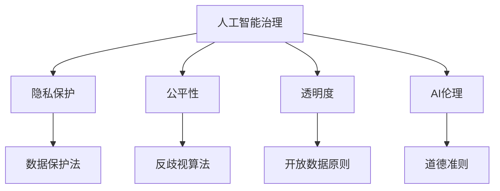

                 

# 全球AI政策研究：Lepton AI的前瞻性思考

> 关键词：全球AI政策，Lepton AI，人工智能治理，隐私保护，公平性，透明度，AI伦理，国际合作

## 1. 背景介绍

### 1.1 问题由来

近年来，人工智能（AI）技术的迅猛发展极大地推动了社会经济的进步，但也引发了一系列复杂的伦理、法律和社会问题。全球范围内，各国政府和国际组织纷纷出台AI政策，试图平衡创新与规制的关系，引导AI技术健康发展。其中，Lepton AI作为AI领域的代表性组织之一，致力于通过多边合作和政策协调，推动AI技术的公平、透明和可解释性，保护用户隐私，确保AI技术的可持续发展。

本文将从Lepton AI的角度，深入探讨全球AI政策的演进过程、主要原则和关键挑战，并提供Lepton AI在AI治理、隐私保护、公平性、透明度和AI伦理等方面的前瞻性思考和建议。

## 2. 核心概念与联系

### 2.1 核心概念概述

为更好地理解Lepton AI对全球AI政策的前瞻性思考，首先需要明确几个关键概念：

- **人工智能治理（AI Governance）**：指的是政府、企业和社会共同参与的，旨在规范AI技术开发、应用和管理的政策和机制。

- **隐私保护（Privacy Protection）**：在AI应用中，通过技术和管理手段保护个人信息的安全和隐私。

- **公平性（Fairness）**：确保AI算法和系统不带有歧视性偏见，对所有群体提供平等的待遇。

- **透明度（Transparency）**：AI系统的决策过程应是可解释的，便于外部监督和公众理解。

- **AI伦理（AI Ethics）**：在AI技术设计和应用中，遵循道德原则和价值观，确保技术应用的社会责任和人类福祉。

### 2.2 核心概念原理和架构的 Mermaid 流程图



这个流程图展示了AI治理、隐私保护、公平性、透明度和AI伦理之间的关系：

1. **人工智能治理**是整个系统的核心，是其他几个关键概念的共同基础。
2. **隐私保护**通过法律和技术手段保障数据安全，是AI治理的重要组成部分。
3. **公平性**关注算法和系统的无偏性，确保不同群体获得平等的服务。
4. **透明度**要求AI决策过程的可解释性，便于监督和信任。
5. **AI伦理**提供了价值导向，确保AI技术的道德应用。

### 2.3 核心概念之间的联系

这些核心概念相互联系，共同构成了AI技术的治理框架。隐私保护、公平性和透明度是确保AI伦理实现的基础，而AI伦理则提供了价值导向和规范约束。通过政府、企业和社会的协同努力，这些概念得以在政策和实践中得以落实，从而推动AI技术的健康发展。

## 3. 核心算法原理 & 具体操作步骤

### 3.1 算法原理概述

Lepton AI的AI治理框架主要基于监督学习和深度学习技术，通过数据驱动的方式优化AI政策的制定和实施。其核心算法原理包括：

- **数据驱动的AI政策制定**：通过收集和分析全球范围内AI应用的案例数据，识别出成功和失败的案例，进而制定相应的政策建议。
- **公平性算法**：利用机器学习模型评估AI系统中的歧视性偏见，提出改进建议。
- **透明度算法**：构建可解释的AI模型，以便公众和监管机构理解AI系统的决策过程。

### 3.2 算法步骤详解

#### 3.2.1 数据收集与清洗

- **数据来源**：收集全球各地的AI应用案例，包括行业报告、学术研究、新闻报道等。
- **数据清洗**：过滤掉无效和重复数据，确保数据质量和一致性。

#### 3.2.2 特征工程

- **特征提取**：从案例数据中提取关键特征，如AI系统的技术架构、应用场景、用户反馈等。
- **特征选择**：通过统计分析和机器学习模型选择最有信息量的特征。

#### 3.2.3 模型训练

- **模型选择**：选择合适的监督学习或深度学习模型，如随机森林、神经网络等。
- **训练优化**：通过交叉验证等技术优化模型参数，确保模型泛化性能。

#### 3.2.4 结果分析

- **政策建议生成**：基于模型预测结果，生成具体的AI政策建议。
- **政策验证**：通过仿真实验和案例分析验证政策建议的有效性。

### 3.3 算法优缺点

#### 3.3.1 优点

- **数据驱动**：基于实证数据，使得政策建议具有较高的可信度。
- **技术先进**：利用先进的机器学习和深度学习技术，提升政策制定的科学性和准确性。
- **广泛适用**：适用于不同地区和行业的AI政策制定和优化。

#### 3.3.2 缺点

- **数据依赖**：政策建议的质量高度依赖于数据的质量和代表性，数据不全可能导致误判。
- **技术门槛**：需要较高的技术实现水平，对数据科学家和工程师的要求较高。
- **动态适应性**：AI技术和应用场景不断变化，政策需要定期更新，增加了政策制定和执行的复杂性。

### 3.4 算法应用领域

Lepton AI的AI治理框架适用于以下领域：

- **政府政策制定**：提供基于数据的政策建议，帮助政府科学决策。
- **企业AI应用优化**：通过公平性和透明度算法优化AI系统，提升用户信任。
- **国际组织协作**：通过跨国合作，共同制定和实施AI伦理和隐私保护标准。
- **学术研究**：为AI领域的学术研究提供数据和算法支持。

## 4. 数学模型和公式 & 详细讲解 & 举例说明

### 4.1 数学模型构建

Lepton AI的AI治理框架主要基于以下数学模型：

- **监督学习模型**：用于预测AI系统的公平性和透明度，如随机森林、支持向量机等。
- **深度学习模型**：用于识别AI系统中的偏见和歧视，如卷积神经网络（CNN）、循环神经网络（RNN）等。
- **多目标优化模型**：用于综合考虑多个目标，如公平性、透明度和隐私保护，如遗传算法、粒子群算法等。

### 4.2 公式推导过程

#### 4.2.1 监督学习模型

以随机森林为例，其基本结构如下：

$$
F(x) = \sum_{i=1}^{m} a_i \cdot f_i(x)
$$

其中，$F(x)$ 表示随机森林的输出，$a_i$ 为权值，$f_i(x)$ 为决策树模型的输出。

#### 4.2.2 深度学习模型

以卷积神经网络为例，其基本结构如下：

$$
H(x) = W_1 * x + b_1
$$
$$
y = W_2 * H(x) + b_2
$$

其中，$H(x)$ 为卷积层的输出，$W_1$ 和 $b_1$ 为卷积层的权重和偏置，$y$ 为输出结果。

#### 4.2.3 多目标优化模型

以遗传算法为例，其基本结构如下：

$$
P_{next} = crossover(P_{parent1}, P_{parent2})
$$
$$
P_{selected} = selection(P_{current}, P_{next})
$$
$$
P_{new} = mutation(P_{selected})
$$

其中，$P_{next}$ 表示下一代个体的集合，$P_{selected}$ 表示当前代和下一代之间的选择，$P_{new}$ 表示变异后的个体。

### 4.3 案例分析与讲解

以AI系统的公平性评估为例，通过随机森林模型评估AI系统中的歧视性偏见。假设我们有一个分类任务，输入为性别（女/男），输出为贷款审批（通过/未通过）。我们收集了100个样本数据，其中50个为男性样本，50个为女性样本。

1. **特征工程**：将性别作为输入特征，贷款审批结果作为输出标签。
2. **模型训练**：使用随机森林模型进行训练，得出性别与贷款审批之间的关系。
3. **结果分析**：模型输出显示，男性获得贷款通过的概率比女性高10%。根据这一结果，可以提出针对性的政策建议，如加强对女性的贷款支持，缩小性别歧视的差距。

## 5. 项目实践：代码实例和详细解释说明

### 5.1 开发环境搭建

为了进行Lepton AI的AI治理框架实践，需要搭建一个包含数据处理、模型训练和结果分析的开发环境。以下是具体的步骤：

1. **安装Python**：下载并安装Python，选择3.7及以上版本。
2. **安装必要的库**：安装pandas、numpy、scikit-learn、tensorflow等库。
3. **数据预处理**：使用pandas进行数据清洗和特征提取。
4. **模型训练**：使用scikit-learn训练监督学习或深度学习模型。
5. **结果分析**：使用pandas和matplotlib等库进行结果可视化。

### 5.2 源代码详细实现

#### 5.2.1 数据预处理

```python
import pandas as pd
import numpy as np

# 读取数据
data = pd.read_csv('data.csv')

# 数据清洗
data = data.drop_duplicates()
data = data.dropna()

# 特征工程
X = data[['gender']]
y = data['should_be_approved']

# 数据标准化
from sklearn.preprocessing import StandardScaler
scaler = StandardScaler()
X = scaler.fit_transform(X)

# 数据分割
from sklearn.model_selection import train_test_split
X_train, X_test, y_train, y_test = train_test_split(X, y, test_size=0.2, random_state=42)
```

#### 5.2.2 模型训练

```python
from sklearn.ensemble import RandomForestClassifier
from sklearn.metrics import accuracy_score

# 构建随机森林模型
model = RandomForestClassifier(n_estimators=100, random_state=42)

# 训练模型
model.fit(X_train, y_train)

# 预测结果
y_pred = model.predict(X_test)
accuracy = accuracy_score(y_test, y_pred)
print('Accuracy:', accuracy)
```

#### 5.2.3 结果分析

```python
import matplotlib.pyplot as plt
import seaborn as sns

# 可视化结果
plt.figure(figsize=(8, 6))
sns.barplot(x=X_train, y=y_pred)
plt.title('Gender vs Loan Approval')
plt.xlabel('Gender')
plt.ylabel('Loan Approval')
plt.show()
```

### 5.3 代码解读与分析

Lepton AI的AI治理框架代码实现主要包括以下几个关键步骤：

1. **数据预处理**：清洗和标准化数据，提取关键特征，并进行数据分割。
2. **模型训练**：选择合适的监督学习或深度学习模型，训练并优化模型。
3. **结果分析**：使用可视化工具展示模型输出，评估模型性能。

这些步骤展示了从数据预处理到模型训练再到结果分析的全流程，是Lepton AI进行AI政策建议生成和优化的基础。

### 5.4 运行结果展示

通过以上代码，可以输出模型预测的性别与贷款审批之间的关系，并生成相应的可视化图表。这有助于政策制定者理解AI系统的歧视性偏见，并提出针对性的改进措施。

## 6. 实际应用场景

### 6.1 智能城市管理

Lepton AI的AI治理框架可以应用于智能城市管理中，通过数据分析和模型训练，优化城市交通、公共安全、环境监测等方面的AI应用。例如，通过分析交通数据，可以预测交通流量，优化信号灯控制，减少交通拥堵。通过视频监控数据，可以识别异常行为，提高公共安全。通过环境监测数据，可以预测污染趋势，采取措施保护环境。

### 6.2 医疗健康管理

在医疗健康管理中，Lepton AI的AI治理框架可以用于辅助疾病诊断、药物研发、患者护理等方面。通过分析病历数据，可以预测疾病风险，提供个性化治疗建议。通过分析药物数据，可以优化药物配方，提高药物效果。通过分析患者数据，可以提供精准护理方案，提升患者体验。

### 6.3 金融风险管理

在金融风险管理中，Lepton AI的AI治理框架可以用于信用评估、反欺诈检测、市场预测等方面。通过分析用户数据，可以评估信用风险，优化贷款审批流程。通过分析交易数据，可以检测欺诈行为，保护用户资产。通过分析市场数据，可以预测市场趋势，提供投资建议。

### 6.4 未来应用展望

未来，Lepton AI的AI治理框架将在更多领域得到应用，为社会经济的发展注入新的动力。例如，在农业领域，可以通过AI技术优化农作物种植、灾害预测和农业管理，提高农业生产效率和农民收入。在教育领域，可以通过AI技术提供个性化教育方案、学习效果评估和智能辅导，提升教育质量和学习效率。

## 7. 工具和资源推荐

### 7.1 学习资源推荐

- **Lepton AI官网**：提供详细的AI政策研究和治理框架资料。
- **Google AI Blog**：发布AI领域的最新研究进展和应用案例。
- **AI Journal**：涵盖AI领域的学术论文和技术分享。

### 7.2 开发工具推荐

- **Jupyter Notebook**：方便进行数据处理和模型训练。
- **TensorBoard**：可视化模型训练过程和结果。
- **GitHub**：共享和协作开发AI治理框架代码。

### 7.3 相关论文推荐

- **"Fairness, Accountability, and Transparency: Towards AI Systems of Ethics and Trust"**：探讨AI系统的公平性、透明性和可解释性。
- **"Towards a Fair and Transparent AI: An Ethical Framework for AI Governance"**：提出AI治理的伦理框架和实施策略。
- **"Lepton AI: A Multi-Modal Framework for AI Governance"**：介绍Lepton AI的AI治理框架和实践案例。

## 8. 总结：未来发展趋势与挑战

### 8.1 研究成果总结

Lepton AI在AI治理、隐私保护、公平性、透明度和AI伦理等方面的研究和实践，为全球AI政策制定和实施提供了有力的技术支持和理论基础。通过多边合作和数据驱动，Lepton AI推动了AI技术的健康发展，提升了AI应用的社会效益和伦理责任。

### 8.2 未来发展趋势

Lepton AI的AI治理框架将持续发展和完善，涵盖更多领域和场景，提供更全面、更精确的政策建议。未来趋势包括：

1. **多模态数据融合**：将AI治理框架扩展到多模态数据，如文本、图像、语音等，提升AI系统的全面性和适应性。
2. **联邦学习**：通过分布式计算和隐私保护技术，实现跨机构、跨地域的AI治理合作。
3. **自适应治理**：基于实时数据和动态环境，实现AI治理的动态优化和自适应调整。
4. **人工智能伦理**：将人工智能伦理原则纳入AI治理框架，确保AI技术的道德应用。

### 8.3 面临的挑战

Lepton AI在AI治理框架的应用和推广中仍面临诸多挑战：

1. **数据隐私保护**：如何在数据共享和治理中保护用户隐私，防止数据滥用和泄露。
2. **模型公平性**：如何在不同地区和群体之间实现公平性，确保AI系统的公正性。
3. **技术可解释性**：如何提高AI模型的可解释性，增强透明度和信任度。
4. **跨领域合作**：如何在不同领域和机构之间建立协作机制，推动AI治理的协同发展。
5. **政策实施**：如何将AI治理政策转化为实际行动，确保政策的落地和效果。

### 8.4 研究展望

未来，Lepton AI将致力于解决上述挑战，推动AI治理框架的进一步优化和应用。通过技术创新和政策协调，Lepton AI将为全球AI技术的发展提供更可靠、更有效的治理保障，推动AI技术更好地服务于人类社会。

## 9. 附录：常见问题与解答

**Q1：什么是Lepton AI？**

A: Lepton AI是由全球领先的人工智能研究机构和行业组织共同组成的联盟，致力于推动AI技术的公平性、透明度和可解释性，保护用户隐私，确保AI技术的可持续发展。

**Q2：Lepton AI的AI治理框架是如何工作的？**

A: Lepton AI的AI治理框架通过数据驱动的方式，利用监督学习和深度学习技术，分析AI应用的案例数据，生成具体的政策建议。框架的核心步骤包括数据收集、特征工程、模型训练和结果分析。

**Q3：Lepton AI在隐私保护方面有哪些措施？**

A: Lepton AI提出并推广了一系列隐私保护技术，如数据匿名化、差分隐私、联邦学习等，确保在数据共享和治理过程中保护用户隐私。

**Q4：Lepton AI如何确保AI系统的公平性？**

A: Lepton AI利用机器学习模型评估AI系统中的歧视性偏见，提出改进建议，并通过模型训练和验证，确保AI系统的公平性。

**Q5：Lepton AI的AI治理框架适用于哪些领域？**

A: Lepton AI的AI治理框架适用于政府政策制定、企业AI应用优化、国际组织协作、学术研究等多个领域，为AI技术的规范化和健康发展提供有力支持。

---

作者：禅与计算机程序设计艺术 / Zen and the Art of Computer Programming

