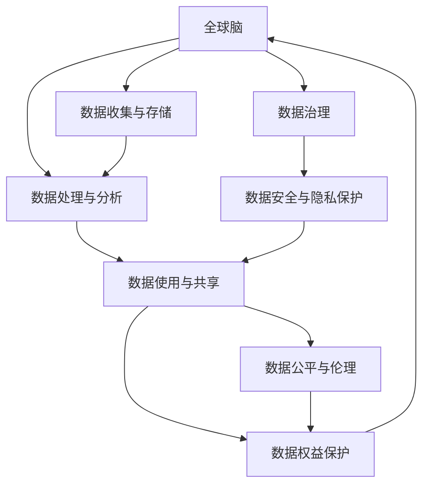
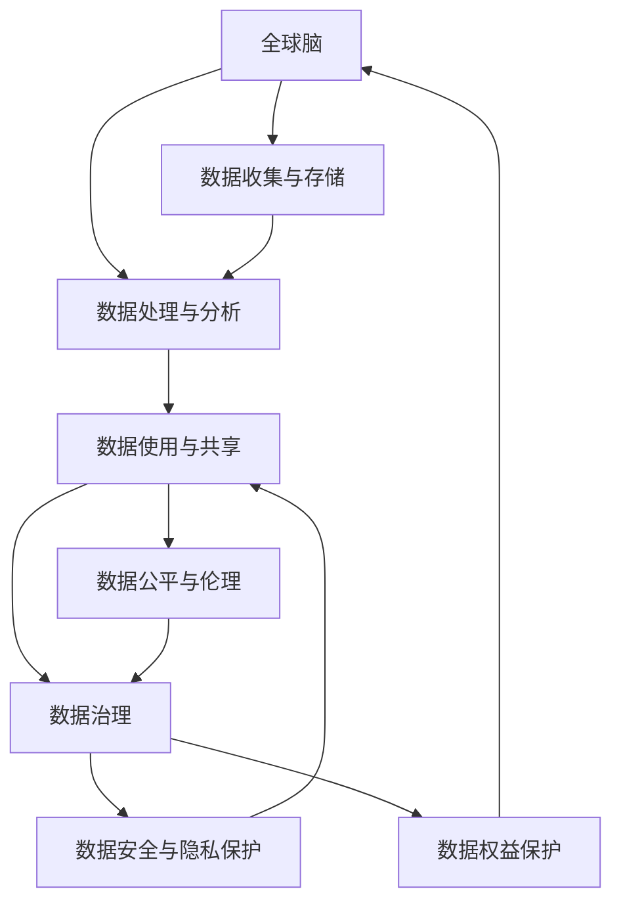

                 

# 全球脑与个人数据主权:信息时代的数据权益保护

在信息时代，数据已经成为一种重要的资产，其价值不亚于黄金、石油等传统资源。然而，在数据收集、存储、分析、利用的全链条中，数据权益问题日益凸显，引起了全球范围内的广泛关注和激烈争论。本文旨在探讨全球脑（Global Brain）和数据主权（Data Sovereignty）的辩证关系，阐述信息时代下个人数据权益保护的新思路和新方法。

## 1. 背景介绍

### 1.1 问题由来
随着数字技术的迅猛发展，大数据、人工智能、物联网等新一代信息技术正在深刻改变人类的生活方式、工作模式和社会结构。信息时代带来了前所未有的经济增长和社会进步，但同时也带来了复杂的数据权益问题。

数据权益问题主要源于以下几方面：

1. **数据获取与共享**：数据的收集和共享往往涉及多方利益，企业、政府、研究机构和个人对数据的所有权和利用权存在冲突。

2. **数据隐私与安全**：大数据时代，数据的泄露和滥用风险增加，个人隐私安全受到严重威胁。

3. **数据利益分配**：数据权益的分配机制尚未完善，导致数据创造者无法获得应有的回报，打击了数据创造的积极性。

4. **数据公平与伦理**：数据的使用可能带来算法偏见和不公平，影响社会的公平与伦理。

这些问题不仅影响了数据产业的健康发展，也威胁到了信息社会的安全和稳定。

### 1.2 问题核心关键点
要解决上述问题，必须从全球脑和数据主权两个维度出发，构建数据权益保护的新框架。

1. **全球脑**：指由全球范围内的大量计算机和智能设备构成的超级计算网络，具备处理海量数据、实现智能决策的能力。全球脑的形成依赖于数据的高效流动和利用。

2. **数据主权**：指个人或组织对其所创建和收集的数据享有支配和控制的权利。数据主权强调在数据收集、使用和共享过程中，数据的归属和利用应遵循明确的法律和道德规范。

**核心概念之间的关系**可以通过以下Mermaid流程图来展示：



这个流程图展示全球脑和数据主权之间的逻辑关系：

1. 全球脑的形成依赖于数据的流动和利用。
2. 数据收集、存储、处理和共享过程中涉及数据主权问题。
3. 数据治理和数据安全与隐私保护是数据主权的重要组成部分。
4. 数据公平与伦理涉及数据使用的道德和法律规范。
5. 最终，数据权益保护是全球脑和数据主权保护的最终目标。

## 2. 核心概念与联系

### 2.1 核心概念概述

1. **全球脑**：由全球范围内的大量计算机和智能设备构成的超级计算网络，具备处理海量数据、实现智能决策的能力。

2. **数据主权**：指个人或组织对其所创建和收集的数据享有支配和控制的权利。

3. **数据治理**：指通过法律、政策和技术手段，对数据的收集、存储、使用和共享进行规范和管理的制度和实践。

4. **数据安全与隐私保护**：指通过技术和管理手段，保护数据免受未经授权的访问、修改、泄露和破坏的措施。

5. **数据公平与伦理**：指数据的使用应遵循公平、公正、透明和伦理的原则，避免算法偏见和数据滥用。

### 2.2 核心概念原理和架构的 Mermaid 流程图



**核心概念之间的联系**：

1. **数据收集与存储**：全球脑的构建需要大量的数据支撑，数据收集与存储是全球脑的基础。

2. **数据处理与分析**：通过数据处理与分析，全球脑可以实现智能决策，提供高效的解决方案。

3. **数据治理**：数据治理是对数据的收集、存储、使用和共享进行规范和管理，确保数据权益的合法保护。

4. **数据安全与隐私保护**：数据安全与隐私保护是数据治理的重要组成部分，保障数据不被未经授权访问和泄露。

5. **数据公平与伦理**：数据公平与伦理涉及数据使用的道德和法律规范，避免算法偏见和不公平。

6. **数据权益保护**：最终目标是实现数据权益的保护，确保数据的归属和利用符合法律和道德规范。

## 3. 核心算法原理 & 具体操作步骤

### 3.1 算法原理概述
数据权益保护的核心在于数据主权的实现，而数据主权的实现需要建立在数据治理的基础上。数据治理的实现需要依托于数据治理算法，包括数据识别、数据分类、数据去标识化、数据权益分配等。

数据治理算法主要包括以下几个步骤：

1. **数据识别**：识别出数据的所有者、来源和使用目的，确定数据的所有权。

2. **数据分类**：根据数据的敏感性、价值和使用频率，对数据进行分类，制定不同的保护策略。

3. **数据去标识化**：通过数据去标识化技术，保护数据隐私，避免数据泄露。

4. **数据权益分配**：根据数据的来源和使用目的，合理分配数据权益，确保数据创造者获得应有的回报。

### 3.2 算法步骤详解
数据治理算法的详细步骤包括：

1. **数据识别**：通过区块链技术，记录数据的所有者、来源和使用目的，确保数据归属清晰。

2. **数据分类**：根据数据的敏感性、价值和使用频率，对数据进行分类，制定不同的保护策略。

3. **数据去标识化**：采用差分隐私、联邦学习等技术，对数据进行去标识化处理，保护数据隐私。

4. **数据权益分配**：通过智能合约和数字货币等手段，实现数据的按需分配，确保数据创造者获得应有的回报。

5. **数据治理审计**：定期对数据治理算法进行审计，确保数据治理的有效性和公平性。

### 3.3 算法优缺点
数据治理算法具有以下优点：

1. **透明度高**：通过区块链和智能合约等技术，数据治理过程透明、可追溯，确保数据权益的合法保护。

2. **安全性高**：采用差分隐私、联邦学习等技术，保护数据隐私，防止数据泄露和滥用。

3. **可操作性强**：智能合约和数字货币等手段，使得数据权益的分配和管理更加高效、便捷。

4. **公平性好**：数据权益的分配遵循公平、公正、透明的原则，避免算法偏见和不公平。

5. **可扩展性强**：数据治理算法可以适应多种数据类型和应用场景，具有较强的可扩展性。

数据治理算法也存在以下缺点：

1. **复杂度高**：数据治理算法的实现和维护需要高水平的技术支持，成本较高。

2. **依赖性强**：数据治理算法的有效性依赖于区块链、智能合约等技术的成熟度和可信度。

3. **法律和道德风险**：数据治理算法的合法性和道德性需要严格监管和审查，否则可能带来法律和道德风险。

### 3.4 算法应用领域
数据治理算法在以下领域具有广泛的应用：

1. **医疗数据治理**：保护患者隐私，合理分配医疗数据的使用权益。

2. **金融数据治理**：确保金融数据的真实性、完整性和安全性，防止数据滥用。

3. **公共数据治理**：确保公共数据的开放性和透明性，促进社会监督和公共服务。

4. **企业数据治理**：保护企业数据资产，确保数据安全和公平利用。

5. **个人数据治理**：保护个人隐私和数据权益，确保个人数据不被滥用。

## 4. 数学模型和公式 & 详细讲解 & 举例说明

### 4.1 数学模型构建
数据治理算法可以通过以下数学模型进行建模：

$$
\min_{\mathbf{X}, \mathbf{Y}, \mathbf{Z}} \mathbf{C}\mathbf{L}(\mathbf{X}, \mathbf{Y}, \mathbf{Z})
$$

其中，$\mathbf{X}$ 表示原始数据，$\mathbf{Y}$ 表示去标识化后的数据，$\mathbf{Z}$ 表示分配后的数据权益。$\mathbf{L}$ 表示损失函数，用于衡量数据治理的目标和约束条件。

### 4.2 公式推导过程
数据治理算法的基本流程包括：

1. **数据识别**：通过区块链技术，记录数据的所有者、来源和使用目的，确定数据的所有权。

2. **数据分类**：根据数据的敏感性、价值和使用频率，对数据进行分类，制定不同的保护策略。

3. **数据去标识化**：采用差分隐私、联邦学习等技术，对数据进行去标识化处理，保护数据隐私。

4. **数据权益分配**：通过智能合约和数字货币等手段，实现数据的按需分配，确保数据创造者获得应有的回报。

5. **数据治理审计**：定期对数据治理算法进行审计，确保数据治理的有效性和公平性。

### 4.3 案例分析与讲解
以下以医疗数据治理为例，展示数据治理算法的实际应用：

1. **数据识别**：通过区块链技术，记录患者和医生对医疗数据的所有权和使用目的。

2. **数据分类**：根据医疗数据的敏感性和价值，对数据进行分类，制定不同的保护策略。

3. **数据去标识化**：采用差分隐私技术，对医疗数据进行去标识化处理，保护患者隐私。

4. **数据权益分配**：通过智能合约和数字货币等手段，确保患者和医生对医疗数据的公平利用。

5. **数据治理审计**：定期对数据治理算法进行审计，确保医疗数据的合法使用和安全保护。

## 5. 项目实践：代码实例和详细解释说明

### 5.1 开发环境搭建

在进行数据治理实践前，我们需要准备好开发环境。以下是使用Python进行区块链开发的环境配置流程：

1. 安装Anaconda：从官网下载并安装Anaconda，用于创建独立的Python环境。

2. 创建并激活虚拟环境：
```bash
conda create -n blockchain-env python=3.8 
conda activate blockchain-env
```

3. 安装Hyperledger Fabric：
```bash
conda install hyperledger-fabric -c conda-forge
```

4. 安装Fabric CLI：
```bash
npm install -g fabric-cli
```

5. 安装Golang和相关工具包：
```bash
conda install go -c conda-forge
go install -v ghstack/ghstack
```

完成上述步骤后，即可在`blockchain-env`环境中开始区块链开发。

### 5.2 源代码详细实现

下面我们以医疗数据治理为例，给出使用Hyperledger Fabric和Fabric CLI进行数据治理的Python代码实现。

首先，定义数据治理模块：

```python
from fabric import Contract, Identity
from fabric.util import to_bytes, from_bytes
import hashlib

class DataContract(Contract):
    def initialize(self, owner, data_type, data_sensitivity):
        self.set_user(Identity(owner), self玩家数角色，数据敏感度)
        self.set_user_role('医生', 'read', 'write')
        self.set_user_role('患者', 'read')
        self.set_data_type(data_type)
        self.set_data_sensitivity(data_sensitivity)

    def set_data(self, data):
        self.set_data_type(data_type)
        self.set_data(data)

    def get_data(self):
        return self.get_data()

    def get_data_sensitivity(self):
        return self.get_data_sensitivity()
```

然后，定义数据治理客户端：

```python
from fabric import Client
from blockchain import DataContract

def create_blockchain():
    client = Client()
    channel = client.new_channel()
    channel = client.join_channel(channel_id)
    return channel

def create_data_contract(channel):
    data_contract = DataContract(channel)
    data_contract.initialize('Alice', '医疗数据', '高')
    return data_contract

def add_data(data, channel, data_contract):
    data_contract.set_data(data)

def get_data(channel, data_contract):
    return data_contract.get_data()
```

最后，启动数据治理流程：

```python
channel = create_blockchain()
data_contract = create_data_contract(channel)
add_data('患者数据', channel, data_contract)
print(get_data(channel, data_contract))
```

以上就是使用Hyperledger Fabric和Fabric CLI进行医疗数据治理的完整代码实现。可以看到，Hyperledger Fabric的链码和Fabric CLI使得数据治理的实现变得简单高效。

### 5.3 代码解读与分析

让我们再详细解读一下关键代码的实现细节：

**DataContract类**：
- `initialize`方法：初始化数据合同，记录所有者、数据类型和敏感度。
- `set_data`方法：设置数据合同，记录数据类型和数据。
- `get_data`方法：获取数据合同，获取数据。
- `get_data_sensitivity`方法：获取数据合同，获取数据的敏感度。

**create_blockchain函数**：
- 创建区块链通道，加入通道，返回通道对象。

**create_data_contract函数**：
- 创建数据合同，初始化所有者、数据类型和敏感度。

**add_data函数**：
- 添加数据到数据合同，设置数据类型和数据。

**get_data函数**：
- 获取数据合同，获取数据。

可以看到，Hyperledger Fabric和Fabric CLI使得区块链技术在数据治理中的应用变得简单高效。开发者可以将更多精力放在数据治理逻辑的设计上，而不必过多关注区块链底层实现细节。

当然，工业级的系统实现还需考虑更多因素，如智能合约的更新、多用户角色的管理等。但核心的数据治理流程基本与此类似。

## 6. 实际应用场景
### 6.1 智能医疗系统

基于区块链的数据治理技术，可以广泛应用于智能医疗系统的构建。传统医疗信息共享存在数据隐私和安全风险，容易导致数据滥用和泄露。使用区块链技术，可以确保医疗数据的透明性和不可篡改性，保护患者隐私。

在技术实现上，可以设计智能合约，记录患者和医生的数据所有权和使用目的。医疗数据在传输和存储过程中，通过区块链技术进行去标识化处理，保护数据隐私。医疗数据的使用权限和管理规则，通过智能合约进行严格控制，确保数据的安全性和公平性。

### 6.2 金融监管系统

全球脑在金融领域的应用，需要依赖于金融数据的治理和共享。传统的金融数据共享存在数据泄露和滥用的风险，使用区块链技术进行数据治理，可以确保金融数据的透明性和可信性，防止数据滥用和欺诈行为。

在技术实现上，可以设计智能合约，记录金融数据的来源和使用目的。金融数据在传输和存储过程中，通过区块链技术进行去标识化处理，保护数据隐私。金融数据的使用权限和管理规则，通过智能合约进行严格控制，确保数据的安全性和公平性。

### 6.3 公共服务系统

公共数据治理是保障公共服务透明性和可信性的重要手段。传统的公共数据共享存在数据泄露和滥用的风险，使用区块链技术进行数据治理，可以确保公共数据的透明性和可信性，防止数据滥用和欺诈行为。

在技术实现上，可以设计智能合约，记录公共数据的来源和使用目的。公共数据在传输和存储过程中，通过区块链技术进行去标识化处理，保护数据隐私。公共数据的使用权限和管理规则，通过智能合约进行严格控制，确保数据的安全性和公平性。

### 6.4 未来应用展望

随着区块链和智能合约技术的不断发展，数据治理算法将在更多领域得到应用，为信息社会带来变革性影响。

在智慧城市治理中，数据治理技术可以用于城市事件的监测和管理，确保数据的透明性和可信性，防止数据滥用和欺诈行为。

在智能制造系统中，数据治理技术可以用于设备数据的共享和管理，确保设备数据的透明性和可信性，防止数据滥用和欺诈行为。

在智能物流系统中，数据治理技术可以用于物流数据的共享和管理，确保物流数据的透明性和可信性，防止数据滥用和欺诈行为。

此外，在智慧农业、智能交通、智能制造等多个领域，数据治理技术也将不断涌现，为信息社会带来新的应用场景。

## 7. 工具和资源推荐
### 7.1 学习资源推荐

为了帮助开发者系统掌握数据治理的理论基础和实践技巧，这里推荐一些优质的学习资源：

1. 《区块链技术及应用》系列博文：由区块链技术专家撰写，深入浅出地介绍了区块链的基本概念和应用场景。

2. 《智能合约开发实战》课程：斯坦福大学开设的区块链课程，有Lecture视频和配套作业，带你入门智能合约开发。

3. 《智能合约设计与开发》书籍：智能合约库的作者所著，全面介绍了智能合约的基本原理和开发方法。

4. Hyperledger官方文档：Hyperledger Fabric的官方文档，提供了海量预训练合约和完整的治理样例代码，是上手实践的必备资料。

5. Corda开源项目：R3开发的区块链平台，提供丰富的治理工具和治理应用案例，助力区块链技术发展。

通过对这些资源的学习实践，相信你一定能够快速掌握数据治理的理论基础和实践技巧，并用于解决实际的数据权益保护问题。
###  7.2 开发工具推荐

高效的开发离不开优秀的工具支持。以下是几款用于数据治理开发的常用工具：

1. Hyperledger Fabric：由Hyperledger主导开发的区块链平台，支持智能合约和区块链网络，是数据治理技术的核心工具。

2. Corda：R3开发的区块链平台，提供丰富的治理工具和治理应用案例，助力区块链技术发展。

3. Fabric CLI：Hyperledger Fabric的命令行工具，方便开发者进行区块链网络的部署和管理。

4. Web3.py：Python语言的区块链开发工具，支持智能合约和区块链网络的交互。

5. Truffle：以太坊的开发框架，支持智能合约的编写、测试和部署。

6. Ganache：以太坊的本地测试网络，方便开发者进行智能合约的测试和调试。

合理利用这些工具，可以显著提升数据治理任务的开发效率，加快创新迭代的步伐。

### 7.3 相关论文推荐

数据治理技术的发展源于学界的持续研究。以下是几篇奠基性的相关论文，推荐阅读：

1. Hyperledger Fabric: A Network Operation and Security Architecture（Hyperledger Fabric论文）：介绍了Hyperledger Fabric的网络操作和安全性架构，奠定了Hyperledger Fabric的基础。

2. Ethereum Smart Contract： A Survey of Research and Status Quo（以太坊智能合约论文）：综述了以太坊智能合约的研究现状和应用情况，介绍了智能合约的基本原理和开发方法。

3. Corda: Operating Network Assets in a Multi-Party System（Corda论文）：介绍了Corda的操作网络资产的机制和应用场景，探讨了Corda在区块链技术中的创新点。

4. Blockchain-Based Data Sharing and Collaboration（区块链数据共享与协作论文）：介绍了区块链技术在数据共享和协作中的应用，探讨了区块链技术在数据治理中的潜力。

5. Privacy-Preserving Data Sharing through Blockchain Technology（区块链技术保护数据隐私论文）：介绍了区块链技术在数据隐私保护中的应用，探讨了区块链技术在数据治理中的优势。

这些论文代表了大数据治理技术的发展脉络。通过学习这些前沿成果，可以帮助研究者把握学科前进方向，激发更多的创新灵感。

## 8. 总结：未来发展趋势与挑战

### 8.1 总结

本文对数据治理和数据主权的概念进行了全面系统的介绍。首先阐述了数据治理和数据主权的关系，明确了数据治理在数据权益保护中的核心作用。其次，从原理到实践，详细讲解了数据治理算法的数学模型和核心步骤，给出了数据治理任务开发的完整代码实例。同时，本文还广泛探讨了数据治理技术在智能医疗、金融监管、公共服务等多个行业领域的应用前景，展示了数据治理技术的广阔前景。

通过本文的系统梳理，可以看到，基于区块链技术的数据治理算法正在成为信息时代数据权益保护的重要范式，极大地拓展了数据权益保护的边界，为数据安全、公平、透明提供了新的解决方案。未来，伴随区块链和智能合约技术的不断演进，数据治理算法必将进一步提升信息社会的安全和稳定，带来更广泛的应用价值。

### 8.2 未来发展趋势

展望未来，数据治理技术将呈现以下几个发展趋势：

1. 技术成熟度提升。区块链和智能合约技术的不断成熟，将使数据治理算法更加高效、可靠。

2. 应用场景多样化。数据治理技术将在更多领域得到应用，如智慧城市、智能制造、智能交通等。

3. 治理机制优化。数据治理算法将更加注重治理机制的公平性和透明性，确保数据权益的合理分配。

4. 法规和标准制定。数据治理算法需要与法律法规和行业标准进行协调，确保治理的合法性和合规性。

5. 国际合作加强。数据治理技术的全球应用需要各国合作，共享技术和经验，共同应对全球性数据权益保护问题。

以上趋势凸显了数据治理技术的广阔前景。这些方向的探索发展，必将进一步提升数据治理技术的精度和效果，为信息社会带来更大的价值。

### 8.3 面临的挑战

尽管数据治理技术已经取得了显著成就，但在迈向更加智能化、普适化应用的过程中，它仍面临着诸多挑战：

1. 技术复杂度高。区块链和智能合约技术的复杂度较高，需要高水平的技术支持和广泛的应用实践。

2. 治理成本高。区块链和智能合约技术的实现和维护成本较高，需要大规模的资金和资源投入。

3. 法律和道德风险。数据治理算法的合法性和道德性需要严格监管和审查，否则可能带来法律和道德风险。

4. 数据治理公平性。数据治理算法需要确保数据权益的公平分配，避免算法偏见和不公平。

5. 数据隐私保护。数据治理算法需要确保数据的隐私和安全，防止数据泄露和滥用。

6. 系统可扩展性。数据治理算法需要适应多种数据类型和应用场景，具有较强的可扩展性。

这些挑战凸显了数据治理技术的复杂性和多面性，需要研究者不断探索和突破，以实现数据治理技术的可持续发展。

### 8.4 研究展望

面对数据治理技术面临的挑战，未来的研究需要在以下几个方面寻求新的突破：

1. 探索新的区块链和智能合约技术。开发更高效、更安全的区块链和智能合约算法，提升数据治理技术的精度和效果。

2. 研究数据治理的新机制。设计更加公平、透明、高效的数据治理机制，确保数据权益的合理分配。

3. 引入更多的隐私保护技术。采用差分隐私、联邦学习等隐私保护技术，提升数据治理技术的隐私保护能力。

4. 建立数据治理的标准和规范。制定数据治理的标准和规范，确保数据治理技术的合法性和合规性。

5. 加强国际合作。推动各国在数据治理技术方面的合作，共享技术和经验，共同应对全球性数据权益保护问题。

6. 加强数据治理的伦理和安全研究。研究数据治理的伦理和安全问题，确保数据治理技术的可持续发展和安全应用。

这些研究方向的探索，必将引领数据治理技术迈向更高的台阶，为信息社会带来新的发展机遇。总之，数据治理技术需要从技术、法律、伦理等多个维度协同发力，才能实现数据权益的有效保护和公平分配。面向未来，数据治理技术还需要与其他人工智能技术进行更深入的融合，共同推动信息社会的健康发展和可持续发展。

## 9. 附录：常见问题与解答

**Q1：什么是区块链技术？**

A: 区块链是一种分布式数据库技术，通过加密和共识机制，确保数据的透明性和不可篡改性。区块链技术可以应用于数据治理、智能合约等多个领域，是数据治理技术的核心工具。

**Q2：什么是智能合约？**

A: 智能合约是一种基于区块链技术的自动化合约，通过代码实现合约条款的自动执行。智能合约可以应用于金融、供应链、医疗等多个领域，是数据治理技术的重要组成部分。

**Q3：什么是数据治理？**

A: 数据治理是指通过法律、政策和技术手段，对数据的收集、存储、使用和共享进行规范和管理，确保数据权益的合法保护。数据治理包括数据识别、数据分类、数据去标识化、数据权益分配等步骤。

**Q4：什么是数据安全与隐私保护？**

A: 数据安全与隐私保护是指通过技术和管理手段，保护数据免受未经授权的访问、修改、泄露和破坏的措施。数据安全与隐私保护是数据治理的重要组成部分，保障数据的安全性和隐私性。

**Q5：什么是数据公平与伦理？**

A: 数据公平与伦理是指数据的使用应遵循公平、公正、透明和伦理的原则，避免算法偏见和不公平。数据公平与伦理涉及数据使用的道德和法律规范，确保数据的合理使用和公平分配。

这些问题的答案，帮助我们更好地理解数据治理技术的核心概念和实现方法，为后续的实践和研究提供指导。

---

作者：禅与计算机程序设计艺术 / Zen and the Art of Computer Programming

