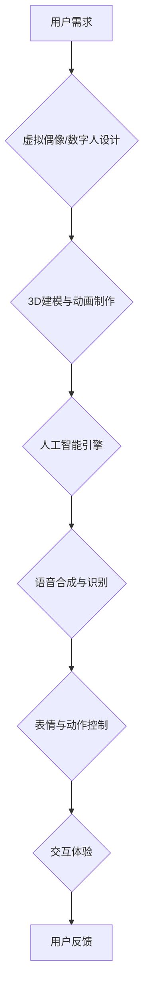

                 

## 2050年的数字创意：从虚拟偶像到数字人的商业应用

> 关键词：虚拟偶像、数字人、人工智能、计算机视觉、自然语言处理、元宇宙、商业应用、未来趋势

## 1. 背景介绍

2050年，数字创意将彻底改变我们的生活方式，并成为经济发展的新引擎。虚拟偶像和数字人作为数字创意的代表，将从娱乐领域拓展到各个领域，成为我们日常生活不可或缺的一部分。

虚拟偶像是指使用计算机技术生成的虚拟形象，拥有独立的个性、故事和粉丝群体。它们可以通过动画、游戏、直播等形式与用户互动，提供娱乐、陪伴、信息等服务。数字人则更具逼真度，基于深度学习和3D建模技术，能够模拟人类的语言、表情、动作等，实现更自然的交互体验。

近年来，虚拟偶像和数字人的发展势头迅猛。从日本流行的虚拟歌手Hatsune Miku到中国爆火的虚拟主播“虚拟罗伊”，它们已经积累了庞大的粉丝群体，并开始涉足商业领域。

## 2. 核心概念与联系

**2.1 虚拟偶像与数字人的核心概念**

* **虚拟偶像:** 基于二维或三维图形，通过动画、游戏、直播等形式与用户互动，提供娱乐、陪伴、信息等服务。
* **数字人:** 基于深度学习和3D建模技术，能够模拟人类的语言、表情、动作等，实现更自然的交互体验。

**2.2 核心概念联系**

虚拟偶像和数字人都是数字创意的产物，两者之间存在着密切的联系。虚拟偶像可以看作是数字人的早期形态，而数字人则是虚拟偶像的升级版。

**2.3 架构流程图**



## 3. 核心算法原理 & 具体操作步骤

**3.1 算法原理概述**

虚拟偶像和数字人的核心算法原理主要包括：

* **3D建模与动画制作:** 利用3D建模软件创建虚拟形象，并通过动画技术赋予其动作和表情。
* **人工智能引擎:** 基于深度学习算法，实现虚拟偶像和数字人的智能交互能力，包括语音识别、自然语言处理、情感识别等。
* **语音合成与识别:** 利用语音合成技术生成虚拟形象的语音，并通过语音识别技术理解用户的语音指令。
* **表情与动作控制:** 根据用户的指令或人工智能引擎的分析，控制虚拟形象的表情和动作，使其更加自然逼真。

**3.2 算法步骤详解**

1. **数据采集与预处理:** 收集大量语音、文本、图像等数据，并进行预处理，例如语音降噪、文本清洗等。
2. **模型训练:** 利用深度学习算法，训练语音识别、自然语言处理、情感识别等模型。
3. **虚拟形象生成:** 利用3D建模软件创建虚拟形象，并根据模型训练结果，赋予其相应的语音、表情和动作。
4. **交互系统搭建:** 开发交互系统，实现用户与虚拟形象的语音、文本、图像等多模态交互。
5. **测试与优化:** 对虚拟形象进行测试，并根据用户反馈进行优化，不断提升其交互体验和智能水平。

**3.3 算法优缺点**

* **优点:** 能够提供更加逼真的交互体验，扩展了数字创意的应用场景。
* **缺点:** 算法训练需要大量数据和计算资源，技术难度较高，成本也相对较高。

**3.4 算法应用领域**

* **娱乐:** 虚拟偶像、数字人可以用于游戏、动画、电影等娱乐领域，为用户提供更加沉浸式的体验。
* **教育:** 数字人可以作为虚拟老师，为学生提供个性化的教学服务。
* **医疗:** 数字人可以模拟患者的病情，帮助医生进行诊断和治疗。
* **客服:** 数字人可以作为虚拟客服，为用户提供24小时在线服务。

## 4. 数学模型和公式 & 详细讲解 & 举例说明

**4.1 数学模型构建**

虚拟偶像和数字人的核心算法基于深度学习模型，例如循环神经网络（RNN）、卷积神经网络（CNN）等。这些模型可以学习数据中的复杂模式，并进行预测和生成。

**4.2 公式推导过程**

深度学习模型的训练过程涉及到大量的数学公式，例如梯度下降算法、激活函数等。这些公式的推导过程较为复杂，需要一定的数学基础。

**4.3 案例分析与讲解**

例如，在语音合成方面，可以使用基于RNN的序列到序列模型（seq2seq）进行训练。该模型可以学习语音信号之间的关系，并生成逼真的语音输出。

$$
y_t = f(W_1 x_t + W_2 h_{t-1} + b_1)
$$

其中：

* $y_t$ 是时间步t的输出语音特征
* $x_t$ 是时间步t的输入语音特征
* $h_{t-1}$ 是时间步t-1的隐藏状态
* $W_1$, $W_2$ 是权重矩阵
* $b_1$ 是偏置项
* $f$ 是激活函数

## 5. 项目实践：代码实例和详细解释说明

**5.1 开发环境搭建**

虚拟偶像和数字人的开发环境通常包括：

* 操作系统：Windows、Linux、macOS等
* 编程语言：Python、C++等
* 深度学习框架：TensorFlow、PyTorch等
* 3D建模软件：Blender、Maya等

**5.2 源代码详细实现**

由于篇幅限制，这里只提供一个简单的语音合成代码示例：

```python
import tensorflow as tf

# 定义模型结构
model = tf.keras.Sequential([
    tf.keras.layers.Embedding(input_dim=vocab_size, output_dim=embedding_dim),
    tf.keras.layers.LSTM(units=hidden_units),
    tf.keras.layers.Dense(units=vocab_size, activation='softmax')
])

# 编译模型
model.compile(optimizer='adam', loss='sparse_categorical_crossentropy', metrics=['accuracy'])

# 训练模型
model.fit(train_data, train_labels, epochs=epochs)

# 生成语音
text = "你好，世界！"
predicted_tokens = model.predict(text)
synthesized_audio = generate_audio(predicted_tokens)
```

**5.3 代码解读与分析**

该代码示例使用TensorFlow框架构建了一个基于LSTM的语音合成模型。模型首先将文本输入转换为嵌入向量，然后通过LSTM层进行编码，最后通过全连接层生成语音输出。

**5.4 运行结果展示**

运行该代码后，模型将生成一个语音文件，包含输入文本“你好，世界！”的语音合成结果。

## 6. 实际应用场景

**6.1 虚拟偶像在娱乐领域的应用**

虚拟偶像已经成为流行文化的一部分，例如日本虚拟歌手Hatsune Miku，其粉丝群体遍布全球。

**6.2 数字人与客服行业的应用**

数字人可以作为虚拟客服，为用户提供24小时在线服务，例如回答常见问题、处理订单等。

**6.3 数字人与教育领域的应用**

数字人可以作为虚拟老师，为学生提供个性化的教学服务，例如讲解课程内容、解答学生疑问等。

**6.4 未来应用展望**

未来，虚拟偶像和数字人将应用于更多领域，例如医疗、金融、零售等，为我们的生活带来更多便利和乐趣。

## 7. 工具和资源推荐

**7.1 学习资源推荐**

* **书籍:**
    * 《深度学习》
    * 《自然语言处理》
    * 《计算机视觉》
* **在线课程:**
    * Coursera
    * edX
    * Udacity

**7.2 开发工具推荐**

* **深度学习框架:** TensorFlow, PyTorch
* **3D建模软件:** Blender, Maya
* **语音合成引擎:** Google Cloud Text-to-Speech, Amazon Polly

**7.3 相关论文推荐**

* **Generative Adversarial Networks**
* **Transformer Networks**
* **Attention Is All You Need**

## 8. 总结：未来发展趋势与挑战

**8.1 研究成果总结**

近年来，虚拟偶像和数字人的研究取得了显著进展，算法模型不断优化，交互体验更加逼真。

**8.2 未来发展趋势**

* **更逼真的虚拟形象:** 利用更先进的3D建模和动画技术，创造更加逼真的虚拟形象。
* **更智能的交互体验:** 利用更强大的人工智能算法，实现更自然、更智能的交互体验。
* **更广泛的应用场景:** 将虚拟偶像和数字人应用于更多领域，例如医疗、教育、金融等。

**8.3 面临的挑战**

* **技术难题:** 创造更加逼真、智能的虚拟形象和交互体验仍然面临着技术挑战。
* **伦理问题:** 虚拟偶像和数字人的发展也引发了一些伦理问题，例如虚假信息传播、隐私泄露等。
* **商业模式:** 如何构建可持续的商业模式，是虚拟偶像和数字人产业发展面临的挑战。

**8.4 研究展望**

未来，虚拟偶像和数字人将继续朝着更加逼真、智能、广泛的方向发展，为我们的生活带来更多可能性。


## 9. 附录：常见问题与解答

**9.1 如何创建虚拟偶像？**

创建虚拟偶像需要以下步骤：

1. 确定虚拟偶像的形象、性格、故事等。
2. 利用3D建模软件创建虚拟形象。
3. 利用动画技术赋予虚拟形象动作和表情。
4. 开发人工智能引擎，实现虚拟偶像的智能交互能力。

**9.2 数字人与虚拟偶像有什么区别？**

数字人更加逼真，能够模拟人类的语言、表情、动作等，而虚拟偶像则相对简单，通常是二维或三维图形。

**9.3 虚拟偶像和数字人的未来发展趋势是什么？**

未来，虚拟偶像和数字人将更加逼真、智能、广泛，应用于更多领域。


作者：禅与计算机程序设计艺术 / Zen and the Art of Computer Programming 
<end_of_turn>

