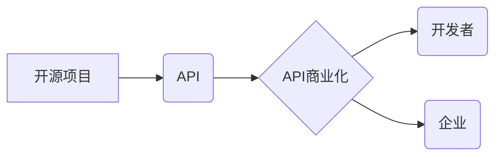

                 

## 开源项目的API商业化：策略和定价模型

> 关键词：开源项目、API商业化、定价策略、价值评估、商业模式

## 1. 背景介绍

开源软件在软件开发领域占据着越来越重要的地位。其开放的特性促进了社区协作、技术创新和软件生态的繁荣。然而，开源项目本身通常无法直接带来商业收益。随着开源项目的成熟和功能完善，将其API商业化成为了一种重要的盈利模式。

API商业化是指将开源项目的API作为服务提供给开发者和企业，并通过收费、订阅或其他方式获取收益。这种模式能够为开源项目提供持续的资金支持，同时也能为开发者和企业提供便捷的软件集成和应用开发服务。

## 2. 核心概念与联系

### 2.1 开源项目

开源项目是指源代码公开可供他人免费使用、修改和再发布的软件项目。其特点包括：

* **开放性:** 源代码公开透明，任何人都可以访问、修改和使用。
* **社区驱动:** 开发和维护由社区成员共同参与，而非单一公司或组织。
* **协作创新:** 开发者可以共享代码、经验和知识，促进技术进步。

### 2.2 API

API（Application Programming Interface，应用程序编程接口）是一种软件组件之间的通信协议，允许不同软件系统之间进行数据交换和功能调用。

* **定义:** API定义了软件组件之间如何交互，包括数据格式、请求方式和响应规则。
* **功能:** API提供了一种标准化的接口，使不同软件系统能够互联互通，实现数据共享和功能集成。
* **类型:** API可以分为RESTful API、SOAP API、GraphQL API等多种类型。

### 2.3 API商业化

API商业化是指将开源项目的API作为服务提供给开发者和企业，并通过收费、订阅或其他方式获取收益。

* **模式:** API商业化模式包括按使用量收费、订阅服务、白标服务、联合营销等。
* **价值:** API商业化可以为开源项目提供持续的资金支持，同时也能为开发者和企业提供便捷的软件集成和应用开发服务。

**核心概念关系流程图:**



## 3. 核心算法原理 & 具体操作步骤

### 3.1 算法原理概述

API商业化涉及到一系列算法和技术，包括：

* **价值评估算法:** 用于评估开源项目的API价值，并确定合理的收费标准。
* **定价策略算法:** 用于制定不同的API定价策略，例如按使用量收费、订阅服务等。
* **流量控制算法:** 用于控制API访问流量，防止服务过载。
* **安全认证算法:** 用于验证用户身份和授权，确保API安全使用。

### 3.2 算法步骤详解

**价值评估算法:**

1. **功能分析:** 分析开源项目的API功能，识别其核心价值和应用场景。
2. **市场调研:** 研究目标用户的需求和支付意愿，了解市场竞争情况。
3. **成本分析:** 计算开源项目的开发、维护和运营成本。
4. **价值模型构建:** 基于以上分析结果，构建API价值模型，量化API的价值。

**定价策略算法:**

1. **成本加成定价:** 将开发、维护和运营成本加成一定的利润率，确定API价格。
2. **价值定价:** 根据API的价值和用户需求，制定不同的价格等级。
3. **竞争定价:** 参考市场上类似API的价格，制定竞争性价格。
4. **订阅定价:** 提供不同级别的订阅服务，用户根据需求选择不同的服务套餐。

**流量控制算法:**

1. **限流:** 设置API请求的每秒/分钟/小时最大请求数。
2. **降速:** 限制API响应速度，避免服务过载。
3. **熔断:** 当API请求量超过阈值时，暂时关闭API服务，防止系统崩溃。

**安全认证算法:**

1. **API密钥:** 为每个用户分配唯一的API密钥，用于身份验证。
2. **OAuth:** 使用OAuth协议进行授权，允许用户授权第三方应用访问其数据。
3. **JWT:** 使用JSON Web Token进行身份验证和授权，确保API请求的安全性。

### 3.3 算法优缺点

**价值评估算法:**

* **优点:** 可以更准确地评估API价值，制定合理的收费标准。
* **缺点:** 需要收集大量数据和进行复杂的分析，成本较高。

**定价策略算法:**

* **优点:** 可以根据不同的市场情况和用户需求制定灵活的定价策略。
* **缺点:** 需要不断调整和优化，才能找到最佳的定价方案。

**流量控制算法:**

* **优点:** 可以有效防止服务过载，保障API稳定运行。
* **缺点:** 可能影响用户体验，需要合理设置阈值和策略。

**安全认证算法:**

* **优点:** 可以有效保障API的安全性，防止未授权访问。
* **缺点:** 需要复杂的认证机制，可能增加开发和维护成本。

### 3.4 算法应用领域

* **软件开发:** API商业化可以为开发者提供便捷的软件集成和应用开发服务。
* **数据服务:** API可以将数据公开提供给第三方应用，实现数据共享和价值创造。
* **云计算:** 云服务提供商可以通过API商业化，提供更灵活和定制化的服务。
* **物联网:** API可以连接不同类型的设备，实现数据采集、分析和控制。

## 4. 数学模型和公式 & 详细讲解 & 举例说明

### 4.1 数学模型构建

API商业化的价值评估可以采用以下数学模型：

$$V = f(F, M, C)$$

其中：

* $V$：API价值
* $F$：API功能价值
* $M$：市场需求价值
* $C$：开发和维护成本

### 4.2 公式推导过程

* **功能价值 (F):** 可以通过分析API的功能特性、应用场景和用户需求，采用评分或权重的方法进行量化。例如，可以根据API的功能复杂度、易用性、安全性等指标进行评分，并将其转换为数值。

* **市场需求价值 (M):** 可以通过市场调研、用户调查等方式，了解目标用户的需求和支付意愿。例如，可以调查用户愿意为API支付的最高价格，或者分析市场上类似API的收费标准。

* **开发和维护成本 (C):** 可以通过分析开发人员的工时、硬件成本、软件成本等因素，计算出API的开发和维护成本。

### 4.3 案例分析与讲解

假设一个开源项目开发了一个API，用于提供天气预报服务。

* **功能价值 (F):** 该API提供多种天气预报数据，包括温度、湿度、风速等，并支持多种数据格式和接口调用方式。根据功能复杂度、易用性和安全性等指标，可以赋予其一个较高的功能价值评分。

* **市场需求价值 (M):** 市场调研显示，许多开发者和企业需要天气预报数据，并且愿意为高质量的API服务付费。根据用户调查，用户愿意为该API支付每月5美元的订阅费用。

* **开发和维护成本 (C):** 开发和维护该API需要投入一定的开发人员工时、服务器成本和软件成本，总计约为每月1000美元。

根据以上数据，我们可以使用上述数学模型计算该API的价值：

$$V = f(F, M, C)$$

$$V = f(高, 高, 低)$$

由于功能价值和市场需求价值都较高，而开发和维护成本较低，因此该API的价值较高。

## 5. 项目实践：代码实例和详细解释说明

### 5.1 开发环境搭建

* **操作系统:** Linux/macOS/Windows
* **编程语言:** Python/Node.js/Java等
* **框架:** Flask/Express.js/Spring Boot等
* **数据库:** MySQL/PostgreSQL/MongoDB等
* **API网关:** Kong/Tyk/Apigee等

### 5.2 源代码详细实现

以下是一个简单的Python Flask API示例：

```python
from flask import Flask, jsonify

app = Flask(__name__)

@app.route('/api/weather', methods=['GET'])
def get_weather():
    city = request.args.get('city')
    if not city:
        return jsonify({'error': 'City parameter is required'}), 400
    # 调用天气预报API获取数据
    weather_data = get_weather_data(city)
    return jsonify(weather_data)

if __name__ == '__main__':
    app.run(debug=True)
```

**代码解读:**

* 该代码使用Flask框架构建了一个简单的API。
* `/api/weather` 路由用于获取天气预报数据。
* `get_weather()` 函数接收 `city` 参数，并调用 `get_weather_data()` 函数获取天气预报数据。
* `get_weather_data()` 函数需要根据实际情况实现天气预报数据获取逻辑。
* API返回天气预报数据以JSON格式。

### 5.3 代码解读与分析

* **路由:** API使用路由机制将不同的请求映射到不同的处理函数。
* **参数:** API可以接收参数，例如 `city` 参数用于指定获取天气预报的城市。
* **数据格式:** API返回数据以JSON格式，方便前端解析和使用。
* **错误处理:** API需要处理错误情况，例如参数缺失或天气预报数据获取失败。

### 5.4 运行结果展示

运行该代码后，可以通过浏览器访问 `http://localhost:5000/api/weather?city=北京` 获取北京的天气预报数据。

## 6. 实际应用场景

### 6.1 开发者工具

* **API测试工具:** 使用API测试工具可以方便地测试和调试API接口。
* **API文档生成工具:** 使用API文档生成工具可以自动生成API文档，方便开发者理解和使用API。
* **API监控工具:** 使用API监控工具可以实时监控API的性能和健康状况，及时发现问题。

### 6.2 企业应用

* **数据集成:** 将不同系统的数据整合到一起，实现数据共享和分析。
* **业务流程自动化:** 通过API调用外部服务，实现业务流程的自动化。
* **定制化服务:** 提供定制化的API服务，满足特定用户的需求。

### 6.3 未来应用展望

* **人工智能:** 将API与人工智能技术结合，提供更智能和个性化的服务。
* **区块链:** 使用区块链技术保障API的安全性和透明度。
* **边缘计算:** 将API部署到边缘设备，实现更低延迟和更高效的应用。

## 7. 工具和资源推荐

### 7.1 学习资源推荐

* **书籍:**

    * 《RESTful Web Services》
    * 《Designing Data-Intensive Applications》

* **在线课程:**

    * Coursera: API Design and Development
    * Udemy: Building RESTful APIs with Python

### 7.2 开发工具推荐

* **API测试工具:** Postman, Insomnia
* **API文档生成工具:** Swagger, OpenAPI Generator
* **API监控工具:** Datadog, New Relic

### 7.3 相关论文推荐

* **RESTful API Design Principles:** https://restfulapi.net/
* **API Security Best Practices:** https://owasp.org/www-project-api-security/

## 8. 总结：未来发展趋势与挑战

### 8.1 研究成果总结

API商业化为开源项目提供了新的盈利模式，促进了开源软件的持续发展。通过价值评估、定价策略和流量控制等算法，可以有效地将开源项目的API商业化。

### 8.2 未来发展趋势

* **API经济的兴起:** API将成为数字经济的重要组成部分，API市场规模将持续增长。
* **API平台的崛起:** 一些平台将提供API开发、管理和商业化的服务，降低开发门槛。
* **API安全和隐私的关注:** API安全和隐私将成为越来越重要的关注点，需要开发更安全的API解决方案。

### 8.3 面临的挑战

* **价值评估的复杂性:** 准确评估API价值仍然是一个挑战，需要不断改进评估模型和方法。
* **定价策略的灵活性:** 需要制定更灵活的定价策略，适应不同的市场情况和用户需求。
* **API安全和隐私的保障:** 需要开发更安全的API解决方案，保障用户数据安全和隐私。

### 8.4 研究展望

* **人工智能驱动的API商业化:** 利用人工智能技术，实现更智能的API价值评估、定价策略和安全保障。
* **区块链技术的应用:** 使用区块链技术，提高API的透明度、安全性和可信度。
* **API生态系统的建设:** 构建更完善的API生态系统，促进API的创新和应用。

## 9. 附录：常见问题与解答

**Q1: 如何评估开源项目的API价值？**

A1: API价值评估需要综合考虑功能价值、市场需求价值和开发成本等因素。可以使用评分、权重或其他量化方法进行评估。

**Q2: 如何制定合理的API定价策略？**

A2: API定价策略可以根据成本加成、价值定价、竞争定价等方法制定。需要根据市场情况、用户需求和成本结构进行调整。

**Q3: 如何保障API的安全性和隐私？**

A3: API安全性和隐私可以通过API密钥、OAuth、JWT等认证机制保障。还需要定期进行安全测试和漏洞修复。


作者：禅与计算机程序设计艺术 / Zen and the Art of Computer Programming 
<end_of_turn>

