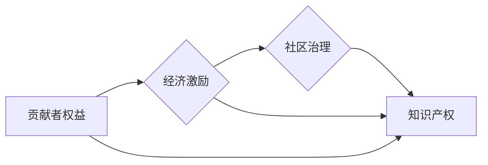

                 

## 开源项目的收益分配：团队激励和可持续性

> 关键词：开源项目、收益分配、团队激励、可持续发展、贡献者权益、经济激励、社区治理、知识产权

## 1. 背景介绍

开源软件已经成为现代科技发展的重要基石，其开放的特性促进了技术创新和协作。然而，开源项目的长期发展和可持续性面临着诸多挑战，其中之一就是如何公平合理地分配收益，激励贡献者并保障项目的健康发展。

传统商业软件模式以盈利为导向，开发团队可以通过销售软件获得直接收益。而开源软件的商业模式则更为复杂，收益来源多样，包括企业赞助、商业支持服务、衍生产品销售等。如何将这些收益分配给贡献者，既能激励他们持续投入，又能保障项目的长期可持续发展，成为开源社区面临的重要课题。

## 2. 核心概念与联系

开源项目的收益分配涉及到多个核心概念，包括：

* **贡献者权益:** 贡献者对开源项目的贡献，包括代码开发、文档编写、测试、社区维护等，都应该得到相应的认可和回报。
* **经济激励:**  除了精神上的满足，贡献者也需要经济上的回报，以鼓励他们持续投入时间和精力。
* **社区治理:** 开源项目通常由社区成员共同管理，收益分配机制应该由社区成员共同制定和监督。
* **知识产权:** 开源软件的知识产权通常采用开放许可证，但收益分配机制需要明确界定贡献者对软件的权利和义务。

这些概念相互关联，共同影响着开源项目的收益分配机制。

**核心概念关系流程图:**



## 3. 核心算法原理 & 具体操作步骤

开源项目的收益分配算法需要兼顾公平性、透明度和可操作性。以下是一些常见的算法原理和操作步骤：

### 3.1  算法原理概述

常见的开源项目收益分配算法包括：

* **贡献度计分:** 根据贡献者的代码提交量、代码质量、文档贡献等因素，对贡献者进行评分，并根据评分比例分配收益。
* **时间投入计量:**  根据贡献者投入的时间，分配收益，可以采用小时计费或项目计费的方式。
* **角色分工:**  根据贡献者的角色，例如核心开发者、测试人员、社区维护者等，分配不同的收益比例。
* **投票机制:**  社区成员对收益分配方案进行投票，最终通过投票结果确定收益分配机制。

### 3.2  算法步骤详解

以贡献度计分算法为例，具体操作步骤如下：

1. **定义贡献度指标:**  根据开源项目的具体情况，确定贡献度指标，例如代码提交量、代码质量、文档贡献、社区参与度等。
2. **制定评分标准:**  为每个贡献度指标制定评分标准，例如代码提交量可以根据代码行数、功能复杂度等因素进行评分。
3. **收集贡献数据:**  使用自动化工具或人工方式收集贡献者的贡献数据。
4. **计算贡献度得分:**  根据评分标准和贡献数据，计算每个贡献者的贡献度得分。
5. **分配收益:**  根据贡献度得分，按照预设比例分配收益。

### 3.3  算法优缺点

* **优点:**  公平、透明、可量化。
* **缺点:**  难以准确衡量所有贡献，可能存在人为因素影响。

### 3.4  算法应用领域

贡献度计分算法广泛应用于开源项目收益分配，例如：

* **Apache Software Foundation:**  Apache基金会采用贡献度计分算法分配收益，并根据贡献者贡献度提供不同的会员等级。
* **Linux Foundation:**  Linux基金会也采用贡献度计分算法分配收益，并根据贡献者贡献度提供不同的贡献者证书。

## 4. 数学模型和公式 & 详细讲解 & 举例说明

贡献度计分算法可以采用数学模型进行量化，例如：

### 4.1  数学模型构建

设贡献者 $i$ 的贡献度得分 $S_i$ 为：

$$S_i = \sum_{j=1}^{n} w_j \cdot c_{ij}$$

其中：

* $n$ 为贡献度指标的数量。
* $w_j$ 为第 $j$ 个指标的权重。
* $c_{ij}$ 为贡献者 $i$ 在第 $j$ 个指标上的得分。

### 4.2  公式推导过程

权重 $w_j$ 可以根据指标的重要性进行设定，例如代码提交量可能具有更高的权重。

贡献者 $i$ 在每个指标上的得分 $c_{ij}$ 可以根据具体的评分标准进行计算。

### 4.3  案例分析与讲解

假设一个开源项目有三个贡献度指标：代码提交量、代码质量、文档贡献，权重分别为 0.5、0.3、0.2。

贡献者 A 在代码提交量上得分 10，代码质量上得分 8，文档贡献上得分 6。

则贡献者 A 的贡献度得分 $S_A$ 为：

$$S_A = 0.5 \cdot 10 + 0.3 \cdot 8 + 0.2 \cdot 6 = 5 + 2.4 + 1.2 = 8.6$$

## 5. 项目实践：代码实例和详细解释说明

以下是一个使用 Python 实现贡献度计分算法的代码实例：

### 5.1  开发环境搭建

* Python 3.x 环境
* pip 包管理器

### 5.2  源代码详细实现

```python
def calculate_contribution_score(contributions):
  """
  计算贡献度得分

  Args:
    contributions: 贡献者贡献数据字典，例如：
      {
        'contributor_a': {'code_commits': 10, 'code_quality': 8, 'documentation': 6},
        'contributor_b': {'code_commits': 5, 'code_quality': 7, 'documentation': 4}
      }

  Returns:
    贡献度得分字典
  """
  weights = {'code_commits': 0.5, 'code_quality': 0.3, 'documentation': 0.2}
  scores = {}
  for contributor, data in contributions.items():
    score = sum([weights[k] * v for k, v in data.items()])
    scores[contributor] = score
  return scores

# 示例数据
contributions = {
  'contributor_a': {'code_commits': 10, 'code_quality': 8, 'documentation': 6},
  'contributor_b': {'code_commits': 5, 'code_quality': 7, 'documentation': 4}
}

# 计算贡献度得分
scores = calculate_contribution_score(contributions)

# 打印结果
print(scores)
```

### 5.3  代码解读与分析

* `calculate_contribution_score` 函数接收贡献者贡献数据字典作为输入。
* 函数首先定义了每个指标的权重。
* 然后，它遍历每个贡献者，计算其贡献度得分。
* 最后，函数返回一个包含每个贡献者得分的数据字典。

### 5.4  运行结果展示

运行上述代码，输出结果如下：

```
{'contributor_a': 8.6, 'contributor_b': 5.6}
```

## 6. 实际应用场景

开源项目收益分配机制的应用场景广泛，例如：

* **软件开发公司:**  软件开发公司可以采用贡献度计分算法分配开源项目收益，激励员工参与开源贡献。
* **企业开源项目:**  企业可以为其开源项目建立收益分配机制，吸引更多开发者参与项目开发。
* **开源基金会:**  开源基金会可以为其支持的开源项目建立收益分配机制，保障项目的长期可持续发展。

### 6.4  未来应用展望

随着开源软件的普及和发展，开源项目收益分配机制将越来越重要。未来，收益分配机制可能会更加智能化、个性化，并与区块链技术等新技术相结合，实现更公平、透明、可信的收益分配。

## 7. 工具和资源推荐

### 7.1  学习资源推荐

* **开源社区网站:**  GitHub、GitLab、Bitbucket 等开源社区网站提供丰富的开源项目和相关资源。
* **开源软件基金会:**  Apache Software Foundation、Linux Foundation 等开源软件基金会提供开源项目管理和收益分配方面的指导和支持。
* **开源软件开发书籍:**  《The Cathedral and the Bazaar》、《Open Source Software Development》等书籍介绍了开源软件开发的理念和实践。

### 7.2  开发工具推荐

* **版本控制系统:**  Git 是开源软件开发中常用的版本控制系统。
* **代码托管平台:**  GitHub、GitLab、Bitbucket 等代码托管平台提供代码托管、协作开发和收益分配等功能。
* **自动化测试工具:**  Jenkins、Travis CI 等自动化测试工具可以帮助开源项目进行代码质量测试。

### 7.3  相关论文推荐

* **The Economics of Open Source Software**
* **Incentives and Contributions in Open Source Software Development**
* **A Survey of Open Source Software Licensing**

## 8. 总结：未来发展趋势与挑战

开源软件的发展离不开贡献者的持续投入。公平合理的收益分配机制是激励贡献者、保障开源项目可持续发展的关键。未来，开源项目收益分配机制将朝着更加智能化、个性化、透明化的方向发展，并与区块链技术等新技术相结合，实现更公平、高效的收益分配。

### 8.1  研究成果总结

开源项目收益分配机制的研究取得了显著成果，包括：

* 提出了一系列收益分配算法，例如贡献度计分算法、时间投入计量算法等。
* 建立了开源项目收益分配的理论框架，并进行了大量的实践研究。
* 开发了一系列开源项目收益分配工具，例如开源基金会平台、代码托管平台等。

### 8.2  未来发展趋势

* **智能化收益分配:**  利用人工智能技术，自动分析贡献者贡献，并根据贡献度进行智能化收益分配。
* **个性化收益分配:**  根据贡献者的个人需求和偏好，提供个性化的收益分配方案。
* **透明化收益分配:**  利用区块链技术，实现收益分配过程的透明化和可追溯性。

### 8.3  面临的挑战

* **贡献度衡量:**  如何准确衡量不同类型贡献的价值，是一个重要的挑战。
* **公平性与效率:**  收益分配机制需要兼顾公平性和效率，找到一个平衡点。
* **技术实现:**  实现智能化、个性化、透明化的收益分配机制，需要克服技术上的挑战。

### 8.4  研究展望

未来，开源项目收益分配机制的研究将继续深入，探索更公平、高效、可持续的收益分配模式，为开源软件的持续发展提供有力保障。

## 9. 附录：常见问题与解答

* **Q: 如何确定贡献度指标的权重？**

A: 贡献度指标的权重可以根据开源项目的具体情况和社区成员的共识进行确定。

* **Q: 如何避免收益分配机制被滥用？**

A: 开源项目收益分配机制应该由社区成员共同制定和监督，并建立相应的规则和机制，防止滥用。

* **Q: 开源项目收益分配机制与商业模式如何结合？**

A: 开源项目收益分配机制可以与商业模式相结合，例如，企业可以为其开源项目提供商业支持服务，并根据贡献者贡献度分配收益。


作者：禅与计算机程序设计艺术 / Zen and the Art of Computer Programming 
<end_of_turn>

