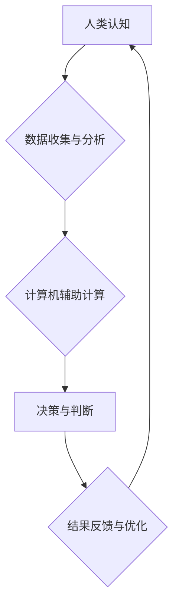

                 

## 推动社会进步的动力：人类计算的积极影响

> 关键词：人类计算、人工智能、计算模型、社会进步、算法优化、数据分析、可解释性、伦理

## 1. 背景介绍

人类文明的进步离不开对信息的获取、处理和利用。随着信息技术的飞速发展，人类计算能力得到了指数级的提升。从早期的机械计算器到如今的超级计算机和云计算平台，人类不断探索更有效、更智能的计算方式。而“人类计算”作为一种新兴的计算模式，正以其独特的优势，为推动社会进步注入新的动力。

人类计算是指利用人类的认知能力、创造力和判断力来辅助或替代传统计算机进行计算和决策。它融合了人工智能、数据分析、认知科学等多学科的成果，旨在构建一种更加灵活、适应性强、富有创造力的计算体系。

## 2. 核心概念与联系

### 2.1 人类计算的本质

人类计算的核心在于将人类的智慧与计算机的计算能力相结合。它不仅仅是简单地将数据输入计算机进行处理，而是更注重人类的参与和决策。

**流程图：**



### 2.2 人类计算的优势

与传统计算机相比，人类计算具有以下优势：

* **更强的适应性:** 人类能够根据不同的情境灵活调整计算策略，处理复杂、模糊、不确定性强的任务。
* **更丰富的知识和经验:** 人类拥有丰富的知识储备和经验积累，能够对数据进行更深入的理解和分析。
* **更强的创造力和创新能力:** 人类能够提出新的想法、解决新问题，推动计算领域的创新发展。

## 3. 核心算法原理 & 具体操作步骤

### 3.1 算法原理概述

人类计算的核心算法原理是将人类的认知过程模拟成计算机可执行的算法。这包括：

* **知识表示:** 将人类的知识和经验以计算机可理解的形式进行表示，例如知识图谱、规则库等。
* **推理和决策:** 利用人工智能算法，例如逻辑推理、机器学习等，模拟人类的推理和决策过程。
* **交互和反馈:** 建立人机交互机制，允许人类参与计算过程，并根据计算结果进行反馈和调整。

### 3.2 算法步骤详解

一个典型的“人类计算”流程可以分为以下步骤：

1. **问题定义:** 明确需要解决的问题，并将其转化为计算机可理解的形式。
2. **数据收集:** 收集与问题相关的各种数据，例如文本、图像、音频等。
3. **数据预处理:** 对收集到的数据进行清洗、转换、格式化等处理，使其能够被算法处理。
4. **知识表示:** 将数据转化为计算机可理解的知识表示形式，例如知识图谱、规则库等。
5. **推理和决策:** 利用人工智能算法，对知识进行推理和分析，得出结论或决策。
6. **结果展示:** 将计算结果以可读、可理解的形式展示给人类。
7. **反馈和优化:** 人类根据计算结果进行反馈，并调整算法参数或知识库，以提高计算精度和效率。

### 3.3 算法优缺点

**优点:**

* 能够处理复杂、模糊、不确定性强的任务。
* 具有更强的适应性和创造力。
* 可以结合人类的经验和知识，提高计算结果的准确性和可靠性。

**缺点:**

* 计算效率相对较低。
* 需要大量的标注数据和人工参与。
* 算法的可解释性和透明度相对较低。

### 3.4 算法应用领域

人类计算的应用领域非常广泛，包括：

* **医疗诊断:** 利用人类的医学知识和经验，辅助医生进行疾病诊断。
* **金融风险评估:** 分析金融数据，识别潜在的风险，帮助金融机构进行风险管理。
* **法律决策支持:** 利用法律知识库和案例分析，辅助律师进行法律决策。
* **科学研究:** 辅助科学家进行数据分析、模型构建和实验设计。
* **教育教学:** 个性化定制学习内容，提高学生的学习效率。

## 4. 数学模型和公式 & 详细讲解 & 举例说明

### 4.1 数学模型构建

人类计算的数学模型通常基于概率论、统计学和人工智能算法。例如，在机器学习领域，常用的模型包括：

* **线性回归:** 用于预测连续变量，其数学模型可以表示为：

$$y = \beta_0 + \beta_1x_1 + \beta_2x_2 + ... + \beta_nx_n + \epsilon$$

其中，$y$ 是预测变量，$x_1, x_2, ..., x_n$ 是输入变量，$\beta_0, \beta_1, ..., \beta_n$ 是模型参数，$\epsilon$ 是误差项。

* **逻辑回归:** 用于预测分类变量，其数学模型可以表示为：

$$P(y=1|x) = \frac{1}{1 + e^{-( \beta_0 + \beta_1x_1 + \beta_2x_2 + ... + \beta_nx_n)}}$$

其中，$P(y=1|x)$ 是预测变量$y$等于1的概率，$x_1, x_2, ..., x_n$ 是输入变量，$\beta_0, \beta_1, ..., \beta_n$ 是模型参数。

### 4.2 公式推导过程

这些模型的推导过程通常基于最大似然估计或贝叶斯方法。例如，线性回归模型的参数$\beta_0, \beta_1, ..., \beta_n$ 可以通过最小化模型预测值与实际值的误差平方和来估计。

### 4.3 案例分析与讲解

例如，在医疗诊断领域，可以使用机器学习模型对患者的病历数据进行分析，预测患者患某种疾病的概率。

## 5. 项目实践：代码实例和详细解释说明

### 5.1 开发环境搭建

为了实现人类计算项目，需要搭建相应的开发环境。常见的开发环境包括：

* **Python:** Python 是一个流行的编程语言，拥有丰富的机器学习和数据分析库，例如TensorFlow、PyTorch、Scikit-learn等。
* **Jupyter Notebook:** Jupyter Notebook 是一个交互式编程环境，方便进行代码编写、数据分析和可视化展示。
* **云计算平台:** 云计算平台，例如AWS、Azure、GCP等，可以提供强大的计算资源和数据存储服务。

### 5.2 源代码详细实现

以下是一个简单的机器学习模型训练的代码示例，使用Python和Scikit-learn库：

```python
from sklearn.linear_model import LogisticRegression
from sklearn.model_selection import train_test_split
from sklearn.metrics import accuracy_score

# 加载数据
data = ... # 加载你的数据

# 将数据分为训练集和测试集
X_train, X_test, y_train, y_test = train_test_split(data[:, :-1], data[:, -1], test_size=0.2)

# 创建逻辑回归模型
model = LogisticRegression()

# 训练模型
model.fit(X_train, y_train)

# 预测测试集结果
y_pred = model.predict(X_test)

# 计算模型准确率
accuracy = accuracy_score(y_test, y_pred)
print(f"模型准确率: {accuracy}")
```

### 5.3 代码解读与分析

这段代码首先加载数据，然后将数据分为训练集和测试集。接着，创建逻辑回归模型并使用训练集进行训练。最后，使用测试集进行预测，并计算模型的准确率。

### 5.4 运行结果展示

运行这段代码后，会输出模型的准确率。

## 6. 实际应用场景

### 6.1 人工智能客服

人类计算可以用于构建更智能的人工智能客服系统。例如，可以利用自然语言处理技术，让客服系统能够理解用户的自然语言输入，并提供更准确、更人性化的回复。

### 6.2 个性化教育

人类计算可以用于构建个性化教育系统，根据学生的学习进度和需求，定制学习内容和教学方式。

### 6.3 医疗诊断辅助

人类计算可以辅助医生进行疾病诊断，例如，可以利用机器学习算法分析患者的病历数据，识别潜在的疾病风险。

### 6.4 科学研究加速

人类计算可以加速科学研究，例如，可以利用人工智能算法分析海量科研数据，发现新的科学规律。

### 6.5 未来应用展望

随着人工智能技术的不断发展，人类计算的应用场景将会更加广泛。例如，未来可能出现：

* **人类-机器协作工作平台:** 人类和机器可以协同工作，完成更复杂的任务。
* **沉浸式虚拟现实体验:** 人类计算可以为用户提供更加沉浸式的虚拟现实体验。
* **个性化医疗服务:** 人类计算可以为每个患者提供个性化的医疗服务。

## 7. 工具和资源推荐

### 7.1 学习资源推荐

* **在线课程:** Coursera、edX、Udacity 等平台提供丰富的机器学习和人工智能课程。
* **书籍:** 《深度学习》、《人工智能：一种现代方法》等书籍可以帮助你深入了解人工智能领域。
* **开源项目:** TensorFlow、PyTorch 等开源项目可以让你实践人工智能算法。

### 7.2 开发工具推荐

* **Python:** Python 是一个流行的编程语言，拥有丰富的机器学习和数据分析库。
* **Jupyter Notebook:** Jupyter Notebook 是一个交互式编程环境，方便进行代码编写、数据分析和可视化展示。
* **云计算平台:** AWS、Azure、GCP 等云计算平台可以提供强大的计算资源和数据存储服务。

### 7.3 相关论文推荐

* **《ImageNet Classification with Deep Convolutional Neural Networks》:** 这篇论文介绍了深度卷积神经网络在图像分类领域的应用。
* **《Attention Is All You Need》:** 这篇论文介绍了Transformer模型，一种新的序列建模方法。
* **《BERT: Pre-training of Deep Bidirectional Transformers for Language Understanding》:** 这篇论文介绍了BERT模型，一种用于自然语言理解的预训练模型。

## 8. 总结：未来发展趋势与挑战

### 8.1 研究成果总结

人类计算作为一种新兴的计算模式，取得了显著的进展。它融合了人工智能、数据分析、认知科学等多学科的成果，为推动社会进步提供了新的动力。

### 8.2 未来发展趋势

未来，人类计算的发展趋势包括：

* **更智能的算法:** 研究更智能、更灵活、更适应性的算法，例如强化学习、进化算法等。
* **更强大的计算能力:** 利用量子计算、神经形态计算等新兴技术，提升人类计算的计算能力。
* **更广泛的应用场景:** 将人类计算应用于更多领域，例如医疗、教育、金融、科学研究等。

### 8.3 面临的挑战

人类计算也面临着一些挑战：

* **算法可解释性:** 人类计算算法的决策过程往往难以理解，这可能会导致信任问题。
* **数据隐私和安全:** 人类计算需要处理大量的个人数据，如何保护数据隐私和安全是一个重要的挑战。
* **伦理问题:** 人类计算的应用可能会带来一些伦理问题，例如算法偏见、工作岗位替代等，需要认真思考和解决。

### 8.4 研究展望

未来，我们需要继续加强对人类计算的理论研究和技术开发，同时也要关注其伦理和社会影响，确保人类计算能够真正为社会发展做出贡献。

## 9. 附录：常见问题与解答

### 9.1 什么是人类计算？

人类计算是指利用人类的认知能力、创造力和判断力来辅助或替代传统计算机进行计算和决策。

### 9.2 人类计算的优势是什么？

人类计算具有更强的适应性、更丰富的知识和经验、更强的创造力和创新能力等优势。

### 9.3 人类计算有哪些应用场景？

人类计算的应用场景非常广泛，包括医疗诊断、金融风险评估、法律决策支持、科学研究等。

### 9.4 人类计算面临哪些挑战？

人类计算面临着算法可解释性、数据隐私和安全、伦理问题等挑战。


作者：禅与计算机程序设计艺术 / Zen and the Art of Computer Programming 
<end_of_turn>

