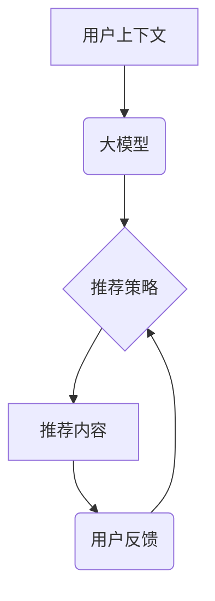

                 

## 推荐系统中的探索与利用：大模型的上下文赌博机

> 关键词：推荐系统、探索与利用、大模型、上下文赌博机、强化学习、个性化推荐

## 1. 背景介绍

推荐系统作为信息过滤和个性化内容呈现的关键技术，在电商、社交媒体、视频平台等领域发挥着越来越重要的作用。传统的推荐系统主要依赖于协同过滤、内容过滤等方法，但随着用户行为的复杂化和数据规模的扩大，这些方法面临着挑战。

大模型的出现为推荐系统带来了新的机遇。大模型具备强大的语义理解和泛化能力，能够更好地捕捉用户兴趣和内容特征，从而提供更精准、更个性化的推荐。然而，大模型的训练和部署也带来了新的挑战，例如模型规模庞大、计算资源消耗高、可解释性差等。

探索与利用 (Exploration-Exploitation) 问题是推荐系统面临的长期挑战。探索是指尝试新的内容，以发现潜在的热门内容或用户偏好；利用是指推荐已知用户喜欢的或热门的内容，以最大化推荐的准确率。如何平衡探索和利用，是提升推荐系统性能的关键。

## 2. 核心概念与联系

**2.1 核心概念**

* **探索与利用 (Exploration-Exploitation):**  推荐系统中一个重要的决策问题，是指在推荐新内容和推荐已知用户喜欢的内容之间进行权衡。
* **上下文赌博机 (Contextual Bandit):**  一种强化学习算法，用于解决探索与利用问题。它在每个时间步长根据用户的上下文信息选择一个动作 (推荐一个内容)，并根据反馈 (用户点击、评分等) 更新策略，以最大化长期奖励。
* **大模型:**  参数量巨大的深度学习模型，具有强大的语义理解和泛化能力。

**2.2 架构关系**



**2.3 核心联系**

大模型可以提供丰富的用户上下文信息，例如用户历史行为、偏好、地理位置等。上下文赌博机算法可以根据这些上下文信息，选择最优的推荐策略，以最大化用户满意度。

## 3. 核心算法原理 & 具体操作步骤

**3.1 算法原理概述**

上下文赌博机算法的核心思想是通过维护一个策略，来选择在每个时间步长推荐哪个内容。策略可以根据用户的上下文信息和历史反馈进行更新，以不断提高推荐的准确率。

**3.2 算法步骤详解**

1. **初始化策略:**  随机初始化一个策略，例如每个内容的推荐概率都相等。
2. **获取用户上下文:**  根据用户的特征和行为，获取用户的上下文信息。
3. **选择推荐内容:**  根据策略和上下文信息，选择一个推荐内容。
4. **获取用户反馈:**  记录用户对推荐内容的反馈，例如点击、评分等。
5. **更新策略:**  根据用户反馈，更新策略，以提高推荐的准确率。

**3.3 算法优缺点**

**优点:**

* 能够在线学习，随着时间的推移不断提高推荐的准确率。
* 可以根据用户的上下文信息进行个性化推荐。
* 算法相对简单，易于实现。

**缺点:**

* 需要大量的用户反馈数据进行训练。
* 可能会出现过拟合问题，导致在新的用户群体中表现不佳。

**3.4 算法应用领域**

上下文赌博机算法广泛应用于推荐系统，例如：

* **新闻推荐:**  根据用户的阅读历史和兴趣，推荐相关的新闻文章。
* **电商推荐:**  根据用户的购买历史和浏览记录，推荐相关的商品。
* **视频推荐:**  根据用户的观看历史和偏好，推荐相关的视频。

## 4. 数学模型和公式 & 详细讲解 & 举例说明

**4.1 数学模型构建**

假设我们有一个推荐系统，包含 $N$ 个不同的内容，每个用户 $u$ 在时间步长 $t$ 的上下文信息为 $x_t(u)$。我们的目标是最大化用户的长期奖励，奖励函数为 $r_t(u, i)$，表示用户 $u$ 在时间步长 $t$ 选择内容 $i$ 的奖励。

**4.2 公式推导过程**

上下文赌博机算法通常使用 Q-learning 算法进行策略更新。Q-learning 算法的目标是学习一个 Q-函数，Q-函数表示在给定上下文信息和选择某个内容时的期望奖励。

Q-函数的更新公式为：

$$Q(x_t(u), i) = Q(x_t(u), i) + \alpha [r_t(u, i) + \gamma \max_{j} Q(x_{t+1}(u), j) - Q(x_t(u), i)]$$

其中：

* $Q(x_t(u), i)$ 表示在时间步长 $t$，用户 $u$ 的上下文信息为 $x_t(u)$ 时，选择内容 $i$ 的 Q-值。
* $\alpha$ 是学习率，控制着 Q-值更新的幅度。
* $r_t(u, i)$ 是用户 $u$ 在时间步长 $t$ 选择内容 $i$ 的奖励。
* $\gamma$ 是折扣因子，控制着未来奖励的权重。
* $\max_{j} Q(x_{t+1}(u), j)$ 是在下一个时间步长，用户 $u$ 的上下文信息为 $x_{t+1}(u)$ 时，选择所有内容 $j$ 的最大 Q-值。

**4.3 案例分析与讲解**

假设我们有一个新闻推荐系统，用户 $u$ 的上下文信息为其阅读历史和兴趣标签。我们使用上下文赌博机算法来推荐新闻文章。

在每个时间步长，算法会根据用户的上下文信息和历史反馈，选择一个推荐文章。如果用户点击了推荐的文章，则奖励为正值；否则奖励为负值。

随着时间的推移，算法会不断更新 Q-值，以找到最优的推荐策略。最终，算法能够推荐用户感兴趣的新闻文章，提高用户的阅读体验。

## 5. 项目实践：代码实例和详细解释说明

**5.1 开发环境搭建**

* Python 3.6+
* TensorFlow/PyTorch
* Jupyter Notebook

**5.2 源代码详细实现**

```python
import numpy as np

class ContextualBandit:
    def __init__(self, n_actions, alpha=0.1, gamma=0.9):
        self.n_actions = n_actions
        self.alpha = alpha
        self.gamma = gamma
        self.Q = np.zeros((n_actions,))

    def choose_action(self, context):
        # 根据上下文信息选择动作
        # ...
        return np.argmax(self.Q)

    def update(self, context, action, reward):
        # 更新 Q-值
        self.Q[action] = self.Q[action] + self.alpha * (reward + self.gamma * np.max(self.Q) - self.Q[action])

# 实例化上下文赌博机
bandit = ContextualBandit(n_actions=10)

# 模拟用户上下文信息和反馈
context = np.random.rand(10)
action = bandit.choose_action(context)
reward = np.random.rand()

# 更新 Q-值
bandit.update(context, action, reward)
```

**5.3 代码解读与分析**

* `ContextualBandit` 类实现了上下文赌博机算法的基本逻辑。
* `choose_action` 方法根据上下文信息选择动作，这里使用贪婪策略，选择 Q-值最大的动作。
* `update` 方法根据用户反馈更新 Q-值，使用 Q-learning 算法的更新公式。

**5.4 运行结果展示**

运行上述代码，可以观察到 Q-值随着时间的推移不断更新，最终趋于稳定。

## 6. 实际应用场景

**6.1 个性化推荐**

上下文赌博机算法可以根据用户的个性化信息，例如兴趣、偏好、行为等，提供更精准的推荐。例如，电商平台可以根据用户的购买历史和浏览记录，推荐相关的商品。

**6.2 内容优化**

上下文赌博机算法可以帮助内容提供者优化内容，提高用户参与度。例如，新闻平台可以根据用户的阅读历史和兴趣，推荐相关的新闻文章，并根据用户的反馈调整推荐策略。

**6.3 广告投放**

上下文赌博机算法可以帮助广告商优化广告投放，提高广告效果。例如，广告平台可以根据用户的兴趣和行为，推荐相关的广告，并根据用户的点击和转化率调整广告投放策略。

**6.4 未来应用展望**

随着大模型的不断发展，上下文赌博机算法在推荐系统中的应用将更加广泛。例如，可以利用大模型的语义理解能力，更精准地捕捉用户的意图和需求，从而提供更个性化、更智能化的推荐。

## 7. 工具和资源推荐

**7.1 学习资源推荐**

* **书籍:**
    * Reinforcement Learning: An Introduction by Sutton and Barto
    * Deep Reinforcement Learning Hands-On by Maxim Lapan
* **在线课程:**
    * Coursera: Reinforcement Learning Specialization
    * Udacity: Deep Reinforcement Learning Nanodegree

**7.2 开发工具推荐**

* **TensorFlow:**  开源深度学习框架，支持上下文赌博机算法的实现。
* **PyTorch:**  开源深度学习框架，支持上下文赌博机算法的实现。
* **Scikit-learn:**  机器学习库，可以用于数据预处理和模型评估。

**7.3 相关论文推荐**

* Contextual Bandits with Linear Function Approximation
* Deep Contextual Bandits

## 8. 总结：未来发展趋势与挑战

**8.1 研究成果总结**

上下文赌博机算法在推荐系统中取得了显著的成果，能够提供更精准、更个性化的推荐。大模型的出现为上下文赌博机算法带来了新的机遇，可以利用大模型的强大能力，进一步提升推荐系统的性能。

**8.2 未来发展趋势**

* **模型复杂度提升:**  利用更复杂的深度学习模型，例如 Transformer，提高上下文信息的理解能力。
* **多模态融合:**  融合文本、图像、音频等多模态信息，提供更全面的用户上下文。
* **联邦学习:**  利用联邦学习技术，在保护用户隐私的前提下，进行模型训练和更新。

**8.3 面临的挑战**

* **数据稀疏性:**  用户行为数据往往是稀疏的，难以训练出有效的模型。
* **可解释性:**  大模型的决策过程难以解释，难以理解模型是如何进行推荐的。
* **公平性:**  推荐系统可能会存在偏差，导致某些用户获得不公平的推荐。

**8.4 研究展望**

未来，上下文赌博机算法的研究将继续朝着更智能、更公平、更可解释的方向发展。


## 9. 附录：常见问题与解答

**9.1 Q: 如何选择合适的学习率和折扣因子？**

**A:** 学习率和折扣因子是上下文赌博机算法中的重要超参数，需要根据实际情况进行调整。学习率过高会导致模型不稳定，学习率过低会导致模型收敛速度慢。折扣因子控制着未来奖励的权重，折扣因子越大，模型越倾向于选择长期奖励高的策略。

**9.2 Q: 如何处理用户上下文信息的多样性？**

**A:** 用户上下文信息可能包含多种类型的数据，例如文本、图像、音频等。可以使用不同的方法来处理这些数据，例如文本嵌入、图像特征提取等。

**9.3 Q: 如何评估上下文赌博机算法的性能？**

**A:** 可以使用各种指标来评估上下文赌博机算法的性能，例如点击率、转化率、用户满意度等。


作者：禅与计算机程序设计艺术 / Zen and the Art of Computer Programming 
<end_of_turn>

