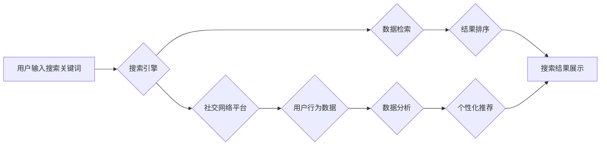

                 

## 搜索引擎与社交网络的融合

> 关键词：搜索引擎、社交网络、信息检索、推荐系统、用户行为分析、自然语言处理、机器学习、深度学习、数据挖掘

## 1. 背景介绍

互联网的蓬勃发展催生了搜索引擎和社交网络这两个重要的信息平台。搜索引擎以其强大的信息检索能力，帮助用户快速获取所需信息；而社交网络则以其丰富的用户互动功能，构建了人们的虚拟社交圈。尽管两者在功能和应用场景上存在差异，但随着互联网技术的不断进步，两者之间的界限逐渐模糊，融合趋势日益明显。

搜索引擎与社交网络的融合，是信息时代发展的重要趋势，它将带来以下几方面的变革：

* **搜索结果的个性化：**  社交网络可以提供丰富的用户行为数据，例如用户兴趣、好友关系、点赞和评论等，这些数据可以被用于个性化搜索结果，推荐更符合用户需求的信息。
* **搜索结果的实时性：** 社交网络平台上实时更新的信息，例如新闻、事件、讨论等，可以被纳入搜索引擎的索引，提高搜索结果的实时性。
* **搜索体验的增强：** 社交网络的功能，例如评论、分享、讨论等，可以被整合到搜索引擎中，增强用户搜索体验，促进用户互动。
* **新兴应用的涌现：** 搜索引擎与社交网络的融合，将催生出新的应用场景，例如基于社交关系的推荐系统、社交媒体搜索、社交网络分析等。

## 2. 核心概念与联系

### 2.1 搜索引擎

搜索引擎是一个信息检索系统，其核心功能是根据用户输入的关键词，从海量数据中检索出相关信息并进行排序展示。

**核心技术：**

* **爬虫技术：** 用于自动抓取网页内容，构建网页索引。
* **自然语言处理技术：** 用于理解用户搜索意图，提取关键词和语义信息。
* **信息检索算法：** 用于根据关键词和语义信息，对网页进行排序和匹配。
* **数据存储和管理技术：** 用于高效存储和管理海量网页数据。

### 2.2 社交网络

社交网络是一个用户可以创建个人资料、建立联系、分享信息和进行互动在线平台。

**核心功能：**

* **用户注册和身份认证：** 用户可以通过邮箱、手机号等方式注册账号，并进行身份认证。
* **个人资料创建和维护：** 用户可以创建个人资料，展示自己的信息、兴趣爱好等。
* **好友关系建立和管理：** 用户可以添加好友，建立社交关系。
* **信息发布和分享：** 用户可以发布文字、图片、视频等信息，并与好友分享。
* **互动功能：** 用户可以评论、点赞、转发好友发布的信息，进行互动交流。

### 2.3 融合架构

搜索引擎与社交网络的融合，可以采用以下几种架构模式：

* **数据共享模式：** 搜索引擎和社交网络平台共享用户数据，例如用户兴趣、好友关系等，用于个性化搜索结果和推荐。
* **API集成模式：** 搜索引擎通过调用社交网络平台的API，获取用户社交信息，并将其融入搜索结果中。
* **联合搜索模式：** 搜索引擎和社交网络平台联合构建一个新的搜索引擎，整合两者的搜索能力和数据资源。

**Mermaid 流程图：**



## 3. 核心算法原理 & 具体操作步骤

### 3.1 算法原理概述

搜索引擎与社交网络融合的核心算法，主要包括：

* **用户行为分析算法：** 用于分析用户在社交网络平台上的行为数据，例如浏览记录、点赞、评论、分享等，挖掘用户兴趣、偏好和社交关系等信息。
* **社交关系挖掘算法：** 用于分析用户之间的社交关系，例如好友关系、共同关注、互动频率等，构建用户社交网络图谱。
* **个性化推荐算法：** 基于用户行为分析和社交关系挖掘的结果，推荐与用户兴趣和社交关系相关的搜索结果。

### 3.2 算法步骤详解

**用户行为分析算法步骤：**

1. **数据采集：** 从社交网络平台收集用户行为数据，例如浏览记录、点赞、评论、分享等。
2. **数据预处理：** 对收集到的数据进行清洗、转换和格式化，去除噪声数据，并将其转换为算法可处理的格式。
3. **特征提取：** 从用户行为数据中提取特征，例如用户兴趣、偏好、活跃度、社交圈等。
4. **模型训练：** 使用机器学习算法，对用户行为数据进行建模，训练出用户行为预测模型。
5. **结果分析：** 分析模型预测结果，挖掘用户兴趣、偏好和社交关系等信息。

**社交关系挖掘算法步骤：**

1. **社交网络图谱构建：** 将用户和他们的社交关系表示为图结构，其中用户为节点，社交关系为边。
2. **关系类型识别：** 识别不同类型的社交关系，例如好友关系、共同关注、互动频率等。
3. **关系强度计算：** 计算用户之间社交关系的强度，例如好友关系的活跃度、共同关注的相似度等。
4. **社区发现：** 发现用户之间的社交社区，例如兴趣相投的用户群体、共同话题的用户群等。

**个性化推荐算法步骤：**

1. **用户兴趣建模：** 基于用户行为分析和社交关系挖掘的结果，构建用户兴趣模型，例如用户喜欢的主题、产品、服务等。
2. **搜索结果排序：** 根据用户兴趣模型，对搜索结果进行排序，推荐与用户兴趣相关的搜索结果。
3. **推荐结果展示：** 将排序后的搜索结果展示给用户，并提供个性化推荐信息。

### 3.3 算法优缺点

**优点：**

* **个性化推荐：** 可以根据用户的兴趣和社交关系，推荐更符合用户需求的信息。
* **实时性增强：** 可以纳入社交网络平台上的实时信息，提高搜索结果的实时性。
* **搜索体验提升：** 可以整合社交网络的功能，增强用户搜索体验。

**缺点：**

* **数据隐私问题：** 需要收集和分析用户的个人信息，可能存在数据隐私泄露的风险。
* **算法复杂度：** 需要处理海量数据和复杂的算法模型，计算资源消耗较大。
* **推荐结果偏差：** 算法模型可能存在偏差，导致推荐结果不准确或不公平。

### 3.4 算法应用领域

* **搜索引擎优化：** 利用社交网络数据，优化网站内容和结构，提高搜索引擎排名。
* **内容推荐：** 为用户推荐个性化的新闻、视频、音乐等内容。
* **电商推荐：** 为用户推荐个性化的商品和服务。
* **社交媒体营销：** 利用社交网络数据，精准定位目标用户，进行营销推广。

## 4. 数学模型和公式 & 详细讲解 & 举例说明

### 4.1 数学模型构建

**用户兴趣模型：**

可以采用概率模型，例如贝叶斯网络或隐马尔可夫模型，来建模用户的兴趣。

**社交关系模型：**

可以采用图论模型，例如邻接矩阵或图谱，来表示用户之间的社交关系。

**个性化推荐模型：**

可以采用协同过滤算法或深度学习模型，来预测用户对特定内容的兴趣。

### 4.2 公式推导过程

**协同过滤算法：**

用户-物品评分矩阵 $R$，其中 $R_{ui}$ 表示用户 $u$ 对物品 $i$ 的评分。

目标：预测用户 $u$ 对物品 $i$ 的评分 $R_{ui}$。

公式：

$$R_{ui} = \frac{\sum_{v \in N(u)} \frac{R_{uv} \cdot S_{vi}}{\sum_{w \in N(u)} S_{vw}}}{\sum_{v \in N(u)} \frac{S_{vi}}{\sum_{w \in N(u)} S_{vw}}}$$

其中：

* $N(u)$ 表示与用户 $u$ 相似的用户集合。
* $S_{vi}$ 表示用户 $v$ 对物品 $i$ 的评分。

### 4.3 案例分析与讲解

**案例：**

假设有一个电商平台，用户 $u$ 对商品 $i$ 的评分未知，但与用户 $v$ 相似，用户 $v$ 对商品 $i$ 的评分为 5。

**公式应用：**

根据协同过滤算法公式，可以预测用户 $u$ 对商品 $i$ 的评分。

**结果分析：**

预测结果表明，用户 $u$ 对商品 $i$ 的评分可能较高。

## 5. 项目实践：代码实例和详细解释说明

### 5.1 开发环境搭建

* 操作系统：Windows/macOS/Linux
* 编程语言：Python
* 开发工具：PyCharm/VS Code
* 库依赖：

```python
pip install numpy pandas scikit-learn
```

### 5.2 源代码详细实现

```python
# 用户行为分析算法示例代码

import pandas as pd
from sklearn.feature_extraction.text import TfidfVectorizer

# 加载用户行为数据
data = pd.read_csv('user_behavior.csv')

# 数据预处理
data['content'] = data['content'].str.lower()
data['content'] = data['content'].str.replace('[^a-zA-Z0-9\s]', '')

# 特征提取
vectorizer = TfidfVectorizer()
features = vectorizer.fit_transform(data['content'])

# 模型训练
from sklearn.linear_model import LogisticRegression
model = LogisticRegression()
model.fit(features, data['label'])

# 结果分析
predictions = model.predict(features)
```

### 5.3 代码解读与分析

* **数据加载和预处理：** 从CSV文件加载用户行为数据，并进行数据清洗和格式化。
* **特征提取：** 使用TF-IDF算法提取文本特征，将用户行为数据转换为数值向量。
* **模型训练：** 使用逻辑回归模型训练用户行为预测模型。
* **结果分析：** 使用训练好的模型预测用户行为，并进行结果分析。

### 5.4 运行结果展示

运行代码后，可以得到用户行为预测结果，例如用户是否会点击广告、购买商品等。

## 6. 实际应用场景

### 6.1 搜索引擎个性化推荐

* 根据用户的搜索历史、浏览记录、点赞和评论等数据，推荐与用户兴趣相关的搜索结果。
* 在搜索结果页面中，突出显示与用户社交关系密切的用户发布的内容。

### 6.2 社交媒体搜索

* 在社交媒体平台上搜索用户、话题、事件等信息，并根据用户的社交关系，推荐相关用户和内容。
* 允许用户通过社交关系来过滤搜索结果，例如只显示好友发布的内容。

### 6.3 社交网络分析

* 分析用户之间的社交关系，发现用户社区、兴趣群体等。
* 利用社交网络分析结果，进行用户画像、市场调研等。

### 6.4 未来应用展望

* **更精准的个性化推荐：** 利用深度学习等先进算法，实现更精准的个性化推荐。
* **更丰富的搜索体验：** 将社交网络功能更加深入地融入搜索引擎，提供更丰富的搜索体验。
* **新的应用场景：** 探索新的应用场景，例如基于社交关系的知识图谱构建、社交网络广告精准投放等。

## 7. 工具和资源推荐

### 7.1 学习资源推荐

* **书籍：**
    * 《信息检索》
    * 《社交网络分析》
    * 《深度学习》
* **在线课程：**
    * Coursera: 信息检索、社交网络分析、深度学习
    * edX: 信息检索、社交网络分析、深度学习
* **博客和论坛：**
    * Google AI Blog
    * Facebook AI Blog
    * Stack Overflow

### 7.2 开发工具推荐

* **搜索引擎平台：**
    * Elasticsearch
    * Solr
* **社交网络平台：**
    * Facebook Graph API
    * Twitter API
* **机器学习库：**
    * scikit-learn
    * TensorFlow
    * PyTorch

### 7.3 相关论文推荐

* **搜索引擎与社交网络融合：**
    * "Social Network Information Integration for Search Engines"
    * "Personalized Search Based on Social Network Data"
* **用户行为分析：**
    * "A Survey on User Behavior Modeling in Recommender Systems"
    * "Deep Learning for User Behavior Prediction"
* **社交关系挖掘：**
    * "Community Detection in Social Networks: A Survey"
    * "Social Network Analysis: Methods and Applications"

## 8. 总结：未来发展趋势与挑战

### 8.1 研究成果总结

搜索引擎与社交网络的融合，取得了显著的成果，例如个性化推荐、社交媒体搜索、社交网络分析等应用场景得到了广泛应用。

### 8.2 未来发展趋势

* **更精准的个性化推荐：** 利用深度学习等先进算法，实现更精准的个性化推荐。
* **更丰富的搜索体验：** 将社交网络功能更加深入地融入搜索引擎，提供更丰富的搜索体验。
* **新的应用场景：** 探索新的应用场景，例如基于社交关系的知识图谱构建、社交网络广告精准投放等。

### 8.3 面临的挑战

* **数据隐私问题：** 需要收集和分析用户的个人信息，可能存在数据隐私泄露的风险。
* **算法复杂度：** 需要处理海量数据和复杂的算法模型，计算资源消耗较大。
* **推荐结果偏差：** 算法模型可能存在偏差，导致推荐结果不准确或不公平。

### 8.4 研究展望

未来，搜索引擎与社交网络的融合将继续深入发展，并带来更多创新应用。需要加强对数据隐私保护、算法公平性的研究，并探索新的算法模型和应用场景。

## 9. 附录：常见问题与解答

**常见问题：**

* **搜索引擎与社交网络的融合会侵犯用户隐私吗？**

**解答：**

搜索引擎与社交网络的融合确实会涉及到用户的个人信息，因此需要加强数据隐私保护措施，例如匿名化处理、数据加密等。

* **搜索引擎与社交网络的融合会带来算法偏差吗？**

**解答：**

算法模型可能存在偏差，导致推荐结果不准确或不公平。需要不断改进算法模型，并进行公平性评估，以尽量减少算法偏差的影响。


作者：禅与计算机程序设计艺术 / Zen and the Art of Computer Programming<end_of_turn>

