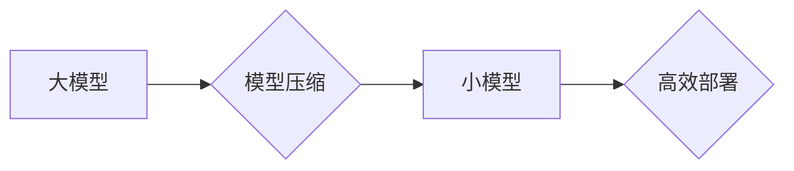

                 

## 搜索推荐系统的模型压缩：大模型高效部署策略

> 关键词：模型压缩、搜索推荐、大模型、高效部署、量化、剪枝、知识蒸馏

## 1. 背景介绍

随着深度学习技术的飞速发展，搜索推荐系统模型规模不断扩大，模型参数量达到数十亿甚至数百亿级别。这些大模型在性能上取得了显著提升，但也带来了巨大的计算资源消耗和部署成本。如何高效地部署大模型，使其在有限的资源下发挥最佳性能，成为当前搜索推荐系统领域的重要挑战。

模型压缩技术应运而生，旨在通过减少模型参数量、计算量或存储空间，实现模型规模缩减的同时保持或提升模型性能。它为大模型的有效部署提供了可行的解决方案，尤其在移动端、嵌入式设备等资源受限的场景下尤为重要。

## 2. 核心概念与联系

搜索推荐系统模型压缩的核心目标是降低模型复杂度，从而实现高效部署。

**2.1 模型压缩的主要方法**

* **量化（Quantization）:** 将模型参数的精度降低，例如将32位浮点数转换为8位整数。
* **剪枝（Pruning）:** 移除模型中不重要的参数或连接，例如删除权重值较小的连接。
* **知识蒸馏（Knowledge Distillation）:** 通过训练一个较小的学生模型来模仿一个较大的教师模型的知识，从而实现模型压缩。

**2.2 模型压缩与搜索推荐系统的联系**

模型压缩技术可以应用于搜索推荐系统的各个环节，例如：

* **个性化推荐:** 压缩个性化推荐模型，降低其计算成本，提高推荐效率。
* **搜索结果排序:** 压缩搜索结果排序模型，减少模型参数量，降低部署成本。
* **点击率预测:** 压缩点击率预测模型，提高模型推理速度，提升用户体验。

**2.3 模型压缩的架构**



## 3. 核心算法原理 & 具体操作步骤

### 3.1 算法原理概述

模型压缩算法旨在通过减少模型参数量、计算量或存储空间，实现模型规模缩减的同时保持或提升模型性能。

### 3.2 算法步骤详解

**3.2.1 量化算法步骤**

1. **选择量化方法:** 常用的量化方法包括均匀量化、非均匀量化等。
2. **量化参数:** 将模型参数的精度降低，例如将32位浮点数转换为8位整数。
3. **调整模型结构:** 针对量化后的模型，可能需要调整模型结构，例如增加激活函数的量化精度。
4. **重新训练模型:** 对量化后的模型进行微调，以恢复模型性能。

**3.2.2 剪枝算法步骤**

1. **选择剪枝方法:** 常用的剪枝方法包括L1正则化、随机剪枝、结构剪枝等。
2. **计算参数重要性:** 根据模型的权重值、梯度值等信息，计算每个参数的重要性。
3. **移除不重要的参数:** 移除权重值较小的参数或连接。
4. **重新训练模型:** 对剪枝后的模型进行微调，以恢复模型性能。

**3.2.3 知识蒸馏算法步骤**

1. **选择教师模型和学生模型:** 教师模型通常是一个大型模型，学生模型是一个小型模型。
2. **训练学生模型:** 使用教师模型的输出作为监督信号，训练学生模型。
3. **调整学习率:** 为了加速学生模型的训练，通常需要调整学习率。
4. **评估模型性能:** 评估学生模型的性能，并根据需要进行模型调整。

### 3.3 算法优缺点

| 算法 | 优点 | 缺点 |
|---|---|---|
| 量化 | 容易实现，效果显著 | 可能导致精度损失 |
| 剪枝 | 可以大幅度减少模型参数量 | 可能导致模型性能下降 |
| 知识蒸馏 | 可以训练出性能接近教师模型的学生模型 | 需要训练两个模型 |

### 3.4 算法应用领域

模型压缩算法广泛应用于各种领域，例如：

* **移动设备:** 压缩模型可以降低移动设备的计算资源消耗，提高模型推理速度。
* **嵌入式设备:** 压缩模型可以使模型部署在资源受限的嵌入式设备上。
* **云计算:** 压缩模型可以降低云计算的存储成本和计算成本。

## 4. 数学模型和公式 & 详细讲解 & 举例说明

### 4.1 数学模型构建

**4.1.1 量化模型数学模型**

假设模型参数为 $w$, 量化精度为 $b$, 则量化后的参数为：

$$w_{quantized} = round(w/b) * b$$

其中，round() 函数表示四舍五入。

**4.1.2 剪枝模型数学模型**

剪枝模型的数学模型与原始模型类似，但参数矩阵中部分元素被设置为0。

### 4.2 公式推导过程

**4.2.1 量化误差分析**

量化后的参数与原始参数之间的误差为：

$$error = w - w_{quantized}$$

**4.2.2 剪枝参数重要性计算**

可以使用L1正则化来计算参数的重要性：

$$L1 = \sum_{i} |w_i|$$

其中，$w_i$ 表示模型参数的第 $i$ 个元素。

### 4.3 案例分析与讲解

**4.3.1 量化案例分析**

将一个32位浮点数模型量化为8位整数模型，可以显著减少模型参数量和计算量，同时保持模型性能。

**4.3.2 剪枝案例分析**

通过L1正则化剪枝一个深度神经网络模型，可以移除一些不重要的参数，从而减少模型参数量和计算量。

## 5. 项目实践：代码实例和详细解释说明

### 5.1 开发环境搭建

* Python 3.6+
* TensorFlow/PyTorch
* CUDA Toolkit

### 5.2 源代码详细实现

```python
# 量化模型示例代码
import tensorflow as tf

# 定义一个简单的模型
model = tf.keras.Sequential([
    tf.keras.layers.Dense(10, activation='relu'),
    tf.keras.layers.Dense(1)
])

# 量化模型
quantized_model = tf.keras.models.quantize_model(model,
                                                quantization_config=tf.keras.quantization.QuantizationConfig(
                                                    dtype=tf.int8
                                                ))

# 训练量化模型
quantized_model.compile(optimizer='adam', loss='mse')
quantized_model.fit(x_train, y_train, epochs=10)

# 剪枝模型示例代码
import torch

# 定义一个简单的模型
model = torch.nn.Sequential(
    torch.nn.Linear(10, 20),
    torch.nn.ReLU(),
    torch.nn.Linear(20, 1)
)

# 剪枝模型
pruned_model = torch.nn.utils.prune.l1_unstructured(model, name="weight", amount=0.5)

# 训练剪枝模型
pruned_model.train()
optimizer = torch.optim.Adam(pruned_model.parameters())
loss_fn = torch.nn.MSELoss()

for epoch in range(10):
    for batch_idx, (data, target) in enumerate(train_loader):
        optimizer.zero_grad()
        output = pruned_model(data)
        loss = loss_fn(output, target)
        loss.backward()
        optimizer.step()
```

### 5.3 代码解读与分析

* 量化模型示例代码：使用TensorFlow的`quantize_model`函数对模型进行量化，并将模型参数的精度降低到8位整数。
* 剪枝模型示例代码：使用PyTorch的`l1_unstructured`函数对模型进行剪枝，移除权重值较小的连接。

### 5.4 运行结果展示

运行上述代码，可以观察到量化模型和剪枝模型的性能变化，并比较其参数量和计算量。

## 6. 实际应用场景

### 6.1 个性化推荐

在个性化推荐系统中，模型压缩可以帮助降低模型的计算成本，提高推荐效率。例如，可以将个性化推荐模型压缩到移动设备上，实现离线推荐功能。

### 6.2 搜索结果排序

在搜索结果排序系统中，模型压缩可以帮助减少模型参数量，降低部署成本。例如，可以将搜索结果排序模型压缩到云端服务器上，提高搜索效率。

### 6.3 点击率预测

在点击率预测系统中，模型压缩可以帮助提高模型推理速度，提升用户体验。例如，可以将点击率预测模型压缩到边缘设备上，实现实时点击率预测。

### 6.4 未来应用展望

随着深度学习技术的不断发展，模型压缩技术将得到更广泛的应用，例如：

* **边缘计算:** 将大模型压缩到边缘设备上，实现本地推理。
* **实时推荐:** 提高模型推理速度，实现实时个性化推荐。
* **多模态推荐:** 将不同模态的数据融合，实现更精准的推荐。

## 7. 工具和资源推荐

### 7.1 学习资源推荐

* **书籍:**
    * 《Deep Learning》 by Ian Goodfellow, Yoshua Bengio, and Aaron Courville
    * 《Hands-On Machine Learning with Scikit-Learn, Keras & TensorFlow》 by Aurélien Géron
* **在线课程:**
    * Coursera: Deep Learning Specialization
    * Udacity: Deep Learning Nanodegree

### 7.2 开发工具推荐

* **TensorFlow:** https://www.tensorflow.org/
* **PyTorch:** https://pytorch.org/
* **ONNX:** https://onnx.ai/

### 7.3 相关论文推荐

* **Quantization-aware Training: A Methodology for Quantizing Deep Neural Networks**
* **Pruning Filters for Efficient ConvNets**
* **Distilling the Knowledge in a Neural Network**

## 8. 总结：未来发展趋势与挑战

### 8.1 研究成果总结

模型压缩技术取得了显著的进展，能够有效地降低模型复杂度，实现高效部署。

### 8.2 未来发展趋势

* **更有效的压缩算法:** 研究更有效的模型压缩算法，例如基于神经网络的压缩算法。
* **自动化模型压缩:** 开发自动化模型压缩工具，方便用户进行模型压缩。
* **跨平台模型压缩:** 研究跨平台的模型压缩技术，实现模型在不同平台上的高效部署。

### 8.3 面临的挑战

* **精度损失:** 模型压缩可能会导致精度损失，需要找到平衡压缩率和精度的方法。
* **模型复杂度:** 一些复杂的模型难以压缩，需要研究针对不同模型类型的压缩方法。
* **硬件支持:** 模型压缩需要硬件的支持，例如量化加速器。

### 8.4 研究展望

未来，模型压缩技术将继续发展，成为搜索推荐系统高效部署的重要手段。

## 9. 附录：常见问题与解答

**9.1 模型压缩会影响模型性能吗？**

是的，模型压缩可能会导致精度损失。但是，通过选择合适的压缩方法和调整模型参数，可以尽量减少精度损失。

**9.2 模型压缩的效率如何？**

模型压缩的效率取决于选择的压缩方法和模型规模。一般来说，模型压缩可以显著减少模型参数量和计算量。

**9.3 模型压缩有哪些应用场景？**

模型压缩广泛应用于各种场景，例如移动设备、嵌入式设备、云计算等。

**9.4 如何选择合适的模型压缩方法？**

选择合适的模型压缩方法需要根据模型类型、应用场景和精度要求等因素进行综合考虑。

**9.5 模型压缩有哪些工具和资源？**

有很多工具和资源可以帮助用户进行模型压缩，例如TensorFlow、PyTorch、ONNX等。


作者：禅与计算机程序设计艺术 / Zen and the Art of Computer Programming<end_of_turn>

