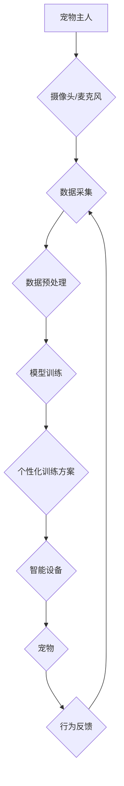

                 

## 数字化宠物训练创业：AI驱动的宠物教育

> 关键词：人工智能、宠物训练、机器学习、深度学习、自然语言处理、计算机视觉、行为分析

## 1. 背景介绍

宠物已经成为许多家庭不可或缺的成员，人们对宠物的关爱程度不断提升。然而，宠物训练一直是一个充满挑战的过程，需要耐心、技巧和专业知识。传统的宠物训练方法往往依赖于经验和模仿，效率低下，且难以量化评估训练效果。随着人工智能技术的快速发展，AI驱动的宠物教育成为一个充满潜力的新兴领域。

近年来，人工智能在各个领域取得了突破性进展，特别是机器学习和深度学习在图像识别、语音识别、自然语言处理等方面的表现令人瞩目。这些技术可以被应用于宠物训练，为宠物主人提供更智能、更便捷、更有效的训练解决方案。

## 2. 核心概念与联系

AI驱动的宠物教育的核心概念是利用人工智能技术分析宠物的行为模式，识别宠物的学习能力和需求，并根据这些信息提供个性化的训练方案。

**2.1  核心概念**

* **机器学习 (Machine Learning):**  通过算法学习数据中的模式，并根据这些模式进行预测或决策。在宠物训练中，机器学习可以用于识别宠物的行为模式，例如坐下、握手、等待等，并根据这些模式调整训练策略。
* **深度学习 (Deep Learning):**  一种更高级的机器学习方法，利用多层神经网络模拟人类大脑的学习过程。深度学习可以用于更复杂的行为识别，例如情绪识别、意图识别等。
* **计算机视觉 (Computer Vision):**  使计算机能够“看”和理解图像和视频。在宠物训练中，计算机视觉可以用于识别宠物的动作、表情和姿势，并根据这些信息提供反馈。
* **自然语言处理 (Natural Language Processing):**  使计算机能够理解和生成人类语言。在宠物训练中，自然语言处理可以用于理解宠物主人的指令，并将其转换为宠物能够理解的语言。

**2.2  架构图**



## 3. 核心算法原理 & 具体操作步骤

**3.1  算法原理概述**

AI驱动的宠物训练主要依赖于机器学习算法，例如监督学习、强化学习和迁移学习。

* **监督学习:** 利用标记数据训练模型，例如将宠物的行为与相应的指令进行关联。
* **强化学习:** 通过奖励和惩罚机制训练模型，让模型学习最优的行为策略。
* **迁移学习:** 利用预先训练好的模型，在新的宠物训练任务上进行微调。

**3.2  算法步骤详解**

1. **数据采集:** 收集宠物的行为数据，例如视频、音频、传感器数据等。
2. **数据预处理:** 对采集到的数据进行清洗、格式化、特征提取等处理，使其适合模型训练。
3. **模型训练:** 选择合适的机器学习算法，并利用预处理后的数据进行模型训练。
4. **模型评估:** 使用测试数据评估模型的性能，例如准确率、召回率等。
5. **个性化训练方案:** 根据模型的预测结果，为每个宠物制定个性化的训练方案。
6. **智能设备交互:** 利用智能设备，例如智能狗窝、智能玩具等，与宠物进行交互，提供训练反馈和奖励。
7. **行为反馈收集:** 收集宠物的行为反馈，并将其反馈到模型训练中，不断优化训练方案。

**3.3  算法优缺点**

* **优点:**
    * **个性化训练:** 根据宠物的个体差异提供个性化的训练方案。
    * **效率提升:** 自动化训练过程，提高训练效率。
    * **数据驱动:** 基于数据分析，提供更科学的训练方法。
* **缺点:**
    * **数据依赖:** 需要大量高质量的宠物行为数据进行训练。
    * **算法复杂:** 训练和部署AI模型需要一定的技术门槛。
    * **伦理问题:** 需要考虑AI驱动的宠物训练对宠物福利的影响。

**3.4  算法应用领域**

* **宠物行为矫正:** 训练宠物解决行为问题，例如吠叫、攻击、破坏等。
* **宠物技能训练:** 教宠物学习新的技能，例如坐下、握手、翻滚等。
* **宠物健康监测:** 通过分析宠物的行为数据，识别潜在的健康问题。
* **宠物陪伴:** 利用AI技术开发智能宠物玩具，为宠物提供陪伴和娱乐。

## 4. 数学模型和公式 & 详细讲解 & 举例说明

**4.1  数学模型构建**

在AI驱动的宠物训练中，常用的数学模型包括神经网络、支持向量机、决策树等。

* **神经网络:**  模拟人类大脑的神经元结构，通过多层神经网络进行特征提取和决策。
* **支持向量机:**  通过寻找最佳的分隔超平面，将不同类别的数据进行分类。
* **决策树:**  通过一系列的决策规则，将数据分类或预测。

**4.2  公式推导过程**

神经网络的训练过程涉及到梯度下降算法，其核心公式为：

$$
\theta = \theta - \alpha \nabla J(\theta)
$$

其中：

* $\theta$ 是模型参数
* $\alpha$ 是学习率
* $J(\theta)$ 是损失函数

损失函数用于衡量模型预测结果与真实结果之间的差异。

**4.3  案例分析与讲解**

假设我们训练一个模型，用于识别宠物的行为，例如坐下、握手、等待等。我们可以使用监督学习方法，利用标记数据训练模型。

训练数据包括宠物的行为视频和相应的标签，例如“坐下”、“握手”、“等待”。模型通过学习这些数据，能够识别出不同行为的特征，并预测新的视频中宠物的行为。

## 5. 项目实践：代码实例和详细解释说明

**5.1  开发环境搭建**

* **操作系统:** Linux/macOS/Windows
* **编程语言:** Python
* **深度学习框架:** TensorFlow/PyTorch
* **计算机视觉库:** OpenCV

**5.2  源代码详细实现**

```python
import tensorflow as tf

# 定义模型结构
model = tf.keras.models.Sequential([
    tf.keras.layers.Conv2D(32, (3, 3), activation='relu', input_shape=(64, 64, 3)),
    tf.keras.layers.MaxPooling2D((2, 2)),
    tf.keras.layers.Conv2D(64, (3, 3), activation='relu'),
    tf.keras.layers.MaxPooling2D((2, 2)),
    tf.keras.layers.Flatten(),
    tf.keras.layers.Dense(10, activation='softmax')
])

# 编译模型
model.compile(optimizer='adam',
              loss='sparse_categorical_crossentropy',
              metrics=['accuracy'])

# 训练模型
model.fit(x_train, y_train, epochs=10)

# 评估模型
loss, accuracy = model.evaluate(x_test, y_test)
print('Loss:', loss)
print('Accuracy:', accuracy)
```

**5.3  代码解读与分析**

这段代码定义了一个简单的卷积神经网络模型，用于识别宠物的行为。

* `tf.keras.models.Sequential` 创建了一个顺序模型，将不同的层依次连接。
* `tf.keras.layers.Conv2D` 定义了一个卷积层，用于提取图像特征。
* `tf.keras.layers.MaxPooling2D` 定义了一个最大池化层，用于降低特征图的维度。
* `tf.keras.layers.Flatten` 将多维特征图转换为一维向量。
* `tf.keras.layers.Dense` 定义了一个全连接层，用于分类。
* `model.compile` 编译模型，指定优化器、损失函数和评估指标。
* `model.fit` 训练模型，使用训练数据进行训练。
* `model.evaluate` 评估模型，使用测试数据评估模型的性能。

**5.4  运行结果展示**

训练完成后，我们可以使用模型对新的宠物行为视频进行预测。模型的输出结果是一个概率分布，表示不同行为的可能性。

## 6. 实际应用场景

**6.1  宠物训练平台**

AI驱动的宠物训练平台可以提供个性化的训练方案，帮助宠物主人训练宠物。平台可以利用摄像头、麦克风等设备收集宠物的行为数据，并根据数据分析提供训练建议。

**6.2  智能宠物玩具**

AI驱动的智能宠物玩具可以与宠物进行互动，提供娱乐和训练功能。例如，智能球可以根据宠物的运动轨迹调整速度和方向，智能狗窝可以根据宠物的情绪提供不同的声音和灯光效果。

**6.3  宠物行为分析工具**

AI驱动的宠物行为分析工具可以帮助兽医和宠物行为专家分析宠物的行为数据，识别潜在的健康问题或行为问题。

**6.4  未来应用展望**

AI驱动的宠物教育将继续发展，并应用于更多场景，例如：

* **远程宠物训练:** 通过网络连接，宠物主人可以远程进行宠物训练。
* **宠物情感识别:** 利用AI技术识别宠物的情绪，帮助宠物主人更好地理解宠物的需求。
* **个性化宠物护理:** 根据宠物的个体差异，提供个性化的护理方案。

## 7. 工具和资源推荐

**7.1  学习资源推荐**

* **在线课程:** Coursera、edX、Udacity 等平台提供人工智能、机器学习、深度学习等方面的在线课程。
* **书籍:** 《深度学习》、《机器学习实战》等书籍可以帮助读者深入了解人工智能相关知识。
* **开源项目:** TensorFlow、PyTorch 等开源项目可以帮助读者实践人工智能技术。

**7.2  开发工具推荐**

* **编程语言:** Python 是人工智能开发的常用语言。
* **深度学习框架:** TensorFlow、PyTorch 是常用的深度学习框架。
* **计算机视觉库:** OpenCV 是常用的计算机视觉库。

**7.3  相关论文推荐**

* **《Attention Is All You Need》:** 介绍了Transformer模型，该模型在自然语言处理领域取得了突破性进展。
* **《Deep Residual Learning for Image Recognition》:** 介绍了ResNet模型，该模型在图像识别领域取得了优异的性能。
* **《Generative Adversarial Networks》:** 介绍了GAN模型，该模型可以生成逼真的图像、音频和文本。

## 8. 总结：未来发展趋势与挑战

**8.1  研究成果总结**

AI驱动的宠物教育取得了显著进展，例如宠物行为识别、个性化训练方案、智能宠物玩具等。这些技术可以帮助宠物主人更好地训练和照顾宠物，提升宠物的生活质量。

**8.2  未来发展趋势**

* **更精准的行为识别:** 利用更先进的计算机视觉和深度学习算法，实现更精准的宠物行为识别。
* **更个性化的训练方案:** 基于宠物的个体差异和学习能力，提供更个性化的训练方案。
* **更智能的宠物陪伴:** 开发更智能的宠物玩具和陪伴机器人，为宠物提供更丰富多彩的互动体验。

**8.3  面临的挑战**

* **数据获取和标注:** 训练AI模型需要大量高质量的宠物行为数据，数据获取和标注成本较高。
* **算法复杂度:** 训练和部署AI模型需要一定的技术门槛，算法复杂度较高。
* **伦理问题:** 需要考虑AI驱动的宠物训练对宠物福利的影响，确保宠物的健康和幸福。

**8.4  研究展望**

未来，AI驱动的宠物教育将继续发展，并应用于更多场景，为宠物和宠物主人带来更多益处。


## 9. 附录：常见问题与解答

**9.1  Q: AI驱动的宠物训练是否会取代传统的宠物训练师？**

**A:** AI驱动的宠物训练可以辅助宠物训练师的工作，提高训练效率，但不会完全取代传统的宠物训练师。宠物训练需要考虑很多因素，例如宠物的性格、环境、主人的需求等，AI技术目前还无法完全替代人类的经验和判断。

**9.2  Q: AI驱动的宠物训练是否安全可靠？**

**A:** AI驱动的宠物训练需要经过严格的测试和评估，确保其安全可靠。选择信誉良好的平台和产品，并根据产品说明进行使用。

**9.3  Q: 如何选择合适的AI驱动的宠物训练产品？**

**A:** 选择AI驱动的宠物训练产品时，需要考虑以下因素：

* **产品功能:** 产品的功能是否满足您的需求？
* **数据安全:** 产品是否能够保护您的宠物数据安全？
* **用户评价:** 其他用户对产品的评价如何？
* **价格:** 产品的价格是否合理？


作者：禅与计算机程序设计艺术 / Zen and the Art of Computer Programming 
<end_of_turn>

