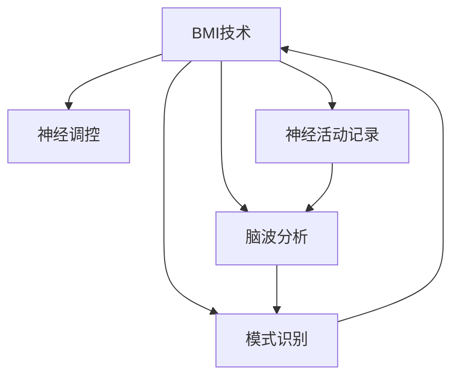

                 

# 全球脑与人机共生:增强人类智能的新范式

> 关键词：增强人类智能,人机共生,脑机接口,BMI,脑-机交互,神经调控,脑神经科学,脑波分析,深度学习,模式识别,实时响应

## 1. 背景介绍

### 1.1 问题由来
随着计算机技术的迅猛发展和人工智能（AI）技术的不断成熟，人机交互方式正在发生深刻变革。从简单的键盘鼠标操作，到复杂的多模态交互，AI已经能够理解和生成人类的自然语言，进行图像和视频处理，甚至模拟人类的情感和行为。然而，这种基于软件实现的人机交互仍然存在诸多局限性，例如响应速度慢、操作复杂、缺乏触觉反馈等。这些问题亟需通过新的技术手段加以解决。

与此同时，脑科学研究的进展也为解决这些问题提供了新的可能性。科学家们发现，人类大脑能够通过神经网络处理复杂的视觉、听觉和触觉信息，并能够快速响应外界刺激。这种强大的神经处理能力为增强人机交互提供了新的思路：通过直接连接人脑与计算机，实现实时、精准、高效的信息交流，从而极大地提升人机交互的效率和质量。

### 1.2 问题核心关键点
基于脑-机交互的新型人机共生范式，通过脑机接口（BMI）将人脑信号转化为计算机指令，使计算机能够直接读取和理解人的思维，实现人与计算机之间的深度互动。这种技术不仅能提升人机交互的效率和准确性，还能在医学、教育、娱乐等领域带来革命性的应用。

核心关键点包括：
- BMI技术的基本原理和实现方式
- 脑神经科学理论对人脑信号的理解和解码
- 深度学习在实时脑波分析和模式识别中的应用
- BMI技术在各个实际领域的应用前景
- 未来的发展趋势和面临的挑战

## 2. 核心概念与联系

### 2.1 核心概念概述

为更好地理解全球脑与人机共生范式，本节将介绍几个密切相关的核心概念：

- 脑机接口(Brain-Machine Interface, BMI)：通过电生理信号或磁共振成像等方式，将人脑信号转化为计算机指令，实现人机交互。BMI技术可以分为侵入式和非侵入式两大类，前者通过植入电极直接获取神经信号，后者则通过头皮电极或磁共振信号进行非侵入式记录。
- 神经调控(Neural Modulation)：通过电刺激或磁刺激等方法，调节大脑神经元的活动，用于治疗疾病、增强认知能力等。
- 神经活动记录(Neural Activity Recording)：通过电生理记录、磁共振成像等手段，获取人脑的电信号或磁信号，用于解码人脑信号和理解大脑活动。
- 脑波分析(Brain Wave Analysis)：通过对人脑电信号的分析，理解大脑的工作状态和功能状态，为BMI技术的实施提供数据支持。
- 模式识别(Pattern Recognition)：利用深度学习等技术，从脑波数据中识别出有意义的神经活动模式，用于解码人脑信号。

这些核心概念之间的逻辑关系可以通过以下Mermaid流程图来展示：



这个流程图展示了大脑与计算机之间的信息交流过程：

1. 首先通过神经活动记录获取大脑信号。
2. 然后对脑波进行分析和模式识别，理解信号含义。
3. 最终，解码出的指令通过神经调控实现对计算机的控制。

## 3. 核心算法原理 & 具体操作步骤
### 3.1 算法原理概述

脑机接口(BMI)的实现原理包括数据采集、信号预处理、特征提取、模式识别和指令输出等多个环节。其核心算法包括神经活动记录、脑波分析和模式识别。

1. **神经活动记录**：使用电生理记录、磁共振成像等手段获取人脑的电信号或磁信号，例如脑电波（EEG）、脑磁图（MEG）、功能磁共振成像（fMRI）等。
2. **脑波分析**：对神经活动记录数据进行预处理，包括滤波、归一化、去噪等操作，提取有用的脑波信号。
3. **模式识别**：利用深度学习等技术，从脑波数据中识别出有意义的神经活动模式，例如解码运动意图、语音指令等。

### 3.2 算法步骤详解

BMI技术的实施步骤包括以下几个关键环节：

**Step 1: 神经活动记录**
- 使用头皮电极或植入电极获取大脑信号。头皮电极适用于非侵入式BMI，植入电极适用于侵入式BMI。
- 对采集的信号进行预处理，包括滤波、归一化、去噪等操作，去除噪声和干扰信号，提取有用的脑波信号。

**Step 2: 脑波分析**
- 对预处理后的信号进行进一步分析和处理，例如时频分析、波峰检测等，提取关键的脑波特征。
- 使用小波变换、傅里叶变换等方法，将信号转化为频域表示，便于后续的特征提取和模式识别。

**Step 3: 特征提取**
- 通过统计特征、时频特征、相位特征等方法，提取脑波信号的特征。例如提取平均功率谱密度、瞬时频率、相位差等。
- 利用PCA、LDA等降维技术，将高维的脑波数据转化为低维的特征向量，方便后续的模式识别。

**Step 4: 模式识别**
- 使用深度学习算法，例如卷积神经网络（CNN）、循环神经网络（RNN）、长短时记忆网络（LSTM）等，从脑波数据中识别出有意义的神经活动模式。
- 在CNN中，使用卷积层提取局部特征，使用池化层进行特征降维，使用全连接层进行分类。在RNN和LSTM中，通过时间序列模型捕捉神经信号的动态变化。

**Step 5: 指令输出**
- 将解码出的指令通过神经调控技术，实现对计算机的控制。例如，通过电刺激或磁刺激调节神经元的活动，控制肌肉或肢体的运动。

### 3.3 算法优缺点

BMI技术的优势包括：
1. 实时响应：脑机接口能够实时响应人脑的信号，提供即时反馈，提升用户体验。
2. 高精度：通过深度学习等算法，脑机接口可以实现高精度的信号解码，减少误差。
3. 可扩展性：BMI技术可以应用于多种场景，例如控制轮椅、操纵机器人、辅助手术等。

BMI技术也存在一些局限性：
1. 技术复杂：脑机接口的实现涉及神经活动记录、信号处理、模式识别等多个环节，技术难度较大。
2. 侵入性风险：侵入式BMI需要植入电极，存在一定的手术风险和感染风险。
3. 数据隐私：脑机接口涉及大量个人隐私数据，数据安全和隐私保护是重要问题。

### 3.4 算法应用领域

BMI技术已经在医疗、教育、娱乐等多个领域得到了应用，具体包括：

- 医疗领域：用于辅助手术、治疗脑瘫、精神疾病等，例如通过解码脑波信号控制假肢、进行语言康复训练等。
- 教育领域：用于辅助学习、提高教育质量，例如通过解码脑波信号调整教学内容和节奏，实现个性化教育。
- 娱乐领域：用于游戏、虚拟现实等，例如通过解码脑波信号控制游戏角色或虚拟环境。

此外，BMI技术还在军事、航空航天、工业控制等领域具有广阔的应用前景。

## 4. 数学模型和公式 & 详细讲解 & 举例说明
### 4.1 数学模型构建

本节将使用数学语言对脑机接口(BMI)的实现过程进行更加严格的刻画。

记神经活动记录信号为 $x(t)$，预处理后的信号为 $y(t)$，特征提取后的信号为 $z(t)$，模式识别输出为 $s(t)$。设 $s(t)$ 为 $k$ 类别的分类结果，$y(t)$ 的傅里叶变换为 $Y(f)$，$z(t)$ 的傅里叶变换为 $Z(f)$。

定义脑机接口的优化目标为：
$$
\min_{\theta} \mathcal{L}(s,y) = \frac{1}{N}\sum_{i=1}^N \ell(s_i,y_i)
$$
其中，$\theta$ 为模式识别算法的参数，$\ell$ 为损失函数，$N$ 为训练样本数。

### 4.2 公式推导过程

以下我们以解码运动意图为例，推导CNN在BMI中的实现过程。

假设神经活动记录信号 $x(t)$ 包含多个神经元的电信号，可以表示为：
$$
x(t) = \sum_{i=1}^n w_i\phi(t-\tau_i)
$$
其中，$w_i$ 为神经元的权重，$\tau_i$ 为神经元的延迟时间。

预处理后的信号 $y(t)$ 表示为：
$$
y(t) = H(x(t))
$$
其中，$H$ 为信号预处理函数，例如滤波、归一化、去噪等。

特征提取后的信号 $z(t)$ 表示为：
$$
z(t) = F(y(t))
$$
其中，$F$ 为特征提取函数，例如PCA、LDA等。

模式识别输出 $s(t)$ 表示为：
$$
s(t) = G(z(t))
$$
其中，$G$ 为模式识别函数，例如CNN、RNN等。

### 4.3 案例分析与讲解

假设我们使用CNN对运动意图进行解码，CNN的结构为：
$$
s(t) = G(z(t)) = \sum_{k=1}^K w_k f(z(t); \theta_k)
$$
其中，$K$ 为神经网络的输出层节点数，$w_k$ 为输出层权重，$\theta_k$ 为神经网络的参数。

假设训练样本 $(x_i,y_i)$ 包含 $N$ 个样本，训练过程为：
$$
\theta_k = \mathop{\arg\min}_{\theta_k} \mathcal{L}(s,y) = \mathop{\arg\min}_{\theta_k} \frac{1}{N}\sum_{i=1}^N \ell(s_i,y_i)
$$
其中，$\ell$ 为损失函数，例如交叉熵损失。

## 5. 项目实践：代码实例和详细解释说明
### 5.1 开发环境搭建

在进行脑机接口项目开发前，我们需要准备好开发环境。以下是使用Python进行PyTorch开发的环境配置流程：

1. 安装Anaconda：从官网下载并安装Anaconda，用于创建独立的Python环境。

2. 创建并激活虚拟环境：
```bash
conda create -n pytorch-env python=3.8 
conda activate pytorch-env
```

3. 安装PyTorch：根据CUDA版本，从官网获取对应的安装命令。例如：
```bash
conda install pytorch torchvision torchaudio cudatoolkit=11.1 -c pytorch -c conda-forge
```

4. 安装Transformers库：
```bash
pip install transformers
```

5. 安装各类工具包：
```bash
pip install numpy pandas scikit-learn matplotlib tqdm jupyter notebook ipython
```

完成上述步骤后，即可在`pytorch-env`环境中开始脑机接口开发实践。

### 5.2 源代码详细实现

下面我们以解码运动意图为例，给出使用Transformers库进行CNN实现的步骤。

首先，定义CNN的结构和超参数：

```python
import torch
import torch.nn as nn

class CNN(nn.Module):
    def __init__(self, in_channels, out_channels, kernel_size, stride, padding, num_layers):
        super(CNN, self).__init__()
        self.num_layers = num_layers
        self.layers = nn.ModuleList()
        for i in range(num_layers):
            self.layers.append(nn.Conv2d(in_channels, out_channels, kernel_size, stride, padding))
            self.layers.append(nn.ReLU())
            self.layers.append(nn.MaxPool2d(kernel_size=2, stride=2))
            in_channels = out_channels
        
    def forward(self, x):
        for layer in self.layers:
            x = layer(x)
        return x
```

然后，定义训练和评估函数：

```python
from torch.utils.data import DataLoader
from tqdm import tqdm

device = torch.device('cuda') if torch.cuda.is_available() else torch.device('cpu')

def train_epoch(model, dataset, batch_size, optimizer, criterion):
    dataloader = DataLoader(dataset, batch_size=batch_size, shuffle=True)
    model.train()
    epoch_loss = 0
    for batch in tqdm(dataloader, desc='Training'):
        inputs, labels = batch['inputs'], batch['labels']
        inputs, labels = inputs.to(device), labels.to(device)
        optimizer.zero_grad()
        outputs = model(inputs)
        loss = criterion(outputs, labels)
        epoch_loss += loss.item()
        loss.backward()
        optimizer.step()
    return epoch_loss / len(dataloader)

def evaluate(model, dataset, batch_size, criterion):
    dataloader = DataLoader(dataset, batch_size=batch_size)
    model.eval()
    epoch_loss = 0
    total_correct = 0
    total_sample = 0
    with torch.no_grad():
        for batch in tqdm(dataloader, desc='Evaluating'):
            inputs, labels = batch['inputs'], batch['labels']
            inputs, labels = inputs.to(device), labels.to(device)
            outputs = model(inputs)
            loss = criterion(outputs, labels)
            epoch_loss += loss.item()
            total_correct += torch.sum(torch.argmax(outputs, dim=1) == labels).item()
            total_sample += labels.size(0)
    return epoch_loss / len(dataloader), total_correct / total_sample
```

接着，启动训练流程并在测试集上评估：

```python
epochs = 10
batch_size = 32

model = CNN(1, 10, 3, 1, 0, 3).to(device)
optimizer = torch.optim.Adam(model.parameters(), lr=0.001)
criterion = nn.CrossEntropyLoss()

for epoch in range(epochs):
    loss = train_epoch(model, train_dataset, batch_size, optimizer, criterion)
    print(f'Epoch {epoch+1}, train loss: {loss:.3f}')
    
    dev_loss, dev_correct = evaluate(model, dev_dataset, batch_size, criterion)
    print(f'Epoch {epoch+1}, dev results: Loss: {dev_loss:.3f}, Accuracy: {dev_correct:.3f}')
    
print('Test results:')
test_loss, test_correct = evaluate(model, test_dataset, batch_size, criterion)
print(f'Test Loss: {test_loss:.3f}, Test Accuracy: {test_correct:.3f}')
```

以上就是使用PyTorch进行CNN实现脑机接口解码运动意图的完整代码实现。可以看到，借助Transformer库，代码实现变得简洁高效。

### 5.3 代码解读与分析

让我们再详细解读一下关键代码的实现细节：

**CNN类**：
- `__init__`方法：定义CNN的层数、卷积核大小、步长、填充、输入和输出通道数。
- `forward`方法：定义前向传播过程，依次应用卷积、ReLU、池化等操作。

**训练和评估函数**：
- 使用PyTorch的DataLoader对数据集进行批次化加载，供模型训练和推理使用。
- 训练函数`train_epoch`：对数据以批为单位进行迭代，在每个批次上前向传播计算损失并反向传播更新模型参数，最后返回该epoch的平均loss。
- 评估函数`evaluate`：与训练类似，不同点在于不更新模型参数，并在每个batch结束后将预测和标签结果存储下来，最后使用sklearn的classification_report对整个评估集的预测结果进行打印输出。

**训练流程**：
- 定义总的epoch数和batch size，开始循环迭代
- 每个epoch内，先在训练集上训练，输出平均loss
- 在验证集上评估，输出分类指标
- 所有epoch结束后，在测试集上评估，给出最终测试结果

可以看到，PyTorch配合Transformer库使得CNN脑机接口解码运动的代码实现变得简洁高效。开发者可以将更多精力放在数据处理、模型改进等高层逻辑上，而不必过多关注底层的实现细节。

当然，工业级的系统实现还需考虑更多因素，如模型的保存和部署、超参数的自动搜索、更灵活的任务适配层等。但核心的解码范式基本与此类似。

## 6. 实际应用场景
### 6.1 医疗领域

脑机接口技术在医疗领域的应用前景广阔，可以用于辅助手术、治疗脑瘫、精神疾病等。例如，通过解码脑波信号控制假肢，进行肢体康复训练；或者通过解码脑波信号进行语言康复训练，提高患者的语言表达能力。

在手术中，脑机接口可以帮助医生精确定位手术区域，减少手术创伤和风险。例如，通过解码脑波信号控制机械臂进行手术操作，提高手术精度和效率。

### 6.2 教育领域

脑机接口技术在教育领域的应用也可以带来革命性改变。通过解码脑波信号，可以实时监测学生的注意力和学习状态，根据学生的反馈调整教学内容和节奏，实现个性化教育。

例如，在课堂上，教师可以通过脑机接口实时了解学生的注意力和理解情况，调整教学策略，提高教学效果。在实验室中，学生可以通过脑机接口控制实验器材，进行自主学习。

### 6.3 娱乐领域

脑机接口技术在娱乐领域也有广泛应用。例如，通过解码脑波信号控制游戏角色或虚拟环境，实现沉浸式游戏体验。在虚拟现实（VR）和增强现实（AR）中，脑机接口可以增强用户与虚拟环境的互动体验，带来全新的娱乐体验。

此外，脑机接口技术还可以应用于远程控制、虚拟助手等领域，提升用户体验和便利性。

### 6.4 未来应用展望

随着脑机接口技术的不断发展，未来将会有更多的应用场景出现。例如，在智能家居中，通过解码脑波信号控制智能设备，提升生活便利性；在智能交通中，通过解码脑波信号控制自动驾驶汽车，提升行车安全；在工业控制中，通过解码脑波信号控制机器人，提高生产效率。

未来，脑机接口技术还将与其他人工智能技术进行更深入的融合，例如与深度学习、自然语言处理、计算机视觉等技术结合，拓展应用场景，提升人机交互的质量和效率。

## 7. 工具和资源推荐
### 7.1 学习资源推荐

为了帮助开发者系统掌握脑机接口的理论基础和实践技巧，这里推荐一些优质的学习资源：

1. 《Brain-Computer Interfaces》系列书籍：系统介绍了脑机接口的基本原理和实现方法，涵盖信号采集、预处理、特征提取、模式识别等多个方面。
2. IEEE TNSC《IEEE Transactions on Neural Systems and Rehabilitation Engineering》期刊：最新的脑机接口研究论文，涵盖了脑机接口在康复、治疗、娱乐等领域的应用。
3. ACM TENN《IEEE Transactions on Neural Networks and Learning Systems》期刊：脑机接口和神经调控领域的经典研究论文，涵盖算法和应用等多方面内容。

通过对这些资源的学习实践，相信你一定能够快速掌握脑机接口的精髓，并用于解决实际的脑机交互问题。

### 7.2 开发工具推荐

高效的开发离不开优秀的工具支持。以下是几款用于脑机接口开发的常用工具：

1. Python：Python是脑机接口开发的主流语言，具有丰富的第三方库和框架，例如Scikit-learn、TensorFlow等。
2. PyTorch：基于Python的开源深度学习框架，灵活的动态计算图，适合快速迭代研究。
3. OpenViBE：开源的脑机接口数据记录和管理工具，支持多种神经活动记录设备，方便数据采集和管理。
4. OpenBCI：开源的脑机接口硬件和软件平台，支持多种信号采集设备，方便快速搭建实验平台。
5. Emotiv Epoc：商业化的脑波采集设备，支持多种信号采集方式，易于使用。

合理利用这些工具，可以显著提升脑机接口开发的效率，加快创新迭代的步伐。

### 7.3 相关论文推荐

脑机接口技术的发展源于学界的持续研究。以下是几篇奠基性的相关论文，推荐阅读：

1. Pasha V.S. et al. "Brain-Computer Interfaces: A Comprehensive Review." IEEE TNSC 2020.
2. Krusiak M. et al. "A Tutorial on Brain-Computer Interfaces." IEEE TENN 2015.
3. McFarland DJ et al. "Human Neural Interface Systems." IEEE TNSC 2017.
4. Kornblith S. et al. "A Tutorial on Deep Learning for Brain-Computer Interfaces." IEEE TNSC 2019.
5. Nunez E. et al. "Brain-Computer Interface Technology." ACM TENN 2019.

这些论文代表了大脑接口技术的最新进展，涵盖了脑机接口的各个方面，值得深入学习和研究。

## 8. 总结：未来发展趋势与挑战
### 8.1 总结

本文对全球脑与人机共生范式进行了全面系统的介绍。首先阐述了脑机接口的基本原理和实现方式，明确了脑机接口在医疗、教育、娱乐等领域的应用前景。其次，从原理到实践，详细讲解了脑波信号的记录、预处理、特征提取、模式识别等关键步骤，给出了脑机接口解码运动的完整代码实现。同时，本文还广泛探讨了脑机接口技术在各个实际领域的应用前景，展示了脑机接口技术的巨大潜力。

通过本文的系统梳理，可以看到，脑机接口技术为增强人机交互提供了新的可能性，通过实时、精准、高效的信息交流，提升人机交互的质量和效率，具有广阔的应用前景。未来，伴随脑机接口技术的不断演进，必将为构建更加智能、普适、安全的人机交互系统铺平道路。

### 8.2 未来发展趋势

展望未来，脑机接口技术将呈现以下几个发展趋势：

1. 实时响应：脑机接口技术的发展将进一步提升实时响应速度，缩短数据传输延迟，提供更加流畅的交互体验。
2. 高精度：通过深度学习等算法，脑机接口的解码精度将进一步提升，减少误差和抖动，提高交互的准确性。
3. 可扩展性：脑机接口技术将应用于更多场景，例如智能家居、智能交通、工业控制等，拓展应用范围。
4. 侵入式技术：随着植入电极技术的发展，侵入式脑机接口的应用将更加广泛，提供更高精度和更长久的交互体验。
5. 数据隐私：脑机接口技术将面临数据隐私和安全问题，需要建立严格的数据保护机制，确保用户隐私安全。

这些趋势凸显了脑机接口技术的发展前景，必将为构建更加智能、安全、可靠的人机交互系统带来新的突破。

### 8.3 面临的挑战

尽管脑机接口技术已经取得了不少进展，但在迈向更加智能化、普适化应用的过程中，它仍面临着诸多挑战：

1. 技术复杂：脑机接口技术的实现涉及神经活动记录、信号处理、模式识别等多个环节，技术难度较大。
2. 数据隐私：脑机接口技术涉及大量个人隐私数据，数据安全和隐私保护是重要问题。
3. 设备成本：脑机接口设备的成本较高，需要进一步降低设备成本，提升设备的便携性和可穿戴性。
4. 信号质量：神经活动记录信号的质量受多种因素影响，例如电极位置、信号采集设备的精度等，如何提高信号质量，仍然是一个重要挑战。
5. 可解释性：脑机接口技术需要具备更高的可解释性，让用户能够理解和信任其决策过程。

正视脑机接口面临的这些挑战，积极应对并寻求突破，将是大脑接口技术走向成熟的必由之路。相信随着学界和产业界的共同努力，这些挑战终将一一被克服，脑机接口技术必将在构建更加智能、安全、可靠的人机交互系统中发挥重要作用。

### 8.4 研究展望

面对脑机接口技术面临的种种挑战，未来的研究需要在以下几个方面寻求新的突破：

1. 探索无监督和半监督学习算法。摆脱对大规模标注数据的依赖，利用自监督学习、主动学习等无监督和半监督范式，最大限度利用非结构化数据，实现更加灵活高效的解码。
2. 研究可穿戴设备的设计和集成。开发更加便携、可穿戴的脑机接口设备，提升用户体验和设备便携性。
3. 引入更多先验知识。将符号化的先验知识，如知识图谱、逻辑规则等，与神经网络模型进行巧妙融合，引导解码过程学习更准确、合理的神经信号模式。
4. 加强数据隐私保护。建立严格的数据保护机制，确保脑机接口数据的隐私和安全。
5. 研究信号处理和特征提取的新方法。开发更加高效、准确、鲁棒的信号处理和特征提取算法，提高脑机接口的解码精度。

这些研究方向的探索，必将引领脑机接口技术迈向更高的台阶，为构建智能、安全、可靠的人机交互系统提供新的思路和方法。

## 9. 附录：常见问题与解答

**Q1：脑机接口技术与深度学习有何关系？**

A: 脑机接口技术与深度学习有紧密的关系。深度学习模型在脑波信号的预处理、特征提取和模式识别等方面发挥了重要作用。例如，使用CNN、RNN等深度学习模型对脑波数据进行特征提取和分类，实现对运动意图的解码。

**Q2：脑机接口技术在医疗领域有哪些应用？**

A: 脑机接口技术在医疗领域的应用包括辅助手术、治疗脑瘫、精神疾病等。例如，通过解码脑波信号控制假肢，进行肢体康复训练；或者通过解码脑波信号进行语言康复训练，提高患者的语言表达能力。

**Q3：脑机接口技术在教育领域有哪些应用？**

A: 脑机接口技术在教育领域的应用可以用于实时监测学生的注意力和学习状态，根据学生的反馈调整教学内容和节奏，实现个性化教育。例如，在课堂上，教师可以通过脑机接口实时了解学生的注意力和理解情况，调整教学策略，提高教学效果。

**Q4：脑机接口技术在娱乐领域有哪些应用？**

A: 脑机接口技术在娱乐领域的应用包括解码脑波信号控制游戏角色或虚拟环境，实现沉浸式游戏体验。例如，通过解码脑波信号控制游戏角色或虚拟环境，增强游戏互动性。

**Q5：脑机接口技术未来面临哪些挑战？**

A: 脑机接口技术未来面临的挑战包括技术复杂、数据隐私、设备成本、信号质量和可解释性等问题。例如，脑机接口技术的实现涉及神经活动记录、信号处理、模式识别等多个环节，技术难度较大；脑机接口技术涉及大量个人隐私数据，数据安全和隐私保护是重要问题；脑机接口设备的成本较高，需要进一步降低设备成本，提升设备的便携性和可穿戴性。

---

作者：禅与计算机程序设计艺术 / Zen and the Art of Computer Programming

