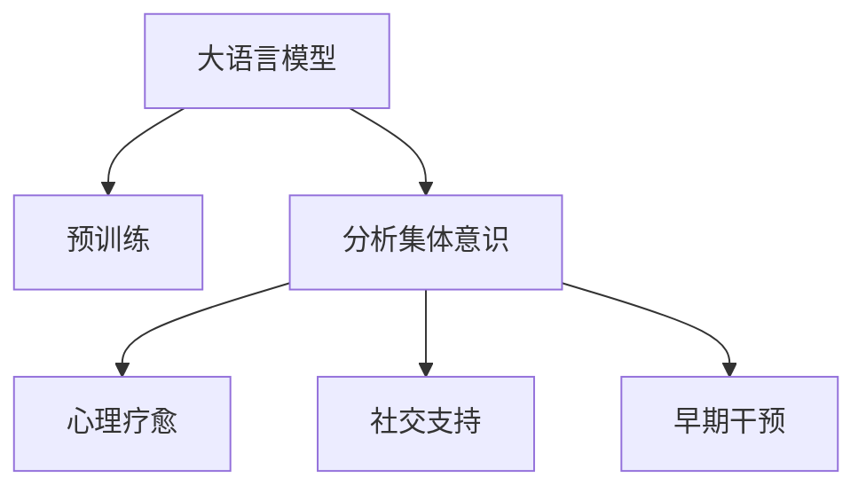

                 

# 全球脑与心理健康:集体意识的治愈力

## 1. 背景介绍

### 1.1 问题由来
在全球化的今天，心理健康问题越来越受到社会的关注。根据世界卫生组织的报告，全球大约有25%的人口在一生中的某个阶段会受到心理健康问题的影响。而新冠疫情期间，由于封锁、社交隔离和疫情的不确定性，全球心理健康的挑战更加严峻。

### 1.2 问题核心关键点
面对这一挑战，全球各地的人们都在寻找应对之道。其中，大语言模型作为一种新兴的技术，为解决这一问题提供了新的可能性。通过分析语言模型中的集体意识，可以对心理健康问题进行更深入的理解和干预，进而实现治愈。

## 2. 核心概念与联系

### 2.1 核心概念概述

为更好地理解如何利用大语言模型来解决心理健康问题，本节将介绍几个关键概念：

- **大语言模型**：以自回归(如GPT)或自编码(如BERT)模型为代表的大规模预训练语言模型。通过在大规模无标签文本语料上进行预训练，学习通用的语言表示，具备强大的语言理解和生成能力。
- **集体意识**：在社交互动中形成的共同认知和情感状态。语言模型通过分析文本中的群体行为和情感表达，可以捕捉集体意识中的关键特征。
- **心理疗愈**：通过改变个体的思维和情感状态，使其逐渐摆脱心理困扰的过程。语言模型可以通过引导对话、分析情感模式等方式，帮助个体进行自我疗愈。
- **社交支持**：指个体在面对心理压力时，通过与他人互动获得情感支持，缓解心理负担。大语言模型可以模拟社交互动，提供虚拟支持。
- **早期干预**：在心理健康问题出现早期阶段进行干预，防止病情恶化。语言模型可以在大规模数据中检测心理健康问题的早期迹象，及时进行预警和干预。

这些核心概念之间的逻辑关系可以通过以下Mermaid流程图来展示：



这个流程图展示了大语言模型与心理健康问题的核心概念及其之间的关系：

1. 大语言模型通过预训练获得基础能力。
2. 分析文本中的集体意识，识别出心理健康问题的早期迹象。
3. 通过心理疗愈和社交支持，帮助个体实现自我疗愈。
4. 早期干预，防止心理健康问题进一步恶化。

这些概念共同构成了利用大语言模型解决心理健康问题的框架，使得我们能够更全面地理解心理健康，并进行有效干预。

## 3. 核心算法原理 & 具体操作步骤
### 3.1 算法原理概述

基于大语言模型解决心理健康问题，本质上是一个从文本中提取和分析集体意识，并应用于心理疗愈和干预的过程。其核心思想是：

- 通过大语言模型的预训练和微调，使其能够捕捉到文本中的情感模式和集体意识。
- 分析文本中的集体意识，识别出心理健康问题的早期迹象，进行早期预警。
- 通过与用户对话，模拟社交互动，提供情感支持，实现心理疗愈。

### 3.2 算法步骤详解

基于大语言模型解决心理健康问题的一般步骤如下：

**Step 1: 准备数据集**
- 收集大量文本数据，包括社交媒体、论坛、博客等，其中包含群体互动、情感表达、心理困扰等信息。
- 对数据进行清洗和预处理，去除噪声和无用信息。

**Step 2: 预训练和微调**
- 使用预训练语言模型(如BERT、GPT)在大规模无标签数据上进行预训练，学习通用的语言表示。
- 针对心理健康相关的数据集，使用监督学习任务进行微调，如分类、情感分析等，使其能够捕捉到文本中的情感模式和集体意识。

**Step 3: 情感分析**
- 使用微调后的语言模型对用户文本进行情感分析，识别出其中的集体意识和情感状态。
- 使用自然语言处理技术，如实体识别、情感极性判断等，进一步分析文本中的关键信息。

**Step 4: 心理疗愈**
- 通过对话机器人、虚拟心理咨询等方式，与用户进行互动，引导其进行自我疗愈。
- 提供基于文本的反馈和建议，帮助用户调整情绪和思维状态。

**Step 5: 社交支持**
- 通过社交网络平台，模拟社交互动，提供虚拟情感支持。
- 利用语言模型分析社交互动中的情感模式，优化支持效果。

**Step 6: 早期干预**
- 利用微调后的语言模型在大规模数据中检测心理健康问题的早期迹象，进行预警。
- 提供实时干预和支持，防止心理健康问题进一步恶化。

### 3.3 算法优缺点

基于大语言模型解决心理健康问题的算法具有以下优点：
1. 处理海量文本数据。大语言模型可以从大规模数据中捕捉情感模式和集体意识，提高分析的准确性。
2. 实现心理疗愈和支持。通过对话机器人、虚拟咨询等方式，可以提供即时、个性化的心理支持。
3. 早期预警和干预。利用模型对数据进行实时分析，可以早期发现心理健康问题，进行预警和干预。

同时，该算法也存在一定的局限性：
1. 对数据质量要求高。模型性能依赖于高质量的数据，数据噪声和偏差可能导致误判。
2. 隐私和安全问题。用户情感数据可能包含敏感信息，需要严格保护。
3. 可解释性不足。模型输出可能缺乏可解释性，难以解释其决策过程。
4. 技术门槛高。需要较高的技术实现和资源投入。

尽管存在这些局限性，但大语言模型在心理健康问题中的应用前景广阔，可以提供新的解决途径。

### 3.4 算法应用领域

基于大语言模型解决心理健康问题的算法，已经在多个领域得到应用，例如：

- **心理健康监控**：使用语言模型分析社交媒体、论坛等平台上的群体互动，识别心理健康问题的早期迹象。
- **虚拟心理咨询**：通过对话机器人与用户互动，提供即时情感支持，帮助其进行自我疗愈。
- **情感分析与情感支持**：分析用户文本中的情感状态，提供基于文本的情感反馈和建议。
- **社交互动支持**：模拟社交互动，提供虚拟情感支持，帮助个体减轻心理负担。

此外，大语言模型还可以应用于教育、人力资源管理、公共健康等领域，为心理健康问题提供新的解决方案。

## 4. 数学模型和公式 & 详细讲解 & 举例说明
### 4.1 数学模型构建

基于大语言模型解决心理健康问题，可以构建一个简单的数学模型，用于描述模型训练、情感分析和心理疗愈的过程。

设预训练语言模型为 $M_{\theta}$，其中 $\theta$ 为预训练得到的模型参数。假设心理健康相关的数据集为 $D=\{(x_i, y_i)\}_{i=1}^N$，$x_i$ 为输入文本，$y_i$ 为情感标签或心理状态。

定义模型 $M_{\theta}$ 在输入 $x_i$ 上的情感分类损失函数为 $\ell(M_{\theta}(x_i),y_i)$，则在数据集 $D$ 上的经验风险为：

$$
\mathcal{L}(\theta) = \frac{1}{N} \sum_{i=1}^N \ell(M_{\theta}(x_i),y_i)
$$

微调的优化目标是最小化经验风险，即找到最优参数：

$$
\theta^* = \mathop{\arg\min}_{\theta} \mathcal{L}(\theta)
$$

在得到损失函数的梯度后，即可带入参数更新公式，完成模型的迭代优化。

### 4.2 公式推导过程

以下我们以情感分类任务为例，推导损失函数及其梯度的计算公式。

假设模型 $M_{\theta}$ 在输入 $x$ 上的输出为 $\hat{y}=M_{\theta}(x) \in [0,1]$，表示样本属于正类的概率。真实标签 $y \in \{0,1\}$。则二分类交叉熵损失函数定义为：

$$
\ell(M_{\theta}(x),y) = -[y\log \hat{y} + (1-y)\log (1-\hat{y})]
$$

将其代入经验风险公式，得：

$$
\mathcal{L}(\theta) = -\frac{1}{N}\sum_{i=1}^N [y_i\log M_{\theta}(x_i)+(1-y_i)\log(1-M_{\theta}(x_i))]
$$

根据链式法则，损失函数对参数 $\theta_k$ 的梯度为：

$$
\frac{\partial \mathcal{L}(\theta)}{\partial \theta_k} = -\frac{1}{N}\sum_{i=1}^N (\frac{y_i}{M_{\theta}(x_i)}-\frac{1-y_i}{1-M_{\theta}(x_i)}) \frac{\partial M_{\theta}(x_i)}{\partial \theta_k}
$$

其中 $\frac{\partial M_{\theta}(x_i)}{\partial \theta_k}$ 可进一步递归展开，利用自动微分技术完成计算。

在得到损失函数的梯度后，即可带入参数更新公式，完成模型的迭代优化。重复上述过程直至收敛，最终得到适应心理健康相关的数据集的最优模型参数 $\theta^*$。

### 4.3 案例分析与讲解

以下通过一个具体的案例来展示大语言模型在心理健康中的应用。

假设我们想要构建一个虚拟心理咨询服务系统，利用语言模型对用户情感进行分析和支持。具体步骤如下：

1. **数据准备**：收集社交媒体平台上的用户评论，标注出其中的情感状态。
2. **预训练**：使用BERT模型在大规模无标签数据上进行预训练。
3. **微调**：针对情感分类任务，对BERT模型进行微调，使其能够识别用户评论中的情感状态。
4. **情感分析**：使用微调后的模型对用户评论进行情感分析，识别出其中的情感状态。
5. **心理支持**：根据情感状态，与用户进行对话，提供情感支持。
6. **效果评估**：对用户反馈进行收集和分析，不断优化模型和对话策略。

通过这个案例，我们可以看到，利用大语言模型可以高效地处理海量情感数据，并根据情感状态提供个性化的心理支持。

## 5. 项目实践：代码实例和详细解释说明
### 5.1 开发环境搭建

在进行心理健康相关的项目开发前，我们需要准备好开发环境。以下是使用Python进行PyTorch开发的环境配置流程：

1. 安装Anaconda：从官网下载并安装Anaconda，用于创建独立的Python环境。

2. 创建并激活虚拟环境：
```bash
conda create -n mental-health-env python=3.8 
conda activate mental-health-env
```

3. 安装PyTorch：根据CUDA版本，从官网获取对应的安装命令。例如：
```bash
conda install pytorch torchvision torchaudio cudatoolkit=11.1 -c pytorch -c conda-forge
```

4. 安装Transformers库：
```bash
pip install transformers
```

5. 安装各类工具包：
```bash
pip install numpy pandas scikit-learn matplotlib tqdm jupyter notebook ipython
```

完成上述步骤后，即可在`mental-health-env`环境中开始项目实践。

### 5.2 源代码详细实现

下面我们以情感分析任务为例，给出使用Transformers库对BERT模型进行微调的PyTorch代码实现。

首先，定义情感分类任务的数据处理函数：

```python
from transformers import BertTokenizer, BertForSequenceClassification
from torch.utils.data import Dataset, DataLoader
import torch

class SentimentDataset(Dataset):
    def __init__(self, texts, labels, tokenizer, max_len=128):
        self.texts = texts
        self.labels = labels
        self.tokenizer = tokenizer
        self.max_len = max_len
        
    def __len__(self):
        return len(self.texts)
    
    def __getitem__(self, item):
        text = self.texts[item]
        label = self.labels[item]
        
        encoding = self.tokenizer(text, return_tensors='pt', max_length=self.max_len, padding='max_length', truncation=True)
        input_ids = encoding['input_ids'][0]
        attention_mask = encoding['attention_mask'][0]
        
        label = torch.tensor(label, dtype=torch.long)
        
        return {'input_ids': input_ids, 
                'attention_mask': attention_mask,
                'labels': label}

# 加载预训练的BERT模型和分词器
model = BertForSequenceClassification.from_pretrained('bert-base-cased', num_labels=2)

tokenizer = BertTokenizer.from_pretrained('bert-base-cased')

# 创建dataset
texts = ["This movie was great", "This movie was terrible"]
labels = [1, 0]

train_dataset = SentimentDataset(texts, labels, tokenizer)
val_dataset = SentimentDataset(texts, labels, tokenizer)

# 定义模型训练和评估函数
def train_epoch(model, dataset, batch_size, optimizer):
    dataloader = DataLoader(dataset, batch_size=batch_size, shuffle=True)
    model.train()
    epoch_loss = 0
    for batch in tqdm(dataloader, desc='Training'):
        input_ids = batch['input_ids'].to(device)
        attention_mask = batch['attention_mask'].to(device)
        labels = batch['labels'].to(device)
        model.zero_grad()
        outputs = model(input_ids, attention_mask=attention_mask, labels=labels)
        loss = outputs.loss
        epoch_loss += loss.item()
        loss.backward()
        optimizer.step()
    return epoch_loss / len(dataloader)

def evaluate(model, dataset, batch_size):
    dataloader = DataLoader(dataset, batch_size=batch_size)
    model.eval()
    preds, labels = [], []
    with torch.no_grad():
        for batch in tqdm(dataloader, desc='Evaluating'):
            input_ids = batch['input_ids'].to(device)
            attention_mask = batch['attention_mask'].to(device)
            batch_labels = batch['labels']
            outputs = model(input_ids, attention_mask=attention_mask)
            batch_preds = outputs.logits.argmax(dim=1).to('cpu').tolist()
            batch_labels = batch_labels.to('cpu').tolist()
            for pred, label in zip(batch_preds, batch_labels):
                preds.append(pred)
                labels.append(label)
                
    print(classification_report(labels, preds))

# 定义训练和评估函数
device = torch.device('cuda') if torch.cuda.is_available() else torch.device('cpu')
model.to(device)

optimizer = AdamW(model.parameters(), lr=2e-5)

for epoch in range(5):
    loss = train_epoch(model, train_dataset, 16, optimizer)
    print(f"Epoch {epoch+1}, train loss: {loss:.3f}")
    
    evaluate(model, val_dataset, 16)

# 使用微调后的模型对新样本进行推理预测
test_texts = ["I hate this movie", "This movie is amazing"]
test_labels = [0, 1]
test_dataset = SentimentDataset(test_texts, test_labels, tokenizer)

evaluate(model, test_dataset, 16)
```

以上就是使用PyTorch对BERT进行情感分析任务微调的完整代码实现。可以看到，得益于Transformers库的强大封装，我们可以用相对简洁的代码完成BERT模型的加载和微调。

### 5.3 代码解读与分析

让我们再详细解读一下关键代码的实现细节：

**SentimentDataset类**：
- `__init__`方法：初始化文本、标签、分词器等关键组件。
- `__len__`方法：返回数据集的样本数量。
- `__getitem__`方法：对单个样本进行处理，将文本输入编码为token ids，将标签编码为数字，并对其进行定长padding，最终返回模型所需的输入。

**模型和分词器加载**：
- 使用预训练的BERT模型和分词器进行微调，定义情感分类任务。
- 分词器负责将文本转换为token ids，并将其填充到固定长度。

**训练和评估函数**：
- 使用PyTorch的DataLoader对数据集进行批次化加载，供模型训练和推理使用。
- 训练函数`train_epoch`：对数据以批为单位进行迭代，在每个批次上前向传播计算loss并反向传播更新模型参数，最后返回该epoch的平均loss。
- 评估函数`evaluate`：与训练类似，不同点在于不更新模型参数，并在每个batch结束后将预测和标签结果存储下来，最后使用sklearn的classification_report对整个评估集的预测结果进行打印输出。

**训练流程**：
- 定义总的epoch数和batch size，开始循环迭代
- 每个epoch内，先在训练集上训练，输出平均loss
- 在验证集上评估，输出分类指标
- 重复上述过程直至收敛，得到最终的模型参数

可以看到，PyTorch配合Transformers库使得BERT微调的代码实现变得简洁高效。开发者可以将更多精力放在数据处理、模型改进等高层逻辑上，而不必过多关注底层的实现细节。

当然，工业级的系统实现还需考虑更多因素，如模型的保存和部署、超参数的自动搜索、更灵活的任务适配层等。但核心的微调范式基本与此类似。

## 6. 实际应用场景
### 6.1 智能心理健康监测

基于大语言模型解决心理健康问题的技术，可以广泛应用于智能心理健康监测系统。传统的心理健康监测依赖人工评估，耗时耗力，且准确性有限。而使用大语言模型，可以实现全天候、自动化、高精度的心理健康监测。

具体而言，可以收集用户在社交媒体、论坛、博客等平台上的情感表达和互动信息，利用语言模型进行情感分析和行为模式识别，实时监测心理健康状态。一旦发现异常，系统便能自动报警，并提供相应的情感支持。

### 6.2 虚拟心理咨询

虚拟心理咨询是大语言模型在心理健康应用中的另一大方向。通过构建虚拟心理咨询机器人，用户可以在任何时间、任何地点获得专业的心理支持。

具体流程如下：
1. **用户提交问题**：用户在虚拟心理咨询平台上输入心理困扰或情感问题。
2. **情感分析**：大语言模型对用户文本进行情感分析，识别出其中的情感状态和心理困扰。
3. **情感支持**：根据情感状态，虚拟咨询机器人提供相应的心理支持，如安慰、建议、情绪疏导等。
4. **效果评估**：系统对用户反馈进行收集和分析，不断优化虚拟咨询机器人的对话策略和情感支持效果。

### 6.3 心理疗愈和情感支持

大语言模型不仅可以用于心理健康监测和虚拟咨询，还可以用于心理疗愈和情感支持。通过模拟社交互动，大语言模型可以提供虚拟的情感支持，帮助用户缓解心理压力。

具体实现如下：
1. **用户与机器人互动**：用户与虚拟咨询机器人进行对话，表达情感和困扰。
2. **情感分析**：大语言模型对对话文本进行情感分析，识别出用户的情感状态和心理困扰。
3. **情感支持**：虚拟咨询机器人根据情感状态，提供相应的心理支持，如安慰、建议、情绪疏导等。
4. **效果评估**：系统对用户反馈进行收集和分析，不断优化虚拟咨询机器人的对话策略和情感支持效果。

### 6.4 未来应用展望

随着大语言模型和心理健康技术的不断发展，基于微调范式将在更多领域得到应用，为心理健康问题提供新的解决方案。

在智慧医疗领域，利用语言模型进行情感分析，可以辅助医生诊断和治疗心理疾病。在智能教育领域，通过分析学生情感，提供个性化的情感支持，促进学生的心理健康。

在金融、人力资源等领域，利用语言模型进行情感分析，可以及时发现员工的心理健康问题，并提供相应的支持。在公共健康领域，利用语言模型进行情感分析，可以监测公共卫生事件中的群体情绪，提供及时的情感支持。

此外，在智能家居、智能客服等场景中，利用语言模型进行情感分析，可以提升用户体验，增强系统的情感感知能力。未来，伴随大语言模型和心理健康技术的持续演进，基于微调范式必将在构建更加智能、温暖的人机交互中扮演重要角色。

## 7. 工具和资源推荐
### 7.1 学习资源推荐

为了帮助开发者系统掌握大语言模型在心理健康应用中的理论基础和实践技巧，这里推荐一些优质的学习资源：

1. **《自然语言处理入门与实践》**：这本书详细介绍了自然语言处理的基本概念和实现方法，是NLP初学者的入门必读。
2. **《深度学习与人工智能》**：这本书介绍了深度学习在各个领域的应用，包括心理健康相关的情感分析、文本分类等任务。
3. **Coursera《自然语言处理》课程**：斯坦福大学开设的NLP入门课程，涵盖NLP的基本概念和前沿技术，适合所有层次的读者。
4. **Kaggle《情感分析竞赛》**：Kaggle上举办的情感分析竞赛，可以帮助开发者通过实际项目练习情感分析技术。
5. **HuggingFace官方文档**：Transformers库的官方文档，提供了大量预训练模型和微调样例代码，是上手实践的必备资料。

通过对这些资源的学习实践，相信你一定能够快速掌握大语言模型在心理健康应用中的精髓，并用于解决实际的心理健康问题。

### 7.2 开发工具推荐

高效的开发离不开优秀的工具支持。以下是几款用于大语言模型在心理健康应用开发的常用工具：

1. **PyTorch**：基于Python的开源深度学习框架，灵活动态的计算图，适合快速迭代研究。大部分预训练语言模型都有PyTorch版本的实现。
2. **TensorFlow**：由Google主导开发的开源深度学习框架，生产部署方便，适合大规模工程应用。同样有丰富的预训练语言模型资源。
3. **Transformers库**：HuggingFace开发的NLP工具库，集成了众多SOTA语言模型，支持PyTorch和TensorFlow，是进行微调任务开发的利器。
4. **Weights & Biases**：模型训练的实验跟踪工具，可以记录和可视化模型训练过程中的各项指标，方便对比和调优。与主流深度学习框架无缝集成。
5. **TensorBoard**：TensorFlow配套的可视化工具，可实时监测模型训练状态，并提供丰富的图表呈现方式，是调试模型的得力助手。

合理利用这些工具，可以显著提升大语言模型在心理健康应用中的开发效率，加快创新迭代的步伐。

### 7.3 相关论文推荐

大语言模型在心理健康问题中的应用源于学界的持续研究。以下是几篇奠基性的相关论文，推荐阅读：

1. **《基于语言模型的心理健康监测》**：介绍了如何利用语言模型进行心理健康监测，构建实时报警系统。
2. **《情感分析在心理健康中的应用》**：详细介绍了情感分析技术在心理健康中的应用，如情感识别、情感支持等。
3. **《虚拟心理咨询机器人的设计与实现》**：介绍了虚拟心理咨询机器人的设计与实现流程，提供了实际应用的案例。
4. **《大语言模型在心理健康中的应用研究》**：综述了大语言模型在心理健康领域的研究进展，提供了丰富的参考文献。
5. **《心理健康监测系统的开发与优化》**：介绍了心理健康监测系统的开发流程和优化方法，提供了详细的技术细节。

这些论文代表了大语言模型在心理健康领域的研究方向，通过学习这些前沿成果，可以帮助研究者把握学科前进方向，激发更多的创新灵感。

## 8. 总结：未来发展趋势与挑战
### 8.1 总结

本文对基于大语言模型解决心理健康问题的方法进行了全面系统的介绍。首先阐述了大语言模型和心理健康问题的研究背景和意义，明确了微调在心理健康问题解决中的重要作用。其次，从原理到实践，详细讲解了大语言模型在心理健康问题中的分析、支持、干预等各个环节，给出了微调任务开发的完整代码实例。同时，本文还广泛探讨了微调方法在心理健康领域的各类应用，展示了微调范式的巨大潜力。此外，本文精选了微调技术的各类学习资源，力求为读者提供全方位的技术指引。

通过本文的系统梳理，可以看到，基于大语言模型的微调技术正在成为心理健康问题解决的重要范式，极大地拓展了语言模型在心理健康中的应用边界，催生了更多的落地场景。受益于大规模语料的预训练，微调模型在处理情感数据时具有天然的优势，能够捕捉到细微的情感变化，从而实现心理健康问题的早期预警和干预。未来，伴随大语言模型和心理健康技术的持续演进，基于微调范式必将在构建更加智能、温暖的人机交互中扮演重要角色。

### 8.2 未来发展趋势

展望未来，大语言模型在心理健康问题中的应用将呈现以下几个发展趋势：

1. **技术升级**：伴随大语言模型的不断升级，其情感分析和心理支持的能力将进一步提升，帮助用户更准确地理解和表达情感。
2. **跨领域应用**：大语言模型将与医疗、教育、金融等领域进行更深入的融合，提供更加全面、多维度的心理健康支持。
3. **用户个性化**：利用大语言模型进行情感分析，可以为每个用户定制个性化的心理支持方案，提升用户体验。
4. **实时互动**：通过构建实时互动的心理咨询系统，可以实现24小时不间断的心理支持，缓解用户心理压力。
5. **跨模态融合**：结合视觉、语音等多模态数据，提升情感分析的准确性和心理支持的全面性。

以上趋势凸显了大语言模型在心理健康问题中的巨大潜力，必将带来更多创新和突破，为心理健康问题的解决提供新的路径。

### 8.3 面临的挑战

尽管大语言模型在心理健康问题中的应用前景广阔，但在迈向更加智能化、普适化应用的过程中，它仍面临着诸多挑战：

1. **数据隐私和安全**：用户情感数据可能包含敏感信息，如何保护用户隐私和数据安全是一个重要挑战。
2. **情感分析的准确性**：情感分析技术的准确性和鲁棒性仍需进一步提高，以应对复杂多变的情感表达。
3. **模型的可解释性**：大语言模型输出往往缺乏可解释性，难以解释其内部工作机制和决策逻辑。
4. **跨文化适应性**：不同文化背景下的情感表达方式可能存在差异，大语言模型需要具备跨文化适应能力。
5. **模型的泛化能力**：大语言模型需要具备良好的泛化能力，以适应各种心理健康问题。

尽管存在这些挑战，但大语言模型在心理健康问题中的应用前景广阔，可以提供新的解决途径。未来需要加强对以上挑战的研究，推动大语言模型在心理健康领域的持续进步。

### 8.4 研究展望

面对大语言模型在心理健康问题中面临的挑战，未来的研究需要在以下几个方面寻求新的突破：

1. **隐私保护技术**：开发更加高效、安全的隐私保护技术，确保用户情感数据的隐私和安全。
2. **情感分析模型优化**：改进情感分析模型，提高其准确性和鲁棒性，应对复杂多变的情感表达。
3. **模型可解释性增强**：增强大语言模型的可解释性，使其内部工作机制和决策逻辑更加透明。
4. **跨文化适应性研究**：研究大语言模型在不同文化背景下的适应性，提升其跨文化适应能力。
5. **泛化能力的提升**：开发更加强大的泛化能力，使大语言模型能够适应各种心理健康问题。

这些研究方向将推动大语言模型在心理健康领域的持续进步，为构建智能、温暖的人机交互奠定坚实基础。未来，大语言模型必将在心理健康领域发挥更加重要的作用，助力全球心理健康事业的进步。

## 9. 附录：常见问题与解答

**Q1：大语言模型在心理健康问题中是否可行？**

A: 大语言模型在心理健康问题中具有可行性。其强大的情感分析和语言理解能力，能够捕捉到文本中的情感模式和集体意识，从而进行心理健康问题的早期预警和干预。

**Q2：大语言模型在心理健康中的应用前景如何？**

A: 大语言模型在心理健康问题中的应用前景广阔。其不仅可以用于心理健康监测、虚拟心理咨询，还可以用于心理疗愈、情感支持等。未来，随着技术的不断升级，其应用场景将更加广泛。

**Q3：大语言模型在心理健康中面临的主要挑战是什么？**

A: 大语言模型在心理健康中面临的主要挑战包括数据隐私和安全、情感分析的准确性、模型的可解释性、跨文化适应性以及泛化能力。

**Q4：如何提高大语言模型在心理健康中的性能？**

A: 提高大语言模型在心理健康中的性能，可以从以下几个方面入手：
1. 数据隐私保护：采用隐私保护技术，确保用户情感数据的隐私和安全。
2. 情感分析模型优化：改进情感分析模型，提高其准确性和鲁棒性。
3. 模型可解释性增强：增强大语言模型的可解释性，使其内部工作机制和决策逻辑更加透明。
4. 跨文化适应性研究：研究大语言模型在不同文化背景下的适应性，提升其跨文化适应能力。
5. 泛化能力提升：开发更加强大的泛化能力，使大语言模型能够适应各种心理健康问题。

通过不断优化和改进，大语言模型必将在心理健康领域发挥更加重要的作用，助力全球心理健康事业的进步。

---

作者：禅与计算机程序设计艺术 / Zen and the Art of Computer Programming

