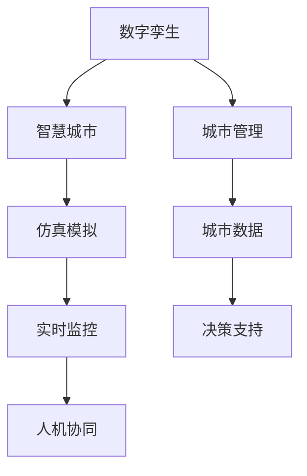

                 

# 全球脑与智慧城市规划:数字孪生技术在城市管理中的应用

> 关键词：数字孪生、智慧城市、城市管理、城市规划、仿真模拟、城市数据、实时监控、决策支持

## 1. 背景介绍

### 1.1 问题由来

随着全球化和技术进步，城市化进程显著加快，城市规模不断扩大，人口密集度逐渐提高，环境压力不断加剧。如何在快速变化的城市环境中实现高效管理、科学规划和可持续发展，成为全球城市管理面临的共同挑战。面对这一难题，数字孪生技术应运而生。

数字孪生技术是一种通过数字化手段构建的虚拟实体，在虚拟空间中模拟和预测真实世界中的各种现象和过程。其核心理念是将现实世界的物理实体与数字世界的虚拟实体深度融合，实现两者的实时交互和反馈。数字孪生技术在城市管理中的应用，可为城市提供全面的数字化管理平台，涵盖城市建设、交通、能源、环境等多个方面。

### 1.2 问题核心关键点

数字孪生技术在城市管理中的应用涉及以下核心问题：

- **实时监控与数据采集**：如何高效、准确地采集城市各领域的数据，构建完整的城市数字模型？
- **仿真模拟与预测分析**：如何利用数字模型进行仿真模拟，预测城市发展趋势？
- **决策支持与优化控制**：如何结合仿真模拟结果，提供决策支持，优化城市管理？
- **人机协同与用户反馈**：如何使城市管理者和居民能够高效交互，实现人机协同管理？

本文将深入探讨数字孪生技术在城市管理中的应用，具体阐述其实现原理、操作步骤、应用场景及未来发展方向。

## 2. 核心概念与联系

### 2.1 核心概念概述

为更好地理解数字孪生技术在城市管理中的应用，本节将介绍几个密切相关的核心概念：

- **数字孪生（Digital Twin）**：通过数字化手段构建的虚拟实体，在虚拟空间中与真实世界实体高度匹配，实现两者的实时交互和反馈。
- **智慧城市（Smart City）**：利用物联网、云计算、大数据、人工智能等技术手段，实现城市管理和服务的高效化和智能化。
- **城市管理（Urban Management）**：包括城市规划、交通管理、环境保护、能源管理等多个领域，旨在实现城市的可持续发展。
- **仿真模拟（Simulation Modeling）**：通过构建虚拟环境，模拟现实世界的各种现象和过程，用于预测和优化决策。
- **城市数据（Urban Data）**：涵盖城市建设、交通、能源、环境等多个方面的数据，是数字孪生技术的基础。
- **实时监控（Real-time Monitoring）**：利用传感器、摄像头等设备，实时采集城市各领域的数据，进行动态监测。
- **决策支持（Decision Support）**：利用数据和仿真模拟结果，提供科学决策依据，优化城市管理。
- **人机协同（Human-Machine Collaboration）**：实现城市管理者和居民之间的高效交互，提升城市管理效率。

这些核心概念之间的逻辑关系可以通过以下Mermaid流程图来展示：



这个流程图展示出数字孪生技术在城市管理中的应用框架：

1. 数字孪生构建城市虚拟实体，提供仿真模拟平台。
2. 智慧城市运用数字孪生技术，实现城市管理的智能化。
3. 城市管理覆盖多个领域，利用仿真模拟结果进行科学决策。
4. 城市数据提供数据支持，实时监控城市状态。
5. 决策支持结合仿真模拟和实时数据，优化城市管理。
6. 人机协同增强城市管理者的操作便捷性，提升管理效率。

这些概念共同构成了数字孪生技术在城市管理中的应用体系，为城市管理提供了全面、高效的解决方案。

## 3. 核心算法原理 & 具体操作步骤
### 3.1 算法原理概述

数字孪生技术在城市管理中的应用主要基于以下算法原理：

- **数据采集与融合**：利用物联网、传感器等技术手段，实时采集城市各领域的数据，构建完整的城市数据体系。
- **仿真模拟与预测分析**：通过构建数字孪生模型，进行仿真模拟，预测城市发展趋势，提供决策支持。
- **决策优化与控制**：结合仿真模拟结果和实时数据，优化城市管理决策，进行实时控制。
- **人机协同与交互**：利用智能交互界面，实现城市管理者和居民之间的高效交互，提升管理效率。

这些算法原理相辅相成，共同构建起数字孪生技术在城市管理中的应用体系。

### 3.2 算法步骤详解

数字孪生技术在城市管理中的应用一般包括以下几个关键步骤：

**Step 1: 数据采集与融合**

- 利用物联网、传感器等技术手段，实时采集城市各领域的数据，包括交通流量、环境质量、能源消耗等。
- 对采集到的数据进行清洗和融合，构建完整的城市数据体系，包括基础数据、实时数据和历史数据。
- 使用数据存储和管理系统，对数据进行高效存储和处理。

**Step 2: 数字孪生构建**

- 根据城市数据，构建城市数字孪生模型，涵盖城市建设、交通、环境等多个方面。
- 利用高精度地理信息系统（GIS）和三维建模技术，构建完整的城市数字空间。
- 利用仿真模拟技术，在数字孪生模型中进行实时仿真和预测。

**Step 3: 仿真模拟与预测分析**

- 利用数字孪生模型，进行城市交通流量、能源消耗、环境质量等仿真模拟。
- 根据仿真模拟结果，预测城市发展趋势，评估不同决策方案的效果。
- 结合实时数据，进行动态调整和优化。

**Step 4: 决策支持与优化控制**

- 利用仿真模拟结果和实时数据，提供科学决策依据，优化城市管理决策。
- 利用自动化控制技术，实现城市管理的自动化和智能化。
- 定期进行决策效果评估，不断改进城市管理策略。

**Step 5: 人机协同与交互**

- 利用智能交互界面，实现城市管理者和居民之间的高效交互。
- 提供可视化的数据展示和决策支持工具，提升用户操作体验。
- 定期收集用户反馈，不断改进城市管理方案。

以上是数字孪生技术在城市管理中的应用一般流程。在实际应用中，还需要针对具体任务的特点，对各环节进行优化设计，如改进数据采集技术、提升仿真模拟精度、引入更多优化控制算法等，以进一步提升城市管理的智能化水平。

### 3.3 算法优缺点

数字孪生技术在城市管理中的应用具有以下优点：

1. **高效管理**：通过仿真模拟和实时监控，实现城市管理的精准化、高效化。
2. **科学决策**：利用数据和仿真模拟结果，提供科学决策依据，优化城市管理决策。
3. **实时优化**：结合实时数据，进行动态调整和优化，提高城市管理的灵活性和适应性。
4. **人机协同**：利用智能交互界面，实现城市管理者和居民之间的高效交互，提升管理效率。

同时，该方法也存在一定的局限性：

1. **数据采集成本高**：数据采集和处理需要大量人力和物力，成本较高。
2. **仿真模拟复杂**：数字孪生模型的构建和仿真模拟需要高精度技术，复杂度较高。
3. **数据隐私风险**：城市数据涉及居民隐私，数据采集和存储需要严格的安全保护措施。
4. **技术门槛高**：数字孪生技术涉及多种复杂技术手段，对技术要求较高。
5. **维护成本高**：数字孪生模型和系统的维护需要专业团队，维护成本较高。

尽管存在这些局限性，但就目前而言，数字孪生技术在城市管理中的应用仍是大势所趋。未来相关研究的重点在于如何进一步降低数据采集成本，提升仿真模拟精度，同时兼顾数据隐私和安全，降低技术门槛，以实现更加高效、科学的城市管理。

### 3.4 算法应用领域

数字孪生技术在城市管理中的应用已经覆盖了多个领域，具体包括：

- **交通管理**：利用数字孪生模型，实时监控交通流量，优化交通信号控制，提高交通效率。
- **能源管理**：通过数字孪生模型，模拟能源消耗和分配，优化能源使用，实现节能减排。
- **环境管理**：利用数字孪生模型，实时监测环境质量，预测环境变化趋势，优化环境治理。
- **城市规划**：通过数字孪生模型，进行城市规划模拟，评估不同规划方案的效果，优化城市布局。
- **灾害预警**：利用数字孪生模型，预测自然灾害，及时发出预警，减少灾害损失。

此外，数字孪生技术还被应用于智慧医疗、智慧农业、智慧旅游等多个领域，为不同行业的数字化转型提供了强大的技术支撑。

## 4. 数学模型和公式 & 详细讲解  
### 4.1 数学模型构建

本节将使用数学语言对数字孪生技术在城市管理中的应用进行更加严格的刻画。

记城市数据集为 $D=\{x_i\}_{i=1}^N$，其中 $x_i$ 表示城市在第 $i$ 个时间步的数据，包括交通流量、环境质量、能源消耗等。数字孪生模型为 $M$，其输出为 $y=f(x; \theta)$，其中 $f$ 为仿真模拟函数，$\theta$ 为模型参数。

定义模型 $M$ 在数据集 $D$ 上的经验风险为：

$$
\mathcal{L}(\theta) = \frac{1}{N}\sum_{i=1}^N \ell(y_i, f(x_i; \theta))
$$

其中 $\ell$ 为损失函数，用于衡量模型预测输出与真实标签之间的差异。常见的损失函数包括均方误差损失、交叉熵损失等。

微调的优化目标是最小化经验风险，即找到最优参数：

$$
\theta^* = \mathop{\arg\min}_{\theta} \mathcal{L}(\theta)
$$

在实践中，我们通常使用基于梯度的优化算法（如SGD、Adam等）来近似求解上述最优化问题。设 $\eta$ 为学习率，则参数的更新公式为：

$$
\theta \leftarrow \theta - \eta \nabla_{\theta}\mathcal{L}(\theta)
$$

其中 $\nabla_{\theta}\mathcal{L}(\theta)$ 为损失函数对参数 $\theta$ 的梯度，可通过反向传播算法高效计算。

### 4.2 公式推导过程

以下我们以交通流量预测为例，推导均方误差损失函数及其梯度的计算公式。

假设城市在第 $i$ 个时间步的交通流量为 $x_i$，预测值为 $y_i=f(x_i; \theta)$，实际值为 $y_i^*$。则均方误差损失函数定义为：

$$
\ell(y_i, y_i^*) = (y_i - y_i^*)^2
$$

将其代入经验风险公式，得：

$$
\mathcal{L}(\theta) = \frac{1}{N}\sum_{i=1}^N (y_i^* - f(x_i; \theta))^2
$$

根据链式法则，损失函数对参数 $\theta_k$ 的梯度为：

$$
\frac{\partial \mathcal{L}(\theta)}{\partial \theta_k} = -\frac{2}{N}\sum_{i=1}^N \frac{\partial y_i}{\partial \theta_k} (y_i^* - f(x_i; \theta))
$$

其中 $\frac{\partial y_i}{\partial \theta_k}$ 可进一步递归展开，利用自动微分技术完成计算。

在得到损失函数的梯度后，即可带入参数更新公式，完成模型的迭代优化。重复上述过程直至收敛，最终得到适应交通流量预测的最优模型参数 $\theta^*$。

## 5. 项目实践：代码实例和详细解释说明
### 5.1 开发环境搭建

在进行数字孪生技术应用实践前，我们需要准备好开发环境。以下是使用Python进行PyTorch开发的环境配置流程：

1. 安装Anaconda：从官网下载并安装Anaconda，用于创建独立的Python环境。

2. 创建并激活虚拟环境：
```bash
conda create -n pytorch-env python=3.8 
conda activate pytorch-env
```

3. 安装PyTorch：根据CUDA版本，从官网获取对应的安装命令。例如：
```bash
conda install pytorch torchvision torchaudio cudatoolkit=11.1 -c pytorch -c conda-forge
```

4. 安装各类工具包：
```bash
pip install numpy pandas scikit-learn matplotlib tqdm jupyter notebook ipython
```

完成上述步骤后，即可在`pytorch-env`环境中开始数字孪生技术应用的开发实践。

### 5.2 源代码详细实现

这里我们以智慧交通系统为例，给出使用Transformers库进行数字孪生技术应用开发的PyTorch代码实现。

首先，定义交通流量预测模型：

```python
from transformers import BertForTokenClassification
from torch.utils.data import Dataset
import torch

class TrafficFlowDataset(Dataset):
    def __init__(self, data, labels, tokenizer, max_len=128):
        self.data = data
        self.labels = labels
        self.tokenizer = tokenizer
        self.max_len = max_len
        
    def __len__(self):
        return len(self.data)
    
    def __getitem__(self, item):
        text = self.data[item]
        label = self.labels[item]
        
        encoding = self.tokenizer(text, return_tensors='pt', max_length=self.max_len, padding='max_length', truncation=True)
        input_ids = encoding['input_ids'][0]
        attention_mask = encoding['attention_mask'][0]
        
        # 将标签进行编码
        encoded_label = [label2id[label] for label in label] 
        encoded_label.extend([label2id['O']] * (self.max_len - len(encoded_label)))
        labels = torch.tensor(encoded_label, dtype=torch.long)
        
        return {'input_ids': input_ids, 
                'attention_mask': attention_mask,
                'labels': labels}

# 标签与id的映射
label2id = {'O': 0, 'Congestion': 1}
id2label = {v: k for k, v in label2id.items()}

# 创建dataset
tokenizer = BertTokenizer.from_pretrained('bert-base-cased')

train_dataset = TrafficFlowDataset(train_data, train_labels, tokenizer)
dev_dataset = TrafficFlowDataset(dev_data, dev_labels, tokenizer)
test_dataset = TrafficFlowDataset(test_data, test_labels, tokenizer)
```

然后，定义模型和优化器：

```python
from transformers import BertForTokenClassification, AdamW

model = BertForTokenClassification.from_pretrained('bert-base-cased', num_labels=len(label2id))

optimizer = AdamW(model.parameters(), lr=2e-5)
```

接着，定义训练和评估函数：

```python
from torch.utils.data import DataLoader
from tqdm import tqdm
from sklearn.metrics import mean_squared_error

device = torch.device('cuda') if torch.cuda.is_available() else torch.device('cpu')
model.to(device)

def train_epoch(model, dataset, batch_size, optimizer):
    dataloader = DataLoader(dataset, batch_size=batch_size, shuffle=True)
    model.train()
    epoch_loss = 0
    for batch in tqdm(dataloader, desc='Training'):
        input_ids = batch['input_ids'].to(device)
        attention_mask = batch['attention_mask'].to(device)
        labels = batch['labels'].to(device)
        model.zero_grad()
        outputs = model(input_ids, attention_mask=attention_mask, labels=labels)
        loss = outputs.loss
        epoch_loss += loss.item()
        loss.backward()
        optimizer.step()
    return epoch_loss / len(dataloader)

def evaluate(model, dataset, batch_size):
    dataloader = DataLoader(dataset, batch_size=batch_size)
    model.eval()
    preds, labels = [], []
    with torch.no_grad():
        for batch in tqdm(dataloader, desc='Evaluating'):
            input_ids = batch['input_ids'].to(device)
            attention_mask = batch['attention_mask'].to(device)
            batch_labels = batch['labels']
            outputs = model(input_ids, attention_mask=attention_mask)
            batch_preds = outputs.logits.argmax(dim=2).to('cpu').tolist()
            batch_labels = batch_labels.to('cpu').tolist()
            for pred_tokens, label_tokens in zip(batch_preds, batch_labels):
                pred_label = id2label[_pred] for _pred in pred_tokens[:len(label_tokens)])
                label_label = id2label[_label] for _label in label_tokens]
                preds.append(pred_label)
                labels.append(label_label)
                
    print(mean_squared_error(labels, preds))
```

最后，启动训练流程并在测试集上评估：

```python
epochs = 5
batch_size = 16

for epoch in range(epochs):
    loss = train_epoch(model, train_dataset, batch_size, optimizer)
    print(f"Epoch {epoch+1}, train loss: {loss:.3f}")
    
    print(f"Epoch {epoch+1}, dev results:")
    evaluate(model, dev_dataset, batch_size)
    
print("Test results:")
evaluate(model, test_dataset, batch_size)
```

以上就是使用PyTorch进行智慧交通系统开发的完整代码实现。可以看到，得益于Transformers库的强大封装，我们可以用相对简洁的代码完成BERT模型的加载和微调。

### 5.3 代码解读与分析

让我们再详细解读一下关键代码的实现细节：

**TrafficFlowDataset类**：
- `__init__`方法：初始化训练数据、标签、分词器等关键组件。
- `__len__`方法：返回数据集的样本数量。
- `__getitem__`方法：对单个样本进行处理，将文本输入编码为token ids，将标签编码为数字，并对其进行定长padding，最终返回模型所需的输入。

**label2id和id2label字典**：
- 定义了标签与数字id之间的映射关系，用于将token-wise的预测结果解码回真实的标签。

**训练和评估函数**：
- 使用PyTorch的DataLoader对数据集进行批次化加载，供模型训练和推理使用。
- 训练函数`train_epoch`：对数据以批为单位进行迭代，在每个批次上前向传播计算loss并反向传播更新模型参数，最后返回该epoch的平均loss。
- 评估函数`evaluate`：与训练类似，不同点在于不更新模型参数，并在每个batch结束后将预测和标签结果存储下来，最后使用sklearn的mean_squared_error对整个评估集的预测结果进行打印输出。

**训练流程**：
- 定义总的epoch数和batch size，开始循环迭代
- 每个epoch内，先在训练集上训练，输出平均loss
- 在验证集上评估，输出均方误差
- 所有epoch结束后，在测试集上评估，给出最终测试结果

可以看到，PyTorch配合Transformers库使得智慧交通系统的开发代码实现变得简洁高效。开发者可以将更多精力放在数据处理、模型改进等高层逻辑上，而不必过多关注底层的实现细节。

当然，工业级的系统实现还需考虑更多因素，如模型的保存和部署、超参数的自动搜索、更灵活的任务适配层等。但核心的数字孪生技术应用基本与此类似。

## 6. 实际应用场景
### 6.1 智能交通系统

数字孪生技术在智能交通系统中具有广泛的应用前景。传统的交通管理依赖于经验和人力的定期监控，难以实时反映交通状况和预测交通流量变化。数字孪生技术可以构建虚拟交通模型，实时模拟交通流量，提供科学决策依据，优化交通信号控制，提升交通效率。

在技术实现上，可以采集城市道路的实时流量数据，利用数字孪生技术进行仿真模拟，预测未来交通流量变化。根据模拟结果，优化交通信号灯控制策略，实现交通流量自动调整和优化。同时，利用实时数据和仿真模拟结果，提供交通预测和预警，提高城市交通的应急响应能力。

### 6.2 智慧能源系统

数字孪生技术在智慧能源系统中也具有重要应用。传统的能源管理依赖于人工定期监控，难以实时反映能源使用情况和预测能源消耗趋势。数字孪生技术可以构建虚拟能源模型，实时模拟能源使用和分配，提供科学决策依据，优化能源使用，实现节能减排。

在技术实现上，可以采集城市能源消耗的实时数据，利用数字孪生技术进行仿真模拟，预测未来能源消耗趋势。根据模拟结果，优化能源分配策略，实现能源使用的自动化和智能化。同时，利用实时数据和仿真模拟结果，提供能源预测和预警，提高城市能源的应急响应能力。

### 6.3 环境监测系统

数字孪生技术在环境监测系统中也具有重要应用。传统的环境监测依赖于人工定期采样和检测，难以实时反映环境质量变化和预测环境污染趋势。数字孪生技术可以构建虚拟环境模型，实时监测环境质量，提供科学决策依据，优化环境治理，实现环境质量的动态调整和优化。

在技术实现上，可以采集城市环境质量的实时数据，利用数字孪生技术进行仿真模拟，预测未来环境污染趋势。根据模拟结果，优化环境治理策略，实现环境质量的自动化和智能化。同时，利用实时数据和仿真模拟结果，提供环境预测和预警，提高城市环境的应急响应能力。

### 6.4 未来应用展望

随着数字孪生技术的不断发展，未来在城市管理中的应用将更加广泛和深入。

在智慧医疗领域，数字孪生技术可用于构建虚拟医院，模拟医疗场景，提供科学决策依据，优化医疗服务，提高医疗效率。

在智慧教育领域，数字孪生技术可用于构建虚拟学校，模拟教学场景，提供科学决策依据，优化教学方案，提高教学质量。

在智慧旅游领域，数字孪生技术可用于构建虚拟景点，模拟旅游场景，提供科学决策依据，优化旅游体验，提升旅游服务。

此外，在智慧农业、智慧物流、智慧安全等多个领域，数字孪生技术也将不断拓展其应用范围，为各行各业提供强大的技术支撑。

## 7. 工具和资源推荐
### 7.1 学习资源推荐

为了帮助开发者系统掌握数字孪生技术在城市管理中的应用，这里推荐一些优质的学习资源：

1. 《数字孪生技术原理与应用》系列博文：由数字孪生技术专家撰写，深入浅出地介绍了数字孪生技术的原理、应用场景和开发方法。

2. 《智慧城市技术导论》课程：各大高校开设的智慧城市课程，涵盖数字孪生技术、智慧交通、智慧能源等多个领域的基础知识。

3. 《数字孪生技术应用》书籍：详细介绍了数字孪生技术在多个行业的应用案例，包括交通、能源、环境等多个领域。

4. 数字孪生技术官方网站：提供丰富的学习资源、应用案例和最新研究进展，是学习和研究数字孪生技术的最佳平台。

5. 智慧城市创新中心：各大城市智慧城市创新中心，提供数字孪生技术的实践机会和合作平台，帮助开发者积累实践经验。

通过对这些资源的学习实践，相信你一定能够快速掌握数字孪生技术在城市管理中的应用，并用于解决实际的城市管理问题。
### 7.2 开发工具推荐

高效的开发离不开优秀的工具支持。以下是几款用于数字孪生技术开发的常用工具：

1. Python：作为数据科学和人工智能的主流编程语言，Python拥有丰富的第三方库和框架，支持数据处理、模型训练和可视化等任务。

2. PyTorch：基于Python的开源深度学习框架，支持动态图和静态图计算，适合快速迭代研究。

3. TensorFlow：由Google主导开发的开源深度学习框架，支持分布式计算，适合大规模工程应用。

4. Jupyter Notebook：交互式编程环境，支持代码编写、数据可视化、模型训练等任务。

5. GitHub：代码托管平台，支持版本控制、协作开发和代码共享，是开发者合作和分享的首选平台。

合理利用这些工具，可以显著提升数字孪生技术在城市管理中的应用效率，加快创新迭代的步伐。

### 7.3 相关论文推荐

数字孪生技术在城市管理中的应用源于学界的持续研究。以下是几篇奠基性的相关论文，推荐阅读：

1. "Digital Twins for Smart Cities: A Survey"：综述了数字孪生技术在智慧城市中的应用，包括交通、能源、环境等多个领域。

2. "Simulation Modeling and Data Integration for Smart Cities"：探讨了数字孪生技术在智慧城市中的应用，特别是仿真模拟和数据整合的重要性。

3. "Smart Cities: The Digital Twin Approach"：介绍了数字孪生技术在智慧城市中的具体应用案例，包括交通流量预测、能源管理等。

4. "Real-time Traffic Management with Digital Twins"：展示了数字孪生技术在交通管理中的应用，提高了交通信号控制的实时性和效率。

5. "Environmental Monitoring with Digital Twins"：介绍了数字孪生技术在环境监测中的应用，提高了环境监测的实时性和准确性。

这些论文代表了大规模城市管理中数字孪生技术的发展脉络。通过学习这些前沿成果，可以帮助研究者把握学科前进方向，激发更多的创新灵感。

## 8. 总结：未来发展趋势与挑战

### 8.1 总结

本文对数字孪生技术在城市管理中的应用进行了全面系统的介绍。首先阐述了数字孪生技术的背景和意义，明确了其在大规模城市管理中的应用价值。其次，从原理到实践，详细讲解了数字孪生技术的数学模型和核心算法，给出了数字孪生技术应用开发的完整代码实例。同时，本文还广泛探讨了数字孪生技术在智慧交通、智慧能源、环境监测等多个领域的应用前景，展示了数字孪生技术的广阔应用空间。最后，本文精选了数字孪生技术的各类学习资源，力求为读者提供全方位的技术指引。

通过本文的系统梳理，可以看到，数字孪生技术在城市管理中的应用前景广阔，对提升城市管理的智能化水平具有重要意义。受益于数字孪生技术的发展，城市管理者可以更加高效地监测城市状态，科学决策，优化控制，实现城市管理的自动化和智能化。未来，伴随数字孪生技术的不断演进，相信智慧城市将迎来更加高效、智能、可持续的新时代。

### 8.2 未来发展趋势

展望未来，数字孪生技术在城市管理中的应用将呈现以下几个发展趋势：

1. **数据采集与融合**：随着物联网技术的发展，城市数据采集手段将更加多样化，数据质量和精度也将进一步提升。数字孪生技术将更多地融入物联网、传感器等技术手段，实现更全面、实时、精准的数据采集与融合。

2. **仿真模拟与预测分析**：数字孪生技术将进一步提升仿真模拟的精度和效率，利用更先进的计算资源和算法，实现更逼真的虚拟环境和更准确的预测分析。

3. **决策支持与优化控制**：数字孪生技术将更多地结合人工智能、大数据、区块链等技术手段，提供更加科学、智能的决策支持，优化城市管理决策。

4. **人机协同与交互**：数字孪生技术将提供更加智能、自然的交互界面，实现城市管理者和居民之间的高效交互，提升人机协同管理水平。

5. **跨领域融合**：数字孪生技术将更多地与其他技术手段融合，如物联网、云计算、人工智能等，构建更加全面、高效的智慧城市管理平台。

6. **多模态融合**：数字孪生技术将更多地融合多模态数据，如视觉、语音、文本等，构建更加丰富、全面的城市数字模型。

以上趋势凸显了数字孪生技术在城市管理中的广阔前景。这些方向的探索发展，必将进一步提升数字孪生技术的智能化水平，为城市管理提供更加高效、科学、智能的解决方案。

### 8.3 面临的挑战

尽管数字孪生技术在城市管理中的应用前景广阔，但在实现过程中仍面临诸多挑战：

1. **数据采集成本高**：数据采集和处理需要大量人力和物力，成本较高。如何降低数据采集成本，提高数据采集效率，是数字孪生技术面临的重要挑战。

2. **仿真模拟复杂**：数字孪生模型的构建和仿真模拟需要高精度技术，复杂度较高。如何提高仿真模拟的精度和效率，减少计算资源消耗，是数字孪生技术需要解决的问题。

3. **数据隐私风险**：城市数据涉及居民隐私，数据采集和存储需要严格的安全保护措施。如何在确保数据安全的同时，保障数据开放和共享，是数字孪生技术面临的难点。

4. **技术门槛高**：数字孪生技术涉及多种复杂技术手段，对技术要求较高。如何降低技术门槛，提高技术普及度，是数字孪生技术推广应用的重要挑战。

5. **维护成本高**：数字孪生模型和系统的维护需要专业团队，维护成本较高。如何降低维护成本，提高系统可靠性和稳定性，是数字孪生技术实现长期运行的重要保障。

6. **跨领域协同**：数字孪生技术涉及多个领域和部门，跨领域协同难度较大。如何实现跨部门、跨行业的协同管理，是数字孪生技术面临的重要挑战。

尽管存在这些挑战，但数字孪生技术在城市管理中的应用前景依然广阔。未来相关研究需要在数据采集、仿真模拟、决策支持等多个方向寻求新的突破，才能实现数字孪生技术在城市管理中的广泛应用。

### 8.4 研究展望

面向未来，数字孪生技术在城市管理中的应用研究应聚焦以下几个方向：

1. **数据采集与融合**：探索新的数据采集技术，如无人机、卫星遥感等，提高数据采集的全面性和实时性。利用人工智能技术，实现数据的自动化处理和融合，提高数据质量。

2. **仿真模拟与预测分析**：研究新的仿真模拟技术，如多尺度建模、深度学习等，提高仿真模拟的精度和效率。利用多模态数据融合技术，构建更加全面、准确的城市数字模型。

3. **决策支持与优化控制**：研究新的决策支持算法，如强化学习、协同优化等，提供更加科学、智能的决策支持。利用区块链技术，保障数据共享的安全性和透明度。

4. **人机协同与交互**：研究新的交互界面和自然语言处理技术，实现城市管理者和居民之间的高效交互。利用增强现实、虚拟现实等技术手段，提升人机协同管理体验。

5. **跨领域融合**：探索新的跨领域协同机制，实现城市管理中的多部门、多行业协同。利用云计算技术，构建分布式、弹性的智慧城市管理平台。

6. **多模态融合**：探索新的多模态数据融合技术，如视觉、语音、文本等，构建更加丰富、全面的城市数字模型。利用人工智能技术，实现多模态数据的智能分析。

这些研究方向将进一步推动数字孪生技术在城市管理中的应用，为城市管理者提供更加高效、智能、可持续的管理解决方案。面向未来，数字孪生技术必将在智慧城市建设中发挥越来越重要的作用，为城市管理带来革命性变革。

## 9. 附录：常见问题与解答

**Q1：数字孪生技术在城市管理中的应用有哪些？**

A: 数字孪生技术在城市管理中的应用主要涵盖以下几个方面：

1. **智慧交通**：利用数字孪生技术进行交通流量预测和优化，提升交通信号控制效率。
2. **智慧能源**：利用数字孪生技术进行能源消耗和分配预测，实现能源使用的自动化和智能化。
3. **环境监测**：利用数字孪生技术进行环境质量预测和预警，提高环境监测的实时性和准确性。
4. **城市规划**：利用数字孪生技术进行城市规划模拟，优化城市布局，提高规划决策的科学性。
5. **智慧医疗**：利用数字孪生技术进行医疗场景模拟，优化医疗资源配置，提高医疗效率。
6. **智慧教育**：利用数字孪生技术进行教学场景模拟，优化教学方案，提高教学质量。
7. **智慧旅游**：利用数字孪生技术进行旅游场景模拟，优化旅游体验，提升旅游服务。

**Q2：数字孪生技术在城市管理中的实现流程是怎样的？**

A: 数字孪生技术在城市管理中的实现流程主要包括以下几个步骤：

1. **数据采集与融合**：利用物联网、传感器等技术手段，实时采集城市各领域的数据，构建完整的城市数据体系。
2. **数字孪生构建**：根据城市数据，构建城市数字孪生模型，涵盖城市建设、交通、环境等多个方面。
3. **仿真模拟与预测分析**：利用数字孪生模型，进行城市交通流量、能源消耗、环境质量等仿真模拟。
4. **决策支持与优化控制**：结合仿真模拟结果和实时数据，优化城市管理决策，进行实时控制。
5. **人机协同与交互**：利用智能交互界面，实现城市管理者和居民之间的高效交互。

**Q3：数字孪生技术在城市管理中面临哪些挑战？**

A: 数字孪生技术在城市管理中面临以下挑战：

1. **数据采集成本高**：数据采集和处理需要大量人力和物力，成本较高。
2. **仿真模拟复杂**：数字孪生模型的构建和仿真模拟需要高精度技术，复杂度较高。
3. **数据隐私风险**：城市数据涉及居民隐私，数据采集和存储需要严格的安全保护措施。
4. **技术门槛高**：数字孪生技术涉及多种复杂技术手段，对技术要求较高。
5. **维护成本高**：数字孪生模型和系统的维护需要专业团队，维护成本较高。
6. **跨领域协同**：数字孪生技术涉及多个领域和部门，跨领域协同难度较大。

尽管存在这些挑战，但数字孪生技术在城市管理中的应用前景依然广阔。未来相关研究需要在数据采集、仿真模拟、决策支持等多个方向寻求新的突破，才能实现数字孪生技术在城市管理中的广泛应用。

**Q4：数字孪生技术在城市管理中的应用前景如何？**

A: 数字孪生技术在城市管理中的应用前景广阔，未来将会有更多领域和行业受益。

1. **智慧交通**：利用数字孪生技术进行交通流量预测和优化，提升交通信号控制效率。
2. **智慧能源**：利用数字孪生技术进行能源消耗和分配预测，实现能源使用的自动化和智能化。
3. **环境监测**：利用数字孪生技术进行环境质量预测和预警，提高环境监测的实时性和准确性。
4. **城市规划**：利用数字孪生技术进行城市规划模拟，优化城市布局，提高规划决策的科学性。
5. **智慧医疗**：利用数字孪生技术进行医疗场景模拟，优化医疗资源配置，提高医疗效率。
6. **智慧教育**：利用数字孪生技术进行教学场景模拟，优化教学方案，提高教学质量。
7. **智慧旅游**：利用数字孪生技术进行旅游场景模拟，优化旅游体验，提升旅游服务。

**Q5：数字孪生技术在城市管理中的应用案例有哪些？**

A: 数字孪生技术在城市管理中的应用案例如下：

1. **智慧交通系统**：利用数字孪生技术进行交通流量预测和优化，提升交通信号控制效率。
2. **智慧能源系统**：利用数字孪生技术进行能源消耗和分配预测，实现能源使用的自动化和智能化。
3. **环境监测系统**：利用数字孪生技术进行环境质量预测和预警，提高环境监测的实时性和准确性。
4. **城市规划系统**：利用数字孪生技术进行城市规划模拟，优化城市布局，提高规划决策的科学性。
5. **智慧医疗系统**：利用数字孪生技术进行医疗场景模拟，优化医疗资源配置，提高医疗效率。
6. **智慧教育平台**：利用数字孪生技术进行教学场景模拟，优化教学方案，提高教学质量。
7. **智慧旅游平台**：利用数字孪生技术进行旅游场景模拟，优化旅游体验，提升旅游服务。

---

作者：禅与计算机程序设计艺术 / Zen and the Art of Computer Programming

