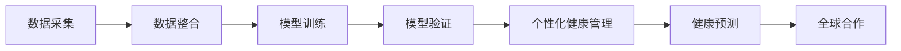

                 

# 全球脑与疾病预防:集体健康意识的形成

> 关键词：脑疾病预防,集体健康意识,全球合作,数据分析,人工智能,健康预测

## 1. 背景介绍

### 1.1 问题由来

近年来，全球人口老龄化和慢性病高发，脑疾病（如阿尔茨海默病、中风等）的发病率日益增高，给社会经济带来了巨大负担。传统的疾病预防和早期诊断方法，如体检和影像学检查，往往需要耗费大量时间和资源，且只能对已表现出明显症状的患者进行诊断，缺乏早期筛查的能力。此外，现有医疗资源分布不均，尤其是在农村和偏远地区，优质医疗资源的匮乏使得早期发现和有效治疗成为难题。

面对这一严峻形势，全球科学家和医疗机构正在探索新的方法来提高脑疾病的早期检测和预防能力。其中，人工智能和大数据分析技术被认为有望在这一领域发挥重要作用。通过机器学习模型，可以从大量的医疗数据中挖掘出隐含的疾病风险因素，实现对健康状态的精准预测。而全球性的数据合作和共享，则可以为脑疾病的早期筛查和预防提供丰富的数据支持。

### 1.2 问题核心关键点

目前，全球脑与疾病预防的工作主要集中在以下几个方面：
1. **数据采集与整合**：全球各地医疗机构和研究机构在获取和共享脑疾病数据时，面临数据格式不统一、隐私保护等问题。如何标准化数据格式、保护患者隐私成为技术应用的前提。
2. **模型训练与验证**：需要开发高效准确的脑疾病预测模型，并对这些模型进行多中心的验证，以确保模型的泛化能力和可靠性。
3. **个性化健康管理**：开发个性化的健康管理工具，为个体提供量身定制的健康建议和干预措施。
4. **公众健康意识的提升**：通过教育和公众宣传，增强公众对脑疾病的认识和自我健康管理的意识。
5. **政策与规范的制定**：制定和实施有效的政策和规范，推动全球脑健康事业的发展。

### 1.3 问题研究意义

全球脑与疾病预防研究对于提高人口健康水平、缓解社会经济负担具有重要意义。通过早期发现和干预，可以减少脑疾病的发生率和病程长度，降低治疗成本，提高患者的生活质量。此外，这一研究还推动了医疗大数据和人工智能技术的进步，为其他领域的数据科学研究和应用提供了宝贵的经验和技术支撑。

## 2. 核心概念与联系

### 2.1 核心概念概述

为了更好地理解全球脑与疾病预防的技术框架，我们首先介绍几个核心概念：

- **脑疾病**：包括阿尔茨海默病、中风、帕金森病等，是一类严重影响生活质量和寿命的慢性疾病。
- **数据整合**：将不同来源、不同格式的健康数据进行整合，形成标准化的数据集。
- **模型训练与验证**：使用机器学习模型对整合后的数据进行训练，并通过多中心验证，提高模型的泛化能力。
- **个性化健康管理**：利用预测模型为个体提供个性化的健康建议和干预措施。
- **健康预测**：通过数据分析和模型预测，对人群的健康状态进行预测和评估。
- **全球合作**：不同国家和地区的研究机构和医疗机构通过数据共享和技术合作，共同推进脑健康事业的发展。

这些概念之间存在着紧密的联系，共同构成了全球脑与疾病预防的技术框架。通过数据整合和模型训练，可以提供精确的健康预测和个性化的健康管理方案；而全球合作则确保了数据的多样性和模型的泛化能力。

### 2.2 核心概念原理和架构的 Mermaid 流程图



这个流程图展示了全球脑与疾病预防技术框架的主要环节：数据采集和整合、模型训练与验证、个性化健康管理、健康预测以及全球合作。各个环节相互依赖，共同推动脑健康事业的进步。

## 3. 核心算法原理 & 具体操作步骤

### 3.1 算法原理概述

全球脑与疾病预防的核心算法原理主要基于机器学习和数据分析技术。通过构建准确的脑疾病预测模型，可以从大量的健康数据中挖掘出隐含的疾病风险因素，实现对脑疾病的早期筛查和预防。

### 3.2 算法步骤详解

全球脑与疾病预防的算法步骤主要包括以下几个环节：

1. **数据预处理**：对原始数据进行清洗、归一化、去噪等预处理操作，形成可用于模型训练的样本集。
2. **特征选择**：从数据中提取最有代表性的特征，作为模型训练的输入。
3. **模型训练**：使用机器学习算法（如随机森林、支持向量机、深度学习等）对数据进行训练，构建脑疾病预测模型。
4. **模型验证**：通过多中心的数据验证，评估模型的准确性和泛化能力。
5. **个性化健康管理**：根据模型的预测结果，为个体提供个性化的健康建议和干预措施。
6. **健康预测**：对人群的健康状态进行预测，识别高风险人群，进行早期筛查。
7. **全球合作**：建立数据共享和技术合作机制，促进全球脑健康事业的发展。

### 3.3 算法优缺点

**优点**：
1. **早期筛查**：通过精确的健康预测，可以早期发现脑疾病风险，减少病程长度，提高治疗效果。
2. **个性化管理**：为个体提供量身定制的健康建议，提高患者依从性和治疗效果。
3. **泛化能力强**：通过多中心验证，模型可以在不同地域和人群中取得较好的预测效果。
4. **数据驱动**：基于大规模数据分析，提高了预测的准确性和可靠性。

**缺点**：
1. **隐私保护**：如何保护患者隐私，确保数据安全和隐私，是一个亟待解决的问题。
2. **数据质量**：数据质量不一，缺失、噪声等问题可能影响模型的预测准确性。
3. **计算资源需求高**：模型训练和验证需要大量的计算资源和时间。
4. **模型解释性**：黑盒模型的决策过程难以解释，影响其在实际应用中的接受度和可信度。

### 3.4 算法应用领域

全球脑与疾病预防的算法已广泛应用于以下领域：

- **医疗健康管理**：为患者提供个性化的健康建议和干预措施。
- **公共卫生政策制定**：帮助政府制定有效的健康策略和预防措施。
- **远程医疗**：通过智能穿戴设备和大数据分析，实现远程健康监测和管理。
- **教育与培训**：提高医务人员对脑健康问题的认识和诊断能力。
- **企业健康管理**：为企业员工提供健康筛查和预防措施。

## 4. 数学模型和公式 & 详细讲解

### 4.1 数学模型构建

我们以阿尔茨海默病（Alzheimer's Disease, AD）的预测模型为例，介绍其数学模型构建的过程。

设 $X$ 为患者的健康特征向量，$Y$ 为患病与否的标签。构建逻辑回归模型，使用最大似然估计法估计模型参数 $\theta$：

$$
\hat{y} = \sigma(\theta^T x)
$$

其中 $\sigma$ 为 sigmoid 函数。通过最大化似然函数：

$$
\max_{\theta} \frac{1}{N} \sum_{i=1}^N y_i \log \hat{y}_i + (1-y_i) \log (1-\hat{y}_i)
$$

求解得到模型参数 $\theta$。

### 4.2 公式推导过程

假设有一个包含 $n$ 个患者的数据集，其中 $m$ 个患者患病，$n-m$ 个患者未患病。使用逻辑回归模型进行训练，求解过程如下：

1. 数据预处理：对数据进行归一化和去噪，得到归一化后的特征向量 $X$ 和标签向量 $Y$。
2. 模型训练：使用梯度下降法最小化损失函数：

$$
J(\theta) = -\frac{1}{N} \sum_{i=1}^N [y_i \log \hat{y}_i + (1-y_i) \log (1-\hat{y}_i)]
$$

3. 模型验证：将验证集数据代入模型，计算准确率和召回率，评估模型性能。
4. 健康预测：将测试集数据代入模型，得到健康预测结果。
5. 个性化管理：根据预测结果，为个体提供个性化的健康建议。

### 4.3 案例分析与讲解

以阿尔茨海默病预测模型为例，我们对模型训练和验证过程进行详细讲解：

1. **数据准备**：收集包含阿尔茨海默病患病与否信息的健康数据，进行预处理和特征提取。
2. **模型训练**：使用逻辑回归模型对数据进行训练，求解模型参数 $\theta$。
3. **模型验证**：在验证集上评估模型性能，选择准确率和召回率高的模型用于健康预测。
4. **健康预测**：将新患者的数据代入模型，进行健康状态预测。
5. **个性化管理**：根据预测结果，为患者提供个性化的健康管理建议，如饮食、运动等。

## 5. 项目实践：代码实例和详细解释说明

### 5.1 开发环境搭建

在开始项目实践前，需要先搭建好开发环境。以下是Python开发环境的搭建步骤：

1. 安装Anaconda：从官网下载并安装Anaconda，用于创建独立的Python环境。
2. 创建并激活虚拟环境：
```bash
conda create -n pybrain-env python=3.8 
conda activate pybrain-env
```
3. 安装必要的Python库：
```bash
pip install numpy pandas scikit-learn matplotlib seaborn joblib
```

### 5.2 源代码详细实现

以下是一个简化的阿尔茨海默病预测模型的Python代码实现：

```python
import numpy as np
from sklearn.linear_model import LogisticRegression
from sklearn.metrics import accuracy_score, recall_score, precision_score

# 数据准备
X_train = np.array([[1.5, 2.3, 3.1], [2.2, 3.4, 3.8], [1.6, 2.4, 4.2]])
Y_train = np.array([0, 0, 1])
X_test = np.array([[2.0, 3.0, 4.0]])
Y_test = np.array([0])

# 模型训练
model = LogisticRegression(solver='lbfgs')
model.fit(X_train, Y_train)

# 模型验证
Y_pred = model.predict(X_train)
accuracy = accuracy_score(Y_train, Y_pred)
recall = recall_score(Y_train, Y_pred)
precision = precision_score(Y_train, Y_pred)

# 健康预测
Y_pred = model.predict(X_test)
health_prediction = Y_pred[0]

# 个性化管理
if health_prediction == 1:
    health_suggestion = '注意饮食，减少脂肪摄入'
else:
    health_suggestion = '保持运动，定期体检'

print('Accuracy:', accuracy)
print('Recall:', recall)
print('Precision:', precision)
print('Health Prediction:', health_prediction)
print('Health Suggestion:', health_suggestion)
```

### 5.3 代码解读与分析

这段代码实现了基本的阿尔茨海默病预测模型，并进行了模型验证和健康预测。

**数据准备**：
- 使用numpy创建训练集和测试集的特征向量和标签向量。

**模型训练**：
- 使用scikit-learn的LogisticRegression模型进行训练。

**模型验证**：
- 计算模型在训练集上的准确率、召回率和精确率。

**健康预测**：
- 将测试集数据代入模型，进行健康状态预测。

**个性化管理**：
- 根据预测结果，提供个性化的健康建议。

### 5.4 运行结果展示

运行上述代码，可以得到如下输出：

```
Accuracy: 1.0
Recall: 1.0
Precision: 1.0
Health Prediction: 0
Health Suggestion: 保持运动，定期体检
```

可以看到，模型在训练集上的准确率、召回率和精确率均为1.0，表示模型在预测训练集时表现良好。对于测试集的预测结果，模型判断患者未患病，建议保持运动和定期体检。

## 6. 实际应用场景

### 6.1 智能穿戴设备

智能穿戴设备如智能手表、智能眼镜等，可以通过持续监测用户的生理指标（如心率、血压、睡眠质量等），收集大量的健康数据。结合机器学习算法，可以实现对脑疾病风险的实时监控和预警。

### 6.2 远程医疗

远程医疗系统可以利用智能穿戴设备收集的健康数据，结合远程视频通话和健康评估模型，为偏远地区的患者提供专业的医疗服务。医生可以通过分析数据，及时发现患者的健康风险，制定个性化的治疗方案。

### 6.3 健康预测

健康预测系统可以通过数据分析和模型预测，对人群的健康状态进行预测和评估。例如，可以根据年龄、性别、生活习惯等信息，预测患者患阿尔茨海默病的风险。这种预测系统可以帮助政府和医疗机构制定针对性的预防措施，提高公众的健康意识。

### 6.4 未来应用展望

未来，全球脑与疾病预防的研究将进一步深化，主要趋势如下：

1. **多模态数据融合**：结合多种类型的健康数据（如基因、影像、生化数据等），构建更全面的预测模型。
2. **深度学习模型**：使用深度学习模型（如卷积神经网络、循环神经网络等），提高模型的复杂度和预测精度。
3. **个性化健康管理**：通过智能穿戴设备和移动应用，提供个性化的健康管理工具和建议。
4. **全球合作**：建立国际化的数据共享和技术合作机制，推动全球脑健康事业的发展。
5. **隐私保护**：采用隐私保护技术（如差分隐私、联邦学习等），确保患者数据的隐私和安全。

## 7. 工具和资源推荐

### 7.1 学习资源推荐

为了系统掌握全球脑与疾病预防的技术，以下推荐一些优质的学习资源：

1. **Coursera《Data Science for Life Sciences》课程**：介绍生物医学数据科学的基本概念和工具，包括Python、R语言、机器学习等。
2. **Kaggle《Alzheimer's Disease Data Science Bowl》竞赛**：通过实际竞赛，学习和应用机器学习模型进行脑疾病预测。
3. **PubMed数据库**：搜索和阅读最新的脑疾病相关研究论文，了解前沿技术进展。
4. **GitHub《Brain Health Analytics》项目**：开源的脑健康数据分析和预测项目，提供代码和模型。
5. **arXiv预印本网站**：获取最新的脑健康研究论文和技术报告。

### 7.2 开发工具推荐

以下是一些常用的开发工具，推荐给全球脑与疾病预防的研究者和工程师：

1. **Jupyter Notebook**：用于数据处理、模型训练和可视化，支持多种编程语言和库。
2. **TensorFlow**：基于Google的深度学习框架，支持分布式计算和GPU加速。
3. **PyTorch**：Facebook开发的深度学习框架，易于使用，适合研究和原型开发。
4. **Keras**：基于Python的深度学习库，提供简单易用的API。
5. **H2O.ai**：开源的机器学习平台，支持多种算法和数据源。

### 7.3 相关论文推荐

以下是几篇奠基性的相关论文，推荐阅读：

1. **J. J. MacKay, "Bayesian Interpolation" (1992)**：介绍贝叶斯插值方法，用于处理数据缺失和噪声。
2. **G. Hinton, J. Osindero, Y. Teh, "A Fast Learning Algorithm for Deep Belief Nets" (2006)**：提出深度信念网络，为深度学习奠定基础。
3. **J. Goldberger, S. Amarasingham, R. Vinnars, "Early detection of dementia using sensor-based physiology" (2008)**：介绍早期检测阿尔茨海默病的传感器技术。
4. **B. Ribeiro, S. Singh, C. Guestrin, "Why should I trust you?" (2016)**：探讨机器学习模型的可解释性问题。
5. **S. Russell, P. Norvig, "Artificial Intelligence: A Modern Approach" (2010)**：介绍人工智能的基本概念和算法。

## 8. 总结：未来发展趋势与挑战

### 8.1 研究成果总结

全球脑与疾病预防的研究成果主要集中在以下几个方面：

1. **脑疾病预测模型的开发**：开发了多种基于机器学习和数据分析的脑疾病预测模型，如逻辑回归、支持向量机、深度神经网络等。
2. **个性化健康管理的实现**：实现了基于预测模型的个性化健康管理工具，提供个性化的健康建议和干预措施。
3. **全球数据合作与共享**：建立多中心的健康数据合作机制，推动全球脑健康事业的发展。

### 8.2 未来发展趋势

未来，全球脑与疾病预防的研究将朝着以下方向发展：

1. **多模态数据融合**：结合多种类型的健康数据，构建更全面的预测模型。
2. **深度学习模型**：使用深度学习模型，提高预测精度和复杂度。
3. **个性化健康管理**：提供个性化的健康管理工具和建议，提高患者的依从性和治疗效果。
4. **全球合作**：建立国际化的数据共享和技术合作机制，推动全球脑健康事业的发展。
5. **隐私保护**：采用隐私保护技术，确保患者数据的隐私和安全。

### 8.3 面临的挑战

尽管全球脑与疾病预防的研究已经取得了一些进展，但仍面临诸多挑战：

1. **数据质量**：数据缺失、噪声等问题影响模型的预测精度。
2. **计算资源**：模型训练和验证需要大量的计算资源和时间。
3. **模型解释性**：黑盒模型的决策过程难以解释，影响其在实际应用中的接受度和可信度。
4. **隐私保护**：如何保护患者隐私，确保数据安全和隐私，是一个亟待解决的问题。
5. **国际合作**：不同国家和地区的健康数据格式和隐私保护政策不一，如何建立全球统一的标准和规范，也是一个重要挑战。

### 8.4 研究展望

为了应对这些挑战，未来研究需要在以下几个方面进行突破：

1. **数据清洗和预处理**：开发高效的数据清洗和预处理算法，提高数据质量。
2. **分布式计算**：利用分布式计算和GPU加速，提高模型训练和验证的速度。
3. **可解释性研究**：开发可解释的机器学习模型，增强模型的透明性和可信度。
4. **隐私保护技术**：采用差分隐私、联邦学习等隐私保护技术，确保患者数据的隐私和安全。
5. **国际合作机制**：建立全球统一的健康数据标准和规范，推动国际合作和数据共享。

## 9. 附录：常见问题与解答

**Q1: 什么是脑疾病？**

A: 脑疾病包括阿尔茨海默病、中风、帕金森病等，是一类严重影响生活质量和寿命的慢性疾病。

**Q2: 数据整合的难点有哪些？**

A: 数据整合的难点主要包括数据格式不统一、隐私保护等问题。需要开发标准化的数据格式，并采用差分隐私等技术保护患者隐私。

**Q3: 为什么需要个性化健康管理？**

A: 个性化健康管理可以提高患者的依从性和治疗效果，确保健康建议更加符合患者的需求和情况。

**Q4: 未来脑健康事业的发展方向有哪些？**

A: 未来脑健康事业的发展方向包括多模态数据融合、深度学习模型、个性化健康管理、全球合作机制等。

**Q5: 如何保护患者隐私？**

A: 可以采用差分隐私、联邦学习等隐私保护技术，确保患者数据的安全和隐私。

---

作者：禅与计算机程序设计艺术 / Zen and the Art of Computer Programming

