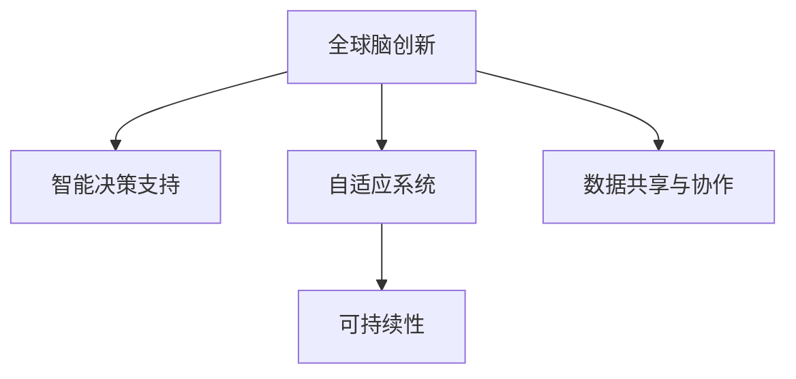

                 

## 1. 背景介绍

### 1.1 问题由来

随着人工智能技术的飞速发展，全球脑（Global Brain）这一概念逐渐进入公众视野。其核心思想是，将人类大脑类比为全球计算机网络，通过数据和计算能力的指数级增长，实现全球信息共享与协作，加速解决复杂问题，推动社会进步。全球脑创新（Global Brain Innovation）正是基于这一理念，致力于构建一个智能化、自动化、自适应的人类社会。

### 1.2 问题核心关键点

全球脑创新主要涉及以下几个核心问题：

- **数据共享与协作**：构建全球数据共享平台，促进不同地区、不同组织之间的信息流通和协作。
- **智能决策支持**：利用人工智能技术，提供精准的决策建议和方案，辅助人类进行复杂决策。
- **自适应系统**：构建具备自我学习和适应的系统，能够根据环境和需求的变化，动态调整策略和行为。
- **可持续性与伦理**：保证全球脑创新系统的可扩展性和鲁棒性，同时确保数据隐私、伦理与安全。

### 1.3 问题研究意义

全球脑创新旨在将人工智能与全球化深度融合，利用先进的技术手段，解决人类面临的共同问题，提升全球协作效率，促进可持续发展和创新。其主要意义在于：

1. **提升问题解决效率**：通过全球范围的协作和资源共享，加速复杂问题的解决，提高全球问题应对的速度和质量。
2. **促进知识创新与传播**：加速新知识、新技术的生成与传播，推动科学研究和技术进步，加速知识迭代。
3. **推动经济与社会进步**：通过智能决策支持，优化资源配置，提高经济效率，促进社会公平与可持续发展。
4. **提升国际合作水平**：提供跨国的协作平台，促进国际合作，应对全球性挑战，如气候变化、疫情管理等。

## 2. 核心概念与联系

### 2.1 核心概念概述

为了更好地理解全球脑创新的基本框架和关键技术，本节将介绍几个核心概念：

- **全球脑（Global Brain）**：将人类大脑类比为全球计算机网络，通过数据和计算能力的指数级增长，实现全球信息共享与协作。
- **全球脑创新（Global Brain Innovation）**：构建智能化、自动化、自适应的人类社会，通过人工智能技术解决复杂问题，加速社会进步。
- **智能决策支持系统（Intelligent Decision Support Systems）**：利用人工智能技术，提供精准的决策建议和方案，辅助人类进行复杂决策。
- **自适应系统（Adaptive Systems）**：具备自我学习和适应的系统，能够根据环境和需求的变化，动态调整策略和行为。
- **可持续性（Sustainability）**：保证全球脑创新系统的可扩展性和鲁棒性，同时确保数据隐私、伦理与安全。

这些核心概念之间的逻辑关系可以通过以下Mermaid流程图来展示：



这个流程图展示全球脑创新的核心概念及其之间的关系：

1. **全球脑创新**是整个系统的目标，通过智能决策支持和自适应系统，解决复杂问题。
2. **智能决策支持**和**自适应系统**是实现全球脑创新的关键技术手段，通过智能化算法和自适应机制，提供高效、精准的解决方案。
3. **数据共享与协作**是实现全球脑创新的基础，通过数据和计算能力的协同，提高全球协作效率。
4. **可持续性**是全球脑创新的保障，确保系统的可扩展性和鲁棒性，同时维护数据隐私、伦理与安全。

## 3. 核心算法原理 & 具体操作步骤
### 3.1 算法原理概述

全球脑创新中的核心算法原理主要包括智能决策支持和自适应系统。这些算法基于复杂的数学模型和计算方法，通过大量数据和计算资源的投入，实现高效、精准的决策和自适应。

### 3.2 算法步骤详解

#### 3.2.1 智能决策支持算法步骤

1. **数据收集与预处理**：从全球不同地区、不同组织收集数据，并进行清洗和预处理。
2. **特征提取与选择**：利用机器学习算法，提取数据的关键特征，并选择最相关特征。
3. **模型训练与优化**：构建智能决策支持模型，如深度神经网络、支持向量机等，并使用优化算法（如梯度下降、Adam等）进行训练和优化。
4. **模型评估与验证**：在测试数据集上评估模型的性能，并进行交叉验证，确保模型的泛化能力。
5. **实时应用与调整**：将训练好的模型应用到实际问题中，根据反馈数据进行实时调整和优化。

#### 3.2.2 自适应系统算法步骤

1. **环境感知与监测**：通过传感器和智能设备，实时监测环境变化和系统状态。
2. **知识表示与推理**：利用知识图谱和逻辑推理技术，构建系统的知识表示模型，支持智能决策。
3. **自学习与适应**：利用强化学习算法（如Q-learning、策略梯度等），实现系统的自我学习和适应。
4. **策略调整与优化**：根据实时监测数据和推理结果，动态调整系统策略和行为，优化系统性能。

### 3.3 算法优缺点

#### 3.3.1 智能决策支持算法优缺点

**优点**：
1. **精准决策**：利用大数据和复杂算法，提供高质量的决策建议，提升决策效率和质量。
2. **高效应用**：通过自动化和智能化手段，减少人为干预，提高问题解决的效率。
3. **可扩展性强**：算法可以应用于多种复杂问题，具备良好的可扩展性。

**缺点**：
1. **数据依赖性高**：算法的性能高度依赖于数据的质量和数量，数据缺失或噪声可能导致错误决策。
2. **计算资源需求大**：复杂算法的计算资源需求大，需要大量的计算能力和存储资源。
3. **可解释性不足**：部分算法的决策过程难以解释，缺乏透明性和可信度。

#### 3.3.2 自适应系统算法优缺点

**优点**：
1. **灵活性高**：自适应系统能够根据环境和需求的变化，动态调整策略和行为，适应性强。
2. **自主学习**：系统具备自我学习和适应的能力，减少人工干预，提高系统效率和可靠性。
3. **鲁棒性强**：通过不断学习和调整，系统具备较强的鲁棒性，能够应对突发事件和异常情况。

**缺点**：
1. **初始设置难度大**：系统初始设置和参数调整复杂，需要经验丰富的专家进行调参。
2. **复杂度高**：算法模型复杂，实现和维护难度大，需要专业的技术团队支持。
3. **数据隐私风险**：系统需要大量数据进行训练和推理，存在数据隐私和安全风险。

### 3.4 算法应用领域

全球脑创新的核心算法在多个领域具有广泛应用前景：

- **医疗健康**：利用智能决策支持系统，辅助医生进行精准诊断和治疗方案制定。
- **城市管理**：通过自适应系统，优化城市资源配置，提高城市管理效率和可持续性。
- **金融服务**：构建智能决策支持系统，提供风险评估和投资建议，优化金融服务。
- **环境保护**：利用自适应系统，实时监测环境变化，制定环保策略和措施。
- **灾害应对**：构建智能决策支持系统，优化应急响应和资源调配，提高灾害应对能力。

## 4. 数学模型和公式 & 详细讲解 & 举例说明

### 4.1 数学模型构建

为了更好地描述智能决策支持和自适应系统的算法原理，本节将构建几个核心数学模型。

#### 4.1.1 智能决策支持模型

设 $x \in \mathcal{X}$ 为输入数据， $y \in \mathcal{Y}$ 为输出决策。智能决策支持模型 $f: \mathcal{X} \rightarrow \mathcal{Y}$ 可表示为：

$$
f(x) = arg\ max\limits_{y \in \mathcal{Y}} P(y|x)
$$

其中 $P(y|x)$ 为条件概率分布，可通过机器学习算法（如神经网络、决策树等）学习获得。

#### 4.1.2 自适应系统模型

设 $s_t$ 为系统在时间 $t$ 的状态， $a_t$ 为系统在时间 $t$ 的动作， $r_t$ 为系统在时间 $t$ 的奖励。自适应系统通过强化学习算法优化策略 $π$，最大化累计奖励 $R$：

$$
\max\limits_{π} \mathbb{E}_{s_0 \sim \rho}[R] = \mathbb{E}_{s_0 \sim \rho}[\sum_{t=0}^{\infty} \gamma^t r_{t+1}]
$$

其中 $ρ$ 为初始状态分布， $\gamma$ 为折扣因子。

### 4.2 公式推导过程

#### 4.2.1 智能决策支持公式推导

智能决策支持模型 $f$ 可以通过深度神经网络实现。设 $f$ 为 $n$ 层神经网络，输入 $x$ 通过逐层传播，最终输出决策 $y$。假设第 $i$ 层神经元的激活函数为 $φ$，权重矩阵为 $W_i$，偏置向量为 $b_i$，则第 $i$ 层输出为：

$$
h_i = φ(W_i h_{i-1} + b_i)
$$

最终输出 $y$ 可表示为：

$$
y = f(x) = W_n h_{n-1} + b_n
$$

其中 $W_n$ 和 $b_n$ 为最终层权重矩阵和偏置向量。

#### 4.2.2 自适应系统公式推导

自适应系统模型通过强化学习算法优化策略 $π$。假设系统在时间 $t$ 的动作 $a_t$ 由策略 $π$ 确定，奖励 $r_{t+1}$ 根据动作 $a_t$ 和环境 $s_{t+1}$ 确定，则累计奖励 $R$ 可表示为：

$$
R = \sum_{t=0}^{\infty} \gamma^t r_{t+1}
$$

强化学习算法通过最大化累计奖励 $R$ 来优化策略 $π$。假设采用策略梯度方法，则策略更新的公式为：

$$
\frac{\partial \log π(a_t|s_t)}{\partial \theta} = \nabla_{\theta} \log π(a_t|s_t) \approx \frac{1}{N} \sum_{i=1}^N \frac{r_{t+1} + \gamma R_{t+1} - Q_{t}(s_t,a_t)}{1-\gamma P_{t}(s_{t+1}|s_t,a_t)}
$$

其中 $Q_{t}(s_t,a_t)$ 为 $Q$ 函数估计， $P_{t}(s_{t+1}|s_t,a_t)$ 为状态转移概率。

### 4.3 案例分析与讲解

#### 4.3.1 智能决策支持案例

假设某全球健康项目需要评估某地区新冠疫苗接种效果，并制定下一步接种策略。项目组从全球多个地区收集了接种数据，包括接种人数、感染人数、康复人数等。通过数据清洗和特征选择，构建深度神经网络模型，输入为接种人数、年龄、性别、地区等特征，输出为疫苗接种效果（如感染率、康复率等）。模型训练后，根据测试数据集评估性能，并在实时数据上应用模型，提供精准的接种策略建议。

#### 4.3.2 自适应系统案例

某智能交通系统需要实时监测交通状况，并优化信号灯控制策略。系统通过摄像头、传感器等设备收集实时交通数据，包括车辆数量、速度、位置等。利用知识图谱表示交通规则和逻辑关系，通过强化学习算法优化信号灯控制策略，根据实时交通状况调整绿灯时长和红灯时长，优化交通流量，减少拥堵。

## 5. 项目实践：代码实例和详细解释说明

### 5.1 开发环境搭建

在进行全球脑创新项目开发前，我们需要准备好开发环境。以下是使用Python进行TensorFlow开发的环境配置流程：

1. 安装Anaconda：从官网下载并安装Anaconda，用于创建独立的Python环境。

2. 创建并激活虚拟环境：
```bash
conda create -n tf-env python=3.8 
conda activate tf-env
```

3. 安装TensorFlow：根据CUDA版本，从官网获取对应的安装命令。例如：
```bash
pip install tensorflow
```

4. 安装各类工具包：
```bash
pip install numpy pandas scikit-learn matplotlib tqdm jupyter notebook ipython
```

完成上述步骤后，即可在`tf-env`环境中开始全球脑创新项目开发。

### 5.2 源代码详细实现

这里以一个简单的自适应系统为例，使用TensorFlow实现自学习与适应过程。

首先，定义状态和动作空间：

```python
import tensorflow as tf
import numpy as np

# 定义状态和动作空间
state_space = [0, 1, 2]  # 示例状态空间
action_space = [0, 1]  # 示例动作空间
```

然后，定义自适应系统模型：

```python
# 定义自适应系统模型
class AdaptiveSystem:
    def __init__(self, state_space, action_space):
        self.state_space = state_space
        self.action_space = action_space
        
        # 构建神经网络模型
        self.model = tf.keras.Sequential([
            tf.keras.layers.Dense(16, activation='relu', input_shape=(len(state_space),)),
            tf.keras.layers.Dense(len(action_space), activation='softmax')
        ])
        
        # 构建优化器
        self.optimizer = tf.keras.optimizers.Adam()
        
        # 构建损失函数
        self.loss_fn = tf.keras.losses.CategoricalCrossentropy()
        
        # 构建奖励函数
        self.reward_fn = tf.keras.losses.CategoricalCrossentropy()
        
        # 构建状态转移模型
        self.state_transition_model = tf.keras.Sequential([
            tf.keras.layers.Dense(16, activation='relu', input_shape=(len(state_space),)),
            tf.keras.layers.Dense(len(state_space))
        ])
        
        # 构建强化学习算法
        self.reinforcement_learning = tf.keras.losses.CategoricalCrossentropy()
        
        # 构建策略梯度模型
        self.strategy_grad_model = tf.keras.Sequential([
            tf.keras.layers.Dense(16, activation='relu', input_shape=(len(state_space),)),
            tf.keras.layers.Dense(len(action_space), activation='softmax')
        ])
```

接着，定义训练和评估函数：

```python
# 定义训练函数
def train_adaptive_system(model, optimizer, state_space, action_space, state_transition_model):
    # 定义初始状态和动作
    initial_state = np.random.choice(state_space)
    initial_action = np.random.choice(action_space)
    
    # 模拟环境并获取奖励
    state, reward, done = simulate_environment(initial_state, initial_action)
    total_reward = reward
    
    # 根据奖励和状态转移模型计算下一个状态和动作
    next_state, next_action = simulate_next_state(model, state_transition_model, state, action)
    
    # 计算策略梯度
    strategy_grad = calculate_strategy_grad(model, state, action, next_state, next_action, total_reward)
    
    # 更新策略模型
    optimizer.minimize(calculate_loss(model, strategy_grad))
    
    return state, action, next_state, next_action, total_reward, strategy_grad

# 定义评估函数
def evaluate_adaptive_system(model, state_space, action_space, state_transition_model, num_episodes=1000):
    total_reward = 0
    
    for episode in range(num_episodes):
        state = np.random.choice(state_space)
        action = np.random.choice(action_space)
        
        # 模拟环境并获取奖励
        state, reward, done = simulate_environment(state, action)
        total_reward += reward
        
        # 根据奖励和状态转移模型计算下一个状态和动作
        next_state, next_action = simulate_next_state(model, state_transition_model, state, action)
        
        # 输出状态、动作和奖励
        print(f"Episode {episode+1}, State: {state}, Action: {action}, Reward: {reward}, Next State: {next_state}, Next Action: {next_action}")
        
    return total_reward
```

最后，启动训练流程并在测试集上评估：

```python
# 训练自适应系统
state, action, next_state, next_action, total_reward, strategy_grad = train_adaptive_system(model, optimizer, state_space, action_space, state_transition_model)

# 评估自适应系统
total_reward = evaluate_adaptive_system(model, state_space, action_space, state_transition_model)
print(f"Total Reward: {total_reward}")
```

以上就是使用TensorFlow实现自适应系统的完整代码实现。可以看到，得益于TensorFlow的强大封装，我们可以用相对简洁的代码完成自适应系统的构建和训练。

### 5.3 代码解读与分析

让我们再详细解读一下关键代码的实现细节：

**AdaptiveSystem类**：
- `__init__`方法：初始化状态空间、动作空间、神经网络模型、优化器、损失函数、奖励函数、状态转移模型、强化学习算法和策略梯度模型。
- `train_adaptive_system`方法：定义训练过程，包括初始状态和动作，模拟环境并获取奖励，计算策略梯度，更新策略模型。
- `evaluate_adaptive_system`方法：定义评估过程，包括初始状态和动作，模拟环境并获取奖励，输出状态、动作和奖励。

**state_space和action_space**：
- 定义了状态空间和动作空间，用于模拟环境和计算奖励。

**模拟环境和计算奖励**：
- `simulate_environment`方法：模拟环境并计算奖励，返回下一个状态和动作。
- `simulate_next_state`方法：根据策略模型和状态转移模型计算下一个状态和动作。
- `calculate_strategy_grad`方法：计算策略梯度，用于优化策略模型。
- `calculate_loss`方法：计算损失，用于更新策略模型。

可以看到，TensorFlow提供了丰富的API和工具，使得自适应系统的实现变得简洁高效。开发者可以将更多精力放在算法设计、模型优化等高层逻辑上，而不必过多关注底层的实现细节。

当然，工业级的系统实现还需考虑更多因素，如模型的保存和部署、超参数的自动搜索、更灵活的任务适配层等。但核心的算法逻辑基本与此类似。

## 6. 实际应用场景

### 6.1 智慧医疗

全球脑创新在智慧医疗领域有着广泛的应用前景。智能决策支持系统可以通过大数据分析和机器学习，提供精准的诊断和治疗方案，辅助医生进行复杂决策。自适应系统可以通过实时监测和动态调整，优化医疗资源配置，提高医疗效率和质量。

在技术实现上，可以收集全球不同地区、不同医院的医疗数据，包括病历、影像、实验室结果等，构建智能决策支持模型，用于辅助医生进行疾病诊断和治疗方案制定。同时，利用自适应系统实时监测患者状态，动态调整治疗策略，优化资源配置，提高医疗效率和患者满意度。

### 6.2 智能制造

全球脑创新在智能制造领域也有着重要的应用价值。智能决策支持系统可以通过大数据分析和机器学习，优化生产流程和资源配置，提高生产效率和产品质量。自适应系统可以通过实时监测和动态调整，优化生产过程和设备维护，提高生产稳定性。

在技术实现上，可以收集全球不同地区、不同企业的生产数据，包括设备状态、原材料供应、产品质量等，构建智能决策支持模型，用于优化生产流程和资源配置。同时，利用自适应系统实时监测设备状态和生产过程，动态调整生产策略和维护计划，提高生产效率和产品质量，降低生产成本。

### 6.3 智慧城市

全球脑创新在智慧城市领域具有广阔的应用前景。智能决策支持系统可以通过大数据分析和机器学习，优化城市资源配置和交通管理，提高城市管理效率和居民生活质量。自适应系统可以通过实时监测和动态调整，优化城市运行和管理，提高城市应对突发事件的能力。

在技术实现上，可以收集全球不同地区、不同城市的交通、能源、环境等数据，构建智能决策支持模型，用于优化城市资源配置和交通管理。同时，利用自适应系统实时监测城市状态和运行情况，动态调整城市策略和管理措施，提高城市应对突发事件的能力，优化城市运行效率和居民生活质量。

## 7. 工具和资源推荐

### 7.1 学习资源推荐

为了帮助开发者系统掌握全球脑创新的理论基础和实践技巧，这里推荐一些优质的学习资源：

1. 《深度学习与人工智能》系列书籍：系统介绍了深度学习与人工智能的基本概念、算法原理和应用实例，适合初学者和进阶开发者。

2. Coursera《深度学习与人工智能》课程：由斯坦福大学和Coursera联合开设的深度学习课程，涵盖深度学习的基本概念和前沿技术，适合在线学习。

3. Kaggle深度学习竞赛：Kaggle平台提供了大量的深度学习竞赛，通过实际项目训练，快速提升技术水平和实践能力。

4. TensorFlow官方文档：TensorFlow官方文档详细介绍了TensorFlow框架的使用方法和API接口，是学习TensorFlow的重要资料。

5. PyTorch官方文档：PyTorch官方文档详细介绍了PyTorch框架的使用方法和API接口，是学习PyTorch的重要资料。

通过对这些资源的学习实践，相信你一定能够快速掌握全球脑创新的精髓，并用于解决实际的NLP问题。

### 7.2 开发工具推荐

全球脑创新的开发离不开优秀的工具支持。以下是几款用于全球脑创新开发的常用工具：

1. TensorFlow：由Google主导开发的开源深度学习框架，生产部署方便，适合大规模工程应用。

2. PyTorch：Facebook开发的开源深度学习框架，灵活性和动态计算图能力强，适合研究和原型开发。

3. Jupyter Notebook：用于数据处理和模型训练的交互式开发环境，支持多种编程语言和数据格式。

4. Weights & Biases：模型训练的实验跟踪工具，可以记录和可视化模型训练过程中的各项指标，方便对比和调优。

5. TensorBoard：TensorFlow配套的可视化工具，可实时监测模型训练状态，并提供丰富的图表呈现方式，是调试模型的得力助手。

合理利用这些工具，可以显著提升全球脑创新任务的开发效率，加快创新迭代的步伐。

### 7.3 相关论文推荐

全球脑创新涉及的算法和模型众多，以下是几篇奠基性的相关论文，推荐阅读：

1. AlexNet：ImageNet大规模视觉识别挑战赛冠军算法，奠定了深度学习在计算机视觉领域的地位。

2. ResNet：残差网络，通过残差连接解决深度网络训练中的梯度消失问题，极大地提升了深度网络的训练深度和精度。

3. Transformer：Transformer模型，通过自注意力机制解决了序列建模中的长程依赖问题，推动了自然语言处理的发展。

4. GANs：生成对抗网络，通过对抗训练生成逼真的图像、音频等数据，推动了生成模型的发展。

5. BERT：BERT模型，通过预训练和微调，在自然语言理解任务上取得了突破性的成果。

6. AlphaGo：AlphaGo算法，通过深度学习和强化学习结合，在围棋比赛中击败了人类顶尖选手，推动了人工智能在战略游戏领域的发展。

这些论文代表了大脑创新技术的核心发展脉络。通过学习这些前沿成果，可以帮助研究者把握学科前进方向，激发更多的创新灵感。

## 8. 总结：未来发展趋势与挑战

### 8.1 总结

本文对全球脑创新的基本框架和关键技术进行了全面系统的介绍。首先阐述了全球脑创新的研究背景和意义，明确了智能决策支持和自适应系统在实现全球脑创新中的关键作用。其次，从原理到实践，详细讲解了智能决策支持和自适应系统的数学模型和算法原理，给出了微调任务开发的完整代码实例。同时，本文还广泛探讨了全球脑创新在智慧医疗、智能制造、智慧城市等诸多领域的应用前景，展示了全球脑创新的巨大潜力。最后，本文精选了全球脑创新的各类学习资源，力求为读者提供全方位的技术指引。

通过本文的系统梳理，可以看到，全球脑创新这一新兴概念，正在引领人工智能技术的发展方向，为解决复杂问题、推动社会进步提供了新的思路和方法。未来，伴随着深度学习、强化学习等技术的发展，全球脑创新必将迎来更广阔的应用前景，成为推动人类社会进步的重要引擎。

### 8.2 未来发展趋势

展望未来，全球脑创新的发展将呈现以下几个趋势：

1. **算法多样性**：随着算法的不断发展，全球脑创新将涵盖更多的算法和模型，如生成对抗网络、自注意力机制、知识图谱等，形成更加丰富的技术体系。

2. **跨领域融合**：全球脑创新将与大数据、云计算、物联网等技术深度融合，构建更加智能、自适应的技术系统。

3. **生态系统构建**：全球脑创新将形成更加完善的生态系统，包括技术平台、标准规范、社区协作等，推动技术应用的普及和创新。

4. **伦理与安全**：全球脑创新将更加注重数据的隐私、安全与伦理问题，构建更加安全可靠的技术系统。

5. **全球合作**：全球脑创新将加强国际合作，形成全球化技术合作体系，共同应对全球性问题。

6. **持续学习与创新**：全球脑创新将不断引入新知识和新技术，推动技术的持续发展和创新。

以上趋势凸显了全球脑创新的广阔前景，这些方向的探索发展，必将进一步提升全球脑创新的性能和应用范围，为构建智能、自适应的未来社会提供新的思路和方法。

### 8.3 面临的挑战

尽管全球脑创新技术已经取得了瞩目成就，但在迈向更加智能化、普适化应用的过程中，它仍面临诸多挑战：

1. **数据隐私与安全**：全球脑创新需要大量数据进行训练和推理，存在数据隐私和安全风险。如何保护数据隐私，确保数据安全，是亟待解决的问题。

2. **模型复杂性**：全球脑创新涉及的模型复杂度高，实现和维护难度大，需要专业的技术团队支持。如何简化模型结构，提高模型的可扩展性和可维护性，是急需解决的问题。

3. **计算资源限制**：全球脑创新涉及的算法模型计算资源需求大，需要高性能计算设备和海量存储空间。如何提高计算效率，优化资源利用，是亟需解决的问题。

4. **跨领域知识整合**：全球脑创新涉及多个领域的数据和知识，如何有效整合不同领域的信息，形成统一的语义表示，是亟需解决的问题。

5. **伦理与社会责任**：全球脑创新涉及伦理和安全问题，如何确保技术系统的公平、透明和可解释性，是亟需解决的问题。

6. **环境与社会适应性**：全球脑创新需要具备环境和社会适应性，如何优化模型策略，应对环境变化和社会需求，是亟需解决的问题。

正视全球脑创新面临的这些挑战，积极应对并寻求突破，将是大脑创新走向成熟的必由之路。相信随着学界和产业界的共同努力，这些挑战终将一一被克服，全球脑创新必将在构建智能、自适应的未来社会中发挥更大的作用。

### 8.4 研究展望

面向未来，全球脑创新的研究需要在以下几个方向寻求新的突破：

1. **多模态数据融合**：融合视觉、听觉、触觉等多模态数据，构建更加全面、准确的信息表示和处理体系。

2. **可解释性与透明性**：研究模型决策的因果性和逻辑性，提高模型的可解释性和透明性，增强系统的可信度。

3. **跨领域知识表示**：研究不同领域知识的整合与表示，构建统一的知识图谱和语义模型，促进跨领域知识的共享与利用。

4. **自适应学习机制**：研究更加高效、自适应的学习机制，如元学习、迁移学习、持续学习等，提高系统的适应性和鲁棒性。

5. **分布式计算与存储**：研究分布式计算与存储技术，优化资源利用和计算效率，构建大规模、高性能的技术系统。

6. **安全与隐私保护**：研究数据隐私和安全保护技术，构建安全的全球脑创新系统，确保数据安全与隐私。

这些研究方向的探索，必将引领全球脑创新技术迈向更高的台阶，为构建智能、自适应的未来社会提供新的思路和方法。

## 9. 附录：常见问题与解答

**Q1：全球脑创新是否适用于所有应用场景？**

A: 全球脑创新适用于多种复杂问题，如医疗、制造、交通等，通过智能决策支持和自适应系统，可以提供高效、精准的解决方案。但对于一些简单、规则明确的应用场景，传统的规则引擎等技术可能更为适用。

**Q2：如何确保全球脑创新系统的安全性？**

A: 全球脑创新系统的安全性需要从多个方面进行保障，包括数据隐私保护、模型鲁棒性提升、算法透明性增强等。可以通过加密技术、隐私计算、对抗样本生成等手段，提高系统的安全性。

**Q3：全球脑创新系统如何处理跨领域知识整合？**

A: 全球脑创新系统可以通过知识图谱、语义表示等技术，实现不同领域知识的整合与共享。利用跨领域数据和知识，构建更加全面、准确的信息表示和处理体系。

**Q4：如何提升全球脑创新系统的适应性？**

A: 全球脑创新系统可以通过持续学习、迁移学习、元学习等技术，提高系统的自适应能力。同时，通过分布式计算和存储技术，优化资源利用和计算效率，构建更加高效、自适应的技术系统。

**Q5：全球脑创新系统如何处理伦理与安全问题？**

A: 全球脑创新系统需要注重伦理与安全问题，构建透明、公平、可解释的模型，确保技术系统的可信度和公平性。同时，通过隐私保护、数据安全等技术，确保数据隐私和安全。

以上是本文对全球脑创新的系统介绍、核心技术、项目实践、应用场景、工具推荐、发展趋势、面临挑战和研究展望的全面梳理。通过本文的系统梳理，可以看到，全球脑创新这一新兴概念，正在引领人工智能技术的发展方向，为解决复杂问题、推动社会进步提供了新的思路和方法。未来，伴随着深度学习、强化学习等技术的发展，全球脑创新必将在更广阔的应用领域大放异彩，深刻影响人类的生产生活方式。

---

作者：禅与计算机程序设计艺术 / Zen and the Art of Computer Programming

