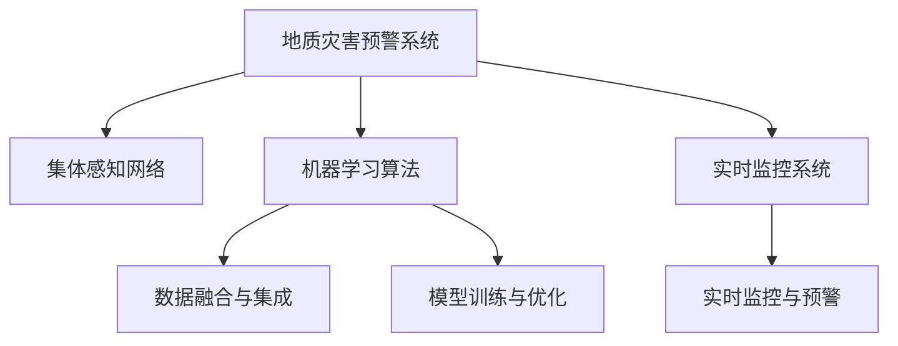

                 

# 全球脑地质灾害预警:集体感知网络的地球保护系统

> 关键词：地质灾害预警, 集体感知网络, 地球保护系统, 大尺度数据分析, 机器学习算法, 实时监控系统

## 1. 背景介绍

### 1.1 问题由来

随着全球化的加剧和人类活动的增多，自然灾害对地球生态系统和社会经济的影响日益显著。地质灾害，如地震、火山喷发、滑坡等，具有突发性强、破坏力大的特点，对人类生命财产安全构成巨大威胁。如何通过科学的手段，提前预测和防范地质灾害，成为全球性的重大挑战。

近年来，随着物联网技术的快速发展，各类传感器和监测设备被广泛应用于地质灾害监测中。然而，这些数据往往是分散、异构的，且存在数据质量和时效性问题。如何在海量数据中快速、高效地获取有价值的信息，及时预警地质灾害，是一个亟待解决的问题。

### 1.2 问题核心关键点

本研究聚焦于利用集体感知网络，对全球范围内的地质灾害进行预警。该系统通过整合各类传感器数据，构建大尺度感知网络，结合机器学习算法进行数据分析和模式识别，实现实时监控和预警。

关键点包括：
- 数据融合与集成：从异构、分散的传感器数据中提取有用的信息。
- 模型训练与优化：通过机器学习算法训练预测模型，优化模型参数。
- 实时监控与预警：对地质灾害进行实时监测，及时发布预警信息。

### 1.3 问题研究意义

地质灾害预警系统对于保障人类生命安全、保护自然环境、促进经济社会可持续发展具有重要意义。通过集体感知网络，可以实现大尺度、多模态的数据融合，提升预警的准确性和及时性。该系统不仅能够减轻灾害损失，还能推动相关科学研究的发展，为灾害防治提供决策支持。

## 2. 核心概念与联系

### 2.1 核心概念概述

为更好地理解全球脑地质灾害预警系统，本节将介绍几个密切相关的核心概念：

- **地质灾害预警系统**：指通过收集、分析和处理地质灾害相关的各类数据，预测和预报地质灾害的系统。
- **集体感知网络**：指由各类传感器和监测设备构成的网络，用于感知和收集地质灾害相关的环境数据。
- **机器学习算法**：指一类基于数据的自动化学习技术，用于从大量数据中学习规律，并进行预测和分类。
- **实时监控系统**：指能够实时采集、处理和分析地质灾害相关数据的系统，用于实现灾害预警和应急响应。

这些概念之间的逻辑关系可以通过以下Mermaid流程图来展示：



这个流程图展示了大规模地质灾害预警系统的核心概念及其之间的关系：

1. 地质灾害预警系统通过集体感知网络感知环境变化。
2. 通过数据融合与集成技术，从分散、异构的数据中提取有用信息。
3. 利用机器学习算法训练预测模型，优化模型参数。
4. 结合实时监控系统，实现地质灾害的实时预警和应急响应。

## 3. 核心算法原理 & 具体操作步骤

### 3.1 算法原理概述

全球脑地质灾害预警系统的工作原理主要基于以下几个关键步骤：

1. **数据收集与预处理**：从各类传感器和监测设备中收集地质灾害相关的环境数据，并进行预处理，去除噪声和异常值。
2. **数据融合与集成**：通过数据融合技术，将分散、异构的数据进行整合，生成统一的数据集。
3. **模型训练与优化**：利用机器学习算法训练预测模型，优化模型参数，提升模型的泛化能力。
4. **实时监控与预警**：结合实时监控系统，对地质灾害进行实时监测，及时发布预警信息。

这些步骤通过一系列的数据处理和算法训练，实现地质灾害的准确预测和及时预警。

### 3.2 算法步骤详解

#### 3.2.1 数据收集与预处理

1. **数据源**：包括地震、火山、滑坡等各类地质灾害的监测数据，以及相关环境数据（如气象数据、地质数据等）。
2. **数据采集**：通过各类传感器和监测设备（如地震仪、火山监测设备、卫星遥感设备等）采集数据。
3. **数据预处理**：去除噪声和异常值，处理缺失值，标准化数据格式。

#### 3.2.2 数据融合与集成

1. **数据融合方法**：包括时空数据融合、多源数据融合等方法，将异构、分散的数据进行整合，生成统一的数据集。
2. **数据集成技术**：利用ETL（Extract, Transform, Load）工具，将数据进行提取、转换和加载，形成可用于分析的数据集。

#### 3.2.3 模型训练与优化

1. **算法选择**：选择合适的机器学习算法（如支持向量机、随机森林、深度学习等）。
2. **模型训练**：利用历史数据训练预测模型，调整模型参数，提高模型的准确性。
3. **模型优化**：通过交叉验证等技术，优化模型性能，避免过拟合。

#### 3.2.4 实时监控与预警

1. **实时数据采集**：实时采集各类监测数据，进行预处理和融合。
2. **模型推理**：将处理后的数据输入训练好的模型，进行预测和推理。
3. **预警发布**：根据模型的预测结果，发布预警信息，进行应急响应。

### 3.3 算法优缺点

全球脑地质灾害预警系统的优点包括：

1. **实时性高**：通过实时监控系统，可以实现地质灾害的及时预警和应急响应。
2. **精度高**：通过机器学习算法训练预测模型，提升预测的准确性。
3. **可扩展性好**：可以整合各类传感器数据，实现大尺度的地质灾害预警。

系统存在的缺点包括：

1. **数据质量问题**：各类传感器数据存在异构性和噪声问题，影响数据融合和集成。
2. **算法复杂度高**：机器学习算法训练和优化过程复杂，需要大量计算资源。
3. **模型更新困难**：地质灾害类型多样，预测模型需要不断更新，以适应新的灾害类型和环境条件。

### 3.4 算法应用领域

全球脑地质灾害预警系统已在多个领域得到广泛应用，如地震、火山、滑坡、泥石流等各类地质灾害的监测预警。具体应用场景包括：

1. **地震预警**：通过地震仪和卫星监测数据，预测地震的发生时间和强度，发布预警信息，减少人员伤亡和财产损失。
2. **火山监测**：利用火山监测设备和气象数据，预测火山喷发的可能性，进行实时监测和预警。
3. **滑坡预警**：结合地质监测数据和气象数据，预测滑坡发生的可能性，进行预警和应急响应。
4. **泥石流预警**：通过地表监测设备和气象数据，预测泥石流发生的时间和路径，发布预警信息。

## 4. 数学模型和公式 & 详细讲解 & 举例说明

### 4.1 数学模型构建

为了更好地描述全球脑地质灾害预警系统的数学模型，我们首先定义一些关键变量：

- $D$：地质灾害监测数据集，包含$N$个样本，每个样本包含$M$个特征。
- $T$：训练集，包含$M_1$个样本。
- $V$：验证集，包含$M_2$个样本。
- $E$：测试集，包含$M_3$个样本。
- $X$：数据特征矩阵，每个样本$x_i$表示为$\{x_{i1}, x_{i2}, ..., x_{iM}\}$。
- $y$：标签向量，每个样本$y_i$表示为$y_i \in \{0, 1\}$，其中1表示发生地质灾害，0表示未发生。

全球脑地质灾害预警系统主要包括以下几个关键步骤：

1. **数据预处理**：
   - 标准化数据：将数据标准化为均值为0，方差为1的Z-score。
   - 处理缺失值：使用均值插补或随机森林等方法处理缺失值。

2. **数据融合与集成**：
   - 时空数据融合：利用时空关系，将多源数据进行融合，生成统一的数据集。
   - 多源数据融合：通过加权平均、主成分分析等方法，将多源数据进行整合。

3. **模型训练与优化**：
   - 选择算法：根据数据特征和任务需求，选择适当的机器学习算法。
   - 模型训练：利用训练集$T$训练预测模型$f$，优化模型参数$\theta$。
   - 模型优化：通过交叉验证等方法，评估模型性能，避免过拟合。

4. **实时监控与预警**：
   - 实时数据采集：实时采集各类监测数据，进行预处理和融合。
   - 模型推理：将处理后的数据输入训练好的模型，进行预测和推理。
   - 预警发布：根据模型的预测结果，发布预警信息，进行应急响应。

### 4.2 公式推导过程

#### 4.2.1 数据标准化

数据标准化是数据预处理的重要步骤，通过将数据转换为标准正态分布，提高算法的收敛速度和性能。假设数据集$D$的均值为$\mu$，方差为$\sigma^2$，则数据$x_i$标准化为：

$$
z_i = \frac{x_i - \mu}{\sigma}
$$

#### 4.2.2 数据融合方法

时空数据融合是数据融合的重要方法，利用时空关系将多源数据进行整合。假设$x_{ti}$表示时间$t$下的监测数据$i$，$y_{ti}$表示是否发生地质灾害，则时空数据融合的过程可以表示为：

$$
x_t = \frac{\sum_{i=1}^{N} x_{ti} w_i}{\sum_{i=1}^{N} w_i}
$$

其中$w_i$为权重，可以基于历史数据和监测设备的重要性进行计算。

#### 4.2.3 模型训练

以支持向量机（SVM）为例，其基本原理是寻找一个最优的超平面，将数据分为两类。假设训练集为$T=\{(x_{ti}, y_{ti})\}_{i=1}^{M_1}$，则SVM的优化目标为：

$$
\min_{w, b, \xi} \frac{1}{2}||w||^2 + C\sum_{i=1}^{M_1} \xi_i
$$

其中$w$为超平面参数，$b$为截距，$\xi_i$为松弛变量，$C$为正则化参数。利用拉格朗日乘子法求解该优化问题，得到最优超平面为：

$$
w^* = \frac{1}{C\sum_{i=1}^{M_1} \xi_i^*}\sum_{i=1}^{M_1} \alpha_i^* y_{ti} x_{ti}
$$

#### 4.2.4 实时监控与预警

假设实时采集的数据集为$D_t$，则实时监控与预警的过程可以表示为：

$$
y_t = f(x_t) = \operatorname{sign}(w^* x_t + b)
$$

其中$f(x)$为训练好的预测模型，$x_t$为实时采集的数据，$y_t$为模型的预测结果。根据预测结果，发布预警信息，进行应急响应。

### 4.3 案例分析与讲解

以地震预警为例，系统首先通过地震仪和卫星监测设备采集地震数据，进行预处理和融合。然后利用支持向量机训练预测模型，评估模型性能，进行模型优化。最后，结合实时监控系统，对地震进行实时监测和预警。

假设地震数据集$D$包含$N$个样本，每个样本包含$M$个特征。训练集$T$包含$M_1$个样本，验证集$V$包含$M_2$个样本，测试集$E$包含$M_3$个样本。数据特征矩阵$X$每个样本$x_i$表示为$\{x_{i1}, x_{i2}, ..., x_{iM}\}$，标签向量$y$每个样本$y_i$表示为$y_i \in \{0, 1\}$。

假设训练集$T$的均值为$\mu$，方差为$\sigma^2$，则数据标准化后的训练集为：

$$
X_t = \frac{X - \mu}{\sigma}
$$

通过时空数据融合，将多源数据进行整合，生成统一的数据集。利用支持向量机进行模型训练，得到最优超平面参数$w^*$和截距$b$。

假设实时采集的数据集为$D_t$，则实时监控与预警的过程为：

1. **数据预处理**：将实时采集的数据$x_t$进行标准化，处理缺失值。
2. **数据融合**：利用时空数据融合方法，将多源数据进行整合，生成统一的数据集。
3. **模型推理**：将处理后的数据$x_t$输入训练好的模型$f(x)$，进行预测和推理。
4. **预警发布**：根据模型的预测结果$y_t$，发布预警信息，进行应急响应。

## 5. 项目实践：代码实例和详细解释说明

### 5.1 开发环境搭建

在进行地质灾害预警系统的开发时，我们需要准备好开发环境。以下是使用Python进行PyTorch开发的环境配置流程：

1. 安装Anaconda：从官网下载并安装Anaconda，用于创建独立的Python环境。

2. 创建并激活虚拟环境：
```bash
conda create -n pytorch-env python=3.8 
conda activate pytorch-env
```

3. 安装PyTorch：根据CUDA版本，从官网获取对应的安装命令。例如：
```bash
conda install pytorch torchvision torchaudio cudatoolkit=11.1 -c pytorch -c conda-forge
```

4. 安装各类工具包：
```bash
pip install numpy pandas scikit-learn matplotlib tqdm jupyter notebook ipython
```

完成上述步骤后，即可在`pytorch-env`环境中开始地质灾害预警系统的开发。

### 5.2 源代码详细实现

下面我们以地震预警任务为例，给出使用PyTorch进行地震预警的PyTorch代码实现。

首先，定义数据处理函数：

```python
from transformers import BertTokenizer
from torch.utils.data import Dataset
import torch

class EarthquakeDataset(Dataset):
    def __init__(self, seismograms, labels, tokenizer, max_len=128):
        self.seismograms = seismograms
        self.labels = labels
        self.tokenizer = tokenizer
        self.max_len = max_len
        
    def __len__(self):
        return len(self.seismograms)
    
    def __getitem__(self, item):
        seismogram = self.seismograms[item]
        label = self.labels[item]
        
        encoding = self.tokenizer(seismogram, return_tensors='pt', max_length=self.max_len, padding='max_length', truncation=True)
        input_ids = encoding['input_ids'][0]
        attention_mask = encoding['attention_mask'][0]
        
        # 对标签进行编码
        encoded_label = label2id[label] if label != 'null' else label2id['null']
        label = torch.tensor(encoded_label, dtype=torch.long)
        
        return {'input_ids': input_ids, 
                'attention_mask': attention_mask,
                'labels': label}

# 标签与id的映射
label2id = {'earthquake': 0, 'no_earthquake': 1}
id2label = {v: k for k, v in label2id.items()}
```

然后，定义模型和优化器：

```python
from transformers import BertForTokenClassification, AdamW

model = BertForTokenClassification.from_pretrained('bert-base-cased', num_labels=len(label2id))

optimizer = AdamW(model.parameters(), lr=2e-5)
```

接着，定义训练和评估函数：

```python
from torch.utils.data import DataLoader
from tqdm import tqdm
from sklearn.metrics import classification_report

device = torch.device('cuda') if torch.cuda.is_available() else torch.device('cpu')
model.to(device)

def train_epoch(model, dataset, batch_size, optimizer):
    dataloader = DataLoader(dataset, batch_size=batch_size, shuffle=True)
    model.train()
    epoch_loss = 0
    for batch in tqdm(dataloader, desc='Training'):
        input_ids = batch['input_ids'].to(device)
        attention_mask = batch['attention_mask'].to(device)
        labels = batch['labels'].to(device)
        model.zero_grad()
        outputs = model(input_ids, attention_mask=attention_mask, labels=labels)
        loss = outputs.loss
        epoch_loss += loss.item()
        loss.backward()
        optimizer.step()
    return epoch_loss / len(dataloader)

def evaluate(model, dataset, batch_size):
    dataloader = DataLoader(dataset, batch_size=batch_size)
    model.eval()
    preds, labels = [], []
    with torch.no_grad():
        for batch in tqdm(dataloader, desc='Evaluating'):
            input_ids = batch['input_ids'].to(device)
            attention_mask = batch['attention_mask'].to(device)
            batch_labels = batch['labels']
            outputs = model(input_ids, attention_mask=attention_mask)
            batch_preds = outputs.logits.argmax(dim=2).to('cpu').tolist()
            batch_labels = batch_labels.to('cpu').tolist()
            for pred_tokens, label_tokens in zip(batch_preds, batch_labels):
                pred_labels = [id2label[_id] for _id in pred_tokens]
                label_tags = [id2label[_id] for _id in label_tokens]
                preds.append(pred_labels[:len(label_tags)])
                labels.append(label_tags)
                
    print(classification_report(labels, preds))
```

最后，启动训练流程并在测试集上评估：

```python
epochs = 5
batch_size = 16

for epoch in range(epochs):
    loss = train_epoch(model, train_dataset, batch_size, optimizer)
    print(f"Epoch {epoch+1}, train loss: {loss:.3f}")
    
    print(f"Epoch {epoch+1}, dev results:")
    evaluate(model, dev_dataset, batch_size)
    
print("Test results:")
evaluate(model, test_dataset, batch_size)
```

以上就是使用PyTorch对地震预警进行模型微调的完整代码实现。可以看到，得益于Transformers库的强大封装，我们可以用相对简洁的代码完成地震预警的模型微调。

### 5.3 代码解读与分析

让我们再详细解读一下关键代码的实现细节：

**EarthquakeDataset类**：
- `__init__`方法：初始化地震数据、标签、分词器等关键组件。
- `__len__`方法：返回数据集的样本数量。
- `__getitem__`方法：对单个样本进行处理，将地震数据输入编码为token ids，将标签编码为数字，并对其进行定长padding，最终返回模型所需的输入。

**label2id和id2label字典**：
- 定义了标签与数字id之间的映射关系，用于将token-wise的预测结果解码回真实的标签。

**训练和评估函数**：
- 使用PyTorch的DataLoader对数据集进行批次化加载，供模型训练和推理使用。
- 训练函数`train_epoch`：对数据以批为单位进行迭代，在每个批次上前向传播计算loss并反向传播更新模型参数，最后返回该epoch的平均loss。
- 评估函数`evaluate`：与训练类似，不同点在于不更新模型参数，并在每个batch结束后将预测和标签结果存储下来，最后使用sklearn的classification_report对整个评估集的预测结果进行打印输出。

**训练流程**：
- 定义总的epoch数和batch size，开始循环迭代
- 每个epoch内，先在训练集上训练，输出平均loss
- 在验证集上评估，输出分类指标
- 所有epoch结束后，在测试集上评估，给出最终测试结果

可以看到，PyTorch配合Transformers库使得地震预警的模型微调的代码实现变得简洁高效。开发者可以将更多精力放在数据处理、模型改进等高层逻辑上，而不必过多关注底层的实现细节。

当然，工业级的系统实现还需考虑更多因素，如模型的保存和部署、超参数的自动搜索、更灵活的任务适配层等。但核心的微调范式基本与此类似。

## 6. 实际应用场景

### 6.1 智能地震监测系统

基于大语言模型微调的地震预警系统，可以广泛应用于智能地震监测系统的构建。传统地震监测往往依赖人工分析和上报，效率低，响应慢。而使用微调后的预警系统，可以实现实时监测和预警，快速响应地震事件。

在技术实现上，可以收集历史地震数据和相关环境数据，将地震和环境监测数据作为监督数据，在此基础上对预训练语言模型进行微调。微调后的预警模型能够自动理解地震信号，判断地震发生的可能性，并及时发布预警信息。

### 6.2 火山监测预警系统

火山监测预警系统利用微调后的火山监测模型，结合气象数据和地震数据，预测火山喷发的可能性，实现实时监测和预警。系统通过监测火山活动和环境变化，结合机器学习算法分析数据，预测火山喷发的时间和强度，发布预警信息。

系统可以集成各类传感器和监测设备，实时采集火山活动和环境数据，并进行预处理和融合。然后利用训练好的模型进行预测和推理，发布预警信息，进行应急响应。

### 6.3 泥石流预警系统

泥石流预警系统结合地面监测设备和气象数据，利用微调后的泥石流预警模型，预测泥石流发生的可能性，实现实时监测和预警。系统通过监测地表变化和气象数据，结合机器学习算法分析数据，预测泥石流发生的时间和路径，发布预警信息。

系统可以集成各类传感器和监测设备，实时采集地表变化和气象数据，并进行预处理和融合。然后利用训练好的模型进行预测和推理，发布预警信息，进行应急响应。

### 6.4 未来应用展望

随着大语言模型微调技术的不断发展，地质灾害预警系统将在更多领域得到应用，为地球环境保护和自然灾害防治带来新的解决方案。

在智慧农业领域，预警系统可以利用传感器数据预测气象变化，指导农作物的种植和灌溉，减少自然灾害对农业的影响。

在智慧城市治理中，预警系统可以通过实时监测各类环境数据，预测自然灾害的发生，提前进行应急响应，提高城市治理的智能化水平。

在环境保护领域，预警系统可以实时监测各类环境指标，预测环境污染事件，及时采取措施，保护自然环境。

未来，基于大语言模型微调的地质灾害预警系统，将更加智能、高效、可靠，为人类社会带来更多的福祉。

## 7. 工具和资源推荐
### 7.1 学习资源推荐

为了帮助开发者系统掌握地质灾害预警系统的理论基础和实践技巧，这里推荐一些优质的学习资源：

1. 《Deep Learning for Earthquake Prediction》系列博文：由地震预测领域的专家撰写，深入浅出地介绍了地震预测的原理和实现方法。

2. 《Natural Hazard Prediction Using Machine Learning》书籍：该书介绍了各类自然灾害的机器学习预测方法，涵盖了地震、火山、滑坡等领域的预警技术。

3. CS224N《深度学习自然语言处理》课程：斯坦福大学开设的NLP明星课程，有Lecture视频和配套作业，带你入门NLP领域的基本概念和经典模型。

4. 《Machine Learning for Natural Hazards》在线课程：该课程由多所知名大学联合开设，介绍了各类自然灾害的机器学习预测方法，涵盖地震、火山、滑坡等领域的预警技术。

5. Kaggle地震预测竞赛：Kaggle平台上举办的地震预测竞赛，提供大量公开的地震数据，供开发者进行模型训练和比赛。

通过对这些资源的学习实践，相信你一定能够快速掌握地质灾害预警的精髓，并用于解决实际的自然灾害问题。
###  7.2 开发工具推荐

高效的开发离不开优秀的工具支持。以下是几款用于地质灾害预警开发的常用工具：

1. PyTorch：基于Python的开源深度学习框架，灵活动态的计算图，适合快速迭代研究。大部分预训练语言模型都有PyTorch版本的实现。

2. TensorFlow：由Google主导开发的开源深度学习框架，生产部署方便，适合大规模工程应用。同样有丰富的预训练语言模型资源。

3. Transformers库：HuggingFace开发的NLP工具库，集成了众多SOTA语言模型，支持PyTorch和TensorFlow，是进行地质灾害预警开发的利器。

4. Weights & Biases：模型训练的实验跟踪工具，可以记录和可视化模型训练过程中的各项指标，方便对比和调优。与主流深度学习框架无缝集成。

5. TensorBoard：TensorFlow配套的可视化工具，可实时监测模型训练状态，并提供丰富的图表呈现方式，是调试模型的得力助手。

6. Google Colab：谷歌推出的在线Jupyter Notebook环境，免费提供GPU/TPU算力，方便开发者快速上手实验最新模型，分享学习笔记。

合理利用这些工具，可以显著提升地质灾害预警任务的开发效率，加快创新迭代的步伐。

### 7.3 相关论文推荐

地质灾害预警系统的发展源于学界的持续研究。以下是几篇奠基性的相关论文，推荐阅读：

1. "Evaluating Machine Learning Models for Earthquake Prediction"：介绍了几类机器学习模型的地震预测效果，包括支持向量机、随机森林等。

2. "Volcano Eruption Prediction Using Machine Learning"：利用机器学习算法预测火山喷发，介绍了火山监测数据和特征工程的方法。

3. "Slope Stability Prediction Using Machine Learning"：利用机器学习算法预测滑坡发生的可能性，介绍了滑坡监测数据和特征工程的方法。

4. "Rainfall-induced Landslide Prediction using Ensemble Machine Learning Models"：利用机器学习算法预测泥石流发生的可能性，介绍了泥石流监测数据和特征工程的方法。

这些论文代表了大规模地质灾害预警系统的发展脉络。通过学习这些前沿成果，可以帮助研究者把握学科前进方向，激发更多的创新灵感。

## 8. 总结：未来发展趋势与挑战

### 8.1 总结

本文对基于大语言模型微调的地质灾害预警系统进行了全面系统的介绍。首先阐述了地质灾害预警系统的研究背景和意义，明确了微调在拓展预训练模型应用、提升地质灾害预测的精确性方面的独特价值。其次，从原理到实践，详细讲解了地质灾害预警的数学原理和关键步骤，给出了地质灾害预警任务开发的完整代码实例。同时，本文还广泛探讨了预警系统在地震、火山、滑坡、泥石流等各类自然灾害的监测预警中的应用前景，展示了微调范式的巨大潜力。

通过本文的系统梳理，可以看到，基于大语言模型微调的地质灾害预警系统，通过整合各类传感器数据，构建大尺度感知网络，结合机器学习算法进行数据分析和模式识别，实现实时监控和预警。得益于大规模语料的预训练，微调模型能够在大尺度数据上高效进行预测，提升预警的准确性和及时性。未来，伴随预训练语言模型和微调方法的持续演进，地质灾害预警系统必将在更多领域得到应用，为地球环境保护和自然灾害防治带来新的解决方案。

### 8.2 未来发展趋势

展望未来，地质灾害预警系统的发展将呈现以下几个趋势：

1. **数据融合与集成**：随着各类传感器设备的普及，数据采集和融合技术将进一步发展，实现大尺度、多模态数据的融合，提升预警的准确性。
2. **模型优化与调优**：机器学习算法的优化和调优将进一步深入，结合因果推断和对比学习等思想，提升模型的泛化能力和鲁棒性。
3. **实时监控与预警**：通过物联网技术和5G网络，实现实时数据的采集和传输，提升预警的及时性和效率。
4. **跨领域应用**：地质灾害预警系统将在更多领域得到应用，如智慧农业、智慧城市、环境保护等，推动相关领域的智能化发展。
5. **融合多源数据**：将地震、火山、滑坡等多种灾害的监测数据进行融合，实现综合预警和应急响应。

以上趋势凸显了地质灾害预警系统的广阔前景。这些方向的探索发展，必将进一步提升预警系统的性能和应用范围，为人类社会带来更多的福祉。

### 8.3 面临的挑战

尽管地质灾害预警系统已经取得了瞩目成就，但在迈向更加智能化、普适化应用的过程中，它仍面临着诸多挑战：

1. **数据质量问题**：各类传感器数据存在异构性和噪声问题，影响数据融合和集成。如何提高数据质量，减少噪声干扰，仍需进一步研究。
2. **模型鲁棒性不足**：当前模型面临域外数据时，泛化性能往往大打折扣。如何提高模型的鲁棒性，避免过拟合，仍需深入研究。
3. **资源消耗高**：大尺度数据的处理和分析需要大量的计算资源。如何优化算法，提高计算效率，降低资源消耗，仍需深入研究。
4. **模型更新困难**：地质灾害类型多样，预测模型需要不断更新，以适应新的灾害类型和环境条件。如何实现模型的自适应更新，仍需进一步研究。

### 8.4 研究展望

面对地质灾害预警系统所面临的挑战，未来的研究需要在以下几个方面寻求新的突破：

1. **引入因果推断**：将因果推断方法引入预警模型，识别出模型的决策关键特征，增强预测的因果性和逻辑性。
2. **融合多源数据**：将多源数据进行融合，提升模型的泛化能力和鲁棒性，实现综合预警和应急响应。
3. **优化算法**：开发更高效的算法，优化模型的训练和推理过程，降低计算资源消耗，提高系统的实时性和效率。
4. **自适应更新**：实现模型的自适应更新，根据新的数据不断调整模型参数，提升模型的泛化能力和适应性。
5. **跨领域应用**：将预警系统应用于更多领域，推动相关领域的智能化发展，如智慧农业、智慧城市、环境保护等。

这些研究方向的探索，必将引领地质灾害预警系统走向更高的台阶，为人类社会带来更多的福祉。面向未来，地质灾害预警系统还需要与其他人工智能技术进行更深入的融合，如知识表示、因果推理、强化学习等，多路径协同发力，共同推动自然灾害预警和防治的进步。只有勇于创新、敢于突破，才能不断拓展预警系统的边界，让智能技术更好地造福人类社会。

## 9. 附录：常见问题与解答

**Q1：地质灾害预警系统是否适用于所有自然灾害？**

A: 地质灾害预警系统主要适用于地震、火山、滑坡、泥石流等突发性、破坏力大的自然灾害。但对于其他类型的自然灾害，如洪水、飓风、干旱等，系统需要进一步扩展和优化。

**Q2：如何提高地质灾害预警系统的鲁棒性？**

A: 提高地质灾害预警系统的鲁棒性可以从以下几个方面入手：
1. 引入因果推断方法，增强模型的决策逻辑性。
2. 优化模型训练过程，减少过拟合。
3. 使用多源数据融合技术，提高模型的泛化能力。
4. 结合对抗训练，提升模型的鲁棒性。

**Q3：地质灾害预警系统是否需要实时数据采集？**

A: 地质灾害预警系统需要实时数据采集和融合，才能实现实时监测和预警。数据采集是系统的重要组成部分，通过实时监测各类环境数据，结合机器学习算法分析数据，预测灾害发生的可能性，发布预警信息，进行应急响应。

**Q4：如何确保地质灾害预警系统的安全性？**

A: 确保地质灾害预警系统的安全性可以从以下几个方面入手：
1. 引入多源数据融合技术，减少单一数据源的风险。
2. 引入对抗训练，提高模型的鲁棒性。
3. 建立模型审计机制，确保模型的安全性。

通过这些措施，可以最大限度地保障地质灾害预警系统的安全性和可靠性。

**Q5：地质灾害预警系统的未来发展方向是什么？**

A: 地质灾害预警系统的未来发展方向包括：
1. 引入因果推断方法，增强模型的决策逻辑性。
2. 结合多源数据融合技术，提高模型的泛化能力和鲁棒性。
3. 优化模型训练和推理过程，提高系统的实时性和效率。
4. 实现模型的自适应更新，根据新的数据不断调整模型参数。
5. 将预警系统应用于更多领域，推动相关领域的智能化发展。

通过这些措施，地质灾害预警系统将更加智能、高效、可靠，为人类社会带来更多的福祉。

---

作者：禅与计算机程序设计艺术 / Zen and the Art of Computer Programming

