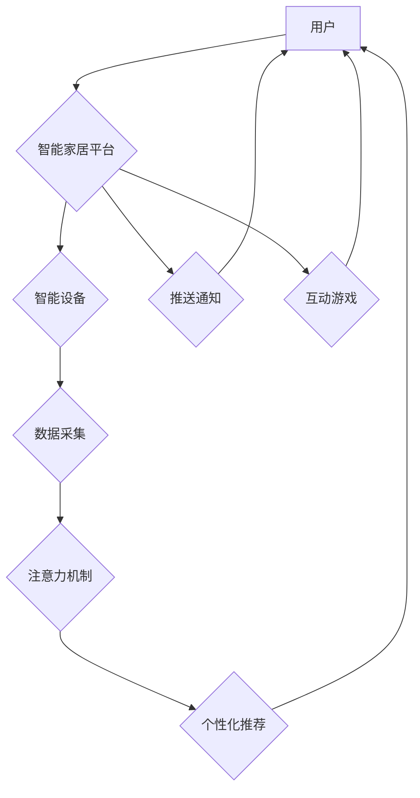

                 

## 智能家居生态系统的注意力争夺战

> 关键词：智能家居、注意力机制、生态系统、数据隐私、用户体验、AI 算法

### 1. 背景介绍

智能家居，作为科技发展的重要方向，正在深刻地改变人们的生活方式。从智能照明、智能音箱到智能安防、智能家电，越来越多的设备开始融入我们的日常生活，为我们带来便利和舒适。然而，随着智能家居生态系统的不断发展，一个新的挑战逐渐浮出水面：**注意力争夺战**。

在智能家居生态系统中，各种设备、平台和服务都在争夺用户的注意力。智能音箱希望用户通过语音交互控制家居设备，智能电视想要用户沉浸在观影体验中，智能手机则希望用户时刻关注其推送的信息。这些平台和服务通过各种手段，例如个性化推荐、推送通知、互动游戏等，试图吸引用户的注意力，并最终实现商业目标。

然而，用户的注意力是有限的，而智能家居生态系统中的竞争却日益激烈。在这种情况下，如何有效地获取和利用用户的注意力，成为了智能家居生态系统中一个至关重要的议题。

### 2. 核心概念与联系

**2.1 智能家居生态系统**

智能家居生态系统是指由智能设备、平台、服务和用户组成的复杂网络。这些设备通过网络互联，能够相互感知和协作，为用户提供更加智能化、便捷化的家居体验。

**2.2 注意力机制**

注意力机制是一种模仿人类注意力机制的机器学习技术。它通过学习哪些信息对任务最相关，并对这些信息给予更多的关注，从而提高模型的性能。

**2.3  注意力争夺战**

在智能家居生态系统中，各种平台和服务都在争夺用户的注意力。这种争夺战可以通过以下几种方式体现：

* **个性化推荐:** 智能家居平台会根据用户的历史行为和偏好，推荐相关的设备、服务和内容。
* **推送通知:** 智能设备会通过推送通知提醒用户使用相关功能或服务。
* **互动游戏:** 一些智能家居平台会提供互动游戏，吸引用户参与并延长使用时间。

**2.4  Mermaid 流程图**



### 3. 核心算法原理 & 具体操作步骤

**3.1  算法原理概述**

注意力机制的核心思想是学习哪些信息对任务最相关，并对这些信息给予更多的关注。它可以看作是一种加权机制，通过学习不同的权重，对输入信息进行加权求和，从而得到最终的输出。

**3.2  算法步骤详解**

1. **输入数据:** 将输入数据（例如文本、图像、音频等）转换为向量表示。
2. **计算注意力权重:** 使用注意力机制计算每个输入元素的注意力权重。
3. **加权求和:** 根据注意力权重对输入元素进行加权求和，得到最终的输出。

**3.3  算法优缺点**

**优点:**

* 可以有效地学习到输入数据中的重要信息。
* 可以提高模型的性能，例如在机器翻译、文本摘要等任务中。

**缺点:**

* 计算复杂度较高。
* 需要大量的训练数据。

**3.4  算法应用领域**

注意力机制在机器学习领域有着广泛的应用，例如：

* **自然语言处理:** 机器翻译、文本摘要、问答系统等。
* **计算机视觉:** 图像识别、目标检测、图像 Captioning 等。
* **语音识别:** 语音转文本、语音合成等。

### 4. 数学模型和公式 & 详细讲解 & 举例说明

**4.1  数学模型构建**

注意力机制的数学模型可以概括为以下公式：

$$
\text{Attention}(Q, K, V) = \text{softmax}\left(\frac{Q K^T}{\sqrt{d_k}}\right) V
$$

其中：

* $Q$：查询向量
* $K$：键向量
* $V$：值向量
* $d_k$：键向量的维度
* $\text{softmax}$：softmax 函数

**4.2  公式推导过程**

公式推导过程可以分为以下几个步骤：

1. 计算查询向量 $Q$ 和键向量 $K$ 的点积，并进行归一化处理。
2. 应用 softmax 函数对点积结果进行归一化，得到注意力权重。
3. 将注意力权重与值向量 $V$ 进行加权求和，得到最终的输出。

**4.3  案例分析与讲解**

例如，在机器翻译任务中，查询向量 $Q$ 可以表示目标语言的词嵌入，键向量 $K$ 可以表示源语言的词嵌入，值向量 $V$ 可以表示源语言词的语义表示。通过注意力机制，模型可以学习到哪些源语言词对目标语言词最相关，并对这些词给予更多的关注，从而提高翻译质量。

### 5. 项目实践：代码实例和详细解释说明

**5.1  开发环境搭建**

* Python 3.x
* TensorFlow 或 PyTorch
* 其他必要的库，例如 NumPy、pandas 等

**5.2  源代码详细实现**

```python
import tensorflow as tf

# 定义注意力机制层
class AttentionLayer(tf.keras.layers.Layer):
    def __init__(self, units):
        super(AttentionLayer, self).__init__()
        self.Wq = tf.keras.layers.Dense(units)
        self.Wk = tf.keras.layers.Dense(units)
        self.Wv = tf.keras.layers.Dense(units)
        self.softmax = tf.keras.layers.Softmax()

    def call(self, inputs):
        Q = self.Wq(inputs[0])
        K = self.Wk(inputs[1])
        V = self.Wv(inputs[2])
        attention_weights = self.softmax(tf.matmul(Q, K, transpose_b=True) / tf.math.sqrt(tf.cast(K.shape[-1], tf.float32)))
        output = tf.matmul(attention_weights, V)
        return output

# 使用注意力机制层
model = tf.keras.Sequential([
    # 其他层
    AttentionLayer(units=128),
    # 其他层
])
```

**5.3  代码解读与分析**

* `AttentionLayer` 类定义了一个注意力机制层，包含三个稠密层 (`Wq`, `Wk`, `Wv`) 用于计算查询向量、键向量和值向量的线性变换。
* `call` 方法实现注意力机制的计算过程，包括计算注意力权重和加权求和。
* 在代码示例中，注意力机制层被集成到一个简单的 Keras 模型中，用于处理输入数据。

**5.4  运行结果展示**

运行结果展示需要根据具体的应用场景和数据集进行评估。例如，在机器翻译任务中，可以评估模型的BLEU分数，在文本摘要任务中，可以评估模型的ROUGE分数。

### 6. 实际应用场景

**6.1 智能家居设备控制**

注意力机制可以用于智能家居设备的个性化控制。例如，根据用户的历史使用习惯和当前环境，智能家居平台可以自动调节灯光、温度、音乐等设备，提供更加舒适的体验。

**6.2 智能家居场景推荐**

注意力机制可以用于智能家居场景推荐。例如，根据用户的活动轨迹和设备使用情况，智能家居平台可以推荐相关的场景，例如“下班回家”，“睡前放松”，“早餐准备”等。

**6.3 智能家居安全保障**

注意力机制可以用于智能家居安全保障。例如，可以利用注意力机制分析用户的行为模式，识别异常行为，并及时提醒用户或采取相应的安全措施。

**6.4  未来应用展望**

随着人工智能技术的不断发展，注意力机制在智能家居生态系统中的应用场景将会更加广泛。例如，可以利用注意力机制实现更加精准的语音识别、更自然的对话交互、更智能的设备协作等。

### 7. 工具和资源推荐

**7.1  学习资源推荐**

* **论文:**
    * Attention Is All You Need (Vaswani et al., 2017)
    * The Annotated Transformer (Jay Alammar)
* **博客:**
    * Towards Data Science
    * Machine Learning Mastery

**7.2  开发工具推荐**

* **TensorFlow:** https://www.tensorflow.org/
* **PyTorch:** https://pytorch.org/
* **Keras:** https://keras.io/

**7.3  相关论文推荐**

* **Attention Is All You Need:** https://arxiv.org/abs/1706.03762
* **BERT: Pre-training of Deep Bidirectional Transformers for Language Understanding:** https://arxiv.org/abs/1810.04805
* **GPT-3: Language Models are Few-Shot Learners:** https://arxiv.org/abs/2005.14165

### 8. 总结：未来发展趋势与挑战

**8.1  研究成果总结**

注意力机制在智能家居生态系统中具有重要的应用价值，可以帮助智能家居平台更好地理解用户的需求，提供更加个性化、便捷化的服务。

**8.2  未来发展趋势**

* **更强大的注意力机制:** 研究人员将继续探索更强大的注意力机制，例如自注意力机制、多头注意力机制等，以提高模型的性能和效率。
* **注意力机制的融合:** 将注意力机制与其他机器学习技术融合，例如深度学习、强化学习等，以构建更加智能的智能家居系统。
* **注意力机制的解释性:** 研究注意力机制的解释性，以便更好地理解模型的决策过程，并提高模型的可信度。

**8.3  面临的挑战**

* **数据隐私:** 智能家居生态系统收集大量的用户数据，如何保护用户隐私是一个重要的挑战。
* **用户体验:** 如何设计更加人性化的智能家居体验，避免用户感到被过度监控或干扰，也是一个需要解决的问题。
* **系统安全:** 智能家居系统面临着来自网络攻击和数据泄露的威胁，需要加强安全防护措施。

**8.4  研究展望**

未来，注意力机制将在智能家居生态系统中发挥更加重要的作用，推动智能家居技术的进一步发展。


### 9. 附录：常见问题与解答

**9.1  Q: 注意力机制的计算复杂度较高，如何降低计算复杂度？**

**A:** 

* 使用更轻量级的注意力机制模型，例如局部注意力机制。
* 利用并行计算技术加速注意力机制的计算。

**9.2  Q: 如何评估注意力机制的性能？**

**A:** 

* 使用与具体应用场景相关的指标进行评估，例如BLEU分数、ROUGE分数等。
* 通过可视化注意力权重，分析模型对输入信息的关注程度。


作者：禅与计算机程序设计艺术 / Zen and the Art of Computer Programming 
<end_of_turn>

