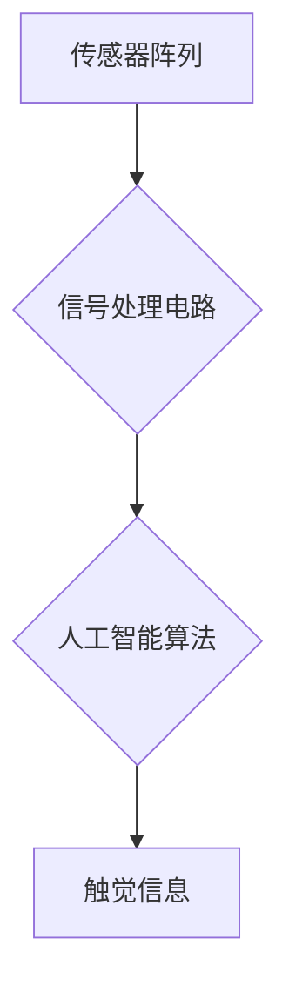

                 

## 智能皮肤技术：为机器人提供触觉感知

> 关键词：智能皮肤、触觉感知、机器人、传感器、机器学习、柔性电子器件、物联网

### 1. 背景介绍

机器人技术近年来取得了飞速发展，从工业自动化到医疗服务，机器人已经渗透到各个领域。然而，与人类相比，机器人仍然缺乏对周围环境的完整感知能力，特别是触觉感知。触觉是人类感知世界的重要途径，它不仅可以帮助我们识别物体的大小、形状、材质等信息，还可以感知温度、压力、疼痛等微妙变化。缺乏触觉感知限制了机器人的应用范围，使其难以完成一些需要精细操作和环境交互的任务。

智能皮肤技术旨在为机器人赋予触觉感知能力，使其能够像人类一样感知和理解周围环境。智能皮肤通常由传感器、信号处理电路和人工智能算法组成，能够检测各种触觉刺激，并将其转化为机器理解的信号。

### 2. 核心概念与联系

智能皮肤的核心概念是将传感器阵列集成到柔性基板上，形成类似于人类皮肤的结构。这些传感器能够检测各种触觉刺激，例如压力、温度、振动和形变。

**智能皮肤架构**



**传感器阵列:** 

*  压力传感器：检测物体施加的压力。
*  温度传感器：检测物体温度。
*  振动传感器：检测物体振动。
*  形变传感器：检测物体形变。

**信号处理电路:**

*  将传感器采集到的原始信号进行放大、滤波和转换。
*  提取关键特征信息，例如压力大小、温度变化、振动频率等。

**人工智能算法:**

*  对处理后的触觉信息进行分析和理解。
*  识别物体类型、形状、材质等信息。
*  做出相应的反应，例如抓取物体、避开障碍物等。

### 3. 核心算法原理 & 具体操作步骤

#### 3.1 算法原理概述

智能皮肤算法的核心是将多源触觉信息融合，并将其转化为机器可理解的触觉感知信息。常用的算法包括：

* **主成分分析 (PCA):** 用于降维，提取触觉信号中的主要特征。
* **支持向量机 (SVM):** 用于分类，识别不同类型的触觉刺激。
* **深度学习 (DL):** 用于复杂触觉模式的识别和理解，例如物体形状、材质等。

#### 3.2 算法步骤详解

以深度学习为例，智能皮肤触觉感知算法的具体步骤如下：

1. **数据采集:** 使用传感器阵列采集各种触觉刺激的数据，例如不同形状、材质的物体触碰、不同温度的物体接触等。
2. **数据预处理:** 对采集到的原始数据进行清洗、去噪、归一化等处理，使其更适合深度学习模型的训练。
3. **模型构建:** 选择合适的深度学习模型，例如卷积神经网络 (CNN) 或循环神经网络 (RNN)，并根据触觉数据特点进行模型结构设计。
4. **模型训练:** 使用预处理后的触觉数据训练深度学习模型，使其能够识别和理解不同的触觉刺激。
5. **模型评估:** 使用测试数据评估模型的性能，例如识别准确率、召回率等指标。
6. **模型部署:** 将训练好的模型部署到智能皮肤系统中，使其能够实时感知和理解触觉信息。

#### 3.3 算法优缺点

**优点:**

* **高精度:** 深度学习算法能够学习复杂的触觉模式，实现高精度的触觉感知。
* **鲁棒性:** 深度学习模型能够对噪声和干扰具有较强的鲁棒性。
* **可扩展性:** 深度学习模型可以很容易地扩展到新的触觉刺激类型。

**缺点:**

* **训练数据需求:** 深度学习模型需要大量的训练数据才能达到较高的性能。
* **计算资源:** 深度学习模型的训练和部署需要较高的计算资源。
* **解释性:** 深度学习模型的决策过程相对复杂，难以解释其背后的原因。

#### 3.4 算法应用领域

智能皮肤算法在机器人领域有广泛的应用前景，例如：

* **工业机器人:** 提高机器人抓取和操作的精度和灵活性。
* **医疗机器人:** 用于手术辅助、康复训练等。
* **服务机器人:** 增强机器人的交互能力，使其能够更好地理解人类的需求。
* **仿生机器人:** 为机器人赋予更接近人类的触觉感知能力。

### 4. 数学模型和公式 & 详细讲解 & 举例说明

#### 4.1 数学模型构建

智能皮肤触觉感知模型可以基于以下数学模型构建：

* **压力感知模型:**

$$
P = k \cdot \Delta d
$$

其中：

* $P$ 为压力值
* $k$ 为压力传感器灵敏度
* $\Delta d$ 为传感器形变量

* **温度感知模型:**

$$
T = T_0 + \alpha \cdot R
$$

其中：

* $T$ 为温度值
* $T_0$ 为环境温度
* $\alpha$ 为温度传感器灵敏度
* $R$ 为电阻变化量

* **振动感知模型:**

$$
V = A \cdot \sin(\omega t)
$$

其中：

* $V$ 为振动幅值
* $A$ 为振动振幅
* $\omega$ 为振动频率
* $t$ 为时间

#### 4.2 公式推导过程

以上公式的推导过程基于传感器工作原理和物理定律。例如，压力传感器的工作原理是利用压力的变化来改变传感器内部的电阻或电容值，从而产生相应的输出信号。通过测量传感器形变量，可以推导出压力值。

#### 4.3 案例分析与讲解

假设一个智能皮肤传感器阵列用于检测一个物体的大小和形状。

* **压力感知:** 通过测量传感器阵列上的压力分布，可以推断出物体的形状轮廓。
* **温度感知:** 通过测量传感器阵列上的温度分布，可以推断出物体的材质和温度变化。
* **振动感知:** 通过测量传感器阵列上的振动频率和幅值，可以推断出物体的运动状态和材质特性。

通过融合以上三种触觉信息，智能皮肤系统可以更全面地感知物体的信息，例如大小、形状、材质、温度等。

### 5. 项目实践：代码实例和详细解释说明

#### 5.1 开发环境搭建

* **操作系统:** Ubuntu 20.04 LTS
* **编程语言:** Python 3.8
* **深度学习框架:** TensorFlow 2.0
* **传感器:** Adafruit FlexiForce压电传感器

#### 5.2 源代码详细实现

```python
import tensorflow as tf
from tensorflow.keras.models import Sequential
from tensorflow.keras.layers import Dense, Flatten, Conv1D

# 数据预处理
# ...

# 模型构建
model = Sequential()
model.add(Conv1D(32, kernel_size=3, activation='relu', input_shape=(timesteps, 1)))
model.add(Flatten())
model.add(Dense(10, activation='softmax'))

# 模型编译
model.compile(optimizer='adam',
              loss='sparse_categorical_crossentropy',
              metrics=['accuracy'])

# 模型训练
model.fit(X_train, y_train, epochs=10, batch_size=32)

# 模型评估
loss, accuracy = model.evaluate(X_test, y_test)
print('Test loss:', loss)
print('Test accuracy:', accuracy)

# 模型部署
# ...
```

#### 5.3 代码解读与分析

* **数据预处理:** 将原始触觉数据转换为模型可接受的格式，例如归一化、降维等。
* **模型构建:** 使用深度学习框架构建触觉感知模型，例如卷积神经网络 (CNN) 或循环神经网络 (RNN)。
* **模型编译:** 配置模型的训练参数，例如优化器、损失函数、评价指标等。
* **模型训练:** 使用训练数据训练模型，使其能够识别和理解不同的触觉刺激。
* **模型评估:** 使用测试数据评估模型的性能，例如识别准确率、召回率等指标。
* **模型部署:** 将训练好的模型部署到智能皮肤系统中，使其能够实时感知和理解触觉信息。

#### 5.4 运行结果展示

通过训练和评估，模型可以达到较高的触觉识别准确率，例如识别不同形状、材质的物体，以及感知温度、压力等变化。

### 6. 实际应用场景

#### 6.1  工业机器人

智能皮肤可以为工业机器人赋予更精细的触觉感知能力，使其能够更准确地抓取和操作物体，例如在电子制造、汽车装配等领域。

#### 6.2  医疗机器人

智能皮肤可以帮助医疗机器人完成更复杂的手术操作，例如微创手术、康复训练等。

#### 6.3  服务机器人

智能皮肤可以增强服务机器人的交互能力，使其能够更好地理解人类的需求，例如在陪伴、家政服务等领域。

#### 6.4  未来应用展望

智能皮肤技术在未来将有更广泛的应用前景，例如：

* **仿生机器人:** 为机器人赋予更接近人类的触觉感知能力，使其能够更好地适应复杂环境。
* **虚拟现实 (VR) 和增强现实 (AR):** 为VR/AR设备提供更逼真的触觉反馈，增强用户体验。
* **物联网 (IoT):** 为智能家居、智能城市等应用提供更丰富的感知能力。

### 7. 工具和资源推荐

#### 7.1 学习资源推荐

* **书籍:**
    * "Robotics: Modeling, Planning and Control" by Bruno Siciliano and Oussama Khatib
    * "Artificial Intelligence: A Modern Approach" by Stuart Russell and Peter Norvig
* **在线课程:**
    * Coursera: "Robotics" by University of Pennsylvania
    * edX: "Artificial Intelligence" by Columbia University

#### 7.2 开发工具推荐

* **深度学习框架:** TensorFlow, PyTorch, Keras
* **传感器平台:** Adafruit, SparkFun
* **机器人操作系统:** ROS

#### 7.3 相关论文推荐

* "Tactile Sensing with Artificial Skin" by Hiroshi Ishii
* "A Review of Tactile Sensing Technologies for Robotics" by J. K. Salisbury
* "Deep Learning for Tactile Sensing" by A. S. A. Khan

### 8. 总结：未来发展趋势与挑战

#### 8.1 研究成果总结

智能皮肤技术近年来取得了显著进展，从传感器材料、算法模型到应用场景，都取得了突破性进展。

#### 8.2 未来发展趋势

* **更灵敏、更精准的传感器:** 开发更灵敏、更精准的触觉传感器，能够感知更细微的触觉刺激。
* **更强大的算法模型:** 开发更强大的算法模型，能够更准确地识别和理解复杂的触觉模式。
* **更广泛的应用场景:** 将智能皮肤技术应用到更多领域，例如医疗、教育、娱乐等。

#### 8.3 面临的挑战

* **传感器成本:** 高性能触觉传感器成本较高，制约了智能皮肤技术的普及。
* **算法复杂度:** 训练和部署复杂的触觉感知算法需要大量的计算资源。
* **数据标注:** 触觉数据标注工作量大，需要大量的专业人员参与。

#### 8.4 研究展望

未来，智能皮肤技术将继续朝着更灵敏、更精准、更智能的方向发展，为机器人赋予更接近人类的触觉感知能力，推动机器人技术向更广泛的应用领域拓展。

### 9. 附录：常见问题与解答

* **Q1: 智能皮肤的成本如何？**

A1: 智能皮肤的成本取决于传感器类型、数量、算法复杂度等因素。目前，高性能智能皮肤的成本较高，但随着技术的进步和产业化发展，成本预计会逐渐降低。

* **Q2: 智能皮肤的应用场景有哪些？**

A2: 智能皮肤的应用场景非常广泛，例如工业机器人、医疗机器人、服务机器人、仿生机器人、虚拟现实、增强现实等。

* **Q3: 智能皮肤的未来发展趋势是什么？**

A3: 智能皮肤技术未来将朝着更灵敏、更精准、更智能的方向发展，例如开发更先进的传感器材料、更强大的算法模型、更广泛的应用场景。


作者：禅与计算机程序设计艺术 / Zen and the Art of Computer Programming 
<end_of_turn>

