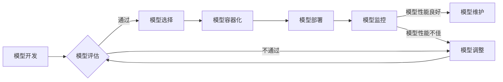

                 

## 机器学习模型部署：从开发到生产环境

> 关键词：机器学习、模型部署、生产环境、容器化、微服务、监控、优化

### 1. 背景介绍

机器学习（Machine Learning，ML）近年来发展迅速，在各个领域取得了令人瞩目的成就。从图像识别到自然语言处理，从推荐系统到医疗诊断，机器学习模型正在改变着我们的生活。然而，仅仅开发出优秀的机器学习模型还不够，将这些模型部署到生产环境中，使其能够真正发挥价值，才是最终目标。

模型部署是一个复杂的过程，涉及到多个环节，包括模型选择、数据准备、环境搭建、模型优化、监控和维护等。 

传统的软件部署方法难以直接应用于机器学习模型，因为机器学习模型通常具有以下特点：

* **数据依赖性强:** 机器学习模型的性能依赖于训练数据，部署到生产环境后需要保证数据的持续更新和质量。
* **计算资源需求高:** 许多机器学习模型需要大量的计算资源进行推理，部署时需要考虑硬件资源的配置和分配。
* **模型更新频繁:**  随着新数据的积累和算法的改进，机器学习模型需要定期更新，部署流程需要支持模型的迭代更新。

### 2. 核心概念与联系

机器学习模型部署的核心概念包括：

* **模型容器化:** 将机器学习模型及其依赖库打包成容器，方便部署和管理。
* **微服务架构:** 将模型部署成独立的服务，提高系统的可扩展性和容错性。
* **模型服务平台:** 提供统一的接口和工具，简化模型部署和管理流程。
* **模型监控和优化:**  持续监控模型的性能，并根据需要进行模型调整和优化。

**模型部署流程图:**



### 3. 核心算法原理 & 具体操作步骤

#### 3.1  算法原理概述

模型部署的核心算法原理主要包括：

* **模型压缩:**  减少模型的大小，降低部署的资源消耗。
* **模型量化:** 将模型参数的精度降低，减少内存占用和计算量。
* **模型剪枝:**  移除模型中不重要的参数或连接，简化模型结构。

#### 3.2  算法步骤详解

* **模型压缩:**

    1. 选择合适的压缩算法，例如权重共享、低秩分解、哈希压缩等。
    2. 应用压缩算法对模型参数进行压缩。
    3. 评估压缩后的模型性能，选择最佳的压缩参数。

* **模型量化:**

    1. 选择合适的量化精度，例如INT8、INT4等。
    2. 将模型参数量化为指定的精度。
    3. 评估量化后的模型性能，选择最佳的量化精度。

* **模型剪枝:**

    1. 使用正则化技术或其他方法识别模型中不重要的参数或连接。
    2. 移除识别出的参数或连接。
    3. 重新训练模型以适应剪枝后的结构。

#### 3.3  算法优缺点

* **模型压缩:**

    * **优点:**  可以显著减少模型大小，降低部署的资源消耗。
    * **缺点:**  可能会导致模型性能下降。

* **模型量化:**

    * **优点:**  可以进一步减少模型的内存占用和计算量。
    * **缺点:**  可能会导致模型性能下降，尤其是在精度要求较高的场景下。

* **模型剪枝:**

    * **优点:**  可以有效地简化模型结构，提高模型的效率。
    * **缺点:**  需要重新训练模型，可能会增加训练时间和资源消耗。

#### 3.4  算法应用领域

* **移动端部署:**  压缩和量化算法可以将大型模型部署到资源有限的移动设备上。
* **边缘计算:**  模型压缩和剪枝算法可以将模型部署到边缘设备上，降低网络延迟和数据传输量。
* **嵌入式系统:**  模型量化算法可以将模型部署到嵌入式系统上，满足低功耗和资源限制的需求。

### 4. 数学模型和公式 & 详细讲解 & 举例说明

#### 4.1  数学模型构建

模型部署的数学模型主要用于描述模型的性能指标、资源消耗和部署成本等。

* **模型精度:**  使用准确率、召回率、F1-score等指标来衡量模型的预测精度。
* **模型大小:**  使用模型参数数量、模型文件大小等指标来衡量模型的大小。
* **模型推理时间:**  使用模型推理的平均时间来衡量模型的推理速度。
* **部署成本:**  包括硬件成本、软件成本、维护成本等。

#### 4.2  公式推导过程

* **模型精度评估公式:**

$$
Accuracy = \frac{TP + TN}{TP + TN + FP + FN}
$$

其中：

* TP: 真阳性
* TN: 真阴性
* FP: 假阳性
* FN: 假阴性

* **模型大小计算公式:**

$$
Model Size = \sum_{i=1}^{n} |W_i|
$$

其中：

* $W_i$: 模型参数 $i$ 的值

* **模型推理时间计算公式:**

$$
Inference Time = \frac{Total Time}{Number of Predictions}
$$

其中：

* Total Time: 模型推理的总时间
* Number of Predictions: 模型预测的次数

#### 4.3  案例分析与讲解

假设我们有一个图像分类模型，需要部署到移动设备上。

* **模型精度:**  我们需要确保模型在移动设备上也能达到足够的精度。
* **模型大小:**  我们需要压缩模型的大小，使其能够在移动设备的有限内存中运行。
* **模型推理时间:**  我们需要优化模型的推理速度，使其能够在移动设备上提供流畅的用户体验。

我们可以使用模型量化和剪枝算法来实现这些目标。

* **模型量化:** 将模型参数的精度降低到INT8，可以显著减少模型的大小和内存占用。
* **模型剪枝:**  移除模型中不重要的参数或连接，可以进一步简化模型结构，提高推理速度。

通过这些方法，我们可以将大型图像分类模型部署到移动设备上，并保证其性能和效率。

### 5. 项目实践：代码实例和详细解释说明

#### 5.1  开发环境搭建

* **操作系统:**  Linux (Ubuntu, CentOS)
* **编程语言:**  Python
* **深度学习框架:**  TensorFlow, PyTorch
* **容器化工具:**  Docker
* **模型服务平台:**  KServe, TensorFlow Serving

#### 5.2  源代码详细实现

```python
# 使用 TensorFlow 构建一个简单的线性回归模型
import tensorflow as tf

# 定义模型输入和输出
model_input = tf.keras.Input(shape=(1,))
model_output = tf.keras.layers.Dense(1)(model_input)

# 创建模型
model = tf.keras.Model(inputs=model_input, outputs=model_output)

# 编译模型
model.compile(optimizer='adam', loss='mse')

# 训练模型
model.fit(x_train, y_train, epochs=10)

# 保存模型
model.save('linear_regression_model.h5')
```

#### 5.3  代码解读与分析

* **模型定义:**  使用 TensorFlow 的 Keras API 定义了一个简单的线性回归模型，包含一个输入层和一个输出层。
* **模型编译:**  使用 Adam 优化器和均方误差损失函数编译模型。
* **模型训练:**  使用训练数据训练模型，训练 10 个 epochs。
* **模型保存:**  使用 `model.save()` 方法将训练好的模型保存为 `.h5` 文件。

#### 5.4  运行结果展示

训练完成后，我们可以使用以下命令在命令行中运行模型：

```
python predict.py
```

该脚本将读取训练好的模型文件，并使用测试数据进行预测。

### 6. 实际应用场景

#### 6.1  推荐系统

* 将用户行为数据作为输入，预测用户可能感兴趣的商品或内容。
* 常见的算法包括协同过滤、内容过滤和深度学习推荐算法。

#### 6.2  图像识别

* 将图像作为输入，识别图像中的物体、场景或人物。
* 常见的算法包括卷积神经网络（CNN）。

#### 6.3  自然语言处理

* 将文本作为输入，进行文本分类、情感分析、机器翻译等任务。
* 常见的算法包括循环神经网络（RNN）和 Transformer。

#### 6.4  未来应用展望

* **更广泛的应用场景:**  机器学习模型将应用于更多领域，例如医疗诊断、金融风险评估、自动驾驶等。
* **更智能的模型:**  模型将更加智能，能够理解和处理更复杂的数据。
* **更便捷的部署方式:**  模型部署将更加便捷，无需专业技术人员即可部署模型。

### 7. 工具和资源推荐

#### 7.1  学习资源推荐

* **书籍:**
    * 《Hands-On Machine Learning with Scikit-Learn, Keras & TensorFlow》
    * 《Deep Learning》
* **在线课程:**
    * Coursera: Machine Learning
    * Udacity: Deep Learning Nanodegree
* **博客和网站:**
    * TensorFlow Blog
    * PyTorch Blog
    * Towards Data Science

#### 7.2  开发工具推荐

* **深度学习框架:**
    * TensorFlow
    * PyTorch
    * Keras
* **容器化工具:**
    * Docker
    * Kubernetes
* **模型服务平台:**
    * KServe
    * TensorFlow Serving
    * MLflow

#### 7.3  相关论文推荐

* **模型压缩:**
    * 《Deep Compression: Compressing Deep Neural Networks with Pruning, Trained Quantization and Huffman Coding》
* **模型量化:**
    * 《Quantized Neural Networks: A Primer》
* **模型剪枝:**
    * 《Pruning Filters for Efficient ConvNets》

### 8. 总结：未来发展趋势与挑战

#### 8.1  研究成果总结

近年来，机器学习模型部署领域取得了显著进展，包括模型压缩、量化、剪枝等算法的不断发展，以及模型服务平台的不断完善。

#### 8.2  未来发展趋势

* **模型效率提升:**  研究更有效的模型压缩、量化和剪枝算法，进一步降低模型的资源消耗。
* **模型可解释性增强:**  提高模型的透明度和可解释性，帮助用户理解模型的决策过程。
* **模型安全性和隐私保护:**  研究模型部署的安全性和隐私保护机制，防止模型被恶意攻击或滥用。

#### 8.3  面临的挑战

* **模型部署的复杂性:**  模型部署涉及多个环节，需要考虑模型选择、数据准备、环境搭建、模型优化、监控和维护等多个方面。
* **模型性能的稳定性:**  模型在生产环境中的性能可能受到数据变化、硬件环境变化等因素的影响，需要进行持续的监控和优化。
* **模型的安全性:**  模型可能存在安全漏洞，需要采取措施防止模型被恶意攻击或滥用。

#### 8.4  研究展望

未来，机器学习模型部署领域将继续朝着更智能、更便捷、更安全的方向发展。研究人员将继续探索新的算法和技术，以解决模型部署面临的挑战，并推动机器学习技术的广泛应用。

### 9. 附录：常见问题与解答

#### 9.1  模型部署需要哪些资源？

模型部署需要以下资源：

* **计算资源:**  CPU、GPU、内存等。
* **存储资源:**  用于存储模型文件、训练数据和预测结果。
* **网络资源:**  用于模型部署和数据传输。

#### 9.2  如何选择合适的模型部署平台？

选择合适的模型部署平台需要考虑以下因素：

* **模型类型:**  不同的模型类型可能需要不同的部署平台。
* **部署规模:**  部署的规模大小会影响平台的选择。
* **成本预算:**  不同的平台有不同的价格策略。

#### 9.3  如何监控模型的性能？

可以使用以下方法监控模型的性能：

* **监控模型的预测准确率:**  定期评估模型的预测准确率，并及时进行调整。
* **监控模型的推理时间:**  监控模型的推理时间，确保模型能够满足用户的实时需求。
* **监控模型的资源消耗:**  监控模型的 CPU、内存和 GPU 使用情况，避免资源不足导致模型性能下降。


作者：禅与计算机程序设计艺术 / Zen and the Art of Computer Programming 
<end_of_turn>

