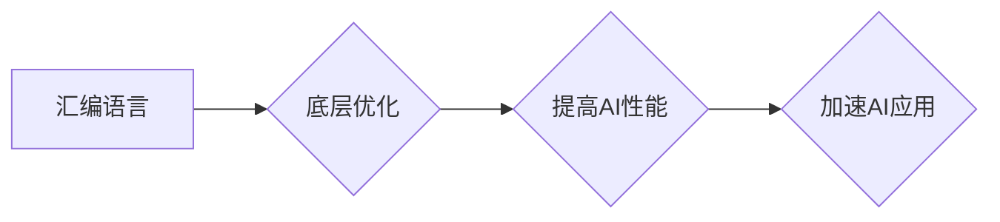

                 

## 汇编语言与AI：底层优化的艺术

> 关键词：汇编语言、AI、机器学习、底层优化、性能提升、算法效率、硬件架构、计算机体系结构

## 1. 背景介绍

人工智能（AI）正以惊人的速度发展，其应用领域不断扩展，从自动驾驶到医疗诊断，再到自然语言处理，AI正在改变着我们的世界。然而，随着AI模型规模的不断增长，对计算资源的需求也越来越高。为了实现更高效、更快速的AI推理，深入理解底层硬件架构和优化算法至关重要。汇编语言作为一种接近硬件的编程语言，为AI开发者提供了强大的工具，可以实现对底层资源的精细控制，从而提升AI模型的性能。

## 2. 核心概念与联系

### 2.1 汇编语言与AI

汇编语言是一种低级编程语言，直接映射到计算机的指令集架构（ISA）。它允许程序员直接操作寄存器、内存地址和控制流，从而实现对硬件资源的精细控制。

AI算法，特别是深度学习算法，通常需要大量的计算和数据处理。汇编语言可以帮助优化这些计算密集型任务，提高算法的执行效率。

### 2.2  底层优化与AI性能

底层优化是指针对特定硬件架构进行的代码优化，以提高程序的执行速度和效率。

在AI领域，底层优化可以应用于以下方面：

* **矩阵运算优化:** 深度学习算法的核心是矩阵运算，汇编语言可以优化矩阵乘法、求逆等操作，提高计算速度。
* **数据传输优化:** AI模型的训练和推理需要大量数据传输，汇编语言可以优化数据访问模式，减少内存访问时间。
* **指令调度优化:** 汇编语言可以利用指令级并行和分支预测等技术，提高指令执行效率。

### 2.3  硬件架构与AI性能

不同的硬件架构对AI算法的性能有不同的影响。例如，GPU（图形处理单元）拥有并行计算能力，非常适合深度学习算法的训练和推理。

汇编语言可以利用硬件的特定特性，例如GPU的并行计算能力，进一步提高AI算法的性能。

**Mermaid 流程图**



## 3. 核心算法原理 & 具体操作步骤

### 3.1  算法原理概述

汇编语言的底层优化主要通过以下几个方面实现：

* **指令级并行:** 利用CPU的多核架构，同时执行多个指令，提高指令吞吐量。
* **分支预测:** 预测程序执行分支的走向，提前加载相关指令，减少分支跳转的延迟。
* **数据缓存优化:** 利用缓存机制，减少内存访问时间，提高数据访问速度。
* **寄存器优化:** 尽可能利用寄存器存储数据，减少内存访问次数。

### 3.2  算法步骤详解

1. **分析目标代码:** 首先需要对目标代码进行分析，了解其执行流程、数据依赖关系和关键计算部分。
2. **识别优化机会:** 根据代码分析结果，识别出可以进行底层优化的机会，例如循环、分支、数据访问等。
3. **选择优化策略:** 根据目标硬件架构和代码特性，选择合适的优化策略，例如指令级并行、分支预测、数据缓存优化等。
4. **进行代码修改:** 根据选择的优化策略，对代码进行修改，例如添加指令级并行指令、修改分支预测策略、优化数据访问模式等。
5. **测试和验证:** 对修改后的代码进行测试和验证，确保优化后的代码能够正确执行，并且性能得到提升。

### 3.3  算法优缺点

**优点:**

* **性能提升:** 汇编语言的底层优化可以显著提高AI算法的执行速度和效率。
* **资源利用率:** 汇编语言可以更有效地利用硬件资源，例如CPU和GPU。
* **可控性:** 汇编语言提供了对硬件资源的精细控制，可以针对特定硬件架构进行优化。

**缺点:**

* **复杂性:** 汇编语言的编程难度较高，需要深入了解硬件架构和指令集。
* **可维护性:** 汇编语言代码的可维护性较差，修改和调试难度较大。
* **移植性:** 汇编语言代码的移植性较差，需要针对不同的硬件架构进行修改。

### 3.4  算法应用领域

汇编语言的底层优化在以下AI应用领域具有重要意义:

* **深度学习:** 优化深度学习模型的训练和推理速度，提高模型的效率。
* **计算机视觉:** 优化图像处理和识别算法，提高视觉系统的性能。
* **自然语言处理:** 优化文本处理和语言理解算法，提高自然语言处理系统的效率。
* **机器人控制:** 优化机器人运动控制算法，提高机器人的响应速度和精度。

## 4. 数学模型和公式 & 详细讲解 & 举例说明

### 4.1  数学模型构建

在汇编语言的底层优化中，可以使用数学模型来分析和优化代码的执行时间和资源利用率。例如，可以使用以下数学模型来分析循环的执行时间:

$$T = n \cdot I$$

其中:

* $T$ 表示循环的执行时间
* $n$ 表示循环的迭代次数
* $I$ 表示每次迭代的执行时间

### 4.2  公式推导过程

通过分析代码结构和指令集，可以推导出循环的执行时间公式。例如，对于一个简单的循环，每次迭代执行一个加法指令，可以推导出以下公式:

$$I = T_{add}$$

其中:

* $T_{add}$ 表示加法指令的执行时间

### 4.3  案例分析与讲解

假设一个循环需要执行1000次，每次迭代执行一个加法指令，加法指令的执行时间为10纳秒，则循环的执行时间为:

$$T = 1000 \cdot 10 ns = 10000 ns$$

如果可以通过汇编语言的优化手段，将每次迭代的执行时间减少到5纳秒，则循环的执行时间将减少为:

$$T = 1000 \cdot 5 ns = 5000 ns$$

## 5. 项目实践：代码实例和详细解释说明

### 5.1  开发环境搭建

为了进行汇编语言的底层优化实践，需要搭建一个合适的开发环境。

* **编译器:** 选择一个支持汇编语言编程的编译器，例如NASM、GAS等。
* **调试器:** 选择一个可以调试汇编语言代码的调试器，例如GDB等。
* **目标硬件:** 选择一个可以运行汇编语言代码的目标硬件平台，例如x86架构的PC机、ARM架构的嵌入式系统等。

### 5.2  源代码详细实现

以下是一个简单的汇编语言代码示例，用于计算两个整数的和:

```assembly
section .data
    num1 dd 10
    num2 dd 20

section .text
    global _start

_start:
    mov eax, [num1]
    add eax, [num2]
    mov [num1], eax
    mov eax, 1
    xor ebx, ebx
    int 0x80
```

### 5.3  代码解读与分析

* **section .data:** 定义数据段，存储变量num1和num2。
* **section .text:** 定义文本段，存储程序代码。
* **global _start:** 定义程序入口点。
* **_start:** 程序入口点，执行以下操作:
    * **mov eax, [num1]:** 将num1的值加载到寄存器eax中。
    * **add eax, [num2]:** 将num2的值加到eax中。
    * **mov [num1], eax:** 将结果存储到num1中。
    * **mov eax, 1:** 设置系统调用号为1，表示退出程序。
    * **xor ebx, ebx:** 清空ebx寄存器。
    * **int 0x80:** 调用系统中断，退出程序。

### 5.4  运行结果展示

运行上述汇编语言代码后，变量num1的值将变为30。

## 6. 实际应用场景

### 6.1  深度学习加速

汇编语言可以优化深度学习算法的矩阵运算，例如矩阵乘法、求逆等操作，从而提高模型的训练和推理速度。

### 6.2  图像处理优化

汇编语言可以优化图像处理算法，例如图像滤波、边缘检测等操作，提高图像处理的效率。

### 6.3  自然语言处理加速

汇编语言可以优化自然语言处理算法，例如文本分类、机器翻译等操作，提高自然语言处理的效率。

### 6.4  未来应用展望

随着AI技术的不断发展，汇编语言在AI领域的应用将更加广泛。例如，可以利用汇编语言优化AI模型的部署，使其能够在边缘设备上高效运行。

## 7. 工具和资源推荐

### 7.1  学习资源推荐

* **汇编语言教程:** 《汇编语言编程》
* **AI优化书籍:** 《深度学习优化》

### 7.2  开发工具推荐

* **编译器:** NASM、GAS
* **调试器:** GDB

### 7.3  相关论文推荐

* **汇编语言优化论文:** 《基于汇编语言的深度学习加速》
* **AI优化论文:** 《高效的深度学习模型优化方法》

## 8. 总结：未来发展趋势与挑战

### 8.1  研究成果总结

汇编语言的底层优化为AI算法的性能提升提供了强大的工具。通过深入理解硬件架构和优化算法，可以显著提高AI模型的执行速度和效率。

### 8.2  未来发展趋势

未来，汇编语言在AI领域的应用将更加广泛，例如：

* **AI模型部署优化:** 利用汇编语言优化AI模型的部署，使其能够在边缘设备上高效运行。
* **AI硬件加速:** 开发新的AI硬件，并利用汇编语言进行底层优化，进一步提高AI算法的性能。

### 8.3  面临的挑战

汇编语言的编程难度较高，需要深入了解硬件架构和指令集。此外，汇编语言代码的可维护性和移植性较差。

### 8.4  研究展望

未来研究方向包括：

* **开发更易于使用的汇编语言优化工具:** 降低汇编语言编程的门槛，使其更易于被广泛应用。
* **研究新的汇编语言优化算法:** 针对新的AI算法和硬件架构，开发更有效的优化算法。

## 9. 附录：常见问题与解答

### 9.1  汇编语言和C语言的区别是什么？

汇编语言是接近硬件的低级编程语言，直接映射到计算机的指令集架构（ISA）。C语言是高级编程语言，需要编译器将其翻译成汇编语言才能执行。

### 9.2  汇编语言的优缺点是什么？

**优点:**

* **性能提升:** 汇编语言可以实现对硬件资源的精细控制，提高程序的执行速度和效率。
* **资源利用率:** 汇编语言可以更有效地利用硬件资源，例如CPU和GPU。

**缺点:**

* **复杂性:** 汇编语言的编程难度较高，需要深入了解硬件架构和指令集。
* **可维护性:** 汇编语言代码的可维护性较差，修改和调试难度较大。
* **移植性:** 汇编语言代码的移植性较差，需要针对不同的硬件架构进行修改。

### 9.3  如何学习汇编语言？

学习汇编语言需要从基础知识开始，例如计算机体系结构、指令集架构等。可以参考一些汇编语言教程和书籍，并通过实践练习来巩固学习成果。


作者：禅与计算机程序设计艺术 / Zen and the Art of Computer Programming 
<end_of_turn>

