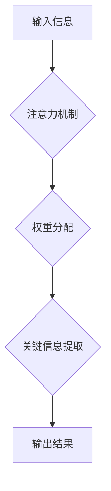
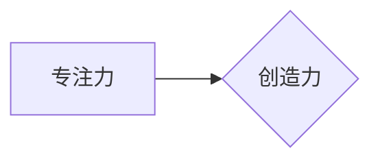

                 

## 注意力管理与创造力：如何在专注中激发灵感

> 关键词：注意力、创造力、专注、深度工作、认知科学、时间管理、效率、冥想、神经科学

## 1. 背景介绍

在当今信息爆炸的时代，我们面临着前所未有的信息冲击。来自手机、邮件、社交媒体的各种通知和信息不断地打断我们的思考，使得专注力变得稀缺而宝贵。然而，专注力正是创造力的基石。只有在专注的状态下，我们才能深入思考，产生新的想法，并将其转化为现实。

注意力管理与创造力之间的关系越来越受到人们的关注。越来越多的研究表明，专注力与创造力之间存在着密切的联系。专注力可以帮助我们排除干扰，将精力集中在特定任务上，从而提高创造力的发挥。反之，注意力涣散会导致思维混乱，难以产生新的想法。

## 2. 核心概念与联系

### 2.1 注意力机制

注意力机制是人工智能领域近年来发展迅速的热点方向之一。它模拟了人类大脑对信息进行选择性关注的机制，能够有效地提高模型的学习效率和性能。

注意力机制的核心思想是，在处理信息时，模型应该根据信息的 relevance 和 importance 进行权重分配，从而聚焦于关键信息，忽略无关信息。

**Mermaid 流程图:**



### 2.2 创造力与专注力的关系

创造力是指个体能够产生新颖、有价值的思想、概念或作品的能力。专注力则是指个体能够将注意力集中在特定任务或目标上，排除干扰的能力。

专注力是创造力的基础。只有在专注的状态下，我们才能深入思考，联想创新，产生新的想法。

**关系图:**



## 3. 核心算法原理 & 具体操作步骤

### 3.1 算法原理概述

注意力机制的算法原理主要基于以下几个方面：

* **注意力权重:**  注意力机制通过计算每个输入元素与目标元素之间的相关性，来确定每个元素的注意力权重。
* **加权求和:**  利用计算出的注意力权重，对输入元素进行加权求和，得到最终的输出结果。
* **可学习参数:**  注意力机制中的权重参数是可学习的，可以通过训练数据进行调整，以提高模型的性能。

### 3.2 算法步骤详解

1. **输入数据:**  将输入数据作为模型的输入。
2. **计算注意力权重:**  根据输入数据和目标元素之间的相关性，计算每个输入元素的注意力权重。常用的注意力计算方法包括点积注意力、加权求和注意力等。
3. **加权求和:**  利用计算出的注意力权重，对输入数据进行加权求和，得到最终的输出结果。
4. **输出结果:**  将加权求和后的结果作为模型的输出。

### 3.3 算法优缺点

**优点:**

* **提高模型的学习效率:**  注意力机制能够帮助模型聚焦于关键信息，提高学习效率。
* **提升模型的性能:**  注意力机制能够提高模型对复杂数据的理解能力，从而提升模型的性能。
* **解释性强:**  注意力机制能够提供对模型决策的解释性，帮助我们理解模型是如何工作的。

**缺点:**

* **计算复杂度高:**  注意力机制的计算复杂度较高，对于大规模数据处理可能存在效率问题。
* **参数量大:**  注意力机制的参数量较大，需要大量的训练数据才能有效训练。

### 3.4 算法应用领域

注意力机制在人工智能领域有着广泛的应用，例如：

* **自然语言处理:**  机器翻译、文本摘要、问答系统等。
* **计算机视觉:**  图像识别、目标检测、图像 Captioning 等。
* **语音识别:**  语音转文本、语音合成等。

## 4. 数学模型和公式 & 详细讲解 & 举例说明

### 4.1 数学模型构建

注意力机制的数学模型通常基于以下公式：

**注意力权重计算公式:**

$$
\alpha_{ij} = \frac{\exp(e_{ij})}{\sum_{k=1}^{n} \exp(e_{ik})}
$$

其中：

* $\alpha_{ij}$ 表示输入元素 $i$ 对目标元素 $j$ 的注意力权重。
* $e_{ij}$ 表示输入元素 $i$ 和目标元素 $j$ 之间的相关性得分。
* $n$ 表示输入元素的总数。

**加权求和公式:**

$$
\mathbf{c} = \sum_{i=1}^{n} \alpha_{ij} \mathbf{x}_i
$$

其中：

* $\mathbf{c}$ 表示最终的输出结果。
* $\mathbf{x}_i$ 表示输入元素 $i$ 的向量表示。

### 4.2 公式推导过程

注意力权重计算公式的推导过程基于 softmax 函数，其目的是将相关性得分转化为概率分布，使得每个输入元素的注意力权重在 0 到 1 之间，且所有权重的总和为 1。

加权求和公式则将每个输入元素的向量表示与其对应的注意力权重相乘，并求和得到最终的输出结果。

### 4.3 案例分析与讲解

例如，在机器翻译任务中，注意力机制可以帮助模型关注源语言中与目标语言中特定词语相关的词语，从而提高翻译的准确性。

## 5. 项目实践：代码实例和详细解释说明

### 5.1 开发环境搭建

* Python 3.x
* TensorFlow 或 PyTorch

### 5.2 源代码详细实现

```python
import tensorflow as tf

# 定义注意力机制层
class AttentionLayer(tf.keras.layers.Layer):
    def __init__(self, units):
        super(AttentionLayer, self).__init__()
        self.W1 = tf.keras.layers.Dense(units)
        self.W2 = tf.keras.layers.Dense(units)
        self.V = tf.keras.layers.Dense(1)

    def call(self, inputs):
        # 计算注意力权重
        scores = self.V(tf.nn.tanh(self.W1(inputs) + self.W2(inputs)))
        attention_weights = tf.nn.softmax(scores, axis=-1)
        # 加权求和
        context_vector = tf.matmul(attention_weights, inputs)
        return context_vector
```

### 5.3 代码解读与分析

* `AttentionLayer` 类定义了一个注意力机制层。
* `W1` 和 `W2` 是两个全连接层，用于计算输入元素与目标元素之间的相关性得分。
* `V` 是一个全连接层，用于将相关性得分转化为注意力权重。
* `call` 方法实现注意力机制的计算过程，包括计算注意力权重和加权求和。

### 5.4 运行结果展示

运行上述代码，可以得到注意力机制的输出结果，并通过可视化工具观察注意力权重分布，从而了解模型是如何关注输入信息的。

## 6. 实际应用场景

### 6.1  深度学习模型

注意力机制在深度学习模型中广泛应用，例如：

* **Transformer 模型:**  Transformer 模型是近年来自然语言处理领域最成功的模型之一，其核心组件就是注意力机制。
* **Recurrent Neural Networks (RNNs):**  注意力机制可以用于改进 RNNs 的性能，解决梯度消失问题。

### 6.2  其他领域

注意力机制也应用于其他领域，例如：

* **计算机视觉:**  图像 Captioning、目标检测等。
* **语音识别:**  语音转文本、语音合成等。

### 6.3  未来应用展望

注意力机制的应用前景广阔，未来可能在以下领域得到更广泛的应用：

* **个性化推荐:**  根据用户的兴趣和行为，推荐个性化的内容。
* **医疗诊断:**  分析患者的病历和影像数据，辅助医生进行诊断。
* **自动驾驶:**  帮助自动驾驶汽车更好地感知周围环境。

## 7. 工具和资源推荐

### 7.1 学习资源推荐

* **书籍:**

    * 《深度学习》
    * 《Attention Is All You Need》

* **在线课程:**

    * Coursera: 深度学习
    * Udacity: 自然语言处理

### 7.2 开发工具推荐

* **TensorFlow:**  开源深度学习框架。
* **PyTorch:**  开源深度学习框架。

### 7.3 相关论文推荐

* 《Attention Is All You Need》
* 《BERT: Pre-training of Deep Bidirectional Transformers for Language Understanding》

## 8. 总结：未来发展趋势与挑战

### 8.1 研究成果总结

注意力机制在人工智能领域取得了显著的成果，提高了模型的性能和效率，并为我们理解人类认知提供了新的视角。

### 8.2 未来发展趋势

未来，注意力机制的研究将朝着以下方向发展：

* **更有效的注意力机制:**  设计更有效的注意力机制，提高模型的学习效率和性能。
* **自适应注意力机制:**  开发自适应注意力机制，能够根据不同的任务和数据自动调整注意力权重。
* **多模态注意力机制:**  研究多模态注意力机制，能够处理多种类型的输入数据，例如文本、图像、音频等。

### 8.3 面临的挑战

注意力机制也面临着一些挑战：

* **计算复杂度:**  注意力机制的计算复杂度较高，对于大规模数据处理可能存在效率问题。
* **参数量:**  注意力机制的参数量较大，需要大量的训练数据才能有效训练。
* **可解释性:**  注意力机制的决策过程相对复杂，难以解释模型是如何工作的。

### 8.4 研究展望

尽管面临着挑战，但注意力机制仍然是一个非常有前景的研究方向。相信随着研究的深入，注意力机制将取得更大的突破，为人工智能的发展做出更大的贡献。

## 9. 附录：常见问题与解答

### 9.1 什么是注意力机制？

注意力机制是一种模仿人类大脑对信息进行选择性关注的机制，能够帮助模型聚焦于关键信息，提高学习效率和性能。

### 9.2 注意力机制的应用场景有哪些？

注意力机制在人工智能领域有着广泛的应用，例如自然语言处理、计算机视觉、语音识别等。

### 9.3 注意力机制的优缺点是什么？

注意力机制的优点是能够提高模型的学习效率和性能，并提供对模型决策的解释性。缺点是计算复杂度高，参数量大，可解释性相对较低。


作者：禅与计算机程序设计艺术 / Zen and the Art of Computer Programming 
<end_of_turn>

