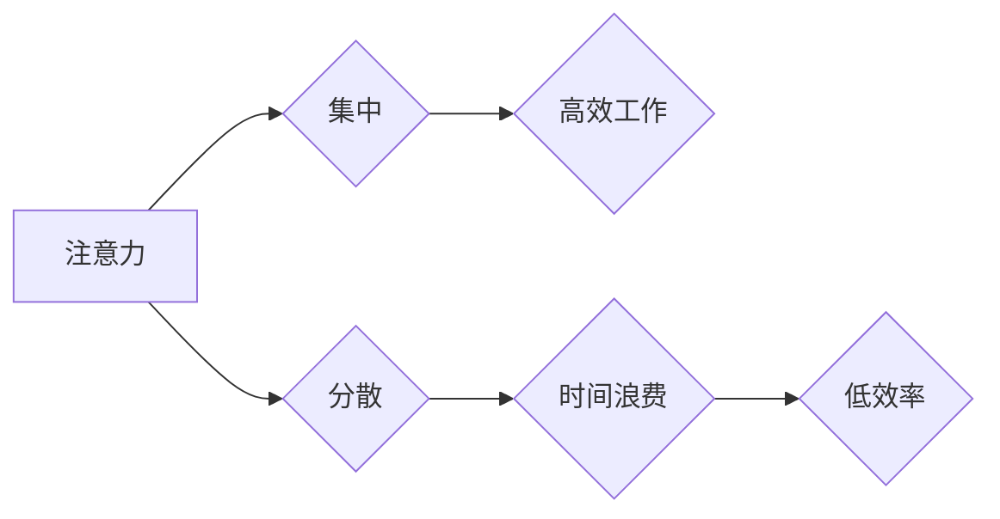

                 

## 1. 背景介绍

在当今信息爆炸的时代，我们面临着前所未有的信息量和工作压力。如何有效地管理注意力，提高时间利用率，成为每个IT从业者都必须面对的挑战。 

传统的“时间管理”方法往往侧重于安排时间，但忽略了注意力本身的重要性。注意力是认知的核心，它决定了我们能够专注于什么，并从中获得最大价值。 

因此，我们需要将注意力管理与时间管理相结合，构建一个更加高效的个人工作体系。

## 2. 核心概念与联系

### 2.1 注意力与时间管理的联系

注意力管理与时间管理是相互关联的，它们共同影响着我们的工作效率和生活质量。

* **注意力**是认知资源的分配，它决定了我们能够集中精力处理哪些信息，并排除干扰。
* **时间**是有限的资源，我们需要合理分配时间，才能完成所有任务。

当注意力集中时，我们可以更有效地利用时间，完成更高质量的工作。反之，注意力分散会导致时间浪费，效率低下。

**Mermaid 流程图：**



### 2.2 核心概念

* **专注力:**  持续地将注意力集中在一个特定任务或目标上，排除干扰的能力。
* **注意力 span:**  一次能够持续专注于某一任务的时间长度。
* **认知负荷:**  大脑处理信息的能力，当认知负荷过高时，注意力容易分散。
* **干扰:**  任何阻碍我们集中注意力的因素，例如手机通知、社交媒体、噪音等。

## 3. 核心算法原理 & 具体操作步骤

### 3.1 算法原理概述

注意力管理与时间管理的优化是一个复杂的系统工程，需要结合多种算法和策略。 

以下是一些常用的算法和策略：

* **番茄工作法:** 将工作时间划分为25分钟的间隔，每个间隔之间休息5分钟，可以有效提高专注力。
* **时间阻塞法:** 将一天的时间预先分配给不同的任务，并严格执行计划，可以有效提高时间利用率。
* **Eisenhower 矩阵:** 将任务按照重要性和紧急程度进行分类，可以帮助我们优先处理重要任务。
* **Pomodoro Technique:**  将工作时间划分为25分钟的间隔，每个间隔之间休息5分钟，可以有效提高专注力。

### 3.2 算法步骤详解

**番茄工作法:**

1. 选择一个需要专注完成的任务。
2. 设置一个番茄钟，计时25分钟。
3. 在计时期间，全神贯注地完成任务，尽量排除所有干扰。
4. 当番茄钟响时，休息5分钟。
5. 重复步骤2-4，完成4个番茄钟后，休息15-20分钟。

**时间阻塞法:**

1. 将一天的时间预先分配给不同的任务，例如上午处理邮件，下午编写代码。
2. 在每个时间块内，只专注于预先分配的任务，避免被打扰。
3. 严格执行计划，不要随意改变时间分配。

**Eisenhower 矩阵:**

1. 列出所有需要完成的任务。
2. 将任务按照重要性和紧急程度进行分类，分为四个象限：
    * **重要且紧急:** 立即处理。
    * **重要但不紧急:**  安排时间处理。
    * **紧急但不重要:**  委派他人处理。
    * **不重要也不紧急:**  删除或忽略。

### 3.3 算法优缺点

**番茄工作法:**

* **优点:**  简单易行，可以有效提高专注力，避免过度疲劳。
* **缺点:**  对于一些需要长时间思考的任务可能不太适用。

**时间阻塞法:**

* **优点:**  可以有效提高时间利用率，避免任务拖延。
* **缺点:**  需要提前规划，对突发事件的处理能力较弱。

**Eisenhower 矩阵:**

* **优点:**  可以帮助我们优先处理重要任务，提高工作效率。
* **缺点:**  需要花费时间进行分类，对于一些模糊的任务可能难以判断。

### 3.4 算法应用领域

这些算法可以应用于各种领域，例如：

* **软件开发:**  提高代码编写效率，减少错误。
* **学习:**  提高学习效率，更好地理解知识。
* **写作:**  提高写作效率，完成高质量的写作作品。
* **生活:**  提高时间利用率，更好地管理生活。

## 4. 数学模型和公式 & 详细讲解 & 举例说明

### 4.1 数学模型构建

注意力管理可以看作是一个动态平衡的过程，需要考虑多个因素的影响。我们可以用以下数学模型来描述注意力分配的过程：

$$
A(t) = \frac{I(t)}{C(t) + D(t)}
$$

其中：

* $A(t)$ 表示在时间 $t$ 时刻的注意力水平。
* $I(t)$ 表示在时间 $t$ 时刻的刺激强度。
* $C(t)$ 表示在时间 $t$ 时刻的认知负荷。
* $D(t)$ 表示在时间 $t$ 时刻的干扰强度。

### 4.2 公式推导过程

这个模型的推导过程基于以下假设：

* 注意力水平与刺激强度成正比。
* 注意力水平与认知负荷成反比。
* 注意力水平与干扰强度成反比。

根据这些假设，我们可以推导出上述公式。

### 4.3 案例分析与讲解

例如，当我们阅读一篇文章时，文章内容的刺激强度 $I(t)$ 会影响我们的注意力水平 $A(t)$。同时，我们的认知负荷 $C(t)$ 和周围环境的干扰强度 $D(t)$ 也会影响注意力水平。

如果文章内容比较有趣，刺激强度 $I(t)$ 高，而我们的认知负荷 $C(t)$ 和干扰强度 $D(t)$ 较低，那么我们的注意力水平 $A(t)$ 会比较高，我们可以更容易地集中注意力阅读文章。

反之，如果文章内容比较枯燥，刺激强度 $I(t)$ 低，或者我们的认知负荷 $C(t)$ 和干扰强度 $D(t)$ 高，那么我们的注意力水平 $A(t)$ 会比较低，容易分心。

## 5. 项目实践：代码实例和详细解释说明

### 5.1 开发环境搭建

为了更好地理解注意力管理与时间管理的实践，我们可以开发一个简单的应用程序来帮助我们记录和分析我们的注意力使用情况。

以下是一些常用的开发环境：

* **Python:**  Python 是一个非常流行的编程语言，它拥有丰富的库和框架，可以方便地开发各种应用程序。
* **JavaScript:**  JavaScript 是一个用于网页开发的编程语言，它可以与各种前端框架和库配合使用，开发交互式应用程序。
* **Android Studio:**  Android Studio 是 Android 应用开发的官方 IDE，可以方便地开发 Android 应用。
* **Xcode:**  Xcode 是 iOS 应用开发的官方 IDE，可以方便地开发 iOS 应用。

### 5.2 源代码详细实现

以下是一个使用 Python 开发的简单注意力记录应用程序的代码示例：

```python
import datetime

class AttentionRecord:
    def __init__(self):
        self.records = []

    def record_attention(self, task, duration):
        record = {
            "task": task,
            "duration": duration,
            "timestamp": datetime.datetime.now()
        }
        self.records.append(record)

    def show_records(self):
        for record in self.records:
            print(f"任务: {record['task']}, 时间: {record['duration']}分钟, 时间戳: {record['timestamp']}")

# 使用示例
record = AttentionRecord()
record.record_attention("写代码", 60)
record.record_attention("阅读文档", 30)
record.show_records()
```

### 5.3 代码解读与分析

这个代码示例定义了一个 `AttentionRecord` 类，用于记录注意力使用情况。

* `__init__` 方法初始化一个空记录列表 `records`。
* `record_attention` 方法记录一个新的注意力记录，包括任务名称、持续时间和时间戳。
* `show_records` 方法显示所有记录。

### 5.4 运行结果展示

运行这个代码示例，会输出以下类似的结果：

```
任务: 写代码, 时间: 60分钟, 时间戳: 2023-10-27 10:00:00.123456
任务: 阅读文档, 时间: 30分钟, 时间戳: 2023-10-27 10:00:30.123456
```

## 6. 实际应用场景

### 6.1 软件开发

注意力管理与时间管理对于软件开发至关重要。

* **提高代码编写效率:**  专注于代码编写，减少干扰，可以提高代码质量和编写速度。
* **减少错误:**  集中注意力可以帮助我们更好地理解代码逻辑，减少代码错误。
* **提高项目进度:**  合理安排时间，高效完成任务，可以帮助我们更快地完成项目。

### 6.2 学习

注意力管理与时间管理对于学习也非常重要。

* **提高学习效率:**  集中注意力可以帮助我们更好地理解知识，提高记忆效率。
* **减少学习疲劳:**  合理安排学习时间，避免过度疲劳，可以帮助我们保持学习动力。
* **更好地掌握知识:**  通过反复练习和回顾，可以帮助我们更好地掌握知识。

### 6.3 写作

注意力管理与时间管理对于写作也非常重要。

* **提高写作效率:**  集中注意力可以帮助我们更好地表达思想，提高写作速度。
* **提高写作质量:**  集中注意力可以帮助我们更好地组织语言，避免语法错误和逻辑混乱。
* **完成高质量的写作作品:**  合理安排写作时间，可以帮助我们完成高质量的写作作品。

### 6.4 未来应用展望

随着人工智能技术的不断发展，注意力管理与时间管理将会有更加广泛的应用场景。

* **个性化学习:**  根据用户的注意力特点，提供个性化的学习方案。
* **智能工作助手:**  帮助用户管理时间，提高工作效率。
* **注意力训练:**  通过游戏化和互动的方式，帮助用户提高注意力水平。

## 7. 工具和资源推荐

### 7.1 学习资源推荐

* **书籍:**
    * 《深度工作：规则、习惯和策略》
    * 《番茄工作法》
    * 《时间管理艺术》
* **网站:**
    * https://www.mindtools.com/
    * https://www.zenhabits.net/
    * https://www.lifehacker.com/

### 7.2 开发工具推荐

* **Python:**  PyCharm, VS Code
* **JavaScript:**  WebStorm, VS Code
* **Android Studio:**  Android Studio
* **Xcode:**  Xcode

### 7.3 相关论文推荐

* **Attention Is All You Need**
* **BERT: Pre-training of Deep Bidirectional Transformers for Language Understanding**
* **Transformer-XL: Attentive Language Models Beyond a Fixed-Length Context**

## 8. 总结：未来发展趋势与挑战

### 8.1 研究成果总结

注意力管理与时间管理的研究取得了显著进展，已经形成了较为完善的理论体系和实践方法。

* **注意力机制:**  注意力机制在深度学习领域取得了巨大成功，为注意力管理提供了新的思路和方法。
* **时间管理策略:**  番茄工作法、时间阻塞法等时间管理策略已经被广泛应用，并取得了良好的效果。

### 8.2 未来发展趋势

未来，注意力管理与时间管理的研究将朝着以下方向发展：

* **个性化注意力管理:**  根据用户的注意力特点，提供个性化的注意力管理方案。
* **智能注意力辅助:**  利用人工智能技术，开发智能注意力辅助工具，帮助用户提高注意力水平。
* **注意力训练:**  通过游戏化和互动的方式，开发注意力训练工具，帮助用户提高注意力能力。

### 8.3 面临的挑战

注意力管理与时间管理的研究也面临着一些挑战：

* **注意力机制的复杂性:**  注意力机制的原理和实现方式比较复杂，需要进一步深入研究。
* **个体差异:**  每个人的注意力特点和时间管理习惯都不同，需要开发更加灵活和个性化的解决方案。
* **干扰因素:**  现代社会充满了各种干扰因素，如何有效地排除干扰，提高注意力水平是一个重要的挑战。

### 8.4 研究展望

尽管面临着挑战，但注意力管理与时间管理的研究前景依然广阔。

相信随着技术的不断发展，我们将会开发出更加有效的注意力管理与时间管理方法，帮助人们更好地利用时间，提高工作效率，提升生活质量。

## 9. 附录：常见问题与解答

**Q1: 如何提高注意力水平？**

**A1:**  

* **番茄工作法:**  将工作时间划分为25分钟的间隔，每个间隔之间休息5分钟。
* **时间阻塞法:**  将一天的时间预先分配给不同的任务。
* **Eisenhower 矩阵:**  将任务按照重要性和紧急程度进行分类。
* **冥想:**  通过冥想练习，可以训练注意力和专注力。
* **充足的睡眠:**  保证充足的睡眠可以提高注意力水平。

**Q2: 如何合理安排时间？**

**A2:**

* **制定计划:**  每天制定计划，明确需要完成的任务。
* **优先级排序:**  根据任务的重要性，进行优先级排序。
* **时间分配:**  合理分配时间，确保每个任务有足够的时间完成。
* **避免拖延:**  及时完成任务，避免拖延。
* **休息时间:**  安排适当的休息时间，避免过度疲劳。


作者：禅与计算机程序设计艺术 / Zen and the Art of Computer Programming 
<end_of_turn>

