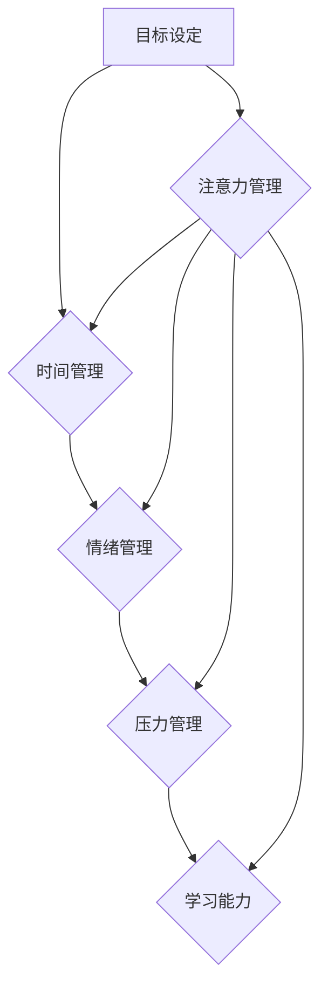

                 

## 1. 背景介绍

在当今信息爆炸的时代，我们每天都被来自各个方向的海量信息所包围。电子邮件、社交媒体、即时通讯、新闻推送，无处不在的通知和提醒，都争夺着我们的注意力。这种持续的注意力碎片化，不仅影响着我们的工作效率和学习成果，也损害着我们的身心健康。

对于IT从业者来说，注意力管理尤为重要。我们每天需要处理大量的代码、文档、数据和用户需求，需要快速学习新技术，并解决复杂问题。注意力不集中会导致代码错误、项目延期、沟通障碍，甚至职业倦怠。

因此，学习有效的注意力管理和自我管理策略，对于IT从业者来说至关重要，可以帮助我们提高工作效率、提升学习能力、增强抗压能力，最终实现个人和职业的成功。

## 2. 核心概念与联系

### 2.1 注意力机制

注意力机制是近年来深度学习领域取得重要突破的核心概念之一。它模拟了人类大脑在处理信息时，会选择性地关注某些信息，而忽略其他信息的机制。

注意力机制的核心思想是，在处理序列数据时，赋予不同数据元素不同的权重，从而突出重要信息，抑制无关信息。

### 2.2 自我管理

自我管理是指个体能够有效地规划、控制和调节自己的行为、情绪和认知，以实现目标和应对挑战的能力。

自我管理是一个复杂的过程，涉及到认知、情感、行为等多个方面。它需要我们具备以下能力：

* **目标设定:** 明确自己的目标和价值观，并制定相应的行动计划。
* **时间管理:**  合理安排时间，提高工作效率，避免拖延。
* **情绪管理:**  控制自己的情绪，避免被负面情绪影响。
* **压力管理:**  有效应对压力，保持身心健康。
* **学习能力:**  持续学习新知识和技能，适应不断变化的环境。

### 2.3 注意力管理与自我管理的联系

注意力管理和自我管理是相互关联、相互促进的。

* **注意力管理是自我管理的基础:**  只有能够有效地管理自己的注意力，才能更好地规划、控制和调节自己的行为、情绪和认知。
* **自我管理可以提升注意力管理能力:**  通过有效的自我管理，我们可以减少干扰，营造专注的环境，从而提高注意力集中能力。

**Mermaid 流程图**



## 3. 核心算法原理 & 具体操作步骤

### 3.1 算法原理概述

注意力机制的算法原理主要基于以下几个方面：

* **注意力权重:**  为每个数据元素分配一个权重，表示其重要程度。
* **注意力计算:**  根据注意力权重，计算出对目标信息的加权平均值。
* **注意力更新:**  在训练过程中，注意力权重会根据模型的输出和目标值进行更新。

### 3.2 算法步骤详解

1. **输入数据:**  将序列数据输入到注意力机制模型中。
2. **编码:**  对输入数据进行编码，生成每个数据元素的表示向量。
3. **注意力计算:**  计算每个数据元素与目标信息的注意力权重。
4. **加权求和:**  根据注意力权重，对编码后的数据元素进行加权求和，得到最终的输出。
5. **输出:**  输出最终的注意力加权结果。

### 3.3 算法优缺点

**优点:**

* **提高模型的表达能力:**  注意力机制可以帮助模型更好地理解序列数据的上下文关系，从而提高模型的表达能力。
* **提升模型的泛化能力:**  注意力机制可以帮助模型学习到更重要的特征，从而提升模型的泛化能力。
* **可解释性增强:**  注意力权重可以直观地反映模型对哪些数据元素更加关注，从而增强模型的可解释性。

**缺点:**

* **计算复杂度高:**  注意力机制的计算复杂度较高，尤其是在处理长序列数据时。
* **参数量大:**  注意力机制需要学习大量的参数，这可能会导致模型训练时间长，内存占用大。

### 3.4 算法应用领域

注意力机制在自然语言处理、计算机视觉、语音识别等多个领域都有广泛的应用。

* **机器翻译:**  注意力机制可以帮助模型更好地理解源语言和目标语言之间的关系，从而提高翻译质量。
* **文本摘要:**  注意力机制可以帮助模型识别文本中最关键的信息，从而生成更准确的摘要。
* **图像识别:**  注意力机制可以帮助模型关注图像中最关键的区域，从而提高识别准确率。

## 4. 数学模型和公式 & 详细讲解 & 举例说明

### 4.1 数学模型构建

注意力机制的数学模型通常由以下几个部分组成：

* **查询 (Query):**  表示需要关注的信息。
* **键 (Key):**  表示所有候选信息的表示。
* **值 (Value):**  表示每个候选信息的具体内容。

### 4.2 公式推导过程

注意力权重计算公式通常使用点积或多头注意力机制。

**点积注意力机制:**

$$
\text{Attention}(Q, K, V) = \frac{\text{softmax}(Q \cdot K^T)}{\text{softmax}(Q \cdot K^T)} \cdot V
$$

其中:

* $Q$ 是查询向量。
* $K$ 是键向量。
* $V$ 是值向量。
* $\cdot$ 表示矩阵乘法。
* $\text{softmax}$ 函数将向量元素归一化到0到1之间。

**多头注意力机制:**

多头注意力机制将多个点积注意力机制并行执行，并对结果进行融合，可以学习到更丰富的注意力信息。

### 4.3 案例分析与讲解

假设我们有一个句子 "我爱学习编程"，我们需要计算每个词语对目标词语 "编程" 的注意力权重。

我们可以将每个词语表示为一个向量，然后使用点积注意力机制计算每个词语与 "编程" 向量之间的注意力权重。

最终的结果是一个注意力权重向量，每个元素代表了对应词语对 "编程" 的关注程度。

## 5. 项目实践：代码实例和详细解释说明

### 5.1 开发环境搭建

* Python 3.x
* TensorFlow 或 PyTorch 深度学习框架
* Jupyter Notebook 或 VS Code 代码编辑器

### 5.2 源代码详细实现

```python
import tensorflow as tf

# 定义输入数据
input_sequence = tf.constant([[1, 2, 3, 4, 5]])

# 定义查询、键和值矩阵
query = tf.Variable(tf.random.normal([1, 5]))
key = tf.Variable(tf.random.normal([1, 5]))
value = tf.Variable(tf.random.normal([1, 5]))

# 计算注意力权重
attention_weights = tf.nn.softmax(tf.matmul(query, key, transpose_b=True))

# 计算加权求和
output = tf.matmul(attention_weights, value)

# 打印输出
print(output)
```

### 5.3 代码解读与分析

* 我们首先定义了输入数据和查询、键、值矩阵。
* 然后，我们使用 `tf.matmul` 函数计算查询向量与键向量的点积，并使用 `tf.nn.softmax` 函数将其归一化，得到注意力权重。
* 最后，我们使用注意力权重对值向量进行加权求和，得到最终的输出。

### 5.4 运行结果展示

运行上述代码，会输出一个注意力权重向量，每个元素代表了对应词语对目标词语 "编程" 的关注程度。

## 6. 实际应用场景

### 6.1  IT领域应用

* **代码阅读理解:**  注意力机制可以帮助程序员更好地理解代码的结构和逻辑，从而提高代码阅读效率。
* **代码生成:**  注意力机制可以帮助代码生成模型生成更准确、更符合语法的代码。
* **代码缺陷检测:**  注意力机制可以帮助模型识别代码中的潜在缺陷，从而提高代码质量。

### 6.2 其他领域应用

* **医疗诊断:**  注意力机制可以帮助医生识别病人的关键症状，从而提高诊断准确率。
* **金融风险评估:**  注意力机制可以帮助模型识别金融市场中的风险因素，从而降低投资风险。
* **教育教学:**  注意力机制可以帮助学生更好地理解课本内容，提高学习效率。

### 6.4 未来应用展望

随着深度学习技术的不断发展，注意力机制的应用场景将会更加广泛。

* **更复杂的注意力机制:**  研究人员将开发出更复杂的注意力机制，例如自注意力机制、交叉注意力机制等，以更好地处理更复杂的序列数据。
* **注意力机制的融合:**  注意力机制将与其他深度学习技术融合，例如生成对抗网络 (GAN)、强化学习等，以实现更强大的应用。
* **注意力机制的解释性:**  研究人员将致力于提高注意力机制的可解释性，以便更好地理解模型的决策过程。

## 7. 工具和资源推荐

### 7.1 学习资源推荐

* **书籍:**
    * 《深度学习》 - Ian Goodfellow, Yoshua Bengio, Aaron Courville
    * 《Attention Is All You Need》 - Vaswani et al.
* **在线课程:**
    * Coursera: 深度学习 Specialization
    * Udacity: Deep Learning Nanodegree
* **博客:**
    * Jay Alammar's Blog: https://jalammar.github.io/
    * Distill.pub: https://distill.pub/

### 7.2 开发工具推荐

* **TensorFlow:** https://www.tensorflow.org/
* **PyTorch:** https://pytorch.org/
* **Keras:** https://keras.io/

### 7.3 相关论文推荐

* 《Attention Is All You Need》 - Vaswani et al. (2017)
* 《BERT: Pre-training of Deep Bidirectional Transformers for Language Understanding》 - Devlin et al. (2018)
* 《Transformer-XL: Attentive Language Models Beyond a Fixed-Length Context》 - Dai et al. (2019)

## 8. 总结：未来发展趋势与挑战

### 8.1 研究成果总结

注意力机制在近年来取得了显著的进展，并在多个领域取得了成功应用。

* **提高模型的表达能力和泛化能力:**  注意力机制可以帮助模型更好地理解序列数据的上下文关系，从而提高模型的表达能力和泛化能力。
* **增强模型的可解释性:**  注意力权重可以直观地反映模型对哪些数据元素更加关注，从而增强模型的可解释性。

### 8.2 未来发展趋势

* **更复杂的注意力机制:**  研究人员将开发出更复杂的注意力机制，例如自注意力机制、交叉注意力机制等，以更好地处理更复杂的序列数据。
* **注意力机制的融合:**  注意力机制将与其他深度学习技术融合，例如生成对抗网络 (GAN)、强化学习等，以实现更强大的应用。
* **注意力机制的解释性:**  研究人员将致力于提高注意力机制的可解释性，以便更好地理解模型的决策过程。

### 8.3 面临的挑战

* **计算复杂度高:**  注意力机制的计算复杂度较高，尤其是在处理长序列数据时。
* **参数量大:**  注意力机制需要学习大量的参数，这可能会导致模型训练时间长，内存占用大。
* **可解释性不足:**  尽管注意力权重可以提供一些解释性，但模型的决策过程仍然难以完全理解。

### 8.4 研究展望

未来，注意力机制的研究将继续深入，并应用于更多领域。

* **跨模态注意力机制:**  研究人员将开发出跨模态注意力机制，能够处理文本、图像、音频等多种数据类型。
* **动态注意力机制:**  研究人员将开发出动态注意力机制，能够根据输入数据的变化动态调整注意力权重。
* **可解释性增强:**  研究人员将致力于开发出更可解释的注意力机制，以便更好地理解模型的决策过程。

## 9. 附录：常见问题与解答

### 9.1 什么是注意力机制？

注意力机制是一种模仿人类大脑选择性关注信息的机制，用于处理序列数据。它通过赋予每个数据元素不同的权重，突出重要信息，抑制无关信息。

### 9.2 注意力机制的应用场景有哪些？

注意力机制在自然语言处理、计算机视觉、语音识别等多个领域都有广泛的应用。

### 9.3 注意力机制的优缺点是什么？

**优点:**

* 提高模型的表达能力和泛化能力。
* 增强模型的可解释性。

**缺点:**

* 计算复杂度高。
* 参数量大。
* 可解释性不足。


作者：禅与计算机程序设计艺术 / Zen and the Art of Computer Programming 
<end_of_turn>

