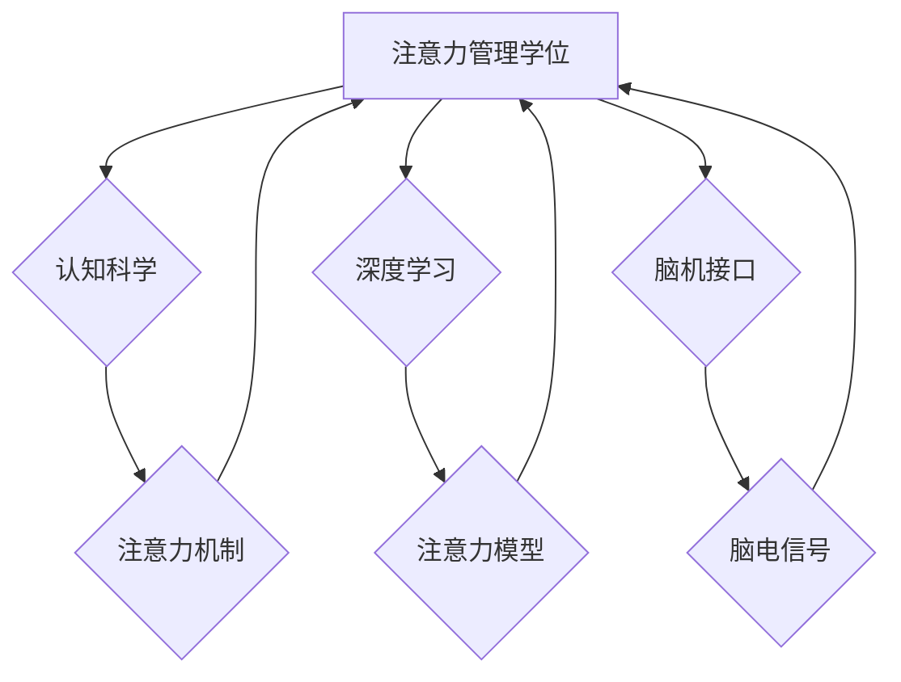

                 

## 注意力管理学位:提升全球脑参与效率的高等教育

> 关键词：注意力、认知科学、深度学习、神经网络、脑机接口、效率提升、高等教育、未来学习

## 1. 背景介绍

在当今信息爆炸的时代，人类面临着前所未有的认知挑战。信息过载、多任务处理、注意力分散等问题日益突出，严重影响着人们的工作效率、学习成果和生活质量。如何有效地管理注意力，提升认知效率，已成为当今社会亟待解决的关键问题。

传统教育模式往往侧重于知识传授和技能训练，而对注意力管理的重视程度相对较低。然而，随着人工智能、脑科学等领域的快速发展，我们开始认识到注意力管理的重要性，并探索新的教育模式和技术手段来提升人类认知效率。

## 2. 核心概念与联系

### 2.1 注意力机制

注意力机制是机器学习领域近年来发展迅速的关键技术之一，它模拟了人类大脑对重要信息进行选择性关注的机制。注意力机制的核心思想是，在处理信息时，并非所有信息都具有同等重要性，我们可以通过赋予不同信息不同的权重，从而提高对重要信息的处理效率。

### 2.2 认知科学与注意力

认知科学研究人类思维、学习、记忆等认知过程，注意力是认知过程中的一个重要组成部分。认知科学研究表明，注意力是一个动态、可塑的认知能力，受多种因素影响，包括个体差异、环境刺激、任务要求等。

### 2.3  注意力管理与高等教育

注意力管理在高等教育中具有重要意义。学生在学习过程中需要集中注意力，理解和记忆知识，而注意力分散会导致学习效率低下。因此，提升学生注意力管理能力，可以有效提高他们的学习效果和学术成就。

**注意力管理学位与认知科学、深度学习、脑机接口的联系**



## 3. 核心算法原理 & 具体操作步骤

### 3.1  算法原理概述

注意力管理算法的核心是模拟人类大脑的注意力机制，通过赋予不同信息不同的权重，提高对重要信息的处理效率。常见的注意力机制包括：

* **自注意力机制 (Self-Attention):**  用于处理序列数据，例如文本和语音，可以捕捉序列中不同元素之间的关系。
* **交叉注意力机制 (Cross-Attention):** 用于处理多个序列之间的关系，例如机器翻译和文本摘要。
* **位置感知注意力机制 (Positional Attention):**  用于处理顺序敏感的数据，例如自然语言，可以保留序列中元素的相对位置信息。

### 3.2  算法步骤详解

1. **输入数据预处理:** 将输入数据转换为算法可以处理的格式，例如将文本转换为词向量。
2. **计算注意力权重:** 根据注意力机制的规则，计算每个元素的注意力权重，权重越高表示该元素越重要。
3. **加权求和:** 将每个元素与其注意力权重相乘，然后求和，得到最终的输出。

### 3.3  算法优缺点

**优点:**

* 可以有效提高对重要信息的处理效率。
* 可以捕捉序列中不同元素之间的关系。
* 在自然语言处理、计算机视觉等领域取得了显著的成果。

**缺点:**

* 计算复杂度较高，训练时间较长。
* 对数据规模和质量要求较高。
* 难以解释注意力权重的生成机制。

### 3.4  算法应用领域

注意力机制在人工智能领域广泛应用，例如：

* **自然语言处理:** 机器翻译、文本摘要、问答系统、情感分析等。
* **计算机视觉:** 图像分类、目标检测、图像分割等。
* **语音识别:** 语音转文本、语音合成等。
* **推荐系统:** 商品推荐、内容推荐等。

## 4. 数学模型和公式 & 详细讲解 & 举例说明

### 4.1  数学模型构建

注意力机制的数学模型通常基于加权求和的思想。假设我们有一个序列 $X = \{x_1, x_2, ..., x_n\}$，其中每个元素 $x_i$ 代表一个输入。我们希望计算每个元素 $x_i$ 的注意力权重 $a_i$，然后根据这些权重对序列进行加权求和，得到最终的输出 $y$。

### 4.2  公式推导过程

注意力权重 $a_i$ 通常通过一个注意力函数计算，该函数接受两个输入：

* $x_i$: 当前元素
* $z$: 其他元素的表示

注意力函数的输出是一个标量，表示 $x_i$ 对 $z$ 的注意力程度。常见的注意力函数包括：

* **点积注意力:** $a_i = \frac{exp(x_i^T z)}{\sum_{j=1}^{n} exp(x_j^T z)}$

* **多头注意力:** 将多个点积注意力函数组合起来，可以学习到不同层次的注意力关系。

最终的输出 $y$ 可以通过对每个元素 $x_i$ 的加权求和得到：

$y = \sum_{i=1}^{n} a_i x_i$

### 4.3  案例分析与讲解

例如，在机器翻译任务中，输入是一个源语言句子，输出是一个目标语言句子。注意力机制可以帮助模型关注源语言句子中与目标语言句子每个词语相关的部分，从而提高翻译的准确性。

## 5. 项目实践：代码实例和详细解释说明

### 5.1  开发环境搭建

* Python 3.7+
* TensorFlow 2.0+
* PyTorch 1.0+
* Jupyter Notebook

### 5.2  源代码详细实现

```python
import tensorflow as tf

# 定义一个简单的注意力机制
def attention_mechanism(query, key, value, mask=None):
    # 计算注意力权重
    scores = tf.matmul(query, key, transpose_b=True)
    if mask is not None:
        scores += (1 - mask) * -1e9
    attention_weights = tf.nn.softmax(scores, axis=-1)
    # 计算加权求和
    context_vector = tf.matmul(attention_weights, value)
    return context_vector, attention_weights

# 示例使用
query = tf.random.normal([3, 4])
key = tf.random.normal([4, 4])
value = tf.random.normal([4, 8])
context_vector, attention_weights = attention_mechanism(query, key, value)
print(context_vector.shape)
print(attention_weights.shape)
```

### 5.3  代码解读与分析

* `attention_mechanism` 函数实现了一个简单的注意力机制。
* `scores` 计算了查询向量与键向量的点积，表示每个查询元素对每个键元素的注意力程度。
* `attention_weights` 通过 softmax 函数将 `scores` 转换为概率分布，表示每个查询元素对每个键元素的注意力权重。
* `context_vector` 通过对值向量进行加权求和，得到最终的上下文向量。

### 5.4  运行结果展示

运行上述代码，会输出 `context_vector` 和 `attention_weights` 的形状，分别为 `(3, 8)` 和 `(3, 4)`。

## 6. 实际应用场景

### 6.1  教育领域

* **个性化学习:** 根据学生的学习进度和兴趣，提供个性化的学习内容和练习。
* **注意力训练:** 通过游戏化和互动的方式，帮助学生提高注意力集中能力。
* **远程教育:** 利用注意力机制，提高远程教育的互动性和参与度。

### 6.2  医疗领域

* **疾病诊断:** 分析患者的脑电信号或其他生理数据，识别潜在的疾病风险。
* **康复训练:** 通过注意力训练，帮助患者恢复认知功能。
* **药物研发:** 利用注意力机制，加速药物研发过程。

### 6.3  商业领域

* **用户体验优化:** 分析用户的行为数据，提高网站和应用程序的用户体验。
* **广告精准投放:** 根据用户的注意力模式，精准投放广告。
* **市场营销:** 利用注意力机制，提高营销活动的有效性。

### 6.4  未来应用展望

随着人工智能和脑科学的不断发展，注意力管理技术将应用于更多领域，例如：

* **脑机接口:** 直接连接大脑和计算机，实现人机交互的新方式。
* **增强现实:** 利用注意力机制，增强现实体验的沉浸感和互动性。
* **虚拟现实:** 利用注意力机制，提高虚拟现实体验的真实感和临场感。

## 7. 工具和资源推荐

### 7.1  学习资源推荐

* **书籍:**
    * 《深度学习》 by Ian Goodfellow, Yoshua Bengio, Aaron Courville
    * 《Attention Is All You Need》 by Vaswani et al.
* **在线课程:**
    * Coursera: Deep Learning Specialization
    * Udacity: Deep Learning Nanodegree
* **博客和网站:**
    * TensorFlow Blog: https://blog.tensorflow.org/
    * PyTorch Blog: https://pytorch.org/blog/

### 7.2  开发工具推荐

* **TensorFlow:** https://www.tensorflow.org/
* **PyTorch:** https://pytorch.org/
* **Keras:** https://keras.io/

### 7.3  相关论文推荐

* **Attention Is All You Need:** https://arxiv.org/abs/1706.03762
* **BERT: Pre-training of Deep Bidirectional Transformers for Language Understanding:** https://arxiv.org/abs/1810.04805
* **Transformer-XL: Attentive Language Models Beyond a Fixed-Length Context:** https://arxiv.org/abs/1901.08316

## 8. 总结：未来发展趋势与挑战

### 8.1  研究成果总结

注意力机制在人工智能领域取得了显著的成果，并在自然语言处理、计算机视觉等领域得到了广泛应用。

### 8.2  未来发展趋势

* **更强大的注意力模型:** 研究更强大的注意力模型，例如多头注意力、自回归注意力等，提高模型的表达能力和泛化能力。
* **注意力机制的解释性:** 研究注意力机制的解释性，理解注意力权重是如何生成的，从而提高模型的可解释性和可信度。
* **注意力机制的应用拓展:** 将注意力机制应用于更多领域，例如医疗、教育、商业等，提升人类生活质量。

### 8.3  面临的挑战

* **计算复杂度:** 复杂的注意力机制计算复杂度较高，训练时间较长，需要更高效的算法和硬件支持。
* **数据规模:** 注意力机制对数据规模要求较高，需要大量的训练数据才能达到最佳效果。
* **伦理问题:** 注意力机制的应用可能引发一些伦理问题，例如数据隐私、算法偏见等，需要谨慎考虑和解决。

### 8.4  研究展望

未来，注意力管理技术将继续发展，并与其他人工智能技术相结合，例如深度学习、强化学习等，为人类社会带来更多创新和变革。


## 9. 附录：常见问题与解答

**Q1: 注意力机制和深度学习有什么关系？**

**A1:** 注意力机制是深度学习中的一种重要技术，它可以帮助模型更好地理解和处理序列数据。

**Q2: 注意力机制的应用场景有哪些？**

**A2:** 注意力机制的应用场景非常广泛，例如自然语言处理、计算机视觉、语音识别等。

**Q3: 如何评估注意力机制的性能？**

**A3:** 注意力机制的性能可以通过各种指标评估，例如准确率、召回率、F1-score等。

**Q4: 注意力机制有哪些局限性？**

**A4:** 注意力机制的局限性包括计算复杂度高、数据规模要求高、解释性差等。

**Q5: 未来注意力机制的发展趋势是什么？**

**A5:** 未来注意力机制的发展趋势包括更强大的模型、更好的解释性、更广泛的应用等。


作者：禅与计算机程序设计艺术 / Zen and the Art of Computer Programming 
<end_of_turn>

