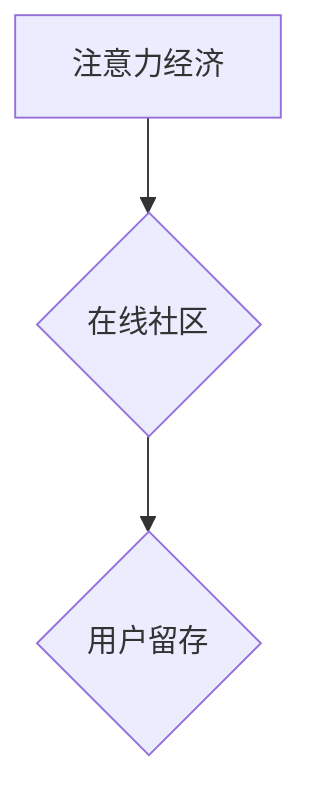

                 

##  注意力经济与在线社区建设指南：吸引并留住忠实的受众

> 关键词：注意力经济、在线社区、用户留存、内容策略、社区运营、算法推荐、用户体验、互动机制、数据分析

### 1. 背景介绍

在当今数字时代，信息爆炸和竞争日益激烈，人们的注意力成为最宝贵的资源。这便是“注意力经济”的核心概念。在线社区作为信息传播和用户互动的重要平台，如何在“注意力经济”中脱颖而出，吸引并留住忠实的受众，成为摆在社区运营者面前的重大挑战。

传统社区建设模式往往依赖于内容的质量和数量，但随着用户获取信息渠道的增多，单纯依靠内容难以有效吸引和留住用户。因此，我们需要深入理解“注意力经济”的原理，并将其应用于在线社区建设，才能构建出真正能够吸引和留住用户的社区。

### 2. 核心概念与联系

#### 2.1 注意力经济

注意力经济是指在信息过载的时代，人们的注意力成为最稀缺的资源，而能够有效获取和利用用户注意力的平台和内容能够获得更大的价值。

#### 2.2 在线社区

在线社区是指基于互联网平台，用户可以进行交流、分享、互动和协作的虚拟空间。

#### 2.3 用户留存

用户留存是指用户在使用社区后持续活跃和参与的程度。

**核心概念联系图:**



#### 2.4 核心概念原理

* **注意力经济的核心:**  人们的注意力是有限的，而信息是无限的。在信息过载的时代，如何有效获取和利用用户注意力成为关键。
* **在线社区的价值:** 在线社区为用户提供了一个平台，可以进行交流、分享、互动和协作，满足用户社交、学习、娱乐等需求。
* **用户留存的重要性:** 用户留存是衡量在线社区成功的重要指标。只有用户持续活跃和参与，社区才能获得长期的发展。

### 3. 核心算法原理 & 具体操作步骤

#### 3.1 算法原理概述

在线社区建设中，算法扮演着至关重要的角色，它可以帮助我们更好地理解用户行为，并提供个性化的内容推荐和互动机制，从而提高用户留存率。

#### 3.2 算法步骤详解

1. **数据收集:** 收集用户行为数据，包括用户浏览记录、点赞、评论、分享等行为。
2. **数据清洗:** 对收集到的数据进行清洗和处理，去除无效数据和噪声数据。
3. **特征提取:** 从用户行为数据中提取特征，例如用户兴趣、偏好、活跃度等。
4. **模型训练:** 使用机器学习算法对用户特征进行建模，构建用户画像和行为预测模型。
5. **内容推荐:** 根据用户画像和行为预测模型，为用户推荐个性化的内容。
6. **互动机制:** 设计个性化的互动机制，例如私信、群组、话题讨论等，鼓励用户参与社区活动。
7. **数据分析:** 对用户行为数据进行分析，评估算法效果，并不断优化算法模型。

#### 3.3 算法优缺点

* **优点:** 
    * 个性化推荐: 算法可以根据用户的兴趣和偏好，推荐更符合用户需求的内容。
    * 提高用户留存: 个性化推荐和互动机制可以提高用户参与度和活跃度，从而提高用户留存率。
    * 数据驱动: 算法可以根据用户行为数据进行优化，不断提升推荐效果和用户体验。
* **缺点:** 
    * 数据依赖: 算法需要大量用户行为数据进行训练，否则效果难以保证。
    * 算法偏差: 算法模型可能会存在偏差，导致推荐结果不准确或不公平。
    * 用户隐私: 数据收集和分析可能会涉及用户隐私问题，需要谨慎处理。

#### 3.4 算法应用领域

* 内容推荐系统
* 社交网络平台
* 电子商务平台
* 在线教育平台
* 游戏平台

### 4. 数学模型和公式 & 详细讲解 & 举例说明

#### 4.1 数学模型构建

在线社区用户留存模型可以采用马尔科夫链模型进行构建。马尔科夫链模型假设用户在每个时间点的状态只依赖于前一个时间点的状态，而与之前的时间点无关。

#### 4.2 公式推导过程

用户留存率可以表示为：

$$
L(t) = \frac{N(t)}{N(0)}
$$

其中：

* $L(t)$ 表示时间 $t$ 时刻的用户留存率。
* $N(t)$ 表示时间 $t$ 时刻的用户数量。
* $N(0)$ 表示初始用户数量。

#### 4.3 案例分析与讲解

假设一个在线社区初始用户数量为 1000 人，经过 30 天后，用户数量减少到 500 人，则用户留存率为：

$$
L(30) = \frac{500}{1000} = 0.5
$$

这意味着在 30 天内，该社区的用户留存率为 50%。

### 5. 项目实践：代码实例和详细解释说明

#### 5.1 开发环境搭建

* 语言: Python
* 库: Pandas, Scikit-learn, TensorFlow

#### 5.2 源代码详细实现

```python
# 导入必要的库
import pandas as pd
from sklearn.model_selection import train_test_split
from sklearn.linear_model import LogisticRegression

# 加载用户行为数据
data = pd.read_csv('user_behavior.csv')

# 提取特征和目标变量
features = ['age', 'gender', 'interests', 'activity']
target = 'retention'

# 将数据分为训练集和测试集
X_train, X_test, y_train, y_test = train_test_split(data[features], data[target], test_size=0.2)

# 训练逻辑回归模型
model = LogisticRegression()
model.fit(X_train, y_train)

# 评估模型性能
accuracy = model.score(X_test, y_test)
print('模型准确率:', accuracy)

# 使用模型预测用户留存
predictions = model.predict(X_test)
```

#### 5.3 代码解读与分析

* 代码首先导入必要的库，然后加载用户行为数据。
* 提取特征和目标变量，将数据分为训练集和测试集。
* 使用逻辑回归模型训练用户留存预测模型。
* 评估模型性能，并使用模型预测用户留存。

#### 5.4 运行结果展示

运行结果会显示模型的准确率，以及模型预测的用户留存情况。

### 6. 实际应用场景

#### 6.1 社区内容推荐

根据用户的兴趣和行为数据，推荐个性化的内容，提高用户参与度和留存率。

#### 6.2 用户互动机制设计

设计个性化的互动机制，例如私信、群组、话题讨论等，鼓励用户参与社区活动。

#### 6.3 社区运营策略优化

根据用户行为数据分析，优化社区运营策略，例如内容发布频率、活动策划等。

#### 6.4 未来应用展望

* **人工智能驱动的社区运营:** 利用人工智能技术，实现更智能化的社区运营，例如自动回复用户问题、识别恶意用户等。
* **虚拟现实和增强现实技术的应用:** 将虚拟现实和增强现实技术应用于社区建设，打造更沉浸式的用户体验。
* **元宇宙社区:** 在元宇宙中构建虚拟社区，为用户提供更丰富的互动和体验。

### 7. 工具和资源推荐

#### 7.1 学习资源推荐

* **书籍:**
    * 《注意力经济》
    * 《社区运营实战指南》
* **在线课程:**
    * Coursera: 数据科学
    * Udemy: 社区运营

#### 7.2 开发工具推荐

* **数据分析工具:** Pandas, Scikit-learn
* **机器学习框架:** TensorFlow, PyTorch
* **社区平台:** Discourse, NodeBB

#### 7.3 相关论文推荐

* **用户留存模型研究:**
    * "A Survey of User Retention Models"
    * "Predicting User Retention in Online Communities"
* **内容推荐算法研究:**
    * "Collaborative Filtering for Recommender Systems"
    * "Content-Based Recommendation Systems"

### 8. 总结：未来发展趋势与挑战

#### 8.1 研究成果总结

* **注意力经济与在线社区建设:** 深入理解注意力经济原理，并将其应用于在线社区建设，可以有效吸引和留住用户。
* **算法驱动社区运营:** 利用算法技术，可以实现更智能化的社区运营，提高用户体验和社区活跃度。
* **多元化社区形态:** 未来社区形态将更加多元化，例如虚拟现实社区、元宇宙社区等。

#### 8.2 未来发展趋势

* **人工智能驱动的社区运营:** 利用人工智能技术，实现更智能化的社区运营，例如自动回复用户问题、识别恶意用户等。
* **个性化社区体验:** 根据用户的兴趣和需求，提供更个性化的社区体验。
* **社区经济发展:** 社区将成为新的经济模式，例如社区电商、社区服务等。

#### 8.3 面临的挑战

* **数据隐私保护:** 社区运营需要收集大量用户数据，如何保护用户隐私是一个重要的挑战。
* **算法公平性:** 算法模型可能会存在偏差，导致推荐结果不公平，需要不断优化算法模型，确保算法公平性。
* **社区治理:** 如何有效治理社区，防止恶意行为和信息传播，是一个重要的挑战。

#### 8.4 研究展望

* **更精准的用户画像:** 利用更先进的机器学习算法，构建更精准的用户画像，为用户提供更个性化的服务。
* **更有效的社区治理机制:** 研究更有效的社区治理机制，防止恶意行为和信息传播，维护社区健康发展。
* **社区经济模式创新:** 探索新的社区经济模式，促进社区发展和用户价值创造。

### 9. 附录：常见问题与解答

#### 9.1 如何提高用户留存率？

* 提供高质量的内容和服务
* 设计个性化的互动机制
* 优化社区运营策略
* 利用算法技术进行精准推荐和运营

#### 9.2 如何保护用户隐私？

* 明确用户隐私政策，获得用户同意
* 加密用户数据，防止数据泄露
*  anonymize 用户数据，保护用户身份

#### 9.3 如何避免算法偏差？

* 使用多样化的训练数据
* 定期评估算法模型，识别和修正偏差
* 采用公平性算法设计原则


作者：禅与计算机程序设计艺术 / Zen and the Art of Computer Programming 
<end_of_turn>

