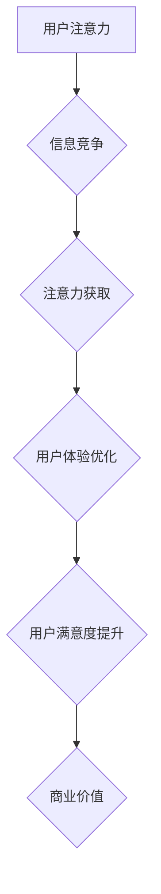

                 

##  注意力经济与用户体验优化：创建令人沉浸和上瘾的产品和服务

> 关键词：注意力经济、用户体验、产品设计、算法优化、沉浸式体验、上瘾设计、心理学、神经科学

### 1. 背景介绍

在当今信息爆炸的时代，人们面临着前所未有的信息过载。从社交媒体的推送通知到新闻网站的滚动条，无处不在的数字信息竞争着我们的注意力。在这种情况下，**注意力经济**应运而生，它将注意力视为一种稀缺资源，并探讨如何有效地获取、利用和管理这种资源。

对于产品和服务提供者而言，**用户体验 (UX)** 已经成为至关重要的竞争优势。用户体验是指用户与产品或服务交互时所感受到的整体感受，包括易用性、可用性、美观度、情感价值等。在注意力经济的背景下，优化用户体验变得尤为重要，因为只有能够抓住用户的注意力，才能留住用户，并最终转化为商业价值。

### 2. 核心概念与联系

**注意力经济**的核心概念是，注意力是有限的，而信息则无限。在信息过载的时代，人们的注意力受到来自各个方向的竞争，因此，如何有效地获取和利用用户注意力成为了一个关键问题。

**用户体验优化**则致力于通过设计和开发更人性化、更易用、更具吸引力的产品和服务，来提升用户对产品的满意度和忠诚度。

两者之间的联系在于，**注意力经济**为用户体验优化提供了理论基础，而**用户体验优化**则为**注意力经济**的实践提供了具体方法。

**Mermaid 流程图**



### 3. 核心算法原理 & 具体操作步骤

#### 3.1  算法原理概述

在用户体验优化中，许多算法被用于分析用户行为、预测用户需求和个性化推荐内容，从而提高用户注意力和参与度。

一些常见的算法包括：

* **推荐算法**: 基于用户的历史行为、偏好和兴趣，推荐相关的内容，例如电影、音乐、商品等。
* **个性化算法**: 根据用户的个人特征和行为，定制个性化的产品体验，例如个性化新闻推送、定制化商品推荐等。
* **A/B测试算法**: 通过比较不同版本的页面或功能，分析用户行为差异，选择最佳版本。
* **深度学习算法**: 利用深度神经网络，从海量用户数据中学习用户行为模式，进行更精准的预测和个性化推荐。

#### 3.2  算法步骤详解

以推荐算法为例，其基本步骤如下：

1. **数据收集**: 收集用户的行为数据，例如浏览历史、购买记录、评分反馈等。
2. **数据预处理**: 对收集到的数据进行清洗、转换和特征提取，以便于算法训练。
3. **模型训练**: 选择合适的推荐算法模型，并利用训练数据进行模型训练。
4. **模型评估**: 使用测试数据评估模型的性能，例如准确率、召回率等。
5. **模型部署**: 将训练好的模型部署到线上环境，用于实时推荐内容。

#### 3.3  算法优缺点

**优点**:

* **精准推荐**: 可以根据用户的兴趣和偏好，推荐更精准的内容，提高用户满意度。
* **个性化体验**: 可以根据用户的个人特征，定制个性化的产品体验，增强用户粘性。
* **数据驱动**: 基于海量用户数据，可以不断优化算法模型，提升推荐效果。

**缺点**:

* **数据依赖**: 推荐算法依赖于海量用户数据，如果数据质量不高或数据量不足，则会影响推荐效果。
* **算法黑盒**: 一些复杂的推荐算法模型，其内部机制难以理解，难以解释推荐结果。
* **隐私问题**: 收集和使用用户数据可能会引发隐私问题，需要谨慎处理。

#### 3.4  算法应用领域

推荐算法广泛应用于各个领域，例如：

* **电商**: 商品推荐、个性化营销
* **社交媒体**: 内容推荐、用户匹配
* **视频平台**: 视频推荐、用户画像
* **音乐平台**: 音乐推荐、个性化播放列表
* **新闻平台**: 新闻推荐、个性化订阅

### 4. 数学模型和公式 & 详细讲解 & 举例说明

#### 4.1  数学模型构建

推荐算法通常使用矩阵分解模型来构建数学模型。

**用户-物品交互矩阵**: 

用户-物品交互矩阵是一个二维矩阵，其中每一行代表一个用户，每一列代表一个物品，矩阵元素表示用户对物品的评分或交互行为。

**矩阵分解**:

将用户-物品交互矩阵分解成两个低维矩阵，分别代表用户特征矩阵和物品特征矩阵。

**公式**:

$$
R = U \cdot V^T
$$

其中：

* $R$ 是用户-物品交互矩阵
* $U$ 是用户特征矩阵
* $V^T$ 是物品特征矩阵的转置

#### 4.2  公式推导过程

通过最小化用户-物品交互矩阵与分解后的矩阵之间的误差，可以得到用户特征矩阵和物品特征矩阵的最佳解。

**误差函数**:

$$
Loss = \frac{1}{2} \sum_{u,i} (R_{ui} - \hat{R}_{ui})^2
$$

其中：

* $R_{ui}$ 是用户 $u$ 对物品 $i$ 的真实评分
* $\hat{R}_{ui}$ 是用户 $u$ 对物品 $i$ 的预测评分

**优化算法**:

使用梯度下降算法或其他优化算法，最小化误差函数，得到用户特征矩阵和物品特征矩阵的最佳解。

#### 4.3  案例分析与讲解

例如，在电影推荐系统中，用户特征矩阵可以表示用户的电影偏好，物品特征矩阵可以表示电影的类型、演员、导演等信息。通过矩阵分解，可以预测用户对特定电影的评分，并推荐用户可能感兴趣的电影。

### 5. 项目实践：代码实例和详细解释说明

#### 5.1  开发环境搭建

* Python 3.x
* TensorFlow 或 PyTorch 深度学习框架
* Pandas 数据处理库
* Scikit-learn 机器学习库

#### 5.2  源代码详细实现

```python
import tensorflow as tf

# 定义用户-物品交互矩阵
ratings = tf.constant([[5, 4, 3],
                      [4, 5, 2],
                      [3, 2, 5]])

# 定义用户特征矩阵和物品特征矩阵
user_factors = tf.Variable(tf.random.normal([3, 10]))
item_factors = tf.Variable(tf.random.normal([3, 10]))

# 计算预测评分
predictions = tf.matmul(user_factors, item_factors, transpose_b=True)

# 定义损失函数
loss = tf.reduce_mean(tf.square(ratings - predictions))

# 定义优化器
optimizer = tf.keras.optimizers.Adam()

# 训练模型
for epoch in range(100):
    with tf.GradientTape() as tape:
        loss_value = loss
    gradients = tape.gradient(loss_value, [user_factors, item_factors])
    optimizer.apply_gradients(zip(gradients, [user_factors, item_factors]))

# 打印训练结果
print(loss_value)
```

#### 5.3  代码解读与分析

* 代码首先定义了用户-物品交互矩阵，以及用户特征矩阵和物品特征矩阵。
* 然后，使用矩阵乘法计算预测评分。
* 定义了损失函数，并使用梯度下降算法进行模型训练。
* 训练完成后，打印损失值，评估模型性能。

#### 5.4  运行结果展示

训练完成后，可以观察损失值的变化趋势，判断模型是否收敛。

### 6. 实际应用场景

#### 6.1  电商推荐

电商平台利用推荐算法，根据用户的浏览历史、购买记录等数据，推荐相关商品，提高用户转化率。

#### 6.2  社交媒体个性化

社交媒体平台利用推荐算法，推荐用户可能感兴趣的内容，例如新闻、视频、帖子等，提高用户粘性。

#### 6.3  视频平台内容推荐

视频平台利用推荐算法，根据用户的观看历史、点赞记录等数据，推荐用户可能感兴趣的视频，提高用户观看时长。

#### 6.4  未来应用展望

随着人工智能技术的不断发展，用户体验优化将更加智能化、个性化和沉浸式。

* **增强现实 (AR) 和虚拟现实 (VR) 技术**: 将 AR 和 VR 技术应用于用户体验优化，创造更加沉浸式的体验。
* **自然语言处理 (NLP) 技术**: 利用 NLP 技术，更精准地理解用户的需求和意图，提供更个性化的服务。
* **情感识别技术**: 利用情感识别技术，分析用户的感受和情绪，提供更加人性化的服务。

### 7. 工具和资源推荐

#### 7.1  学习资源推荐

* **书籍**:
    * 《深度学习》
    * 《推荐系统实践》
    * 《用户体验设计》
* **在线课程**:
    * Coursera
    * edX
    * Udacity

#### 7.2  开发工具推荐

* **TensorFlow**: 开源深度学习框架
* **PyTorch**: 开源深度学习框架
* **Scikit-learn**: 机器学习库

#### 7.3  相关论文推荐

* **Collaborative Filtering for Implicit Feedback Datasets**
* **Deep Learning for Recommender Systems**
* **Attention Is All You Need**

### 8. 总结：未来发展趋势与挑战

#### 8.1  研究成果总结

注意力经济与用户体验优化是当今科技领域的重要研究方向。通过算法优化、数据分析和技术创新，可以创造更加令人沉浸和上瘾的产品和服务，提升用户满意度和商业价值。

#### 8.2  未来发展趋势

未来，用户体验优化将更加智能化、个性化和沉浸式。

* **人工智能 (AI) 技术**: AI 技术将进一步推动用户体验优化的发展，例如，利用机器学习和深度学习算法，更精准地预测用户需求和行为。
* **增强现实 (AR) 和虚拟现实 (VR) 技术**: AR 和 VR 技术将为用户体验创造更加沉浸式的体验，例如，利用 AR 技术，将虚拟信息叠加到现实世界中，为用户提供更加丰富的交互体验。
* **物联网 (IoT) 技术**: IoT 技术将为用户体验提供更加个性化和智能化的服务，例如，利用智能家居设备，根据用户的习惯和需求，自动调节环境温度、灯光等。

#### 8.3  面临的挑战

* **数据隐私**: 收集和使用用户数据可能会引发隐私问题，需要谨慎处理。
* **算法公平性**: 算法模型可能会存在偏见，导致不公平的结果，需要关注算法的公平性。
* **用户信任**: 用户需要信任产品和服务，才能愿意分享他们的数据和体验。

#### 8.4  研究展望

未来，用户体验优化将是一个充满机遇和挑战的领域。需要不断探索新的技术和方法，创造更加人性化、智能化和沉浸式的用户体验。

### 9. 附录：常见问题与解答

* **Q: 如何评估推荐算法的性能？**

* **A:** 推荐算法的性能通常使用准确率、召回率、NDCG 等指标进行评估。

* **Q: 如何解决推荐算法中的冷启动问题？**

* **A:** 冷启动问题是指对于新用户或新物品，推荐算法难以给出准确的推荐。可以采用一些方法解决，例如，利用用户的历史行为数据进行相似用户推荐，或者利用物品的特征信息进行物品聚类推荐。

* **Q: 如何保证推荐算法的公平性？**

* **A:** 

可以采用一些方法保证推荐算法的公平性，例如，使用公平性损失函数，或者对算法模型进行公平性评估。


作者：禅与计算机程序设计艺术 / Zen and the Art of Computer Programming 
<end_of_turn>

