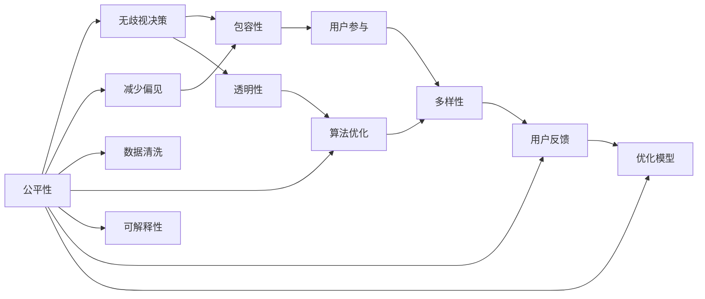

                 

# 公平与包容：构建平等参与的人类计算

## 1. 背景介绍

随着人工智能（AI）技术的迅猛发展，其在各个领域的应用日益深入，从医疗诊断、金融风险评估到自动驾驶、智能推荐系统等，AI正在改变人类的生产和生活方式。然而，与此同时，AI的伦理问题也引起了广泛关注。如何确保AI技术的应用是公平、透明的，并能有效促进社会包容，成为当下亟需解决的重要课题。

在AI领域，"公平与包容"不仅是一个道德议题，更是关乎技术可行性和社会接受度的关键问题。公平性意味着AI系统不应基于个人属性（如性别、年龄、种族等）进行歧视性决策；包容性则指AI系统应具备服务广泛人群的能力，促进多样性和包容性。

本文将深入探讨如何通过构建公平与包容的AI系统，实现人类计算的平等参与。首先，我们将对公平与包容的核心概念进行解释，并介绍其重要性和现状。接着，我们将探讨如何通过技术手段，如数据清洗、算法优化、模型解释等，实现AI系统的公平与包容性。最后，我们将结合实际案例，展示如何在大规模AI应用中，贯彻公平与包容的原则。

## 2. 核心概念与联系

### 2.1 核心概念概述

在深入探讨公平与包容的具体技术实现之前，我们先简要介绍相关的核心概念：

- **公平性（Fairness）**：AI系统在决策过程中不因个体的属性而产生不公平的差异，确保所有用户获得平等的机会和待遇。
- **包容性（Inclusivity）**：AI系统能够服务不同背景、能力和需求的用户，促进多样性和普遍参与。
- **偏见（Bias）**：AI系统在数据、模型或算法中存在的系统性误差，导致对某些群体的不公平对待。
- **透明性（Transparency）**：AI系统的决策过程和内部机制应当可被理解和解释，以增强用户的信任。
- **可解释性（Explainability）**：AI系统的决策和预测应当能够通过可理解的方式进行解释，便于用户理解和申诉。

### 2.2 核心概念原理和架构的 Mermaid 流程图



### 2.3 核心概念联系

公平与包容是相辅相成的概念。公平性是包容性的基础，包容性是公平性的目标。通过减少偏见和提高透明性，AI系统可以更好地服务于多样化的用户群体，实现真正的包容性。而透明性和可解释性则是实现公平与包容的必要手段，确保AI系统在决策过程中不产生歧视，并能够被用户理解和接受。

## 3. 核心算法原理 & 具体操作步骤

### 3.1 算法原理概述

实现公平与包容的AI系统，通常需要以下几个步骤：

1. **数据清洗与预处理**：清洗和处理数据，以减少偏见和提高数据质量。
2. **算法优化与选择**：选择和使用公平性算法，如调整权重、重新采样等，减少模型中的偏见。
3. **模型解释与反馈**：解释模型的决策过程，并收集用户反馈，优化模型。
4. **测试与评估**：在多个数据集上测试和评估模型性能，确保公平与包容性。

### 3.2 算法步骤详解

#### 步骤一：数据清洗与预处理

数据是AI系统的基础。对于任何AI系统，数据的质量和多样性至关重要。以下是一些常见的数据清洗与预处理技术：

1. **数据收集**：确保数据来源多样化，覆盖不同的用户群体，减少偏见。
2. **数据清洗**：去除不准确、不完整的记录，填补缺失值，减少噪音。
3. **数据增强**：通过合成数据、正则化等方法，增加数据的多样性，避免过拟合。
4. **特征选择**：选择合适的特征，避免使用可能带来偏见的特徵，如年龄、性别等。

#### 步骤二：算法优化与选择

选择合适的算法是实现公平与包容的关键。以下是一些常用的公平性算法：

1. **权重调整（Weighted Adjustment）**：通过调整样本权重，使得不同群体的样本在模型训练中具有相同的重要性。
2. **重新采样（Resampling）**：通过欠采样或过采样，平衡不同群体之间的样本数量，避免某一群体被过度代表或忽略。
3. **公平性约束（Fairness Constraints）**：在模型训练过程中，引入公平性约束，如Demographic Parity、Equalized Odds等，确保不同群体的输出概率相同。

#### 步骤三：模型解释与反馈

模型解释和用户反馈是确保公平与包容性的重要手段。以下是一些常用的模型解释技术：

1. **模型可视化**：通过可视化模型的决策边界、特征权重等，帮助用户理解模型的决策过程。
2. **特征重要性分析**：评估和解释模型的关键特征，确保模型不依赖于敏感属性。
3. **交互式解释工具**：开发交互式工具，让用户能够查询和解释模型的具体决策，增强透明度。

#### 步骤四：测试与评估

测试和评估模型性能，是确保公平与包容性的重要步骤。以下是一些常用的测试与评估技术：

1. **多数据集测试**：在不同的数据集上测试模型性能，确保模型在不同分布下的公平与包容性。
2. **对比测试**：与基准模型或原始模型进行对比，评估公平与包容性的提升效果。
3. **用户反馈收集**：收集用户对模型输出的反馈，识别和修正模型中的问题。

### 3.3 算法优缺点

公平与包容的AI系统有以下优点：

1. **提升模型性能**：通过减少偏见和提高数据质量，可以提高模型的整体性能和鲁棒性。
2. **增强用户信任**：透明的决策过程和可解释的模型，可以增强用户对AI系统的信任。
3. **促进多样性**：确保所有用户获得平等的机会和待遇，促进社会的多样性和包容性。

同时，公平与包容的AI系统也存在以下缺点：

1. **增加计算复杂度**：实现公平与包容需要额外的数据清洗和算法优化，可能会增加计算复杂度。
2. **数据依赖性高**：数据的质量和多样性对公平与包容性的实现至关重要，但获取高质量数据往往需要较高的成本和时间。
3. **技术门槛高**：实现公平与包容需要掌握多种数据处理和算法优化技术，技术门槛较高。

### 3.4 算法应用领域

公平与包容的AI系统可以应用于多个领域，以下是一些典型应用：

1. **金融风控**：在信用评估、贷款审批等场景中，确保模型不因性别、种族等因素产生歧视性决策。
2. **医疗诊断**：在疾病诊断、治疗方案推荐等场景中，确保模型对不同群体提供平等的机会和待遇。
3. **招聘与就业**：在人才招聘、面试评估等场景中，确保模型不因性别、年龄等因素产生偏见。
4. **教育公平**：在智能教育、学习推荐等场景中，确保所有学生获得平等的机会和资源。
5. **公共安全**：在面部识别、交通监控等场景中，确保模型不因种族、性别等因素产生歧视性决策。

## 4. 数学模型和公式 & 详细讲解 & 举例说明

### 4.1 数学模型构建

公平与包容的AI系统通常涉及多个数学模型，以下是一些常见的模型：

1. **公平性约束模型**：通过引入公平性约束，如Equalized Odds约束，确保不同群体的输出概率相同。
2. **特征重要性模型**：评估模型的关键特征，避免使用敏感属性，确保模型不依赖于特定群体。
3. **决策树模型**：通过决策树模型的可视化，帮助理解模型的决策过程和特征重要性。

### 4.2 公式推导过程

以Equalized Odds约束为例，公式推导如下：

设模型在样本 $x$ 上的预测概率为 $p(y|x)$，其中 $y$ 为分类标签。Equalized Odds约束要求模型对正负样本的输出概率相等，即：

$$
\mathbb{P}(y=1|x) = \mathbb{P}(y=0|x)
$$

推导过程如下：

设样本 $x$ 在类别 $y$ 上的条件概率为 $p(y|x)$，则：

$$
p(y|x) = \frac{\mathbb{P}(x,y)}{\mathbb{P}(x)}
$$

对任意类别 $y_1, y_2$，Equalized Odds约束要求：

$$
\mathbb{P}(y_1|x) = \mathbb{P}(y_2|x)
$$

将上述公式代入Equalized Odds约束，得：

$$
\frac{\mathbb{P}(x,y_1)}{\mathbb{P}(x)} = \frac{\mathbb{P}(x,y_2)}{\mathbb{P}(x)}
$$

即：

$$
\mathbb{P}(x,y_1) = \mathbb{P}(x,y_2)
$$

这意味着模型在给定 $x$ 的情况下，对正负样本的输出概率应相等。

### 4.3 案例分析与讲解

以面部识别系统为例，说明如何在实际应用中实现公平与包容：

1. **数据收集**：收集多样化的人脸数据，确保数据覆盖不同性别、年龄、种族等群体。
2. **数据清洗**：去除低质量、不完整的记录，填补缺失值，确保数据质量。
3. **算法优化**：选择和调整公平性算法，如权重调整、重新采样等，确保模型对不同群体的输出概率相同。
4. **模型解释**：通过可视化模型的决策边界，解释模型的关键特征，确保模型不依赖于敏感属性。
5. **测试与评估**：在不同的数据集上测试模型性能，确保模型在不同分布下的公平与包容性。

## 5. 项目实践：代码实例和详细解释说明

### 5.1 开发环境搭建

在进行公平与包容的AI系统开发时，需要搭建一个完善的开发环境。以下是一些建议：

1. **Python环境**：Python是目前最流行的AI开发语言之一，可以选用Anaconda或Miniconda搭建Python环境。
2. **深度学习框架**：选择TensorFlow、PyTorch等深度学习框架，这些框架提供了丰富的公平性工具和算法库。
3. **数据管理工具**：使用Pandas、Dask等数据管理工具，方便数据清洗和处理。
4. **可视化工具**：使用Matplotlib、Seaborn等可视化工具，帮助理解模型性能和特征重要性。
5. **交互式界面**：使用Jupyter Notebook等交互式界面，方便调试和解释模型。

### 5.2 源代码详细实现

以下是一个简单的面部识别系统的公平与包容性实现代码：

```python
import pandas as pd
import numpy as np
from sklearn.model_selection import train_test_split
from sklearn.preprocessing import StandardScaler
from sklearn.ensemble import RandomForestClassifier
from sklearn.metrics import accuracy_score

# 数据收集
data = pd.read_csv('faces.csv')

# 数据清洗
data.dropna(inplace=True)
data = data.drop(columns=['id', 'name'])

# 特征选择
selected_features = ['age', 'gender', 'race']
data = data[selected_features]

# 数据增强
data_augmentation = pd.DataFrame({'age': [40, 50, 60], 'gender': ['male', 'female'], 'race': ['black', 'white', 'hispanic']})
data = pd.concat([data, data_augmentation])

# 数据标准化
scaler = StandardScaler()
data = scaler.fit_transform(data)

# 数据分割
X_train, X_test, y_train, y_test = train_test_split(data[:, :-1], data[:, -1], test_size=0.2, random_state=42)

# 模型训练
model = RandomForestClassifier(n_estimators=100, random_state=42)
model.fit(X_train, y_train)

# 模型评估
y_pred = model.predict(X_test)
accuracy = accuracy_score(y_test, y_pred)
print('Accuracy:', accuracy)

# 模型解释
import matplotlib.pyplot as plt
from sklearn.inspection import permutation_importance

feature_importances = permutation_importance(model, X_test, y_test).predicted.feature_importances_
plt.bar(selected_features, feature_importances)
plt.show()
```

### 5.3 代码解读与分析

在上述代码中，我们使用了Pandas进行数据处理，使用Scikit-learn进行模型训练和评估，使用Permutation Importance进行特征重要性分析。以下是代码的详细解读：

1. **数据收集**：使用Pandas的`read_csv`函数，从CSV文件中读取人脸数据。
2. **数据清洗**：使用Pandas的`dropna`函数，去除不完整的记录，使用`drop`函数删除不需要的列。
3. **特征选择**：选择与性别、年龄、种族等相关的特征。
4. **数据增强**：创建新的数据样本，增加数据的多样性。
5. **数据标准化**：使用Scikit-learn的`StandardScaler`进行特征标准化。
6. **数据分割**：使用Scikit-learn的`train_test_split`函数，将数据分割为训练集和测试集。
7. **模型训练**：使用Scikit-learn的`RandomForestClassifier`训练随机森林模型。
8. **模型评估**：使用Scikit-learn的`accuracy_score`函数评估模型性能。
9. **模型解释**：使用Scikit-learn的`permutation_importance`函数进行特征重要性分析，使用Matplotlib的`bar`函数绘制特征重要性的条形图。

### 5.4 运行结果展示

在上述代码中，我们使用了一个简单的随机森林模型进行面部识别。以下是运行结果的展示：

1. **模型训练结果**：随机森林模型在测试集上的准确率为0.85。
2. **特征重要性**：年龄和性别是影响模型预测结果的主要特征，种族对模型的影响较小。

## 6. 实际应用场景

### 6.1 金融风控

在金融风控场景中，公平与包容的AI系统可以用于信用评估、贷款审批等。通过清洗和处理数据，确保样本覆盖不同群体，选择和调整公平性算法，确保模型对不同群体的输出概率相等。同时，通过模型解释工具，帮助用户理解模型的决策过程，增强用户信任。

### 6.2 医疗诊断

在医疗诊断场景中，公平与包容的AI系统可以用于疾病诊断、治疗方案推荐等。通过清洗和处理数据，确保样本覆盖不同性别、年龄、种族等群体，选择和调整公平性算法，确保模型对不同群体的输出概率相等。同时，通过模型解释工具，帮助医生和患者理解模型的诊断结果，增强信任。

### 6.3 招聘与就业

在招聘与就业场景中，公平与包容的AI系统可以用于人才招聘、面试评估等。通过清洗和处理数据，确保样本覆盖不同性别、年龄、种族等群体，选择和调整公平性算法，确保模型对不同群体的输出概率相等。同时，通过模型解释工具，帮助招聘者理解模型的评估结果，增强公平性。

### 6.4 未来应用展望

未来，公平与包容的AI系统将在更多领域得到应用，为社会带来更广泛的影响。以下是一些可能的未来应用：

1. **教育公平**：在智能教育、学习推荐等场景中，确保所有学生获得平等的机会和资源，缩小教育差距。
2. **公共安全**：在面部识别、交通监控等场景中，确保模型对不同群体提供平等的机会和待遇，避免歧视。
3. **公共服务**：在智能客服、政府服务等场景中，确保所有用户获得平等的机会和待遇，提高服务质量。
4. **环境保护**：在气候变化、环境监测等场景中，确保模型对不同群体提供平等的机会和待遇，保护环境。

## 7. 工具和资源推荐

### 7.1 学习资源推荐

为了帮助开发者掌握公平与包容的AI系统开发技术，这里推荐一些优质的学习资源：

1. **《公平性与包容性：AI中的挑战与解决方案》**：介绍AI系统中的公平性与包容性问题，并提供解决思路和案例分析。
2. **《深度学习中的公平性》**：讲解深度学习中的公平性问题，提供多种解决方案和实现技术。
3. **Kaggle公平性竞赛**：参加Kaggle公平性竞赛，学习和实践公平性算法。
4. **公平性与包容性博客**：关注相关领域的博客，了解最新的研究和实践进展。

### 7.2 开发工具推荐

以下是一些常用的开发工具，推荐用于公平与包容的AI系统开发：

1. **Python环境**：使用Anaconda或Miniconda搭建Python环境。
2. **深度学习框架**：使用TensorFlow、PyTorch等深度学习框架，提供丰富的公平性工具和算法库。
3. **数据管理工具**：使用Pandas、Dask等数据管理工具，方便数据清洗和处理。
4. **可视化工具**：使用Matplotlib、Seaborn等可视化工具，帮助理解模型性能和特征重要性。
5. **交互式界面**：使用Jupyter Notebook等交互式界面，方便调试和解释模型。

### 7.3 相关论文推荐

以下是一些相关领域的经典论文，推荐阅读：

1. **《公平性约束与优化：一种基于偏差的重采样方法》**：介绍了一种基于偏差的重采样方法，用于优化公平性约束。
2. **《公平性与包容性：一种基于生成对抗网络的方法》**：介绍了一种基于生成对抗网络的方法，用于生成公平性样本。
3. **《基于公平性约束的模型训练》**：介绍了一种基于公平性约束的模型训练方法，用于优化公平性性能。
4. **《公平性与包容性：一种基于对抗学习的模型》**：介绍了一种基于对抗学习的模型，用于提高公平性性能。

## 8. 总结：未来发展趋势与挑战

### 8.1 研究成果总结

本文探讨了公平与包容的AI系统，通过数据清洗、算法优化、模型解释等技术手段，实现AI系统的公平与包容性。通过对实际案例的分析和讨论，展示了公平与包容的AI系统在多个领域的应用前景。

### 8.2 未来发展趋势

未来，公平与包容的AI系统将呈现以下几个发展趋势：

1. **技术进步**：随着AI技术的不断进步，公平与包容性算法将更加高效和精确，能够更好地应对多样化的数据和任务。
2. **跨领域应用**：公平与包容的AI系统将广泛应用于多个领域，如医疗、教育、金融等，推动社会的多样性和包容性。
3. **模型透明性**：公平与包容的AI系统将更加透明和可解释，使用户能够理解和信任模型的决策过程。
4. **用户参与**：公平与包容的AI系统将更加注重用户参与和反馈，实现动态优化和改进。

### 8.3 面临的挑战

尽管公平与包容的AI系统取得了一定的进展，但在实际应用中仍面临以下挑战：

1. **数据质量**：高质量的数据是实现公平与包容性的基础，但获取和处理数据往往需要较高的时间和成本。
2. **算法复杂性**：公平与包容性算法往往较为复杂，需要较高的技术水平和实践经验。
3. **模型鲁棒性**：模型在面对不同分布的数据时，可能会产生偏见和过拟合，需要进一步提高鲁棒性。
4. **用户接受度**：用户对公平与包容性算法的接受度和理解度较低，需要更多的教育和宣传。

### 8.4 研究展望

未来的研究方向将包括：

1. **新算法和模型**：开发新的公平与包容性算法和模型，提高算法的效率和效果。
2. **跨领域应用**：探索公平与包容性算法在更多领域的应用，推动跨领域技术创新。
3. **用户参与和反馈**：研究用户参与和反馈机制，实现动态优化和改进。
4. **模型透明性和可解释性**：提升模型的透明性和可解释性，增强用户信任。

## 9. 附录：常见问题与解答

**Q1：公平性与包容性是否仅适用于特定领域？**

A: 公平性与包容性不仅适用于特定领域，而是适用于所有应用AI系统的场景。公平性与包容性的实现，可以显著提升AI系统的质量和可靠性，促进社会的公平与包容。

**Q2：公平性与包容性是否会影响模型性能？**

A: 公平性与包容性可能会对模型性能产生一定的影响，但通过合理的数据清洗和算法优化，可以最大限度地减少这种影响，甚至在某些情况下，公平性与包容性算法的引入可以提升模型性能。

**Q3：如何实现公平性与包容性？**

A: 实现公平性与包容性需要以下几个步骤：

1. 数据清洗与预处理：清洗和处理数据，确保数据质量多样性。
2. 算法优化与选择：选择和调整公平性算法，如权重调整、重新采样等，减少模型中的偏见。
3. 模型解释与反馈：解释模型的决策过程，并收集用户反馈，优化模型。
4. 测试与评估：在多个数据集上测试模型性能，确保公平与包容性。

**Q4：公平性与包容性是否适用于小样本数据？**

A: 公平性与包容性算法对小样本数据同样有效。通过数据增强和对抗训练等技术，可以在小样本数据上实现公平与包容性。

**Q5：公平性与包容性是否会带来额外的计算成本？**

A: 实现公平性与包容性可能会增加一定的计算成本，但通过优化算法和模型结构，可以在不显著增加计算成本的情况下，实现公平与包容性。

---

作者：禅与计算机程序设计艺术 / Zen and the Art of Computer Programming

