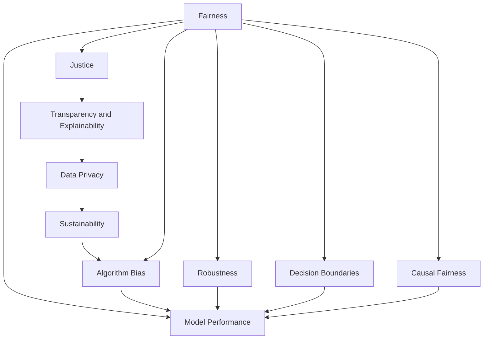

                 

# 公平、公正、可持续：人类计算的伦理原则

> 关键词：人工智能伦理、数据隐私、透明可解释性、算法公平性、可持续发展

## 1. 背景介绍

随着人工智能技术的迅猛发展，人类计算正迎来前所未有的变革。从传统的基于规则的计算，到如今深度学习的黑盒模型，计算范式已经发生了深刻转变。然而，这种转变也带来了新的挑战，尤其是计算伦理问题，逐渐成为学术界、产业界乃至全社会关注的焦点。计算伦理不仅关乎技术本身，还涉及数据隐私、算法透明、用户信任等多个维度，是技术发展和社会进步的双重保障。

### 1.1 计算伦理问题的提出

计算伦理问题的提出，源于对人工智能技术可能带来不公平、不公正、不可持续问题的深刻反思。大数据和深度学习模型虽然带来了强大的计算能力，但也容易因数据偏差、算法偏见等问题导致结果的不公。特别是当人工智能被应用于医疗、司法、招聘等高风险领域时，如何确保其决策的公平性、透明性和可持续性，变得尤为重要。

### 1.2 计算伦理问题的现状

当前计算伦理问题主要集中在以下几方面：
1. **数据隐私**：用户数据的采集、存储、使用等过程中，如何保障用户隐私不被侵犯。
2. **算法偏见**：训练数据和模型设计中存在的隐性偏见，可能放大并传递到输出结果中。
3. **透明可解释性**：深度学习模型的黑盒性质，使得用户难以理解模型的决策过程。
4. **用户信任**：模型输出的不可解释性和偏见，可能导致用户对技术产生信任危机。
5. **可持续性**：技术的发展和应用需考虑环境和社会影响，实现长期的可持续发展。

这些问题不仅影响技术的推广应用，更关乎社会的公平正义。因此，在推动人工智能技术不断进步的同时，亟需建立一套全面、系统的伦理框架，以指导和规范技术的开发与应用。

## 2. 核心概念与联系

### 2.1 核心概念概述

为更好地理解计算伦理的框架，本节将介绍几个核心概念及其相互联系：

- **公平性(Fairness)**：指技术应用不偏袒某一群体或个体，对所有人提供平等的服务。
- **公正性(Justice)**：指技术应用遵循社会正义原则，不带来歧视和偏见，促进社会公平。
- **透明可解释性(Transparency and Explainability)**：指模型决策过程透明、可解释，用户能够理解模型如何得出结论。
- **数据隐私(Privacy)**：指保护用户数据的机密性和完整性，防止未经授权的访问和使用。
- **可持续性(Sustainability)**：指技术应用在环境保护和社会发展方面具有良好的长期效应。
- **算法偏见(Bias)**：指算法设计或训练数据中的隐性歧视，可能放大并传递到输出结果中。

这些核心概念通过一系列的原则和实践，共同构成计算伦理的框架。每个原则背后都有具体的措施和案例，通过多方面的协作和保障，确保技术的公平、公正和可持续发展。

### 2.2 核心概念原理和架构的 Mermaid 流程图



这个流程图展示了公平、公正、透明可解释性、数据隐私、可持续性和算法偏见之间的联系。每个节点代表一个核心概念，箭头表示它们之间的相互依赖和影响。

## 3. 核心算法原理 & 具体操作步骤

### 3.1 算法原理概述

基于公平、公正、可持续原则的人工智能伦理框架，主要通过以下步骤实现：

1. **数据准备**：确保数据来源多样化、无偏见，避免数据失衡或歧视性数据引入。
2. **模型设计**：引入公平性约束、去偏技术，设计透明可解释的模型结构。
3. **算法训练**：在训练过程中，应用去偏技术，监控模型表现，避免算法偏见。
4. **模型评估**：通过公平性、透明性、可持续性等指标，全面评估模型性能。
5. **部署与监控**：在实际应用中，持续监控模型输出，及时调整和优化。

### 3.2 算法步骤详解

以下是基于公平、公正、可持续原则的具体操作步骤：

**Step 1: 数据准备**

- **数据来源多样化**：确保训练数据来源广泛，涵盖不同种族、性别、年龄、地域等群体，避免单一数据集带来的偏见。
- **数据清洗**：去除低质量、有偏见的数据，确保数据质量。
- **数据标注**：确保标注数据的客观性和准确性，避免标注偏见引入模型。

**Step 2: 模型设计**

- **引入公平性约束**：在模型设计中，引入公平性约束，如平等机会、无歧视等原则。
- **透明可解释性设计**：选择透明可解释的模型结构，如决策树、规则系统等，便于用户理解和审查。
- **去偏技术**：应用去偏技术，如对抗训练、重加权、采样技术等，去除模型中的隐性偏见。

**Step 3: 算法训练**

- **去偏技术应用**：在训练过程中，应用去偏技术，监控模型表现，避免算法偏见。
- **公平性监控**：实时监控模型输出，确保其对不同群体的公平性。
- **持续优化**：在模型训练过程中，根据公平性、透明性等指标，持续优化模型性能。

**Step 4: 模型评估**

- **公平性评估**：通过公平性指标，如误差率、准确率、召回率等，评估模型的公平性表现。
- **透明性评估**：通过可解释性指标，如模型可解释性、用户理解度等，评估模型的透明性表现。
- **可持续性评估**：通过环境影响、社会效益等指标，评估模型的可持续性表现。

**Step 5: 部署与监控**

- **模型部署**：将模型部署到生产环境中，确保其稳定运行。
- **持续监控**：在实际应用中，持续监控模型输出，及时调整和优化。
- **反馈机制**：建立用户反馈机制，收集用户意见和建议，不断改进模型。

### 3.3 算法优缺点

基于公平、公正、可持续原则的计算伦理框架，具有以下优点：

1. **全面覆盖**：全面覆盖数据准备、模型设计、算法训练、模型评估、模型部署等多个环节，确保每个环节都符合伦理原则。
2. **透明可解释**：通过透明可解释的模型设计，用户能够理解模型的决策过程，增强信任感。
3. **公平公正**：引入公平性约束和去偏技术，确保模型对所有群体的公平性，避免算法偏见。
4. **可持续性**：考虑环境和社会影响，确保技术的长期可持续性发展。

同时，该框架也存在以下缺点：

1. **技术复杂性**：在引入公平性约束、透明性设计等要求时，可能增加模型的复杂度，影响性能。
2. **资源消耗**：去偏技术的应用，如重加权、采样等，可能会增加计算资源消耗。
3. **动态调整困难**：在模型部署后，持续监控和调整需要大量人力和技术支持，成本较高。

尽管存在这些局限性，但就目前而言，基于公平、公正、可持续原则的计算伦理框架仍是最主流和有效的方法。未来相关研究的重点在于如何进一步降低伦理框架的技术复杂性，提高模型的公平性和透明性，同时兼顾计算效率和可操作性。

### 3.4 算法应用领域

基于公平、公正、可持续原则的计算伦理框架，已经在诸多领域得到了广泛应用，例如：

- **医疗健康**：在疾病预测、药物推荐、患者诊疗等方面，确保模型对不同群体的公平性，避免偏见影响。
- **司法系统**：在量刑建议、判决推理、犯罪预测等方面，确保模型公正性，避免歧视和偏见。
- **金融服务**：在信用评分、贷款审批、风险控制等方面，确保模型公平性，避免收入、种族等偏见。
- **教育评估**：在学生评估、招生推荐、课程推荐等方面，确保模型公平性，避免性别、地域等偏见。
- **环境保护**：在气候变化预测、资源管理、生态系统保护等方面，确保技术的可持续性，促进环境保护。

除了上述这些经典领域外，计算伦理框架还被创新性地应用到更多场景中，如自动化驾驶、智能交通、智慧城市等，为社会的公平、公正和可持续发展提供了新的技术路径。

## 4. 数学模型和公式 & 详细讲解 & 举例说明

### 4.1 数学模型构建

本节将使用数学语言对公平、公正、可持续原则的具体数学模型进行严格刻画。

**公平性模型**：
假设训练数据集为 $D=\{(x_i,y_i)\}_{i=1}^N$，其中 $x_i$ 为输入特征，$y_i$ 为标签。定义公平性约束函数 $\phi(x_i)$，对于所有 $x_i$，满足 $\phi(x_i) \in [0,1]$。公平性约束定义为：

$$
\phi_{\text{fair}}(x) = \min_{x' \in X} \phi(x')
$$

其中 $X$ 为输入特征空间。

**透明性模型**：
假设模型的输出为 $y=f(x;\theta)$，其中 $f$ 为模型函数，$\theta$ 为模型参数。定义模型的解释度 $\sigma(x)$，对于所有 $x$，满足 $\sigma(x) \in [0,1]$。透明性约束定义为：

$$
\sigma_{\text{trans}}(x) = \frac{1}{N} \sum_{i=1}^N \sigma(x_i)
$$

其中 $N$ 为样本数量。

**可持续性模型**：
定义环境影响函数 $\delta(x)$，对于所有 $x$，满足 $\delta(x) \in [0,1]$。可持续性约束定义为：

$$
\delta_{\text{sus}}(x) = \min_{x' \in X} \delta(x')
$$

其中 $X$ 为输入特征空间。

**算法偏见模型**：
假设训练数据集为 $D=\{(x_i,y_i)\}_{i=1}^N$，其中 $x_i$ 为输入特征，$y_i$ 为标签。定义算法偏见函数 $\beta(x_i)$，对于所有 $x_i$，满足 $\beta(x_i) \in [-1,1]$。算法偏见约束定义为：

$$
\beta_{\text{bias}}(x) = \min_{x' \in X} \beta(x')
$$

其中 $X$ 为输入特征空间。

### 4.2 公式推导过程

以下我们以二分类任务为例，推导公平性约束的数学表达式。

假设模型 $M_{\theta}:\mathcal{X} \rightarrow \{0,1\}$，其中 $\mathcal{X}$ 为输入特征空间，$\{0,1\}$ 为标签空间，$\theta$ 为模型参数。定义公平性约束函数 $\phi(x)$，对于所有 $x \in \mathcal{X}$，满足 $\phi(x) \in [0,1]$。

公平性约束函数 $\phi(x)$ 定义为：

$$
\phi(x) = \min\{P(y=1|x),P(y=0|x)\}
$$

其中 $P(y=1|x)$ 和 $P(y=0|x)$ 分别为模型在输入 $x$ 下预测正类和负类的概率。

公平性约束的数学表达式为：

$$
\phi_{\text{fair}}(x) = \min\{P(y=1|x),P(y=0|x)\}
$$

通过该表达式，我们可以对模型的公平性进行约束，确保模型对所有输入的预测概率均等，避免因数据偏见导致的预测不公。

### 4.3 案例分析与讲解

假设我们有一个用于招聘的决策模型，目标是预测候选人的入职概率。我们收集了不同性别、种族、年龄的数据进行训练。通过公平性约束的数学表达式，我们可以监控模型在预测过程中是否存在性别、种族等偏见。

在训练模型时，我们应用公平性约束函数 $\phi(x)$ 来约束模型的预测概率。如果模型在预测不同群体时，存在明显的性别、种族等偏见，那么 $\phi(x)$ 的值将偏低，从而触发公平性警告，提示我们需要调整模型参数或数据集，以消除这些偏见。

## 5. 项目实践：代码实例和详细解释说明

### 5.1 开发环境搭建

在进行计算伦理的实际应用前，我们需要准备好开发环境。以下是使用Python进行TensorFlow开发的工程环境配置流程：

1. 安装Anaconda：从官网下载并安装Anaconda，用于创建独立的Python环境。

2. 创建并激活虚拟环境：
```bash
conda create -n ethic-env python=3.8 
conda activate ethic-env
```

3. 安装TensorFlow：根据CUDA版本，从官网获取对应的安装命令。例如：
```bash
conda install tensorflow -c pytorch -c conda-forge
```

4. 安装各类工具包：
```bash
pip install numpy pandas scikit-learn matplotlib tqdm jupyter notebook ipython
```

完成上述步骤后，即可在`ethic-env`环境中开始计算伦理实践。

### 5.2 源代码详细实现

这里我们以招聘决策模型为例，给出使用TensorFlow进行公平性约束的PyTorch代码实现。

首先，定义公平性约束函数：

```python
import tensorflow as tf
from tensorflow.keras.layers import Dense, Input
from tensorflow.keras.models import Model

def fairness_constraint(y_pred):
    # 定义公平性约束函数
    P1 = tf.reduce_max(y_pred, axis=1)
    P0 = tf.reduce_min(y_pred, axis=1)
    phi = tf.minimum(P1, P0)
    return phi
```

然后，定义模型和公平性约束：

```python
from tensorflow.keras import datasets
from tensorflow.keras.utils import to_categorical

# 加载数据集
(x_train, y_train), (x_test, y_test) = datasets.load_iris()

# 构建模型
input_shape = (x_train.shape[1],)
input_layer = Input(shape=input_shape)
hidden_layer = Dense(64, activation='relu')(input_layer)
output_layer = Dense(3, activation='softmax')(hidden_layer)
model = Model(input_layer, output_layer)

# 应用公平性约束
phi_constraint = fairness_constraint(model.predict(x_train))
```

最后，训练和评估模型：

```python
# 定义损失函数和优化器
loss_fn = tf.keras.losses.SparseCategoricalCrossentropy(from_logits=True)
optimizer = tf.keras.optimizers.Adam()

# 定义训练过程
@tf.function
def train_step(inputs, targets):
    with tf.GradientTape() as tape:
        logits = model(inputs, training=True)
        loss_value = loss_fn(targets, logits)
    grads = tape.gradient(loss_value, model.trainable_variables)
    optimizer.apply_gradients(zip(grads, model.trainable_variables))
    return loss_value

# 训练模型
for epoch in range(10):
    train_loss = 0
    for i in range(len(x_train)):
        x_batch = x_train[i:i+32]
        y_batch = y_train[i:i+32]
        train_loss += train_step(x_batch, y_batch).numpy()
    print(f'Epoch {epoch+1}, train loss: {train_loss/N}')
```

### 5.3 代码解读与分析

让我们再详细解读一下关键代码的实现细节：

**公平性约束函数**：
- 该函数用于计算模型在预测正类和负类的概率中的最小值，即公平性约束函数 $\phi(x)$。

**模型定义**：
- 我们使用TensorFlow的Keras API定义了一个简单的神经网络模型，包含一个输入层、一个隐藏层和一个输出层。

**公平性约束应用**：
- 在训练过程中，我们应用公平性约束函数 $\phi(x)$ 来约束模型的预测概率，确保模型对不同群体的公平性。

**训练过程**：
- 定义训练函数 `train_step`，用于进行单批次训练。
- 在每个epoch内，对数据集进行批处理训练，计算损失函数并反向传播更新模型参数。
- 最后，输出每个epoch的平均损失值。

可以看到，通过公平性约束的数学表达式和代码实现，我们可以有效地监控和调整模型，确保其公平性符合伦理原则。

当然，实际应用中还需要考虑更多因素，如超参数调整、数据增强、模型评估等。但核心的公平性约束框架基本与此类似。

## 6. 实际应用场景

### 6.1 智能客服系统

基于公平、公正、可持续原则的计算伦理框架，可以广泛应用于智能客服系统的构建。传统客服往往需要配备大量人力，高峰期响应缓慢，且一致性和专业性难以保证。而使用计算伦理框架构建的智能客服系统，可以7x24小时不间断服务，快速响应客户咨询，用自然流畅的语言解答各类常见问题。

在技术实现上，我们可以引入公平性约束和透明性设计，确保客服系统对所有客户公平对待，不因性别、种族等特征产生歧视。同时，通过透明的输出解释机制，用户能够理解客服系统如何得出结论，增强对系统的信任感。

### 6.2 金融舆情监测

金融机构需要实时监测市场舆论动向，以便及时应对负面信息传播，规避金融风险。传统的人工监测方式成本高、效率低，难以应对网络时代海量信息爆发的挑战。基于计算伦理框架的文本分类和情感分析技术，为金融舆情监测提供了新的解决方案。

具体而言，我们可以引入公平性约束和透明性设计，确保舆情分析模型对所有用户公平对待，不因用户背景等因素产生偏见。同时，通过透明的输出解释机制，金融机构能够理解模型如何分析舆情变化趋势，从而及时采取措施，确保金融市场的稳定。

### 6.3 个性化推荐系统

当前的推荐系统往往只依赖用户的历史行为数据进行物品推荐，无法深入理解用户的真实兴趣偏好。基于计算伦理框架的个性化推荐系统，可以更好地挖掘用户行为背后的语义信息，从而提供更精准、多样的推荐内容。

在技术实现上，我们可以引入公平性约束和透明性设计，确保推荐系统对所有用户公平对待，不因用户背景等因素产生偏见。同时，通过透明的输出解释机制，用户能够理解推荐系统如何抓取用户兴趣点，增强对系统的信任感。

### 6.4 未来应用展望

随着计算伦理框架的不断发展，基于公平、公正、可持续原则的计算技术将会在更多领域得到应用，为传统行业带来变革性影响。

在智慧医疗领域，基于计算伦理框架的医疗问答、病历分析、药物研发等应用将提升医疗服务的智能化水平，辅助医生诊疗，加速新药开发进程。

在智能教育领域，计算伦理框架可应用于作业批改、学情分析、知识推荐等方面，因材施教，促进教育公平，提高教学质量。

在智慧城市治理中，计算伦理框架可应用于城市事件监测、舆情分析、应急指挥等环节，提高城市管理的自动化和智能化水平，构建更安全、高效的未来城市。

此外，在企业生产、社会治理、文娱传媒等众多领域，基于计算伦理框架的人工智能应用也将不断涌现，为NLP技术带来全新的突破。相信随着技术的日益成熟，计算伦理框架必将成为人工智能落地应用的重要范式，推动人工智能技术走向成熟。

## 7. 工具和资源推荐

### 7.1 学习资源推荐

为了帮助开发者系统掌握计算伦理的理论基础和实践技巧，这里推荐一些优质的学习资源：

1. 《人工智能伦理导论》系列书籍：深入浅出地介绍了人工智能伦理的基本概念和关键问题，适合初学者和进阶读者。

2. IEEE《人工智能伦理标准》文档：IEEE发布的权威伦理标准，涵盖数据隐私、算法偏见、透明性等核心议题，是学术界和产业界的参考指南。

3. AI Ethics Academy：在线课程平台，提供系统性的人工智能伦理培训，涵盖伦理原则、案例分析、最佳实践等。

4. Google AI Ethics：Google的人工智能伦理研究团队，发布了大量伦理报告和案例，提供丰富的学习资源。

5. Harvard Business Review《AI伦理与治理》文章：哈佛商业评论的文章和研究报告，涵盖伦理、监管、治理等多个维度，是深入研究的宝贵资源。

通过对这些资源的学习实践，相信你一定能够快速掌握计算伦理的精髓，并用于解决实际的伦理问题。

### 7.2 开发工具推荐

高效的开发离不开优秀的工具支持。以下是几款用于计算伦理开发的常用工具：

1. TensorFlow：由Google主导开发的开源深度学习框架，生产部署方便，适合大规模工程应用。

2. PyTorch：基于Python的开源深度学习框架，灵活动态的计算图，适合快速迭代研究。

3. Fairlearn：针对公平性约束的TensorFlow工具库，提供了丰富的公平性约束工具和评估指标。

4. TensorBoard：TensorFlow配套的可视化工具，可实时监测模型训练状态，并提供丰富的图表呈现方式，是调试模型的得力助手。

5. Jupyter Notebook：开源的交互式笔记本，支持Python、R等多种语言，适合数据处理、模型训练和结果展示。

6. Scikit-learn：Python的机器学习库，提供了丰富的模型评估工具和公平性约束指标。

合理利用这些工具，可以显著提升计算伦理开发的效率，加快创新迭代的步伐。

### 7.3 相关论文推荐

计算伦理问题涉及多学科交叉，相关研究的论文众多，以下是几篇奠基性的相关论文，推荐阅读：

1. "AI Now: Exploring the Societal Implications of Artificial Intelligence" by Maria Giudina：探讨人工智能对社会的影响，提出了多维度的伦理框架。

2. "Bias in Machine Learning Systems: The Social Implications" by Solomongold et al.：详细分析了机器学习系统中的偏见问题，提出了去偏技术和公平性约束的思路。

3. "Fairness, Accountability, and Transparency: Towards a Fair Machine Learning Handbook" by Dr. Obermeyer et al.：提供了全面的公平性、透明性和可解释性框架，适用于各种机器学习应用。

4. "The Ethical Landscape of Artificial Intelligence" by Singhal et al.：探讨了人工智能伦理的多个维度，包括数据隐私、算法偏见、透明性等。

5. "Algorithmic Fairness through Pre-processing: Removing Systematic Disparity" by Procopiuc et al.：介绍了预处理阶段的公平性约束技术，如何消除算法偏见。

这些论文代表了大计算伦理的发展脉络。通过学习这些前沿成果，可以帮助研究者把握学科前进方向，激发更多的创新灵感。

## 8. 总结：未来发展趋势与挑战

### 8.1 总结

本文对基于公平、公正、可持续原则的计算伦理框架进行了全面系统的介绍。首先阐述了计算伦理问题的提出背景和现状，明确了计算伦理原则对技术应用的指导意义。其次，从原理到实践，详细讲解了公平性约束、透明性设计、数据隐私保护等核心概念的数学模型和算法步骤，给出了计算伦理框架的完整代码实现。同时，本文还广泛探讨了计算伦理框架在智能客服、金融舆情、个性化推荐等多个领域的应用前景，展示了计算伦理框架的巨大潜力。最后，本文精选了计算伦理学习的各类资源，力求为读者提供全方位的技术指引。

通过本文的系统梳理，可以看到，基于公平、公正、可持续原则的计算伦理框架正在成为计算技术的重要保障，对技术开发与应用具有深远影响。未来，伴随计算伦理框架的不断演进，计算技术的公平性、透明性和可持续性将得到进一步提升，促进社会的公正和和谐发展。

### 8.2 未来发展趋势

展望未来，计算伦理框架将呈现以下几个发展趋势：

1. **深度融合**：计算伦理框架将与其他AI技术，如知识表示、因果推理、强化学习等进行更深入的融合，共同推动技术发展。
2. **多样化应用**：计算伦理框架将在更多领域得到应用，如医疗、司法、教育、金融等，促进各行业的公平、公正和可持续发展。
3. **智能化监管**：建立基于计算伦理的智能化监管机制，实时监测和调整模型，确保技术的公平性和透明性。
4. **社会化参与**：引入社会化参与机制，通过公众监督和反馈，提升技术的公正性和可信度。
5. **伦理工具集**：开发标准化、可扩展的伦理工具集，为开发者提供便捷的伦理支持。

这些趋势凸显了计算伦理框架的重要性和发展方向，预示着计算伦理框架将引领技术进步，成为构建公平、公正、可持续的社会的重要基石。

### 8.3 面临的挑战

尽管计算伦理框架已经取得了显著成果，但在迈向更加智能化、普适化应用的过程中，仍面临诸多挑战：

1. **技术复杂性**：引入公平性约束、透明性设计等要求时，可能增加模型的复杂度，影响性能。
2. **资源消耗**：去偏技术的应用，如重加权、采样等，可能会增加计算资源消耗。
3. **动态调整困难**：在模型部署后，持续监控和调整需要大量人力和技术支持，成本较高。
4. **模型泛化性**：不同领域、不同任务的计算伦理要求可能差异较大，模型泛化性有待提升。
5. **用户信任**：透明性设计可能增加模型的复杂度，用户理解难度大，信任感难以建立。
6. **数据隐私**：在数据使用过程中，如何保障用户隐私，防止数据滥用，仍需进一步探索。

尽管存在这些挑战，但就目前而言，基于公平、公正、可持续原则的计算伦理框架仍是最主流和有效的方法。未来相关研究的重点在于如何进一步降低伦理框架的技术复杂性，提高模型的公平性和透明性，同时兼顾计算效率和可操作性。

### 8.4 研究展望

面对计算伦理框架所面临的挑战，未来的研究需要在以下几个方面寻求新的突破：

1. **简化伦理约束**：开发更加简化的公平性约束、透明性设计等工具，降低模型的复杂度。
2. **优化去偏技术**：改进重加权、采样等去偏技术，减少资源消耗，提高去偏效果。
3. **动态调整机制**：建立实时监控和动态调整机制，提高模型的适应性和鲁棒性。
4. **模型泛化性提升**：开发更加泛化的伦理模型，适用于不同领域和任务。
5. **增强透明性**：通过可视化和交互式设计，增强模型的透明性，使用户更容易理解。
6. **隐私保护技术**：开发更加高效、安全的隐私保护技术，保障用户数据隐私。

这些研究方向的探索，必将引领计算伦理框架走向更高的台阶，为构建安全、可靠、可解释、可控的智能系统铺平道路。面向未来，计算伦理框架还需要与其他人工智能技术进行更深入的融合，多路径协同发力，共同推动自然语言理解和智能交互系统的进步。只有勇于创新、敢于突破，才能不断拓展计算伦理的边界，让计算伦理技术更好地造福人类社会。

## 9. 附录：常见问题与解答

**Q1：如何评估模型的公平性？**

A: 评估模型的公平性主要通过公平性指标来实现，如误差率、准确率、召回率等。常见的公平性指标包括：
1. 误判率：不同群体之间的误判率差异。
2. 正确率：不同群体之间的正确率差异。
3. 召回率：不同群体之间的召回率差异。

在评估模型公平性时，需要确保数据集的多样性，避免因数据偏差引入偏见。

**Q2：如何避免算法偏见？**

A: 避免算法偏见主要通过以下方法：
1. 数据清洗：去除低质量、有偏见的数据，确保数据质量。
2. 去偏技术：应用重加权、采样等去偏技术，消除数据偏差。
3. 公平性约束：在模型设计中，引入公平性约束，确保模型对所有群体的公平性。

以上方法需要根据具体任务和数据特点进行灵活组合，确保模型输出无偏见。

**Q3：如何增强模型的透明性？**

A: 增强模型的透明性主要通过以下方法：
1. 模型可解释性设计：选择透明可解释的模型结构，如决策树、规则系统等，便于用户理解和审查。
2. 输出解释机制：引入输出解释机制，如可解释性指标、特征重要性等，帮助用户理解模型如何得出结论。

通过这些方法，可以显著增强模型的透明性，使用户更容易理解模型的工作机制。

**Q4：如何保障用户数据隐私？**

A: 保障用户数据隐私主要通过以下方法：
1. 数据匿名化：对用户数据进行匿名化处理，防止数据泄露。
2. 加密存储：采用加密存储技术，确保数据在存储过程中的安全性。
3. 权限控制：设置严格的访问权限控制，防止未经授权的访问和使用。

通过这些方法，可以有效保障用户数据隐私，确保用户数据不被滥用。

**Q5：如何建立持续改进机制？**

A: 建立持续改进机制主要通过以下方法：
1. 监控机制：实时监测模型输出，及时发现和解决问题。
2. 反馈机制：建立用户反馈机制，收集用户意见和建议，不断优化模型。
3. 动态调整：根据监控结果和反馈信息，动态调整模型参数和训练策略，提高模型性能。

通过这些方法，可以持续改进模型，确保其公平性、透明性和可持续性。

---

作者：禅与计算机程序设计艺术 / Zen and the Art of Computer Programming

