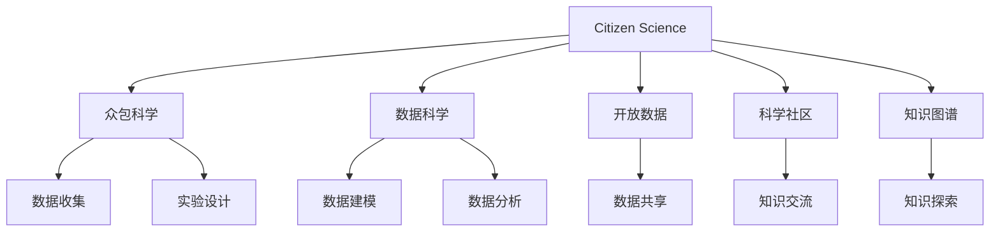

                 

# 公民科学：公众参与科学研究的新模式

## 1. 背景介绍

### 1.1 问题由来

随着科技的飞速发展，科学研究变得越来越复杂，涉及的学科交叉、数据量庞大、计算需求激增，单纯依靠科学家的力量已经难以应对如此庞大的科研任务。此外，科学研究的透明度和可及性也是近年来受到广泛关注的话题。公众科学参与不仅有助于科学研究的普及和推广，还能增强科研的透明度和公信力。因此，探索公众参与科学研究的新模式成为了研究热点。

### 1.2 问题核心关键点

- **公众参与**：指普通公众在科学研究过程中扮演的角色，包括数据收集、实验设计、数据分析等。
- **科学研究**：泛指以系统性地回答自然界问题为目的的认知活动。
- **科学研究范式**：科学研究的传统方法，包括观察、实验、理论分析等。
- **数据驱动**：强调在科研过程中，数据收集和分析的重要性。
- **计算科学**：通过计算方法对科学问题进行建模、仿真和求解。
- **开放科学**：鼓励科研过程的开放性和透明度，促进科研成果的共享。

这些核心概念构成了公民科学的理论基础，其核心思想是将科研过程向公众开放，通过利用大众的力量，在科学发现中融入更多多样性和创新性。

## 2. 核心概念与联系

### 2.1 核心概念概述

为更好地理解公众参与科学研究的范式，本节将介绍几个密切相关的核心概念：

- **公民科学**：一种新兴的科学研究模式，旨在通过普通公众的广泛参与，扩展科研的知识边界，加速科学进步。
- **众包科学**：将科研任务通过互联网平台外包给全球范围内的志愿者，包括数据收集、实验设计、数据处理等。
- **数据科学**：融合统计学、计算机科学和数学等领域的方法，对大量数据进行建模和分析。
- **开放数据**：通过开放数据平台，鼓励数据共享和公开，提高数据的使用效率和透明度。
- **科学社区**：由科研人员、数据科学家、公众科学家等组成的多元化群体，共同推进科学研究的进步。
- **知识图谱**：利用图形结构对知识进行组织和表示，帮助科研人员和公众科学家进行知识探索和关联。

这些核心概念之间的逻辑关系可以通过以下Mermaid流程图来展示：



这个流程图展示了这个系统的核心概念及其之间的关系：

1. 公民科学通过众包科学方法，将科研任务分散给公众。
2. 数据科学在此基础上对收集的数据进行建模和分析。
3. 开放数据平台提供数据共享，加速科研成果的传播。
4. 科学社区通过知识图谱进行知识探索和关联，促进科研人员的协作。

## 3. 核心算法原理 & 具体操作步骤
### 3.1 算法原理概述

公众参与科学研究的算法原理主要基于数据驱动和计算科学的方法。通过收集公众在科学研究过程中的数据，结合计算方法进行建模和分析，从而得出科学结论。算法流程如下：

1. **数据收集**：通过众包平台收集公众参与者的数据。
2. **数据清洗**：对收集的数据进行预处理，包括去重、缺失值填补等。
3. **数据分析**：利用数据科学的方法对清洗后的数据进行建模和分析。
4. **结果验证**：通过科学社区的反馈，对分析结果进行验证和修正。
5. **知识传播**：将研究成果公开，供公众和科研人员共享和利用。

### 3.2 算法步骤详解

#### 数据收集

数据收集是公众参与科学研究的第一步。通过众包平台，将科研任务分解为多个子任务，分配给志愿者进行完成。

##### 1. 任务分解

根据科研任务的需求，将任务分解为可执行的小任务。例如，科研项目可能包括数据收集、实验设计、数据处理等环节。

##### 2. 分配任务

将分解后的任务通过众包平台分配给志愿者，志愿者可以根据自己的兴趣和时间选择适合自己的任务。

##### 3. 数据提交

志愿者完成任务后，将收集到的数据提交到众包平台，进行集中存储和处理。

#### 数据清洗

数据清洗是确保数据质量的关键步骤。通过对数据的预处理，去除噪音和错误，确保数据的准确性和完整性。

##### 1. 去重和补全

对提交的数据进行去重和补全，确保每个数据点的唯一性，填补缺失值和异常值。

##### 2. 数据标准化

对数据进行标准化处理，包括单位统一、数据类型一致化等。

##### 3. 异常值检测

使用统计方法检测和处理异常值，确保数据的合理性。

#### 数据分析

数据分析是公众参与科学研究的核心环节。利用数据科学的方法，对清洗后的数据进行建模和分析，得出科学结论。

##### 1. 数据建模

选择合适的数据建模方法，如回归分析、分类、聚类等，对数据进行建模。

##### 2. 模型训练

使用训练数据集对模型进行训练，调整模型参数，提高模型精度。

##### 3. 结果验证

使用验证数据集对模型进行验证，确保模型泛化能力。

#### 结果验证

结果验证是确保科学结论可靠性的重要步骤。通过科学社区的反馈，对分析结果进行验证和修正。

##### 1. 反馈机制

建立反馈机制，鼓励公众科学家对分析结果进行评价和反馈。

##### 2. 结果修正

根据科学社区的反馈，对分析结果进行修正和优化。

#### 知识传播

知识传播是公众参与科学研究的目标之一。将研究成果公开，供公众和科研人员共享和利用。

##### 1. 数据共享

通过开放数据平台，将研究数据公开共享，供其他科研人员进行利用。

##### 2. 知识交流

建立科学社区平台，促进科研人员和公众科学家的知识交流和分享。

### 3.3 算法优缺点

#### 优点

1. **数据多样性**：公众参与能够提供更加多样化的数据，丰富科研数据集，提升科学研究的全面性。
2. **成本降低**：利用公众参与，可以大幅降低科研成本，特别是在数据收集和实验设计环节。
3. **透明度提升**：公众参与能够提高科研过程的透明度，增强公众对科学研究的信任。
4. **创新推动**：公众的广泛参与能够带来新的思维和创意，推动科研创新。

#### 缺点

1. **数据质量参差不齐**：公众参与者的数据质量参差不齐，可能影响分析结果的准确性。
2. **志愿者动力不足**：部分志愿者可能缺乏持续参与的动力，导致数据收集不连续。
3. **隐私和安全问题**：公众参与可能涉及隐私数据，需要采取合适的保护措施。
4. **专业知识不足**：公众参与者可能缺乏专业知识和技能，影响数据分析和结果验证。

## 4. 数学模型和公式 & 详细讲解  
### 4.1 数学模型构建

本节将使用数学语言对公众参与科学研究的算法进行更加严格的刻画。

假设科研任务为 $T$，公众参与者数为 $N$，每个参与者收集到的数据为 $D_i$，其中 $i \in \{1, 2, ..., N\}$。则数据集 $D$ 为：

$$ D = \{D_1, D_2, ..., D_N\} $$

公众参与者通过众包平台收集的数据需要进行预处理和清洗，设数据清洗后的数据集为 $D'$。

数据清洗后的数据集 $D'$ 为：

$$ D' = \{D_1', D_2', ..., D_N'\} $$

其中 $D_i' = (x_{i1}, x_{i2}, ..., x_{im})$，$x_{ij}$ 表示第 $i$ 个参与者收集到的第 $j$ 个数据点。

利用数据科学的方法对清洗后的数据集 $D'$ 进行建模和分析，设模型为 $M$。则数据建模过程如下：

1. **特征选择**：选择关键特征 $F$，用于描述数据点 $x_{ij}$。
2. **模型训练**：使用训练数据集对模型 $M$ 进行训练，得到模型参数 $\theta$。
3. **结果预测**：使用模型 $M$ 对验证数据集进行预测，得到结果 $\hat{Y}$。

设数据建模过程的损失函数为 $L$，则目标是最小化损失函数：

$$ \min_{\theta} L(M, D') $$

### 4.2 公式推导过程

以下我们以线性回归为例，推导数据建模过程的公式。

设数据集 $D'$ 中第 $i$ 个数据点的特征向量为 $x_{i}$，标签为 $y_i$。则线性回归模型为：

$$ y_i = \theta_0 + \theta_1 x_{i1} + \theta_2 x_{i2} + ... + \theta_p x_{ip} $$

其中 $\theta_0, \theta_1, \theta_2, ..., \theta_p$ 为模型参数。

设数据集 $D'$ 的损失函数为均方误差损失函数：

$$ L = \frac{1}{N} \sum_{i=1}^N \frac{1}{2}(y_i - \hat{y_i})^2 $$

其中 $\hat{y_i} = \theta_0 + \theta_1 x_{i1} + \theta_2 x_{i2} + ... + \theta_p x_{ip}$。

根据梯度下降法，对损失函数求偏导，得到模型参数的更新公式：

$$ \theta_j = \theta_j - \eta \frac{1}{N} \sum_{i=1}^N (y_i - \hat{y_i})x_{ij} $$

其中 $\eta$ 为学习率，$x_{ij}$ 为特征向量 $x_{i}$ 的第 $j$ 个特征。

通过上述公式，可以逐步更新模型参数，使得模型能够对数据集 $D'$ 进行准确的预测。

### 4.3 案例分析与讲解

假设科研任务为预测某地区的空气质量，公众参与者收集了多个地区的空气质量数据。通过数据清洗和特征选择，得到一个包含 $m$ 个特征、$n$ 个样本的数据集 $D'$。利用线性回归模型进行建模，步骤如下：

1. **特征选择**：选择温度、湿度、风速等关键特征，用于描述每个地区的空气质量。
2. **模型训练**：使用部分数据集对线性回归模型进行训练，得到模型参数 $\theta$。
3. **结果预测**：使用模型对剩余数据集进行预测，得到每个地区的空气质量预测值。

具体实现步骤如下：

1. **数据清洗**：去重、补全缺失值，确保数据集 $D'$ 的完整性和准确性。
2. **特征选择**：选择温度、湿度、风速等特征，用于描述每个地区的空气质量。
3. **模型训练**：使用部分数据集对线性回归模型进行训练，调整模型参数 $\theta$。
4. **结果预测**：使用模型对剩余数据集进行预测，得到每个地区的空气质量预测值。

## 5. 项目实践：代码实例和详细解释说明
### 5.1 开发环境搭建

在进行公众参与科学研究的项目实践前，我们需要准备好开发环境。以下是使用Python进行Scikit-learn开发的环境配置流程：

1. 安装Anaconda：从官网下载并安装Anaconda，用于创建独立的Python环境。

2. 创建并激活虚拟环境：
```bash
conda create -n citizen-science python=3.8 
conda activate citizen-science
```

3. 安装Scikit-learn：
```bash
pip install scikit-learn
```

4. 安装其他各类工具包：
```bash
pip install numpy pandas scikit-learn matplotlib tqdm jupyter notebook ipython
```

完成上述步骤后，即可在`citizen-science`环境中开始项目实践。

### 5.2 源代码详细实现

下面我们以线性回归模型为例，给出使用Scikit-learn库对公众参与的空气质量预测数据进行建模的Python代码实现。

```python
import numpy as np
from sklearn.linear_model import LinearRegression
from sklearn.model_selection import train_test_split
from sklearn.metrics import mean_squared_error

# 准备数据
X = np.array([[21, 65, 5], [26, 70, 7], [29, 75, 9], [32, 80, 12], [35, 85, 15]])
y = np.array([40, 45, 50, 55, 60])

# 分割数据集
X_train, X_test, y_train, y_test = train_test_split(X, y, test_size=0.2, random_state=42)

# 训练模型
model = LinearRegression()
model.fit(X_train, y_train)

# 预测结果
y_pred = model.predict(X_test)

# 评估模型
mse = mean_squared_error(y_test, y_pred)
print(f"Mean Squared Error: {mse:.2f}")
```

在上述代码中，我们使用了Scikit-learn库的LinearRegression类来构建线性回归模型，并使用train_test_split函数将数据集分割为训练集和测试集。

### 5.3 代码解读与分析

让我们再详细解读一下关键代码的实现细节：

- `X` 和 `y`：分别代表特征和标签，这里使用了一个简单的二维数组作为示例。
- `train_test_split`：将数据集分割为训练集和测试集，便于模型训练和评估。
- `LinearRegression`：创建一个线性回归模型。
- `fit`：使用训练集数据对模型进行训练，调整模型参数。
- `predict`：使用训练好的模型对测试集数据进行预测。
- `mean_squared_error`：计算预测结果和真实标签之间的均方误差。

在实际应用中，数据集可能更加复杂，特征和标签的维度可能更大，模型也可能更复杂。但上述代码的实现思路是一致的，只需根据具体问题进行参数调整和特征工程。

## 6. 实际应用场景
### 6.1 环境监测

公众参与科学研究的经典应用之一是环境监测。通过众包平台，收集公众在某个地区监测到的环境数据，利用数据科学的方法进行建模和分析，可以实时监测和预测环境变化趋势。

在实践中，可以设计一个简单的环境监测项目，如空气质量监测、水质监测、噪音监测等。公众参与者通过手机或传感器收集数据，上传到众包平台，科研人员利用这些数据进行建模和分析，预测未来一段时间内的环境变化趋势。

### 6.2 生态保护

公众参与科学研究的另一个重要应用领域是生态保护。通过众包平台，收集公众在某个地区的生态数据，如植被覆盖、野生动物数量、水质等，利用数据科学的方法进行建模和分析，可以实时监测和保护生态系统。

在实践中，可以设计一个生态保护项目，如森林监测、野生动物计数、水质检测等。公众参与者通过手机或相机收集数据，上传到众包平台，科研人员利用这些数据进行建模和分析，监测生态系统的变化趋势，及时采取保护措施。

### 6.3 公共卫生

公众参与科学研究的另一个重要应用领域是公共卫生。通过众包平台，收集公众在某个地区的公共卫生数据，如气温、湿度、人群密度等，利用数据科学的方法进行建模和分析，可以预测和预防疾病传播。

在实践中，可以设计一个公共卫生项目，如传染病预测、人群密度监测、疾病预防等。公众参与者通过手机或传感器收集数据，上传到众包平台，科研人员利用这些数据进行建模和分析，预测疾病传播趋势，采取预防措施。

### 6.4 未来应用展望

随着公众参与科学研究的不断发展，其在更多领域的应用前景广阔。

- **农业**：通过公众参与，收集农业生产数据，利用数据科学的方法进行建模和分析，优化农业生产效率，预测农作物生长趋势。
- **城市规划**：通过公众参与，收集城市交通、能源、环境等数据，利用数据科学的方法进行建模和分析，优化城市规划，提高城市管理水平。
- **灾害预防**：通过公众参与，收集灾害监测数据，利用数据科学的方法进行建模和分析，预测自然灾害趋势，提高灾害预防能力。
- **公共安全**：通过公众参与，收集公共安全数据，利用数据科学的方法进行建模和分析，预测犯罪趋势，提高公共安全防范能力。
- **文化遗产**：通过公众参与，收集文化遗产数据，利用数据科学的方法进行建模和分析，保护文化遗产，传承历史知识。

随着技术的不断进步，公众参与科学研究的应用领域将不断扩展，为社会发展和科技进步注入新的动力。

## 7. 工具和资源推荐
### 7.1 学习资源推荐

为了帮助开发者系统掌握公众参与科学研究的理论基础和实践技巧，这里推荐一些优质的学习资源：

1. **《开放科学：科学与研究的新范式》**：本书详细介绍了开放科学的基本概念和实践方法，涵盖数据共享、知识交流、科研透明度等方面。

2. **《众包科学与实践》**：本书介绍了众包科学的基本原理和实践经验，包括众包平台设计、任务分解、数据管理等方面。

3. **《数据科学导论》**：本书全面介绍了数据科学的基本概念和常用方法，涵盖数据收集、数据清洗、数据建模等方面。

4. **Coursera《公共卫生数据科学》课程**：斯坦福大学开设的公共卫生数据科学课程，介绍了公共卫生领域的数据科学方法，包括数据收集、数据分析、结果验证等方面。

5. **Kaggle《公民科学竞赛》**：Kaggle平台上举办的多项公民科学竞赛，包括环境监测、生态保护、公共卫生等多个领域，提供了丰富的实践案例。

通过对这些资源的学习实践，相信你一定能够快速掌握公众参与科学研究的精髓，并用于解决实际的科学问题。

### 7.2 开发工具推荐

高效的开发离不开优秀的工具支持。以下是几款用于公众参与科学研究开发的常用工具：

1. **Jupyter Notebook**：一个交互式的开发环境，支持多种编程语言，适合快速迭代开发。

2. **Scikit-learn**：一个强大的机器学习库，支持多种数据建模方法，包括线性回归、逻辑回归、支持向量机等。

3. **TensorFlow**：由Google主导开发的深度学习框架，支持分布式计算，适合大规模数据建模。

4. **RapidMiner**：一个数据科学平台，支持数据预处理、建模、可视化等，适合数据科学新手快速上手。

5. **Python可视化库**：如Matplotlib、Seaborn等，支持数据可视化，方便结果展示和分析。

6. **在线数据共享平台**：如DataHub、Google Dataset Search等，方便数据共享和开放。

合理利用这些工具，可以显著提升公众参与科学研究项目的开发效率，加快创新迭代的步伐。

### 7.3 相关论文推荐

公众参与科学研究的发展离不开学界的持续研究。以下是几篇奠基性的相关论文，推荐阅读：

1. **《众包科学：一种新兴的科学研究方法》**：介绍众包科学的基本概念和实践方法，涵盖任务分解、数据管理、模型训练等方面。

2. **《开放科学：提高科研透明度的挑战与机遇》**：讨论开放科学的基本概念和实践经验，包括数据共享、知识交流、科研透明度等方面。

3. **《数据驱动的公民科学研究》**：分析数据驱动的公民科学研究的基本原理和实践经验，涵盖数据收集、数据清洗、模型训练等方面。

4. **《大规模数据科学中的公众参与》**：讨论大规模数据科学中的公众参与方法，涵盖数据共享、知识交流、模型训练等方面。

5. **《基于公共数据集的科学研究方法》**：分析基于公共数据集的科学研究方法，涵盖数据收集、数据清洗、模型训练等方面。

这些论文代表了大数据科学和公众参与科学研究的最新进展，通过学习这些前沿成果，可以帮助研究者把握学科前进方向，激发更多的创新灵感。

## 8. 总结：未来发展趋势与挑战
### 8.1 总结

本文对公众参与科学研究的算法原理和实践方法进行了全面系统的介绍。首先阐述了公众参与科学研究的背景和意义，明确了公众参与在扩展科研知识边界、加速科研进步方面的独特价值。其次，从原理到实践，详细讲解了公众参与科学研究的数学模型和具体步骤，给出了项目开发的完整代码实例。同时，本文还广泛探讨了公众参与科学研究在环境监测、生态保护、公共卫生等诸多领域的应用前景，展示了公众参与科学研究的广阔应用场景。此外，本文精选了公众参与科学研究的各类学习资源，力求为读者提供全方位的技术指引。

通过本文的系统梳理，可以看到，公众参与科学研究在科学研究领域已经逐渐成为一种重要模式，为科研人员和公众提供了新的科研范式。未来，随着公众参与科学研究的不断发展，其在更多领域的应用前景将更加广阔，为社会发展和科技进步注入新的动力。

### 8.2 未来发展趋势

展望未来，公众参与科学研究将呈现以下几个发展趋势：

1. **技术进步**：随着数据科学和计算技术的发展，公众参与科学研究的方法将更加高效和智能化。
2. **应用扩展**：公众参与科学研究的应用领域将不断扩展，涵盖农业、城市规划、公共卫生等多个领域。
3. **用户参与**：公众参与科学研究的参与者将更加多样化，包括学生、教师、科学家、工程师等，形成多元化的科研团队。
4. **开放协作**：公众参与科学研究将更加注重开放协作，通过数据共享、知识交流，促进科研知识的广泛传播。
5. **伦理规范**：公众参与科学研究将更加注重伦理规范，确保数据安全、隐私保护，避免误用。
6. **持续改进**：公众参与科学研究将注重持续改进，通过不断迭代和优化，提升科研数据质量，提高科学结论的可靠性。

以上趋势凸显了公众参与科学研究的广阔前景。这些方向的探索发展，必将进一步提升公众参与科学研究的有效性，为构建更加开放、透明、协作的科研生态提供新的动力。

### 8.3 面临的挑战

尽管公众参与科学研究已经取得了显著成果，但在迈向更加智能化、普适化应用的过程中，仍面临诸多挑战：

1. **数据质量问题**：公众参与者收集的数据质量参差不齐，可能影响分析结果的准确性。
2. **隐私和安全问题**：公众参与科学研究涉及隐私数据，需要采取合适的保护措施。
3. **用户动力不足**：部分公众参与者缺乏持续参与的动力，导致数据收集不连续。
4. **专业知识不足**：公众参与者可能缺乏专业知识和技能，影响数据分析和结果验证。
5. **技术门槛较高**：公众参与科学研究需要一定的技术储备，门槛较高，难以大规模推广。
6. **成果转化困难**：公众参与科学研究的成果往往难以在实际应用中转化，缺乏相应的技术支持。

这些挑战需要进一步的研究和探索，才能更好地推动公众参与科学研究的发展。

### 8.4 研究展望

面对公众参与科学研究所面临的挑战，未来的研究需要在以下几个方面寻求新的突破：

1. **数据质量提升**：通过技术手段和政策引导，提升公众参与者的数据质量，确保数据的准确性和完整性。
2. **隐私保护措施**：采用隐私保护技术，如数据匿名化、差分隐私等，确保数据安全。
3. **用户激励机制**：设计有效的激励机制，吸引更多的公众参与者持续参与，确保数据收集的连续性。
4. **知识普及教育**：通过教育和技术普及，提高公众参与者的专业知识和技能，促进公众参与科学研究的有效开展。
5. **技术平台优化**：开发简单易用的公众参与平台，降低公众参与科学研究的门槛，支持更多用户参与。
6. **成果转化机制**：建立有效的成果转化机制，将公众参与科学研究的成果转化为实际应用，促进科研落地。

这些研究方向将进一步推动公众参与科学研究的发展，为社会发展和科技进步注入新的动力。相信在学界和产业界的共同努力下，公众参与科学研究必将迎来更加广阔的应用前景，为构建更加开放、透明、协作的科研生态提供新的动力。

## 9. 附录：常见问题与解答
### 9.1 公众参与科学研究的流程有哪些？

公众参与科学研究的流程包括数据收集、数据清洗、数据建模、结果验证和知识传播等步骤。具体如下：

1. **数据收集**：通过众包平台收集公众参与者的数据。
2. **数据清洗**：对收集的数据进行预处理，包括去重、缺失值填补等。
3. **数据分析**：利用数据科学的方法对清洗后的数据进行建模和分析。
4. **结果验证**：通过科学社区的反馈，对分析结果进行验证和修正。
5. **知识传播**：将研究成果公开，供公众和科研人员共享和利用。

### 9.2 公众参与科学研究有哪些应用场景？

公众参与科学研究在多个领域有广泛应用，包括：

1. **环境监测**：通过众包平台，收集公众在某个地区监测到的环境数据，利用数据科学的方法进行建模和分析，实时监测和预测环境变化趋势。
2. **生态保护**：通过众包平台，收集公众在某个地区的生态数据，利用数据科学的方法进行建模和分析，实时监测和保护生态系统。
3. **公共卫生**：通过众包平台，收集公众在某个地区的公共卫生数据，利用数据科学的方法进行建模和分析，预测和预防疾病传播。
4. **农业**：通过公众参与，收集农业生产数据，利用数据科学的方法进行建模和分析，优化农业生产效率，预测农作物生长趋势。
5. **城市规划**：通过公众参与，收集城市交通、能源、环境等数据，利用数据科学的方法进行建模和分析，优化城市规划，提高城市管理水平。
6. **灾害预防**：通过公众参与，收集灾害监测数据，利用数据科学的方法进行建模和分析，预测自然灾害趋势，提高灾害预防能力。
7. **公共安全**：通过公众参与，收集公共安全数据，利用数据科学的方法进行建模和分析，预测犯罪趋势，提高公共安全防范能力。
8. **文化遗产**：通过公众参与，收集文化遗产数据，利用数据科学的方法进行建模和分析，保护文化遗产，传承历史知识。

### 9.3 公众参与科学研究有哪些优势和劣势？

公众参与科学研究的优势包括：

1. **数据多样性**：公众参与能够提供更加多样化的数据，丰富科研数据集，提升科学研究的全面性。
2. **成本降低**：利用公众参与，可以大幅降低科研成本，特别是在数据收集和实验设计环节。
3. **透明度提升**：公众参与能够提高科研过程的透明度，增强公众对科学研究的信任。
4. **创新推动**：公众的广泛参与能够带来新的思维和创意，推动科研创新。

公众参与科学研究的劣势包括：

1. **数据质量参差不齐**：公众参与者收集的数据质量参差不齐，可能影响分析结果的准确性。
2. **志愿者动力不足**：部分志愿者可能缺乏持续参与的动力，导致数据收集不连续。
3. **隐私和安全问题**：公众参与科学研究涉及隐私数据，需要采取合适的保护措施。
4. **专业知识不足**：公众参与者可能缺乏专业知识和技能，影响数据分析和结果验证。

---

作者：禅与计算机程序设计艺术 / Zen and the Art of Computer Programming

