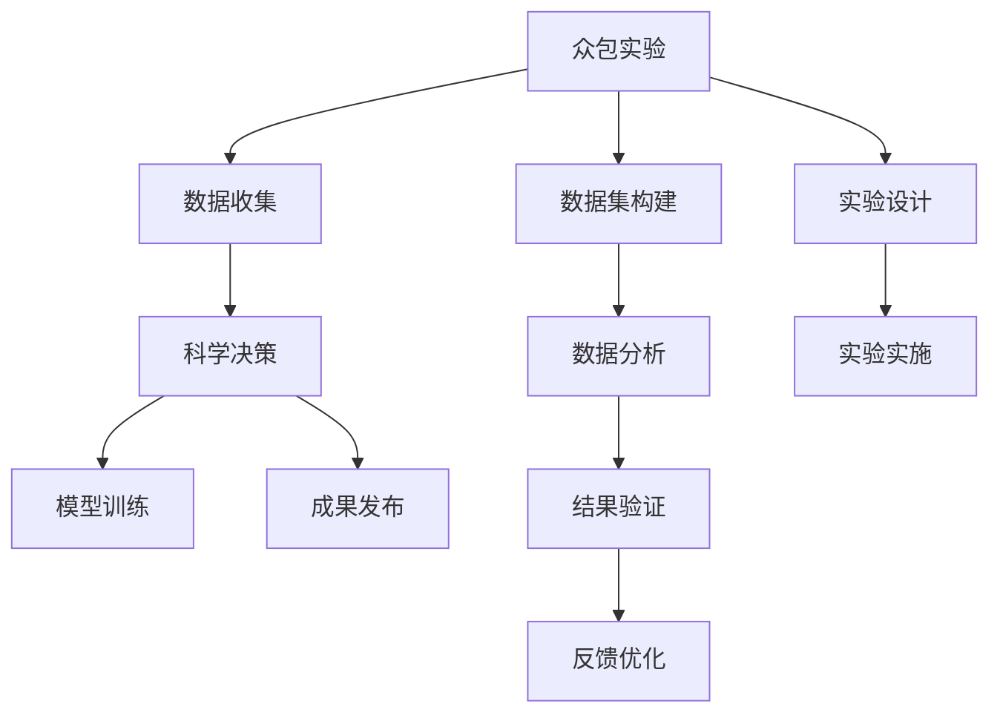

                 

# 公民科学：公众参与科学研究的新途径

> 关键词：公民科学, 公众参与, 科学研究, 社会创新, 数据科学, 众包实验

## 1. 背景介绍

### 1.1 问题由来

在传统科学研究中，往往是由专业人士进行理论创新和实验验证，然后将结果传递给公众。这种单向传递的模式存在着一定的不足，如科研信息的封闭性、科研资源的浪费、公众参与度低等问题。随着互联网技术的普及，越来越多的研究机构和科学家开始探索公众参与科研的新途径，以期提高科研效率、促进科学普及、激发创新活力。

### 1.2 问题核心关键点

公众参与科研的核心关键点在于如何利用互联网和社交媒体的力量，让公众能够直接参与到科研活动中来。公众参与科研的途径多种多样，包括众包实验、数据收集、科学决策等。这些方法通常具有以下特点：
- 低门槛：尽量降低参与科研的门槛，让更多普通人有机会贡献力量。
- 高参与：通过吸引公众的兴趣和好奇心，使他们更加积极地参与到科研活动中来。
- 数据丰富：利用众包方式可以收集到海量的数据，这些数据对于科学研究具有极高的价值。
- 信息共享：公众参与科研可以打破信息的封闭性，使科研过程更加透明，便于监督和评估。

### 1.3 问题研究意义

公众参与科研不仅能够提高科研效率和质量，还能够促进科学普及，培养公众的科学素养，激发创新活力。具体而言，其意义体现在以下几个方面：
1. 降低科研成本。通过众包方式收集数据，可以大幅度降低数据收集和处理的成本。
2. 扩大科研资源。公众参与使得科研资源不再局限于专业机构，而是全社会共享。
3. 提高科研效率。利用公众的力量，可以大幅度加快科研进展，缩短研发周期。
4. 促进科学普及。公众参与科研的过程，也是科学知识传播和普及的过程。
5. 激发创新活力。公众参与科研可以激发创新活力，催生更多富有创意的研究成果。

## 2. 核心概念与联系

### 2.1 核心概念概述

为了更好地理解公众参与科研的方法和原理，本节将介绍几个关键概念：

- 公民科学(Citizen Science)：指公众通过数据收集、实验设计和理论研究等方式参与科研活动，成为科学研究的一部分。
- 众包实验(Crowdsourced Experiment)：利用网络平台集聚众多公众参与者，协同完成科学实验。
- 数据收集(Crowdsourced Data Collection)：利用公众参与收集海量数据，用于科学研究。
- 科学决策(Crowdsourced Decision-Making)：利用公众参与对科研问题进行投票或评选，辅助科研决策。

这些概念之间存在紧密的联系，共同构成了公众参与科研的框架。其中，众包实验和数据收集是公众参与科研的常见方式，科学决策则涉及到如何将公众参与融入科研决策过程。

### 2.2 核心概念原理和架构的 Mermaid 流程图(Mermaid 流程节点中不要有括号、逗号等特殊字符)



这个流程图展示了公众参与科研的主要环节：

1. 众包实验：设计实验，吸引公众参与，并实施实验。
2. 数据收集：收集实验数据，构建数据集。
3. 科学决策：利用公众投票等方式辅助决策。
4. 模型训练：基于数据集构建模型，进行训练。
5. 数据分析：对数据进行分析和挖掘，提炼科研结论。
6. 结果验证：验证模型的准确性，并进行反馈优化。
7. 实验设计：设计新的实验，进行迭代改进。

这些环节共同构成了公众参与科研的完整过程。通过流程化的设计，可以有效提高科研效率和效果。

## 3. 核心算法原理 & 具体操作步骤

### 3.1 算法原理概述

公众参与科研的核心算法原理可以概括为以下几个方面：

- 数据收集：通过众包实验收集数据，利用网络平台吸引公众参与。
- 数据处理：对收集到的数据进行清洗、标注和分析，构建有效的数据集。
- 模型训练：基于数据集构建模型，进行训练和验证。
- 科学决策：利用公众投票等方式，辅助科研决策。

公众参与科研的算法原理与传统科学研究有着显著的差异，它更注重数据的多样性和公众的参与性。通过科学的算法设计，可以有效提升科研效果，并促进科学普及。

### 3.2 算法步骤详解

公众参与科研的算法步骤如下：

1. 数据收集：利用众包平台吸引公众参与实验，收集数据。数据可以是文本、图片、视频等多种类型。

2. 数据处理：对收集到的数据进行清洗、标注和分析，构建有效的数据集。数据清洗包括去重、校正、过滤等步骤。数据标注可以采用自动标注和人工标注相结合的方式。数据分析可以利用机器学习、深度学习等算法，挖掘数据的潜在价值。

3. 模型训练：基于数据集构建模型，进行训练和验证。模型可以采用监督学习、无监督学习、半监督学习等方法。训练过程中需要注意避免过拟合，采用正则化、Dropout等技术。

4. 科学决策：利用公众投票等方式，辅助科研决策。可以设计问卷调查、专家评选等方式，让公众参与到科研决策中来。

### 3.3 算法优缺点

公众参与科研的算法具有以下优点：

- 数据丰富：众包实验可以收集到海量的数据，这些数据对于科学研究具有极高的价值。
- 高参与：利用网络平台吸引公众参与，可以有效提高公众的参与度。
- 低门槛：尽量降低参与科研的门槛，让更多普通人有机会贡献力量。
- 信息共享：公众参与科研可以打破信息的封闭性，使科研过程更加透明，便于监督和评估。

同时，公众参与科研的算法也存在一些缺点：

- 数据质量参差不齐：由于公众参与的数据质量参差不齐，需要进行严格的筛选和清洗。
- 公众参与度不稳定：公众参与科研的热情和参与度难以长期保持。
- 数据隐私问题：众包平台需要处理大量数据，存在隐私泄露的风险。
- 公众偏见：公众投票等方式可能受到偏见和误导，影响决策的客观性。

### 3.4 算法应用领域

公众参与科研的算法广泛应用于以下领域：

- 环境监测：利用众包实验收集环境数据，进行环境污染监测和预测。
- 生物多样性研究：利用众包平台收集生物多样性数据，进行生物种群分析和生态系统研究。
- 天文学：利用众包平台收集天文数据，进行星系、星系团等天体观测。
- 公共卫生：利用众包平台收集健康数据，进行疾病监测和流行病研究。
- 社会调查：利用众包平台进行社会调查，收集社会现象和行为数据。

以上领域中，环境监测和生物多样性研究是公众参与科研的主要应用场景，其涉及的数据量巨大、研究难度高，需要广泛利用公众的力量来进行数据收集和分析。

## 4. 数学模型和公式 & 详细讲解 & 举例说明

### 4.1 数学模型构建

公众参与科研的数学模型通常包括以下几个部分：

- 数据模型：用于描述数据收集和处理的数学模型。
- 模型训练模型：用于描述模型构建和训练的数学模型。
- 决策模型：用于描述科学决策的数学模型。

### 4.2 公式推导过程

以环境监测为例，展示公众参与科研的数学模型构建和公式推导过程。

**数据模型**：假设我们利用众包实验收集到 $n$ 个环境监测数据 $x_i=(x_i^1, x_i^2, ..., x_i^m)$，其中 $x_i^k$ 表示第 $i$ 个数据的第 $k$ 个特征值。数据模型可以表示为：

$$
x_i = f_i + \epsilon_i
$$

其中 $f_i$ 表示第 $i$ 个数据的真实值，$\epsilon_i$ 表示数据噪声。

**模型训练模型**：假设我们使用线性回归模型对环境数据进行建模，模型可以表示为：

$$
\hat{y} = \theta^T x + b
$$

其中 $\hat{y}$ 表示模型预测值，$x$ 表示输入数据，$\theta$ 表示模型参数，$b$ 表示截距。模型训练的目标是最小化预测值与真实值之间的误差，即：

$$
\min_{\theta, b} \frac{1}{n} \sum_{i=1}^n (\hat{y}_i - y_i)^2
$$

**决策模型**：在得到环境监测模型后，我们可以利用公众投票等方式辅助决策。假设公众对环境污染程度进行投票，投票结果为 $v_i$，可以表示为：

$$
v_i = g(x_i, \hat{y}_i, \eta_i)
$$

其中 $g$ 表示投票模型，$\eta_i$ 表示投票噪声。

### 4.3 案例分析与讲解

以“环湾滨海地区的水质监测”为例，展示公众参与科研的具体应用。

**数据收集**：在环湾滨海地区，通过众包平台收集到 1000 个水样数据，包括水质指标、水温、盐度等。

**数据处理**：对收集到的数据进行清洗和标注，去除异常数据和噪声。采用机器学习算法对数据进行分析和挖掘，得到环境污染程度和未来趋势预测模型。

**模型训练**：基于数据集构建线性回归模型，对模型进行训练和验证，得到环境污染程度预测模型。

**科学决策**：利用公众投票，对环境污染程度进行评估。设计问卷调查，收集公众对污染程度的意见和建议。

## 5. 项目实践：代码实例和详细解释说明

### 5.1 开发环境搭建

在进行公众参与科研的实践时，我们需要准备好开发环境。以下是使用Python进行开发的环境配置流程：

1. 安装Python：从官网下载并安装Python 3.x版本。
2. 安装相关库：安装必要的库，如 NumPy、Pandas、Scikit-learn、TensorFlow、Keras 等。
3. 搭建Web平台：使用Flask、Django等Web框架搭建公众参与科研的Web平台，用于数据收集和公众投票。
4. 部署模型：将训练好的模型部署到云服务器或本地服务器，提供Web API接口。

### 5.2 源代码详细实现

下面以环境监测为例，展示公众参与科研的代码实现。

**数据收集**：

```python
import pandas as pd
import numpy as np

# 数据读取
data = pd.read_csv('water_sample.csv')

# 数据清洗
data = data.dropna()

# 数据标注
data['quality'] = data['pollutant'] > 0.5

# 数据处理
data = data.drop(columns=['pollutant'])

# 数据保存
data.to_csv('water_sample_processed.csv', index=False)
```

**模型训练**：

```python
from sklearn.linear_model import LinearRegression

# 数据加载
data = pd.read_csv('water_sample_processed.csv')

# 模型训练
X = data.drop(columns=['quality'])
y = data['quality']
model = LinearRegression()
model.fit(X, y)

# 模型预测
data['predicted_quality'] = model.predict(X)

# 数据保存
data.to_csv('water_sample_predicted.csv', index=False)
```

**科学决策**：

```python
import matplotlib.pyplot as plt
from sklearn.metrics import accuracy_score

# 数据加载
data = pd.read_csv('water_sample_predicted.csv')

# 可视化
plt.scatter(data['pollutant'], data['predicted_quality'])

# 模型评估
accuracy = accuracy_score(data['quality'], data['predicted_quality'])
print('Accuracy:', accuracy)
```

### 5.3 代码解读与分析

让我们再详细解读一下关键代码的实现细节：

**数据收集**：
- 通过Pandas库读取CSV文件，获取水样数据。
- 对数据进行清洗和标注，去除异常数据和噪声。
- 保存处理后的数据到CSV文件，便于后续使用。

**模型训练**：
- 使用Scikit-learn库加载处理后的数据。
- 定义线性回归模型，对数据进行训练。
- 对训练好的模型进行预测，生成预测结果。
- 保存预测结果到CSV文件，便于后续使用。

**科学决策**：
- 使用Matplotlib库可视化数据，观察预测结果。
- 使用Scikit-learn库评估模型准确度，输出准确度。

## 6. 实际应用场景

### 6.1 环境监测

利用公众参与科研的方法，可以有效提高环境监测的效率和精度。以“环湾滨海地区的水质监测”为例，公众可以通过众包平台参与数据收集和环境监测。通过公众投票，可以辅助决策，制定更合理的环保措施。

### 6.2 生物多样性研究

在生物多样性研究中，公众可以参与数据收集和生物种群分析。利用众包平台，可以收集海量的生物数据，并利用机器学习算法进行分析和挖掘，发现新的生物物种和生态系统规律。

### 6.3 天文学

天文学研究需要大量的观测数据，利用众包平台可以吸引公众参与，收集天文数据。公众可以参与数据标注和分析，利用机器学习算法进行星系、星系团等天体观测。

### 6.4 公共卫生

在公共卫生领域，公众可以参与健康数据的收集和分析。利用众包平台，可以收集海量的健康数据，并利用机器学习算法进行分析和挖掘，预测疾病的传播趋势，制定有效的防控措施。

### 6.5 社会调查

在社会调查中，公众可以参与问卷调查和数据分析。利用众包平台，可以收集大量的社会数据，并利用机器学习算法进行分析和挖掘，发现社会现象和行为规律。

## 7. 工具和资源推荐

### 7.1 学习资源推荐

为了帮助开发者系统掌握公众参与科研的理论基础和实践技巧，这里推荐一些优质的学习资源：

1. 《Citizen Science: A Handbook for Practitioners》书籍：全面介绍公民科学的理论和方法，涵盖数据收集、模型构建、科学决策等多个方面。
2. Coursera《Crowdsourced Data Science》课程：介绍众包数据科学的基础知识和技术，包括数据收集、数据清洗、模型构建等。
3. Kaggle《Crowdsourced Data Collection》竞赛：通过实际数据集进行数据分析和建模，提升数据分析和模型构建能力。
4. GitHub《Citizen Science Projects》仓库：收集和分享公众参与科研的实际项目和代码，学习实际应用中的问题和解决方案。
5. SciHub《Citizen Science》期刊：发表和传播公众参与科研的最新研究成果，了解学术界的研究进展。

通过对这些资源的学习实践，相信你一定能够快速掌握公众参与科研的精髓，并用于解决实际的科研问题。

### 7.2 开发工具推荐

公众参与科研的开发工具主要包括以下几个方面：

1. Python编程语言：Python具有丰富的第三方库和框架，适合数据处理和模型构建。
2. Pandas库：用于数据读取、处理和分析，适合处理大规模数据集。
3. Scikit-learn库：用于机器学习算法的实现，支持监督学习、无监督学习、半监督学习等多种模型。
4. TensorFlow和Keras：用于深度学习算法的实现，适合构建复杂模型。
5. Flask和Django：用于Web平台的搭建，适合公众参与科研的数据收集和公众投票。

合理利用这些工具，可以显著提升公众参与科研的开发效率，加快创新迭代的步伐。

### 7.3 相关论文推荐

公众参与科研的研究源于学界的持续研究。以下是几篇奠基性的相关论文，推荐阅读：

1. “Crowdsourcing Environmental Monitoring Data from Citizen Scientists”（PLOS ONE 2018）：介绍利用众包平台收集环境监测数据的方法和效果。
2. “Crowdsourced Data Collection for Biodiversity Monitoring”（Conservation Biology 2019）：介绍利用众包平台收集生物多样性数据的方法和效果。
3. “Crowdsourcing Data for Large-Scale Astronomy Projects”（Public Understanding of Science 2015）：介绍利用众包平台收集天文数据的方法和效果。
4. “Crowdsourced Data Collection and Analysis for Public Health”（Journal of Medical Internet Research 2017）：介绍利用众包平台收集健康数据的方法和效果。
5. “Crowdsourcing Data Collection and Analysis for Social Science Research”（Science 2016）：介绍利用众包平台收集社会数据的方法和效果。

这些论文代表了大公众参与科研的发展脉络。通过学习这些前沿成果，可以帮助研究者把握学科前进方向，激发更多的创新灵感。

## 8. 总结：未来发展趋势与挑战

### 8.1 总结

本文对公众参与科研的方法和原理进行了全面系统的介绍。首先阐述了公众参与科研的背景和意义，明确了公众参与科研的核心关键点和具体应用场景。其次，从原理到实践，详细讲解了公众参与科研的数学模型和关键步骤，给出了公众参与科研的代码实现。同时，本文还广泛探讨了公众参与科研在环境监测、生物多样性研究、天文学、公共卫生、社会调查等领域的实际应用，展示了公众参与科研的巨大潜力。最后，本文精选了公众参与科研的学习资源、开发工具和相关论文，力求为读者提供全方位的技术指引。

通过本文的系统梳理，可以看到，公众参与科研利用互联网和社交媒体的力量，有效整合了公众资源和数据，提高了科研效率和效果，促进了科学普及和知识传播。公众参与科研为科学研究注入了新的活力，有望在未来的科技发展中发挥更大的作用。

### 8.2 未来发展趋势

公众参与科研的未来发展趋势主要包括以下几个方面：

1. 数据规模不断扩大。随着众包平台的普及，数据规模将不断扩大，科研数据的丰富性将大幅提升。
2. 算法模型日趋复杂。随着数据量的增加和算法技术的进步，公众参与科研的算法模型将更加复杂和多样化。
3. 应用领域不断扩展。公众参与科研将逐步应用于更多领域，如医学、法律、金融等，为更多行业带来科学和技术上的突破。
4. 公众参与度持续提升。通过利用游戏化设计、激励机制等方式，公众参与科研的热情和参与度将持续提升。
5. 数据隐私和安全问题备受关注。随着数据量的增加，公众参与科研的数据隐私和安全问题将受到更多关注。
6. 公众参与质量不断提高。通过算法优化和数据筛选，公众参与科研的质量将不断提高，误差和偏差将大幅减少。

以上趋势凸显了公众参与科研的广阔前景。这些方向的探索发展，必将进一步提升科研效果，促进科学普及和技术进步。

### 8.3 面临的挑战

尽管公众参与科研已经取得了显著成效，但在迈向更加智能化、普适化应用的过程中，它仍面临诸多挑战：

1. 数据质量参差不齐。由于公众参与的数据质量参差不齐，需要进行严格的筛选和清洗。
2. 公众参与度不稳定。公众参与科研的热情和参与度难以长期保持。
3. 数据隐私问题。众包平台需要处理大量数据，存在隐私泄露的风险。
4. 公众偏见。公众投票等方式可能受到偏见和误导，影响决策的客观性。
5. 算法复杂度高。公众参与科研的算法模型复杂度高，对算力、存储空间和计算速度都有较高要求。
6. 科学决策的客观性。如何确保科学决策的客观性和公正性，是公众参与科研的重要课题。

这些挑战需要学界和产业界共同努力，通过技术创新和政策引导，逐步解决。只有如此，公众参与科研才能真正发挥其巨大的潜力和价值。

### 8.4 研究展望

面向未来，公众参与科研的研究需要在以下几个方面寻求新的突破：

1. 探索更高效的数据筛选和清洗方法。通过算法优化和数据筛选，提高数据质量，减少噪声和误差。
2. 开发更加智能化的算法模型。利用深度学习、强化学习等技术，构建更加复杂和多样化的算法模型。
3. 引入更多公众参与的激励机制。通过游戏化设计、激励机制等方式，提高公众的参与热情和参与度。
4. 建立更加完善的数据隐私和安全保护机制。通过加密、匿名化等技术，确保公众数据的隐私和安全。
5. 提高科学决策的客观性和公正性。利用众包平台和专家评选等方式，确保科学决策的客观性和公正性。
6. 拓展公众参与科研的应用领域。通过公众参与科研，推动更多领域的科技进步和创新。

这些研究方向的探索，必将引领公众参与科研技术迈向更高的台阶，为科学研究带来更多的突破和进步。

## 9. 附录：常见问题与解答

**Q1：公众参与科研如何保证数据的质量？**

A: 公众参与科研的数据质量通常参差不齐，需要进行严格的筛选和清洗。具体方法包括：
1. 数据标注：利用机器学习算法进行数据标注，筛选出准确标注的数据。
2. 数据筛选：利用算法对数据进行筛选，去除噪声和异常数据。
3. 数据验证：利用人工验证对数据进行验证，确保数据的准确性。
4. 数据集成：利用数据集成技术，对不同来源的数据进行合并和融合，提高数据的丰富性。

**Q2：公众参与科研的算法如何避免过拟合？**

A: 公众参与科研的算法模型容易过拟合，需要采用以下方法进行优化：
1. 数据增强：利用数据增强技术，扩充数据集，减少过拟合风险。
2. 正则化：利用L2正则化、Dropout等技术，避免过拟合。
3. 模型集成：利用模型集成技术，减少单个模型的过拟合风险。
4. 参数共享：利用参数共享技术，减少模型的复杂度，避免过拟合。

**Q3：公众参与科研如何处理数据隐私问题？**

A: 公众参与科研的数据隐私问题需要从数据采集、存储、处理等多个环节进行保护：
1. 数据匿名化：对数据进行匿名化处理，确保数据无法关联到个人信息。
2. 数据加密：对数据进行加密处理，确保数据在传输和存储过程中的安全性。
3. 数据访问控制：对数据访问进行控制，确保只有授权人员可以访问数据。
4. 数据备份：对数据进行备份，防止数据丢失或损坏。
5. 数据删除：在公众提出要求时，及时删除数据，确保数据隐私。

**Q4：公众参与科研如何确保科学决策的客观性？**

A: 公众参与科研的科学决策需要从多个方面进行保障：
1. 数据多样性：收集多样性的数据，确保数据的多样性和代表性。
2. 算法透明性：公开算法模型和实现过程，确保算法的透明性和可解释性。
3. 专家评选：引入专家评选机制，对公众投票结果进行审核和修正。
4. 公众教育：对公众进行科学教育，提高公众的科学素养和判断能力。
5. 统计分析：利用统计分析方法，对公众投票结果进行分析和评估。

**Q5：公众参与科研如何处理数据规模膨胀问题？**

A: 公众参与科研的数据规模通常较大，需要进行合理的数据管理和存储：
1. 数据压缩：利用数据压缩技术，减少数据存储空间。
2. 数据分布式存储：利用分布式存储技术，将数据分散存储在多个服务器上。
3. 数据缓存：利用数据缓存技术，提高数据的访问速度。
4. 数据查询优化：利用查询优化技术，提高数据的查询效率。
5. 数据备份和恢复：利用数据备份和恢复技术，确保数据的完整性和安全性。

以上问题与解答展示了公众参与科研在数据质量、算法优化、数据隐私、科学决策、数据管理等多个方面的具体应用和解决方案，有助于进一步理解和应用公众参与科研的技术和方法。

---

作者：禅与计算机程序设计艺术 / Zen and the Art of Computer Programming

