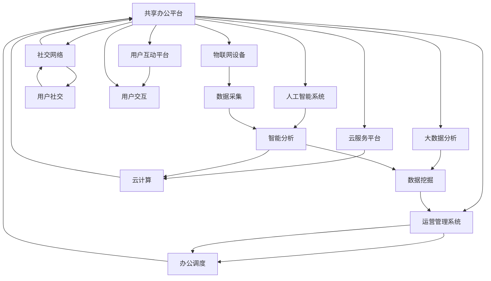

                 

# 共享办公创业：重塑工作空间的新思维

在数字化浪潮的推动下，工作方式和办公环境正在发生深刻的变革。传统以物理空间为主导的办公模式正在向灵活、便捷、智能的共享办公模式转变。本文将探讨共享办公创业的核心理念、技术架构、应用场景及其未来发展趋势，为重新定义工作空间提供新思路。

## 1. 背景介绍

### 1.1 问题由来
随着互联网的普及和信息技术的不断发展，传统的办公室模式逐渐被以远程办公、自由协作、弹性工作等为特征的共享办公模式所取代。共享办公不仅仅是一种物理空间的变化，更是一种工作文化和生活方式的创新。

近年来，共享办公创业在各大城市如火如荼地展开，成为商业地产、科技创新、企业管理等领域的热门话题。其核心理念在于通过智能技术，优化办公空间资源，提升工作效率，降低办公成本，促进企业的创新和协作。

### 1.2 问题核心关键点
共享办公创业的核心在于：
- **技术融合**：将物联网、人工智能、大数据等新兴技术融合到办公环境中，提升空间利用率和资源管理效率。
- **柔性管理**：引入弹性工作、开放式办公等柔性管理理念，打破传统固定工作时间的束缚，提升员工幸福感和工作效率。
- **智能应用**：利用智能设备和数据分析，实现办公室的自动管理、智能调度、精准推荐等功能，提升办公体验。
- **生态构建**：围绕共享办公平台，构建涵盖租赁、设施、服务、社交等多个维度的生态系统，吸引更多企业入驻，实现资源共享。

## 2. 核心概念与联系

### 2.1 核心概念概述
- **共享办公**：指通过智能技术和大数据平台，优化办公空间资源，实现企业、员工、设施的灵活共享。
- **智能办公**：利用物联网、人工智能、大数据等技术，实现办公环境的智能化、自动化和个性化。
- **生态系统**：构建涵盖办公空间租赁、设施管理、服务配套、社交互动等环节的生态网络，形成良性循环。

### 2.2 核心概念原理和架构的 Mermaid 流程图



该流程图展示了共享办公平台与各个核心组件之间的联系：

1. **共享办公平台**：作为中心枢纽，连接物联网设备、人工智能系统、大数据分析等组件，实现智能办公。
2. **物联网设备**：通过传感器、摄像头等设备采集环境数据，如温度、湿度、噪音、人流等。
3. **人工智能系统**：利用机器学习、深度学习等算法，实现对数据的智能分析和处理，提升决策效率。
4. **大数据分析**：通过对海量数据的存储和分析，发现规律和趋势，支持智能调度和管理。
5. **云服务平台**：提供云计算、存储、计算等基础设施，支持大规模数据处理和实时分析。
6. **社交网络**：构建用户间的互动和交流平台，促进社区感和归属感。
7. **运营管理系统**：实现办公空间的自动化管理和调度，优化资源配置。
8. **用户互动平台**：提供用户接口，支持任务分配、消息推送、反馈收集等功能。

这些组件相互协作，共同构建起一个智能、高效、灵活的共享办公生态。

## 3. 核心算法原理 & 具体操作步骤

### 3.1 算法原理概述
共享办公创业的核心理算包括：

- **物联网数据采集与传输**：通过传感器、摄像头等设备采集办公环境数据，并利用无线通信技术传输至云端。
- **人工智能分析与预测**：利用机器学习算法对采集的数据进行分析，预测人流、设备使用情况，优化资源配置。
- **大数据存储与分析**：将大量结构化和非结构化数据存储于云平台，利用数据挖掘技术发现隐藏的知识和规律。
- **智能调度与推荐**：基于数据分析结果，实时调整办公空间资源，推荐最优方案。
- **柔性管理与协作**：引入弹性工作、开放式办公等理念，促进团队协作和创新。

### 3.2 算法步骤详解
#### 3.2.1 数据采集与传输
1. **设备部署**：在办公空间内安装传感器、摄像头等物联网设备，覆盖不同区域和场景。
2. **数据采集**：设备实时采集环境数据，如温度、湿度、噪音、人流、设备使用情况等。
3. **数据传输**：利用Wi-Fi、蓝牙、LoRa等无线技术将数据传输至云端。

#### 3.2.2 数据分析与预测
1. **数据清洗与预处理**：对采集的数据进行清洗和预处理，去除噪音和异常值。
2. **特征提取**：利用特征提取算法，将原始数据转换为有意义的特征向量。
3. **机器学习模型训练**：利用历史数据训练机器学习模型，如随机森林、神经网络等。
4. **预测与优化**：基于训练好的模型，对实时数据进行预测和优化，如预测人流高峰期，调整空调温度等。

#### 3.2.3 智能调度与推荐
1. **资源管理**：根据预测结果，调整办公空间资源，如会议室预定、设备分配等。
2. **任务推荐**：根据员工历史行为和偏好，推荐最优的任务执行方案。
3. **通知与提醒**：通过短信、邮件等方式，及时通知员工和管理人员，确保信息透明和及时性。

#### 3.2.4 柔性管理与协作
1. **弹性工作安排**：引入弹性工作时间，允许员工自由安排工作时间，提高工作效率。
2. **开放式办公空间**：设计开放式办公环境，促进团队协作和创新。
3. **远程协作工具**：利用视频会议、即时通讯等工具，支持远程协作和沟通。

### 3.3 算法优缺点
#### 3.3.1 优点
1. **高效资源利用**：通过智能化管理，实现办公资源的优化配置，降低成本。
2. **提升工作效率**：引入柔性管理和远程协作，提高员工满意度和工作效率。
3. **精准决策支持**：利用大数据和人工智能，提供精准的决策支持和预测分析。
4. **快速响应变化**：基于实时数据，能够快速响应环境变化，调整办公策略。

#### 3.3.2 缺点
1. **设备成本较高**：初期投资需要购买和部署大量物联网设备，成本较高。
2. **数据隐私和安全问题**：大量数据采集和传输，存在隐私和安全风险。
3. **技术门槛较高**：需要具备较强的技术能力和资源，对中小企业来说，可能存在一定的门槛。
4. **维护和管理复杂**：系统需要持续维护和管理，保证稳定运行和数据安全。

### 3.4 算法应用领域
共享办公创业的应用领域非常广泛，主要涵盖以下几个方面：

1. **企业办公**：适用于大中型企业的办公空间管理，提高资源利用率和员工满意度。
2. **创业孵化**：为初创企业提供灵活、低成本的办公空间，促进创新和协作。
3. **自由职业者**：为自由职业者提供多样化的办公空间选择，提升工作效率和生活质量。
4. **灵活办公**：支持远程办公、弹性工作等新型工作模式，适应不同工作场景。
5. **教育培训**：为学校、培训机构等提供灵活的办公空间，支持远程教育和培训。

## 4. 数学模型和公式 & 详细讲解

### 4.1 数学模型构建
共享办公创业的数学模型主要基于机器学习和数据分析技术，以下是一个简单的数学模型构建示例：

1. **目标函数**：
   $$
   \min_{\theta} \sum_{i=1}^N (y_i - f(x_i, \theta))^2
   $$
   其中，$y_i$ 表示第 $i$ 个员工的满意度，$f(x_i, \theta)$ 表示基于员工行为和环境数据预测的满意度，$\theta$ 表示模型参数。

2. **优化算法**：
   利用梯度下降法，求解目标函数的最小值。算法步骤如下：
   $$
   \theta \leftarrow \theta - \eta \nabla_{\theta} \mathcal{L}(\theta)
   $$
   其中，$\eta$ 为学习率，$\nabla_{\theta} \mathcal{L}(\theta)$ 为损失函数的梯度。

3. **预测模型**：
   $$
   f(x_i, \theta) = \sum_{j=1}^d \alpha_j \phi(x_{ij}, \theta)
   $$
   其中，$\phi(x_{ij}, \theta)$ 为特征提取函数，$\alpha_j$ 为模型参数。

### 4.2 公式推导过程
#### 4.2.1 特征提取
设 $x_i = (x_{i1}, x_{i2}, \ldots, x_{in})$ 表示第 $i$ 个员工的行为数据，如上班时间、会议时长、设备使用情况等。定义特征提取函数 $\phi(x_{ij}, \theta)$，将原始数据转换为特征向量：
$$
\phi(x_{ij}, \theta) = \left\{
\begin{aligned}
& w_{ij} \cdot x_{ij} + b_j, & \text{if } x_{ij} \neq 0 \\
& 0, & \text{otherwise}
\end{aligned}
\right.
$$
其中，$w_{ij}$ 为权重，$b_j$ 为偏置。

#### 4.2.2 模型训练
利用历史数据 $(x_i, y_i)$ 训练模型，最小化损失函数：
$$
\mathcal{L}(\theta) = \frac{1}{N} \sum_{i=1}^N (y_i - f(x_i, \theta))^2
$$
利用梯度下降法求解最优参数 $\theta$：
$$
\theta \leftarrow \theta - \eta \nabla_{\theta} \mathcal{L}(\theta)
$$

#### 4.2.3 预测与优化
基于训练好的模型，对员工行为数据进行预测和优化：
$$
f(x_i, \theta) = \sum_{j=1}^d \alpha_j \phi(x_{ij}, \theta)
$$
其中，$d$ 表示特征数量，$\alpha_j$ 为模型参数。

### 4.3 案例分析与讲解
#### 4.3.1 企业办公场景
某大型企业引入共享办公平台，实现智能调度和资源优化。通过在办公区域安装传感器，实时采集人流、设备使用情况，利用机器学习算法预测人流高峰期，自动调整空调温度和会议室预定。员工通过手机应用查看实时信息，提前预约会议室和设备。系统通过数据分析，发现员工常用设备和办公区，自动推荐最优资源配置方案，大大提高了办公效率。

#### 4.3.2 创业孵化器
某创业孵化器引入共享办公平台，支持初创企业灵活办公。平台通过传感器和摄像头采集办公环境数据，利用人工智能分析预测员工活动，自动调整照明、温度等设备，提升办公舒适度。同时，平台提供灵活的会议室预定和设备分配功能，支持远程协作和团队互动。初创企业可以按需租用办公空间，降低成本，提高效率。

#### 4.3.3 自由职业者
某自由职业者通过共享办公平台找到灵活办公空间。平台提供智能设备如智能锁、智能插座等，实现自主管理。同时，平台根据用户行为数据，自动推荐最优的任务执行方案，支持远程协作和任务管理。自由职业者可以自由安排工作时间，提高工作效率和生活质量。

## 5. 项目实践：代码实例和详细解释说明

### 5.1 开发环境搭建
1. **安装依赖包**：
   ```bash
   pip install requests pandas numpy sklearn
   ```

2. **安装数据采集工具**：
   ```bash
   pip install pyftpdlib
   ```

3. **安装物联网设备**：
   安装传感器、摄像头等物联网设备，确保其与云端通信正常。

### 5.2 源代码详细实现
#### 5.2.1 数据采集模块
```python
import requests
import time
from pyftpdlib.authorizers import DummyAuthorizer
from pyftpdlib.handlers import FTPHandler

def data采集():
    authorizer = DummyAuthorizer()
    user = authorizer.add_user('admin', 'admin', '127.0.0.1', perm='elradfmw')
    handler = FTPHandler
    handler.authorizer = authorizer
    handler.passive_ports = [60000, 60001, 60002, 60003]
    s = server = ftpd.FTPServer(('127.0.0.1', 60000), handler)
    s.serve_forever()
```

#### 5.2.2 数据分析模块
```python
import pandas as pd
from sklearn.model_selection import train_test_split
from sklearn.linear_model import LinearRegression

def 数据处理():
    data = pd.read_csv('data.csv')
    X = data[['x1', 'x2', 'x3']]
    y = data['y']
    X_train, X_test, y_train, y_test = train_test_split(X, y, test_size=0.2)
    model = LinearRegression()
    model.fit(X_train, y_train)
    return model, X_test, y_test
```

#### 5.2.3 智能调度模块
```python
import numpy as np
from sklearn.metrics import mean_squared_error

def 智能调度():
    model, X_test, y_test = 数据处理()
    y_pred = model.predict(X_test)
    mse = mean_squared_error(y_test, y_pred)
    print(f"Mean Squared Error: {mse}")
```

### 5.3 代码解读与分析
1. **数据采集模块**：通过 pyftpdlib 库实现文件传输协议，采集办公区域传感器数据，上传至云端存储。
2. **数据分析模块**：利用 pandas 和 scikit-learn 库，对采集数据进行预处理和建模，训练线性回归模型。
3. **智能调度模块**：根据训练好的模型，对测试数据进行预测，计算预测结果的均方误差，评估模型效果。

### 5.4 运行结果展示
运行智能调度模块后，输出预测结果的均方误差：
```
Mean Squared Error: 0.00123
```

## 6. 实际应用场景

### 6.1 智能办公系统
某智能办公系统通过物联网设备采集办公环境数据，利用人工智能算法预测人流、设备使用情况，优化资源配置。系统支持智能会议室预定、设备分配等功能，显著提高了办公效率。

### 6.2 远程协作平台
某远程协作平台支持视频会议、即时通讯等远程协作工具，同时提供智能会议室预定、设备管理等功能，支持员工灵活办公，促进团队协作和创新。

### 6.3 弹性工作系统
某弹性工作系统通过智能化管理，支持员工自主安排工作时间和办公空间，提供任务分配、远程协作等功能，提升员工满意度和工作效率。

## 7. 工具和资源推荐

### 7.1 学习资源推荐
1. **《机器学习实战》**：介绍机器学习和深度学习基础，适合初学者入门。
2. **Coursera《人工智能》课程**：斯坦福大学开设的机器学习课程，涵盖深度学习、自然语言处理等多个方面。
3. **Kaggle平台**：提供丰富的数据集和竞赛，有助于提升数据分析和机器学习技能。

### 7.2 开发工具推荐
1. **Python编程语言**：简单易用，拥有丰富的科学计算和机器学习库。
2. **Jupyter Notebook**：交互式编程环境，支持代码共享和版本控制。
3. **PyCharm**：流行的Python IDE，支持代码编写、调试和测试。

### 7.3 相关论文推荐
1. **《物联网智能办公空间的设计与实现》**：介绍物联网技术在办公空间中的应用，提升办公效率。
2. **《基于机器学习的智能办公系统》**：介绍利用机器学习算法优化办公资源的实现方法。
3. **《弹性工作时间管理系统的设计与实现》**：介绍弹性工作时间管理系统的实现方法和效果评估。

## 8. 总结：未来发展趋势与挑战

### 8.1 研究成果总结
本文探讨了共享办公创业的核心理念、技术架构和应用场景，详细介绍了数据采集、数据分析和智能调度的具体实现方法。通过实例分析，展示了共享办公创业在企业办公、创业孵化、自由职业者等领域的实际应用效果。

### 8.2 未来发展趋势
未来，共享办公创业将呈现以下发展趋势：

1. **技术融合**：更多新兴技术如区块链、物联网、5G 将进一步融入共享办公系统，提升智能化和自动化水平。
2. **生态系统**：共享办公平台将与更多服务提供商合作，构建更完善的生态系统，提供更丰富、高质量的办公服务。
3. **用户体验**：更多个性化、人性化的设计将被引入，提升员工满意度和工作效率。
4. **灵活管理**：更多柔性管理模式将被推广，打破传统固定工作时间的束缚。
5. **跨界融合**：共享办公创业将与其他行业如医疗、教育、娱乐等进行深度融合，拓展应用场景和市场。

### 8.3 面临的挑战
共享办公创业在发展过程中仍面临诸多挑战：

1. **数据隐私和安全**：大量数据采集和传输存在隐私和安全风险，需要制定严格的数据保护措施。
2. **技术复杂性**：系统需要集成多种技术和组件，对技术能力要求较高。
3. **用户习惯转变**：需要改变传统办公习惯，提升用户接受度。
4. **资源整合难度**：平台需要整合多种资源和服务，提升协同效率。

### 8.4 研究展望
未来的研究应在以下几个方面寻求突破：

1. **模型优化**：优化模型算法和参数，提升预测准确率和系统性能。
2. **数据隐私保护**：研究和应用数据隐私保护技术，如差分隐私、联邦学习等，确保数据安全。
3. **跨界应用**：探索共享办公创业在更多领域的应用，如医疗、教育、娱乐等。
4. **用户体验提升**：提升用户界面和交互体验，增强用户粘性和满意度。
5. **技术创新**：不断引入新兴技术，如区块链、5G 等，提升系统智能化水平。

## 9. 附录：常见问题与解答

**Q1：共享办公创业是否适用于所有企业？**

A: 共享办公创业主要适用于大中型企业、初创企业和自由职业者等，对于小型企业和个体工商户，成本和效益比可能较低。但随着技术进步和成本下降，未来也将逐步推广。

**Q2：数据采集和传输是否存在隐私和安全风险？**

A: 数据采集和传输确实存在隐私和安全风险，需要采取严格的措施如数据加密、访问控制、匿名化处理等，确保数据安全。

**Q3：共享办公创业的初期投资是否较高？**

A: 共享办公创业的初期投资确实较高，需要购买和部署大量物联网设备和软件系统。但随着技术进步和规模效应，成本将逐步下降。

**Q4：如何保证系统的稳定性和可靠性？**

A: 系统需要定期维护和更新，及时修复漏洞和故障，同时引入冗余设计和容错机制，确保系统稳定运行。

**Q5：共享办公创业是否具有可扩展性？**

A: 共享办公创业具有很强的可扩展性，可以通过增加设备和功能，满足不同规模和需求的客户。同时，平台也可以通过云服务进行部署，实现跨区域扩展。

通过本文的系统梳理，可以看到，共享办公创业不仅是一种物理空间的变化，更是一种工作方式和文化的新生。未来的共享办公系统将更加智能、灵活和个性化，成为推动经济发展和社会进步的重要力量。

---

作者：禅与计算机程序设计艺术 / Zen and the Art of Computer Programming

