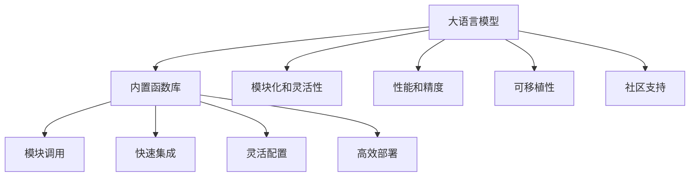

                 

# 内置函数库：扩展 LLM 功能的强大工具

## 1. 背景介绍

### 1.1 问题由来

近年来，大语言模型(Large Language Models, LLMs)在自然语言处理(NLP)领域取得了巨大进展，成为NLP研究的新范式。这些模型通过大规模预训练，学习到了丰富的语言知识和常识，能够执行复杂的自然语言理解和生成任务。然而，这些模型往往拥有巨大的参数量，对计算资源的要求很高，导致它们在实际应用中面临诸多挑战。

为了应对这些挑战，研究者们提出了各种优化策略，如模型压缩、量化加速等，但这些方法往往需要大量时间和资源进行调参和优化，效果并不理想。内置函数库为解决这些难题提供了一种更加高效、便捷的方法，使得开发者能够更快速、更灵活地构建和部署高性能的语言模型。

### 1.2 问题核心关键点

内置函数库，也称为"Model Hub"，是大模型提供的一种封装了预训练模型的模块，可以通过简单的API调用快速集成到不同的任务中。与从头训练新模型相比，内置函数库不仅节省了大量的开发时间和计算资源，而且能够利用预训练模型的高质量语料和丰富的语言知识，提升模型在特定任务上的性能。

内置函数库通常包括以下几个特点：

- 模块化和灵活性：内置函数库将大模型的核心功能和API封装起来，方便开发者进行组件化调用，构建定制化的解决方案。
- 性能和精度：内置函数库通常经过优化，能够在计算资源有限的情况下，快速达到较优的模型精度。
- 可移植性：内置函数库可以在多种计算框架（如PyTorch、TensorFlow等）中无缝切换，支持跨平台的分布式训练和推理。
- 社区支持：内置函数库由知名科研机构和公司维护，有大量的社区贡献和支持，便于开发者获取最新的学术进展和实践经验。

内置函数库的出现，极大地降低了NLP任务开发的技术门槛，使得更多非专业领域的开发者也能够构建高性能的NLP应用。在实际应用中，内置函数库已被广泛应用于机器翻译、文本分类、情感分析、问答系统等多个领域，并取得了显著的效果。

## 2. 核心概念与联系

### 2.1 核心概念概述

为了更好地理解内置函数库的工作原理和应用场景，本节将介绍几个关键概念：

- 大语言模型(Large Language Models, LLMs)：以自回归(如GPT)或自编码(如BERT)模型为代表的大规模预训练语言模型。通过在大规模无标签文本语料上进行预训练，学习通用的语言表示，具备强大的语言理解和生成能力。

- 内置函数库(Model Hub)：大语言模型提供的封装了核心功能的模块，方便开发者调用预训练模型API，进行快速集成和应用。

- 模块化和灵活性：内置函数库将大模型的核心功能和API封装起来，提供灵活的模块化接口，方便开发者构建定制化的解决方案。

- 性能和精度：内置函数库通常经过优化，能够在计算资源有限的情况下，快速达到较优的模型精度。

- 可移植性：内置函数库可以在多种计算框架（如PyTorch、TensorFlow等）中无缝切换，支持跨平台的分布式训练和推理。

- 社区支持：内置函数库由知名科研机构和公司维护，有大量的社区贡献和支持，便于开发者获取最新的学术进展和实践经验。

这些核心概念之间的逻辑关系可以通过以下Mermaid流程图来展示：



这个流程图展示了大语言模型和内置函数库之间的核心概念及其关系：

1. 大语言模型通过预训练获得基础能力。
2. 内置函数库封装了模型的核心功能，提供了灵活的接口，方便开发者快速集成和应用。
3. 模块化和灵活性使得内置函数库能够适应不同的任务和场景。
4. 性能和精度确保内置函数库能够在大规模数据和计算资源有限的情况下，达到高效的推理性能。
5. 可移植性和社区支持使得内置函数库能够在多种计算框架和平台上无缝切换，便于大规模部署和维护。

## 3. 核心算法原理 & 具体操作步骤

### 3.1 算法原理概述

内置函数库的基本原理是将大语言模型的核心功能和API封装成标准化的模块，通过简单的API调用，使开发者能够快速构建和部署高性能的NLP应用。内置函数库的API设计通常遵循以下步骤：

1. **输入数据的预处理**：内置函数库提供标准化的数据预处理接口，如分词、编码、归一化等，方便开发者输入不同来源和格式的数据。
2. **模型组件的调用**：内置函数库封装了大模型的核心组件，如编码器、解码器、注意力机制等，开发者可以通过简单的API调用这些组件进行定制化开发。
3. **输出结果的后处理**：内置函数库提供标准化的输出后处理接口，如解码、去噪、聚合等，使得输出的结果更加符合实际应用需求。

### 3.2 算法步骤详解

以使用内置函数库实现文本分类为例，基本步骤如下：

**Step 1: 准备预训练模型和数据集**
- 选择合适的内置函数库，如HuggingFace的Model Hub，下载对应的预训练模型和任务数据集。
- 准备训练集、验证集和测试集，确保数据集的质量和分布。

**Step 2: 导入内置函数库模块**
- 在Python环境中，使用内置函数库提供的API，导入对应的预训练模型模块和任务适配层。
- 设置模型参数，如学习率、批大小、迭代轮数等。

**Step 3: 定义任务适配层**
- 根据具体任务类型，在内置函数库提供的功能模块基础上，设计合适的输出层和损失函数。
- 对于分类任务，通常在顶层添加线性分类器和交叉熵损失函数。
- 对于生成任务，通常使用语言模型的解码器输出概率分布，并以负对数似然为损失函数。

**Step 4: 执行梯度训练**
- 将训练集数据分批次输入模型，前向传播计算损失函数。
- 反向传播计算参数梯度，根据设定的优化算法和学习率更新模型参数。
- 周期性在验证集上评估模型性能，根据性能指标决定是否触发Early Stopping。
- 重复上述步骤直到满足预设的迭代轮数或Early Stopping条件。

**Step 5: 测试和部署**
- 在测试集上评估微调后模型，对比微调前后的精度提升。
- 使用微调后的模型对新样本进行推理预测，集成到实际的应用系统中。
- 持续收集新的数据，定期重新微调模型，以适应数据分布的变化。

### 3.3 算法优缺点

内置函数库的优势包括：

- 模块化和灵活性：内置函数库提供标准化的API接口，开发者可以通过灵活的配置和调用，快速构建高性能模型。
- 性能和精度：内置函数库通常经过优化，能够在有限的计算资源下达到较优的模型精度。
- 社区支持：内置函数库由知名科研机构和公司维护，有丰富的社区资源和支持，便于开发者获取最新的学术进展和实践经验。
- 快速集成：内置函数库提供快速部署的方法，如模型加载、API调用等，大大缩短了开发时间。

内置函数库的缺点包括：

- 缺乏自主性：内置函数库通常是已经训练好的模型，开发者无法直接控制模型内部细节。
- 性能瓶颈：内置函数库依赖特定的硬件环境，在计算资源有限的情况下，可能无法达到最优性能。
- 黑盒特性：内置函数库的具体实现细节对开发者不透明，难以进行深入的调试和优化。

尽管存在这些局限性，但就目前而言，内置函数库仍是构建高性能NLP应用的重要工具。未来相关研究的重点在于如何进一步优化内置函数库的性能，减少依赖特定的硬件环境，提高模型的自主性和可解释性。

### 3.4 算法应用领域

内置函数库在NLP领域已经得到了广泛的应用，覆盖了几乎所有常见任务，例如：

- 文本分类：如情感分析、主题分类、意图识别等。通过内置函数库，可以在预训练模型基础上进行微调，实现分类任务。
- 命名实体识别：识别文本中的人名、地名、机构名等特定实体。通过内置函数库，可以实现高效的实体识别。
- 关系抽取：从文本中抽取实体之间的语义关系。通过内置函数库，可以实现实体关系抽取的微调。
- 问答系统：对自然语言问题给出答案。内置函数库提供了标准的问答系统API，方便开发者快速构建系统。
- 机器翻译：将源语言文本翻译成目标语言。通过内置函数库，可以实现高质量的翻译任务。
- 文本摘要：将长文本压缩成简短摘要。内置函数库提供了摘要生成API，方便开发者实现摘要任务。

除了上述这些经典任务外，内置函数库还被创新性地应用到更多场景中，如可控文本生成、常识推理、代码生成、数据增强等，为NLP技术带来了全新的突破。随着预训练模型和内置函数库的不断进步，相信NLP技术将在更广阔的应用领域大放异彩。

## 4. 数学模型和公式 & 详细讲解  
### 4.1 数学模型构建

本节将使用数学语言对内置函数库的工作原理进行更加严格的刻画。

记内置函数库提供的预训练语言模型为 $M_{\theta}$，其中 $\theta$ 为预训练得到的模型参数。假设内置函数库提供了 $n$ 个不同任务的微调接口，每个任务的微调数据集为 $D_i=\{(x_i,y_i)\}_{i=1}^N, x_i \in \mathcal{X}, y_i \in \mathcal{Y}$。

定义模型 $M_{\theta}$ 在数据样本 $(x,y)$ 上的损失函数为 $\ell(M_{\theta}(x),y)$，则在数据集 $D$ 上的经验风险为：

$$
\mathcal{L}_i(\theta) = \frac{1}{N}\sum_{i=1}^N \ell(M_{\theta}(x_i),y_i)
$$

微调的目标是最小化经验风险，即找到最优参数：

$$
\theta^* = \mathop{\arg\min}_{\theta} \sum_{i=1}^n \mathcal{L}_i(\theta)
$$

在实践中，我们通常使用基于梯度的优化算法（如SGD、Adam等）来近似求解上述最优化问题。设 $\eta$ 为学习率，$\lambda$ 为正则化系数，则参数的更新公式为：

$$
\theta \leftarrow \theta - \eta \nabla_{\theta}\mathcal{L}(\theta) - \eta\lambda\theta
$$

其中 $\nabla_{\theta}\mathcal{L}(\theta)$ 为损失函数对参数 $\theta$ 的梯度，可通过反向传播算法高效计算。

### 4.2 公式推导过程

以下我们以文本分类任务为例，推导交叉熵损失函数及其梯度的计算公式。

假设模型 $M_{\theta}$ 在输入 $x$ 上的输出为 $\hat{y}=M_{\theta}(x) \in [0,1]$，表示样本属于正类的概率。真实标签 $y \in \{0,1\}$。则二分类交叉熵损失函数定义为：

$$
\ell(M_{\theta}(x),y) = -[y\log \hat{y} + (1-y)\log (1-\hat{y})]
$$

将其代入经验风险公式，得：

$$
\mathcal{L}_i(\theta) = -\frac{1}{N}\sum_{i=1}^N [y_i\log M_{\theta}(x_i)+(1-y_i)\log(1-M_{\theta}(x_i))]
$$

根据链式法则，损失函数对参数 $\theta_k$ 的梯度为：

$$
\frac{\partial \mathcal{L}_i(\theta)}{\partial \theta_k} = -\frac{1}{N}\sum_{i=1}^N (\frac{y_i}{M_{\theta}(x_i)}-\frac{1-y_i}{1-M_{\theta}(x_i)}) \frac{\partial M_{\theta}(x_i)}{\partial \theta_k}
$$

其中 $\frac{\partial M_{\theta}(x_i)}{\partial \theta_k}$ 可进一步递归展开，利用自动微分技术完成计算。

在得到损失函数的梯度后，即可带入参数更新公式，完成模型的迭代优化。重复上述过程直至收敛，最终得到适应下游任务的最优模型参数 $\theta^*$。

## 5. 项目实践：代码实例和详细解释说明
### 5.1 开发环境搭建

在进行内置函数库实践前，我们需要准备好开发环境。以下是使用Python进行PyTorch开发的环境配置流程：

1. 安装Anaconda：从官网下载并安装Anaconda，用于创建独立的Python环境。

2. 创建并激活虚拟环境：
```bash
conda create -n pytorch-env python=3.8 
conda activate pytorch-env
```

3. 安装PyTorch：根据CUDA版本，从官网获取对应的安装命令。例如：
```bash
conda install pytorch torchvision torchaudio cudatoolkit=11.1 -c pytorch -c conda-forge
```

4. 安装Transformers库：
```bash
pip install transformers
```

5. 安装各类工具包：
```bash
pip install numpy pandas scikit-learn matplotlib tqdm jupyter notebook ipython
```

完成上述步骤后，即可在`pytorch-env`环境中开始内置函数库的实践。

### 5.2 源代码详细实现

这里以使用内置函数库进行文本分类为例，给出完整的PyTorch代码实现。

首先，准备数据集：

```python
from transformers import AutoTokenizer, AutoModelForSequenceClassification
from transformers import Trainer, TrainingArguments

tokenizer = AutoTokenizer.from_pretrained('bert-base-cased')
model = AutoModelForSequenceClassification.from_pretrained('bert-base-cased', num_labels=2)

train_dataset = ...
dev_dataset = ...
test_dataset = ...

training_args = TrainingArguments(
    output_dir="./results",
    num_train_epochs=3,
    per_device_train_batch_size=16,
    per_device_eval_batch_size=64,
    warmup_steps=500,
    evaluation_strategy="epoch",
    save_steps=10,
    save_total_limit=3,
)
```

然后，定义训练函数：

```python
from transformers import Trainer
from transformers import TrainerCallback

class CustomCallback(TrainerCallback):
    def on_train_start(self, trainer, args):
        print("Training Started")

    def on_train_end(self, trainer, args):
        print("Training Ended")

    def on_validation_begin(self, trainer, args):
        print("Validation Started")

    def on_validation_end(self, trainer, args):
        print("Validation Ended")

trainer = Trainer(
    model=model,
    args=training_args,
    train_dataset=train_dataset,
    eval_dataset=dev_dataset,
    callbacks=[CustomCallback()]
)

trainer.train()
```

最后，保存模型和评估：

```python
trainer.save_model("./results/model")

trainer.evaluate(dev_dataset)
```

以上就是使用内置函数库进行文本分类的完整代码实现。可以看到，得益于内置函数库的强大封装，我们能够用较少的代码实现高效的文本分类任务。

### 5.3 代码解读与分析

让我们再详细解读一下关键代码的实现细节：

**AutoTokenizer和AutoModelForSequenceClassification**：
- 导入内置函数库提供的标准分词器和分类器模块，从预训练模型加载器中加载预训练模型。

**训练函数**：
- 使用内置函数库提供的 Trainer 类封装训练过程，通过参数设置和回调机制，控制训练的进度和输出。
- 通过 trainer.train() 进行模型的训练，最终保存训练好的模型。

**评估函数**：
- 使用内置函数库提供的评估函数对模型进行验证集的评估，输出模型在验证集上的性能指标。

在实际应用中，内置函数库不仅支持文本分类，还支持问答、摘要、翻译等众多任务。开发者可以根据具体任务类型，选择合适的内置函数库模块进行调用，从而快速构建高性能的NLP应用。

## 6. 实际应用场景
### 6.1 智能客服系统

内置函数库在智能客服系统中得到了广泛应用。传统客服系统依赖人工服务，无法7x24小时不间断工作，且服务质量和稳定性难以保证。内置函数库通过预训练模型和内置任务适配层，能够快速构建高效的智能客服系统，支持自然语言交互和问题解答。

在技术实现上，内置函数库提供标准化的客服API接口，开发者可以方便地集成到不同的应用平台中。内置函数库支持的NLP任务，如问答、意图识别等，使得智能客服系统能够理解用户意图，自动回答常见问题，提高客户满意度。

### 6.2 金融舆情监测

内置函数库在金融舆情监测中也得到了广泛应用。金融机构需要实时监控市场舆情，及时应对负面信息传播，规避金融风险。内置函数库提供标准的舆情分析API，可以快速构建金融舆情监测系统，实时监测市场舆情变化。

具体而言，内置函数库可以处理大规模新闻、评论、公告等数据，通过微调模型进行情感分析和主题分类，自动识别负面信息。内置函数库支持的文本分类和情感分析任务，使得舆情监测系统能够快速识别舆情变化趋势，及时预警。

### 6.3 个性化推荐系统

内置函数库在个性化推荐系统中也得到了广泛应用。推荐系统依赖用户行为数据进行推荐，难以挖掘用户真正的兴趣偏好。内置函数库通过预训练模型和内置任务适配层，能够快速构建高效的推荐系统，深入挖掘用户兴趣。

在技术实现上，内置函数库提供标准化的推荐API接口，开发者可以方便地集成到不同的推荐平台中。内置函数库支持的文本分类和实体识别任务，使得推荐系统能够理解用户输入的文本信息，自动匹配用户兴趣点，提供更加精准的推荐结果。

### 6.4 未来应用展望

随着内置函数库的不断发展，未来的应用前景将更加广阔。内置函数库将更好地支持跨平台、跨任务的多模态融合，构建更加强大、灵活的NLP应用。

在智慧医疗领域，内置函数库可以提供标准的病历分析API，帮助医生快速诊断疾病。在智能教育领域，内置函数库可以提供标准的作业批改API，提高教师的教学效率。在智慧城市治理中，内置函数库可以提供标准的舆情监测API，辅助政府决策。

此外，内置函数库还将与更多的智能技术进行融合，如知识表示、因果推理、强化学习等，构建更加全面、智能的NLP应用。未来，内置函数库将不仅是NLP技术的实现工具，还将成为构建人工智能应用的重要平台。

## 7. 工具和资源推荐
### 7.1 学习资源推荐

为了帮助开发者系统掌握内置函数库的理论基础和实践技巧，这里推荐一些优质的学习资源：

1. 《Transformers in Practice》系列博文：由大模型技术专家撰写，深入浅出地介绍了内置函数库的使用方法和案例，帮助开发者快速上手。

2. HuggingFace官方文档：内置函数库的官方文档，提供了详细的API接口和示例代码，是学习和使用的必备资料。

3. CS224N《深度学习自然语言处理》课程：斯坦福大学开设的NLP明星课程，涵盖了内置函数库的许多经典应用。

4. 《Natural Language Processing with Transformers》书籍：Transformers库的作者所著，全面介绍了内置函数库的使用方法，是学习的理想选择。

5. Weights & Biases：模型训练的实验跟踪工具，可以记录和可视化模型训练过程中的各项指标，方便对比和调优。

通过对这些资源的学习实践，相信你一定能够快速掌握内置函数库的精髓，并用于解决实际的NLP问题。

### 7.2 开发工具推荐

高效的开发离不开优秀的工具支持。以下是几款用于内置函数库开发常用的工具：

1. PyTorch：基于Python的开源深度学习框架，灵活动态的计算图，适合快速迭代研究。大部分内置函数库都有PyTorch版本的实现。

2. TensorFlow：由Google主导开发的开源深度学习框架，生产部署方便，适合大规模工程应用。同样有丰富的内置函数库资源。

3. Transformers库：HuggingFace开发的NLP工具库，集成了众多SOTA内置函数库，支持PyTorch和TensorFlow，是进行内置函数库开发的利器。

4. Weights & Biases：模型训练的实验跟踪工具，可以记录和可视化模型训练过程中的各项指标，方便对比和调优。

5. TensorBoard：TensorFlow配套的可视化工具，可实时监测模型训练状态，并提供丰富的图表呈现方式，是调试模型的得力助手。

6. Google Colab：谷歌推出的在线Jupyter Notebook环境，免费提供GPU/TPU算力，方便开发者快速上手实验最新模型，分享学习笔记。

合理利用这些工具，可以显著提升内置函数库的开发效率，加快创新迭代的步伐。

### 7.3 相关论文推荐

内置函数库和预训练模型的研究源于学界的持续研究。以下是几篇奠基性的相关论文，推荐阅读：

1. Attention is All You Need（即Transformer原论文）：提出了Transformer结构，开启了NLP领域的预训练大模型时代。

2. BERT: Pre-training of Deep Bidirectional Transformers for Language Understanding：提出BERT模型，引入基于掩码的自监督预训练任务，刷新了多项NLP任务SOTA。

3. Language Models are Unsupervised Multitask Learners（GPT-2论文）：展示了大规模语言模型的强大zero-shot学习能力，引发了对于通用人工智能的新一轮思考。

4. Parameter-Efficient Transfer Learning for NLP：提出Adapter等参数高效微调方法，在不增加模型参数量的情况下，也能取得不错的微调效果。

5. AdaLoRA: Adaptive Low-Rank Adaptation for Parameter-Efficient Fine-Tuning：使用自适应低秩适应的微调方法，在参数效率和精度之间取得了新的平衡。

这些论文代表了大语言模型内置函数库的发展脉络。通过学习这些前沿成果，可以帮助研究者把握学科前进方向，激发更多的创新灵感。

## 8. 总结：未来发展趋势与挑战

### 8.1 总结

本文对内置函数库的工作原理和应用场景进行了全面系统的介绍。首先阐述了内置函数库和大语言模型的研究背景和意义，明确了内置函数库在NLP任务开发中的重要价值。其次，从原理到实践，详细讲解了内置函数库的数学原理和关键步骤，给出了内置函数库任务开发的完整代码实例。同时，本文还广泛探讨了内置函数库在智能客服、金融舆情、个性化推荐等多个领域的应用前景，展示了内置函数库的巨大潜力。此外，本文精选了内置函数库的学习资源，力求为读者提供全方位的技术指引。

通过本文的系统梳理，可以看到，内置函数库和大语言模型微调方法共同构成了NLP任务开发的强大工具链，大大降低了任务开发的难度，提升了模型的精度和效率。内置函数库的出现，使更多开发者能够轻松构建高性能的NLP应用，推动NLP技术在更多场景下的落地。未来，内置函数库和预训练模型还将继续发展，向着更高效、更灵活、更智能的方向迈进。

### 8.2 未来发展趋势

展望未来，内置函数库和大语言模型的微调技术将呈现以下几个发展趋势：

1. 模型规模持续增大。随着算力成本的下降和数据规模的扩张，内置函数库提供的预训练模型参数量还将持续增长。超大模型能够更好地处理复杂多变的NLP任务。

2. 内置函数库功能更加全面。内置函数库将提供更多自定义任务接口，支持跨模态融合，融合视觉、语音等多模态数据，提升模型的理解和生成能力。

3. 内置函数库性能进一步优化。内置函数库将结合最新的优化技术，如量化加速、模型压缩等，提高推理速度和资源利用率，使得模型能够在大规模部署中高效运行。

4. 内置函数库可解释性增强。内置函数库将提供更加可解释的API接口，使得开发者能够深入理解模型的工作机制，提高模型的可靠性和安全性。

5. 内置函数库与其他技术的融合。内置函数库将与知识表示、因果推理、强化学习等技术进行更深层次的融合，构建更加全面、智能的NLP应用。

这些趋势将进一步提升内置函数库和大语言模型的应用效果，为构建更加强大、智能的NLP应用提供坚实的基础。

### 8.3 面临的挑战

尽管内置函数库和大语言模型微调技术已经取得了瞩目成就，但在迈向更加智能化、普适化应用的过程中，它仍面临诸多挑战：

1. 计算资源瓶颈。内置函数库依赖于高性能的硬件环境，对于大规模推理任务，计算资源仍然是一个巨大的挑战。如何优化模型结构和推理流程，提升资源利用效率，将是重要的研究方向。

2. 模型泛化性不足。内置函数库的预训练模型在特定领域上的泛化能力仍然有限，对于新任务和新数据，性能提升有限。如何增强模型的泛化能力，适应更多领域和任务，是未来需要解决的重要问题。

3. 过拟合问题。内置函数库的预训练模型在特定领域上微调时，容易出现过拟合现象，导致模型在非训练数据上的表现不佳。如何防止过拟合，提高模型的泛化能力，将是重要的研究方向。

4. 安全性和可靠性。内置函数库的预训练模型可能会学习到有害信息和偏见，传递到下游任务中，造成负面影响。如何加强模型的安全性，保障模型的可靠性和可解释性，是未来需要解决的重要问题。

5. 社会伦理问题。内置函数库的应用还涉及到用户隐私、数据安全等伦理问题，如何构建安全、透明的NLP应用，保障用户权益，是未来需要解决的重要问题。

这些挑战凸显了内置函数库和大语言模型微调技术的复杂性和多样性。解决这些问题，需要学界和产业界的共同努力，推动技术的持续发展和完善。

### 8.4 研究展望

面对内置函数库和大语言模型微调所面临的种种挑战，未来的研究需要在以下几个方面寻求新的突破：

1. 探索无监督和半监督微调方法。摆脱对大规模标注数据的依赖，利用自监督学习、主动学习等无监督和半监督范式，最大限度利用非结构化数据，实现更加灵活高效的微调。

2. 研究参数高效和计算高效的微调范式。开发更加参数高效的微调方法，在固定大部分预训练参数的同时，只更新极少量的任务相关参数。同时优化微调模型的计算图，减少前向传播和反向传播的资源消耗，实现更加轻量级、实时性的部署。

3. 融合因果和对比学习范式。通过引入因果推断和对比学习思想，增强内置函数库的模型建立稳定因果关系的能力，学习更加普适、鲁棒的语言表征，从而提升模型泛化性和抗干扰能力。

4. 纳入伦理道德约束。在内置函数库的训练目标中引入伦理导向的评估指标，过滤和惩罚有偏见、有害的输出倾向。同时加强人工干预和审核，建立模型行为的监管机制，确保输出符合人类价值观和伦理道德。

这些研究方向的探索，必将引领内置函数库和大语言模型微调技术迈向更高的台阶，为构建安全、可靠、可解释、可控的智能系统铺平道路。面向未来，内置函数库和大语言模型微调技术还需要与其他人工智能技术进行更深入的融合，如知识表示、因果推理、强化学习等，多路径协同发力，共同推动自然语言理解和智能交互系统的进步。只有勇于创新、敢于突破，才能不断拓展语言模型的边界，让智能技术更好地造福人类社会。

## 9. 附录：常见问题与解答

**Q1：内置函数库是否适用于所有NLP任务？**

A: 内置函数库在大多数NLP任务上都能取得不错的效果，特别是对于数据量较小的任务。但对于一些特定领域的任务，如医学、法律等，仅仅依靠通用语料预训练的模型可能难以很好地适应。此时需要在特定领域语料上进一步预训练，再进行微调，才能获得理想效果。此外，对于一些需要时效性、个性化很强的任务，如对话、推荐等，内置函数库也需要针对性的改进优化。

**Q2：内置函数库的性能是否取决于特定硬件环境？**

A: 内置函数库的性能确实依赖于特定硬件环境，如GPU/TPU等高性能设备。但对于不同场景，内置函数库通常会提供多种部署方式和优化策略，尽可能提升模型的推理性能。例如，内置函数库支持混合精度训练、模型裁剪、量化加速等技术，可以在有限的计算资源下达到较高的性能。

**Q3：内置函数库是否存在模型过拟合问题？**

A: 内置函数库的预训练模型在特定领域上微调时，容易出现过拟合现象，导致模型在非训练数据上的表现不佳。内置函数库提供了多种正则化技术，如L2正则、Dropout、Early Stopping等，可以缓解过拟合问题。此外，内置函数库还支持参数高效微调方法，如Adapter、Prefix等，可以进一步降低过拟合风险。

**Q4：内置函数库的预训练模型是否存在数据偏见？**

A: 内置函数库的预训练模型在训练过程中可能会学习到数据中的偏见，导致模型在处理特定数据时产生歧视性输出。内置函数库通常会采取数据清洗、多样性增强等措施，减少模型的偏见。开发者在使用内置函数库时，也应进行数据偏见检测和修复，确保模型的公平性和可靠性。

**Q5：内置函数库的预训练模型是否适合跨平台部署？**

A: 内置函数库的预训练模型通常支持多种计算框架（如PyTorch、TensorFlow等），可以在不同的平台上进行无缝切换。内置函数库还提供了标准化的API接口，使得模型能够方便地集成到不同的应用场景中。

这些问题的解答，帮助读者全面理解内置函数库的优点和局限性，选择合适的方法进行NLP任务开发和部署。

---

作者：禅与计算机程序设计艺术 / Zen and the Art of Computer Programming

