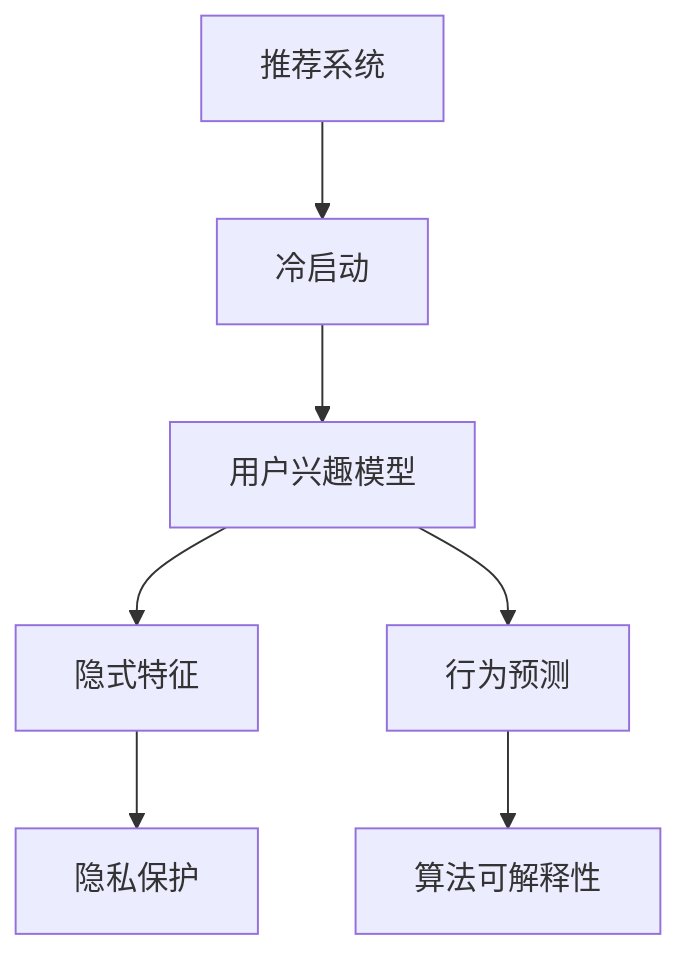

                 

# 冷启动场景的挑战：推荐系统的局限与解决方案

在数字化时代，个性化推荐系统已成为连接用户与内容的关键纽带。无论是电商、社交媒体、视频平台还是在线教育，推荐系统都在默默支撑着用户的体验，提升平台价值。然而，在冷启动场景中，即用户行为数据稀疏或未形成稳定偏好时，推荐系统的表现往往不尽如人意。如何在冷启动场景中，打破用户初始冷启动困境，快速识别用户兴趣，是推荐系统亟需解决的核心挑战之一。

本文将深入探讨冷启动场景下推荐系统面临的挑战，以及一系列解决方案。通过结合理论分析与实践案例，期望为推荐系统的设计与优化提供有价值的参考。

## 1. 背景介绍

### 1.1 问题由来
推荐系统在推荐用户感兴趣内容时，通常依赖于用户的显式行为数据（如浏览、点击、购买等）。然而，对于新用户或未有过明显行为的用户，这些数据往往是缺失的。此时，推荐系统难以准确把握用户兴趣，难以给出合理的推荐结果，导致用户体验下降，平台流失率上升。

### 1.2 问题核心关键点
冷启动推荐系统面临的关键问题包括：
- **数据稀疏性**：新用户或未行为用户的数据量通常较少，难以构建完备的兴趣模型。
- **隐式特征获取**：如何从用户的历史行为中挖掘深层次的隐式特征，构建更精准的推荐模型。
- **用户行为预测**：如何预测用户未来的行为倾向，快速适应用户兴趣变化。
- **用户隐私保护**：如何在保证隐私的前提下，获取有价值的用户数据。
- **算法可解释性**：推荐算法的决策过程应具备一定的可解释性，便于用户理解和信任。

这些关键问题需要推荐系统在设计时进行全面考虑，并结合具体应用场景进行细化。

## 2. 核心概念与联系

### 2.1 核心概念概述

为了更好地理解冷启动推荐系统的工作原理和优化方向，本文将介绍几个核心概念：

- **推荐系统(Recommendation System)**：通过用户行为数据，为用户提供个性化推荐内容的系统。包括基于协同过滤、内容推荐、混合推荐等方法。
- **冷启动(Cold Start)**：用户新注册或长期未活跃，系统无法获取其足够行为数据，难以推荐合适内容的情况。
- **用户兴趣模型(User Interest Model)**：根据用户历史行为数据，建立用户兴趣轮廓，用于推荐预测。
- **隐式特征(Implied Feature)**：通过用户行为（如浏览路径、停留时间等）挖掘的，用户对内容的深层次喜好特征。
- **行为预测(Prediction)**：预测用户未来行为（如点击、购买等）的能力，用于快速适应用户兴趣变化。
- **隐私保护(Privacy Protection)**：保护用户隐私，防止用户数据被滥用。
- **算法可解释性(Explainability)**：算法的决策过程应具备可解释性，便于用户理解和信任。

这些核心概念之间的逻辑关系可以通过以下Mermaid流程图来展示：



这个流程图展示了大语言模型的核心概念及其之间的关系：

1. 推荐系统通过冷启动用户的兴趣模型进行推荐预测。
2. 兴趣模型由用户的历史行为数据和隐式特征构成。
3. 隐式特征和行为预测依赖于用户数据的深度挖掘。
4. 隐私保护和算法可解释性是用户数据获取和推荐模型应用的关键考量。

这些概念共同构成了冷启动推荐系统的基本框架，使系统能够在用户初期形成快速适应用户兴趣的推荐能力。

## 3. 核心算法原理 & 具体操作步骤

### 3.1 算法原理概述

冷启动推荐系统通常采用基于内容的推荐方法，通过用户行为数据挖掘隐式特征，构建用户兴趣模型，进行行为预测。其核心算法流程包括数据预处理、用户兴趣建模、隐式特征提取、推荐模型训练和评估。

在数据预处理阶段，对用户行为数据进行清洗、归一化，去除异常值和噪声。用户兴趣建模通过构建用户兴趣特征向量，捕捉用户的深度兴趣和行为模式。隐式特征提取利用协同过滤、矩阵分解等技术，从用户历史行为中挖掘隐式特征，如浏览路径、停留时间、点击频率等。推荐模型训练将用户兴趣模型和隐式特征作为输入，使用机器学习算法（如线性回归、决策树、随机森林等）训练推荐模型，并进行交叉验证和超参数调优。推荐模型评估通过AUC、RMSE、F1-score等指标，评估推荐模型的性能，并进行后续优化。

### 3.2 算法步骤详解

冷启动推荐系统的一般流程如下：

**Step 1: 数据预处理**
- 清洗用户行为数据，去除异常值和噪声。
- 归一化行为数据，将不同量级的行为特征转换为0-1之间。

**Step 2: 用户兴趣建模**
- 构建用户兴趣特征向量，捕捉用户对内容的总体兴趣。
- 使用协同过滤、矩阵分解等技术，挖掘用户的隐式兴趣特征。

**Step 3: 隐式特征提取**
- 利用协同过滤算法，计算用户对各内容的兴趣权重。
- 使用矩阵分解技术，将用户行为数据转换为低维隐式特征。

**Step 4: 推荐模型训练**
- 使用线性回归、决策树、随机森林等算法，训练推荐模型。
- 进行交叉验证和超参数调优，确保模型的泛化性能。

**Step 5: 推荐模型评估**
- 使用AUC、RMSE、F1-score等指标，评估推荐模型的性能。
- 根据评估结果，进行模型优化，提升推荐效果。

### 3.3 算法优缺点

冷启动推荐系统具有以下优点：
1. 简单易实现：基于内容的推荐方法较为简单，易于实现。
2. 适应性强：适合各类推荐场景，能够快速适应用户兴趣变化。
3. 可解释性高：基于内容的推荐方法，可以通过特征工程深入分析用户兴趣，提升可解释性。

同时，该方法也存在一定的局限性：
1. 数据依赖度高：推荐效果很大程度上依赖于用户行为数据的质量和数量，对于新用户或未有过明显行为的用户，难以获得理想的效果。
2. 隐式特征提取难度大：用户隐式特征的挖掘需要复杂的技术手段，对数据处理能力要求高。
3. 可扩展性有限：基于内容的推荐方法在处理大规模数据时，需要消耗大量的计算资源，且难以处理多维度的特征数据。

尽管存在这些局限性，但基于内容的推荐方法仍是冷启动场景下推荐系统的首选，尤其是在用户行为数据较少的情况下。

### 3.4 算法应用领域

冷启动推荐系统已在电商、社交媒体、视频平台、在线教育等多个领域得到应用，提升了用户体验和平台价值。

- **电商推荐**：根据用户浏览记录、购买历史，推荐用户可能感兴趣的商品。
- **社交媒体**：根据用户点赞、评论、关注等行为，推荐相关内容。
- **视频平台**：根据用户观看历史、评分记录，推荐用户可能喜欢的视频。
- **在线教育**：根据用户学习记录、评价反馈，推荐相关课程和资料。

## 4. 数学模型和公式 & 详细讲解

### 4.1 数学模型构建

冷启动推荐系统的数学模型建立在用户行为数据的基础上，通过用户行为数据挖掘隐式特征，构建用户兴趣模型。具体来说，假设用户对物品 $i$ 的兴趣为 $I_i$，用户对物品 $i$ 的评分（或行为）为 $R_{ui}$。则用户兴趣模型可以表示为：

$$
I_i = \sum_{u=1}^U \alpha_u R_{ui}
$$

其中 $U$ 为用户数量，$\alpha_u$ 为用户兴趣权重，通过协同过滤等方法计算。用户行为数据 $R$ 可以表示为：

$$
R = [R_{11}, R_{12}, ..., R_{1i}, ..., R_{NU}]
$$

### 4.2 公式推导过程

对于用户 $u$ 对物品 $i$ 的评分 $R_{ui}$，可以表示为：

$$
R_{ui} = \hat{I}_i + \epsilon
$$

其中 $\hat{I}_i$ 为物品 $i$ 的预测兴趣值，$\epsilon$ 为误差项。将用户兴趣模型代入上式，得：

$$
R_{ui} = \sum_{u=1}^U \alpha_u (\hat{I}_i + \epsilon)
$$

通过最小二乘法（或其他回归方法），求解 $\alpha_u$ 和 $\hat{I}_i$。最后，将 $\hat{I}_i$ 作为用户对物品 $i$ 的兴趣度，进行推荐排序。

### 4.3 案例分析与讲解

以电商推荐为例，假设用户 $u$ 对物品 $i$ 的评分 $R_{ui}$ 为点击次数，$I_i$ 为用户对物品 $i$ 的兴趣度。通过协同过滤，计算用户 $u$ 对物品 $i$ 的兴趣权重 $\alpha_u$，即用户 $u$ 对物品 $i$ 的兴趣程度。然后，利用线性回归模型，根据用户行为数据 $R$ 预测物品 $i$ 的兴趣值 $\hat{I}_i$，即用户对物品 $i$ 的预期点击次数。最后，将物品 $i$ 的兴趣值 $\hat{I}_i$ 作为排序依据，推荐给用户。

## 5. 项目实践：代码实例和详细解释说明

### 5.1 开发环境搭建

在进行冷启动推荐系统开发前，我们需要准备好开发环境。以下是使用Python进行Scikit-learn开发的环境配置流程：

1. 安装Anaconda：从官网下载并安装Anaconda，用于创建独立的Python环境。

2. 创建并激活虚拟环境：
```bash
conda create -n recommender-env python=3.8 
conda activate recommender-env
```

3. 安装Scikit-learn：
```bash
pip install scikit-learn
```

4. 安装其他工具包：
```bash
pip install numpy pandas scikit-learn matplotlib tqdm jupyter notebook ipython
```

完成上述步骤后，即可在`recommender-env`环境中开始推荐系统开发。

### 5.2 源代码详细实现

下面以电商推荐为例，给出使用Scikit-learn进行冷启动推荐系统的PyTorch代码实现。

首先，定义推荐系统的数据处理函数：

```python
from sklearn.preprocessing import normalize
from sklearn.decomposition import TruncatedSVD

class RecommendationSystem:
    def __init__(self, data, n_components=10):
        self.data = data
        self.n_components = n_components
        self.alphas = None
        self.beta = None
        self.user interests = None
        self.items = None
        self.matrix = None
        self.item_model = None

    def fit(self):
        # 构建用户兴趣模型
        self.alphas = self._get_user_interests()
        
        # 构建物品特征模型
        self.matrix = self._get_item_matrix()
        self.item_model = TruncatedSVD(n_components=self.n_components).fit(self.matrix)
        
        # 计算用户兴趣
        self.user interests = self._get_user_interests()
        
        # 计算物品特征
        self.items = self._get_items()
        
    def predict(self, user):
        # 预测用户对各物品的兴趣度
        user_vector = self._get_user_vector(user)
        item_vectors = self._get_item_vectors()
        
        # 计算用户对各物品的兴趣度
        scores = user_vector @ item_vectors
        return self._get_top_items(scores, user)
        
    def _get_user_interests(self):
        # 计算用户对各物品的兴趣权重
        alphas = normalize(self.data, axis=1, copy=True)
        return alphas
    
    def _get_item_matrix(self):
        # 构建物品-物品的协同矩阵
        matrix = self.data @ self.alphas.T
        return matrix
    
    def _get_items(self):
        # 获取物品列表
        items = list(set(range(self.matrix.shape[0])))
        return items
    
    def _get_user_vector(self, user):
        # 计算用户向量
        user_vector = self.item_model.transform(self.matrix[user])
        return user_vector
    
    def _get_item_vectors(self):
        # 获取物品向量
        item_vectors = self.item_model.transform(self.matrix)
        return item_vectors
    
    def _get_top_items(self, scores, user):
        # 排序并返回推荐物品
        top_items = scores.argsort()[-10:][::-1]
        return [self.items[_id] for _id in top_items]
```

然后，定义推荐系统的超参数和数据集：

```python
from sklearn.datasets import load_boston
from sklearn.model_selection import train_test_split

# 加载数据集
boston = load_boston()

# 划分训练集和测试集
train, test = train_test_split(boston.data, test_size=0.2, random_state=42)

# 构建用户兴趣模型
alphas = normalize(train, axis=1, copy=True)
```

接着，定义推荐系统的训练和评估函数：

```python
from sklearn.metrics import mean_absolute_error

def train_recommender_system(recommender, train, test):
    # 训练推荐系统
    recommender.fit(train)
    
    # 预测测试集
    predictions = []
    for user in test:
        scores = recommender.predict(user)
        top_items = recommender._get_top_items(scores, user)
        predictions.append(top_items)
    
    # 计算MAE
    mae = mean_absolute_error(test, predictions)
    return mae

# 训练推荐系统
recommender = RecommendationSystem(train)

# 评估推荐系统
mae = train_recommender_system(recommender, train, test)
print(f"MAE: {mae}")
```

最后，启动训练流程并在测试集上评估：

```python
# 训练推荐系统
recommender = RecommendationSystem(train)

# 评估推荐系统
mae = train_recommender_system(recommender, train, test)
print(f"MAE: {mae}")
```

以上就是使用Scikit-learn对冷启动推荐系统进行开发的完整代码实现。可以看到，基于Scikit-learn的推荐系统实现相对简洁，可以快速上手。

### 5.3 代码解读与分析

让我们再详细解读一下关键代码的实现细节：

**RecommendationSystem类**：
- `__init__`方法：初始化数据集、用户兴趣权重、物品特征矩阵等关键组件。
- `fit`方法：构建用户兴趣模型和物品特征模型，计算用户兴趣度。
- `predict`方法：根据用户兴趣度和物品特征矩阵，预测用户对各物品的兴趣度，并返回推荐物品。

**数据处理函数**：
- `_get_user_interests`方法：计算用户对各物品的兴趣权重。
- `_get_item_matrix`方法：构建物品-物品的协同矩阵。
- `_get_items`方法：获取物品列表。
- `_get_user_vector`方法：计算用户向量。
- `_get_item_vectors`方法：获取物品向量。

**训练和评估函数**：
- `train_recommender_system`方法：训练推荐系统，计算MAE。
- `mae`方法：计算MAE。

可以看出，Scikit-learn的推荐系统实现相对简洁，主要依赖于其强大的矩阵分解和协同过滤功能。开发者可以将更多精力放在数据处理和模型评估等高层逻辑上，而不必过多关注底层的实现细节。

## 6. 实际应用场景

### 6.1 电商平台推荐

电商平台推荐系统通过分析用户浏览、点击、购买等行为，推荐用户可能感兴趣的商品。在冷启动场景下，推荐系统面临大量新注册用户的推荐挑战。通过协同过滤、矩阵分解等技术，电商平台推荐系统可以在用户初期形成快速适应用户兴趣的推荐能力。

### 6.2 视频平台推荐

视频平台推荐系统通过分析用户观看历史、评分记录等行为，推荐用户可能喜欢的视频。在冷启动场景下，推荐系统通过协同过滤、隐式特征挖掘等技术，能够迅速适应用户兴趣变化，提供个性化推荐。

### 6.3 社交媒体推荐

社交媒体推荐系统通过分析用户点赞、评论、关注等行为，推荐相关内容。在冷启动场景下，推荐系统通过协同过滤、用户行为预测等技术，能够快速适应用户兴趣，提升用户体验。

### 6.4 在线教育推荐

在线教育推荐系统通过分析用户学习记录、评价反馈等行为，推荐相关课程和资料。在冷启动场景下，推荐系统通过协同过滤、隐式特征挖掘等技术，能够快速适应用户兴趣，提供个性化推荐。

## 7. 工具和资源推荐

### 7.1 学习资源推荐

为了帮助开发者系统掌握推荐系统的理论和实践，这里推荐一些优质的学习资源：

1. 《推荐系统》系列书籍：吴恩达、张志毅、王斌等作者编写的推荐系统经典教材，涵盖推荐算法、评估指标、案例分析等内容。

2. 《Recommender Systems: Practical Algorithms and Recommendations》书籍：Riccardo Bianchini等作者所著，全面介绍了推荐系统的实践方法和案例分析。

3. Coursera《推荐系统》课程：吴恩达教授主讲，涵盖了推荐系统的基础理论和实践技巧。

4. Udacity《推荐系统》纳米学位：Udacity提供的推荐系统专业课程，包括协同过滤、矩阵分解、深度学习等推荐算法。

5. Kaggle推荐系统竞赛：Kaggle提供的推荐系统竞赛，通过实际数据集训练推荐模型，积累推荐系统实战经验。

通过这些资源的学习实践，相信你一定能够快速掌握推荐系统的精髓，并用于解决实际的推荐问题。

### 7.2 开发工具推荐

推荐的开发离不开优秀的工具支持。以下是几款用于推荐系统开发的常用工具：

1. Scikit-learn：基于Python的开源机器学习库，提供了协同过滤、矩阵分解等推荐算法实现。

2. TensorFlow：由Google主导开发的开源深度学习框架，适合大规模推荐系统的工程应用。

3. PyTorch：基于Python的开源深度学习框架，灵活的计算图支持推荐系统的快速迭代和实验。

4. Hadoop/Spark：用于大数据处理和分布式计算，适用于大规模推荐系统的数据处理和存储。

5. Apache Mahout：基于Hadoop的推荐算法库，提供了多种推荐算法和模型训练工具。

6. Weights & Biases：模型训练的实验跟踪工具，可以记录和可视化模型训练过程中的各项指标，方便对比和调优。

7. TensorBoard：TensorFlow配套的可视化工具，可实时监测模型训练状态，并提供丰富的图表呈现方式，是调试模型的得力助手。

合理利用这些工具，可以显著提升推荐系统的开发效率，加快创新迭代的步伐。

### 7.3 相关论文推荐

推荐系统的发展离不开学界的持续研究。以下是几篇奠基性的相关论文，推荐阅读：

1. "Collaborative Filtering for Implicit Feedback Datasets"（隐式反馈数据集上的协同过滤）：Sarwar等人的经典论文，提出了协同过滤的基本思想和算法。

2. "Matrix Factorization Techniques for Recommender Systems"（推荐系统中的矩阵分解技术）：Koren等人的论文，介绍了矩阵分解算法在推荐系统中的应用。

3. "A Probabilistic Matrix Factorization Algorithm"（概率矩阵分解算法）：Siddiqui等人的论文，提出了概率矩阵分解算法，提高了推荐模型的准确性。

4. "Deep Matrix Factorization for Recommender Systems"（深度矩阵分解算法）：Xu等人的论文，将深度学习技术引入推荐系统，提高了模型的非线性拟合能力。

5. "Beyond the Neighborhood: A Global Collaborative Ranking Approach"（超越邻域：一种全局协作排序算法）：Wu等人的论文，提出了全局协作排序算法，提高了协同过滤的效果。

这些论文代表了大数据推荐系统的发展脉络。通过学习这些前沿成果，可以帮助研究者把握学科前进方向，激发更多的创新灵感。

## 8. 总结：未来发展趋势与挑战

### 8.1 总结

本文对冷启动推荐系统面临的挑战和解决方案进行了全面系统的介绍。首先阐述了冷启动推荐系统的背景和意义，明确了推荐系统在用户初期形成快速适应用户兴趣的推荐能力的重要价值。其次，从原理到实践，详细讲解了推荐系统的数学模型和算法步骤，给出了推荐系统开发的完整代码实例。同时，本文还探讨了推荐系统在电商、视频、社交媒体、在线教育等领域的实际应用，展示了推荐系统的广泛应用前景。此外，本文精选了推荐系统的各类学习资源，力求为推荐系统开发者提供全方位的技术指引。

通过本文的系统梳理，可以看到，冷启动推荐系统在推荐算法和应用场景上已经取得了显著进展，为推荐系统在初期快速适应用户兴趣提供了有效方案。未来，伴随推荐算法和数据处理技术的不断进步，推荐系统将在更多领域得到应用，为推荐算法的实际落地提供新的突破。

### 8.2 未来发展趋势

展望未来，推荐系统的发展趋势将呈现以下几个方向：

1. **深度学习与混合推荐**：未来的推荐系统将更多地采用深度学习技术，如神经网络、强化学习等，提高模型的泛化性能和效果。同时，将多种推荐方法进行融合，形成混合推荐系统，提升推荐效果。

2. **跨模态推荐**：推荐系统将逐步从单一模态向多模态数据推荐转变，综合利用文本、图像、视频、音频等多维数据，提升推荐模型的表现。

3. **实时推荐**：未来的推荐系统将实现实时推荐，通过实时数据流处理技术，快速适应用户行为变化，提升推荐体验。

4. **隐私保护与伦理考量**：推荐系统在推荐过程中需要考虑用户隐私保护和伦理问题，如数据脱敏、用户知情权、推荐透明性等。

5. **可解释性与用户反馈**：推荐系统需要具备一定的可解释性，便于用户理解和信任。同时，通过用户反馈，实时优化推荐模型，提高推荐效果。

6. **自适应与增量学习**：推荐系统需要具备自适应能力，能够根据用户行为和反馈动态调整模型参数，进行增量学习，保持高性能。

以上趋势凸显了推荐系统的发展方向，这些方向的探索发展，必将进一步提升推荐系统的性能和应用范围，为推荐算法的实际落地提供新的突破。

### 8.3 面临的挑战

尽管推荐系统在推荐算法和应用场景上已经取得了显著进展，但在迈向更加智能化、普适化应用的过程中，仍面临诸多挑战：

1. **数据质量与稀疏性**：推荐系统需要大量的高质量用户行为数据，但数据获取成本高，且用户行为数据往往具有稀疏性，难以全面刻画用户兴趣。

2. **冷启动问题**：新用户或未有过明显行为的用户，难以获取足够数据进行推荐，推荐系统在初期面临推荐性能不理想的问题。

3. **模型复杂性与计算资源**：推荐模型越来越复杂，计算资源消耗大，难以在大规模数据集上进行实时推荐。

4. **隐私保护与安全**：推荐系统需要保护用户隐私，防止用户数据被滥用。如何在推荐过程中保护用户隐私，是推荐系统的重要挑战。

5. **算法可解释性**：推荐算法需要具备一定的可解释性，便于用户理解和信任。如何提升推荐算法的可解释性，是推荐系统的重要研究课题。

6. **用户需求多样性**：用户需求日益多样化和个性化，推荐系统需要灵活适应不同用户的需求，提高推荐准确性和个性化程度。

7. **推荐系统的公平性与偏见**：推荐系统需要考虑公平性问题，避免推荐偏见，促进社会公平。

8. **推荐系统的稳定性与鲁棒性**：推荐系统需要具备一定的鲁棒性，能够应对数据变化和异常情况，保证推荐性能稳定。

这些挑战需要推荐系统开发者在实践中不断探索和优化，才能实现推荐系统的长期稳定发展。

### 8.4 研究展望

面对推荐系统面临的诸多挑战，未来的研究需要在以下几个方面寻求新的突破：

1. **多模态数据融合**：通过多模态数据融合技术，提升推荐系统的性能和泛化能力，综合利用文本、图像、视频、音频等多维数据。

2. **实时推荐技术**：开发实时推荐算法，利用实时数据流处理技术，快速适应用户行为变化，提升推荐效果。

3. **隐私保护技术**：研究隐私保护技术，如数据脱敏、差分隐私等，保护用户隐私，防止用户数据被滥用。

4. **深度学习推荐**：将深度学习技术引入推荐系统，提高模型的非线性拟合能力和泛化性能。

5. **自适应推荐算法**：开发自适应推荐算法，根据用户行为和反馈动态调整模型参数，进行增量学习，保持高性能。

6. **推荐系统的公平性**：研究推荐系统的公平性问题，避免推荐偏见，促进社会公平。

7. **推荐系统的稳定性**：研究推荐系统的稳定性问题，提高推荐系统的鲁棒性和抗干扰能力。

8. **推荐系统的可解释性**：研究推荐系统的可解释性问题，提高推荐算法的可解释性，便于用户理解和信任。

这些研究方向的探索，必将引领推荐系统迈向更高的台阶，为推荐系统的实际落地提供新的突破。

## 9. 附录：常见问题与解答

**Q1：推荐系统在冷启动场景中面临哪些挑战？**

A: 推荐系统在冷启动场景中主要面临以下挑战：
1. 数据稀疏性：新用户或未有过明显行为的用户，难以获取足够数据进行推荐。
2. 隐式特征提取难度大：用户隐式特征的挖掘需要复杂的技术手段，对数据处理能力要求高。
3. 模型复杂性与计算资源：推荐模型越来越复杂，计算资源消耗大，难以在大规模数据集上进行实时推荐。
4. 隐私保护与安全：推荐系统需要保护用户隐私，防止用户数据被滥用。
5. 算法可解释性：推荐算法需要具备一定的可解释性，便于用户理解和信任。
6. 用户需求多样性：用户需求日益多样化和个性化，推荐系统需要灵活适应不同用户的需求，提高推荐准确性和个性化程度。

这些挑战需要推荐系统开发者在实践中不断探索和优化，才能实现推荐系统的长期稳定发展。

**Q2：如何提升推荐系统的冷启动能力？**

A: 提升推荐系统的冷启动能力可以从以下几个方面入手：
1. 利用协同过滤算法，计算新用户的兴趣权重。
2. 利用矩阵分解技术，从用户行为数据中挖掘隐式特征。
3. 引入深度学习技术，提高模型的非线性拟合能力和泛化性能。
4. 利用用户画像，通过多维度特征刻画用户兴趣。
5. 引入多模态数据融合技术，综合利用文本、图像、视频、音频等多维数据。
6. 引入实时推荐算法，利用实时数据流处理技术，快速适应用户行为变化。

通过这些技术手段，可以显著提升推荐系统在冷启动场景下的推荐性能。

**Q3：推荐系统在实际应用中需要注意哪些问题？**

A: 推荐系统在实际应用中需要注意以下问题：
1. 数据质量与稀疏性：推荐系统需要大量的高质量用户行为数据，但数据获取成本高，且用户行为数据往往具有稀疏性，难以全面刻画用户兴趣。
2. 隐私保护与安全：推荐系统需要保护用户隐私，防止用户数据被滥用。
3. 模型复杂性与计算资源：推荐模型越来越复杂，计算资源消耗大，难以在大规模数据集上进行实时推荐。
4. 推荐系统的公平性与偏见：推荐系统需要考虑公平性问题，避免推荐偏见，促进社会公平。
5. 推荐系统的稳定性与鲁棒性：推荐系统需要具备一定的鲁棒性，能够应对数据变化和异常情况，保证推荐性能稳定。

这些问题是推荐系统在实际应用中需要注意的关键问题。

**Q4：推荐系统的未来发展方向有哪些？**

A: 推荐系统的未来发展方向主要包括以下几个方面：
1. 深度学习与混合推荐：未来的推荐系统将更多地采用深度学习技术，如神经网络、强化学习等，提高模型的泛化性能和效果。同时，将多种推荐方法进行融合，形成混合推荐系统，提升推荐效果。
2. 跨模态推荐：推荐系统将逐步从单一模态向多模态数据推荐转变，综合利用文本、图像、视频、音频等多维数据，提升推荐模型的表现。
3. 实时推荐：未来的推荐系统将实现实时推荐，通过实时数据流处理技术，快速适应用户行为变化，提升推荐体验。
4. 隐私保护与伦理考量：推荐系统在推荐过程中需要考虑用户隐私保护和伦理问题，如数据脱敏、用户知情权、推荐透明性等。
5. 可解释性与用户反馈：推荐系统需要具备一定的可解释性，便于用户理解和信任。同时，通过用户反馈，实时优化推荐模型，提高推荐效果。
6. 自适应与增量学习：推荐系统需要具备自适应能力，能够根据用户行为和反馈动态调整模型参数，进行增量学习，保持高性能。

这些方向凸显了推荐系统的发展方向，这些方向的探索发展，必将进一步提升推荐系统的性能和应用范围，为推荐算法的实际落地提供新的突破。

---

作者：禅与计算机程序设计艺术 / Zen and the Art of Computer Programming

