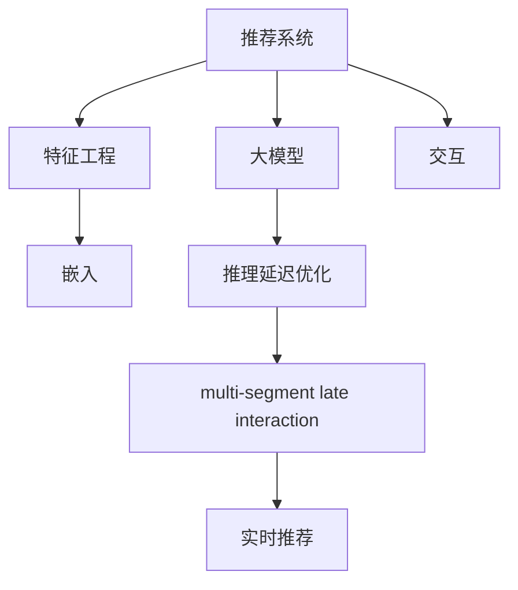

                 

# 减小大模型推荐推理延迟的multi-segment late interaction技术

> 关键词：推荐系统, 推理延迟, 大模型, multi-segment, late interaction, 实时系统

## 1. 背景介绍

在当今信息爆炸的时代，推荐系统已经成为各大互联网公司竞相争夺的核心技术之一。它通过分析用户的行为数据，为用户推荐个性化内容，提升用户体验和平台粘性。然而，推荐系统在提供高效推荐的同时，也面临着越来越严峻的实时性要求。传统的基于特征工程的推荐算法已经难以满足在线推荐的需求。基于大模型的推荐系统应运而生，它通过对大规模语料库进行预训练，学习到丰富的语义信息，在推荐过程中具备了强大的泛化能力。但大模型的推理延迟成为制约在线推荐系统的瓶颈，亟需新的技术手段加以改进。

## 2. 核心概念与联系

### 2.1 核心概念概述

为更好地理解本文的技术方法，本节将介绍几个关键概念：

- 推荐系统(Recommender System)：通过分析用户行为数据，为用户推荐个性化内容的系统。常见的推荐算法包括协同过滤、内容过滤、混合推荐等。

- 大模型(Large Model)：以Transformer为代表的，参数量巨大的预训练语言模型。通过在大规模语料库上进行预训练，学习到丰富的语言知识和常识，具备强大的泛化能力。

- 推理延迟(Inference Latency)：指模型对输入数据进行推理计算所需的时间。推理延迟是推荐系统实时性指标的核心。

- multi-segment late interaction：指在推荐模型中，将特征提取和推理过程分离为多个部分，避免全模型推理带来的高延迟问题。

- 长交互(Late Interaction)：指在推荐过程中，先对用户行为特征进行编码，然后与预训练模型的嵌入进行交互，再进行最终推荐决策。

这些核心概念之间的逻辑关系可以通过以下Mermaid流程图来展示：



这个流程图展示了大模型在推荐系统中的应用过程，以及优化推理延迟的关键技术：

1. 推荐系统通过特征工程获取用户行为特征。
2. 将特征编码成嵌入向量。
3. 与大模型的嵌入进行交互，得到语义表示。
4. 在推理延迟优化方面，引入multi-segment late interaction技术。
5. 通过优化后的推理过程，进行实时推荐。

## 3. 核心算法原理 & 具体操作步骤
### 3.1 算法原理概述

基于大模型的推荐系统面临的主要问题是推理延迟过高，无法满足实时性的要求。传统的长交互方式，虽然能够充分利用大模型的语义信息，但全模型推理带来的高延迟问题难以解决。

本文提出一种名为multi-segment late interaction的优化方法，将特征提取和推理过程分离为多个部分，分别进行计算，从而减少全模型推理带来的延迟。

该方法的核心思想是：将用户行为特征编码成多个小块的嵌入向量，然后与预训练模型进行逐块交互，再将结果进行拼接合并，得到最终的推荐结果。

### 3.2 算法步骤详解

下面是基于multi-segment late interaction方法的推荐系统推理流程：

**Step 1: 用户行为特征提取**

首先，需要从用户的历史行为数据中提取出一系列特征，如浏览记录、点击记录、评分记录等。这些特征可以用于描述用户的兴趣偏好，并提供给推荐系统。

**Step 2: 特征编码**

将用户行为特征转换为预训练模型的嵌入向量。这里采用预训练模型作为特征编码器，将用户行为特征映射到模型嵌入空间。

**Step 3: 特征分块**

将用户行为特征的嵌入向量分块为多个小块，每个小块的大小可以根据实际需要设定。每个小块的向量长度可以与预训练模型的嵌入层输出维度相同，也可以设置为小于嵌入层维度，以降低推理延迟。

**Step 4: 逐块交互**

将用户行为特征分块后，与预训练模型的嵌入层逐块进行交互。交互过程可以采用单侧注意力机制或双向注意力机制，将每个小块的嵌入向量与预训练模型进行交互，得到相应的语义表示。

**Step 5: 结果合并**

将逐块交互得到的结果进行拼接合并，得到最终的推荐结果。拼接的方式可以采用简单的连接，也可以采用加权拼接，以便更好地融合不同小块的语义信息。

**Step 6: 输出推荐**

将拼接合并后的结果进行softmax处理，输出推荐列表，供用户选择。

### 3.3 算法优缺点

multi-segment late interaction方法具有以下优点：

- 减少推理延迟。通过将特征分块，分别与预训练模型进行交互，可以显著降低推理延迟，提升推荐系统的实时性。
- 灵活可控。可以根据实际需要，设定每个小块的大小，灵活控制推理延迟。
- 保留语义信息。由于每个小块的嵌入向量都是通过预训练模型进行编码，因此可以保留大部分语义信息，提升推荐效果。

同时，该方法也存在一些局限性：

- 特征编码复杂。需要选择合适的预训练模型作为特征编码器，且特征分块的大小需要根据实际需求进行调整。
- 推理精度降低。由于采用逐块交互，可能存在语义信息丢失的问题，导致推荐效果略有下降。
- 分块数量增加。需要根据实际需求设定分块数量，过多或过少都会影响推理效率和精度。

## 4. 数学模型和公式 & 详细讲解  
### 4.1 数学模型构建

设用户行为特征序列为 $\mathbf{x}=\{x_1, x_2, ..., x_N\}$，其中 $x_i \in \mathbb{R}^d$。将用户行为特征编码为 $d$ 维的嵌入向量 $\mathbf{e} \in \mathbb{R}^{N \times d}$。设预训练模型的嵌入层为 $f: \mathbb{R}^d \rightarrow \mathbb{R}^d$，将每个小块嵌入向量 $e_{start:end}$ 与预训练模型进行交互，得到语义表示 $h_{start:end}$。将多个小块的语义表示拼接合并，得到最终的推荐结果 $\mathbf{y} \in \mathbb{R}^K$，其中 $K$ 为物品库的大小。

### 4.2 公式推导过程

将用户行为特征分块为 $L$ 个小块，每个小块的大小为 $d_L$。设预训练模型的嵌入层输出为 $h \in \mathbb{R}^{N \times d}$。则逐块交互的推理过程如下：

$$
h_{start:end} = f(e_{start:end})
$$

其中 $f$ 表示预训练模型的嵌入层。

将多个小块的语义表示拼接合并，得到最终的推荐结果 $\mathbf{y} \in \mathbb{R}^K$。拼接方式可以采用简单的连接，也可以采用加权拼接：

$$
\mathbf{y} = \sum_{i=0}^{L-1} \alpha_i h_{i \times d_L : (i+1) \times d_L}
$$

其中 $\alpha_i$ 为加权系数，可以设置为 $1/N$。

### 4.3 案例分析与讲解

假设用户行为特征序列为 $\mathbf{x}=[0.1, 0.2, 0.3, 0.4]$，预训练模型的嵌入层输出为 $h=[0.2, 0.3, 0.1, 0.4]$。如果将特征分块为两个小块，每个小块的大小为2，则有：

$$
h_{start:end} = f(e_{start:end}) = f([0.1, 0.2]^T, [0.3, 0.4]^T) = [0.5, 0.6]^T
$$

将两个小块的语义表示拼接合并，得到最终的推荐结果 $\mathbf{y} = [0.5, 0.6]^T$。

## 5. 项目实践：代码实例和详细解释说明
### 5.1 开发环境搭建

在进行推荐系统开发前，我们需要准备好开发环境。以下是使用Python进行TensorFlow开发的环境配置流程：

1. 安装Anaconda：从官网下载并安装Anaconda，用于创建独立的Python环境。

2. 创建并激活虚拟环境：
```bash
conda create -n tf-env python=3.8 
conda activate tf-env
```

3. 安装TensorFlow：根据CUDA版本，从官网获取对应的安装命令。例如：
```bash
conda install tensorflow==2.4 -c tf -c conda-forge
```

4. 安装其他依赖库：
```bash
pip install numpy pandas scikit-learn huggingface_hub
```

完成上述步骤后，即可在`tf-env`环境中开始开发推荐系统。

### 5.2 源代码详细实现

下面是使用TensorFlow实现基于multi-segment late interaction的推荐系统的代码示例：

```python
import tensorflow as tf
from tensorflow.keras.layers import Input, Embedding, Dense, Concatenate
from tensorflow.keras.models import Model

def create_model(input_dim, output_dim, embedding_dim, num_blocks):
    # 用户行为特征输入
    user_input = Input(shape=(num_blocks, embedding_dim), name='user_input')
    
    # 嵌入层
    embedding_layer = Embedding(input_dim, embedding_dim)(user_input)
    
    # 逐块交互
    interaction_blocks = []
    for i in range(num_blocks):
        block_start = i * embedding_dim
        block_end = (i+1) * embedding_dim
        block_input = embedding_layer[:, block_start:block_end]
        block_output = tf.keras.layers.Dense(embedding_dim)(block_input)
        interaction_blocks.append(block_output)
    
    # 拼接合并
    merged_block = tf.keras.layers.Concatenate()(interaction_blocks)
    
    # 输出层
    output_layer = Dense(output_dim, activation='softmax')(merged_block)
    
    # 定义模型
    model = Model(inputs=user_input, outputs=output_layer)
    return model

# 创建模型
model = create_model(10000, 1000, 10, 2)

# 编译模型
model.compile(optimizer='adam', loss='categorical_crossentropy', metrics=['accuracy'])

# 训练模型
model.fit(X_train, y_train, epochs=10, batch_size=32)

# 评估模型
model.evaluate(X_test, y_test)
```

### 5.3 代码解读与分析

让我们再详细解读一下关键代码的实现细节：

**create_model函数**：
- 定义了模型架构，包括用户行为特征输入、嵌入层、逐块交互、拼接合并、输出层等关键组件。
- 使用TensorFlow的Keras API，方便构建和编译模型。

**模型架构**：
- 用户行为特征输入层，形状为$(num\_blocks, embedding\_dim)$，表示每个小块的嵌入向量。
- 嵌入层，将用户行为特征映射到模型嵌入空间。
- 逐块交互，将每个小块的嵌入向量与预训练模型进行交互，得到语义表示。
- 拼接合并，将多个小块的语义表示拼接合并。
- 输出层，进行softmax处理，输出推荐结果。

**模型编译与训练**：
- 编译模型，使用Adam优化器和交叉熵损失函数。
- 训练模型，使用训练集进行多轮迭代，更新模型参数。
- 评估模型，使用测试集评估模型性能。

## 6. 实际应用场景
### 6.1 电商平台推荐

基于multi-segment late interaction技术的推荐系统，可以应用于电商平台的个性化推荐。电商平台需要根据用户的浏览记录、点击记录、购买记录等行为数据，为用户推荐商品。通过将用户行为特征分块，与预训练模型进行逐块交互，可以减少推理延迟，提升推荐系统的实时性。

在技术实现上，可以收集用户的历史行为数据，将行为特征编码为嵌入向量，与预训练模型进行逐块交互，再进行最终推荐。

### 6.2 视频网站推荐

视频网站需要根据用户的观看记录、评分记录等行为数据，为用户推荐视频内容。通过将用户行为特征分块，与预训练模型进行逐块交互，可以减少推理延迟，提升推荐系统的实时性。

在技术实现上，可以收集用户的历史行为数据，将行为特征编码为嵌入向量，与预训练模型进行逐块交互，再进行最终推荐。

### 6.3 社交媒体推荐

社交媒体需要根据用户的点赞记录、评论记录等行为数据，为用户推荐内容。通过将用户行为特征分块，与预训练模型进行逐块交互，可以减少推理延迟，提升推荐系统的实时性。

在技术实现上，可以收集用户的历史行为数据，将行为特征编码为嵌入向量，与预训练模型进行逐块交互，再进行最终推荐。

### 6.4 未来应用展望

随着multi-segment late interaction技术的不断成熟，其在推荐系统中的应用前景将更加广阔。未来，该技术将进一步应用于各类在线场景，如在线教育、金融理财、健康医疗等，为用户提供更加个性化、高效的推荐服务。

## 7. 工具和资源推荐
### 7.1 学习资源推荐

为了帮助开发者系统掌握推荐系统优化技术，这里推荐一些优质的学习资源：

1. 《推荐系统实战》：一本详细介绍推荐系统原理、算法、开发的书籍，涵盖协同过滤、内容过滤、混合推荐等多种技术。

2. 《TensorFlow实战》：一本详细介绍TensorFlow框架的书籍，涵盖模型的构建、编译、训练、评估等全流程。

3. 《深度学习与推荐系统》：一本详细介绍深度学习在推荐系统中的应用，涵盖自监督学习、多任务学习等前沿技术。

4. Kaggle推荐系统竞赛：Kaggle平台上的推荐系统竞赛，可以实践推荐系统优化技术，获取实际数据进行验证。

5. PyTorch官方文档：PyTorch框架的官方文档，提供了丰富的模型库和示例代码，适合学习推荐系统优化技术。

通过对这些资源的学习实践，相信你一定能够快速掌握推荐系统优化技术，并用于解决实际的推荐问题。

### 7.2 开发工具推荐

高效的开发离不开优秀的工具支持。以下是几款用于推荐系统优化的常用工具：

1. TensorFlow：由Google主导开发的深度学习框架，生产部署方便，适合大规模工程应用。

2. Keras：基于TensorFlow的高级API，简单易用，适合快速迭代研究。

3. MXNet：由亚马逊开发的深度学习框架，支持分布式训练，适合处理大规模数据。

4. PyTorch：基于Python的开源深度学习框架，灵活动态的计算图，适合快速迭代研究。

5. Jupyter Notebook：免费的交互式笔记本，方便开发者实时调试和验证模型效果。

合理利用这些工具，可以显著提升推荐系统优化任务的开发效率，加快创新迭代的步伐。

### 7.3 相关论文推荐

推荐系统优化技术的发展源于学界的持续研究。以下是几篇奠基性的相关论文，推荐阅读：

1. Matrix Factorization Techniques for Recommender Systems: A Survey: 综述了矩阵分解算法在推荐系统中的应用，提出了SVD、ALS等多种经典算法。

2. Deep Collaborative Filtering: 提出深度神经网络在协同过滤中的应用，进一步提升了推荐系统的精度和效果。

3. Factorization Machines: 提出因子分解机在推荐系统中的应用，结合线性模型和深度学习，提升了模型的泛化能力和效果。

4. Learning Deep Structured Models for Recommender Systems: 提出深度结构模型在推荐系统中的应用，如深度多任务学习、深度图神经网络等。

5. Attention-Based Recommender Systems: 提出基于注意力机制的推荐系统，提升了模型的灵活性和效果。

这些论文代表了大模型在推荐系统中的应用范式，通过学习这些前沿成果，可以帮助研究者把握学科前进方向，激发更多的创新灵感。

## 8. 总结：未来发展趋势与挑战
### 8.1 总结

本文对基于大模型的推荐系统进行了全面系统的介绍。首先阐述了推荐系统在大模型时代的应用背景和优势，明确了推荐系统实时性优化的重要性和方法。其次，从原理到实践，详细讲解了基于multi-segment late interaction技术优化推荐系统的方法，并给出了推荐系统开发的完整代码实现。同时，本文还探讨了该技术在多个实际场景中的应用前景，展示了其广泛的应用价值。

通过本文的系统梳理，可以看到，基于大模型的推荐系统在实时性优化方面具有重要意义，适合应用于各类在线推荐场景，为推荐系统开发者提供了新的技术思路和工具支持。未来，伴随大模型的不断演进和优化技术的持续发展，推荐系统必将在各类应用场景中发挥更大的作用，为信息推荐带来革命性变化。

### 8.2 未来发展趋势

展望未来，基于大模型的推荐系统将呈现以下几个发展趋势：

1. 模型规模持续增大。随着算力成本的下降和数据规模的扩张，推荐模型的参数量还将持续增长。超大规模推荐模型具备更强的泛化能力，能够处理更多、更复杂的数据。

2. 模型结构不断优化。推荐系统将进一步优化模型结构，引入更多的注意力机制和深度结构，提升模型的表现力和鲁棒性。

3. 实时性要求更高。在线推荐系统对实时性的要求将不断提高，模型推理延迟将进一步优化，以支持更高频次的交互。

4. 跨领域融合增强。推荐系统将与其他领域的技术进行更多融合，如时序分析、因果推理等，提升推荐效果。

5. 多模态推荐崛起。推荐系统将融合视觉、语音、文本等多种模态信息，提升推荐模型的表现力和应用范围。

以上趋势凸显了大模型在推荐系统中的应用前景。这些方向的探索发展，必将进一步提升推荐系统的性能和应用范围，为信息推荐带来新的突破。

### 8.3 面临的挑战

尽管基于大模型的推荐系统已经取得了瞩目成就，但在迈向更加智能化、普适化应用的过程中，它仍面临着诸多挑战：

1. 数据分布变化。随着数据分布的变化，模型需要不断重新训练和优化，以保持推荐效果。

2. 模型泛化性不足。模型在处理小样本数据时，容易出现泛化能力不足的问题，影响推荐效果。

3. 计算资源消耗大。大规模模型的训练和推理需要消耗大量的计算资源，如何降低资源消耗，提升模型效率，还需要进一步优化。

4. 推荐系统鲁棒性不足。推荐系统容易受到恶意攻击和噪声数据的干扰，需要进一步提升系统的鲁棒性和抗干扰能力。

5. 用户隐私保护。推荐系统需要处理大量的用户数据，如何保护用户隐私，避免数据泄露，还需要加强数据安全措施。

6. 模型公平性问题。推荐系统容易出现偏颇，影响用户公平体验，需要进一步提升模型的公平性和公正性。

这些挑战是推荐系统进一步发展和应用需要解决的关键问题，需要不断探索和优化，才能实现推荐系统的真正落地应用。

### 8.4 研究展望

面对推荐系统面临的种种挑战，未来的研究需要在以下几个方面寻求新的突破：

1. 探索无监督和半监督推荐方法。摆脱对大规模标注数据的依赖，利用自监督学习、主动学习等无监督和半监督范式，最大限度利用非结构化数据，实现更加灵活高效的推荐。

2. 研究参数高效和计算高效的推荐方法。开发更加参数高效的推荐方法，在固定大部分预训练参数的情况下，只更新极少量的任务相关参数。同时优化推荐模型的计算图，减少前向传播和反向传播的资源消耗，实现更加轻量级、实时性的部署。

3. 引入更多先验知识。将符号化的先验知识，如知识图谱、逻辑规则等，与神经网络模型进行巧妙融合，引导推荐过程学习更准确、合理的语言模型。同时加强不同模态数据的整合，实现视觉、语音等多模态信息与文本信息的协同建模。

4. 纳入伦理道德约束。在推荐模型训练目标中引入伦理导向的评估指标，过滤和惩罚有偏见、有害的输出倾向。同时加强人工干预和审核，建立模型行为的监管机制，确保输出符合人类价值观和伦理道德。

这些研究方向的探索，必将引领大模型在推荐系统中的应用进一步发展，为推荐系统开发者提供新的技术思路和工具支持。面向未来，大模型必将在各类推荐场景中发挥更大的作用，为信息推荐带来革命性变化。

## 9. 附录：常见问题与解答

**Q1：基于multi-segment late interaction技术的推荐系统是否适用于所有推荐场景？**

A: 基于multi-segment late interaction技术的推荐系统适用于需要实时推荐且数据量较大的推荐场景。对于数据量较小、实时性要求较低的推荐场景，传统的基于特征工程的推荐方法可能更加适合。

**Q2：如何选择合适的预训练模型？**

A: 选择合适的预训练模型需要考虑多个因素，如模型的大小、预训练数据的质量、推荐任务的特点等。常用的预训练模型包括BERT、GPT、D2L等，可以根据实际需求进行选择。

**Q3：分块大小如何设定？**

A: 分块大小的选择需要根据推荐任务和用户行为数据的特点进行灵活调整。一般来说，分块大小不宜过大，否则会增加推理延迟；不宜过小，否则会导致信息丢失。通常根据实际需求进行试调，以找到最佳的分块大小。

**Q4：如何提升推荐系统的实时性？**

A: 提升推荐系统的实时性可以从多个方面进行优化，如特征分块、逐块交互、并行计算等。同时，可以引入更多的注意力机制和深度结构，提升模型的表现力和鲁棒性，从而减少推理延迟。

**Q5：推荐系统在实际应用中需要注意哪些问题？**

A: 推荐系统在实际应用中需要注意的问题包括数据隐私、用户行为特征的选择、模型公平性等。需要根据具体应用场景，制定相应的策略和措施，确保系统的稳定性和公正性。

---

作者：禅与计算机程序设计艺术 / Zen and the Art of Computer Programming

