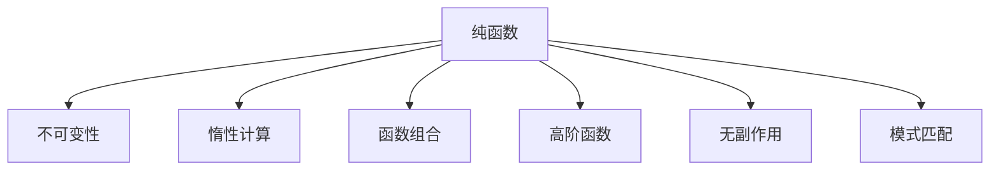

                 

# 函数式编程：在现代开发中的应用

> 关键词：函数式编程,纯函数,不可变性,惰性计算,函数组合,高阶函数,无副作用,并发编程,模式匹配,响应式编程,编程范式

## 1. 背景介绍

### 1.1 问题由来

随着计算机科学的不断进步和软件开发实践的深入，开发人员逐渐认识到传统的面向过程和面向对象编程范式在处理某些问题时存在局限性。函数式编程作为一种独特的编程范式，因其数学化、纯函数和无副作用等特性，越来越受到关注。

函数式编程最初源于数学函数理论，其核心思想是使用纯粹的函数来构建程序，避免修改状态和副作用。这一思想不仅提高了代码的可读性、可维护性和可测试性，还使得并发编程、分布式系统等复杂任务变得更加简单和高效。

函数式编程的流行也与现代软件开发的需要密切相关。在云计算、大数据、移动应用、物联网等领域，函数式编程提供了全新的思路和方法。例如，在云函数、分布式数据处理框架如Apache Flink和Spark中，函数式编程的优势尤为显著。

本文旨在介绍函数式编程的核心理念、核心概念及其在现代软件开发中的应用，通过详细的理论分析和技术实践，帮助读者理解和掌握这一强大的编程范式。

### 1.2 问题核心关键点

函数式编程的核心理念包括：

- 纯函数（Pure Functions）：即不依赖外部状态的函数，其输出仅由输入决定。
- 不可变性（Immutability）：尽量避免修改数据结构，以提高代码的可预测性和可控性。
- 惰性计算（Lazy Evaluation）：只有在需要时才计算结果，避免不必要的计算开销。
- 函数组合（Function Composition）：通过组合简单函数实现复杂功能。
- 高阶函数（High-Order Functions）：函数作为参数或返回值传递，提升代码的灵活性和复用性。
- 无副作用（Side Effects）：尽量避免修改外部状态，以确保代码的并发性和一致性。
- 模式匹配（Pattern Matching）：通过模式匹配机制，提升代码的可读性和表达力。

函数式编程是一种思想和原则，适用于多种编程语言。除了传统的Haskell、Scala、Clojure等函数式语言，JavaScript、Python等主流语言也支持函数式编程的思想。

## 2. 核心概念与联系

### 2.1 核心概念概述

为了更好地理解函数式编程，本节将介绍几个核心概念：

- **纯函数（Pure Functions）**：指没有副作用的函数，其输出仅依赖于输入，不受外部状态影响。
- **不可变性（Immutability）**：指数据结构一旦创建，就不能修改。
- **惰性计算（Lazy Evaluation）**：指只有在需要时才计算表达式值，避免不必要的计算。
- **函数组合（Function Composition）**：指通过组合简单函数实现复杂功能。
- **高阶函数（High-Order Functions）**：指函数作为参数或返回值传递，提升代码复用性。
- **无副作用（Side Effects）**：指尽量避免修改外部状态，确保代码并发性和一致性。
- **模式匹配（Pattern Matching）**：指通过匹配结构来提取数据，提升代码可读性。

这些概念之间的逻辑关系可以通过以下Mermaid流程图来展示：



这个流程图展示了几大核心概念之间的联系：

1. 纯函数是函数式编程的基础，确保了代码的可预测性和可控性。
2. 不可变性是纯函数的扩展，进一步提升了数据结构的稳定性和可管理性。
3. 惰性计算优化了计算过程，提高了代码的效率和性能。
4. 函数组合和模式匹配是代码表达的高级形式，提升了代码的可读性和可维护性。
5. 高阶函数和无副作用是提升代码灵活性和可复用性的关键。

## 3. 核心算法原理 & 具体操作步骤
### 3.1 算法原理概述

函数式编程的核心算法原理主要包括以下几个方面：

- **纯函数与不可变性**：确保函数和数据结构的不可变性，避免副作用，提高代码的预测性和可控性。
- **惰性计算与函数组合**：通过惰性计算和函数组合，优化计算过程，提高代码的效率和灵活性。
- **高阶函数与模式匹配**：使用高阶函数和模式匹配，提升代码的复用性和可读性。

这些原理构成了函数式编程的思想基础，使得函数式编程能够在复杂的软件开发任务中发挥重要作用。

### 3.2 算法步骤详解

函数式编程的实现主要包含以下几个步骤：

1. **选择适合函数式编程的语言和框架**：例如Scala、Clojure、Haskell、JavaScript等语言都支持函数式编程，选择适合自己的语言和框架。
2. **设计纯函数和不可变数据结构**：尽量避免修改状态，使用不可变数据结构，确保函数的纯性。
3. **应用惰性计算和函数组合**：利用惰性计算和函数组合，优化计算过程，提升代码效率。
4. **实现高阶函数和模式匹配**：通过高阶函数和模式匹配，提升代码复用性和可读性。
5. **处理副作用和并发问题**：避免副作用，处理并发和分布式系统中的复杂问题。

下面以JavaScript为例，给出函数式编程的详细步骤。

### 3.3 算法优缺点

函数式编程的优点包括：

- **高可读性和可维护性**：纯函数和不可变数据结构使得代码更易于理解和维护。
- **高复用性**：高阶函数和函数组合使得代码更加模块化和可复用。
- **高并发性**：无副作用和不可变性确保了并发程序的安全性。

其缺点包括：

- **性能问题**：函数式编程的惰性计算和不可变性可能导致性能问题。
- **学习曲线较陡**：函数式编程的思维模式与传统编程不同，初学者可能需要一定时间适应。

## 4. 数学模型和公式 & 详细讲解 & 举例说明

### 4.1 数学模型构建

函数式编程的数学模型主要基于函数理论，包括纯函数、不可变性和惰性计算等概念。这里介绍几个核心概念的数学模型：

- **纯函数**：$ f: X \rightarrow Y $，满足 $ f(x) = f(y) $ 当且仅当 $ x = y $。
- **不可变性**：$ x $ 一旦创建，任何对其的操作都会返回一个新的对象。
- **惰性计算**：$ \lambda x . \text{if } x \neq \emptyset \text{ then } x.\text{head} : \mathcal{T} \rightarrow \mathcal{T}$，仅在需要时计算列表元素。

### 4.2 公式推导过程

以下是纯函数和不可变性的公式推导过程：

设 $f(x) = f(y)$，根据纯函数的定义，有 $x = y$。

设 $x = f(x)$，根据纯函数的定义，有 $x = y$。

设 $x = x'$，根据不可变性的定义，有 $x = x'$。

### 4.3 案例分析与讲解

以下通过一个具体的案例，展示函数式编程的实际应用。

假设有一个列表 $a = [1, 2, 3]$，我们需要将其所有元素加倍，生成新列表 $b$。

在面向过程的编程中，我们可能会使用循环和条件语句来实现：

```python
def double_list(lst):
    result = []
    for item in lst:
        result.append(item * 2)
    return result
```

而在函数式编程中，我们可以使用高阶函数 `map` 和列表解析来实现：

```python
def double_list(lst):
    return list(map(lambda x: x * 2, lst))
```

或者使用列表解析：

```python
def double_list(lst):
    return [x * 2 for x in lst]
```

这两种方法都利用了高阶函数 `map` 和列表解析，提升了代码的复用性和可读性。

## 5. 项目实践：代码实例和详细解释说明

### 5.1 开发环境搭建

在开始函数式编程实践前，需要准备好开发环境。以下是使用JavaScript进行函数式编程的环境配置流程：

1. 安装Node.js和npm。
2. 安装ESLint和Prettier，确保代码质量和可读性。
3. 安装React、Redux等函数式编程框架，用于实践。

### 5.2 源代码详细实现

下面以一个简单的React组件为例，展示函数式编程的实现。

```javascript
import React from 'react';

function App() {
  const [count, setCount] = React.useState(0);

  const handleClick = () => {
    setCount(count + 1);
  };

  return (
    <div>
      <h1>Count: {count}</h1>
      <button onClick={handleClick}>Click Me</button>
    </div>
  );
}

export default App;
```

这个组件使用了React的`useState`钩子来管理状态，确保状态的可变性和可控性。`handleClick`函数使用`setCount`来更新状态，确保函数式编程的不可变性。

### 5.3 代码解读与分析

React的`useState`钩子是函数式编程的核心工具之一，它通过函数式的更新机制，实现了状态的不可变性。在`handleClick`函数中，`setCount`是一个纯函数，用于更新状态，确保了代码的不可变性和可预测性。

### 5.4 运行结果展示

运行上述代码，可以得到一个简单的计数器组件，每次点击按钮，计数器会加1。这展示了函数式编程的高可读性和高复用性。

## 6. 实际应用场景

### 6.1 并发编程

函数式编程的无副作用特性使其在并发编程中具有优势。在并发编程中，函数式编程能够避免竞态条件和死锁等问题，确保并发程序的正确性和安全性。

### 6.2 响应式编程

函数式编程的模式匹配特性使其在响应式编程中应用广泛。在响应式编程中，函数式编程能够自动处理状态更新和组件重渲染，提升代码的可读性和可维护性。

### 6.3 数据处理

函数式编程的惰性计算和函数组合特性使其在数据处理中表现出色。在数据处理中，函数式编程能够优化计算过程，提高代码效率和性能。

### 6.4 未来应用展望

随着函数式编程的不断发展，其在各个领域的应用将会更加广泛和深入。未来的函数式编程将融合更多先进技术和思想，如分布式计算、机器学习等，带来更多创新和突破。

## 7. 工具和资源推荐

### 7.1 学习资源推荐

为了帮助开发者系统掌握函数式编程的理论基础和实践技巧，这里推荐一些优质的学习资源：

1. 《函数式编程实战》系列博文：由大函数式编程技术专家撰写，深入浅出地介绍了函数式编程原理、JavaScript和React中的函数式编程实践。

2. CS220《函数式编程》课程：麻省理工学院开设的函数式编程课程，有Lecture视频和配套作业，带你系统学习函数式编程的基本概念和经典范式。

3. 《函数式编程的艺术》书籍：讲解函数式编程的思想和实践，涵盖Haskell、JavaScript、Scala等多种语言和框架。

4. Lambda Calculus with Types：介绍函数式编程的基础——lambda演算和类型理论，适合深入理解函数式编程的原理。

5. Functional Programming for the Object-Oriented Programmer：讲解函数式编程与面向对象编程的异同，适合已经熟悉面向对象编程的开发者学习。

通过这些资源的学习实践，相信你一定能够快速掌握函数式编程的精髓，并用于解决实际的开发问题。

### 7.2 开发工具推荐

高效的开发离不开优秀的工具支持。以下是几款用于函数式编程开发的常用工具：

1. JavaScript的ESLint和Prettier：帮助确保代码质量和可读性。
2. React、Redux、React Router等函数式编程框架：用于构建响应式前端应用。
3. Scala的ScalaIDE：提供了强大的IDE支持，方便开发者进行函数式编程。
4. Haskell的GHC：Haskell的编译器，支持高效的函数式编程。
5. Clojure的Emacs：Clojure的开发环境，支持高效的函数式编程。

合理利用这些工具，可以显著提升函数式编程的开发效率，加快创新迭代的步伐。

### 7.3 相关论文推荐

函数式编程的研究源于学界的持续研究。以下是几篇奠基性的相关论文，推荐阅读：

1. 《Purely Functional Programs》：提出纯函数的定义和性质，奠定了函数式编程的理论基础。

2. 《Functional Programming》：介绍函数式编程的基本概念和实践，适合初学者学习。

3. 《Practical Functional Programming》：讲解函数式编程在实际开发中的应用，适合开发人员学习。

4. 《Concurrent Algorithms and Patterns》：介绍函数式编程在并发编程中的应用，适合高阶开发者学习。

5. 《Functional Programming with Effects》：介绍函数式编程在存在副作用的情况下的处理方式，适合深入理解函数式编程的实际应用。

这些论文代表了大函数式编程的研究进展，通过学习这些前沿成果，可以帮助研究者把握学科前进方向，激发更多的创新灵感。

## 8. 总结：未来发展趋势与挑战

### 8.1 总结

本文对函数式编程的核心理念、核心概念及其在现代软件开发中的应用进行了全面系统的介绍。首先阐述了函数式编程的起源和发展背景，明确了函数式编程在提高代码可读性、可维护性和可测试性方面的独特价值。其次，从原理到实践，详细讲解了函数式编程的数学原理和关键步骤，给出了函数式编程任务开发的完整代码实例。同时，本文还广泛探讨了函数式编程在并发编程、响应式编程、数据处理等多个领域的应用前景，展示了函数式编程的强大潜力。

通过本文的系统梳理，可以看到，函数式编程作为一种全新的编程范式，在处理并发、响应式等复杂任务时，具有不可替代的优势。函数式编程的纯函数、不可变性、惰性计算等核心思想，提升了代码的可读性、可维护性和并发性，对现代软件开发产生了深远影响。未来，伴随函数式编程的不断发展，相信其在各个领域的落地应用将更加广泛和深入。

### 8.2 未来发展趋势

展望未来，函数式编程将呈现以下几个发展趋势：

1. 与其他编程范式的融合：函数式编程将与其他编程范式如面向对象、过程导向等进行深入融合，形成混合编程范式，提升编程灵活性。
2. 更多编程语言的采纳：随着函数式编程思想和技术的普及，更多编程语言将引入函数式编程特性，提升语言本身的表达能力和开发效率。
3. 大数据和机器学习中的广泛应用：函数式编程的无副作用和不可变性特性，使其在大数据处理和机器学习任务中表现出色，成为处理复杂计算任务的重要工具。
4. 新的编程模型和框架的涌现：新的编程模型和框架如Streams、Evaluation Strategies等，将为函数式编程带来新的理论基础和实践手段。
5. 编程工具和环境的升级：功能更强大的IDE、代码编辑器和构建工具，将极大提升函数式编程的开发效率和用户体验。

以上趋势凸显了函数式编程的广阔前景。这些方向的探索发展，必将进一步提升函数式编程的威力，为构建高可靠、高性能的软件系统铺平道路。

### 8.3 面临的挑战

尽管函数式编程已经取得了瞩目成就，但在迈向更加智能化、普适化应用的过程中，它仍面临诸多挑战：

1. 性能问题：函数式编程的惰性计算和不可变性可能导致性能问题。如何在保证函数式编程特性的同时，提升代码的性能，是未来的研究重点。
2. 学习曲线：函数式编程的思维模式与传统编程不同，初学者可能需要一定时间适应。如何降低学习曲线，提升函数式编程的普及度，是推广函数式编程的关键。
3. 工具支持：尽管有部分编程语言和工具支持函数式编程，但整体生态系统相对薄弱。如何进一步完善工具支持，提升函数式编程的开发体验，是未来的重要课题。
4. 并发和分布式问题：函数式编程的无副作用特性使得并发和分布式编程变得更加复杂，需要进一步研究和优化。

### 8.4 研究展望

面对函数式编程所面临的挑战，未来的研究需要在以下几个方面寻求新的突破：

1. 函数式编程与面向对象编程的融合：通过引入面向对象编程的思想，提升函数式编程的灵活性和可扩展性。
2. 功能式编程与过程导向编程的融合：通过引入过程导向编程的思想，提升函数式编程的效率和性能。
3. 函数式编程与机器学习的结合：通过引入机器学习的思想，提升函数式编程在复杂计算任务中的应用。
4. 函数式编程与并发编程的结合：通过引入并发编程的思想，提升函数式编程在并发和分布式系统中的应用。
5. 函数式编程与分布式计算的结合：通过引入分布式计算的思想，提升函数式编程在大数据处理中的应用。

这些研究方向的探索，必将引领函数式编程技术迈向更高的台阶，为构建高可靠、高性能的软件系统提供更多选择和路径。总之，函数式编程需要开发者不断探索和优化，方能在未来的软件开发中发挥更大的作用。

## 9. 附录：常见问题与解答

**Q1：函数式编程的优点有哪些？**

A: 函数式编程的优点包括：

- **高可读性和可维护性**：纯函数和不可变数据结构使得代码更易于理解和维护。
- **高复用性**：高阶函数和函数组合使得代码更加模块化和可复用。
- **高并发性**：无副作用和不可变性确保了并发程序的安全性。

**Q2：函数式编程的缺点有哪些？**

A: 函数式编程的缺点包括：

- **性能问题**：函数式编程的惰性计算和不可变性可能导致性能问题。
- **学习曲线较陡**：函数式编程的思维模式与传统编程不同，初学者可能需要一定时间适应。

**Q3：函数式编程适用于哪些领域？**

A: 函数式编程适用于并发编程、响应式编程、数据处理等多个领域。

**Q4：如何学习函数式编程？**

A: 学习函数式编程可以从小白入门书籍、在线课程和实践项目入手，逐步理解函数式编程的基本概念和实践技巧。

**Q5：函数式编程的未来发展趋势是什么？**

A: 函数式编程的未来发展趋势包括与其他编程范式的融合、更多编程语言的采纳、大数据和机器学习中的广泛应用等。

通过以上问题的解答，相信读者能够更好地理解函数式编程的核心思想和实际应用，为未来的软件开发实践提供有力支持。

---

作者：禅与计算机程序设计艺术 / Zen and the Art of Computer Programming

