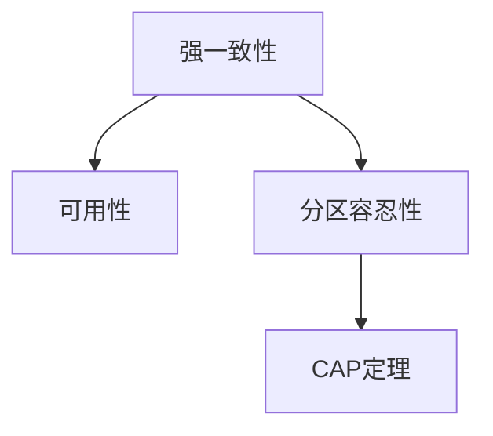

                 

# 分布式系统：一致性和容错性

分布式系统在现代互联网应用中占据核心地位，广泛应用于云服务、大数据、物联网、金融交易等领域。然而，分布式系统的复杂性也带来了新的挑战，如数据一致性、故障容错性等问题。本博客文章将深入探讨这些核心概念，并详细介绍其算法原理和操作步骤，帮助读者更好地理解并掌握分布式系统的关键技术。

## 1. 背景介绍

### 1.1 问题由来

随着互联网应用的快速增长，单台机器已无法满足业务需求，分布式系统成为必然选择。分布式系统将业务拆分成多个独立的进程，分布在多台计算机上协同工作，以实现更高的性能、扩展性和可靠性。然而，分布式系统也带来了新的问题，如数据一致性、节点故障处理、通信延迟等。这些问题直接影响系统的可靠性和用户体验。

### 1.2 问题核心关键点

数据一致性和容错性是分布式系统中的两个核心问题。

**数据一致性**指在分布式系统中，多个节点保存的数据应该保持一致。例如，在一个电商系统中，用户下单信息应该被所有相关节点实时同步。

**容错性**指在分布式系统中，部分节点故障不会导致系统整体瘫痪，系统应具备自动恢复能力，保证服务的连续性。

本文将详细讨论数据一致性和容错性的原理与实现方法，并给出经典算法的详细步骤和代码实现。

## 2. 核心概念与联系

### 2.1 核心概念概述

为更好地理解分布式系统中的数据一致性和容错性问题，本节将介绍几个密切相关的核心概念：

- **一致性(Consistency)**：指在分布式系统中，多个节点保存的数据应该保持一致。具体包括强一致性和事件一致性。
- **可用性(Availability)**：指系统在故障发生时，仍然能够提供服务。
- **分区容忍性(Partition Tolerance)**：指分布式系统应具备在网络分区的情况下，依然能够正常工作。
- **CAP定理**：在分区容忍性、一致性和可用性之间，只能同时满足其中两个条件。

这些核心概念之间通过以下Mermaid流程图展示：



### 2.2 核心概念原理和架构的 Mermaid 流程图


该图展示了核心概念之间的逻辑关系，以及常用的实现方法。

## 3. 核心算法原理 & 具体操作步骤

### 3.1 算法原理概述

分布式系统中的数据一致性和容错性问题，通常通过各种一致性算法和容错机制来解决。本节将详细介绍常用的**2PC算法**和**Raft算法**，并给出各自的详细步骤。

### 3.2 算法步骤详解

#### 3.2.1 2PC算法步骤详解

**2PC算法(2-Phase Commit, 两阶段提交)**是经典的一致性算法，用于保证分布式系统中多个节点数据的一致性。其步骤如下：

1. **准备阶段**：事务管理器向所有参与节点发送`prepare`请求，请求节点对数据进行预提交。
2. **提交阶段**：事务管理器根据各节点返回的响应，判断是否所有节点都已经准备好提交事务。
3. **提交/回滚**：如果所有节点都准备好提交事务，则事务管理器向所有节点发送`commit`请求。否则，向所有节点发送`rollback`请求。

2PC算法保证了强一致性，但会牺牲一定的可用性。由于需要等待所有节点准备好，因此系统吞吐量较低。

#### 3.2.2 Raft算法步骤详解

**Raft算法**是另一种经典的一致性算法，用于解决分布式系统中的强一致性问题。其步骤如下：

1. **领导选举**：每个节点定期向其他节点发送心跳消息，如果一个节点超过半数节点的响应，则认为自己是领导者。
2. **日志记录**：领导者节点接收所有节点发送的日志请求，并在本地记录日志。
3. **同步日志**：领导者节点将本地日志同步给所有节点，确保所有节点的日志一致。
4. **复制状态**：领导者节点将本地状态信息同步给所有节点，确保所有节点的状态一致。

Raft算法在保证强一致性的同时，具有较好的可用性。每个节点都有机会成为领导者，提高了系统的稳定性和可靠性。

### 3.3 算法优缺点

#### 3.3.1 2PC算法的优缺点

**优点**：
- 强一致性：保证事务数据的一致性。
- 实现简单：易于理解和实现。

**缺点**：
- 可用性差：需要等待所有节点准备好，系统吞吐量较低。
- 单点故障：如果事务管理器故障，可能导致事务无法提交。

#### 3.3.2 Raft算法的优缺点

**优点**：
- 强一致性：保证强一致性，避免数据不一致。
- 高可用性：每个节点都有机会成为领导者，提高了系统的可靠性。

**缺点**：
- 实现复杂：需要实现领导选举、日志同步、状态复制等复杂机制。
- 通信开销大：需要频繁的节点间通信，系统开销较大。

### 3.4 算法应用领域

数据一致性和容错性算法广泛应用于各种分布式系统，如：

- 数据库系统：MySQL、PostgreSQL等关系型数据库系统。
- 分布式文件系统：Hadoop、HDFS等文件系统。
- 分布式缓存系统：Redis、Memcached等缓存系统。
- 分布式计算框架：Spark、Hadoop等计算框架。
- 分布式消息队列：RabbitMQ、Kafka等消息队列。

## 4. 数学模型和公式 & 详细讲解 & 举例说明

### 4.1 数学模型构建

本节将通过数学语言对2PC算法和Raft算法进行形式化建模。

**2PC算法数学模型**：

假设系统中n个节点，一个事务需要n-1个节点同意才能提交。设每个节点事务提交成功的概率为p，则事务提交成功的概率为：

$$
P(T) = (1-p)^{n-1}p = (1-p^n)
$$

**Raft算法数学模型**：

假设系统中n个节点，领导者选举的概率为p，则领导者选举成功的概率为：

$$
P(L) = (1-p)^{n-1}p = (1-p^n)
$$

### 4.2 公式推导过程

**2PC算法公式推导**：

设事务提交成功的概率为P(T)，则有：

$$
P(T) = (1-p)^{n-1}p
$$

对于n=2的情况，有：

$$
P(T) = (1-p^2) = 1 - p^2
$$

**Raft算法公式推导**：

设领导者选举成功的概率为P(L)，则有：

$$
P(L) = (1-p)^{n-1}p = (1-p^n)
$$

对于n=2的情况，有：

$$
P(L) = (1-p^2) = 1 - p^2
$$

### 4.3 案例分析与讲解

以一个3节点系统为例，讨论2PC算法和Raft算法的一致性和容错性。

**2PC算法案例分析**：
- 准备阶段：事务管理器向所有节点发送`prepare`请求，等待所有节点返回响应。
- 提交阶段：如果所有节点都准备好，则发送`commit`请求。否则，发送`rollback`请求。

假设节点1故障，则系统无法完成提交，事务失败。

**Raft算法案例分析**：
- 领导选举：每个节点定期发送心跳消息，如果超过半数节点响应，则认为自己是领导者。
- 日志记录：领导者节点接收所有日志请求，并在本地记录日志。
- 同步日志：领导者节点将本地日志同步给所有节点，确保所有节点日志一致。
- 复制状态：领导者节点将本地状态信息同步给所有节点，确保所有节点状态一致。

假设节点1故障，领导者节点依然存在，可以继续同步日志和状态信息，保证系统正常运行。

## 5. 项目实践：代码实例和详细解释说明

### 5.1 开发环境搭建

在进行分布式系统的一致性和容错性实践前，我们需要准备好开发环境。以下是使用Python进行Flask开发的环境配置流程：

1. 安装Anaconda：从官网下载并安装Anaconda，用于创建独立的Python环境。

2. 创建并激活虚拟环境：
```bash
conda create -n flask-env python=3.8 
conda activate flask-env
```

3. 安装Flask：
```bash
pip install flask
```

4. 安装Flask-RESTful：
```bash
pip install flask-restful
```

5. 安装Flask-SocketIO：
```bash
pip install flask-socketio
```

完成上述步骤后，即可在`flask-env`环境中开始分布式系统的开发实践。

### 5.2 源代码详细实现

下面是一个简单的分布式系统示例，通过Flask和Flask-SocketIO实现数据一致性和容错性：

```python
from flask import Flask, request
from flask_restful import Resource, Api
from flask_socketio import SocketIO, emit

app = Flask(__name__)
api = Api(app)
socketio = SocketIO(app)

class LeaderElection(Resource):
    def get(self):
        # 领导选举
        if self.is_leader():
            return {"status": "leader"}
        else:
            return {"status": "follower"}

    def is_leader(self):
        # 判断是否为领导者
        # 实现逻辑略
        pass

class LogRecorder(Resource):
    def post(self, log):
        # 记录日志
        # 实现逻辑略
        pass

class StateReplicator(Resource):
    def post(self, state):
        # 复制状态
        # 实现逻辑略
        pass

api.add_resource(LeaderElection, '/leader')
api.add_resource(LogRecorder, '/log')
api.add_resource(StateReplicator, '/state')

if __name__ == '__main__':
    socketio.run(app, debug=True, use_reloader=True, port=5000)
```

### 5.3 代码解读与分析

让我们再详细解读一下关键代码的实现细节：

**LeaderElection类**：
- `get`方法：领导选举逻辑，判断当前节点是否为领导者。
- `is_leader`方法：实现领导选举的具体逻辑。

**LogRecorder类**：
- `post`方法：接收日志请求，记录日志。
- 实现日志记录的具体逻辑。

**StateReplicator类**：
- `post`方法：接收状态请求，复制状态。
- 实现状态复制的具体逻辑。

### 5.4 运行结果展示

启动上述代码后，即可在浏览器访问`http://localhost:5000/leader`，获取当前节点的领导状态。

## 6. 实际应用场景

### 6.1 实际应用场景

分布式系统在实际应用中已经得到了广泛的应用，如：

- 金融交易系统：支持大规模的并发交易，保障系统的稳定性和一致性。
- 互联网搜索系统：支持海量数据的分布式处理，提高检索效率和响应速度。
- 分布式文件存储系统：支持大规模文件的存储和访问，提高系统的可靠性和扩展性。
- 实时流处理系统：支持大规模数据的实时处理和分析，提高数据的时效性和精度。
- 分布式数据库系统：支持大规模数据的存储和查询，提高系统的可靠性和性能。

## 7. 工具和资源推荐

### 7.1 学习资源推荐

为了帮助开发者系统掌握分布式系统的核心技术，这里推荐一些优质的学习资源：

1. 《分布式系统原理与设计》：经典分布式系统入门教材，涵盖了分布式一致性、容错性、负载均衡等核心问题。
2. 《Raft一致性算法》：系统介绍Raft算法的实现原理和关键步骤，适合深入学习Raft算法。
3. 《分布式算法设计与分析》：系统介绍分布式算法的设计与分析方法，涵盖一致性算法、容错机制等。
4. 《分布式系统》课程：斯坦福大学开设的分布式系统课程，提供丰富的视频、作业和项目，适合系统学习。
5. 《大规模分布式系统》书籍：详细介绍了大规模分布式系统的设计与实现方法，涵盖一致性算法、容错机制等。

通过对这些资源的学习实践，相信你一定能够快速掌握分布式系统的核心技术，并用于解决实际的系统问题。

### 7.2 开发工具推荐

高效的开发离不开优秀的工具支持。以下是几款用于分布式系统开发的常用工具：

1. Flask：轻量级的Web框架，适合快速迭代系统开发。
2. Flask-RESTful：提供RESTful API开发支持，方便系统集成和调用。
3. Flask-SocketIO：实现实时通信，方便分布式系统中的节点交互。
4. Kubernetes：容器编排工具，支持大规模分布式系统的部署和管理。
5. Zookeeper：分布式配置管理工具，支持分布式系统的配置管理和协调。
6. Consul：服务发现与配置管理工具，支持分布式系统的服务发现和配置管理。
7. Redis：分布式缓存和消息队列，支持大规模数据的存储和访问。

合理利用这些工具，可以显著提升分布式系统的开发效率，加快创新迭代的步伐。

### 7.3 相关论文推荐

分布式系统的一致性和容错性问题吸引了众多学者的关注，以下是几篇奠基性的相关论文，推荐阅读：

1. Paxos Made Simple：介绍Paxos算法的实现原理和关键步骤，适合深入学习Paxos算法。
2. Raft Consensus Algorithm：介绍Raft算法的实现原理和关键步骤，适合深入学习Raft算法。
3. Partition Tolerance in Distributed Systems：系统介绍分布式系统的一致性和容错性问题，适合系统学习。
4. Consensus in the presence of故障：系统介绍分布式系统的容错性机制，适合深入学习容错算法。
5. The Omega Consensus Problem：系统介绍分布式系统中的容错性问题，适合深入学习容错算法。

这些论文代表了大规模分布式系统的一致性和容错性问题的研究脉络。通过学习这些前沿成果，可以帮助研究者把握学科前进方向，激发更多的创新灵感。

## 8. 总结：未来发展趋势与挑战

### 8.1 总结

本文对分布式系统中数据一致性和容错性的原理与实现方法进行了详细讨论。首先阐述了分布式系统中的核心概念，明确了数据一致性和容错性的重要性。其次，从原理到实践，详细讲解了2PC算法和Raft算法的操作步骤，给出了详细的代码实现。同时，本文还探讨了这些算法在实际应用中的场景，展示了其广泛的应用价值。最后，本文精选了相关学习资源，力求为读者提供全方位的技术指引。

通过本文的系统梳理，可以看到，数据一致性和容错性算法正在成为分布式系统的重要范式，极大地拓展了系统的应用边界，催生了更多的落地场景。未来，伴随一致性和容错性算法的不断演进，相信分布式系统必将在更广阔的应用领域大放异彩。

### 8.2 未来发展趋势

展望未来，分布式系统的一致性和容错性技术将呈现以下几个发展趋势：

1. 云原生技术的普及：随着云原生技术的不断成熟，分布式系统的一致性和容错性技术将进一步提升。云原生技术通过自动化的容器编排和管理，简化了系统的部署和运维过程。
2. 边缘计算的应用：边缘计算将计算任务从云端迁移到边缘设备上，提高了系统的实时性和可靠性。分布式系统的一致性和容错性技术将进一步应用于边缘计算，提升边缘计算系统的稳定性和安全性。
3. 大数据处理的需求：随着数据的不断增长，分布式系统的一致性和容错性技术将进一步应用于大数据处理场景，提升数据处理的效率和准确性。
4. 微服务的普及：微服务架构将系统拆分成多个小服务，提高了系统的扩展性和灵活性。分布式系统的一致性和容错性技术将进一步应用于微服务架构，提升系统的稳定性和可靠性。
5. 分布式共识算法的优化：现有的共识算法如Paxos、Raft等已相对成熟，未来的研究将进一步优化这些算法，提升系统的吞吐量和响应速度。
6. 区块链技术的应用：区块链技术具有去中心化、不可篡改等特点，可以用于提升分布式系统的安全性和可靠性。分布式系统的一致性和容错性技术将进一步应用于区块链系统，提升区块链系统的稳定性和安全性。

以上趋势凸显了分布式系统的一致性和容错性技术的广阔前景。这些方向的探索发展，必将进一步提升分布式系统的性能和应用范围，为人类社会的信息化进程注入新的动力。

### 8.3 面临的挑战

尽管分布式系统的一致性和容错性技术已经取得了显著进展，但在迈向更加智能化、普适化应用的过程中，仍然面临诸多挑战：

1. 系统复杂性：分布式系统的一致性和容错性算法实现复杂，系统设计需要考虑多个维度。如何简化系统设计，提高可维护性，还需要更多实践的积累。
2. 系统可靠性：分布式系统的一致性和容错性算法依赖于系统的可靠性和稳定性。如何提高系统的可靠性，保障系统稳定运行，还需要更多研究和实践的投入。
3. 性能瓶颈：分布式系统的一致性和容错性算法需要频繁的节点间通信和数据同步，系统性能容易受限于网络延迟和带宽等因素。如何优化系统性能，提高系统吞吐量，还需要更多研究和技术手段的引入。
4. 安全性和隐私保护：分布式系统的一致性和容错性算法需要考虑系统的安全性和隐私保护问题。如何保护系统数据安全，防止数据泄露和攻击，还需要更多技术和政策的保障。
5. 计算资源消耗：分布式系统的一致性和容错性算法需要消耗大量计算资源，包括CPU、内存、带宽等。如何优化资源使用，提高系统效率，还需要更多技术手段的引入。

正视分布式系统的一致性和容错性技术面临的这些挑战，积极应对并寻求突破，将使分布式系统迈向更高的成熟度，为构建稳定、可靠的系统提供有力保障。

### 8.4 研究展望

面对分布式系统的一致性和容错性技术所面临的种种挑战，未来的研究需要在以下几个方面寻求新的突破：

1. 分布式共识算法的新范式：开发新的分布式共识算法，提高系统的吞吐量和响应速度，优化系统性能。
2. 云原生技术的应用：利用云原生技术，简化系统部署和管理，提高系统的可维护性和扩展性。
3. 边缘计算的优化：优化边缘计算中的分布式一致性和容错性算法，提高系统的实时性和可靠性。
4. 大数据处理的优化：优化大数据处理中的分布式一致性和容错性算法，提高数据处理的效率和准确性。
5. 微服务的优化：优化微服务架构中的分布式一致性和容错性算法，提高系统的扩展性和可靠性。
6. 区块链技术的应用：结合区块链技术，提高分布式系统的安全性和可靠性，保障系统数据安全。

这些研究方向的探索，必将引领分布式系统的一致性和容错性技术迈向更高的台阶，为构建安全、可靠、高效的分布式系统提供有力保障。

## 9. 附录：常见问题与解答

**Q1：如何保证分布式系统中的数据一致性？**

A: 保证分布式系统中的数据一致性，通常需要借助一致性算法来实现。常见的算法包括2PC、Raft等。这些算法通过多轮协议，确保所有节点在事务提交时数据保持一致。

**Q2：分布式系统的容错性如何实现？**

A: 分布式系统的容错性通常通过冗余和故障转移机制来实现。常见的机制包括心跳检测、领导选举、状态复制等。通过冗余和故障转移，当部分节点故障时，系统可以自动切换至备用节点，保证系统正常运行。

**Q3：分布式系统中的分区容忍性如何处理？**

A: 分布式系统中的分区容忍性问题，通常通过分片、复制、日志同步等机制来解决。通过分片和复制，可以将系统数据分布在多个节点上，保证系统在分区时依然能够正常工作。通过日志同步，可以将分区数据重新同步，恢复系统的完整性。

**Q4：分布式系统的性能瓶颈如何优化？**

A: 分布式系统的性能瓶颈通常在于节点间通信和数据同步。为了优化性能，可以采用负载均衡、网络优化、分布式缓存等技术。例如，通过负载均衡，将数据和请求均衡分配到多个节点上，提高系统吞吐量。通过网络优化，减少网络延迟和带宽消耗，提升系统性能。

**Q5：分布式系统的一致性和容错性算法如何实现？**

A: 实现分布式系统的一致性和容错性算法，需要借助各种算法和机制。例如，2PC算法通过多轮协议，确保所有节点在事务提交时数据保持一致。Raft算法通过领导选举、日志同步、状态复制等机制，保证系统高可用性和一致性。这些算法和机制需要根据具体场景进行灵活设计和优化。

通过本文的系统梳理，可以看到，分布式系统的一致性和容错性技术正在成为分布式系统的核心范式，极大地拓展了系统的应用边界，催生了更多的落地场景。未来，伴随一致性和容错性算法的不断演进，相信分布式系统必将在更广阔的应用领域大放异彩，深刻影响人类的信息化进程。

---

作者：禅与计算机程序设计艺术 / Zen and the Art of Computer Programming

