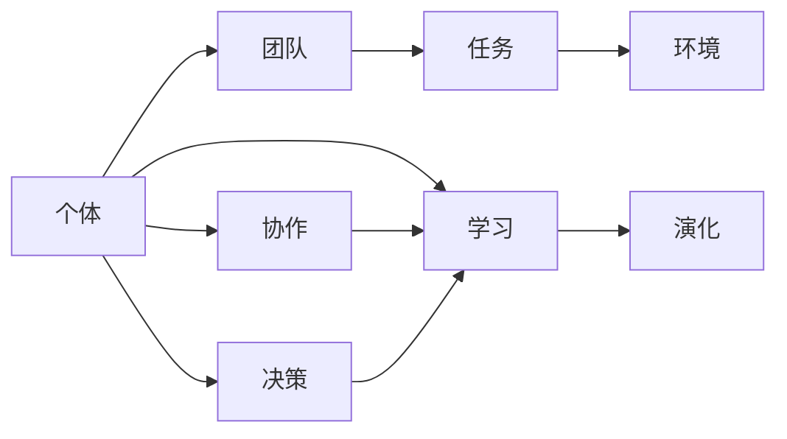
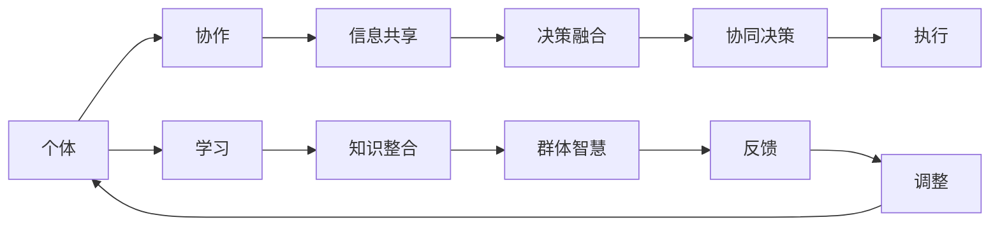

                 

## 1. 背景介绍

### 1.1 问题由来
随着人工智能（AI）和机器学习（ML）技术的飞速发展，研究者们开始探索如何通过分布式计算与协作，提升智能系统的群体智慧和决策能力。分布式认知（Distributed Cognition）理论的兴起，为理解群体智慧的涌现机制、优化智能系统的协作与学习提供了新的视角和方法。

分布式认知关注个体在复杂任务中的交互与合作，强调信息共享、协作决策等群体智能行为。例如，在工业生产线、医疗团队协作、应急响应等实际应用中，个体间的协作能够产生1+1>2的效果。本文旨在揭示分布式认知的涌现机制，分析其核心概念与联系，并探讨其在实际应用中的具体操作。

### 1.2 问题核心关键点
分布式认知的核心在于：
- **协作**：通过个体之间的交互与合作，共享信息，整合不同视角和知识。
- **决策**：基于共享的信息和协同的决策过程，优化决策结果。
- **学习**：在多次协作和尝试中，群体能够从经验中学习，提升整体智慧和表现。
- **演化**：群体的智慧与能力不是静态不变的，而是通过不断的实践和适应不断演化的。

本文将围绕上述关键点，详细介绍分布式认知的原理与实践，探讨其在复杂任务中的表现和应用。

## 2. 核心概念与联系

### 2.1 核心概念概述

分布式认知的研究涉及多个交叉学科，包括人工智能、认知科学、社会学和组织行为学等。其核心概念包括：

- **个体**：参与分布式认知的独立决策者。
- **团队/群体**：由个体组成的集体，通过协作与互动完成任务。
- **任务**：团队需要解决的具体问题或目标。
- **环境**：影响个体和团队决策的外部因素和情境。

这些概念之间的联系如图1所示。



图1 分布式认知核心概念的联系

### 2.2 核心概念原理和架构的 Mermaid 流程图

分布式认知的原理与架构可以通过以下 Mermaid 流程图来展示：



这个流程图展示了从个体协作到群体智慧涌现的全过程：

1. 个体通过协作共享信息。
2. 共享信息被融合，形成协同决策。
3. 协同决策被执行。
4. 在执行过程中，个体不断学习并整合知识。
5. 群体智慧不断涌现，并通过反馈进行持续调整。

## 3. 核心算法原理 & 具体操作步骤

### 3.1 算法原理概述

分布式认知的算法原理基于协作学习与知识共享。个体间的协作通过交换信息和知识，提升整体的智慧水平。协同决策通过融合各方信息，形成更优的决策结果。知识整合则通过不断的实践和反馈，优化群体智慧。

### 3.2 算法步骤详解

分布式认知的算法步骤主要包括协作、决策、学习与演化四个方面：

#### 3.2.1 协作
协作是指个体通过交互与合作，共享信息和资源。协作的形式可以是直接对话、交换文档、使用协作平台等。

#### 3.2.2 决策
协同决策是指基于共享信息和知识，群体进行集体决策。决策过程包括：

1. **信息收集**：通过协作获取任务相关的多角度信息。
2. **信息融合**：利用加权平均、投票等方法，整合个体提供的信息。
3. **决策生成**：基于融合的信息，生成最终的决策结果。

#### 3.2.3 学习
学习是指个体从协同决策过程中获取经验，并整合到群体知识库中。学习过程包括：

1. **反馈收集**：从决策结果中获取反馈信息。
2. **经验提炼**：将反馈信息转化为知识。
3. **知识更新**：更新群体知识库。

#### 3.2.4 演化
演化是指群体智慧与能力的持续提升和优化。演化过程包括：

1. **评估**：通过指标评估群体智慧水平。
2. **调整**：根据评估结果，调整决策策略和知识库。

### 3.3 算法优缺点

分布式认知的优点在于：

- **集体智慧**：通过群体协作，汇聚个体智慧，提升整体决策能力。
- **灵活性**：个体间的协作和信息交换灵活多样，适应性强。
- **鲁棒性**：群体智慧的涌现可以缓解个体决策的不确定性。

但其缺点也不容忽视：

- **沟通成本**：协作需要大量的沟通和协调，可能增加额外成本。
- **一致性问题**：个体间的意见分歧可能导致决策困难。
- **信息过载**：大量信息的收集与整合可能造成信息过载，影响决策效率。

### 3.4 算法应用领域

分布式认知的应用领域广泛，包括但不限于：

- **项目管理**：在项目管理中，团队通过协作和信息共享，优化项目计划和执行。
- **医疗协作**：医疗团队在诊断和治疗过程中，通过协同决策提升治疗效果。
- **金融分析**：金融分析师通过共享信息和知识，提高市场预测和投资决策的准确性。
- **人工智能开发**：AI团队通过协作和知识共享，加速算法研发和模型优化。

## 4. 数学模型和公式 & 详细讲解 & 举例说明

### 4.1 数学模型构建

分布式认知的数学模型可以从多个角度进行构建，这里以一个简单的协同决策模型为例：

假设有一个由$n$个个体组成的团队，每个个体$i$对于任务$T$的决策$x_i$的效用函数为$u_i(x_i)$，团队的总效用函数为$U(T)=\sum_{i=1}^n u_i(x_i)$。

### 4.2 公式推导过程

设团队的目标是最小化任务$T$的决策成本$C(T)$，即最大化总效用$U(T)$。个体的决策$x_i$可以通过信息融合过程得出：

$$
x_i = f(x_{-i},I_i)
$$

其中$x_{-i}$表示其他个体决策的集合，$I_i$表示个体$i$获取的信息。信息融合过程可以是加权平均、投票等多种方法。

### 4.3 案例分析与讲解

以医疗团队为例，假设一个医疗团队需要为病人制定最佳治疗方案。每个医生对治疗方案的偏好不同，通过共享病人的病历、实验室结果等信息，团队能够综合不同视角，做出更优的治疗方案。

## 5. 项目实践：代码实例和详细解释说明

### 5.1 开发环境搭建

分布式认知的实现通常需要采用协同计算和数据共享的平台，如Hadoop、Spark、Azure等。这里以Spark为例，简要介绍环境搭建步骤：

1. 安装Spark：
```bash
wget https://download.apache.org/spark/spark-3.1.2/spark-3.1.2-bin-hadoop2.7.tgz
tar -xvf spark-3.1.2-bin-hadoop2.7.tgz
cd spark-3.1.2-bin-hadoop2.7
```

2. 配置环境变量：
```bash
export SPARK_HOME=/path/to/spark
export PATH=$PATH:$SPARK_HOME/bin
```

3. 启动Spark：
```bash
spark-shell
```

### 5.2 源代码详细实现

以下是一个简单的分布式决策模型代码实现，用于模拟医疗团队的协同决策：

```python
from pyspark import SparkContext

sc = SparkContext("local", "Distributed Cognition")

# 定义医生和患者数据
doctors = sc.parallelize([("Alice", [1, 2, 3]), ("Bob", [3, 4, 5])])
patient = sc.parallelize([("Chemotherapy", 1.5), ("Surgery", 1.2)])

# 医生投票，计算平均意见
average_treatment = doctors.map(lambda doc: sum(doc[1]) / len(doc[1])).collect()[0]

# 医生共享信息，融合意见
fused_treatment = doctors.join(patient, doctors[0], "left_outer").map(lambda (doc, patient): (doc[0], sum(doc[1]) + patient[1])).collect()

# 输出融合后的治疗方案
for doctor, score in fused_treatment:
    print(f"Doctor {doctor} suggests treatment with score: {score}")
```

### 5.3 代码解读与分析

上述代码中，Spark用于并行处理多个医生的决策，通过map和join操作，实现了信息的融合与决策的协同生成。其中，`map`用于计算每个医生的平均意见，`join`用于将医生的决策与患者的治疗选项结合，生成最终的决策结果。

## 6. 实际应用场景

### 6.1 工业生产线优化

在工业生产线上，分布式认知可以通过团队协作，优化生产流程和质量控制。例如，生产工人通过协作共享经验，共同解决生产线上的问题，提升生产效率和产品质量。

### 6.2 医疗团队决策支持

在医疗领域，分布式认知可以用于提升团队诊断和治疗的准确性。例如，通过医疗团队协作，共享患者信息与专家意见，做出更全面的诊断与治疗决策。

### 6.3 金融风险管理

金融分析师团队可以通过分布式认知，优化市场预测与投资决策。例如，通过共享分析结果和数据，形成集体智慧，提高风险评估和投资组合管理的准确性。

### 6.4 未来应用展望

未来，分布式认知将在更多领域得到应用，例如：

- **智慧城市**：城市管理团队通过协作决策，优化城市规划和资源配置。
- **教育协作**：教育工作者通过共享资源和知识，提升教育质量和效率。
- **科学研究**：科研团队通过协作与信息共享，加速科学发现和技术创新。

## 7. 工具和资源推荐

### 7.1 学习资源推荐

1. **《分布式认知理论》**：详细介绍了分布式认知的原理与实践，是理解分布式认知的入门读物。
2. **Coursera《分布式系统与云计算》**：提供分布式计算和协作的在线课程，涵盖分布式认知的多个方面。
3. **IEEE Xplore**：收录了大量分布式认知与协作学习的学术论文，是深入研究的宝贵资源。

### 7.2 开发工具推荐

1. **Spark**：用于分布式计算和协作平台，适合大规模数据处理和并行计算。
2. **Hadoop**：另一个流行的分布式计算平台，支持海量数据处理和存储。
3. **Azure**：微软提供的云平台，支持分布式计算和协作工具。

### 7.3 相关论文推荐

1. **《分布式认知研究综述》**：综述了分布式认知的研究现状与未来发展方向。
2. **《群体智慧：分布式协作与智能》**：介绍了分布式认知在实际应用中的多方面应用。
3. **《协作学习与分布式认知》**：详细讨论了分布式认知中的协作学习与知识共享机制。

## 8. 总结：未来发展趋势与挑战

### 8.1 研究成果总结

分布式认知理论通过协作学习与知识共享，揭示了群体智慧的涌现机制。其在工业生产线、医疗协作、金融风险管理等领域展示了强大的应用潜力。

### 8.2 未来发展趋势

未来分布式认知将向以下几个方向发展：

- **多模态数据融合**：将文本、图像、声音等多种数据源整合，提升协作与决策的效果。
- **智能系统自适应**：分布式认知系统能够根据环境和任务的变化，自适应地调整协作策略。
- **跨文化协作**：在多元文化背景下，分布式认知系统能够处理语言和文化差异，提升跨文化协作能力。

### 8.3 面临的挑战

分布式认知面临的挑战包括：

- **沟通效率**：高频率的信息交换可能降低工作效率。
- **一致性问题**：个体间的意见分歧可能导致决策困难。
- **隐私与安全**：信息共享可能带来隐私与安全问题。

### 8.4 研究展望

未来研究将聚焦于：

- **优化协作算法**：提高信息交换和融合的效率，减少沟通成本。
- **增强系统自适应性**：使分布式认知系统能够根据环境和任务的变化，自适应地调整协作策略。
- **提升系统安全性**：在信息共享过程中，保护隐私和数据安全。

## 9. 附录：常见问题与解答

**Q1: 分布式认知与人工智能的关系是什么？**

A: 分布式认知强调群体协作与信息共享，而人工智能则专注于智能系统的决策与学习。分布式认知为人工智能提供了更丰富的协作机制和知识整合方法，两者结合可以提升AI系统的智慧与表现。

**Q2: 分布式认知在实际应用中遇到的最大挑战是什么？**

A: 分布式认知面临的最大挑战是沟通效率、一致性和隐私安全问题。高频率的信息交换可能降低工作效率，个体间的意见分歧可能导致决策困难，信息共享可能带来隐私与安全问题。

**Q3: 如何优化分布式认知中的协作算法？**

A: 优化协作算法可以从以下几个方面入手：

1. **减少信息交换**：通过预处理和预过滤，减少无用的信息交换。
2. **提高信息融合效率**：利用高效的信息融合算法，如加权平均、神经网络等。
3. **增强信息传输**：优化信息传输机制，如网络拓扑、通信协议等。

这些优化方法可以提升协作效率，降低沟通成本，使分布式认知系统更高效地运作。

通过深入理解分布式认知的原理与实践，探索其未来的发展趋势，我们可以更好地利用群体智慧，推动人工智能技术在更多领域的应用。

---

作者：禅与计算机程序设计艺术 / Zen and the Art of Computer Programming

