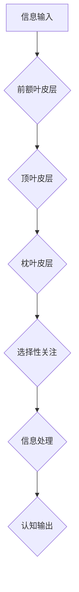

                 

## 1. 背景介绍

在当今信息爆炸的时代，我们面临着前所未有的信息量和认知压力。注意力力的下降已成为普遍现象，影响着人们的工作效率、学习能力、人际关系以及整体幸福感。 

注意力训练，作为一种旨在提升注意力力的认知训练方法，近年来备受关注。它通过一系列科学设计的练习和游戏，帮助人们增强专注力、提高信息处理能力、改善记忆力和决策能力。 

本篇文章将深入探讨注意力训练的原理、方法、应用以及未来发展趋势，旨在帮助读者了解注意力训练的科学依据，并掌握有效的注意力训练技巧，从而提升认知能力和幸福感。

## 2. 核心概念与联系

### 2.1 注意力机制

注意力机制是人类认知的核心功能之一，它指我们选择性地关注特定信息，并抑制无关信息，从而有效地处理信息过载。 

注意力机制涉及多个脑区协同工作，包括前额叶皮层、顶叶皮层、枕叶皮层等。前额叶皮层负责计划、决策和执行控制，顶叶皮层负责空间感知和注意力控制，枕叶皮层负责视觉信息处理。

**Mermaid 流程图：注意力机制**



### 2.2 注意力训练与大脑健康

注意力训练通过反复练习，可以增强大脑的注意力网络，提高神经元之间的连接和协同工作效率。 

研究表明，注意力训练可以改善以下大脑功能：

* **增强专注力:** 提高对目标信息的关注，减少对干扰信息的敏感性。
* **提升记忆力:** 增强信息编码和存储能力，提高记忆效率。
* **改善决策能力:** 提高信息筛选和分析能力，做出更明智的决策。
* **促进情绪调节:** 增强对负面情绪的控制，提高情绪稳定性。

## 3. 核心算法原理 & 具体操作步骤

### 3.1 算法原理概述

注意力训练算法通常基于以下原理：

* **重复性练习:** 通过反复练习特定任务，增强大脑对该任务的处理能力。
* **渐进式难度:** 从简单的任务开始，逐渐增加任务难度，挑战大脑的认知能力。
* **反馈机制:** 提供及时反馈，帮助用户了解自己的进步情况，并调整训练策略。

### 3.2 算法步骤详解

1. **任务设计:** 设计一系列针对不同注意力能力的训练任务，例如：

    * **视觉注意力:** 识别目标物体、追踪移动物体、区分相似物体。
    * **听觉注意力:** 识别特定声音、过滤背景噪音、记忆语音信息。
    * **工作记忆:** 记住数字序列、完成逻辑推理、执行多步操作。

2. **训练过程:** 用户进行训练任务，系统记录用户的反应时间、准确率等指标。

3. **反馈机制:** 系统根据用户的表现提供反馈，例如：

    * **正确率:** 显示用户完成任务的正确率。
    * **反应时间:** 显示用户完成任务所需的时间。
    * **难度调整:** 根据用户的表现调整任务难度。

4. **数据分析:** 系统分析用户的训练数据，评估用户的注意力能力提升情况。

### 3.3 算法优缺点

**优点:**

* **科学依据:** 基于认知心理学和神经科学原理。
* **个性化训练:** 可以根据用户的注意力能力进行个性化训练。
* **可量化评估:** 可以通过数据指标评估训练效果。

**缺点:**

* **训练时间:** 需要持续的训练才能看到明显的效果。
* **训练效果:** 训练效果因人而异，并非所有人都能获得显著提升。
* **技术复杂性:** 开发高质量的注意力训练软件需要一定的技术难度。

### 3.4 算法应用领域

注意力训练算法广泛应用于以下领域:

* **教育:** 帮助学生提高学习效率、记忆力和专注力。
* **医疗:** 治疗注意力缺陷多动障碍 (ADHD)、焦虑症等注意力相关疾病。
* **职场:** 提升员工的工作效率、决策能力和创造力。
* **游戏:** 设计更具挑战性和趣味性的游戏体验。

## 4. 数学模型和公式 & 详细讲解 & 举例说明

### 4.1 数学模型构建

注意力机制可以用数学模型来表示，例如：

**注意力权重:**

$$
\alpha_i = \frac{exp(e_i^T * w_a)}{\sum_{j=1}^{N} exp(e_j^T * w_a)}
$$

其中:

* $e_i$ 是第 i 个输入特征的表示向量。
* $w_a$ 是注意力权重参数向量。
* $N$ 是输入特征的数量。

**输出:**

$$
y = \sum_{i=1}^{N} \alpha_i * e_i
$$

### 4.2 公式推导过程

注意力权重公式通过 softmax 函数将输入特征的表示向量映射到一个概率分布，其中每个元素代表该特征被关注的程度。

注意力权重参数向量 $w_a$ 可以通过训练学习得到，使得模型能够更好地学习到哪些特征对目标任务更重要。

输出公式将注意力加权后的输入特征进行加权求和，得到最终的输出。

### 4.3 案例分析与讲解

例如，在机器翻译任务中，注意力机制可以帮助模型关注源语言中与目标语言中对应词语相关的部分，从而提高翻译的准确性。

## 5. 项目实践：代码实例和详细解释说明

### 5.1 开发环境搭建

* **操作系统:** Ubuntu 20.04 LTS
* **编程语言:** Python 3.8
* **深度学习框架:** TensorFlow 2.0

### 5.2 源代码详细实现

```python
import tensorflow as tf

# 定义注意力机制层
class AttentionLayer(tf.keras.layers.Layer):
    def __init__(self, units):
        super(AttentionLayer, self).__init__()
        self.W1 = tf.keras.layers.Dense(units)
        self.W2 = tf.keras.layers.Dense(units)
        self.V = tf.keras.layers.Dense(1)

    def call(self, inputs):
        # 计算注意力权重
        scores = self.V(tf.nn.tanh(self.W1(inputs) + self.W2(inputs)))
        # 归一化注意力权重
        attention_weights = tf.nn.softmax(scores, axis=-1)
        # 加权求和
        context_vector = tf.matmul(attention_weights, inputs)
        return context_vector

# 定义注意力训练模型
model = tf.keras.Sequential([
    tf.keras.layers.Embedding(input_dim=10000, output_dim=128),
    AttentionLayer(units=64),
    tf.keras.layers.Dense(units=10, activation='softmax')
])

# 编译模型
model.compile(optimizer='adam', loss='sparse_categorical_crossentropy', metrics=['accuracy'])

# 训练模型
model.fit(x_train, y_train, epochs=10)
```

### 5.3 代码解读与分析

* **AttentionLayer:** 定义了一个注意力机制层，包含三个密集层，分别用于计算注意力权重、归一化注意力权重和加权求和。
* **模型结构:** 模型结构包含嵌入层、注意力机制层和全连接输出层。
* **训练过程:** 使用 Adam 优化器、交叉熵损失函数和准确率指标训练模型。

### 5.4 运行结果展示

训练完成后，可以评估模型的性能，例如：

* **准确率:** 模型在测试集上的准确率。
* **损失函数值:** 模型在训练过程中的损失函数值。

## 6. 实际应用场景

### 6.1 教育领域

注意力训练软件可以帮助学生提高学习效率、记忆力和专注力，例如：

* **专注力训练游戏:** 通过游戏形式训练学生的注意力，例如：识别目标物体、追踪移动物体、记忆数字序列等。
* **学习辅助工具:** 提供个性化的学习计划和练习，帮助学生更好地理解和记忆知识。

### 6.2 医疗领域

注意力训练可以用于治疗注意力缺陷多动障碍 (ADHD)、焦虑症等注意力相关疾病，例如：

* **认知行为疗法:** 结合注意力训练和认知行为疗法，帮助患者改善注意力、情绪和行为问题。
* **神经刺激技术:** 利用脑电波反馈和神经刺激技术，增强大脑的注意力网络。

### 6.3 职场领域

注意力训练可以提升员工的工作效率、决策能力和创造力，例如：

* **工作场所注意力训练:** 通过冥想、呼吸练习等方法，帮助员工放松身心，提高注意力。
* **远程办公注意力训练:** 提供远程办公环境下的注意力训练工具，帮助员工保持专注力。

### 6.4 未来应用展望

注意力训练技术将继续发展，并应用于更多领域，例如：

* **人工智能:** 增强人工智能模型的注意力机制，提高其处理复杂信息的效率。
* **虚拟现实:** 在虚拟现实环境中提供沉浸式注意力训练体验。
* **脑机接口:** 利用脑机接口技术，实现对注意力机制的直接控制和调节。

## 7. 工具和资源推荐

### 7.1 学习资源推荐

* **书籍:**

    * 《注意力训练与大脑健康改善》
    * 《专注力：如何提升注意力，提高效率，获得成功》

* **在线课程:**

    * Coursera: 认知科学
    * edX: 神经科学

### 7.2 开发工具推荐

* **TensorFlow:** 深度学习框架
* **PyTorch:** 深度学习框架
* **Keras:** 深度学习 API

### 7.3 相关论文推荐

* **Attention Is All You Need:** https://arxiv.org/abs/1706.03762
* **BERT: Pre-training of Deep Bidirectional Transformers for Language Understanding:** https://arxiv.org/abs/1810.04805

## 8. 总结：未来发展趋势与挑战

### 8.1 研究成果总结

注意力训练技术取得了显著进展，并展现出巨大的应用潜力。

* **科学依据:** 注意力训练的科学依据越来越完善，研究表明它可以有效提升注意力能力。
* **技术成熟度:** 注意力训练算法和工具不断发展，更加成熟和易于使用。
* **应用领域拓展:** 注意力训练技术应用于越来越多的领域，例如教育、医疗、职场等。

### 8.2 未来发展趋势

* **个性化训练:** 基于用户个体差异，提供更加个性化的注意力训练方案。
* **多模态训练:** 结合视觉、听觉、触觉等多种感官信息进行注意力训练，提高训练效果。
* **脑机接口:** 利用脑机接口技术，实现对注意力机制的直接控制和调节。

### 8.3 面临的挑战

* **训练效果评估:** 目前注意力训练效果的评估方法尚不完善，需要进一步研究和改进。
* **长期效果:** 需要进一步研究注意力训练的长期效果，以及如何保持训练效果。
* **伦理问题:** 注意力训练技术可能带来一些伦理问题，例如数据隐私、信息操控等，需要引起重视和探讨。

### 8.4 研究展望

未来，注意力训练技术将继续发展，并为人类认知能力的提升和幸福感提升做出更大的贡献。


## 9. 附录：常见问题与解答

**Q1: 注意力训练真的有效吗？**

A1: 越来越多的研究表明，注意力训练可以有效提升注意力能力。

**Q2: 注意力训练需要多长时间才能看到效果？**

A2: 训练时间因人而异，一般需要持续训练几周或几个月才能看到明显的效果。

**Q3: 注意力训练适合所有人吗？**

A3: 注意力训练适合大多数人，但对于一些特定人群，例如患有注意力缺陷多动障碍 (ADHD) 的患者，需要在专业医生的指导下进行。

**Q4: 注意力训练有哪些风险？**

A4: 注意力训练一般来说是安全的，但过度训练可能会导致疲劳和焦虑。

**Q5: 如何选择合适的注意力训练软件？**

A5: 选择时，建议选择科学依据、操作简单、效果显著的软件。


作者：禅与计算机程序设计艺术 / Zen and the Art of Computer Programming 
<end_of_turn>

