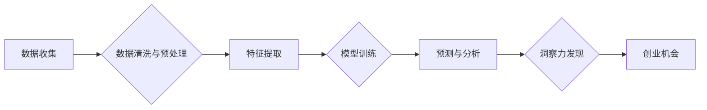

                 

## 洞察力与创业精神：发现机会的敏锐度

> 关键词：人工智能、创业、洞察力、数据分析、模式识别、创新、技术趋势

### 1. 背景介绍

在瞬息万变的科技时代，洞察力已成为创业成功的关键要素。 传统的商业模式正在被颠覆，新兴技术如人工智能、大数据、云计算等不断涌现，为创业者带来了前所未有的机遇。然而，机遇与挑战并存，如何从海量信息中挖掘出有价值的洞察，并将其转化为商业价值，成为创业者面临的重大课题。

### 2. 核心概念与联系

**2.1 洞察力**

洞察力是指识别隐藏在表面现象背后的本质规律和趋势的能力。它是一种敏锐的感知和理解，能够将看似无关的信息串联起来，发现新的联系和模式。

**2.2 创业精神**

创业精神是指勇于创新、敢于冒险、追求卓越的强烈愿望和行动力。它是一种积极进取、不断探索的精神，能够将想法转化为现实，创造新的价值。

**2.3 数据分析与模式识别**

数据分析和模式识别是洞察力的重要工具。通过对海量数据的分析和挖掘，我们可以发现隐藏在其中的规律和趋势，从而洞察市场需求、用户行为、竞争格局等关键信息。

**2.4 人工智能**

人工智能技术正在加速数据分析和模式识别的进程。机器学习算法能够自动学习数据中的模式，并进行预测和决策，为创业者提供更精准的洞察。

**2.5 流程图**



### 3. 核心算法原理 & 具体操作步骤

**3.1 算法原理概述**

深度学习算法是人工智能领域的重要分支，其核心原理是通过多层神经网络模拟人类大脑的学习过程。深度学习算法能够自动学习数据中的复杂模式，并进行预测和决策。

**3.2 算法步骤详解**

1. **数据收集与预处理:** 收集相关数据，并进行清洗、格式化、转换等预处理操作，以确保数据质量和算法训练的有效性。
2. **特征提取:** 从原始数据中提取有价值的特征，例如文本中的关键词、图像中的边缘信息等，这些特征将作为算法训练的输入。
3. **模型训练:** 使用深度学习算法训练神经网络模型，通过调整模型参数，使模型能够准确地预测或分类数据。
4. **模型评估:** 使用测试数据评估模型的性能，例如准确率、召回率、F1-score等指标，并根据评估结果进行模型调优。
5. **预测与分析:** 将训练好的模型应用于新的数据，进行预测或分类，并对结果进行分析和解读，以发现隐藏的洞察。

**3.3 算法优缺点**

**优点:**

* 能够学习复杂模式，准确预测数据。
* 自动化程度高，减少人工干预。
* 可应用于多种领域，例如图像识别、自然语言处理、语音识别等。

**缺点:**

* 需要大量数据进行训练，数据质量对模型性能影响较大。
* 训练过程耗时和计算资源消耗大。
* 模型解释性较差，难以理解模型的决策过程。

**3.4 算法应用领域**

深度学习算法已广泛应用于各个领域，例如：

* **商业智能:** 预测市场趋势、客户行为、产品需求等。
* **金融科技:** 风险评估、欺诈检测、投资决策等。
* **医疗保健:** 疾病诊断、药物研发、个性化医疗等。
* **自动驾驶:** 路线规划、物体识别、决策控制等。

### 4. 数学模型和公式 & 详细讲解 & 举例说明

**4.1 数学模型构建**

深度学习模型通常采用多层神经网络结构，每个神经元接收多个输入信号，并通过激活函数进行处理，输出一个信号。神经网络的学习过程就是通过调整神经元之间的权重，使模型的输出与实际目标值之间的误差最小化。

**4.2 公式推导过程**

深度学习模型的训练过程通常使用反向传播算法，该算法通过计算误差梯度，逐步调整神经网络的权重。

**误差函数:**

$$
E = \frac{1}{2} \sum_{i=1}^{N} (y_i - \hat{y}_i)^2
$$

其中：

* $E$ 是误差函数
* $N$ 是样本数量
* $y_i$ 是实际目标值
* $\hat{y}_i$ 是模型预测值

**梯度下降算法:**

$$
\theta = \theta - \alpha \nabla E(\theta)
$$

其中：

* $\theta$ 是模型参数
* $\alpha$ 是学习率
* $\nabla E(\theta)$ 是误差函数对参数的梯度

**4.3 案例分析与讲解**

例如，在图像识别任务中，深度学习模型可以学习图像中的特征，并将其映射到不同的类别。训练过程中，模型会使用大量的标记图像数据，通过反向传播算法调整权重，使模型能够准确地识别图像中的物体。

### 5. 项目实践：代码实例和详细解释说明

**5.1 开发环境搭建**

使用Python语言和深度学习框架TensorFlow或PyTorch进行开发。

**5.2 源代码详细实现**

```python
import tensorflow as tf

# 定义模型结构
model = tf.keras.models.Sequential([
    tf.keras.layers.Conv2D(32, (3, 3), activation='relu', input_shape=(28, 28, 1)),
    tf.keras.layers.MaxPooling2D((2, 2)),
    tf.keras.layers.Conv2D(64, (3, 3), activation='relu'),
    tf.keras.layers.MaxPooling2D((2, 2)),
    tf.keras.layers.Flatten(),
    tf.keras.layers.Dense(10, activation='softmax')
])

# 编译模型
model.compile(optimizer='adam',
              loss='sparse_categorical_crossentropy',
              metrics=['accuracy'])

# 训练模型
model.fit(x_train, y_train, epochs=5)

# 评估模型
loss, accuracy = model.evaluate(x_test, y_test)
print('Test loss:', loss)
print('Test accuracy:', accuracy)
```

**5.3 代码解读与分析**

这段代码定义了一个简单的卷积神经网络模型，用于手写数字识别任务。模型包含两层卷积层、两层最大池化层、一层全连接层和一层输出层。

**5.4 运行结果展示**

训练完成后，模型可以用于识别新的手写数字图像。

### 6. 实际应用场景

**6.1 市场趋势分析:**

利用深度学习算法分析海量市场数据，识别消费趋势、产品需求、竞争格局等，为创业者提供决策依据。

**6.2 用户行为分析:**

分析用户行为数据，例如点击记录、浏览历史、购买记录等，洞察用户需求、偏好和行为模式，为产品设计和营销策略提供指导。

**6.3 产品推荐:**

根据用户的历史行为和偏好，利用深度学习算法进行产品推荐，提高用户体验和转化率。

**6.4 未来应用展望**

随着人工智能技术的不断发展，洞察力将成为创业者不可或缺的武器。未来，我们将看到更多基于人工智能的洞察工具和应用，帮助创业者更精准地发现机会，创造更大的价值。

### 7. 工具和资源推荐

**7.1 学习资源推荐**

* **书籍:**

    * 《深度学习》
    * 《机器学习》
    * 《Python机器学习实战》

* **在线课程:**

    * Coursera深度学习课程
    * Udacity人工智能课程
    * fast.ai深度学习课程

**7.2 开发工具推荐**

* **Python:** 

    * TensorFlow
    * PyTorch
    * scikit-learn

* **云平台:**

    * AWS
    * Azure
    * Google Cloud Platform

**7.3 相关论文推荐**

* **AlexNet:** ImageNet Classification with Deep Convolutional Neural Networks
* **VGGNet:** Very Deep Convolutional Networks for Large-Scale Image Recognition
* **ResNet:** Deep Residual Learning for Image Recognition

### 8. 总结：未来发展趋势与挑战

**8.1 研究成果总结**

深度学习算法在图像识别、自然语言处理、语音识别等领域取得了突破性进展，为洞察力发现提供了强大的工具。

**8.2 未来发展趋势**

* **模型更加复杂和强大:** 

    * 更深的网络结构
    * 更强大的计算能力
    * 更丰富的模型类型

* **数据更加丰富和多样化:**

    * 海量数据的收集和处理
    * 多模态数据的融合
    * 隐私保护和数据安全

* **应用更加广泛和深入:**

    * 医疗保健、金融科技、自动驾驶等领域
    * 个性化定制、智能决策、自动化的应用

**8.3 面临的挑战**

* **算法解释性:** 深度学习模型的决策过程难以解释，这限制了其在一些领域，例如医疗诊断、法律判决等方面的应用。
* **数据偏见:** 训练数据中的偏见可能会导致模型产生不公平或歧视性的结果。
* **计算资源:** 训练大型深度学习模型需要大量的计算资源，这对于一些小型企业或个人开发者来说是一个挑战。

**8.4 研究展望**

未来研究将集中在解决上述挑战，例如开发更可解释的深度学习模型、构建更公平的数据集、降低训练成本等方面。


### 9. 附录：常见问题与解答

**9.1 如何选择合适的深度学习算法？**

选择合适的深度学习算法取决于具体的应用场景和数据特点。例如，对于图像识别任务，卷积神经网络通常是首选；对于文本分类任务，循环神经网络或Transformer模型更合适。

**9.2 如何处理不平衡的数据集？**

不平衡的数据集会导致模型训练效果不佳。可以采用一些技术来处理不平衡数据集，例如数据采样、权重调整、集成学习等。

**9.3 如何评估深度学习模型的性能？**

常用的评估指标包括准确率、召回率、F1-score、AUC等。选择合适的评估指标取决于具体的应用场景和任务目标。


作者：禅与计算机程序设计艺术 / Zen and the Art of Computer Programming 
<end_of_turn>

