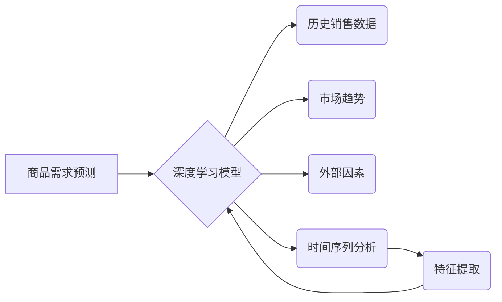

                 

## 深度学习驱动的商品需求预测模型

> 关键词：深度学习、商品需求预测、时间序列分析、神经网络、强化学习、机器学习、预测模型

## 1. 背景介绍

在当今数据爆炸的时代，商品需求预测已成为商业决策的关键环节。准确预测商品需求能够帮助企业优化库存管理、制定合理的生产计划、制定有效的营销策略，从而提高利润率和市场竞争力。传统的商品需求预测方法主要依赖于统计模型和专家经验，但这些方法往往难以捕捉到复杂的时间序列模式和非线性关系。

深度学习作为一种强大的机器学习技术，凭借其强大的非线性建模能力和对大规模数据处理的优势，在商品需求预测领域展现出巨大的潜力。深度学习模型能够自动学习数据中的复杂特征，并建立更精准的预测模型。

## 2. 核心概念与联系

### 2.1 商品需求预测

商品需求预测是指利用历史销售数据、市场趋势、外部因素等信息，预测未来一段时间内特定商品的销售量。

### 2.2 深度学习

深度学习是一种基于多层神经网络的机器学习方法，能够自动学习数据中的复杂特征和模式。深度学习模型通常由多个隐藏层组成，每层神经元之间通过权重连接进行信息传递。通过训练，模型能够学习到最优的权重，从而实现对数据的准确预测。

### 2.3 时间序列分析

时间序列分析是研究随时间推移而变化的数据的统计方法。商品需求数据通常呈现出时间序列特征，例如季节性、趋势性和周期性。深度学习模型可以结合时间序列分析方法，更好地捕捉到商品需求的时间依赖性。

**核心概念与架构流程图**



## 3. 核心算法原理 & 具体操作步骤

### 3.1 算法原理概述

深度学习驱动的商品需求预测模型通常采用循环神经网络（RNN）或其变体，例如长短期记忆网络（LSTM）和门控循环单元（GRU）。这些模型能够有效地处理时间序列数据，并捕捉到数据中的长期依赖关系。

### 3.2 算法步骤详解

1. **数据预处理:** 收集历史销售数据、市场趋势数据和外部因素数据，并进行清洗、转换和归一化处理。
2. **特征提取:** 从原始数据中提取特征，例如商品类别、价格、促销活动、季节性等。
3. **模型构建:** 选择合适的深度学习模型，例如LSTM或GRU，并根据实际需求进行参数调整。
4. **模型训练:** 使用训练数据训练深度学习模型，并通过优化算法调整模型参数，使模型预测结果与实际销售数据尽可能接近。
5. **模型评估:** 使用测试数据评估模型的预测性能，常用的指标包括均方误差（MSE）、平均绝对误差（MAE）和R-squared。
6. **模型部署:** 将训练好的模型部署到生产环境中，用于预测未来商品需求。

### 3.3 算法优缺点

**优点:**

* 能够捕捉到复杂的时间序列模式和非线性关系。
* 预测精度高，能够提供更准确的商品需求预测结果。
* 可扩展性强，能够处理海量数据。

**缺点:**

* 训练数据量大，需要大量的历史数据进行训练。
* 模型训练时间长，需要较强的计算资源支持。
* 模型解释性差，难以理解模型的预测结果是如何得出的。

### 3.4 算法应用领域

深度学习驱动的商品需求预测模型广泛应用于以下领域：

* 零售行业：优化库存管理、制定合理的生产计划、预测商品销售趋势。
* 制造业：预测原材料需求、优化生产计划、减少库存积压。
* 农业行业：预测农产品产量、优化种植计划、降低生产成本。
* 金融行业：预测股票价格、评估风险、优化投资组合。

## 4. 数学模型和公式 & 详细讲解 & 举例说明

### 4.1 数学模型构建

深度学习驱动的商品需求预测模型通常采用以下数学模型：

* **线性回归模型:** 用于预测商品需求与输入特征之间的线性关系。

$$
y = \beta_0 + \beta_1x_1 + \beta_2x_2 + ... + \beta_nx_n + \epsilon
$$

其中：

* $y$ 是预测的商品需求
* $x_1, x_2, ..., x_n$ 是输入特征
* $\beta_0, \beta_1, \beta_2, ..., \beta_n$ 是模型参数
* $\epsilon$ 是误差项

* **神经网络模型:** 用于预测商品需求与输入特征之间的非线性关系。

神经网络模型由多个层组成，每层包含多个神经元。每个神经元接收来自上一层的输入信号，并通过激活函数进行处理，输出到下一层。

### 4.2 公式推导过程

神经网络模型的训练过程是通过反向传播算法来实现的。反向传播算法通过计算模型预测结果与实际结果之间的误差，并根据误差反向调整模型参数，使得模型预测结果越来越接近实际结果。

### 4.3 案例分析与讲解

假设我们想要预测某商品的未来一周销售量。我们可以收集该商品的历史销售数据、市场趋势数据和外部因素数据，例如节日、促销活动等。然后，我们可以使用LSTM模型对这些数据进行训练，并预测未来一周的销售量。

## 5. 项目实践：代码实例和详细解释说明

### 5.1 开发环境搭建

* Python 3.6+
* TensorFlow 或 PyTorch 深度学习框架
* NumPy、Pandas 等数据处理库

### 5.2 源代码详细实现

```python
import tensorflow as tf
from tensorflow.keras.models import Sequential
from tensorflow.keras.layers import LSTM, Dense

# 数据预处理
# ...

# 模型构建
model = Sequential()
model.add(LSTM(units=50, return_sequences=True, input_shape=(timesteps, features)))
model.add(LSTM(units=50))
model.add(Dense(units=1))

# 模型编译
model.compile(loss='mean_squared_error', optimizer='adam')

# 模型训练
model.fit(X_train, y_train, epochs=100, batch_size=32)

# 模型评估
loss = model.evaluate(X_test, y_test)
print('Test Loss:', loss)

# 模型预测
predictions = model.predict(X_new)
```

### 5.3 代码解读与分析

* 首先，我们使用LSTM模型构建一个深度学习模型。
* 模型包含两层LSTM层和一层Dense层。
* LSTM层用于处理时间序列数据，Dense层用于输出预测结果。
* 我们使用均方误差作为损失函数，Adam优化器进行模型训练。
* 模型训练完成后，我们使用测试数据评估模型的性能。
* 最后，我们使用训练好的模型预测未来商品需求。

### 5.4 运行结果展示

运行结果展示了模型的预测精度，例如均方误差、平均绝对误差等。

## 6. 实际应用场景

深度学习驱动的商品需求预测模型已在许多实际应用场景中取得成功。例如：

* **亚马逊:** 利用深度学习模型预测商品需求，优化库存管理和物流配送。
* **Netflix:** 利用深度学习模型预测用户观看习惯，推荐个性化内容。
* **Uber:** 利用深度学习模型预测出行需求，优化车辆调度和价格策略。

### 6.4 未来应用展望

随着深度学习技术的不断发展，商品需求预测模型将更加精准、高效和智能。未来，深度学习驱动的商品需求预测模型将应用于更多领域，例如：

* **个性化推荐:** 根据用户的历史购买记录和行为数据，预测用户的个性化需求，提供更精准的商品推荐。
* **动态定价:** 根据商品需求和市场趋势，动态调整商品价格，提高利润率。
* **供应链管理:** 预测商品需求和供应链风险，优化供应链管理，降低成本。

## 7. 工具和资源推荐

### 7.1 学习资源推荐

* **书籍:**
    * Deep Learning by Ian Goodfellow, Yoshua Bengio, and Aaron Courville
    * Hands-On Machine Learning with Scikit-Learn, Keras & TensorFlow by Aurélien Géron
* **在线课程:**
    * TensorFlow Tutorials: https://www.tensorflow.org/tutorials
    * PyTorch Tutorials: https://pytorch.org/tutorials/

### 7.2 开发工具推荐

* **TensorFlow:** https://www.tensorflow.org/
* **PyTorch:** https://pytorch.org/
* **Keras:** https://keras.io/

### 7.3 相关论文推荐

* **Sequence to Sequence Learning with Neural Networks** by Sutskever et al. (2014)
* **Recurrent Neural Networks for Sequence Learning** by Hochreiter and Schmidhuber (1997)
* **Long Short-Term Memory** by Hochreiter and Schmidhuber (1997)

## 8. 总结：未来发展趋势与挑战

### 8.1 研究成果总结

深度学习驱动的商品需求预测模型取得了显著的成果，能够提供更准确、高效的预测结果。

### 8.2 未来发展趋势

* **模型复杂度提升:** 探索更复杂的深度学习模型，例如Transformer网络，以更好地捕捉商品需求的复杂特征。
* **数据融合:** 将不同类型的数据融合在一起，例如文本数据、图像数据、传感器数据，以提高预测精度。
* **解释性增强:** 研究如何提高深度学习模型的解释性，使得模型的预测结果更容易理解。

### 8.3 面临的挑战

* **数据质量:** 深度学习模型对数据质量要求很高，需要高质量、大规模的数据进行训练。
* **模型 interpretability:** 深度学习模型的内部机制复杂，难以解释模型的预测结果，这限制了模型在实际应用中的可信度。
* **计算资源:** 训练深度学习模型需要大量的计算资源，这对于一些小型企业来说是一个挑战。

### 8.4 研究展望

未来，深度学习驱动的商品需求预测模型将继续朝着更精准、高效、智能的方向发展。随着技术的不断进步，深度学习模型将应用于更多领域，为商业决策提供更强大的支持。

## 9. 附录：常见问题与解答

* **Q: 深度学习模型的训练时间很长，如何加速模型训练？**

* **A:** 可以使用GPU加速训练，并尝试使用模型压缩技术，例如权重剪枝和量化。

* **Q: 深度学习模型的预测结果难以解释，如何提高模型的解释性？**

* **A:** 可以使用可解释机器学习（XAI）技术，例如LIME和SHAP，来解释模型的预测结果。

* **Q: 深度学习模型对数据质量要求很高，如何处理不完整或噪声数据？**

* **A:** 可以使用数据清洗和预处理技术，例如缺失值填充和异常值处理，来提高数据质量。


作者：禅与计算机程序设计艺术 / Zen and the Art of Computer Programming 
<end_of_turn>

