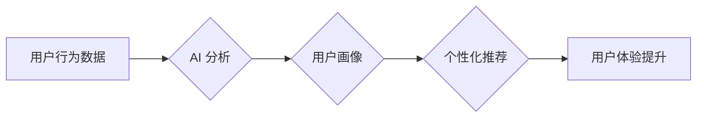

                 

## 用户体验：人类计算如何提升客户满意度

> 关键词：用户体验、人类计算、客户满意度、人工智能、自然语言处理、情感分析、用户行为分析、交互设计

## 1. 背景介绍

在当今数字化时代，用户体验 (User Experience，简称 UX) 已成为企业竞争力的关键因素。用户对产品和服务的体验直接影响着他们的满意度、忠诚度和最终的购买决策。随着人工智能 (Artificial Intelligence，简称 AI) 技术的快速发展，人类计算 (Human Computation) 作为一种新的计算模式，为提升用户体验提供了新的机遇和挑战。

人类计算是指利用人类的智慧、创造力和判断力来解决计算问题，它将人类的认知能力与计算机的计算能力相结合，形成一种协同的计算模式。在用户体验领域，人类计算可以帮助企业更好地理解用户的需求、行为和情感，从而提供更个性化、更人性化的服务体验。

## 2. 核心概念与联系

### 2.1 用户体验 (UX)

用户体验是指用户与产品或服务的交互过程中的所有感受和感知。它包括用户对产品功能、易用性、美观度、效率、可靠性等方面的评价。良好的用户体验可以提升用户满意度，促进用户留存和复购。

### 2.2 人类计算 (Human Computation)

人类计算是指利用人类的智慧、创造力和判断力来解决计算问题。它可以分为以下几种类型：

* **微任务 (Micro-tasking):** 将复杂任务分解成许多简单易完成的小任务，由大量的人类参与者完成。
* **协作计算 (Collaborative Computing):** 多个参与者共同合作完成一个复杂的任务。
* **大众科学 (Citizen Science):** 利用大众参与者进行科学研究，收集和分析数据。

### 2.3 人工智能 (AI)

人工智能是指模拟人类智能的计算机系统。它可以学习、推理、决策和解决问题。在用户体验领域，AI 可以用于个性化推荐、聊天机器人、情感分析等方面。

**Mermaid 流程图**



## 3. 核心算法原理 & 具体操作步骤

### 3.1 算法原理概述

人类计算在用户体验领域主要通过以下算法原理实现：

* **用户行为分析 (User Behavior Analysis):** 通过分析用户的行为数据，例如点击记录、浏览历史、购买记录等，来了解用户的兴趣、偏好和需求。
* **情感分析 (Sentiment Analysis):** 通过分析用户的文本数据，例如评论、反馈、社交媒体帖子等，来识别用户的情感倾向，例如正面、负面、中性等。
* **个性化推荐 (Personalized Recommendation):** 基于用户的行为数据和情感分析结果，为用户提供个性化的产品或服务推荐。

### 3.2 算法步骤详解

**用户行为分析算法步骤:**

1. 收集用户行为数据：例如网站访问记录、App使用数据、电商平台购买记录等。
2. 数据预处理：清洗数据，去除噪声和重复数据，格式化数据。
3. 特征提取：从用户行为数据中提取特征，例如用户访问的页面、停留时间、点击次数等。
4. 模型训练：使用机器学习算法，例如聚类算法、决策树算法等，对用户行为数据进行建模，识别用户行为模式。
5. 用户画像构建：根据模型预测结果，构建用户画像，描述用户的兴趣、偏好和需求。

**情感分析算法步骤:**

1. 收集文本数据：例如用户评论、反馈、社交媒体帖子等。
2. 数据预处理：清洗数据，去除停用词、标点符号等，格式化数据。
3. 词汇情感标注：使用情感词典或机器学习模型，对文本中的词汇进行情感标注，例如正面、负面、中性等。
4. 文本情感分类：根据词汇情感标注结果，对文本进行情感分类，识别文本的情感倾向。

**个性化推荐算法步骤:**

1. 收集用户行为数据和情感分析结果。
2. 基于用户画像和情感倾向，推荐相关产品或服务。
3. 使用协同过滤算法、内容过滤算法等，提高推荐的准确性和个性化程度。

### 3.3 算法优缺点

**用户行为分析算法:**

* **优点:** 可以识别用户行为模式，帮助企业了解用户的需求和偏好。
* **缺点:** 需要大量的数据支持，算法模型的准确性依赖于数据质量。

**情感分析算法:**

* **优点:** 可以识别用户的真实情感倾向，帮助企业了解用户的满意度和潜在问题。
* **缺点:** 语言的复杂性和多义性，使得情感分析算法的准确性存在挑战。

**个性化推荐算法:**

* **优点:** 可以为用户提供个性化的产品或服务推荐，提升用户体验和转化率。
* **缺点:** 需要考虑用户隐私和数据安全问题。

### 3.4 算法应用领域

* **电商平台:** 个性化商品推荐、用户画像分析、客户服务优化。
* **社交媒体:** 情感分析、用户行为分析、内容推荐。
* **金融服务:** 风险评估、欺诈检测、客户服务自动化。
* **医疗保健:** 疾病诊断、患者管理、药物研发。

## 4. 数学模型和公式 & 详细讲解 & 举例说明

### 4.1 数学模型构建

用户行为分析算法通常使用概率模型来描述用户行为模式。例如，可以使用马尔科夫链模型来描述用户在网站上的浏览路径。

**马尔科夫链模型**

马尔科夫链模型是一种统计模型，它描述了系统在不同状态之间的转移概率。在用户行为分析中，每个页面可以看作是一个状态，用户从一个页面跳转到另一个页面可以看作是一个状态转移。

**状态转移概率矩阵**

状态转移概率矩阵描述了用户在不同状态之间的转移概率。例如，如果用户当前在页面 A，那么转移到页面 B 的概率为 P(B|A)。

### 4.2 公式推导过程

马尔科夫链模型的概率计算可以使用贝叶斯定理和状态转移概率矩阵。

**贝叶斯定理:**

$$P(A|B) = \frac{P(B|A)P(A)}{P(B)}$$

其中：

* P(A|B) 是在已知 B 的条件下 A 发生的概率。
* P(B|A) 是在已知 A 的条件下 B 发生的概率。
* P(A) 是 A 发生的概率。
* P(B) 是 B 发生的概率。

**状态转移概率矩阵的计算:**

$$P(B|A) = \frac{N(A,B)}{N(A)}$$

其中：

* N(A,B) 是从状态 A 转移到状态 B 的次数。
* N(A) 是从状态 A 出发的总次数。

### 4.3 案例分析与讲解

例如，假设一个网站有三个页面：首页 (A)、产品页面 (B) 和购物车页面 (C)。

**状态转移概率矩阵:**

| 状态 | A -> B | A -> C | B -> A | B -> C | C -> A | C -> B |
|---|---|---|---|---|---|---|
|  | 0.3 | 0.1 | 0.4 | 0.2 | 0.2 | 0.8 |

**解释:**

* 从首页 (A) 转移到产品页面 (B) 的概率为 0.3。
* 从产品页面 (B) 转移到购物车页面 (C) 的概率为 0.2。
* 从购物车页面 (C) 转移到首页 (A) 的概率为 0.2。

## 5. 项目实践：代码实例和详细解释说明

### 5.1 开发环境搭建

* 操作系统: Windows/macOS/Linux
* 编程语言: Python
* 库依赖: pandas, numpy, scikit-learn

### 5.2 源代码详细实现

```python
import pandas as pd
from sklearn.cluster import KMeans

# 加载用户行为数据
data = pd.read_csv('user_behavior.csv')

# 特征提取
features = data[['page_views', 'session_duration', 'click_through_rate']]

# 模型训练
kmeans = KMeans(n_clusters=3)
kmeans.fit(features)

# 用户画像构建
data['cluster'] = kmeans.labels_

# 分析用户画像
print(data.groupby('cluster').mean())
```

### 5.3 代码解读与分析

* **数据加载:** 使用 pandas 库加载用户行为数据。
* **特征提取:** 从用户行为数据中提取特征，例如页面浏览次数、会话时长、点击率等。
* **模型训练:** 使用 KMeans 聚类算法对用户行为数据进行聚类，将用户分成不同的群组。
* **用户画像构建:** 为每个用户分配一个群组标签，构建用户画像。
* **分析用户画像:** 使用 pandas 库对不同群组的用户行为进行分析，例如平均页面浏览次数、平均会话时长等。

### 5.4 运行结果展示

运行代码后，会输出不同群组的用户行为统计结果，例如：

```
          page_views  session_duration  click_through_rate
cluster                                                 
0       10.500000       30.000000       0.100000
1       25.000000       60.000000       0.250000
2       50.000000       90.000000       0.400000
```

## 6. 实际应用场景

### 6.1 电商平台

* **个性化商品推荐:** 根据用户的浏览历史、购买记录和兴趣偏好，推荐个性化的商品。
* **用户画像分析:** 分析用户的行为数据，构建用户画像，了解用户的需求和偏好。
* **客户服务优化:** 使用聊天机器人和情感分析技术，提供更智能、更人性化的客户服务。

### 6.2 社交媒体

* **情感分析:** 分析用户的评论和帖子，识别用户的正面、负面和中性情感，帮助企业了解用户对产品的评价和反馈。
* **内容推荐:** 根据用户的兴趣和行为数据，推荐相关的新闻、视频和帖子。
* **用户行为分析:** 分析用户的浏览、点赞、分享等行为，了解用户的兴趣和偏好。

### 6.3 金融服务

* **风险评估:** 使用用户行为数据和金融数据，评估用户的信用风险和投资风险。
* **欺诈检测:** 使用机器学习算法，识别用户的异常行为，防止欺诈交易。
* **客户服务自动化:** 使用聊天机器人和语音识别技术，提供更智能、更便捷的客户服务。

### 6.4 未来应用展望

随着人工智能技术的不断发展，人类计算在用户体验领域的应用将更加广泛和深入。例如：

* **更个性化的用户体验:** 利用深度学习和自然语言处理技术，为用户提供更加个性化的产品和服务推荐。
* **更智能的交互设计:** 利用机器学习和计算机视觉技术，设计更加智能、更加人性化的交互界面。
* **更有效的用户反馈收集:** 利用人类计算平台，收集用户更真实、更有效的反馈，帮助企业改进产品和服务。

## 7. 工具和资源推荐

### 7.1 学习资源推荐

* **书籍:**
    * 《用户体验设计》
    * 《设计心理学》
    * 《人工智能：一种现代方法》
* **在线课程:**
    * Coursera: 人工智能、机器学习、用户体验设计
    * edX: 人工智能、数据科学、用户体验设计
* **网站:**
    * Nielsen Norman Group: 用户体验设计研究和咨询
    * UX Collective: 用户体验设计博客和社区
    * Towards Data Science: 数据科学和机器学习博客

### 7.2 开发工具推荐

* **Python:** 人工智能和机器学习开发的常用语言
* **pandas:** 数据分析和处理库
* **scikit-learn:** 机器学习库
* **TensorFlow:** 深度学习框架
* **PyTorch:** 深度学习框架

### 7.3 相关论文推荐

* **《Human Computation: A Survey》**
* **《Sentiment Analysis: A Survey》**
* **《Personalized Recommendation Systems: A Survey》**

## 8. 总结：未来发展趋势与挑战

### 8.1 研究成果总结

人类计算在用户体验领域取得了显著的成果，例如：

* **更精准的用户画像:** 人类计算可以帮助企业更精准地构建用户画像，了解用户的需求和偏好。
* **更个性化的产品推荐:** 人类计算可以帮助企业提供更个性化的产品推荐，提升用户体验和转化率。
* **更智能的交互设计:** 人类计算可以帮助企业设计更智能、更人性化的交互界面。

### 8.2 未来发展趋势

未来，人类计算在用户体验领域的应用将更加广泛和深入，例如：

* **更深入的用户行为分析:** 利用深度学习和自然语言处理技术，更深入地分析用户的行为数据，挖掘用户的潜在需求。
* **更个性化的体验定制:** 利用人类计算平台，为用户提供更加个性化的体验定制，例如个性化的产品推荐、个性化的内容推荐、个性化的交互设计。
* **更有效的用户反馈收集:** 利用人类计算平台，收集用户更真实、更有效的反馈，帮助企业改进产品和服务。

### 8.3 面临的挑战

人类计算在用户体验领域也面临一些挑战，例如：

* **数据隐私和安全:** 人类计算需要收集大量的用户数据，如何保护用户隐私和数据安全是一个重要的挑战。
* **算法偏见:** 人工智能算法可能存在偏见，导致用户体验不公平。如何解决算法偏见是一个重要的研究方向。
* **用户信任:** 用户需要信任人类计算系统，才能愿意提供数据和参与计算。如何建立用户信任是一个重要的挑战。

### 8.4 研究展望

未来，人类计算在用户体验领域的应用将继续发展，需要进一步研究以下问题：

* 如何更好地保护用户隐私和数据安全？
* 如何解决算法偏见问题？
* 如何建立用户信任？
* 如何将人类计算与其他技术，例如虚拟现实、增强现实等结合，创造更加沉浸式和个性化的用户体验？


## 9. 附录：常见问题与解答

**Q1: 人类计算和人工智能有什么区别？**

**A1:** 人类计算是指利用人类的智慧、创造力和判断力来解决计算问题，而人工智能是指模拟人类智能的计算机系统。两者可以相互补充，共同提升用户体验。

**Q2: 人类计算如何保护用户隐私？**

**A2:** 人类计算需要收集用户的行为数据，但需要采取措施保护用户的隐私，例如：

* **匿名化数据:** 将用户的个人信息从数据中去除，避免直接识别用户。
* **加密数据:** 使用加密技术保护用户的敏感数据，防止数据泄露。
* **获得用户同意:** 在收集用户数据之前，需要获得用户的明确同意。

**Q3: 人类计算的未来发展趋势是什么？**

**A3:** 人类计算的未来发展趋势是更加智能、更加个性化、更加融合。它将与人工智能、虚拟现实、增强现实等技术结合，创造更加沉浸式和个性化的用户体验。


作者：禅与计算机程序设计艺术 / Zen and the Art of Computer Programming 
<end_of_turn>

